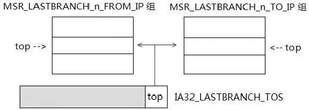

<!-- @import "[TOC]" {cmd="toc" depthFrom=1 depthTo=6 orderedList=false} -->

<!-- code_chunk_output -->

- [1. LBR stack机制](#1-lbr-stack机制)
- [2. FROM_IP 与 TO_IP 寄存器](#2-from_ip-与-to_ip-寄存器)
  - [2.1. From/To寄存器中address的格式](#21-fromto寄存器中address的格式)
  - [2.2. 在IA32处理器下的MSR_LASTBRANCH寄存器](#22-在ia32处理器下的msr_lastbranch寄存器)
- [3. IA32_LASTBRANCH_TOS寄存器](#3-ia32_lastbranch_tos寄存器)
- [4. LBR stack的使用](#4-lbr-stack的使用)
  - [4.1. Top指针的回绕](#41-top指针的回绕)

<!-- /code_chunk_output -->

# 1. LBR stack机制

当IA32\_DEBUGCTL寄存器的**LBR位置位**时，使用**LBR stack**记录**branch trace**，LBR stack是使用**数对from/to MSR寄存器来构造的**。

from/to寄存器的数量由处理器的微架构来决定。使用14.1节所说的方法检测处理器的DisplayFamily\_DisplayModel后，在**相应的MSR表**里查出处理器**相应的from/to寄存器对数量**。

如上所示，**LBR stack**由**MSR\_LASTBANCH\_n\_FROM\_IP**和**MSR\_LASTBANCH\_n\_TO\_IP**组成，其结构**与内存的stack结构相似**，也有相应的**Top指针**来确定**LBR stack栈顶(！！！**)位置。

# 2. FROM_IP 与 TO_IP 寄存器

MSR\_LASTBRANCH\_n\_FROM\_IP和MSR\_LASTBRANCH\_n\_TO\_IP是**MSR寄存器**，它们的地址和数量因处理器微架构的不同而不同，在Nehalem微架构下的结构如下所示。

其中IA32\_LASTBRANCH\_x\_FROM/TO\_IP中的**x是指寄存器的编号**，在Nehalem微架构及后续的Westmere和SandyBridge上共有**16对FROM/TO寄存器**，分别如下。

① IA32\_LASTBRANCH\_0\_FROM\_IP到IA32\_LASTBRANCH\_15\_FROM_IP。

② IA32\_LASTBRANCH\_0\_TO\_IP到IA32\_LASTBRANCH\_15\_TO\_IP。

它们的地址分别如下（Nehalem微架构下）。

① `x_FROM_IP`寄存器地址：**从680H到68FH**。

② `x_TO_IP`寄存器地址：**从6C0H到6CFH**。

每个微架构下的处理器**MSR地址可能会不同**（**这些寄存器**可以说是**nonarchitectural**）。

从Nehalem微架构开始**IA32\_LASTBRANCH\_x\_FROM\_IP寄存器**的**Bit 63位是MISPRED位(！！！只有FROM寄存器！！！**)，在Intel64手册里，这个位名叫**MISPRED位**。可是当Bit 63**置位**时，**指示branch是mis\-predicted（非预测的**），清位时是**predicted（预测的**）。

值得注意的是，这些**MSR寄存器**是**Read\-Only（只读的！！！**），不能对它进行写。

在IA\-32e模式下可以使用64位的地址，可是这个64位地址有几种格式依赖于IA32\_PERF\_CAPBILITIES寄存器。

## 2.1. From/To寄存器中address的格式

在**Intel64**处理器下**From/To寄存器**中存放的**address可以有不同的格式**，依赖于`IA32_PERF_CAPABILITIES`寄存器的`[5:0]`域的值，分别如下。

① 000000B时：存放**32位**的格式。

② 000001B时：存放**64位的linear address**格式。

③ 000010B时：存放**64位的EIP值**（注意：与上面的000001B格式是不同的）。

④ 000011B时：存放**64位的EIP**值，并且存放额外的Flag值（即MISPRED位）。

下面是**IA32\_PERF\_CAPABILITIES寄存器的结构**。

注意，**这个MSR寄存器是只读**的，因为只能从它读出值，在它的[5：0]就是LBR format域，它的值就是上面所述的4个值（在图中只注明了3个值，不包括3值）

因此，要确定**From/To寄存器**里存放的**地址是什么格式**，需要从**IA32\_PERF\_CAPABILITIES寄存器**读出**LBR format域**来判断。

我们关注到在**64位**下有**3种不同的64位地址**格式。

① **64位linear address格式**：那么From/To寄存器将存放经过segmentation（段式管理）转换过来的**linear address值**。

② **64位的RIP值**：那么From/To寄存器将存放RIP寄存器的值，这个值是**未经过转换的effective address值（即逻辑地址**），也就是在程序代码中所直接看到的RIP值。

③ **64位的RIP值**加上**额外的MISPRED标志位**。在From寄存器的bit 63位就是MISPRED标志位。

在**Intel64**和AMD64体系的64位模式下都使用**平坦的内存模式**，**CS段**的**base**都**强制为0值**。因此，实际上在**64位模式下**，**64位的RIP值**与**64位的linear address的存放格式是一样**的。

可是，当处理器运行在**IA\-32e模式**的**compatibility模式**下，这个64位的RIP与64位的linear address格式就**可能不同**了（在**大多数OS**下使用**平坦的内存模式**，**各个段的base值使用0值**，因此**大多数情况下还是相同的！！！**）。

在**compatibility模式**下，64位的地址值只有**低32位是有效**的。高32位值将被清0。

## 2.2. 在IA32处理器下的MSR_LASTBRANCH寄存器

在32位体系（不支持Intel64体系）的处理器下，LBR stack使用共4个MSR\_LASTBRANCH\_x寄存器来组成，从MSR\_LASTBRANCH\_0到MSR\_LASTBRANCH\_3，其结构如下。

在32位处理器下将64位的MSR寄存器分为两个32位的from/to寄存器使用，低32位是FROM\_IP寄存器，高32位是TO\_IP寄存器。这些地址是32位的linear address形式。

在早期的NetBurst微架构的Pentium4处理器是属于32位的处理器，不支持Intel64体系（即不支持IA-32e模式）。

# 3. IA32_LASTBRANCH_TOS寄存器

**LBR stack**中的**Top指针**由**IA32\_LASTBRANCH\_TOS寄存器**来担任，如下所示。

IA32\_LASTBRANCH\_TOS寄存器的**低4位[3：0**]是**LBR stack的top指针值(！！！**)，它指向共**16个LBR stack entry值**，TOP指针指向**最后一条捕获的分支记录(！！！**)。

IA32\_LASTBRANCH\_TOS将**同时指出From\_IP和To\_IP寄存器的位置**，因此当前的From\_IP和To\_IP寄存器位置是相同的。IA32\_LASTBRANCH\_TOS寄存器的地址在1C9H，属于architectural化的寄存器，在各个微架构中地址都是统一的。

# 4. LBR stack的使用

LBR stack的使用几乎与内存stack是一样的，**最大的不同**如下。

① **LBR stack的top指针**是**加1**指向**下一个stack元素**（似乎可以说是向上增长）。

② **内存stack**的**ESP/RSP指针是减4/8**，指向**下一个stack元素**，它是向下增长的。

## 4.1. Top指针的回绕

在LBR stack中，目前实现仅仅**只有16个stack entry(！！！**)。因此，这个LBR stack很快就会**写满**了。当LBR stack写满时**IA32\_LASTBRANCH\_TOS的值会重新回到0值**，重新指向开头的IA32\_LASTBRANCH\_0\_FROM\_IP和IA32\_LASTBRANCH\_0\_TO\_IP寄存器。

在后面我们将会看到，**BTS buffer写满**时可以产生一个**DS Interrupt**来做相应的处理。