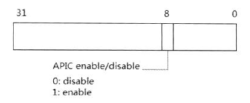

<!-- @import "[TOC]" {cmd="toc" depthFrom=1 depthTo=6 orderedList=false} -->

<!-- code_chunk_output -->

- [1. 检测local APIC版本](#1-检测local-apic版本)
  - [1.1. 检测是否支持x2APIC](#11-检测是否支持x2apic)
- [2. 开启和关闭local APIC](#2-开启和关闭local-apic)
  - [2.1. global enable/disable APIC](#21-global-enabledisable-apic)
  - [2.2. software enable/disable APIC](#22-software-enabledisable-apic)
  - [2.3. 开启x2APIC模式](#23-开启x2apic模式)

<!-- /code_chunk_output -->

local APIC的**核心功能**由**一组可编程的APIC寄存器**实现，在**使用local APIC之前软件应该检测是否支持local APIC**。

# 1. 检测local APIC版本

注: cpuid指令用于Intel IA32架构下获取CPU信息, 详见其他内容

从**P6系列**处理器开始，可以使用**CPUID指令**检测芯片上local APIC的存在或不支持。

**软件**首先需要检测**是否支持APIC on Chip上的local APIC**。使用`CPUID.01H：EDX[9]`位来检测，`EDX[9]=1`时支持local APIC。

在P6和Pentium处理器后使用的将是APIC版本，从Pentium 4开始**默认使用的是xAPIC版本**。

代码清单18-1（lib\apic.asm）：

```x86asm
；-----------------------------------------------------------
； support_apic（）：检测是否支持 APIC on Chip的 local APIC
；----------------------------------------------------
support_apic：
      mov eax，1
      cpuid
      bt edx，9    ； APIC bit
      setc al
      movzx eax，al
      ret
```

上面这段代码是个示例。**返回1值**时，在pentium4后的处理器是支持**xAPIC版本**。

上面只是检测**是否支持Local APIC**, 下面是检测**是否支持x2APIC版本**的

## 1.1. 检测是否支持x2APIC

使用`CPUID.01H：ECX[21]`位来检测**是否支持x2APIC**，如以下代码所示。

代码清单18-2（lib\apic.asm）：

```x86asm
；--------------------------------------------
； support_x2apic（）：检则是否支持 x2apic
；--------------------------------------------
support_x2apic：
      mov eax，1
      cpuid
      bt ecx，21
      setc al     ； x2APIC bit
      movzx eax，al
      ret
```

support\_x2apic（）函数返回1时支持x2APIC体系。

>实验18-1：检测是否支持local APIC与x2APIC

下面作为实验18-1我们可以检测一下我们的处理器是否支持local APIC和x2APIC，实验代码很简单，只是使用上面的support\_apic（）和support\_x2apic（）函数来检测。

完整的源代码在topic18\ex18-1\proected.asm文件里。


上面是Bochs里的运行结果，笔者开启了**Bochs的x2APIC选项**，在笔者的移动Core i5处理器上并不支持x2APIC，在VMware上运行x2APIC也是不支持的。

# 2. 开启和关闭local APIC

可以使用**两种方式开启和关闭local APIC**。

① global enable/disable APIC（在**global层面**上开启和关闭local APIC）。

② software enable/disable APIC（**软件临时**开启和关闭local APIC）。

## 2.1. global enable/disable APIC

软件可以使用**IA32\_APIC\_BASE寄存器**来**开启和关闭local APIC**，它的结构如下。


上图中的**IA32\_APIC\_BASE寄存器**是在**支持x2APIC的体系**下，在**不支持x2APIC**的情况下**bit 10位是保留位**。**IA32\_APIC_BASE寄存器**还可以**设置APIC寄存器的基地址**。这个地址值的**宽度依赖于MAXPHYADDR**值。

**bit 11位是APIC enable位**，当EN=0时**关闭APIC**，在这个情况下**等于处理器内没有APIC on Chip的APIC**，因此这个位将**影响到CPUID.01H：EDX[9]标志位(！！！**)的结果。

代码清单18-3（lib\apic.asm）：

```x86asm
；------------------------------
； clear_apic（）：清掉 local apic
；------------------------------
clear_apic：
      mov ecx，IA32_APIC_BASE
      rdmsr
      btr eax，11       ； clear APIC enable flag
      wrmsr
      ret
```

上面的代码用于**清IA32\_APIC\_BASE寄存器的APIC enable位(这里通过了MSR寄存器**)，我们可以测试一下。


当**清掉IA32\_APIC\_BASE[11]位**时，使用support\_apic()函数返回的结果是0，**不支持APIC功能**。

**在Pentium和P6处理器的APIC版本**里，使用**IA32\_APIC\_BASE寄存器的enable位来关闭APIC**，要**重新打开APIC必须经过reset重启**。在**xAPIC版本**里（使用system bus通信的Pentium 4处理器上）**重新开启APIC无须reset**。

在**关闭APIC前**，软件应该**确认没有中断需要传送**，local APIC寄存器设置的信息可能会丢失。

## 2.2. software enable/disable APIC

软件也可以使用**SVR（Spurious Interrupt Vector**）来**临时打开和关闭APIC**，SVR如下。



**SVR的地址**在**APIC\_BASE的F0h偏移量**上，**bit 8位是APIC enable位**。**只有当IA32\_APIC\_BASE[11]为1时（即开启APIC**），**SVR的APIC enable才有意义**。

在**IA32\_APIC\_BASE[11]=1**时，**SVR[8]=0**，可以**临时关闭APIC**。只有当**IA32\_APIC\_BASE[11]=1**并且**SVR[8]=1**时，**APIC才真正开启**。

代码清单18-4（lib\apic.asm）：

```x86asm
；--------------------------------
； enable_xapic（）
；--------------------------------
enable_xapic：
      bts DWORD [APIC_BASE + SVR]，8  ； SVR.enable=1
      ret
；-------------------------------
； disable_xapic（）
；-------------------------------
disable_xapic：
      btr DWORD [APIC_BASE + SVR]，8  ； SVR.enable=0
      ret
```

上面两个函数分别用来进行software enable和disable APIC。

在**处理器reset**时，SVR的初始值是0x000000FF，**APIC是关闭的**。在**BIOS初始化运行期间**，`SVR[8]`被置为1，**APIC是开启**的。

我们可以测试一下SVR的值，代码如下。

```x86asm
mov eax，[APIC_BASE + SVR]   ； 读取SVR的值
```

在VMware上运行时，SVR的值为0x0000010F，在真实的机器上也是这个结果。`SVR[8]`已经被BIOS设置为1（开启APIC）。

当**local APIC被disable！！！** 时，**处理器的LINT0**和**LINT1 pin直接被作为INTR！！！和NMI pin！！！** 使用。

在**Intel**机器中，当**Enable APIC**时，**LINT0和LINT1**连接到**8259中断控制器和NMI**，使用**LVT LINT0寄存器**的**mask位**，可以**屏蔽8259中断控制器的中断请求**。然而在AMD机器中8259通过中断消息机制传送到local APIC，也就不能通过LVT LINT0寄存器的mask位进行屏蔽。

## 2.3. 开启x2APIC模式

当检测到处理器支持**x2APIC版本**时，处理器**既支持xAPIC模式也支持x2APIC**模式。经过**BIOS的初始化**后，处理器**开启的是xAPIC**模式。**软件(非BIOS行为！！！**)可以选择使用**IA32\_APIC\_BASE寄存器**来**开启x2APIC模式**，如下表所示。


只有当**IA32\_APIC\_BASE寄存器**的**bit 10(enable x2APIC mode)和bit 11(enable APIC)位同时置位**时，才能**启用x2APIC模式**。Intel明确说明，当**启用x2APIC模式**后，**必须同时清bit 10和bit 11位先关闭local APIC，才能重新启用xAPIC模式**。如果尝试单独清bit 10和bit 11任何一个位，都会引发\#GP异常。

代码清单18-5（lib\apic.asm）：

```x86asm
enable_x2apic：
      mov ecx，IA32_APIC_BASE
      rdmsr
      or eax，0xc00      ； bit 10，bit 11 置位
      wrmsr
      ret
```

上面的enable\_x2apic()函数用来**启用x2APIC模式**。


上面的结果，已经将IA32\_APIC\_BASE寄存器的bit 10和bit 11置位，开启x2APIC模式。在**不支持x2APIC模式的处理器**上，**尝试写bit 10位，将会引发\#GP异常**。