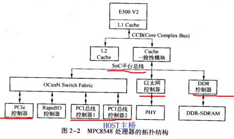
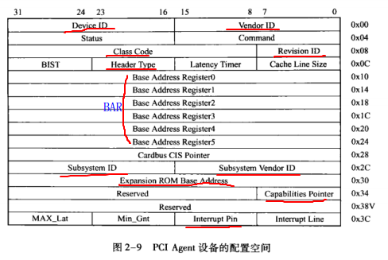
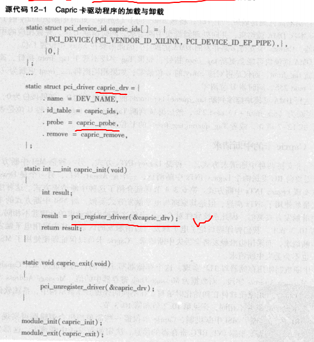

<!-- @import "[TOC]" {cmd="toc" depthFrom=1 depthTo=6 orderedList=false} -->

<!-- code_chunk_output -->

- [第1章 PCI总线的基本知识](#第1章-pci总线的基本知识)
  - [1.1 PCI总线的组成结构](#11-pci总线的组成结构)
    - [1.1.3 PCI设备](#113-pci设备)
    - [1.1.4 HOST处理器](#114-host处理器)
  - [1.2 信号定义](#12-信号定义)
- [第2章 PCI总线的桥和配置](#第2章-pci总线的桥和配置)
  - [2.1 存储器域和PCI总线域](#21-存储器域和pci总线域)
  - [2.2 HOST主桥](#22-host主桥)
  - [2.3 桥和设备的配置空间](#23-桥和设备的配置空间)
  - [2.4 PCI总线的配置](#24-pci总线的配置)
  - [2.5 非透明桥](#25-非透明桥)
- [第3章 PCI总线的数据交换](#第3章-pci总线的数据交换)
  - [3.1 BAR空间的初始化](#31-bar空间的初始化)
  - [3.2 设备的数据传递](#32-设备的数据传递)
  - [3.3 与cache相关的事务](#33-与cache相关的事务)
  - [3.4 预读机制](#34-预读机制)
- [第4章 PCIe总线概述](#第4章-pcie总线概述)
  - [4.1 pcie 总线基础知识](#41-pcie-总线基础知识)
  - [4.2 PCIE体系结构组成部件](#42-pcie体系结构组成部件)
  - [4.3 pcie设备的扩展配置空间](#43-pcie设备的扩展配置空间)
- [第5章 Montevina 的MCH和ICH](#第5章-montevina-的mch和ich)
  - [5.1 pci0的device0设备，管理PCI总线地址和存储器地址](#51-pci0的device0设备管理pci总线地址和存储器地址)
  - [5.2 存储空间的组成结构](#52-存储空间的组成结构)
  - [5.3 存储器域的PCI总线地址空间](#53-存储器域的pci总线地址空间)
- [第6章 PCIE事务层](#第6章-pcie事务层)
- [第7章 链路层和物理层](#第7章-链路层和物理层)
- [第8章 链路训练和电源管理](#第8章-链路训练和电源管理)
- [第9章 流量控制](#第9章-流量控制)
- [第10章 MSI和MSI\-X中断机制](#第10章-msi和msi-x中断机制)
- [第11章 PCI/PCIE的序](#第11章-pcipcie的序)
- [第12章 PCIE总线的应用](#第12章-pcie总线的应用)
  - [12.1 capric卡的工作原理](#121-capric卡的工作原理)
  - [12.3 基于pcie的设备驱动](#123-基于pcie的设备驱动)
  - [12.4 带宽和时延](#124-带宽和时延)
- [第13章 PCI与虚拟化技术](#第13章-pci与虚拟化技术)

<!-- /code_chunk_output -->

https://www.cnblogs.com/yuanming/p/6904474.html

PCI总线作为处理器系统的局部总线，主要目的是为了连接外部设备，而不是作为处理器的系统总线连接Cache和主存储器 

PXI 规范是CompactPCI规范的扩展 , 面向仪器系统的PCI扩展

PCI Express的接口根据总线位宽不同而有所差异，包括X1、X4、X8以及X16。较短的PCI Express卡可以插入较长的PCI Express插槽中使用。

# 第1章 PCI总线的基本知识

PCI Express总线简称为PCIe总线，PCI-to-PCI桥简称为PCI桥，PCI Express-to-PCI桥简称为PCIe桥，Host-to-PCI主桥简称为HOST主桥。值得注意的是许多书籍将HOST主桥称为PCI主桥或者PCI总线控制器。

1) PCI总线规范定格在V3.0。PCI总线规范的许多内容都与基于IA (Intel Architecture)架构的x86处理器密切相关

2) HOST主桥的一个重要作用就是将处理器访问的存储器地址转换为PCI总线地址。 

3) 在1颗PCI总线树上，最多只能挂接256个PCI设备(包括PCI桥)。 

4) PCI设备使用的地址可以根据需要由系统软件动态分配 

5) 每一个PCI设备都有独立的配置空间，在配置空间中含有该设备在PCI总线中使用的基地址，系统软件可以动态配置这个基地址，从而保证每一个PCI设备使用的物理地址并不相同。PCI桥的配置空间中含有其下PCI子树所能使用的地址范围。

6) 32位/33MHz的PCI总线可以提供132MB/s的峰值带宽， PCIE可达几个GB

7) HOST主桥和PCI桥都包含PCI总线仲裁器，PCI设备通过仲裁获得PCI总线的使用权后，才能进行数据传送

8) PCI总线的外部设备，如网卡、声卡、USB扩展卡等， 显卡是AGP总线（会往PCIe过渡）

x86处理器将PCI总线作为标准的局部总线连接各类外部设备，PowerPC、MIPS处理器也将PCI总线作为标准局部总线。

在ARM处理器中，使用SoC平台总线，即AMBA总线，连接片内设备。 

9)PCI总线上的设备可以通过四根中断请求信号INTA~D#向处理器提交中断请求

## 1.1 PCI总线的组成结构

1) HOST主桥与主存储器控制器在同一级总线上，PCI设备可以方便地通过HOST主桥访问主存储器，即进行DMA操作。

2) 处理器与PCI设备间的数据交换主要由“处理器访问PCI设备的地址空间”和“PCI设备使用DMA机制访问主存储器”这两部分组成。 

有几个HOST主桥，就有几个PCI总线域。 

3) HOST主桥在处理器系统中的位置并不相同，如PowerPC处理器将HOST主桥与处理器集成在一个芯片中。

而有些处理器不进行这种集成，如x86处理器使用南北桥结构，处理器内核在一个芯片中，而HOST主桥在北桥中。

### 1.1.3 PCI设备 

1) 在PCI总线中有三类设备，PCI主设备、PCI从设备和桥设备。

其中PCI从设备只能被动地接收来自HOST主桥，或者其他PCI设备的读写请求；

而PCI主设备可以通过总线仲裁获得PCI总线的使用权，主动地向其他PCI设备或者主存储器发起存储器读写请求。

2) 一个PCI设备可以即是主设备也是从设备 (叫做PCI Agent)，但是在同一个时刻，这个PCI设备或者为主设备或者为从设备。

网卡、显卡、声卡等设备都属于PCI Agent设备

### 1.1.4 HOST处理器

HOST主桥中，设置了许多寄存器，HOST处理器通过操作这些寄存器管理这些PCI设备。

如在x86处理器的HOST主桥中设置了0xCF8和0xCFC这两个I/O端口访问PCI设备的配置空间

## 1.2 信号定义

1) PCI 是共享总线， 通过一系列信号与PCI总线相连，这些信号由地址/数据信号、控制信号、仲裁信号、中断信号等多种信号组成。

也是同步总线，每一个设备都具有一个CLK信号，其发送设备与接收设备使用这个CLK信号进行同步数据传递。

# 第2章 PCI总线的桥和配置

## 2.1 存储器域和PCI总线域

1) 每个桥和设备都有配置空间，由HOST主桥管理

2）处理器包括多个CPU，外部cache，中断控制器，DRAM控制器

x86中，PCI总线统一管理全部外部设备

3）PCI总线地址空间在初始化时映射成为存储器域的存储地址

如32位的PCI总线中，每一个总线域的地址范围都是0x0000 0000 \~ 0xFFFF FFFF

## 2.2 HOST主桥

1) PowerPC MPC8548处理器

AMBA: ARM中典型的soc平台总线

RapidIO总线是用于解决背板互连的外部总线

2) 配置空间的访问

用ID号寻址，ID号包括：总线号，设备号，功能号

总线号由系统软件决定，与主桥相连的PCI总线编号为0

设备号由设备的IDSEL信号与总线地址线的连接关系确定；

功能号与设备的具体设计相关，大多只有一个功能设备

a. 内部寄存器 存放在BASE\_ADDR为起始地址的“1MB的物理地址空间”中，通过BASE\_ADDR+ 0x8000即为CFG\_ADDR

CFG\_ADDR 保存ID号和寄存器号，要访问配置空间时，需先设置该寄存器

CFG\_DATA是大端，PCI设备的 配置寄存器 采用小端编址

b. 存储器地址转换为PCI地址 outbound

ATMU寄存器组包括outbound和inbound寄存器组

3) x86的HOST主桥

x86有两个I/O端口寄存器，分别为CONFIG\_ADDRSS和CONFIG\_DATA，0xCF8和0xCFC

x86处理器采用小端地址模式，南北桥升级为MCH和ICH，MCH基础存储器控制器、显卡芯片、HOST\-to\-PCIe主桥

ICH包括LPC、IDE、USB总线；而最新的nehalem I7中，MCH一分为二，存储控制器和图形控制器与CPU内核集成，剩下与ICH合并为PCH

## 2.3 桥和设备的配置空间

1) 三种类型的配置空间：PCI agent， PCI桥， cardbus桥片

PCI桥不需要驱动来设置，被称为透明桥，还有种非透明的PCI桥

PCI设备将配置信息存放在E2PROM中，上电初始化时，把E2PROM读到配置空间中作为初始值，由硬件逻辑完成；然后系统会根据DFS算法初始化配置空间。

2) PCI agent配置

vendor id , 生产厂商， intel是0x8086, 0xffff无效

device id, 具体设备， 这两个是由PCISIG 分配的。

revision id, 版本号

class code, PCI设备的分类， 包括base class code (显卡、网卡、PCI桥等）， sub class code,  interface

header type, 区分 PCI Agent、 桥、 cardbus

Expansion ROM base address ， 有些设备需要在操作系统运行前完成初始化，如显卡，键盘，硬盘，这个PCI设备需要运行ROM的地址

capabilities pointer， capabilities组的基地址，存放扩展配置信息，PCI可选，PCI-X和PCIE设备必须支持

interrupt line ， PCI设备使用的中断向量号， 驱动得到后，注册ISR到OS, 只对8259A中断控制器有效，多数处理器没有用这个

interrupt pin， 使用的中断引脚，1表示INTA#

base address register 0~5, BAR 保存基地址， linux用pci\_resource\_start读，ioremap物理地址转为逻辑地址，直接读BAR不对（得到PCI物理地址）

command, 命令寄存器，设置才能访问IO和存储

status， 得到设备状态

letency timer， 控制PCI设备占用总线的时间

3) 桥的配置空间

## 2.4 PCI总线的配置

1) 两种配置请求： type 00, type 01, 穿桥只能01

2)系统软件用DFS初始化bus号，device号

## 2.5 非透明桥

1) 可以方便的连接两个处理器系统（不是cpu)，对PCI总线x域和y域进行隔离，但不隔离存储器域空间

# 第3章 PCI总线的数据交换

## 3.1 BAR空间的初始化

1) 系统使用DFS遍历PCI总线时会初始化BAR等寄存器，然后就可以进行数据传递

2) powerPC中通过inbound和outbound实现两域之间的转换；x86没有这个机制，而是直接相等，但还是是不同域的地址

## 3.2 设备的数据传递

## 3.3 与cache相关的事务

1) powerPC 设置inbound来设置是否进行cache一致性操作

x86使用MTRR寄存器设置

(cache好复杂，待续)

## 3.4 预读机制

1) 使用预读机制降低了cache行失效带来的影响，有 指令预读、数据预读、外部设备的预读队列、操作系统的预读策略

指令预读：CPU根据程序的执行情况，提前把指令从主存预读到指令cache中

# 第4章 PCIe总线概述

## 4.1 pcie 总线基础知识

1) PCI是并行连接，一条总线上的多个设备共享总线带宽；

PCIe是差分总线，端到端连接，频率更高；

2) 一个数据通路（Lane）,有两组差分信号，即4根信号线，TX部件和RX部件相连（这为一组）

一个pcie链路可以有多个lane

2.a) 一个差分信号由D+和D-两根信号组成，接收端通过比较它们的差值来判断是1还是0，与单端信号比，抗干扰能力更强。

2.b)外部噪声加在两根信号上的影响一样，所以可以使用更高的总线频率

3) pcie链路支持1、2、4、8、16、32个lane，即支持这些数据位宽, 常用的是x1

intel的ICH集成了多个x1的pcie链路，MCH集成了x16的pcie链路用于连接显卡控制器

powerPC支持 x1,x2,x4,x8    

PCIE不分多少数据位，PCI\-E总线更类似串行线，**一次通信走1个Bit**。比较快主要是频率高，V3.0总线频率达4Ghz,单lane的峰值可达8GT/s=8Gb/s

表4\‑1 **PCIe总线规范**与**总线频率**和**编码**的关系

<table>
    <tr>
        <th rowspan="2">PCIe总线规范</th>
        <th rowspan="2">总线频率</th>
        <th rowspan="2">单Lane的峰值带宽</th>
        <th rowspan="2">编码方式</th>
        <th rowspan="1", colspan="4">吞吐量
            <tr>
                <th>x1</th>
                <th>x4</th>
                <th>x8</th>
                <th>x16</th>
            </tr>
        </th>
    </tr>
    <tr>
        <th>1.x</th>
        <th>1.25GHz</th>
        <th>2.5GT/s</th>
        <th>8/10b编码</th>
        <th>250MB/s</th>
        <th>1GB/s</th>
        <th>2GB/s</th>
        <th>4GB/s</th>
    </tr>
    <tr>
        <th>2.x</th>
        <th>2.5GHz</th>
        <th>5GT/s</th>
        <th>8/10b编码</th>
        <th>500MB/s</th>
        <th>2GB/s</th>
        <th>4GB/s</th>
        <th>8GB/s</th>
    </tr>
    <tr>
        <th>3.x</th>
        <th>4GHz</th>
        <th>8GT/s</th>
        <th>128/130b编码</th>
        <th>984.6MB/s</th>
        <th>3.938GB/s</th>
        <th>7.877GB/s</th>
        <th>15.754GB/s</th>
    </tr>
    <tr>
        <th>4.x</th>
        <th>8GHz</th>
        <th>16GT/s</th>
        <th>128/130b编码</th>
        <th>1.969GB/s</th>
        <th>7.877GB/s</th>
        <th>15.754GB/s</th>
        <th>31.508GB/s</th>
    </tr>
    <tr>
        <th>3.x</th>
        <th>16GHz</th>
        <th>32 or 25GT/s</th>
        <th>128/130b编码</th>
        <th>3.9 or 3.08GB/s</th>
        <th>15.8 or 12.3GB/s</th>
        <th>31.5 or 24.6GB/s</th>
        <th>63.0 or 49.2GB/s</th>
    </tr>
</table>

目前最新量产使用的是PCIe 3.x

注: 这里的**总线频率**指的是**差分信号**按照**逻辑"0**"和"**1**"**连续变化时的频率(！！！**)

1GHz是10\^9(10的9次方), 每秒10的9次方

**PCIe 3.0**的**总线频率4GHz**, 即**每秒变化4 x (10的9次方)次**; **一个数据通路(Lane**)有**两组差分信号**, 两两分组, **每组一次1位**, 也就是说**一次可以传输2 bit**, 也就是说每条数据通路(Lane)每秒传输8 x (10的9次方)次, 这就是上面的**单Lane的峰值带宽(！！！次数概念！！！**); 一个数据通路(Lane)**每秒传输8 x (10的9次方)个bit**, 即**每一条Lane 上支持每秒钟内传输 8G个bit**; 由于编码是128/130b, 所以**每一条Lane支持 8 \* 128 / 130 = 7876923080 bps = 984615385 B/s ≈ 984.6MB/s**. 也就是上面的吞吐量

GT/s是Giga Transmissionper second （千兆传输/秒），即**每一秒内传输的次数**。重点在于描述物理层通信协议的速率。

Gbps —— Giga Bits Per Second （千兆位/秒）。

GT/s 与Gbps 之间不存在成比例的换算关系。GT/s着重描述端口的速率属性，可以不和链路宽度等关联，这样来描述“可以进行链路宽度扩展”的高速串行接口更为合适一些。 需要**结合具体的物理层通信协议**来分析。

例如: **PCI\-e2.0** 协议支持**5.0 GT/s**, 即**每一条Lane 上支持每秒钟内传输 5G个bit(5Gbps**)；但这**并不意味着 PCIe 2.0协议的每一条Lane支持 5Gbps 的速率(！！！**)。为什么这么说呢？ 因为PCIe 2.0 的物理层协议中使用的是 **8b/10b的编码机制**。 即**每传输8个bit，需要发送10个bit**；这**多出的2个bit**并**不是对上层有意义的信息**。 那么，**PCIe 2.0**协议的**每一条Lane支持 5 \* 8 / 10 = 4Gbps 的速率(！！！**)。 以一个PCIe 2.0 x8的通道为例，x8的可用带宽为 4 \* 8 = 32 Gbps。
 
4) PCIE使用的信号

pcie设备使用2种电源信号供电，Vcc 和 Vaux， 电压为3.3v, Vcc为主电源

PERST#信号， 全局复位，复位设备

REFCLK+ 和 REFCLK-信号，用于与处理器同步

WAKE#， 设备休眠时，主电源停止供电了，可以用该信号通知处理器来唤醒设备

SMCLK, SMDAT, 即SMBus总线，源于I2C，管理处理器系统的外部设备特别是智能电源

JTAG信号，用于芯片内部测试，包括TRST#,TCK,TDI,TDO,TMS信号

PRSNT1#，PRSNT2#, 热插拔相关

5) PCIE总线的层次结构

事务层，接收来自核心层的数据并封装为TLP，还有就是处理pcie中的“序”

数据链路层，继续添加sequence前缀和CRC后缀，有多种DLLP包

物理层，LTSSM状态机管理链路状态，PLP包，系统程序员仍有必要深入理解物理层工作原理

6) pcie链路的扩展

用switch, 1个上游端口连RC，多个下游端口连EP

7) pcie设备的初始化

传统复位convertional reset：包括fundametal 和 non-fundametal, fundametal 又分cold和warm reset； non\-fundametal指的是hot reset

FLR复位只复位与PCIE链路相关的部分逻辑

## 4.2 PCIE体系结构组成部件

1) 大多使用RC、switch、PCIe\-to\-PCI桥连接设备，而基于pcie总线的设备，称为EP（endpoint）

**RC**(PCI Express root complex）根联合体, 相当于**PCIE主桥**，也有称为**pcie总线控制器**

**RC**在**x86**中由**MCH和ICH组成**, PCIe总线端口存储器控制器等接口集成在一起，统称RC

2) PCIE设备包括 EP(如显卡、网卡等）、switch、PCIE桥

3) RC与HOST主桥不同的是还有RCRB,内置PCI设备，event collector

深入理解RC对理解pcie体系结构非常重要

4) switch有一个上游端口和多个下游端口，上游端口连接RC、其他switch的下游端口，也支持crosslink连接方式（上连上，下连下）

其实是多个PCI桥组成的

PCIE 采用虚拟多通路VC技术，这些报文中设定TC标签，分为8类优先权。每条链路最多支持8个VC，用来收发报文。

软件设置哪类TC由哪个VC传递，许多处理器Switch和RC只支持一个VC,而x86和PLX的switch可以支持两个VC

TC和VC是多对一 

5) 不同ingress发向同一个egress端口，涉及端口仲裁和路由选径

switch中设有仲裁器，规定报文通过switch的规则。分别基于VC和基于端口的仲裁机制

6) PCIE桥

## 4.3 pcie设备的扩展配置空间

1) PCIE要求设备必须支持capability结构，重点关注电源管理、MSI中断的capability结构

电源管理capability有PMCR和PMCSR寄存器

2) capability结构：PCIE capability register， device/link/slot 等capability 寄存器

# 第5章 Montevina 的MCH和ICH

intel的一款笔记本平台

pci 0 上的MCH和ICH，是FSB总线的延伸，虚拟的PCI设备，只是使用PCI的管理方法

Intel后续的处理器, 使用QPI总线(又称Multi\-FSB总线)代替了FSB, 南桥使用PCH(Platform Controller Hub)集成南桥代替了ICH. 

Intel在**CPU内部保留了QPI总线**，用于**CPU内部的数据传输**。而在**与外部接口设备进行连接**的时候，需要有一条简洁快速的通道，就是**DMI总线**。这样，这两个总线的传输任务就分工明确了，QPI主管内，DMI主管外。也就是说DMI往下就不是CPU内部了, 尽管PCH和MCH都属于RC的一部分.

## 5.1 pci0的device0设备，管理PCI总线地址和存储器地址

device0被认为是HOST主桥

## 5.2 存储空间的组成结构

存储器域（CPU可访问）、PCI总线域、DRAM域（主存），有些DRAM只能被显卡控制器访问到，不能被cpu访问

legacy地址空间：x86固有的一段1MB内存空间，DOS内存等

DRAM域：大小保存在MCH的TOM中，即PCI0的配置空间中，legacy地址在它里面

存储器域：

## 5.3 存储器域的PCI总线地址空间

PCI总线地址空间氛围 最低可用TOLUD~4GB，TOUUD~64GB

1) APIC 是x86使用的中断控制器

2) ECAM方式读写PCIE扩展配置空间，CONFIG\_ADDRESS和CONFIG\_DATA访问前256B

ECAM是直接映射到内存来访问

# 第6章 PCIE事务层

# 第7章 链路层和物理层

# 第8章 链路训练和电源管理

# 第9章 流量控制

合理的使用物理链路，避免接收端缓冲区容量不足而丢弃发生端的数据，从而要求重新发送。

# 第10章 MSI和MSI\-X中断机制

PCI：必须支持INTx,MSI可选

PCIe: 必须支持MSI，INTx可选

MSI使用存储器写请求TLP向处理器提交中断请求，即MSI报文。PowerPC使用MPIC中断控制器处理MSI中断请求，X86使用FSB interrupt message方式处理。

绝大多数PCIe设备使用MSI提交中断请求

# 第11章 PCI/PCIE的序

序是指数据传送的顺序，保证数据完整性的基础

# 第12章 PCIE总线的应用

## 12.1 capric卡的工作原理

1) PCIe设备: Vetex-5内嵌的EP模块，该模块也被xilinx称为LogiCORE

先主存到FPGA的片内SRAM（DMA读）, 单次DMA最大0X7FF B ， 2KB

SRAM到主存（DMA写）

2) 仅使用BAR0，大小256B，里面有DCSR1/2， WR\_DMA\_ADR/SIZE, INT\_REG, ERR

## 12.3 基于pcie的设备驱动

属于char类型驱动

1) 加载与卸载

这段代码主要作用是软件结构pci\_driver与硬件结构pci\_dev建立联系，pci\_register\_driver会做这个

2) 初始化和关闭

系统在PCI树中发现capric卡后，local\_pci\_probe调用capric\_probe，入口参数pci\_dev和ids，进行初始化

初始化调用pci\_enable\_device使能PCIE设备（会修改command的io space和memory space位看配置空间是否使用它们），调用pcibios\_enable\_irq分配设备使用的中断向量号

DMA掩码：存储域physical\_addr&DMA\_MASK = physical\_addr表示可以对这段内存DMA操作

a) linux中存储器映射的寄存器和io映射的寄存器都是ioresources管理，pci\_request\_regions把capric卡的BAR0使用的resource结构其name设置为DEV\_NAME, flags设为IORESOURCE\_BUSY，

b) pci\_resource\_start 获得pci\_dev资源的BAR0空间的基地址（存储器域物理地址），pci\_read\_config\_word是pci域

c) ioremap将存储器域物理地址映射为linux虚拟地址

d) register\_chrdev 注册char设备驱动

e) pci\_enable\_msi 使能MSI中断请求机制

f) request\_irq(capric\_interrupt) 使用中断服务例程

3) DMA读写

DMA写： 与capric\_read对应

kmalloc，实际驱动中很少在读写服务例程中申请内存，容易产生内存碎片，时间花费也长。

pci\_map\_single虚拟地址转换为PCI物理地址

DMA读：capric\_write

dma\_sync\_single 存储器与cache同步

interruptible\_sleep\_on 等待

4) 中断处理

系统的do\_IRQ调用 capric\_interrupt

这里直接设置读写例程里面的等待事件就好

5) 存储器地址到PCI地址转换

pci\_map\_single， 

最初x86是直接相等的关系，为了支持虚拟化技术使用了VT\-d/IOMMU技术

powerpc是inbound寄存器把PCI转换为存储器地址，inbound可以看做一种IOMMU

6) 存储器与cache同步

低端处理器不支持硬件cache共享一致性，需要在DMA操作之前，用软件将操作的数据区域与cache同步

多数PCI设备，cache一致性可以由硬件保证

## 12.4 带宽和时延

优化：减少对寄存器的读操作，如要读终端控制器状态寄存器可以改为收发等分开的IRQ

流水线ring buffer技术，多路DMA读写并行执行

# 第13章 PCI与虚拟化技术

多个虚拟处理器系统，多个独立的操作系统，用一套CPU、内存和外部设备