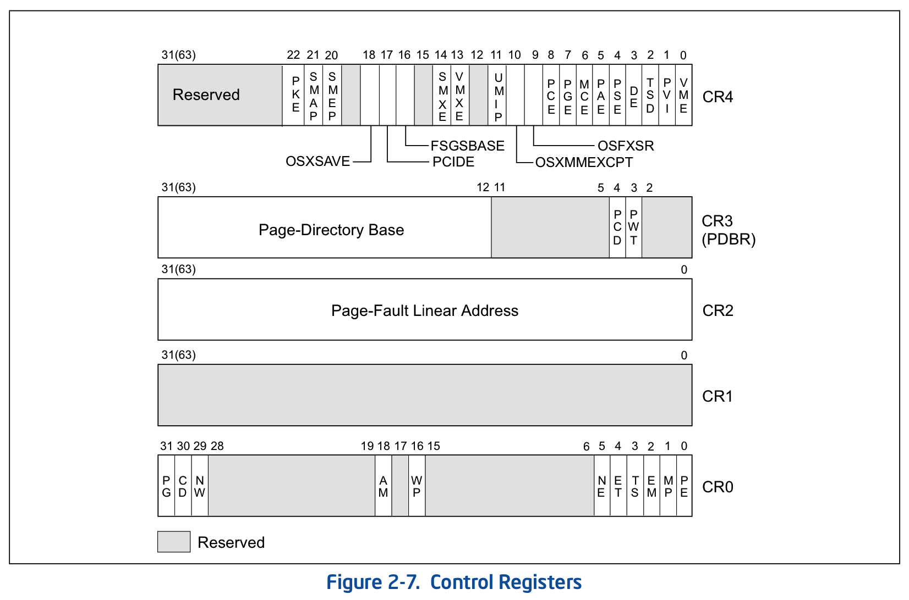

在x64上control register（控制寄存器）被扩展为**64位**，有**CR0～CR15**共**16个寄存器**，可是在**整个体系**的使用中，只使用了其中的**CR0**、**CR2**、**CR3**、**CR4**，以及**CR8寄存器**，其他都是**被保留**的。

它们在**64位模式**下使用**64位**的宽度，在其他模式下依然是**32位宽度**，下面是这些寄存器的**结构图**（来自Intel手册）。

**CR0**与**CR4**结合起来对处理器提供了**根本的控制**，比如处理器的**工作模式**和一些模式中使用的**特色功能**。

**CR2**和**CR3**被使用在**保护模式**的**页管理机制**中。

- **CR2**保存着访内存时引发`#PF异常`的**线性地址值**（典型的如：当访问一个页时，它不在内存中（未映射）或者没有对它进行访问的权限而引发#PF异常）。
- **CR3**提供整个**页转换结构表**的**基地址**，这个基地址是**物理地址**。

详细见: Volume 3: 2.5 Control Registers

下面是控制寄存器的语法描述

