<!-- @import "[TOC]" {cmd="toc" depthFrom=1 depthTo=6 orderedList=false} -->

<!-- code_chunk_output -->

- [1. Segment Selector(段选择子)](#1-segment-selector段选择子)
  - [1.1. Segment Selector的加载](#11-segment-selector的加载)
  - [1.2. Null Selector在64位模式下](#12-null-selector在64位模式下)
    - [1.2.1. 加载Null selector到SS段寄存器](#121-加载null-selector到ss段寄存器)
  - [1.3. 隐式地加载Null selector](#13-隐式地加载null-selector)
- [2. Descriptor Table（描述符表）](#2-descriptor-table描述符表)
  - [2.1. 描述符表寄存器](#21-描述符表寄存器)
  - [2.2. GDTR](#22-gdtr)
  - [2.3. GDTR的加载](#23-gdtr的加载)
  - [2.4. GDT的limit](#24-gdt的limit)
- [3. Segment Selector Register（段寄存器）](#3-segment-selector-register段寄存器)
- [4. Segment Descriptor（段描述符）](#4-segment-descriptor段描述符)
  - [4.1. 描述符（Descriptor）的种类](#41-描述符descriptor的种类)
  - [4.2. 代码段描述符](#42-代码段描述符)
    - [4.2.1. Accessed访问标志](#421-accessed访问标志)
    - [4.2.2. Readable可读类型](#422-readable可读类型)
    - [4.2.3. conforming与non-conforming代码段](#423-conforming与non-conforming代码段)
    - [4.2.4. DPL属性](#424-dpl属性)
    - [4.2.5. S属性](#425-s属性)
    - [4.2.6. P属性](#426-p属性)
    - [4.2.7. D/B属性](#427-db属性)
    - [4.2.8. long mode下的D/B属性](#428-long-mode下的db属性)
    - [4.2.9. L属性](#429-l属性)
    - [4.2.10. G属性](#4210-g属性)
  - [4.3. long mode下的Code段描述符](#43-long-mode下的code段描述符)
  - [4.4. 代码段寄存器的加载](#44-代码段寄存器的加载)
    - [4.4.1. 加载CS寄存器的常规检查](#441-加载cs寄存器的常规检查)
      - [4.4.1.1. selector的检查](#4411-selector的检查)
      - [4.4.1.2. limit的检查](#4412-limit的检查)
      - [4.4.1.3. Code segment类型的检查](#4413-code-segment类型的检查)
    - [4.4.2. 用far pointer加载CS寄存器](#442-用far-pointer加载cs寄存器)
    - [4.4.3. 使用call gate加载CS寄存器](#443-使用call-gate加载cs寄存器)
      - [4.4.3.1. offset域](#4431-offset域)
      - [4.4.3.2. selector域](#4432-selector域)
      - [4.4.3.3. cnt域](#4433-cnt域)
      - [4.4.3.4. Call-gate的DPL值](#4434-call-gate的dpl值)
      - [4.4.3.5. gate selector和gate descriptor的常规检查](#4435-gate-selector和gate-descriptor的常规检查)
      - [4.4.3.6. 使用call指令调用call-gate时的权限检查](#4436-使用call指令调用call-gate时的权限检查)
      - [4.4.3.7. 加载selector及code segment descriptor到CS寄存器](#4437-加载selector及code-segment-descriptor到cs寄存器)
      - [4.4.3.8. 权限的切换](#4438-权限的切换)
      - [4.4.3.9. 当使用jmp指令调用call-gate时](#4439-当使用jmp指令调用call-gate时)
      - [4.4.3.10. stack的切换](#44310-stack的切换)
      - [4.4.3.11. long-mode下的Call-gate](#44311-long-mode下的call-gate)
      - [4.4.3.12. 64位Call-gate的offset值](#44312-64位call-gate的offset值)
      - [4.4.3.13. 64位Call-gate中的selector](#44313-64位call-gate中的selector)
      - [4.4.3.14. 64位Call-gate的调用](#44314-64位call-gate的调用)
      - [4.4.3.15. 在compatibility模式下对64位Call-gate的调用](#44315-在compatibility模式下对64位call-gate的调用)
    - [4.4.4. 使用TSS selector调用加载CS寄存器](#444-使用tss-selector调用加载cs寄存器)
      - [4.4.4.1. TSS descriptor](#4441-tss-descriptor)
      - [4.4.4.2. TSS类型](#4442-tss类型)
      - [4.4.4.3. 提供TSS selector进行call或jmp调用](#4443-提供tss-selector进行call或jmp调用)
      - [4.4.4.4. TSS selector及TSS描述符的常规检查](#4444-tss-selector及tss描述符的常规检查)
      - [4.4.4.5. 权限检查](#4445-权限检查)
      - [4.4.4.6. 对原TSS descriptor进行处理](#4446-对原tss-descriptor进行处理)
      - [4.4.4.7. 保存原处理器状态](#4447-保存原处理器状态)
      - [4.4.4.8. 在新的TSS段写入原TSS selector](#4448-在新的tss段写入原tss-selector)
      - [4.4.4.9. 置Eflags.NT标志位](#4449-置eflagsnt标志位)
      - [4.4.4.10. CR0.TS标志位置位](#44410-cr0ts标志位置位)
      - [4.4.4.11. 新task的TSS descriptor Busy被置位](#44411-新task的tss-descriptor-busy被置位)
      - [4.4.4.12. 加载TR](#44412-加载tr)
      - [4.4.4.13. 加载CS寄存器及其他寄存器](#44413-加载cs寄存器及其他寄存器)
    - [4.4.5. 使用iret指令进行任务切换](#445-使用iret指令进行任务切换)
    - [4.4.6. 使用Task-gate加载CS寄存器](#446-使用task-gate加载cs寄存器)
      - [4.4.6.1. Selector域](#4461-selector域)
      - [4.4.6.2. Task-gate的类型](#4462-task-gate的类型)
      - [4.4.6.3. selector和Task-gate描述符的常规检查](#4463-selector和task-gate描述符的常规检查)
      - [4.4.6.4. 访问Task-gate的权限检查](#4464-访问task-gate的权限检查)
    - [4.4.7. 在long-mode下TSS及任务切换](#447-在long-mode下tss及任务切换)
      - [4.4.7.1. long-mode下的TSS段](#4471-long-mode下的tss段)
      - [4.4.7.2. 64位模式下的TSS描述符](#4472-64位模式下的tss描述符)
      - [4.4.7.3. long-mode下的TR加载](#4473-long-mode下的tr加载)
    - [4.4.8. 使用int指令加载CS寄存器](#448-使用int指令加载cs寄存器)
      - [4.4.8.1. IDTR中断描述符表寄存器](#4481-idtr中断描述符表寄存器)
      - [4.4.8.2. Interrupt/Trap gate descriptor](#4482-interrupttrap-gate-descriptor)
      - [4.4.8.3. 访问gate descriptor](#4483-访问gate-descriptor)
      - [4.4.8.4. 常规检查](#4484-常规检查)
      - [4.4.8.5. 权限的检查](#4485-权限的检查)
      - [4.4.8.6. Interrupt/Trap-gate与Call-gate的异同](#4486-interrupttrap-gate与call-gate的异同)
      - [4.4.8.7. long-mode下的Interrupt/Trap-gate描述符](#4487-long-mode下的interrupttrap-gate描述符)
      - [4.4.8.8. gate的类型](#4488-gate的类型)
      - [4.4.8.9. IST指针域](#4489-ist指针域)
    - [4.4.9. 使用int3、into，以及bound指令加载CS寄存器](#449-使用int3-into以及bound指令加载cs寄存器)
      - [4.4.9.1. #OF异常](#4491-of异常)
      - [4.4.9.2. #BP异常](#4492-bp异常)
      - [4.4.9.3. #BR异常](#4493-br异常)
    - [4.4.10. 使用RETF指令加载CS与SS寄存器](#4410-使用retf指令加载cs与ss寄存器)
      - [4.4.10.1. 权限的处理](#44101-权限的处理)
      - [4.4.10.2. Selector与所使用的Descriptor的权限检查](#44102-selector与所使用的descriptor的权限检查)
      - [4.4.10.3. Selector及Descriptor的类型检查](#44103-selector及descriptor的类型检查)
      - [4.4.10.4. CS与SS寄存器的加载](#44104-cs与ss寄存器的加载)
      - [4.4.10.5. 隐式的Null selector加载](#44105-隐式的null-selector加载)
    - [4.4.11. 在long-mode下使用RETF指令](#4411-在long-mode下使用retf指令)
      - [4.4.11.1. 从64位模式返回到64位模式](#44111-从64位模式返回到64位模式)
      - [4.4.11.2. 从64位模式返回到compatibility模式](#44112-从64位模式返回到compatibility模式)
      - [4.4.11.3. 从compatibility模式返回到64位模式](#44113-从compatibility模式返回到64位模式)
      - [4.4.11.4. Jmp指令在64位操作数下的变通](#44114-jmp指令在64位操作数下的变通)
      - [4.4.11.5. Jmp指令使用32位操作数](#44115-jmp指令使用32位操作数)
      - [4.4.11.6. 使用retf指令来切换](#44116-使用retf指令来切换)
    - [4.4.12. 使用IRET指令加载CS和SS寄存器](#4412-使用iret指令加载cs和ss寄存器)
      - [4.4.12.1. 使用IRET指令返回](#44121-使用iret指令返回)
    - [4.4.13. 在long-mode下使用IRETQ指令](#4413-在long-mode下使用iretq指令)
      - [4.4.13.1. 使用IRETQ指令从64位模式返回到64位模式](#44131-使用iretq指令从64位模式返回到64位模式)
      - [4.4.13.2. 使用IRETQ指令从64位模式返回到compatibility模式](#44132-使用iretq指令从64位模式返回到compatibility模式)
      - [4.4.13.3. 使用IRET指令从compatibility模式返回到64位模式](#44133-使用iret指令从compatibility模式返回到64位模式)
    - [4.4.14. 使用SYSENTER/SYSEXIT指令加载CS与SS寄存器](#4414-使用sysentersysexit指令加载cs与ss寄存器)
      - [4.4.14.1. 使用SYSENTER指令进入0级权限代码](#44141-使用sysenter指令进入0级权限代码)
      - [4.4.14.2. 使用SYSEXIT指令退回到3级权限代码](#44142-使用sysexit指令退回到3级权限代码)
      - [4.4.14.3. 非对称地使用sysenter/sysexit指令](#44143-非对称地使用sysentersysexit指令)
      - [4.4.14.4. 设置一个stub函数](#44144-设置一个stub函数)
      - [4.4.14.5. 在3级权限里使用sysenter调用](#44145-在3级权限里使用sysenter调用)
    - [4.4.15. 在IA-32e模式下使用SYSENTER/SYSEXIT指令](#4415-在ia-32e模式下使用sysentersysexit指令)
      - [4.4.15.1. 设置IA-32e模式里的sysenter/sysexit使用环境](#44151-设置ia-32e模式里的sysentersysexit使用环境)
      - [4.4.15.2. 使用SYSENTER指令进入0级64位代码](#44152-使用sysenter指令进入0级64位代码)
      - [4.4.15.3. 从64位模式进入0级64位模式](#44153-从64位模式进入0级64位模式)
      - [4.4.15.4. 从compatibility模式进入0级64位模式](#44154-从compatibility模式进入0级64位模式)
      - [4.4.15.5. 使用SYSEXIT指令返回](#44155-使用sysexit指令返回)
      - [4.4.15.6. 统一使用SYSEXIT指令返回到64位模式](#44156-统一使用sysexit指令返回到64位模式)
    - [4.4.16. 使用SYSCALL/SYSRET指令来加载CS与SS寄存器](#4416-使用syscallsysret指令来加载cs与ss寄存器)
      - [4.4.16.1. 设置SYSCALL指令的使用环境](#44161-设置syscall指令的使用环境)
      - [4.4.16.2. 为SYSCALL指令所准备的stub函数](#44162-为syscall指令所准备的stub函数)
      - [4.4.16.3. SYSCALL版本的系统服务例程](#44163-syscall版本的系统服务例程)
      - [4.4.16.4. 非对称地使用syscall/sysret指令](#44164-非对称地使用syscallsysret指令)
  - [4.5. Stack（栈）结构及Stack的切换](#45-stack栈结构及stack的切换)
    - [4.5.1. Legacy模式下的Stack](#451-legacy模式下的stack)
      - [4.5.1.1. Expand-up类型的stack段（或Data段）](#4511-expand-up类型的stack段或data段)
      - [4.5.1.2. 段Limit值的计算](#4512-段limit值的计算)
      - [4.5.1.3. Expand-up段的有效范围](#4513-expand-up段的有效范围)
      - [4.5.1.4. Expand-down类型的stack段（或Data段）](#4514-expand-down类型的stack段或data段)
      - [4.5.1.5. 段Limit值的计算](#4515-段limit值的计算)
      - [4.5.1.6. Expand-down段的有效范围](#4516-expand-down段的有效范围)
    - [4.5.2. 在64位模式下的Stack](#452-在64位模式下的stack)
    - [4.5.3. Data segment descriptor](#453-data-segment-descriptor)
      - [4.5.3.1. D/B与G标志位](#4531-db与g标志位)
    - [4.5.4. long-mode下的Data segment descriptor](#454-long-mode下的data-segment-descriptor)
      - [4.5.4.1. W标志位](#4541-w标志位)
      - [4.5.4.2. DPL标志位](#4542-dpl标志位)
      - [4.5.4.3. Base域](#4543-base域)
      - [4.5.4.4. FS段和GS段的基地址](#4544-fs段和gs段的基地址)
    - [4.5.5. Stack的使用](#455-stack的使用)
      - [4.5.5.1. 显式使用SS段](#4551-显式使用ss段)
    - [4.5.6. SS寄存器显式加载](#456-ss寄存器显式加载)
      - [4.5.6.1. 使用LSS指令加载](#4561-使用lss指令加载)
      - [4.5.6.2. selector检查](#4562-selector检查)
      - [4.5.6.3. 权限权查](#4563-权限权查)
      - [4.5.6.4. limit检查](#4564-limit检查)
      - [4.5.6.5. Data段描述符类型的检查](#4565-data段描述符类型的检查)
    - [4.5.7. TR的显式加载](#457-tr的显式加载)
      - [4.5.7.1. 置Busy标志位](#4571-置busy标志位)
      - [4.5.7.2. 使用Call-gate调用下的Stack切换](#4572-使用call-gate调用下的stack切换)
      - [4.5.7.3. TSS段里的栈指针](#4573-tss段里的栈指针)
    - [4.5.8. 在long-mode下使用Call-gate调用的Stack切换](#458-在long-mode下使用call-gate调用的stack切换)
      - [4.5.8.1. long-mode下的TSS段里的栈指针](#4581-long-mode下的tss段里的栈指针)
      - [4.5.8.2. 加载Null selector到SS寄存器](#4582-加载null-selector到ss寄存器)
    - [4.5.9. 使用RETF指令返回时的Stack切换](#459-使用retf指令返回时的stack切换)
    - [4.5.10. long-mode下使用RETF指令返回时的Stack切换](#4510-long-mode下使用retf指令返回时的stack切换)
      - [4.5.10.1. 返回到compatibility模式时](#45101-返回到compatibility模式时)
      - [4.5.10.2. 返回到64位模式时](#45102-返回到64位模式时)
      - [4.5.10.3. 从伪造的Call-gate服务例程RETF返回时](#45103-从伪造的call-gate服务例程retf返回时)
    - [4.5.11. 调用中断或中断/异常发生时的Stack切换](#4511-调用中断或中断异常发生时的stack切换)
    - [4.5.12. long-mode下的中断Stack切换](#4512-long-mode下的中断stack切换)
      - [4.5.12.1. IST（Interrupt Stack Table）](#45121-istinterrupt-stack-table)
      - [4.5.12.2. 从compatibility模式进入64位模式](#45122-从compatibility模式进入64位模式)
      - [4.5.12.3. 从64位模式进入64位模式](#45123-从64位模式进入64位模式)
    - [4.5.13. 使用IRET指令返回时的Stack切换](#4513-使用iret指令返回时的stack切换)
      - [4.5.13.1. long-mode下的IRETQ返回Stack切换](#45131-long-mode下的iretq返回stack切换)
      - [4.5.13.2. 返回到compatibility模式时](#45132-返回到compatibility模式时)
      - [4.5.13.3. 从伪造的中断handler环境中返回](#45133-从伪造的中断handler环境中返回)
  - [4.6. Data段](#46-data段)
    - [4.6.1. 段的访问类型限制](#461-段的访问类型限制)
    - [4.6.2. 加载Data段寄存器](#462-加载data段寄存器)
      - [4.6.2.1. selector的检查](#4621-selector的检查)
      - [4.6.2.2. 权限检查](#4622-权限检查)
      - [4.6.2.3. limit的检查](#4623-limit的检查)
      - [4.6.2.4. Data段描述符的检查](#4624-data段描述符的检查)
    - [4.6.3. 加载Code段描述符到Data寄存器](#463-加载code段描述符到data寄存器)
      - [4.6.3.1. 加载non-conforming段的权限检查](#4631-加载non-conforming段的权限检查)
      - [4.6.3.2. 加载conforming段的权限检查](#4632-加载conforming段的权限检查)
    - [4.6.4. long-mode下的Data段寄存器加载](#464-long-mode下的data段寄存器加载)
      - [4.6.4.1. 64位模式下加载Null selector](#4641-64位模式下加载null-selector)
    - [4.6.5. Data段的访问控制](#465-data段的访问控制)
    - [4.6.6. 64位模式下Data段的访问控制](#466-64位模式下data段的访问控制)
- [5. LDT描述符与LDT](#5-ldt描述符与ldt)
  - [5.1. LDT描述符](#51-ldt描述符)
  - [5.2. LDTR的加载](#52-ldtr的加载)
    - [5.2.1. selector检查](#521-selector检查)
    - [5.2.2. limit检查](#522-limit检查)
    - [5.2.3. LDT描述符类型检查](#523-ldt描述符类型检查)
  - [5.3. 64位模式下的LDT描述符](#53-64位模式下的ldt描述符)

<!-- /code_chunk_output -->

# 1. Segment Selector(段选择子)

Segment Selector结构是**16位(恒16位！！！**)，它是一个段的标识符，结构如下。


- RPL（Requested Privilege Level）：请求**访问者**所使用的权限级别，**从0到3级**。
- TI（Table Indicator）：描述符表索引位。当**TI=0**时，从**GDT**查找；当**TI=1**时，从**LDT**查找。
- Index（Descriptor Index）：这是Descriptor在GDT/LDT中的序号，根据TI的值在相应的描述表中查找descriptor。

注意，**段选择子不是段寄存器，不能混为一谈， 段选择子是一个数值，只有16位，段寄存器是寄存器，128位或96位, 其可见部分等于段选择子(！！！**), 段寄存器详见下面节.

由图上可以看到通过段选择子只能选择LDT或GDT, **不会包括IDT**.

当有下面的selector时，

```assembly
selector=0008H           ； RPL=0，TI=0，Index=1
```

表示将在GDT的第1项得到Descriptor，访问者使用的权限是0级。

>当Index为0，并且TI为0时，它在GDT内的第0项，是一个无效的selector，被称为Null selector（TI=1时，有效）。

当selector的值为**0000H到0003H**时，这个selector是**Null selector**，它指向**GDT的第0项**，第0项的Descriptor是unused（不被使用的）。Null selector的作用**类似于C指针中的NULL值**，用于**防止代码对unused segment register（未使用的段寄存器）进行访问**。

**13位的Index**取值范围是0～1FFFH（0～8191），表示selector可以寻址**8192个descriptor**（而0号的Null selector是无效）。

## 1.1. Segment Selector的加载

当代码被允许访问时，**selector值**会被加载到**segment selector register内**，像下面两类典型的访问，就会发生selector的加载。

```assembly
mov ax，0008H                ； selector=08H
mov ds，ax                    ； 加载 selector 到 DS寄存器
```

当descriptor的权限允许以及类型相符时，处理器会加载selector到DS寄存器的selector域里，同时对应的segment descriptor也会被加载到DS寄存器的Cache部分。（段寄存器结构稍后会探讨。）

```assembly
jmp 0008h：00001000h        ； 执行一个far jmp指令
call 0008h：00001000h       ； 执行一个far call指令
```

像上面的指令提供一个far pointer进行jmp/call操作，同样在通过处理器的检查后，处理器会加载selector到CS寄存器的selector域里，同时相应的Code segment descriptor也会被加载到CS寄存器。

注意：**Null selector不允许加载到CS及SS寄存器**，会产生\#GP异常。允许被加载到**ES、DS、FS，以及GS寄存器**中，但是这些寄存器**使用Null selector进行访问**时会产生\#GP异常。

当加载一个Null selector到上述允许的段寄存器时，处理器并不真正读取GDT的第0项segment descriptor到段寄存器中，而是以一个无效的unused descriptor来初始化段寄存器（段寄存器内除了S标志为1外，其他都为0）。

```assembly
mov ax，03H                  ； selector=03H
mov ds，ax                   ； Null-selector 加载
```

DS的结果是：DS.selector=03H，base/limit/attribute=0H（除了S标志为1外）。

## 1.2. Null Selector在64位模式下

在**64位模式**下，处理器对Null selector的使用并不检查。允许加载Null selector到除CS寄存器外的任何一个段寄存器（SS段寄存器有条件限制），以及使用这些Null selector进行访问。

### 1.2.1. 加载Null selector到SS段寄存器

64位模式下，在**非3级权限(！！！**)里，允许为**SS段寄存器加载一个Null selector**，即在0级、1级和2级权限下。假设当前运行在2级权限下，则下面的代码是正确的。

```assembly
mov ax，02H             ;RPL=2
mov ss，ax              ;Null-selector 加载，OK！
```

可是如果当前运行在3级权限下，则下面的代码是错误的。

```assembly
mov ax，03H             ;RPL=3
mov ss，ax              ;Null selector引发 #GP异常
```

**Null selector**的隐晦点在当**使用retf指令（远调用返回**）或**iret指令（中断例程返回**）时，如果**发生权限的改变**，**引发stack切换**的情景下变得更明显。

```assembly
push 3                   ;SS=Null selector
push USER_RSP
push USER_CS | 3         ;切换到 3 级权限代码
push USER_ENTRY
retf                     ;#GP异常，不允许为SS加载3级权限的Null selector
```

在64位模式下，切换到3级的用户代码时，提供Null selector是错误的。明白了不能在3级权限下加载Null selector到SS寄存器后一切都变得豁然开朗了，归根到底还是因为忽视了Null selector的RPL的重要性。

## 1.3. 隐式地加载Null selector

有时候处理器会隐式地为SS寄存器或其他Data Segment寄存器加载一个Null selector，这时候加载Null selector是有用的。

① 在执行**RETF（远过程返回**）或**IRET（中断返回**）指令时：当发生权限的改变（从**高权限切换到低权限**）时，如果**ES**、**DS**，**FS**，以及**GS段寄存器内的DPL值低于CPL**（DPL \< CPL），那么处理器将会为这些段寄存器**隐式地加载Null selector(无论是不是long mode, 都会这样！！！**)。

② 在**long mode**下（包括**64位模式**和**compatibility模式**），使用**call gate进行调用**，发生**权限改变**（从**低权限切换到高权限**）时，处理器将会加载一个**Null selector**到**SS寄存器**，**SS.selector.RPL**会被设为**新CPL**值。

③ 在**long mode**下（包括64位模式和compatibility模式），使用**INT进行中断调用**（或者**发生中断/异常**），发生**权限改变**（从**低权限切换到高权限**）时，处理器也会加载**Null selector**到**SS寄存器**，**SS.selector.RPL**被设为**新的CPL**值。

在第一种情形里，由于从高权限切换到低权限代码，将**Data segment寄存器**（**！！！ES、DS、FS和GS！！！**）隐式加载为Null selector是为了**防止在低权限代码里对高权限数据段进行访问**。


在64位模式下无须重新加载，数据段寄存器可以使用Null selector进行访问，而在legacy和compatibility模式下在使用这些段寄存器之前应该为它们重新加载。

在第二和第三种情形下，是承接了上面所述的64位模式下加载Null selector到SS寄存器的条件。从低权限切换到高权限（也就是：非3级权限下）的64位代码下，处理器会为SS寄存器自动加载一个Null selector，目的是在这个64位的代码里调用其他更高权限的64位例程（库routine等）时，在**返回时**可以**判断调用者是64位的高权限代码(！！！**)。

下面是一个示意图。


在上图中，这种嵌套的64位代码权限改变调用中，图中的**0级kernel service代码**返回到**稍低一级的桩代码**的过程里，处理器**检查到压入的SS是Null selector**，那么这个Null selector作为一个**标志（调用者是64位的非3级权限代码**），就为kernel service的设计提供了一个灵活的处理手法（**根据这个标志可以选择进行/或不进行一些相应的处理！！！**）。

在这个64位代码进行stack切换的返回过程中，处理器允许Null selector被加载到SS寄存器中，不会产生\#GP异常。这个条件是，目标代码的DPL不是3级（返回到非3级权限的代码）。

在legacy/compatibility模式下，以及在64位模式返回到3级代码的情形下，不允许从stack中pop出null selector。

# 2. Descriptor Table（描述符表）

**Segment Selector**用于在**Descriptor Table（描述符表**）里查找**descriptor（描述符**），在x86中有**三类描述符表**：**GDT（Global Descriptor Table**），**LDT（Local Descriptor Table**）和**IDT（Interrupt Descriptor Table**）。

## 2.1. 描述符表寄存器

这些descriptor table由**descriptor table register（描述符表寄存器**）进行定位，因此，**三种描述符表**就对应着**三种描述符表寄存器**：**GDTR**，**LDTR**和**IDTR**。


由2.1的图可知, 所有的**描述符表寄存器**存放的**描述符表的地址**都是**线性地址(！！！**), 应该是由于历史原因为了兼容.

## 2.2. GDTR


GDTR的limit域是**16位值**，最大的limit是FFFFH，**base**可以在处理器**linear address空间的任何位置**。**GDTR没有不可见部分的缓存！！！**


如图所示，GDTR.base提供GDT的基地址，GDTR.limit提供GDT表限。在longmode（包括64位模式和compatibility模式）下，GDTR.base是64位的GDT base值；在compatibility模式下，处理器也将读取64位的base值。

## 2.3. GDTR的加载

在selector能访问GDT之前，必须要**对GDTR进行设置（加载寄存器**），系统软件使用**lgdt指令加载GDTR**。

```assembly
lgdt [GDT_POINTER]                      ； 加载GDTR
```

或者

```assembly
mov eax，GDT_POINTER
lgdt [eax]
GDT_Pointer：       dw  3FFh                    ； GDT limit
dd  200000h                ； GDT base
```

lgdt指令在0级权限里执行，必须为它提供一个内存操作数，这个内存地址里低16位是GDT的limit值，高32位是base值（在64位代码里使用64位的值），这些值将被装入GDTR的limit和base域里。

## 2.4. GDT的limit

使用selector对GDT进行访问时，处理器会**检查selector是否超出GDT的limit**。若GDT的limit值为3FFh，那么GDT内的有效范围是0～3FFh（偏移量）。

当GDT的limit值为0C6h时，下列情形就超出了limit范围。

① 当使用0xc0作为selector访问GDT时。

```assembly
mov ax，0xc0     ;selector为C0h
mov ds，ax       ;#GP 异常（超限）
```

这个selector的Index是0x18，所访问的空间应该是C0h到C7h（8个字节的空间），然而limit的值是C6h，这超出了GDT的limit，将引发#GP异常。

② 当使用0xc8作为selector访问GDT时，超出了GDT的limit。

在GDT中segment descriptor是8个字节的，在①情形中，GDT的limit值不能容纳完整的descriptor宽度，使得selector访问的descriptor最后一个字节超出了GDT的limit。

# 3. Segment Selector Register（段寄存器）

**CS, DS, ES, SS, FS, GS**.

段寄存器有时被表述为**段选择子寄存器**，**恒16位**, 包括两大部分：**visible（可视部分**）与**invisible（不可视部分**）。


如图所示，灰色部分是不可视部分，**只有Selector域是可视部分**。不可视部分隐藏在寄存器内部只有处理器可用，有时也被称为Cache部分。

>invisible部分由segment descriptor加载而来，作为一个段的cache作用。

在不改变段的情况下，对内存段进行访问，处理器从段寄存器内部的cache（不可视部分）读取段的信息，避免重复加载segment descriptor。

在**64位模式**下，段寄存器的**base地址**部分被扩展为**64位**，**limit域固定为32位**，Attribute和Selector是**16位宽**。在compatibility模式下依然使用base的低32位值。

**64位模式是128位, 32位模式是96位, 但是只有16位selector可见！！！**.

实质上，在**x64体系（Intel64和AMD64**）的机器上，寄存器的宽度本来就是64位，在实模式下低16位可用，在32位保护模式和compatibility模式下，低32位可用。

- Base域：提供**段的基址**。
- Limit域：提供**段限**，这个32位的段限是从Segment descriptor计算而来，Semgent descriptor里提供的limit域是20位宽的，加载到段寄存器后值被计算出32位。
- Attribute域：分别由**Segment descriptor**的Type、S、DPL、P、G、D/B、L，以及AVL域组合而来。
- Selector域：使用**selector加载新的段**时，selector会被加载到段寄存器的selector域。

在使用这些段寄存器之前，应该先加载，下面是一个典型的**段描述符加载到段寄存器的示意图**。

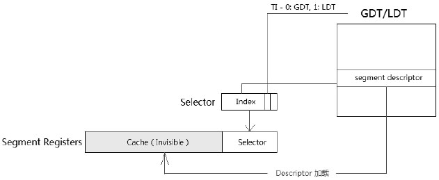

当段寄存器发生加载时，根据**Selector**得到**segment descriptor**，**Selector**将加载到**段寄存器的Selector域**，同时**segment descriptor**也将加载到**段寄存器的不可视部分（Cache**）。

segment descriptor加载到段寄存器中几乎是一对一加载，除了limit域：在**segment descriptor**的**limit域是20位**，而**段寄存器**中的**limit是32位宽**的。descriptor内20位的limit计算为32位后加载到段寄存器的limit域。

使用下列指令可以对Data segment寄存器进行**显式的加载**。

- mov指令：mov sreg，reg16。
- pop指令：pop es，pop ds，pop ss，pop fs，以及pop gs。
- lds，les，lss，lfs，以及lgs。

下列情形对**CS寄存器**或**SS寄存器**进行**隐式的加载**。

- 提供一个far pointer给jmp/call指令，进行远跳转/调用，根据提供的selector进行加载。

- 使用retf和iret指令进行返回时，根据stack中的image对CS寄存器进行加载，以及对SS寄存器（权限改变时）进行加载。

- 使用int指令进行中断调用，或者发生中断/异常时，对CS和SS寄存器（权限改变时）进行加载。
- 使用**TSS/Task\-gate**进行**任务切换**时，根据TSS段内的段寄存器image进行加载。
- 使用sysenter/sysexit，syscall/sysret指令时，处理器对CS和SS进行selector加载和一些强制性的设置。

在**64位模式**下，lds、les指令无效；pop ds、pop es，以及pop ss指令无效；**使用TSS机制进行任务切换将不再支持(！！！**)。

**段寄存器的base域**在**64位**模式下被扩展为**64位**，对于**CS、ES、SS和DS(！！！**)寄存器来说这个64位的基值没什么意义。在**64位模式**下，这些**段的基值都被强制为0值(！！！一旦往这几个段寄存器加载selector， 发现是这几个寄存器, 不读取GDT或LDT, 直接加载base位0！！！**)。

**64位的段基值**对于**FS和GS寄存器**来说才有意义，**FS和GS寄存器(！！！**)可以由**软件设置非0的64位值**。

**使用代码段或数据段描述符(！！！这两种描述符在64位下还是8字节大小， base还是32位！！！**)的加载方法，只能加载一个**32位的base值**，在x64体系中，新增了**两个MSR寄存器**：**IA32\_FS\_BASE**和**IA32\_GS\_BASE**。它们分别映射到**FS.base**和**GS.base**。

# 4. Segment Descriptor（段描述符）

段寄存器和段描述符（Segment Descriptor）在整个x86/x64体系里非常重要，前面的图揭示了**段寄存器与段描述符的关系**。在保护模式里，段寄存器离不开段描述符，而段描述符也不能独立于段寄存器存在。只有当段描述符被加载到了段寄存器里才能发挥应有的作用。

**TSS descriptor**是一个比较特殊的**段描述符**，当一个**TSS descriptor被引用**（被加载）时，处理器会将它**置为Busy状态**。Busy状态的TSS descriptor不能被加载，它存在于GDT中会发挥一定的作用。

段描述符要么存放在Descriptor Table（描述符表）里，要么被加载到段寄存器里。一个段描述符在被加载到段寄存器后，它所描述的段变成**active状态**。在继续探讨段寄存器之前，我们先要了解段描述符。

## 4.1. 描述符（Descriptor）的种类

段描述符只是众多描述符中的一类，描述符有**两大类**：**Segment Descriptor（段描述符**）和**Gate Descriptor（门描述符**）。按**系统性质**来分，可以分为：**System Descriptor（系统描述符**）和**Code/Data Descriptor（非system描述符**）。

下面是笔者对Descriptor按系统性质的分类。

- **System descriptor（系统描述符**）。
    - **System Segment descriptor（系统段描述符**）：包括**LDT descriptor**和**TSS descriptor**。
    - **Gate descriptor（门描述符**）：包括**Call\-gate**，**Interrupt\-gate**，**Trap\-gate**，以及**Task\-gate descriptor**。
- **Non\-system segment descriptor（非系统描述符**）。
    - **Code segment descriptor（代码段描述符**）。
    - **Data segment descriptor（数据段描述符**）。

Descriptor的**S域**指示了**描述符的类型**，当**S=0**时，属于**系统级的描述符**，**S=1**时，属于**Code/Data类描述符**。

在**legacy模式**下，**每个描述符**是**8字节64位宽(！！！**)，在**long mode**（包括**compatibility模式**）下，**所有的gate描述符**是**16字节128位宽**，而**Code/Data段描述符**依然是**8字节宽(！！！**)。

- **LDT/TSS描述符**在**64位模式**下是**16字节128位宽(！！！**)，而在**compatibility模式**下依然是**8字节64位宽(！！！**)。

**LDT和TSS**在系统中可能有**很多个**, 所以需要在**GDT**中添加**每个LDT**和**每个TSS的描述符**, 用来查找. 而**IDT是没有描述符**的, 因为**IDT在系统中就只有一个**, **IDTR指向**就可以, 永远不变,  **不需要在GDT中存在一个IDT的描述符**.

当要使用这些**LDT**时，可以用它们的**选择子(32位下TSS中有一个LDT段选择符！！！**)来访问GDT，将**LDT描述符**加载到LDTR寄存器。

- **所有gate描述符**在64位模式下都是**16字节128位宽**的. 包括**Call\-gate descriptor**，**Interrupt\-gate descriptor**和**Trap\-gate descriptor**. **在Interrupt/Trap\-gate描述符里增加了一个IST域**，可以为interrupt handler提供**额外的stack指针**，当**IST值为非0**时，IST值用来在**当前TSS块**里查找**相应的stack指针值**。值得注意的是，在**long\-mode**下并**不存在Task\-gate描述符**，基于**TSS的任务切换机制将不再支持**。

**中断门和陷阱门描述符都只允许存放在IDT内（！！！**），**任务门可以位于GDT、LDT和IDT中（！！！**）

通过**中断门进入中断服务程序**时cpu会**自动将中断关闭**，也就是将**cpu中eflags寄存器中IF标志复位**，防止嵌套中断的发生；而通过**陷阱门进入服务程序**时则维持**IF标志不变**。 这是**中断门与陷阱门的唯一区别(！！！**)

- **Code segment descriptor（代码段描述符**）和**Data segment descriptor（数据段描述符**）在64位模式下仍然是**8字节64位宽(！！！**), 不过**大部分域或属性无效**.

## 4.2. 代码段描述符

Code segment（代码段）描述符结构（**64位宽**）如下。


对于**Code段**来说，它的类型取值范围是**8～F**，对于4位的Type域来说，还可以进行一细化为

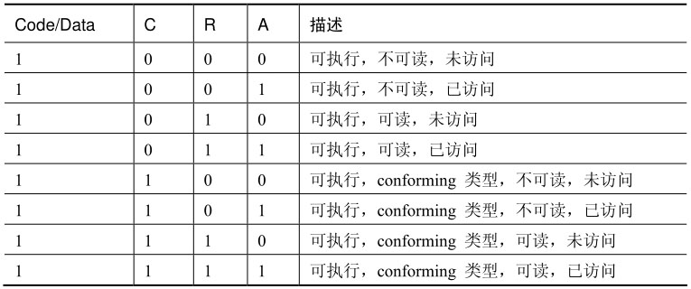

**Code/Data标志**指示段描述符属于**Code段还是Data段**，1属于Code段（指示该段可执行并且不可写）。

**C标志位**是比较重要的，C=1时为**conforming类型**，C=0时为non\-conforming类型，0x8～0xB是non\-conforming类型，0xC～0xF是conforming类型。

**32位的段base值**被分为2个部分：base的低24位放在segment descriptor的bit 39位到bit 16位上。base的高8位放在segment descriptor的bit 63到bit 56位上。（注意区分：在Intel和AMD的手册上以2个32位结构进行描述，在这里以一个64位结构进行描述。）

**20位的段limit值**也被分为2个部分：limit的低16位放在segment descriptor的bit 15到bit 0位上，高4位放在segment descriptor的bit 51到bit 48位上。20位的limit值经过计算为32位后被加载到段寄存器上。

### 4.2.1. Accessed访问标志

在type域里的A标志（accessed）指示段是否被访问过，A=1表示已经被访问过（被加载到段寄存器中），A=0表示未访问。

当段描述符被加载到段寄存器时，只有当A标志位为0时，处理器才会对在GDT/LDT中的segment descriptor中的A标志进行置位，这种行为可以让系统管理软件（典型的是内存管理软件）知道哪个段已经被访问过。

可是一旦置位，处理器从不会对A标志位进行清位。系统软件在对descriptor进行重新设置的时候，可以对A标志位进行清位。在处理器再次加载descriptor的时候对A标志位重新置位，在这种情况下，A标志往往配合P标志位使用。系统软件在对A标志和P标志位进行修改的时候应当使用LOCK指令前缀锁bus cycle。

当处理器加载descriptor到段寄存器时，处理器会对descriptor执行自动加lock的行为，处理器在访问这个descriptor期间，其他处理器不能修改这个descriptor。

这个加载descriptor期间，应当包括从对descriptor检查到最后的使用descriptor更新段寄存器内的Cache部分。

### 4.2.2. Readable可读类型

一个代码段不可能被写访问，但可以被读访问，当代码段的类型标志R设为1时，表示该代码段可以被读，那么就可以像下面这样使用CS段进行读访问。

```assembly
mov eax，cs：[ebx]              ； 通过CS寄存器读代码段空间
```

或者可以将code segment descriptor加载到数据段寄存器进行读访问。

```assembly
mov ax，CODE_SEL                 ； CODE_SEL是一个代码段描述符
mov es，ax                         ； 将代码段描述符加载到ES
mov eax，es：[ebx]
```

前提是有足够的权限加载（non-conforming类型）描述符，CPL<=DPL并且RPL<=DPL。或者是对于conforming类型的代码段描述符加载总是成功的。

### 4.2.3. conforming与non-conforming代码段

conforming类型的代码强迫使用低权限或相等权限（CPL>=DPL）来运行，nonconforming类型的代码限制用户使用低权限来运行（进入高权限代码需要通过gate符调用）。

conforming段的另一个重要特性是：进入conforming段运行不改变当前运行的CPL值（无论是通过直接调用还是gate调用）。


如上图所示，在同一段3级权限的用户代码里，分别调用conforming段和nonconforming段的代码，采用直接调用的方式。

```assembly
call selector：offset              ； 提供far pointer直接调用
```

从3级直接调用0级权限的conforming段代码获得通过，处理器检查CPL>=DPL（低权限或相等权限），而调用0级的non\-conforming段代码将失败，处理器检查到CPL != DPL（权限不相等）。

conforming段的代码将阻止使用高权限执行，假如调用者的权限是0级，而conforming段的权限为1级，那么这个调用将失败。因此当conforming段使用0级DPL时，就可以在任何权限里执行。进入conforming段不会引起权限和stack的切换。

non\-conforming段的代码将阻止使用低权限执行，而强迫通过使用gate来执行高权限的代码。

>**需要保护**的代码和数据应该**使用non\-conforming段**，而对于**不重要、无须保护**的代码可以使用conforming段。

在某些场合下，使用conforming段会比使用non-conforming段灵活：例如要使一个库routine能在任意权限下运行，前提是这个库routine并不涉及重要的数据和使用系统资源。

基于这种要求，我们来对比一下conforming段与non-conforming段。

① 使用conforming段，并将DPL设为0级权限，在3级权限下可以直接调用（CPL>DPL），在0级权限下，依然可以使用直接调用（CPL==DPL）。

② 使用non-conforming段，并将DPL设为3级权限，在3级权限下可以直接调用（CPL==DPL），而在其他级别无法直接调用，例如在0级不能直接调用3级权限的代码（CPL！=DPL），那么在0级权限使用gate符进行调用呢？同样做不到（条件是：CPL>=DPL of Code segment）。如果将non-conforming段的DPL设为0级权限，在3级权限下可以使用gate符进行调用，在0级权限下也可以使用gate符进行调用。

相比之下，non-conforming段的执行权限需要被定义为0级，通过gate符进行调用，显得不如conforming段灵活，并且conforming段定义在3级权限，不会改变调用者的CPL值。对于不重要的库routine来说，使用conforming段会更适合些。

下面是一个典型的使用方法。

代码清单10-1（lib\conforming_lib32.asm）：

```assembly
；----------------------------------------------
； conforming_lib32_service_enter（）：conforming代码库的 stub函数
； input：
；       esi：clib32 库函数服务例程号
； 描述：
；       conforming_lib32_service_enter（）的作用是切换到 conforming段里，
；       然后调用 conforming lib32 库里的服务例程，它相当于一个 gate 的作用。
； -----------------------------------------------
__clib32_service_enter：
__conforming_lib32_service_enter：
      jmp do_conforming_lib32_service
conforming_lib32_service_pointer       dd __clib32_service dw conforming_sel
do_conforming_lib32_service：
      call DWORD far [conforming_lib32_service_pointer]   ； 使用 conforming 段进行调用
      ret
；--------------------------------------------
； conforming_lib32_service（）
； input：
；       eax：clib32 库函数服务编号
；--------------------------------------------
__clib32_service：
__conforming_lib32_service：
      mov eax，[__clib32_service_table + eax * 4]
      call eax
      retf
；----------------------------------------------------------
； get_cpl（）：得到 CPL 值
； output：
；       eax：CPL 值
；----------------------------------------------------------
__get_cpl：
      mov ax，cs
      and eax，0x03
      ret
； conforming lib32 库服务例程表
__clib32_service_table：
      dd __get_cpl                            ； 0 号
      dd __get_dpl                            ； 1 号
      dd __get_gdt_limit                     ； 2 号
      dd __get_ldt_limit                     ； 3 号
      dd __check_null_selector              ； 4 号
      dd __load_ss_reg                        ； 5 号
```

这段代码在lib\conforming\_lib32.asm库里，是专门为conforming段代码所设立的一个32位的库，\_\_get\_cpl（）函数用来获取**当前运行的CPL值**。那么，在软件里可以使用下列方式来调用。

```assembly
mov eax，0       ； clib32 库的例程编号
call __clib32_service_enter   ； 调用 clib32 库的进入函数
```

在\_\_clib32\_service\_table里，\_\_get\_cpl（）函数的编号是0，因此，给eax寄存器传递例程号由接口函数\_\_clib32\_service\_enter（）来进行调用。

它设立的目的是能**在任何权限执行**，这样就可以很方便地**获取到CPL值**。

由于conforming的特殊性——不改变CPL值，于是\_\_get\_cpl（）函数就被放在conforming里执行。如果以non\-conforming段来运行，就显得很麻烦了。

① 发生权限的改变时CPL会改变。因此还要根据情况做出相应的判断。

② 必须放在0级的DPL权限里，使得0级权限下能够执行，在3级里使用gate进行调用。

而放在conforming段里就很容易做到了，这个\_\_get\_cpl（）函数的调用路径是

\_\_conforming\_lib32\_service\_enter（）--> \_\_clib32\_service（） --> \_\_get\_cpl（）

上面是在conforming\_lib32.asm库里的执行顺序。在我们的程序里只需给出conforming段目标例程get\_cpl（）的例程号（在inc\clib.inc文件里定义了一些常量值），然后调用入口函数就可以了。入口函数\_\_conforming\_lib32\_service\_enter（）负责切换到conforming段执行。

在conforming\_lib32.asm库里的这些烦琐的调用路径是为了实现一个库的接口，当conforming\_lib32.asm库里添加更多的函数时，可以利用这个路径进入。

代码清单10-2（topic10\ex10-1\protected.asm）：

```assembly
mov esi，msg2                        ； 打印信息
call puts
mov eax，CLIB32_GET_CPL   ； 常量定义在 inc\clib.inc 头文件里
call clib32_service_enter         ； 调用 conforming 例程
mov esi，eax
call print_byte_value              ； 打印值
```

最后，在我们的程序里，分别在0级和3级用户代码里调用，结果如下。


这个结果分别打印了当前的CPL值，说明处理器从0级切换到了3级权限里。结果虽然很简单，但意义重大。

### 4.2.4. DPL属性

在segment descriptor里DPL属性定义一个段所需要的最低访问权限。如果DPL设为2级权限，那么0、1和2级权限可以访问，3级权限将被拒绝。

在处理器权限检查中，DPL是一个重点的被检查对象，使用CPL与DPL进行权限对比。许多情况下还需要使用RPL与DPL进行额外的辅助对比。

### 4.2.5. S属性

S标志位指示descriptor属于System还是Code/Data（非System），Code/Data段的S位为1值，当S=0时，descriptor属于System（例如，LDT/TSS描述符，Gate描述符）。

### 4.2.6. P属性

P标志位指示一个segment或gate是否存在内存中，P=1表示segment或gate已经放在内存中，P=0表示该segment或gate不存在内存中（所需的内存没准备好）。

当P=0时加载segment descriptor到segment寄存器，会产生#NP（Segment Not-Present）异常，#NP异常是一个fault类型的异常，表示在#NP handler里必须要修复这个错误。

在#NP handler里有责任去改正Segment Not-Present错误，当内存准备好时，在#NP handler里需要将在GDT的描述符的P置为1（返回加载者表示已经准备好了），在启用paging内存管理的系统里，接收#NP异常后，应尝试将物理内存提交到segment的virtual address上，成功后将P标志置为1值。

OS内存管理模块维护segment和page（当启用paging机制时）的present状态，当page是not-present时产生的是#PF（Page\-Fault）异常。

在某些情况下，系统软件需要主动去清P标志位，当系统软件需要对descriptor进行更新时。在更新descriptor前将P标志位清0，指示为不可用的。在更新完毕后，对P标志进行置位，指示为可用的。在这种情况下P标志往往与A标志配合使用。

### 4.2.7. D/B属性

D/B在不同的segment里有不同的意义，对于Code segment来说，它指示Default operand size（默认的操作数大小），这个标志位被称为D标志位，D=1指示Code Segment的默认操作数是32位，D=0时是16位。

### 4.2.8. long mode下的D/B属性

在long mode下，Code segment的D标志与L标志（L标志在legacy模式下是保留位）组合使用，如下所示。


如上所述：L=0时处理器处于compatibility模式，再根据D标志选择相应的default operand size（默认操作数）。当L=1时处理器处于64位模式，但是还需要D标志位配合（D需为0）。

值得注意的是，x64体系规定L=1且D=1是无效的组合。

在实模式下，由于CS.D为0，因此实模式下默认的操作数是16位的。

无论默认操作数是16位还是32位，操作数的大小是可以改变的，通过使用operand size override（操作数大小的改写）操作。

```assembly
bits 16
mov eax，1                 ； 16位默认操作数下，使用32位的寄存器
```

如上所示。在汇编语言代码层上，在16位的默认操作数下使用32位的寄存器，那么编译器会为这条指令生成一个额外的operand size override prefix字节，它是66H，从而可以使用32位宽的操作数。

当L=1且D=0时，使用该Code segment时将进入64位模式，但默认操作数还是32位的（部分指令是64位的），那么要使用64位的操作数，需要使用REX.W进行扩展。

```assembly
bits 64
mov rax，1                 ； 32位默认操作数下，使用64位的寄存器
```

同样的情形下，编译器会为这条指令生成的机器码中加入REX prefix（前缀），REX字节为48H（REX.W=1），这样操作数被扩展为64位宽。


上图揭示了D标志重要性的另一面：当D=0时，由于默认操作数是16位的，影响到call指令在调用时压入了16位的返回地址（当前的ESP指针是32位），即使在SP为16位的前提下，如果D=1，call指令将压入32位的返回地址而不受SP指针的影响。

### 4.2.9. L属性

L标志位仅用于long mode的Code segment descriptor。L=1表示进入64位模式，L=0表示进入compatibility模式。L标志需配合D标志使用，详见上面的D/B属性描述。

### 4.2.10. G属性

G标志位指示**segment limit的粒度**。当G=1时，段限的粒度为**4KB**，当G=0时段限的粒度为1 byte。G标志配合limit域使用，20位的limit值配合G标志的计算后产生32位的limit值。

- G=0时：32位的段限就是limit域的值。
- G=1时：32位的段限=limit×4K+FFFH。

假如segment descriptor的20位limit域是FFFFF，那么最终32位的段限是

```assembly
FFFFFh × 1000h + FFFh=FFFFFFFFh
```

段的limit值的计算方式是统一的，但段内有效区域实际上较为复杂，分为Expandup和Expand\-down两种类型。这在10.5.4.5节有详细的描述。

## 4.3. long mode下的Code段描述符

在long mode（包括**64位模式**和**compatibility模式**）下，Code Segment Descriptor的**L标志**是一个**切换开关**，它将指示段描述符在64位模式和compatibility模式角度下进行切换解析，如下所示。


当L=1时切换到64位模式，这时候Code segment descriptor使用64位模式的定义（对描述符采用64位模式解析），当L=0时切换到compatibility模式，这时候Code segment descriptor使用legacy定义，**compatibility模式下和legacy下定义是完全一致**的。

在64位模式下大部分域都是无效的，仅有少数几个属性标志有效，如下所示。

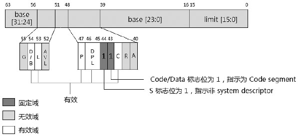

**灰色部分是无效域**，将被忽略，白色的属性标志——C标志，DPL标志，P标志，L标志，以及D标志是有效的。**固定部分是必须设置为1的标志（S=1，以及Code/Data=1**）。

在**64位模式**下，由于**段的base**和**段的limit**都**无效**被忽略，它**强制所有段的base为0(！！！)，limit为FFFFFFFFH(64位满！！！)，只有FS和GS寄存器可以使用非0值的段base**。

下面是一个典型的long mode下代码段描述符的定义。

```assembly
;;;定义一个64位代码段，DPL=0，P=1，S=1，Code/Data=1，L=1，D=0
kernel_code64_desc    dq 0x0020980000000000     ;Attribute=2098H
```

除了属性域外，其他的域都为0值，可见在**64位模式下大大简化了segment descriptor的定义**。当L=1且D=0时，目标代码是64位模式的。L=1且D=1时是无效的组合。L=0时，根据D标志位判断目标代码是32位还是16位的默认操作数。

这是否就是x64体系中在64位OS里向下平滑地兼容执行legacy应用程序的原理呢？

没错！在x64体系中，可以使用全新的64位操作系统，当OS开启long mode并激活long mode，这时候处理器进入long mode。OS的kernel及其executive组件运行在64位模式，而应用程序可以是32位或64位，**运行32位的应用程序**处理器将**转入到compatibility模式**运行，运行64位应用程序则切换回64位模式。

处理器就是根据目标程序加载的Code segment descriptor中的L标志进行切换。因此可以使用一个32位程序的Code segment descriptor而无须任何修改或重新编译。在long mode下，程序代码可以在compatibility与64位模式下任意切换（**前提是执行环境设置正确**）。

## 4.4. 代码段寄存器的加载

**目标代码**要得到**执行**必须先**将其code segment descriptor加载到Code segment register（代码段寄存器）即CS寄存器**里。

**不像数据段寄存器**，**CS寄存器不能使用mov或pop指令(！！！**)进行直接加载，**必须**通过**控制权的转移形式隐式加载(！！！**)。

代码段寄存器的加载非常复杂，这是保护模式下最为复杂的一个环节，不但涉及控制权的转移，也涉及权限的检查，以及stack的切换，某些情况下还涉及任务的切换。

### 4.4.1. 加载CS寄存器的常规检查

在加载CS寄存器前处理器会进行一些检查，下面是对Code segment Selector和Code segment descriptor进行的常规检查（未包括对权限检查的描述）。

#### 4.4.1.1. selector的检查

处理器检查**selector是否为Null selector**，处理器**不允许加载一个Null selector**到**CS寄存器**中。否则会产生\#GP异常。

#### 4.4.1.2. limit的检查

处理器检查**selector是否超出GDT/LDT的limit表限**，否则产生\#GP异常。

然而在**64位模式**下，处理器并**不检查selector是否超limit(！！！**)值。

#### 4.4.1.3. Code segment类型的检查

能被加载到CS寄存器的Code segment descriptor**类型**必须如下。

① **S=1**，属于**非system描述符**。

② **Code/Data标志**为1，指示属于**一个Code段**，表示它是Execute（可执行）的段。

③ **P=1**，指示**段在内存**中。

即使在**64位模式**下，在加载CS时，处理器也**必须进行上面的三项检查**。上面这些检查中并**不包括对权限的检查**，在稍后的各种加载CS寄存器的情形里再分别对权限检查进行进一步的探讨。

### 4.4.2. 用far pointer加载CS寄存器

**直接跳转形式**是提供一个**far pointer（selector：offset形式**）使用**jmp/call指令**进行**跳转/调用**，并**不通过call\-gate描述符**，因此**CPL不会改变(！！！**)。

① 当**jmp/call**到一个**non\-conforming代码段**时，non\-conforming类型的代码段会**阻止不同权限的代码进行加载(只要不同就会阻止！！！**)。

```assembly
call 0x28：0x00001000         ； 0x28是一个non-conforming代码段选择子
jmp 0x28：0x00001000
```

在这个情形里，jmp/call指令能够成功加载CS寄存器所需要的权限如下（**必须是同级调用！！！**）。

>**CPL == DPL**并且 **RPL <= DPL**

这里使用的selector是0x28，那么它使用的RPL是0。如果**当前的CPL=3**，而**DPL为0**，则**会失败**，**产生\#GP异常**。

② 当**jmp/call**到一个**conforming代码段**时，conforming类型的代码会**阻止高权限代码进行加载**。

```assembly
call 0x30：0x00001000         ； 0x30是一个conforming代码段选择子
```

jmp/call指令能够成功加载CS寄存器所需要的权限如下（必须是**同级或低权限代码调用！！！**）。

>**CPL>=DPL**，**RPL被忽略**

在**64位模式**下，**不允许**使用**直接far pointer指针（立即数操作数**），需要使用**间接的far pointer指针**，这个indirect（间接）的far pointer必须**保存在内存**中。

```assembly
call QWORD far [FAR_POINTER]       ； 使用间接的64位far pointer
```

在提供的**内存操作数**里，该**内存地址依次存放64位的offset值和16位的selector值(！！！**)。在上面的**常规检查**和**权限检查**通过后，处理器将**加载Selector**和**目标Code段描述符**到**CS寄存器**里，**CPL无须更新**（即**CS.RPL不会被更新！！！**）。

在AMD的机器里，在64位操作数下，far pointer的offset值是32位，如下所示。

```assembly
FAR_POINTER：
dd entry64       ;32位offset值
dw cs_selector
```

### 4.4.3. 使用call gate加载CS寄存器

**直接调用方式**是加载一个**相同权限**的**段描述符到CS寄存器**，那么需要进行**权限改变**时，必须使用**Call\-gate描述符**。使用call gate可以加载**更高权限的Code段描述符**。


Call\-gate描述符是system descriptor的一种，它的**S标志位为0**，在**legacy模式**下（非long mode）是**8字节64位**宽。**Call\-gate描述符**可以放在**GDT或者LDT**，但**不能放在IDT**。

#### 4.4.3.1. offset域

**32位的目标代码offset值**被分成两部分，低16位在描述符的低16位，高16位在描述符的bit 63到bit 48位，由selector得到对应的目标code segment descriptor。**offset值**加上这个code segment descriptor的**base域**就是**目标代码的入口点**。**不使用指令中给出的偏移量(！！！**)

#### 4.4.3.2. selector域

它是**目标代码段的selector**，由它获得code segment descriptor，这个code segment descriptor的DPL值是处理器用来进行权限检查的条件之一。目标代码的基址由这个code segment descriptor的base域提供。

#### 4.4.3.3. cnt域

这个值共5位，指示**参数个数**，作用是caller（调用者）向callee（被调用者）传递参数。调用者在自己的栈压入参数，处理器根据在cnt域里的参数个数将调用者的stack中的参数复制到被调用者的stack中，被调用者可以在自己的stack中访问参数。

#### 4.4.3.4. Call-gate的DPL值

每个门描述符有它自己的**DPL值**，在使用call\-gate进行调用时，gate描述符的DPL结合目标code segment descriptor的DPL进行权限检查。

#### 4.4.3.5. gate selector和gate descriptor的常规检查

处理器会检查如下内容。

① call/jmp指令使用的selector是否为Null selector，是否超出GDT/LDT的limit。

② selector所引用的descriptor是否为Call\-gate描述符。

③ gate描述符的S标志是否为0，指示它属于System描述符。

④ gate描述符的P标志是否为1，表示它在内存中。

⑤ 最后，还要对gate描述符里所引用的code segment selector及目标Code segment descriptor做10.5.4.4节下1中所描述的常规检查。

#### 4.4.3.6. 使用call指令调用call-gate时的权限检查

在使用call指令加载到CS寄存器之前会进行权限的检查，处理器会对**两个DPL**进行检查：**Call\-gate的DPL**和**Code segment的DPL**，目标Code段能加载CS寄存器的合法权限如下。

① **CPL <= Call\-gate的DPL**，并且 RPL <= Call\-gate的DPL。

② CPL >= Code segment的DPL（由低权限进入高权限，或者相等权限）。

在①里揭示了当前运行的代码必须有权限去访问Call\-gate描述符（CPL和RPL须小于等于Call-gate描述符的DPL值），在②里揭示了目标代码必须由低权限或者相同权限的代码去调用。

注意：如果**目标代码段**是**conforming类型**，进入高权限代码后，**CPL是不会改变**的。

#### 4.4.3.7. 加载selector及code segment descriptor到CS寄存器

通过检查后，目标代码段的selector及Code segment desciptor会加载到CS寄存器，并转到目标代码执行。


如图所示，我们可以使用类似下面的指令进行调用。

```assembly
call Callgate_sel：0                ； Callgate_sel是一个门符选择子
```

那么在Call-gate描述符里的selector域（也就是目标代码段的selector）将被加载到CS寄存器的Selector域里，CS寄存器内部的cache会被加载为目标code segment descriptor。

CS.Selector.RPL会更新为目标Code segment descriptor的DPL值，也就是CPL会得到更新（code segment的selector.RPL会忽略）。

当目标代码段是conforming类型时，selector和code segment descriptor会被加载到CS寄存器，但CS.selector.RPL不会被更新（CS.RPL保持原值）。

#### 4.4.3.8. 权限的切换

当目标代码是高权限代码时，将会发生权限的切换，CPL会更新为目标code segment的DPL值。以上面的call指令为例，假如调用者的权限是3级，目标代码的权限是0级，CS寄存器的Selector.RPL会被更新为0级。

在long\-mode下，call指令调用call\-gate而引发权限切换，如果调用者在compatibility模式下，处理器将切换到64位模式里执行。

#### 4.4.3.9. 当使用jmp指令调用call-gate时

Jmp指令与call指令会遭遇不同的情况，当使用jmp指令对call\-gate进行跳转时，处理器必须确保在相同的权限级别下跳转。

```assembly
jmp Callgate_sel：0                ； Callgate_sel是一个门符选择子
```

如果在不同的权限级别下，有两种可能，依赖于目标代码的类型。

① 跳转失败：当目标代码段是non\-conforming类型时，处理器的检查是

a）CPL <= Call-gate的DPL，并且 RPL <= Call-gate的DPL。

b）CPL == Code segment的DPL（权限必须相等）。

b）点揭示了使用jmp指令跳转到non-conforming代码段时不会发生权限的切换（权限必须相等）。

② 跳转成功：当目标代码段是conforming类型时，处理器的检查和call指令一致。Conforming代码段允许由低权限访问者跳转到高权限里，但权限不会发生切换。

>使用**jmp指令无论如何也不会发生权限切换**，**CS.selector.RPL会维持原值**。

#### 4.4.3.10. stack的切换

当发生权限的切换（意味着将切换到高权限里），同时处理器也会自动进行stack的切换，stack的权限和CPL权限是必须一致的。处理器将在当前TSS段里读取相应权限级别的SS与ESP值，加载到SS与ESP寄存器里。

在**long\-mode**下执行call指令调用**call\-gate**而**引发stack切换**时（无论是在64位模式还是compatibility模式）：**仅读取TSS中的RSP**值，并且处理器**加载一个Null selector到SS寄存器**里。最后处理器会转入64位模式里执行。

关于**stack的切换**我们将在**后面的4.5节里**进行详细的探讨。

#### 4.4.3.11. long-mode下的Call-gate

关于**stack的切换**我们将在**后面的4.5节里**进行详细的探讨。

在long mode（包括**64位模式**和**compatibility模式**）下，**Call\-gate**被扩展为**16个字节共128位**结构。


如上图所示，目标代码的**offset值**扩展为**64位**，在Call\-gate的高8字节Bit 44到Bit 40位**共5位**必须**设置为0值**，代表一个**无效的descriptor类型**。在**long mode**下段描述符（**Code和Data**）仍然是**8字节**宽度。由于Call-gate存放在GDT或LDT中，占据了**2个segment descriptor**的空间（**16字节**）。

为了对**Call\-gate descriptor**和**Code/Data segment descriptor加以区分**，防止Call\-gate的**高8字节**作为Code/Data segment descriptor进行引用，必须将**高8字节的S标志和Type域置为0(！！！**)。

Call\-gate的**Type依然是0Ch值**，**long mode**下这个类型是**64位Call\-gate类型**。

#### 4.4.3.12. 64位Call-gate的offset值

这个offset值必须是一个**canonical形式的地址**值（关于canonical地址，详见2.4.3节描述），否则**会产生\#GP异常**。

#### 4.4.3.13. 64位Call-gate中的selector

这个**selector**所引用的**code segment descriptor**必须是**64位代码段（L=1并且D=0！！！**）。因此我们可以看到开启了long mode的OS，它的核心代码运行在64位模式下（0级权限的代码为64位）。

#### 4.4.3.14. 64位Call-gate的调用

在64位模式下**不允许**在指令中**直接提供far pointer指针**形式，需要使用**内存操作数**。

```assembly
call QWORD far [CALLGATE_POINTER]   ； 使用间接的64位far pointer形式
```

除了要通过和legacy模式相同的权限检查外，还需要经过**额外的检查**。

① Call\-gate的高8位的S与Type是否为0（5个0）值，否则产生\#GP异常。

② offset是否属于canonical地址形式，否则产生\#GP异常。

③ 目标Code segment descriptor的L标志和D标志组合是否属于64位模式代码，否则产生\#GP异常。

如同legacy模式一样，**Code segment**的**selector和descriptor**会加载到**CS寄存器的selector和cache**里，**64位的offset**值会加载到**RIP寄存器**中。

#### 4.4.3.15. 在compatibility模式下对64位Call-gate的调用

compatibility模式运行在32位或者16位代码，通过far pointer调用64位Call-gate进入64位模式。

```assembly
call Callgate_sel：0      ； Callgate_sel是一个64位Call-gate选择子
```

如同在legacy模式下一样，在compatibility模式下可以使用直接的far pointer形式调用call gate，这将导致处理器从compaitibility模式切换到64位模式。处理器对调用的检查与在64位模式下是完全一致的（64位Call-gate本身并没有改变）。注意在64位的操作数size下，AMD64体系的far pointer是16：32结构（48位宽），在Intel64体系的far pointer是16：64（80位宽）。

### 4.4.4. 使用TSS selector调用加载CS寄存器

使用**TSS selector**进行调用是call/jmp指令加载CS寄存器的**第三种方法**。使用TSS selector和Task\-gate进行任务切换的机制异常复杂，机器的耗时非常多。

#### 4.4.4.1. TSS descriptor

TSS描述符属于**系统描述符（它的S标志位为0**值），并且**只能存放在GDT**中，**不能放在LDT和IDT**。下面是**32位TSS descriptor**结构。


在legacy模式里的TSS描述符是**8字节64位宽**。在**long\-mode**的**compatibility子模式**里**TSS描述符也是8字节**，和legacy模式行为一致。

#### 4.4.4.2. TSS类型

在**Type类型域**里，**1001B**是**32位TSS**，**1011B**是**Busy 32位TSS**。而**0001B**是**16位TSS**，**0011B**是**Busy 16位TSS**。

#### 4.4.4.3. 提供TSS selector进行call或jmp调用

可以提供直接的far pointer或间接的far pointer给call或jmp指令进行任务切换。

```assembly
call tss_sel：0      ;tss_sel是一个32位TSS选择子
```

同样，处理器会经过一系列的检查，包括常规的selector和TSS descriptor险查以及权限的检查。

#### 4.4.4.4. TSS selector及TSS描述符的常规检查

处理器对所使用的TSS selector和TSS descriptor进行如下常规的检查。

① selector是否为Null selector，是的话产生#GP异常。

② selector.TI是否为1，是的话表示将使用LDT，产生#GP异常。

③ selector的引用是否超出GDT的limit，是的话产生#GP异常。

④ TSS descriptor的S标志为0，表示属于system描述符，否则产生#GP异常。

⑤ TSS descriptor的P标志为1，表示在内存中，否则产生#GP异常。

⑥ TSS descriptor是否属于available 32-bit TSS（即类型值为1001B），如果是属于Busy状态或者其他的描述符类型，则产生#GP异常。

⑦ TSS descriptor里的limit值是否大于等于67H，否则产生#GP异常。

从上面可以看到，处理器对TSS selector及TSS描述符的检查是很多的。

#### 4.4.4.5. 权限检查

使用TSS selector进行调用需要如下权限（使用call指令与使用jmp指令相同）。

① TSS selector的RPL <= TSS描述符的DPL

② CPL <= TSS描述符的DPL

如上所示，调用者必须有权限去访问TSS descriptor，但是在调用时处理器并不检查TSS段内的各个权限。只有在切换阶段加载TSS段内的各个段（CS，SS及所有段）时才会对它们进行详细检查。


上图是一个简单的加载CS寄存器示意图，当所有检查都通过时，处理器进行复杂的任务切换工作。最后会在TSS段里加载所有的段寄存器，包括CS与SS寄存器。

#### 4.4.4.6. 对原TSS descriptor进行处理

对于使用**jmp指令和call指令**，处理器会有**不同的处理**。

① **jmp指令**会**清当前TR**所使用的**TSS descriptor的Busy位**，使当前所使用的**TSS descriptor**置为**available状态**。

② **call指令**会**保持**当前TR所使用的**TSS descriptor**的**Busy状态**，不作处理。

当前TR内的TSS descriptor是在系统初始化时加载的，**加载到TR后**处理器会**将TSS descriptor置为busy**状态。**进入保护模式后必须要加载一个TSS descriptor到TR(！！！**)，这是一个完整的执行环境中必不可少的，否则将不能发生权限的切换。

下图是处理器在进行任务切换时的工作示意图，图中的**原TSS描述符**是指上面所说的**当前TR所引用的TSS描述符**。

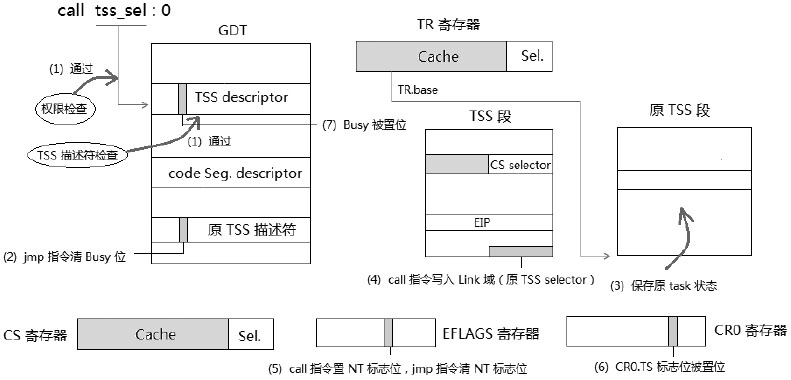

#### 4.4.4.7. 保存原处理器状态

如上图所示，接下来处理器将在**当前TSS段**（**未加载TR之前为当前的TSS段**）里保存**切换前的处理器状态**（**对于新的task来说是原task状态**）。

#### 4.4.4.8. 在新的TSS段写入原TSS selector

如果是使用**call指令**进行调用的，将会在**新的TSS段**里的**Link域（Previous task link**）写入**原TSS selector值**。而对于**jmp指令**来说，处理器**不会写入TSS selector**。

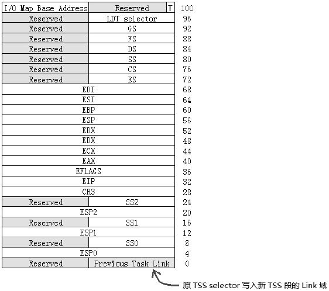

上图是在**legacy模式**（非long mode）下的**32位TSS segment结构**，**旧task的处理器状态**保存在**原TSS段**里，而**新Task的初始化状态**从**新的TSS段**里进行**加载**。在任务切换到新Task时处理器的最后任务是加载新task的初始状态，使用**call指令**调用会将原TSS selector写入新任务的TSS段的Link域，**以便由新任务里切换回原任务**。

处理器会检查TSS descriptor的limit域，看看TSS段是否大于等于67H（十进制数的103），TSS段的最小段限是67H，如上图所示：从0到103之间的区域是必需的。

代码清单10-3（topic10\ex10-1\protected.asm）：

```assembly
；； 设置新 TSS 区域
      mov esi，tss_sel
      call get_tss_base
      mov DWORD [eax + 32]，tss_task_handler                 ； 设置 EIP 值为
tss_task_handler
      mov DWORD [eax + 36]，0                                  ； eflags=0
      mov DWORD [eax + 56]，KERNEL_ESP                         ； esp
      mov WORD [eax + 76]，KERNEL_CS
； cs
      mov WORD [eax + 80]，KERNEL_SS                            ； ss
      mov WORD [eax + 84]，KERNEL_SS                            ； ds
```

上面这段代码在protected.asm模块里，对新的TSS段进行一些设置，几个必需的要素包括：EIP与ESP、CS、SS、DS，以及CR3的值，其他为0值。在未开启paging情况下，CR3可以忽略，CR0和CR4都使用现有的。

#### 4.4.4.9. 置Eflags.NT标志位

使用**call指令**进行调用时，处理器会对**Eflags.NT标志位**进行置位，指示**新task进入Nested（嵌套）状态**。

而对于jmp指令则相反，**jmp指令**对Eflags.NT标志位**进行清位**。

#### 4.4.4.10. CR0.TS标志位置位

无论是**call指令**还是**jmp指令**，**CR0的TS标志位都会被置位**，指示**进行了任务切换**。TS标志位**不会被处理器清位**，需使用**clts指令进行清位**（关于CR0.TS控制位更多的信息，请参考第6章）。

#### 4.4.4.11. 新task的TSS descriptor Busy被置位

在加载TR及各个段寄存器之前的最后一个工作是**将新任务的TSS descriptor的Busy位进行置位**，指示当前（**新的任务）TSS descriptor是不可用**的。

#### 4.4.4.12. 加载TR

上面工作完成后，处理器将加载TSS descriptor进入TR，下面是TR的结构。


没错，**TR具有与段寄存器完全相同的结构(也和LDTR具有完全相同的结构！！！**)，包括：TR的Cache部分（base域、limit域，以及Attr域）和Selector部分，同样Cache部分的内容由TSS descriptor加载而来，**Selector**由**TSS selector加载而来**。所不同的是**TSS descriptor只能放在GDT**里。


实际上，**需要加载descriptor的寄存器**都具有**相同的结构(！！！**)，包括：**段寄存器，TR和LDTR**。

处理器从指令操作数far pointer的**Selector**部分得到Selector加载到TR的selector域，同时GDT中的TSS descriptor也会加载到TR的cache部分。

#### 4.4.4.13. 加载CS寄存器及其他寄存器

任务切换里最后一系列的关键工作是加载TSS段里的寄存器和其他通用寄存器组。处理器使用TSS段里的segment selector加载段寄存器，还要通过一系列最后的检查。

由于在新Task里所有的段寄存器要重新加载，新任务的执行权限要重新设置（执行高权限还是低权限），TSS段里各个段寄存器的加载权限要通过如下检查。

① CS的selector.RPL，SS的selector.RPL，以及目标Code segment descriptor，Stack segment descripotr的DPL，四者必须相等。假设目标代码为3级代码，那么

```assembly
      mov esi，tss_sel
      call get_tss_base
      mov DWORD [eax + 32]，tss_task_handler                      ； 设置 EIP 值为
tss_task_handler
      mov DWORD [eax + 36]，0                                         ； eflags=0
      mov DWORD [eax + 56]，USER_ESP                                ； esp
      mov WORD [eax + 76]，USER_CS|3                                ； CS  的
selector.RPL 必须为 3
      mov WORD [eax + 80]，USER_SS|3                                ； SS 的
selector.RPL 必须为 3
      mov WORD [eax + 84]，USER_SS                                   ； ds
```

在上面的CS和SS的selector设置里，RPL必须为3级（和DPL匹配），否则将产生#TS异常。

② CS和SS的selector必须是有效的，不是Null selector，对于ES、DS、FS，以及GS寄存器的selector在切换时可以为Null selector，可是在使用前必须使用有效的selector显式地加载段寄存器。

③ ES、DS、FS，以及GS寄存器segment descriptor的DPL不能低于CS寄存器segment descriptor的DPL值（即：权限不能高于Code segment descriptor的DPL）。

④ 在加载CS和SS段寄存器时，这些段必须是present的，也就是说，segment descriptor的P标志位必须是1值。

在这一步里，处理器使用TSS段里的CS selector进行加载CS寄存器，以及使用其他的段selector来加载剩余的段寄存器（见上面的加载TR和CS寄存器示意图）。成功加载这些寄存器和EIP值后，处理器完成切换工作，将执行新的Task。

关于Data segment descriptor及Data segment Register的加载稍后探讨。这里我们先做一个实验。

>实验10-1：使用call指令进行任务切换，并使用iret指令切换回来

这个实验首先使用call指令提供TSS selector调用，进行任务切换到新任务，然后在新任务里使用iret指令切换到原来的任务（3级切换到0级，0级切换回3级）。

看看下面的代码片段（前面已经介绍过）。

代码清单10-4（topic10\ex10-1\protected.asm）：

```assembly
；； 设置新 TSS 区域
      mov esi，tss_sel
      call get_tss_base
      mov DWORD [eax + 32]，tss_task_handler                 ； 设置 EIP 值为
tss_task_handler
      mov DWORD [eax + 36]，0                                    ； eflags=0
      mov DWORD [eax + 56]，KERNEL_ESP                         ； esp
      mov WORD [eax + 76]，KERNEL_CS                            ； cs
      mov WORD [eax + 80]，KERNEL_SS                            ； ss
      mov WORD [eax + 84]，KERNEL_SS                            ； ds
      mov WORD [eax + 72]，KERNEL_SS                            ； es
```

在这里先对新任务的TSS段内容进行设置，只设置了几个重要的数据：ESP与EIP，以及CS、SS、DS和ES寄存器。

代码清单10-5（topic10\ex10-1\protected.asm）：

```assembly
；； 下面将 TSS selector 的 DPL 设为 3 级
      mov esi，tss_sel
      call read_gdt_descriptor
      or edx，0x6000                                             ； TSS desciptor DPL=3
      mov esi，tss_sel
      call write_gdt_descriptor
```

接下来将TSS descriptor的DPL设为3级（这点很重要），我们所要做的实验是：从3级用户代码切换到0级新任务，然后从0级新任务切换到原3级用户代码。因此，这里需要将TSS描述符的DPL设为3级（是为了可以从3级切到0级）。

代码清单10-6（topic10\ex10-1\protected.asm）：

```assembly
； 进入 ring 3 代码
      push DWORD user_data32_sel | 0x3
      push esp
      push DWORD user_code32_sel | 0x3
      push DWORD user_entry
      retf
；； 3级用户代码
user_entry：
      mov ax，user_data32_sel
      mov ds，ax
      mov es，ax
； 获得 CPL 值
      mov esi，msg2
      call puts
      call
      mov esi，eax
      call print_byte_value
      call println
； 使用 TSS 进行任务切换
      call tss_sel：0                  ； 使用 TSS selector进行任务切换
      mov esi，msg1
      call puts                ； 打印信息
； 获得 CPL 值
      mov esi，msg2
      call puts
      mov eax，CLIB32_GET_CPL
      call clib32_service_enter     ； 调用 clib32 库的 get_cpl（） 函数
      mov esi，eax
      call print_byte_value
      call println
```

在3级用户代码里使用call tss\_sel：0指令发起任务切换。这些转入到0级的新任务里。

代码清单10-7（topic10\ex10-1\protected.asm）：

```assembly
；-----------------------------------------
； tss_task_handler（）
；-----------------------------------------
tss_task_handler：
      jmp do_tss_task
tmsg1        db '---> now，switch to new Task，'，0
tmsg2        db 'CPL：'，0
do_tss_task：
      mov esi，tmsg1
      call puts
； 获得 CPL 值
      mov esi，tmsg2
      call puts
      mov eax，CLIB32_GET_CPL
      call clib32_service_enter               ； 调用 clib32 库的 get_cpl（） 函数
      mov esi，eax
      call print_byte_value
      call println
      clts                                          ； 清 CR0.TS 标志位
； 使用 iret 指令切换回原 task
      iret
```

作为实验，这里只是简单地打印一条信息，这里使用了前面介绍过的get_cpl（）函数来获得当前的CPL值并打印出来。接着清CR0.TS标志位，切换回原来的任务里，下面是实验的测试结果。


这里的打印结果显示，先进入到新任务，再切换回旧任务，这是我们想看到的结果。这段代码在真实的机器上和VMware上进行了测试。

>在从0级切换到3级，然后从3级切换回0级时遇到一些让人感到困惑的问题：在不同的地方测试可能会出现不同的结果。

下面我们做另一个实验。在topic10\ex10-2\protected.asm代码里，是作为实验10-2从0级切换到3级，然后切换回0级。

>实验10-2：伪造一个任务嵌套环境，使用iret指令发起任务切换

在一台Core i5处理器的笔记本上测试和在Bochs 2.5上测试结果一致，如下所示。


在Bochs和Intel的机器上结果是我们想要的，然而在AMD的Phenom X4处理器和Semporn 3000+处理器上测试都出现同样的#TS异常结果。在VMware 8.0上测试结果也出现了#TS异常，这个异常出现在tss\_task\_handler（） 使用iret指令切换到原来的任务时。


AMD机器上出现的异常代码是0xF000，笔者一时摸不准这个异常代码的意义。可见Intel与AMD的机器上会有一些细节上的区别，可是在VMware（这个VMware运行在Intel的机器上）上出现异常确实有点让人摸不着头脑，这只能认为是Bug。

### 4.4.5. 使用iret指令进行任务切换

接着上面的话题，我们看看在一个任务里**iret指令如何切换回原来的任务**。当使用TSS selector或者Task\-gate（将在后面讨论）进行任务切换时，由iret指令引起的任务切换有两个方面。

① 从**嵌套内的任务返回原来的任务**。

② 用**iret指令主动发起任务切换**。

在①里是从一个由**call指令(！！！**)使用**TSS selector**或**Task\-gate selector**而切换的任务里**返回原任务**

而在②里则是**构建一个伪造的嵌套任务环境**，由iret主动发起任务切换。

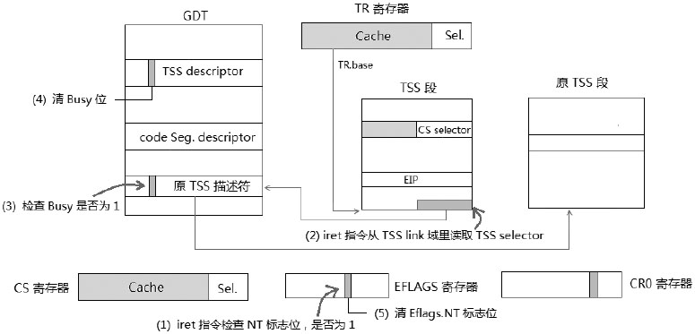

上图是iret指令在恢复TSS段里的image前处理器的工作。

① iret指令**检查当前的EFLAGS寄存器**，如果**NT标志置位**，则发起**Task切换**，否则**执行中断返回**。

② 处理器从**当前的TSS段**的**Previous Task Link域里读取TSS selector**，这个TSS selector是在call指令调用发起任务切换时写入的。处理器会对这个TSS selector**是否有效进行检查**，包括：① 是否为Null selector。② TSS selector的TI是否为0（即：**TSS描述符必须在GDT内**）。③ 是否超出GDT的**limit**。

③ 从TSS selector读取TSS描述符，并对TSS描述符进行一些检查，包括：① 是否为Busy状态。② Descriptor的类型是否正确（是否为TSS描述符）。

④ 处理器将对原TSS描述符的Busy进行清位，置为available状态。

⑤ 处理器清EFLAGS.NT标志位。

接下来，处理器将加载TR和原TSS段里的寄存器image，恢复被中断任务的处理器状态。

值得注意的是：执行iret指令**从TSS Link域读取TSS selector值**，处理器并**不会进行权限检查（不会检查TSS selector的RPL和TSS描述符的DPL**）。

从这个角度来看，TSS任务切换**具有一定的危险性**，iret指令可以**从3级权限**里**发起任务切换**到**0级权限**而**无须进行权限的检查**。前提是，**软件**必须构造一个**伪造的任务嵌套环境（包括完整的TSS段内容和GDT的TSS描述符**），然后将**EFLGAS.NT标志置位**，满足iret指令进行任务切换的要求。

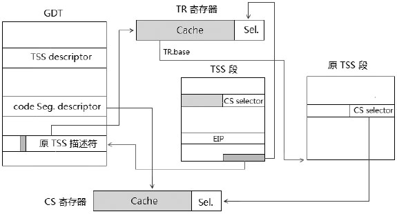

如同在call指令调用发起任务切换，在这个加载过程中进行完全相同的检查，详见前面所述。由于iret指令的特殊性，在程序中可以伪造一个任务嵌套环境。然后执行iret指令主动发起任务切换。现在我们可以通过实验来测试iret指令的任务切换。

>实验10-3：伪造一个任务嵌套环境，使用iret指令发起任务切换

使用iret指令可以从0级切换到3级，也可以从3级切换到0级（实现切换到任意权限）。

代码清单10-8（topic10\ex10-3\protected.asm）：

```assembly
；； 设置新 TSS 区域
      mov esi，tss_sel
      call get_tss_base
      mov DWORD [eax + 32]，tss_task_handler                ； 设置 EIP 值为
tss_task_handler
      mov DWORD [eax + 36]，0                                    ； eflags=0
      mov DWORD [eax + 56]，KERNEL_ESP                        ； esp
      mov WORD [eax + 76]，KERNEL_CS                           ； cs
      mov WORD [eax + 80]，KERNEL_SS                           ； ss
      mov WORD [eax + 84]，KERNEL_SS                           ； ds
      mov WORD [eax + 72]，KERNEL_SS                           ； es
；； 设置嵌套环境1：在当前的 TSS 段里写入 Link 域（目标任务的TSS selector）
      call get_tr_base
      mov WORD [eax]，tss_sel                                        ； 设当前的 TSS.link
；； 设置嵌套环境2：置目标 TSS descriptor 为 Busy 状态
      mov esi，tss_sel
      call read_gdt_descriptor
      bts edx，9                                                         ； TSS.busy=1
      mov esi，tss_sel
      call write_gdt_descriptor
；； 设置嵌套环境3：置 Eflags.NT 标志位
      pushf
      bts DWORD [esp]，14                                             ； eflags.NT=1
      popf
```

在这段代码里，我们需要设置3个任务嵌套环境。

① 在当前的TSS段的Previous task link域里写入目标任务的TSS selector，提供给iret指令读取。

② 将目标任务（被切换）的TSS descriptor置为Busy状态，iret指令会检查它是否为Busy状态。

③ 置Eflags.NT标志位，iret指令是依据NT标志而发起任务切换。

代码清单10-9（topic10\ex10-3\protected.asm）：

```assembly
user_entry：
      mov ax，user_data32_sel
      mov ds，ax
      mov es，ax
；； 在 3 级里发起任务切换到 0 级
      iret
      mov esi，msg1
      call puts                        ； 在用户代码里打印信息
```

在上面的用户代码里使用iret指令发起切换，从3级切换到0级（这是一个处理器非常脆弱的环节），在我们的新任务里：

代码清单10-10（topic10\ex10-3\protected.asm）：

```assembly
tss_task_handler：
   jmp do_tss_task
tmsg1 db '---> now，switch to new Task with IRET instruction！'，10，0
do_tss_task：
   mov esi，tmsg1
   call puts
   clts                         ； 清 CR0.TS 标志位
；；； 再伪造一个嵌套环境：从0级返回到3级，tss32_sel 是原 TSS selector
   call get_tr_base
   mov WORD [eax]，tss32_sel             ； 写入原 TSS selector
；；
   mov esi，tss32_sel
   call read_gdt_descriptor
   bts edx，9         ； TSS.busy=1
   mov esi，tss32_sel
   call write_gdt_descriptor
；； 设置嵌套环境3：置 Eflags.NT 标志位
   pushf
   bts DWORD [esp]，14       ； eflags.NT=1
   popf
； 使用 iret 指令切换回原 task
   iret
```

由于iret指令会清NT标志位及置旧任务的TSS描述符为available状态，因此如果我们需要在新任务里使用iret指令切换回原任务，则需要在任务handler里重新伪造一个嵌套环境（现在当前TSS段是新任务的）。

因此，在我们这个实验里一共伪造了两个嵌套环境，发起了两次任务切换，分别如下。

① 第1次，在3级权限代码里发起任务切换到0级权限里。

② 第2次，在新任务（0级代码）里，再发起任务切换，从0级切换回3级用户代码。

两次都使用iret指令进行，实验的结果如下。


这一次实验的结果，无论在Bochs还是VMware或者Intel/AMD的机器上都是正确的。
 
从OS安全角度来看，OS唯一能做的是，必须防止软件有能力去构造伪造的TSS任务切换环境。也就是恶意的TSS描述符不能被建立。也就等于必须保护GDT不被破坏（不过，从另一方面来说，GDT一旦被破坏，什么都变得脆弱了，什么防止手段都是空谈）。

在**x64体系**就变得安全得多，**利用TSS进行任务切换的机制已经被废除(！！！**)，包括**Task\-gate机制**。

### 4.4.6. 使用Task-gate加载CS寄存器

这是使用**call/jmp指令加载CS寄存器**最后的一种方法，Task\-gate的结构如下。

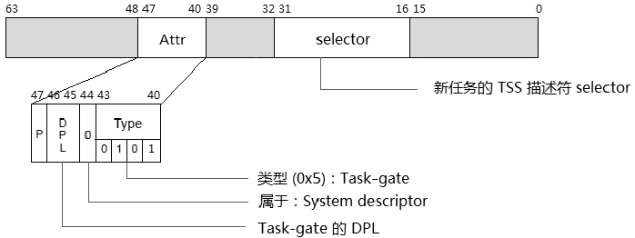

上图是在legacy模式下的Task-gate描述符结构，在long-mode（包括64位和compatibility模式）下并不存在Task-gate描述符。比起其他描述符，Task-gate描述符简单得多，仅有两部分是有效的：selector和attribute域。

#### 4.4.6.1. Selector域

这是新任务的TSS selector，其作用和TSS描述符的selector是一样的。

#### 4.4.6.2. Task-gate的类型

Task\-gate描述符的类型是0101B，属于系统级的描述符。

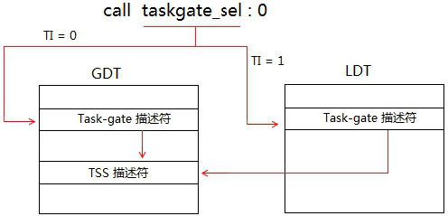

一个Task-gate描述符可以放在GDT、LDT，以及IDT里，如上所示，在call指令中提供一个Task-gate选择子，根据TI来在GDT和LDT之间进行选择，在从Task-gate描述符里获得TSS selector后，其他的工作都和使用TSS selector进行调用一致。

#### 4.4.6.3. selector和Task-gate描述符的常规检查

处理器会对所使用的Task-gate selector及Task-gate描述符做与10.5.4.4节的3中所描述的Call-gate调用中相似的常规检查。

#### 4.4.6.4. 访问Task-gate的权限检查

在使用Task-gate的调用中所需要的权限是

① Task-gate Selector的RPL <= Task-gate描述符的DPL

② CPL <= Task-gate描述符的DPL

处理器只对访问Task-gate描述符进行权限检查，并不对TSS描述符的访问进行检查。在Task-gate描述符里的Selector域的RPL，以及TSS描述符的DPL会被忽略。

>实验10-4：使用Task-gate进行任务切换

这个实验代码很简单，除了使用call taskgate_sel：0（换为Task-gate选择子）外，主要的代码如下。

代码清单10-11（topic10\ex10-4\protected.asm）：

```assembly
；； 设置 Task-gate 描述符
      mov esi，taskgate_sel                             ； Task-gate selector
      mov eax，tss_sel << 16
      mov edx，0xe500                                     ； DPL=3，type=Task-gate
      call write_gdt_descriptor
```

这几行代码是对Task-gate描述符进行设置，需要将Task-gate描述符的DPL设为3级，以便在用户代码里访问。然后在用户代码里进行调用，结果如下。


### 4.4.7. 在long-mode下TSS及任务切换

在long-mode下并**不支持TSS任务切换机制**（包括**使用TSS selector**和**Task-gate调用门！！！**），因此**Task\-gate**在**long\-mode**下是**不存在**的。而**TSS段**起了很大的变化，下面就来看long\-mode下的TSS段结构。

#### 4.4.7.1. long-mode下的TSS段

long\-mode下的TSS段结构如下。


在这个long\-mode下的TSS段，**只保留**了**3个权限级别的RSP指针**，**增加了7个IST（Interrupt Stack Table）指针**，**所有的域都是64位(！！！**)宽。

由于在**long\-mode**下**不支持处理器提供的任务切换机制(！！！**)，因而**Previous task link域**已经**不再存在**，所有**处理器的状态域**也都**被移去**。

**处理器提供的任务切换机制**确实比较烦琐耗时，现代的OS都不使用这种机制切换任务，long\-mode去除它也在情理之中。

**TSS段**的主要作用是为**Stack的切换**提供**各级权限的stack指针**。当**发生Stack切换**时，处理器**从TSS段**里获得**相应权限级别的RSP值**，加载到**RSP寄存器**中。

#### 4.4.7.2. 64位模式下的TSS描述符

compatibility模式的TSS描述符与legacy是一致的，在**64位模式**下，**TSS描述符**被扩展为**16字节128位**宽，如下图所示。


64位TSS描述符的高8字节的S和Type域固定为00000B（5个0值）。这和64位Call\-gate描述符是相同的原理，注意它的**Type域是1001B**值，这和32位TSS描述符的值是一样的，在**long\-mode**下这个值被解释为**64位TSS描述符**。

#### 4.4.7.3. long-mode下的TR加载

在**long\-mode**下**TR不能使用隐式的加载**（**不能使用任务切换机制**），因此**必须**使用**显式的加载(！！！但不是用来提供任务切换机制的！！！主要目的是为stack切换提供各权限的stack指针！！！**)。

```assembly
mov ax，tss_sel             ;TSS selector
ltr                         ;加载 TR
```

这个**tss\_sel不能为Null selector**，选择子的**TI必须为0**（**指示在GDT内**）。**ltr指令**只能在**0级权限(！！！**)里执行，这个tss\_sel.RPL被忽略不起作用。

处理器同样会对TSS selector和TSS descriptor进行10.5.4.4节4中所述的常规检查。

### 4.4.8. 使用int指令加载CS寄存器

在程序中使用**int指令**主动发起**调用中断服务例程**，处理器根据**Vector号**在**IDT**中获得**Interrupt Descriptor（中断描述符**）。中断描述符可以是**Interrupt\-gate（中断门**）、Trap-gate（陷井门），以及Task\-gate（任务门）。在long\-mode下Task\-gate已经被取消。

#### 4.4.8.1. IDTR中断描述符表寄存器

IDTR用来保存IDT的base地址和IDT limit值，下面是IDTR的结构。


**IDTR与前面所述的GDTR结构是完全一致的(！！！**)，内部只有2个组成部分：limit域和base域。在long-mode下base为64位，limit固定为16位，因此IDT最大的limit是0xFFFF，base可以在linear address空间的任何位置。**IDTR也是没有不可见部分的！！！**


上图是IDTR、IDT、GDT，以及中断向量之间的关系。IDTR.base提供IDT的基地址，IDTR.limit提供IDT表限。vector则是在IDT里访问gate descriptor，在IDT里的gate描述符提供目标代码段的selector，这个selector最终被加载到CS寄存器里，Code segment descriptor也被加载到CS寄存器的Cache部分。

#### 4.4.8.2. Interrupt/Trap gate descriptor

在**legacy模式**下，**每个gate descriptor**是**8字节64位宽**，gate描述符属于系统级的描述符，Task\-gate描述符在前面已经介绍过，下面看看Intrrupt\-gate与Trap\-gate**描述符**的结构。


Interrupt\-gate与Trap\-gate描述符的结构是完全一致的，只是**类型不同**。Interrupt\-gate的类型值是1110B（32位Interrupt\-gate）、0110B（16位Interrupt\-gate）。Trap-gate的类型值是1111B（32位Trap\-gate）、0111B（16位Trap\-gate）。

#### 4.4.8.3. 访问gate descriptor

在**legacy模式**下，IDT里的Interrupt/Trap\-gate和Task\-gate描述符都是**8字节**的，因此使用**中断指令调用**时，**vector乘上8再加上IDTR.base值**就得到**IDT内的描述符位置**。

```assembly
int 0x40          ;描述符位置在 IDTR.base + 0x40 * 8
```

#### 4.4.8.4. 常规检查

在加载CS寄存器前处理器会检查以下内容。

① 中断向量号访问是否超出IDT的limit。

② IDT内的描述符是否属于这三种gate描述符类型之一。

③ 对gate描述符内的Code segment selector及目标Code segment descriptor做10.5.4.4节1中所描述的常规检查。

#### 4.4.8.5. 权限的检查

在中断调用中，由于不使用selector，因此没有RPL权限的检查，这里所需要的权限如下。

① CPL <= gate 描述符的DPL。

② CPL >= 目标Code segment描述符的DPL（由低权限进入高权限或相等权限）。

在使用Call-gate进行调用的时候，我们知道CPL>=目标Code segment描述符的DPL，对于Interrupt-gate和Trap-gate有同样的限制。

如果需要让中断服务例程能在3级权限里调用，那么Interrupt/Trap-gate或者Taskgate描述符的DPL应设为3级。

例如，int 0x40指令能在用户代码里调用，那么对应IDT内0x40号的中断描述符DPL应为3。

#### 4.4.8.6. Interrupt/Trap-gate与Call-gate的异同

Interrupt\-gate和Trap\-gate具有许多与Call\-gate相同的地方。

① 它们的权限检查除了Interrupt/Trap\-gate没有检查RPL之外，其他都相同。

② 执行目标代码的机制是相同的，都是经由gate访问目标Code segment。

不同之处如下。

① **Call\-gate**可以放在**GDT/LDT**里，不能放在IDT中。Interrupt/Trap\-gate**只能放在IDT**里。

② Interrupt/Trap\-gate通过**int指令**、**int3指令**、**into指令**、**bound指令**以及发生中断和异常访问。而Call\-gate通过**call指令和jmp指令访问**。

>实验10-5：编写一个中断服务例程

在这个实验中，我们将打印信息的库函数包装一下，使用中断机制来访问，每个函数定义一个系统服务例程功能号，然后通过系统功能号来调用服务。

代码清单10-12（lib\lib32.asm）：

```assembly
；-------------------------------------------------------
； system_service（）：系统服务例程，使用中断0x40号调用进入
； input：
；                eax：系统服务例程号
；--------------------------------------------------------
__system_service：
      mov eax，[system_service_table + eax * 4]
      call eax                                       ； 调用系统服务例程
      iret
；******** 系统服务例程函数表 ***************
system_service_table：
      dd __puts                                           ； 0 号
      dd __read_gdt_descriptor                        ； 1 号
      dd __write_gdt_descriptor                       ； 2 号
```

在lib\lib32.asm模块里，\_\_system\_service（）是系统服务例程的入口函数，在开放给用户使用的接口中。它经过int 0x40来调用，作为实验，这里只定义了3个系统服务例程功能号，分别调用puts（）、read\_gdt\_descriptor（）和write\_gdt\_descriptor（）函数。这些功能号通过eax寄存器传递过来。

代码清单10-13（lib\lib32.asm）：

```assembly
；------------------------------------------------------
； set_user_interrupt_handler（int vector，void（*）（）handler）
； input：
；                esi：vector， edi：handler
；------------------------------------------------------
      sidt [__idt_pointer]
      mov eax，[__idt_pointer + 2]
      mov [eax + esi * 8 + 4]，edi                               ； set offset [31：16]
      mov [eax + esi * 8]，di                                          ； set offset [15：0]
      mov DWORD [eax + esi * 8 + 2]，kernel_code32_sel          ； set selector
      mov WORD [eax + esi * 8 + 5]，0E0h | INTERRUPT_GATE32   ； Type=interrupt gate，
P=1，DPL=3
      ret
```

函数\_\_set\_user\_interrupt\_handler（）设置一个用户级的Intrrupt-gate描述符，使得在3级权限里可以通过中断调用来调用服务例程。

代码清单10-14（topic10\ex10-5\protected.asm）：

```assembly
；； 设置系统服务例程入口
      mov esi，SYSTEM_SERVICE_VECTOR             ； 向量号为 0x40
      mov edi，system_service                      ； lib32 库接口函数
      call set_user_interrupt_handler
... ...
；； 在用户代码里调用：
      mov esi，msg1
      mov eax，SYS_PUTS            ； 系统服务例程号 0
      int 0x40                        ； 调用系统服务
```

在调用set\_user\_interrupt\_handler（）函数设置Interrupt\-gate描述符后，在用户级代码里通过int 0x40调用系统服务例程（本例中的puts函数），结果是通过这个服务例程打印如下的一条信息。


通过int指令和Call-gate调用是进入系统服务例程使用OS系统资源的两种方式，后面我们将会看到其他的方式。

#### 4.4.8.7. long-mode下的Interrupt/Trap-gate描述符

在**long\-mode**下Interrupt/Trap\-gate**描述符**是**16字节**的，如下所示。


在long\-mode（包括64位模式和compatibility模式）下**不存在Task\-gate描述符**，在IDT里只有Intrrupt/Trap-gate描述符，它们都是16个字节128位宽的。

#### 4.4.8.8. gate的类型

在long\-mode下只有64位的Interrupt\-gate描述符，类型值是**1110B**，以及64位的Trap\-gate描述符，类型值是1111B，不存在32位和16位。

#### 4.4.8.9. IST指针域

Interrupt/Trap\-gate描述符新增了一个**IST域**，共**3位宽**，在低8字节的bit 34到bit 32位里，定义了一个Interrupt Stack Table指针，这个值**对应**于**64位TSS**中的**IST1到IST7域**（前面所提到的64位TSS）。

假如Interrupt/Trap-gate描述符里的IST值是**001B到111B之间（即：1到7**），那么**发生中断或异常**切换到**中断处理程序**时，它从**64位TSS段里**取出**对应的IST指针值**（它为Interrupt处理程序**提供一个指定的RSP指针**）。

当Interrupt/Trap\-gate描述符里的**IST值是0值**时，不使用IST机制，将**从64位TSS段里相应的RSP0、RSP1，以及RSP2域获取RSP指针（即：使用原来的方法**）。关于IST我们将在后面的Stack描述里详细探讨。

>实验10-6：在Interrupt handler里使用IST指针

在这个实验里，将建立两个Interrupt handler，一个由0x40向量号调用，一个由0x41向量号调用，主体代码在topic10\ex10-6\long.asm文件里，实验运行在64位模式下。

代码清单10-15（topic10\ex10-6\long.asm）：

```assembly
；； 设置 system service
      mov rsi，SYSTEM_SERVICE_VECTOR                             ； 0x40
      mov rdi，system_service
      call set_user_interrupt_handler
；； 设置 interrupt handler
      mov rsi，SYSTEM_SERVICE_VECTOR + 1                        ； 0x41
      mov rdi，interrupt_handler
      call set_user_interrupt_handler
； 修改 gate descriptor
      mov rsi，0x41
      call read_idt_descriptor
      bts rax，32                                                      ； IST=1
      mov rsi，0x41
      call write_idt_descriptor
```

上面代码修改0x41号中断gate描述符的IST域，改为1（即使用IST1指针），TSS中的IST1值为0FFFFFFFFFE10FF0h。在用户代码里分别调用了int 0x40和int 0x41进行测试，结果如下。


我们看到对于0x40号中断来说是使用RSP0值，而0x41号中断是使用我们提供的IST1值。

### 4.4.9. 使用int3、into，以及bound指令加载CS寄存器

Int3指令也是主动发起调用Interrupt handler的方式之一，而into指令和bound指令是根据条件触发，当满足条件时才引起异常handler的调用。

#### 4.4.9.1. #OF异常

INTO指令的有效性取决于**EFLAGS寄存器的OF标志（溢出标志**），OF置位时，执行INTO指令产生#OF（Overflow）异常，否则INTO指令不起作用。INTO指令在64位模式里是无效的。

#### 4.4.9.2. #BP异常

执行INT3指令将产生#BP（BreakPoint）异常，debugger（调试器）通常用来对被调试目标下断点，INT3指令的opcode码是0xCC，与两个字节的int 3指令（opcode码为CD 03）有细微的差距（除了介入virtual 8086模式外，其他一致）。

#### 4.4.9.3. #BR异常

BOUND指令检查给出的index值在指定的范围内**是否有越界行为**，如果越界就产生#BR异常，BOUND指令在64位模式里是无效的。

>实验10-7：测试INTO、INT3及BOUND指令

这三条指令分别在用户代码里进行测试，它们在同一个源代码文件里，下面是对bound指令的测试。

代码清单10-16（topic10\ex10-7\protected.asm）：

```assembly
；； 测试 bound 指令
      mov eax，0x8000                                     ； 这个值将越界
      bound eax，[bound_rang]                           ； 引发 #BR 异常
... ...
bound_rang        dd        10000h                         ； 给定的范围是 10000h 到 20000h
                  dd        20000h
```

bound指令对0x8000（在eax寄存器内）这个值在10000h到20000h范围内测试是否越界，结果是向下越界了，将产生#BR异常（注意#BR异常属于Fault类型，意味着需要修正异常发生点）。下面是对INTO指令的测试。

代码清单10-17（topic10\ex10-7\protected.asm）：

```assembly
；； 测试 INTO 指令
      mov eax，0x80000000
      mov ebx，eax
      add eax，ebx                                             ； 产生溢出，OF标志置位
      into                                                       ； 引发 #OF 异常
```

80000000h加上80000000h的结果产生了溢出，OF标志置位，引发#OF异常。

我们重点来关注#BP异常，断点异常是一个很有用处的异常，在调试时，调试器将插入0xCC字节到设定的断点位置，下面是模拟调试器插入断点示意图。

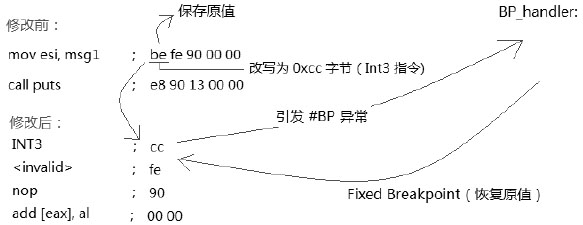

在插入前需要保存断点位置上的原来值，然后将断点位置上的字节改写为0xCC字节，修改后，这个断点就感觉是插入了一条INT3指令，实际上是改写了断点上的字节。改写后断点上的指令将发生改变，如上图所示情形。

由于断点上的指令被改写了，因而在BP_handler里需要恢复断点上原来的值，否则程序代码将出现异常情况，在后续的指令流里90%以上会出现#UD异常。

代码清单10-18（topic10\ex10-7\protected.asm）：

```assembly
；； 断点调试的使用
      mov al，[breakpoint]                                ； 保存原字节
      mov BYTE [breakpoint]，0xcc                       ； 写入 int3 指令
breakpoint：
      mov esi，msg1                                         ； 这是断点位置，引发 #BP 异常
      call puts
```

在上面的代码里，断点的位置设在一条mov指令里，断点的原值保存在eax寄存器里，以便于在BP handler里用它来进行恢复。

代码清单10-19（topic10\ex10-7\protected.asm）：

```assembly
；--------------------------------------
； BP_handler（）：#BP handler
；--------------------------------------
BP_handler：
jmp do_BP_handler
bmsg1 db 10，10，10，'---> Now，enter #BP handler，Breakpoint at：'，0
do_BP_handler：
      push ebx
      mov bl，al
      mov esi，bmsg1
      call puts
      mov esi，[esp + 4]   ；  返回值
      dec esi      ；  breakpoint 位置
      mov [esp + 4]，esi   ； 修正返回值
      mov BYTE [esi]，bl   ； 修复 breakpoint 数据
      call print_value
      pop ebx
      iret
```

上面是BP\_handler代码，只是简单地输出一条信息，然后恢复原断点上的字节，保证后续执行成功，注意，这里需要将返回值修改为断点位置。由于#BP异常是Trap类型的异常，它的返回值是断点的下一条指令，所以这里需要恢复断点的执行。

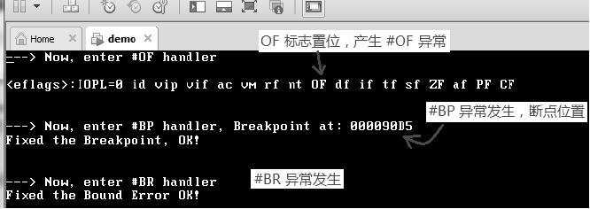

上面是这三条指令的测试结果，在OF_handler里还输出了发生#OF异常时的EFLAGS寄存器的值。

实验的源代码在topic10\ex10-7\目录下，其中OF\_handler使用dump_flags_value（）函数来打印eflags寄存器的值，实现在lib\creg.asm文件里。

### 4.4.10. 使用RETF指令加载CS与SS寄存器

从正常途径来说RETF（远调用返回）**指令是与FAR** **Call（远调用）指令配套的**，可是RETF指令也常常单独使用。

```assembly
;进入 ring 3 代码
      push DWORD user_data32_sel | 0x3 
      push DWORD USER_ESP           
      push DWORD user_code32_sel | 0x3  
      push DWORD user_entry
      retf
```

上面的代码被使用在**从0级切换到3级的场合**下，实际上这也属于**伪造Call\-gate服务例程的返回环境**，retf指令在执行时，处理器会进行一系列的工作。

#### 4.4.10.1. 权限的处理

处理器会检查**stack内的CS selector值**，看是否需要进行**权限与stack的切换**。


如上图所示，**当前的CPL**与**当前stack栈内(！！！)的CS selector.RPL**对比有三种情形。

① 当**CPL=CS.selector.RPL**时，retf指令将返回同级权限的代码，**权限不变**，**无须发生stack的切换**。这意味着，处理器不会POP出栈内的ESP和SS值。


在返回同级代码这种情形下，意味着你不需要压入SS与ESP，否则这将造成栈的不平衡。

② 当**CPL \< CS.selector.RPL**时，表明**目标代码是低权限级别（允许切换到低权限代码**），接下来将发生**权限改变和进行stack的切换**。


处理器会比较**栈内的CS.selector.RPL**和**SS.selector.RPL()是否相等**，如果**不相等会产生\#GP异常**，当所有检查都通过后，处理器会**依次POP**出**EIP**、**CS**、**ESP**与**SS值**，转入执行**新代码**。

③ 当CPL>CS.Selector.RPL时，意味着目标代码是高权限代码，将产生\#GP异常，**不能**使用**retf指令切换到高权限(！！！**)上。


**只能通过gate形式(调用门也是！！！**)进入以及**使用TSS**发起**任务切换到高权限代码(！！！**)。

#### 4.4.10.2. Selector与所使用的Descriptor的权限检查

① SS selector的RPL必须与所使用的Data段描述符的DPL相等。

② 如果返回的目标代码是conforming类型的，那么需要CS selector的RPL>=Code段描述符的DPL。

③ 如果返回的目标代码是non-conforming类型的，需要CS selector的RPL等于Code段描述符的DPL。

#### 4.4.10.3. Selector及Descriptor的类型检查

处理器还会对Selector及Descriptor做些类型的检查工作。

① CS selector与SS selector是否为Null selector，是的话将产生#GP异常。

② CS selector与SS selector是否超出GDT/LDT的limit。

③ 对CS与SS的段描述符进行检查：P是否为1，S标志是否为1（Code/Data段）。

④ 对CS所使用的段描述符来说，描述符类型是否为Code段描述符。

⑤ 对SS所使用的段描述符来说，描述符类型是否为Data段，是否属于Writable（可写）。

#### 4.4.10.4. CS与SS寄存器的加载

当权限检查和上面这些检查都通过后，处理器会使用selector来加载CS与SS寄存器。

#### 4.4.10.5. 隐式的Null selector加载

在前面提到当使用retf指令或iret指令返回到低权限代码时，处理器会为ES、DS、FS及GS寄存器隐式地加载Null selector，进入低权限代码后应该重新加载这些段寄存器。

### 4.4.11. 在long-mode下使用RETF指令

在**long\-mode（IA\-32e**）下的返回机制和legacy模式下是一致的，由于long\-mode（IA\-32e）下有两个子模式：64位模式和compatibility模式，因而增加了一些隐晦的地方。


当前代码运行在**64位模式**，处理器会**检查在stack中的CS selector(也就是原来的CS！！！**)，根据这个selector所引用的**Code segment descriptor(代码段描述符！！！**)指示出**返回到64位模式还是compatibility模式**。当返回的目标代码段描述符的**L=0**时，将返回到compatibility模式，当**L=1**时D标志位必须为0，指示返回到64位模式。

#### 4.4.11.1. 从64位模式返回到64位模式

这是最为常见的情形，除了legacy模式下的检查外，处理器会额外检查如下内容。

① 栈中的**RIP与RSP值**是否属于canonical地址形式（详见第2章中的canonical地址描述），不是的话产生\#GP异常。

② 栈中的**SS selector**是否属于03H（即：3级权限下的Null selector），如果为3则产生#GP异常（详见前面关于Null selector所述）。如果**切换到相应的0级、1级或2级**，那么0、1或2将是允许的**Null selector**。


retf指令的**默认操作数是32位**的，因此返回到64位代码，**retf指令**需要在前面额外**手工加上REX前缀0x48字节（REX.W=1！！！**），否则只能pop出32位的值。

```assembly
;; 切换到用户代码
      push USER_SS | 3
      push USER_RSP     ； RSP 值在 32 位内
      push USER_CS | 3                    ； 3 级权限
      push user_entry
      db 0x48                                ； REX prefix
      retf
```

上面这个代码切换到64位的3级用户代码里，进入3级代码后，ES、DS、FS和GS都会被隐式地装入Null selector，但是在64位模式下，这些Null selector并不需要去理会，处理器不检查Null selector的使用。

上面代码中的RSP在32位值范围内可直接使用push指令压栈。如果使用64位的RSP值，必须通过使用寄存器来压栈。

```assembly
；； 切换到用户代码
      push USER_SS | 3
       mov rax，USER_RSP        ； 使用 64位的RSP值
      push rax          ； 通过rax寄存器压入64位的RSP值
      push USER_CS | 3                       ； 3 级权限
       mov rax，user_entery     ； 使用64位的入口地址
      push rax         ； 压入64位的入口地址
      db 0x48                                   ； REX prefix
      retf
```

这是由于push指令并不支持64位的立即数操作数，只能通过寄存器来进行压栈操作。同理，当入口地址是64位地址，也必须通过寄存器来压栈，切记！

#### 4.4.11.2. 从64位模式返回到compatibility模式

如果返回到compatibility模式，处理器的检查机制将和legacy模式下完全一致，在返回compatiblity模式里时需要注意目标地址问题。


① 需要为目标代码准备32位或16位的Code segment descriptor，即描述符的L=0，D标志位取决于返回是32位还是16位：D=1时是32位，D=0时是16位。

② 目标代码必须为4G范围内，需要为目标代码准备32位的EIP和ESP值（stack内的64位值里低32位是有效的目标代码进入点），如果在返回前压入的是64位的目标地址值，那么返回后将由于使用截取低32位值而造成错误的指令边界。

>实验10-8：从64位里返回到compatibility模式

下面是一个简单的实验，实验代码将从protected.asm模块转入到long.asm模块里，这个模块运行在64位模式。

代码清单10-20（topic10\ex10-8\long.asm）：

```assembly
；； 切换到 compatibility mode（进入 3 级）
      push user_data32_sel | 3
      push COMPATIBILITY_USER_ESP
      push user_code32_sel | 3
      push compatibility_entry
      retf64           ； 统一使用 retf64宏
；；  下面是 32 位的 compatibility 模式代码
      bits 32
compatibility_entry：
      mov ax，user_data32_sel | 3
      mov ds，ax
      mov es，ax
；； 通过 stub 函数从compatibility模式调用call gate 进入64位模式
      mov esi，cmsg1
      mov eax，LIB32_PUTS                                       ；； 功能函数号
      call compatibility_lib32_service                        ；； stub 函数形式
      jmp $
      cmsg1        db '---> Now：enter compatibility mode'，10，0
```

代码的前一段是64位代码，使用retf指令（宏定义了retf64，这个宏定义在inc\CPU.inc文件里）进入到32位的3级compatibility模式代码，注意由于后面一段是32位代码，因而需要用bits 32指示编译器编译为32位的代码。

进入compatibility模式后重新对DS和ES寄存器行了装载，然后调用一个compatibility\_lib32\_service接口函数，这个函数运行在64位模式，是lib64模块提供的对外服务接口，为了避免重复工作，实际上在这个64位的服务函数里调用了32位的lib32模块的函数。compatibility\_lib32\_service（）接口函数实现在lib\lib64.asm模块里。

实验的结果是使用compatibility\_lib32\_service（）来打印如下的一条信息。


#### 4.4.11.3. 从compatibility模式返回到64位模式

从32位的compatibility模式返回到64位模式，同样会遇到目标地址的问题。如果需要返回到4G以上的空间执行，那么需要一些中间跳转过程。


在32位的compatibility模式下，由于栈内的EIP值是32位，执行retf指令后只能返回到4G内的代码，因此可以设置一条jmp指令提供大于4G的地址，然后跳到高于4G的空间。

```assembly
entry64_stub：
      mov rax，entry64      ； 64位入口
      jmp rax         ； 跳转到高于 4G的空间
      … …
```

返回到64位模式，处理器同样会做额外检查。

① 栈中的RIP与RSP值是否属于canonical地址形式（详见第2章中的canonical地址描述），不是的话产生#GP异常。但是对于compatibility模式下来说，栈中的32位ESP与EIP值必定属于canonical地址形式。实际上无须进行检查。

② SS selector是否属于03H，即3级权限下的Null selector，如果为3则产生#GP异常（详见前面关于Null selector所述）。如果切换到相应的0级、1级或2级，那么0、1或2将是允许的Null selector。

同样，如果从高权限返回到低权限里会为ES、DS、FS和GS寄存器隐式加载一个Null selector。

>实验10-9：从compatibility里返回到64位模式

这个实验与实验10-8的操作相反，在这里我们选择先从64位模式切换到compatibility模式，然后从compatibility模式返回64位模式。

代码清单10-21（topic10\ex10-9\long.asm）：

```assembly
；； 从 64 位切换到 compatibility mode（权限不改变，0 级）
      jmp QWORD far [compatibility_pointer]
compatibility_pointer：
            dq compatibility_kernel_entry              ； 64 bit offset on Intel64
            dw code32_sel
```

为了达到实验目的，这里先使用jmp指令提供一个far pointer来切换到compatibility模式，这是个平级的切换。来到compatibility模式后也是0级权限。

在Intel64中，在64位操作数下far pointer是80位（16：64）宽，在AMD64中far pointer是48位（16：32）宽。

接下来在compatibility模式代码里使用retf指令返回到3级权限的64位模式里。

代码清单10-22（topic10\ex10-9\long.asm）：

```assembly
      bits 32
；； 0 级的 compatibility 代码入口
compatibility_kernel_entry：
      mov ax，data32_sel
      mov ss，ax
      mov ds，ax
      mov es，ax
      mov esp，COMPATIBILITY_KERNEL_ESP
      jmp compatibility_entry
；； 3 级的 compatibility 代码入口
compatibility_user_entry：
      mov ax，user_data32_sel | 3
      mov ds，ax
      mov ss，ax
      mov es，ax
      mov esp，COMPATIBILITY_USER_ESP
compatibility_entry：
；； 通过 stub 函数从compatibility模式调用call gate 进入64位模式
      mov esi，cmsg1
      mov eax，LIB32_PUTS
      call compatibility_lib32_service                        ；； stub 函数形式
；； 现在切换到 3级 64位模式代码
      push USER_SS | 3
      push COMPATIBILITY_USER_ESP
      push USER_CS | 3
      push user_entry
      retf
cmsg1        db '---> Now：enter compatibility mode'，10，0
```

这里修改了compatibility代码开头，为compatibility模式代码提供了两个入口，一个是0级的入口，一个是3级的入口，那么现在就可以使用retf指令返回到3级的compatibility模式里，也可以使用jmp指令切换到0级的compatibility模式里。这样做的目的是为SS、DS等寄存器选择正确的权限描述符进行加载。

在代码的未尾是使用retf指令返回到3级权限的64位模式代码里。


结果显示先进入了compatibility模式，然后返回到64位的用户代码。

从64位切换到compatibility模式，或者从compatibility切换到64位模式，在权限不变的前提下可以使用jmp指令。然而在64位操作数下，由于AMD64的机器上far pointer是48位（16：32），而Intel64机器上是80位（16：64），因而为了通用性，jmp指令统一使用32位操作数或者使用retf指令切换（或iretq指令）是一个不错的做法。

#### 4.4.11.4. Jmp指令在64位操作数下的变通

如果坚持使用64位的操作数来执行jmp指令，那么可以有下面的逻辑处理手法。

```c
      if （processor == INTEL64）      ； 判断是 Intel 还是 AMD
      {
            rax=intel64_compatibility_pointer
      } else if （processor == AMD64）
      {
            rax=amd64_compatibility_pointer
      }
      jmp QWORD far [rax]               ； 固定使用 64 位操作数
intel64_compatibility_pointer：
            dq compatibility_kernel_entry               ； 64 bit offset on Intel64
            dw code32_sel
amd64_compatibility_pointer：
            dd compatibility_kernel_entry               ； 32 bit offset on AMD64
            dw code32_sel
```

上面是使用jmp指令进行切换时的一个逻辑做法：先判断是Intel还是AMD的处理器。由于64位操作数下Intel与AMD使用不同长度的far pointer，因而应该为两个平台准备相应长度的far pointer。

#### 4.4.11.5. Jmp指令使用32位操作数

在32位操作数下，far pointer都是48位宽（16：32形式）。在切入compatibiltiy模式的情形里，由于compatibility模式使用32位的入口地址。因此，实际上统一使用32位的操作数是最好的解决方法。

```assembly
      jmp DWORD far [rax]       ； 强制使用32位操作数
compatibility_pointer：
      dd compatibility_kernel_entry    ； 32位的入口地址
      dw code32_sel
```
jmp指令统一使用32位操作数，无论在Intel还是AMD平台上都能用。

#### 4.4.11.6. 使用retf指令来切换

另一个通用做法是，使用retf指令来切换到同级的compaitibility模式。

```assembly
;; 从64位切换到同级compaitbility代码
      push code32_sel        ； 同级
      push compatibility_kernel_entry    ； 32位EIP值
      db 48h          ； REX prefix（使用64位操作数）
      retf           ； far return指令
```

上面的代码在栈上压入了compatibility代码的far pointer，这些32位的值会被符号扩展到64位压入栈中。使用retf指令来切换，在无论Intel还是AMD的机器上都是正确的。

### 4.4.12. 使用IRET指令加载CS和SS寄存器

在前面我们看到了伪造一个任务嵌套环境使用iret指令进行任务切换，iret指令使用TSS selector从TSS段中加载CS和SS寄存器。在这一节里我们使用iret指令进行正常的中断返回调用。使用**iret指令返回**实际上也属于**伪造一个中断handler返回环境**。


使用**IRET指令**与使用**RETF指令**的情形几乎一致，除了在**中断调用发生**时，处理器额外**压入EFLAGS寄存器**外。对于**一些异常**的发生，处理器还将**压入Error Code**，那么在中断handler里需要主动POP出这个Error Code，否则返回将失败。

对于权限的检查，以及selector与descriptor的检查，和使用RETF指令是一样的。当**进入中断**handler**不发生权限改变**时，处理器**只依次压入EFLAGS寄存器、CS selector、EIP值或者Error Code（某些异常**）。


前面我们已经知道，**当EFLAGS.NT标志置位**时，**IRET指令**会使用**TSS段内Previous Task Link域**提供的**TSS selector进行任务切换**。我们可以**清NT标志**，而**使用IRET中断返回机制**。

#### 4.4.12.1. 使用IRET指令返回

在前面使用retf指令**从0级代码返回到3级权限**的例子里，**也可以改用iret指令**来代替。区别是**多压入一个EFLAGS寄存器**。

```assembly
； 进入 ring 3 代码
      push DWORD user_data32_sel | 0x3
      push DWORD USER_ESP
      pushf                                 ;压入 EFLAGS 值
      push DWORD user_code32_sel | 0x3
      push DWORD user_entry
      iret                                  ;使用 iret 指令切换到 3 级代码
```

上面这段代码将retf使用的场合改为使用iret指令，增加了一条EFLAGS寄存器的压入指令，实际效果是完全一致的。

### 4.4.13. 在long-mode下使用IRETQ指令

在**64位模式下**的**压栈行为**与**legacy模式及compatibility模式**有较大区别：当发生**中断/异常**时，无论**是否发生权限改变**，处理器都**压入SS与RSP值**。


同样**iretq指令**也会**无条件地POP出SS与RSP值**。在long\-mode里中断处理程序的**栈指针是64位宽**的，在compatibility模式下发生中断/异常，处理器会切入到64位模式下的中断处理程序。在64位模式下中断处理程序使用IRETQ指令返回（64位的操作数）。

>可是，我们依然可以在32位的compatibility模式的代码里使用iret指令返回到64位模式。

注意这里的区别：① 在中断handler里需使用**64位操作数的IRETQ指令**（因为中断handler是执行在64位模式下）。② 在用户的compatibiltiy模式代码中需使用IRET指令（32位的操作数）。

下面几个情形与RETF指令的使用是一致的。

#### 4.4.13.1. 使用IRETQ指令从64位模式返回到64位模式

下面是从0级权限返回到3级权限下，在这里的结构与legacy下是完全一致的。

```assembly
push USER_SS | 3
push USER_RSP
pushfq
push USER_CS | 3
push user_entry
iretq                                       ； 使用64位操作数，返回到 3 级权限
```

区别只是使用了64位宽度。这里**IRETQ指令**是**IRET指令的64位别名**，只是在**机器码前面加上了REX前缀**。

#### 4.4.13.2. 使用IRETQ指令从64位模式返回到compatibility模式

同样，当使用iretq指令从64位返回到compatibility模式时，需要提供4G内的入口地址。

```assembly
；； 使用 iret 切换到 compatibility mode（进入 3 级）
      push user_data32_sel | 3
      push USER_RSP
      pushfq
      push user_code32_sel | 3       ;用户compatibility 模块入口
      push compatibility_user_entry
      iretq            ； 使用 64位操作数
```

栈中入口地址的低32位必须是有效的4G内地址值。返回到compatibility模式与返回到64位模式的区别只是使用了32位的compatibility模式代码段（Code段描述符的L标志为0，D标志为1）。这与RETF指令使用的情形是一样的。

必须注意的是，在64位模式下，不论是否发生权限切换，必须无条件压入SS与RSP值！

#### 4.4.13.3. 使用IRET指令从compatibility模式返回到64位模式

在这里需要使用32位的IRET指令（因为当前执行在32位的compatibility模式下），提供4G范围内的返回地址值（因为栈中的值是32位）。

```assembly
;;使用 iret指令从 3级compatibility 模式切换到 3 级64位模式
      pushf      ;压入 eflags 值
      push USER_CS | 3         ;在 4G 范围内
      push user_entry
      iret                     ;使用 32 位操作数，返回到64位模式
```

实验10-10的源码在topic10\ex10-10\long.asm文件里，这里不再列出。

>实验10-10：使用iret指令进行切换

结果如下。


与实验10-9的结果是完全一致的，在表面上根本看不出来，在实际代码里，一个是使用RETF指令，另一个是使用IRET指令。另外的区别是，在实验10-9里先使用jmp指令从0级的64位模式切换到0级的comaptibility模式里，再从0级的compatibility模式返回到3级的64位模式。而实验10-10里，是先使用IRETQ指令从0级的64位模式返回到3级的compatibility模式，再使用IRET指令从3级的compatibility模式返回到3级的64位模式。

### 4.4.14. 使用SYSENTER/SYSEXIT指令加载CS与SS寄存器

**sysenter与sysexit指令**是处理器提供**快速切入0级代码**及**快速返回到3级代码**的一对指令。


上图是sysenter/sysexit指令使用的**三个MSR**，它在前面的第7章介绍过。

- 在**Intel64**中，**SYSENTER/SYSEXIT指令**可以使用在**long\-mode**里，
- 在**AMD64**中**只能**使用在**legacy模式**。

**IA32\_SYSENTER\_CS寄存器**将会提供**4个selector**值。

① 进入时目标代码的CS selector，它等于IA32\_SYSENTER\_CS[15：0]。

② 进入时目标代码的SS selector，它等于IA32\_SYSENTER\_CS[15：0]+8。

③ 返回时目标代码的CS selector，它等于IA32\_SYSENTER\_CS[15：0]+16。

④ 返回时目标代码的SS selector，它等于IA32\_SYSENTER\_CS[15：0]+24。

#### 4.4.14.1. 使用SYSENTER指令进入0级权限代码

**sysenter指令**可以**执行于任何权限**中，但是**不要企图在非3级（CPL！=3）权限下使用sysenter指令**，因为 **sysexit指令会强制返回到3级！！！** 权限里（当然：在不使用sysexit指令返回时可以这么做！），这里会造成严重错误。

在**执行sysenter指令**时，处理器会**强制对CS和SS寄存器的加载**进行一些处理。

① **CS寄存器**被设置为：CS.Selector.RPL=0，**CS.Base=0**，CS.Limit=FFFFFFFFH。而CS的Attribute域则被设为：G=D=P=S=1，DPL=0，CS.Attribute.Type被设为1011B（Excute/Readable，Accessed）类型。

② **SS寄存器**被设置为：SS.Selector.RPL=0，**SS.Base=0**，SS.Limit=FFFFFFFFH。SS的Attribute域也被设置为：G=D=P=S=1，DPL=0，类型设为0011B（Writable，Expandup，Accessed）

注意：处理器并**不去GDT里读segment descriptor**，而是**直接对CS和SS寄存器进行强制设置**。

比较有意思的是，在**IA32\_SYSENTER\_CS寄存器里只要不是Null selector**，其他值都可以。

```assembly
mov eax，0x10 | 3               ;selector为 0x13
mov ecx，IA32_SYSENTER_CS
wrmsr                           ;设置 IA32_SYSENTER_CS
```

**即使CS selector被设为0x13值**，这个**selector的RPL为3**，并且它是Data段描述符的selector也没问题。这是因为处理器**根本不去GDT/LDT中读取描述符**。

胡乱给IA32\_SYSENTER\_CS设一个值，要小心处理。在以后的代码执行流里**如果出现了stack切换**时，一个**混乱的值会引发\#GP异常**的产生。

在**正常的情况下不要对IA32\_SYSENTER\_CS随便设一个值**，以防后续处理出现问题。

代码清单10-23（lib\lib32.asm）：

```assembly
；-----------------------------------------------------
； set_sysenter（）：设置系统的 sysenter/sysexit 使用环境
；-----------------------------------------------------
__set_sysenter：
      xor edx，edx
      mov eax，KERNEL_CS
      mov ecx，IA32_SYSENTER_CS
      wrmsr                                                    ； 设置 IA32_SYSENTER_CS
      mov eax，KERNEL_RSP0
      mov ecx，IA32_SYSENTER_ESP
      wrmsr                                                    ； 设置 IA32_SYSENTER_ESP
      mov eax，__sys_service
      mov ecx，IA32_SYSENTER_EIP
      wrmsr                                                    ； 设置 IA32_SYSENTER_EIP
      ret
```

这个set\_sysenter()提供在lib\lib32.asm文件里，对sysenter/sysexit使用环境做出配置。

#### 4.4.14.2. 使用SYSEXIT指令退回到3级权限代码

**sysexit只能执行在0级权限的代码(！！！**)里，处理器同样对CS和SS进行强制的设置。

① CS寄存器被设置为：CS.Selector.**RPL=3**，**CS.Base=0**，CS.Limit=FFFFFFFFH。而CS的Attribute域则被设为：G=D=P=S=1，DPL=3，CS.Attribute.Type被设为1011B（Excute/Readable，Accessed）类型。

② SS寄存器被设置为：SS.Selector.**RPL=3**，**SS.Base=0**，SS.Limit=FFFFFFFFH。SS的Attribute域也被设置为：G=D=P=S=1，DPL=3，类型设为：0011B（Writable，Expandup，Accessed）。

所不同的是，**sysexit指令**将**CS和SS寄存器的权限设为3级**。而**sysenter指令设为0级**。

**sysexit指令**会使用**ECX寄存器**与**EDX寄存器**。

① 3级代码的**ESP值**放在**ECX寄存器**里。

② 3级代码的**EIP值**放在**EDX寄存器**里。

因此，在使用sysenter指令进入前，需要为返回代码对ECX和EDX寄存器进行预先的设置。

代码清单10-24（lib\lib32.asm）：

```assembly
；--------------------------------------------------------
； sys_service（）：使用 sysenter/sysexit 版本的系统服务例程
； input：
；                eax：系统服务例程号
；--------------------------------------------------------
__sys_service：
      push ecx                                                ； 保存返回 esp 值
      push edx                                                ； 保存返回 eip 值
      mov eax，[system_service_table + eax * 4]
      call eax                                                ； 调用系统服务例程
      pop edx
      pop ecx
      sysexit
```

如上面的代码，在0级的系统服务例程里应该先要保存这两个值（需要使用到ECX和EDX寄存器），在返回前恢复这两个值。

#### 4.4.14.3. 非对称地使用sysenter/sysexit指令

值得注意的是：**有些OS**的**系统服务例程的调用只使用了sysenter指令**进入，而在某些情况下并没有使用sysexit指令返回。这种非对称的使用为系统服务例程调用机制提供了某些灵活性。

#### 4.4.14.4. 设置一个stub函数

**多数情况**下并**不在代码**里**直接使用sysenter指令**，而是将sysenter指令**封装**起来，设置一个stub函数作为中转站。

代码清单10-25（lib\lib32.asm）：

```assembly
；---------------------------------------------------
； sys_service_enter（）：快速切入 service 的 stub 函数
；---------------------------------------------------
__sys_service_enter：
      mov ecx，esp              ;返回代码的 ESP 值
      mov edx，return_address   ;返回代码的 EIP 值
      sysenter                  ;进入 0 级 service
return_address：
      ret
```

这个**sys\_service\_enter**()实现在lib\lib32.asm文件里，**EDX寄存器**设置为**sysenter指令的下一条指令**，这是为了**正常返回到指令流**里。

```assembly
mov esi，msg1
mov eax，SYS_PUTS                  ； 系统功能号
call sys_service_enter            ； sysenter指令stub函数
```

在用户代码里就可以像上面一样调用这个stub函数，sysenter指令被包装起来，看起来和平常的函数没区别。

在lib\lib32.asm文件里有两个系统服务接口函数，一个是\_\_sys\_service()函数，使用了sysenter/sysexit指令来调用/返回。另一个是\_\_system\_service（）函数，它使用int 0x40指令来调用。两个系统服务接口实现相同的功能。

上面的调用也可以使用以下的方式。

```assembly
mov esi，msg1
mov eax，SYS_PUTS                  ； 系统功能号
int 0x40                             ； 使用中断调用进入系统服务例程
```

**现在的OS**都支持使用快速的切入系统服务例程方式。而**中断调用**虽然是一种旧式并且较慢的系统服务例程调用方式，但是可以在**任意权限**下执行，这是使用sysenter/sysexit指令快速调用方式做不到的（除了使用非对称的sysenter/sysexit指令外，下面的描述排除了非对称使用sysenter/syexit指令的情形），原因如下。

#### 4.4.14.5. 在3级权限里使用sysenter调用

由于sysexit返回到3级权限里，因此在非3级权限代码里使用sysenter会遇到很大问题。假如在0级代码里使用sysenter进入服务例程，而sysexit返回时会强行变成3级权限。因此，必须保证从3级代码里使用sysenter进入系统服务例程。

### 4.4.15. 在IA-32e模式下使用SYSENTER/SYSEXIT指令

在AMD64机器上sysenter/sysexit不能使用在long\-mode下，所以这里使用了IA-32e术语（Intel64的术语）。在IA\-32e模式下，CS和SS selector获取起了些变化。


sysenter指令进入时，CS和SS selector的获取方法不变，在sysexit返回时，根据返回的模式而决定如何获取。如果返回到compatibility模式则和legacy模式下是一致的。而在返回64位模式时，CS selector是IA32\_SYSENTER\_CS+32，而SS selector是IA32\_SYSENTER\_CS+40。实际上就等于扩展了为64位环境所使用的selector值。

在配置sysenter/sysexit使用环境时，GDT/LDT中Code segment descriptor与Data segment descriptor应组织如下。


实际上是64位模式返回的Code segment和Data segment描述符排列在compatibility模式的后面。

IA32\_SYSENTER\_ESP和IA32\_SYSENTER\_EIP寄存器的地址值是64位宽，处理器会检查是否属于canonical地址形式。

#### 4.4.15.1. 设置IA-32e模式里的sysenter/sysexit使用环境

这个设置几乎与legacy模式下是一致的，可是需要注意以下几点。

① 由于IA-32e模式的sysexit指令为了返回64位模式而相应增加了2个selector，因此在GDT/LDT里的Code Segment descriptor与Data Segment descriptor的位置要相应做出调整（或另外增加2个描述符），以适应sysexit指令的使用。

② 进入0级目标代码的地址需要是64位的canonical地址，目标代码必须为64位模式。

代码清单10-26（lib\lib64.asm）：

```assembly
；----------------------------------------------------------------
； set_sysenter（）：               long-mode 模式的 sysenter/sysexit使用环境
；----------------------------------------------------------------
__set_sysenter：
      xor edx，edx
      mov eax，KERNEL_CS
      mov ecx，IA32_SYSENTER_CS
      wrmsr                                                        ； 设置 IA32_SYSENTER_CS
      mov rdx，KERNEL_RSP
      shr rdx，32
      mov rax，KERNEL_RSP
      mov ecx，IA32_SYSENTER_ESP
      wrmsr                                                        ； 设置 IA32_SYSENTER_ESP
      mov rdx，__sys_service
      shr rdx，32
      mov rax，__sys_service
      mov ecx，IA32_SYSENTER_EIP
      wrmsr                                                        ； 设置 IA32_SYSENTER_EIP
      ret
```

在设置sysenter/sysexit的执行环境时，需要为sysexit指令的返回做出考虑。在这里统一使用sysexit指令返回到64位模式的设置。这个设置函数在lib\lib64.asm文件里，与32位的设置环境几乎是一致的，只是RSP与RIP是64位值。

#### 4.4.15.2. 使用SYSENTER指令进入0级64位代码

同样，处理器会对CS和SS寄存器做出强制的设置。

① 对于CS寄存器：CS.Selector.RPL=0，CS.Base=0，CS.Limit=FFFFFFFFH，而Attribute域中，DPL=0，G=P=S=1，L=1并且D=0，Type被设为：1011B值（Execute/Readable，Accessed）类型。

② 对于SS寄存器：SS.Selector.RPL=0，SS.Base=0，SS.Limit=FFFFFFFFH。而Attribute域中，DPL=0，G=D=P=S=1，Type被设为：0011B值（Writable，Expand-up，Accessed）类型。

与legacy模式唯一的不同是CS寄存器设置为L=1并且D=0，指示目标代码将是64位模式的代码。可是与legacy模式下使用相比，在IA-32e模式下使用增加了几个情形。

① 从64位模式进入64位模式。

② 从compatibility模式进入64位模式。

③ 从64位模式返回64位模式。

④ 从64位模式返回到compatibility模式。

sysenter指令必定进入64位模式，而返回则不一样了。实际上，这与前面所述的使用Call-gate、retf指令以及iret指令，在long-mode下遇到的切换情形是一样的。

#### 4.4.15.3. 从64位模式进入0级64位模式

这是在一个64位模式代码里使用sysenter指令进入0级64位模式，我们设置了一个stub函数以供在3级64位模式下使用：

代码清单10-27（lib\lib64.asm）：

```assembly
；-----------------------------------------------------
； sys_service_enter（）：        系统服务例程接口 stub 函数
； input：
；                rax：系统服务例程号
；-----------------------------------------------------
__sys_service_enter：
      mov rcx，rsp
      mov rdx，return_64_address
      sysenter
return_64_address：
      ret
```

除了地址值扩充为64位外，其他和legacy模式下的stub是一致的。这个stub只能为64位代码服务。

#### 4.4.15.4. 从compatibility模式进入0级64位模式

为了能在compatibility下使用，我们还需为compatibility模式编写另一个stub函数。

代码清单10-28（lib\lib64.asm）：

```assembly
      bits 32
；-------------------------------------------------------------
； compatibility_sys_service_enter（）：compatibility 模式下的 stub 函数
；----------------------------------------------------------------
__compatibility_sys_service_enter：
      mov ecx，esp
      mov edx，return_compatibility_address
      sysenter
return_compatibility_pointer：       dq compatibility_sys_service_enter_done dw user_code32_sel | 3
return_compatibility_address：
      bits 64
      jmp QWORD far [return_compatibility_pointer]  ； 从64位切换回
；compatibility模式
compatibility_sys_service_enter_done：
      bits 32
      ret
```

由于是从32位的compatibility模式代码里使用，因此，需要编译为32位，在函数开头使用bits 32指示字。然而值得注意的是，在这里系统服务例程将统一使用sysexit指令返回到64位模式。因此，在这个compatibility模式使用的stub函数里，需要重新从64位模式切换到compatibility模式（在返回前）。

#### 4.4.15.5. 使用SYSEXIT指令返回

在IA\-32e模式下，sysexit指令返回情形发生了很大的变化。

sysexit指令如何确定是返回64位模式还是compatibility模式？

是根据sysexit指令的操作数大小，与retf指令一样，在64位模式下sysexit指令的默认操作数不是64位的。所不同的是，retf与iretq指令根据Stack内的CS selector所引用的code segment descriptor来确定返回到哪种模式。而sysexit指令只能根据sysexit的操作数大小。

```assembly
db 0x48                           ； REX prefix 字节
sysexit                           ； 返回到 64位 模式
sysexit                           ； 返回到 compatibility 模式
```

处理器会强制设置CS和SS寄存器。

① 对于SS寄存器：SS.Selector.RPL=3，SS.Base=0，SS.Limit=FFFFFFFFH。而Attribute域中，DPL=3，G=D=P=S=1，Type被设为0011B值（Writable，Expand-up，Accessed）类型。

② 当返回64位模式（使用64位的操作数）时，CS寄存器为：CS.Selector.RPL=3，CS.Base=0，CS.Limit=FFFFFFFFH。而Attribute域中，DPL=3，G=P=S=1，L=1并且D=0，类型为1011B（Execute/Readable，Accessed）。

③ 当返回compatibility（使用32位的操作数）时，CS寄存器的L=0并且D=1，返回到32位代码。

在IA-32e模式下的sysexit使用，在系统里需要进行设计上的考虑。

① 考虑一：可以为64位模式和compatibility模式的调用分别设置两个环境，那么sysexit将可以根据情形返回到64位模式或compatibility模式。

② 考虑二：统一使用64位环境，那么sysexit指令统一返回到64位模式下。

#### 4.4.15.6. 统一使用SYSEXIT指令返回到64位模式

统一让sysenter指令返回到64位模式毕竟符合IA-32e的设计原则，也是占绝对优势的。

代码清单10-29（lib\lib64.asm）：

```assembly
      bits 64
；---------------------------------------------------
； sys_service（）：系统服务例程
；---------------------------------------------------
__sys_service：
      push rbp
      push rcx
      push rdx
      push rbx
      mov rbp，rsp
      mov rbx，rax
      jmp QWORD far [lib32_service_enter_compatiblity_pointer]  ； 从 64 位切换到compatibility模式
；； 定义 far pointer
lib32_service_enter_compatiblity_pointer：       dq
lib32_service_enter_compatibilitydw         code32_sel
lib32_service_enter_64_pointer：                    dd        lib32_service_enter_done dw        KERNEL_CS
lib32_service_enter_compatibility：
      bits 32
；； 重新设置 32 位环境
      mov ax，data32_sel
      mov ds，ax
      mov ss，ax
      mov es，ax
；**造成不可重入，去掉：mov esp，LIB32_ESP指令
lib32_enter：
      lea eax，[LIB32_SEG + ebx * 4 + ebx]                ； rbx * 5 + LIB32_SEG 得到
lib32 库函数地址
      call eax                                                    ；； 执行 32位例程
      jmp DWORD far [lib32_service_enter_64_pointer]   ；； 切换回 64 位模式
      bits 64
lib32_service_enter_done：
      mov rsp，rbp
      pop rbx
      pop rdx
      pop rcx
      pop rbp
      sysexit64                                       ； 统一返回到 64位 模式，sysexit64是宏定义
```

这个是IA\-32e版本下的sys\_service（）系统服务例程（对应于前面的legacy版本的系统服务例程），这个例程统一使用sysexit指令返回到64位模式。当从compatibility模式里进入时，前面介绍的compatibility模式快速切换系统服务例程stub函数\_\_compatibility\_sys\_service\_enter（）会从sysexit返回到64位模式后切换回到compatibility模式。

这个sys\_service（）例程，体现了三个特色。

① 从64位切换到compatibility模式，调用lib32.asm库里面的函数（目的是避免重复编写一些库函数）。为了调用32位的lib32.asm库函数，需要切换到compatibility模式里执行。

② 当执行完lib32.asm的库函数后，切换回64位模式。

③ 统一返回到64位模式。

值得注意的是，需要为何种模式编译何种代码：64位或32位，要在适当的位置指示编译器。

这个函数只能在Intel64机器上运行，除了使用了80位的far pointer形式外，最重要的是，在AMD64机器上的long-mode下并不支持sysenter与sysexit指令。在AMD64机器上应该使用syscall与sysret指令代替。

上面所列出的代码作为实验10-11的代码。

>实验10-11：测试sysenter/sysexit指令

运行结果如下。


上面的结果显示，分别在compatibility模式和64位模式里调用了sys_serivce（）系统服务例程，使用了lib32.asm库里的puts（）函数来打印信息。

代码清单10-30（topic10\ex10-11\long.asm）：

```assembly
      mov esi，cmsg1
      mov eax，LIB32_PUTS                               ； lib32.asm 库的 puts（） 函数
      call compatibility_sys_service_enter         ； compatibility 模式下的
sys_service（） stub 函数
```

上面是在compatibility模式下调用stub函数进入系统服务例程。

### 4.4.16. 使用SYSCALL/SYSRET指令来加载CS与SS寄存器

**syscall/sysret**指令是由**AMD**引入的，Intel对它提供了有限的支持，在**AMD64**中**syscall/sysret**可以完全用来**替代sysenter/sysexit**指令，在**Intel64**中**syscall/syscall**指令**只能使用在64**位模式下，也不支持在compatibility模式里使用。

syscall/sysret指令实现了与sysenter/sysexit几乎完全相同的功能，只有些细微的区别，下图来自AMD64手册。


与sysenter/sysexit指令相比，多了一个SFMASK寄存器，在**Intel64中去掉了CSTAR寄存器**，只有`IA32_STAR`、`IA32_LSTAR`及`IA32_SFMASK`寄存器。

**SFMASK寄存器**的作用是，进入**0级**代码后用来**屏蔽RFLAGS寄存器**的某些标志位。当SFMASK寄存器的bit**被置位**，则**RFLAGS**寄存器**相应的标志位**将**被清0**。

#### 4.4.16.1. 设置SYSCALL指令的使用环境

syscall与sysret指令使用**STAR寄存器**进行设置，在Intel中称为`IA32_STAR`寄存器，结构如下所示。


STAR寄存器的低32位对于Intel64机器来说是无效的，在调用时，**syscall指令**从`STAR[47：32]`获得CS selector，从`STAR[47：32]+8`获得SS selector。

在**返回64位模式**时，**sysret指令**从`STAR[63：48]+16`得到CS selector，从`STAR[63：48]+8`得到SS selector。

返回到**compatibility模式**时，sysret指令从`STAR[63：48]`得到CS selector，从`STAR[63：48]+8`得到SS selector。

注意：在AMD64上可以返回到compatibility模式，在Intel64上返回compatibility模式是无效的。

下面这段代码对syscall/sysret使用环境进行了设置（这里主要是基于Intel64机器）。

代码清单10-31（lib\lib64.asm）：

```assembly
；----------------------------------------------------------------
； set_syscall（）：       long-mode 模式的 syscall/sysret使用环境
；----------------------------------------------------------------
__set_syscall：
； enable syscall 指令
      mov ecx，IA32_EFER
      rdmsr
      bts eax，0                                                ； SYSCALL enable bit
      wrmsr
      mov edx，KERNEL_CS | （sysret_cs_sel << 16）
      xor eax，eax
      mov ecx，IA32_STAR
      wrmsr                                                       ； 设置 IA32_STAR
      mov rdx，__sys_service_routine
      shr rdx，32
      mov rax，__sys_service_routine
      mov ecx，IA32_LSTAR
      wrmsr                                                       ； 设置 IA32_LSTAR
      xor eax，eax
      xor edx，edx
      mov ecx，IA32_FMASK
      wrmsr
；；  下面设置 KERNEL_GS_BASE 寄存器
      mov rdx，kernel_data_base
      mov rax，rdx
      shr rdx，32
      mov ecx，IA32_KERNEL_GS_BASE
      wrmsr
      ret
```

注: 可以看下`kvm-unit-test`中的`syscall.c`

这个set\_syscall（）函数主要做三个工作。

① 开启SYSCALL/SYSRET指令的Enable位，在`IA32_EFER`的Bit 0是syscall指令的enable控制位。只有开启了这个功能，才可以使用syscall指令，否则会产生#UD异常。

② 分别对IA32\_STAR、IA32\_LSTAR，以及IA32\_FMASK进行设置。

③ 对IA32\_KERNEL\_GS\_BASE寄存器进行设置，这个寄存器用来保存OS的kernel数据，其中包括系统服务例程所使用的RSP值。

对于③点，详情请看7.3.3节关于swapgs指令的介绍。

#### 4.4.16.2. 为SYSCALL指令所准备的stub函数

同样，我们最好为syscall指令准备一份stub函数，用来封装syscall指令的调用。

代码清单10-32（lib\lib64.asm）：

```assembly
； ；-----------------------------------------------------
； sys_service_call（）：        系统服务例程接口 stub 函数，syscall 版本
； input：
；                rax：系统服务例程号
；-----------------------------------------------------
__sys_service_call：
      push rbp
      push rcx
      mov rbp，rsp                                    ； 保存调用者的 rsp 值
      mov rcx，return_64_address_syscall        ； 返回地址
      syscall
return_64_address_syscall：
      mov rsp，rbp
      pop rcx
      pop rbp
      ret
```

syscall指令无须为系统服务例程准备RSP指针，可是我们需要想办法在sysret返回时找回原来的RSP指针值，因为使用rbp保存原rsp是最好的办法，在sysret指令返回后用rbp恢复原rsp值。

#### 4.4.16.3. SYSCALL版本的系统服务例程

syscall版本与sysenter版本的结构是一样的，只是在syscall版本里需要增加对RSP指针的获取。

代码清单10-33（lib\lib64.asm）：

```assembly
；-----------------------------------------------------
； sys_service_routine（）： 系统服务例程，syscall/sysret 版本
；-----------------------------------------------------
__sys_service_routine：
      swapgs                                        ； 获取 Kernel 数据
      mov rsp，[gs：0]                             ； 得到 kernel rsp 值
      push rbp
      push r11
      push rcx
      push rbx
      mov rbp，rsp
      mov rbx，rax
      jmp QWORD far [lib32_service_call_compatiblity_pointer]  ； 从 64 位切换到
；compatibility模式
；； 定义 far pointer
lib32_service_call_compatiblity_pointer：       dq
lib32_service_call_compatibilitydw         code32_sel
lib32_service_call_64_pointer：                    dd        lib32_service_call_done dw        KERNEL_CS
lib32_service_call_compatibility：
      bits 32
；； 重新设置 32 位环境
      mov ax，data32_sel
      mov ds，ax
      mov ss，ax
      mov es，ax
；*不可重入，去掉：       mov esp，LIB32_ESP
lib32_call：
      lea eax，[LIB32_SEG + ebx * 4 + ebx]  ； rbx * 5 + LIB32_SEG 得到lib32 库函数地址
      call eax
；； 执行 32位例程
      jmp DWORD far [lib32_service_call_64_pointer]                ；； 切换回 64 位模式
      bits 64
lib32_service_call_done：
      mov rsp，rbp
      pop rbx
      pop rcx
      pop r11
      pop rbp
      swapgs                                                  ； 恢复 GS.base
    sysret64            ； 返回到 64位模式
```

在这个系统例程里使用了swapgs指令来读取kernel的数据结构，[gs：0]里存放着RSP指针值（Intel语法是gs：[0]），通过这种径途来得到0级的RSP指针值（关于swapgs指令详情请参考的7.3.3节）。

到此为止，我们的lib64.asm库里有三份系统服务例程的实现，分别是：使用Callgate调用版本的lib32\_service（），使用sysenter版本的sys\_service（），以及使用syscall版本的sys\_service\_routine（）函数。使用Call\-gate进行调用的效率是最低的，sysenter和syscall效率是非常高的，快过一般的函数调用，因为并不需要从memory里读取数据，而是直接从寄存器里取目标代码地址。

#### 4.4.16.4. 非对称地使用syscall/sysret指令

同样，有些OS在实现切入系统服务例程时，使用syscall指令进入。而在某些情况下不使用sysret指令返回，造成非对称使用syscall/sysret指令对。这在系统服务例程调用机制上提供了灵活性。

>实验10-12：测试三个版本的系统服务例程

在这里简单地使用lib32.asm的puts（）函数作为系统服务例程号来测试三个版本的系统服务例程，实际上这些测试在前面的实验已经做过，这里只总结一下。

代码清单10-34（topic10\ex10-12\long.asm）：

```assembly
； 使用 Call-gate 调用
      mov esi，msg1
      mov eax，LIB32_PUTS
      call lib32_service
； 使用 sysenter 调用
      mov esi，msg2
      mov eax，LIB32_PUTS
      call sys_service_enter
； 使用 syscall 调用
      mov esi，msg3
      mov eax，LIB32_PUTS
      call sys_service_call
... ...
msg1        db '---> Now：call sys_service（） with CALL-GATE'，10，0
msg2        db '---> Now：call sys_service（） with SYSENTER'，10，0
msg3        db '---> Now：call sys_service（） with SYSCALL'，10，0
```

这段代码统一在3级用户代码里调用，因为在Intel64机器上syscall指令只能使用在64位模式里，下面是这个实验例子的执行结果。


这三个系统调用分别使用lib32.asm库里的puts（）函数打印自己的信息，实际上还可以使用前面所述的Int 0x40中断调用方式来实现一模一样的系统服务例程。

使用Call-gate或者Int 0x40方式来实现系统服务例程虽然速度上有劣势，可是最大的优势是可以在任何权级里使用（如0级权限）而不会出现问题，sysexit与sysret强制返回到3级权限代码，在0级里调用会产生问题，除非你特别设计在stub函数里返回时切换回0级权限或非对称使用syscall/sysret指令。

到此为止，我们在上面探讨了对CS寄存器进行加载的15种情形（有些包括对SS寄存器的加载），总结一下，包括：（1）使用jmp/call直接提供far pointer进行调用。（2）使用Call-gate进行调用。（3）提供一个TSS selector进行任务切换。（4）使用Task-gate进行任务切换。（5）使用IRET指令进行任务切换。（6）使用INT指令发起中断调用。（7）使用INTO、INT3及BOUND指令引起异常调用。（8）使用RETF指令进行权限的切换。（9）使用IRET指令进行权限切换。（10）使用SYSENTER/SYSEXIT指令快速切入0级代码。（11）使用SYSCALL/SYSRET指令快速切入0级代码。

其中部分情形还对long-mode（IA-32e）下进行了探讨。这些对CS和SS寄存器加载的情形是x86/x64的保护模式体系里最为重要的一环。

## 4.5. Stack（栈）结构及Stack的切换

在**加载CS寄存器**时，若发生**权限的更改**，那么也会发生**Stack的切换**。我们先来了解一下stack的结构。

### 4.5.1. Legacy模式下的Stack

在**legacy模式**下**Stack指针的大小**受**SS**所引用的**Data segment descriptor(！！！SS属于段寄存器, 里面可见部分是选择子, 也是通过LDT或GDT查找描述符的！！！**)的**B标志位**影响。


当**B=1**时，栈指针为**32位的ESP**值能**寻址4G**的地址空间。当**B=0**时，栈指针是**16位**的**SP值能寻址64K**的地址空间。

>需要注意的是，在**栈中压入多少个字节**并**不是由栈指针大小**决定，而是由**操作数大小**决定。

在默认操作数大小和栈指针大小不一致的时候，更容易让人产生困扰：当CS.D=1（指示默认操作数为32位），而SS.B=0时（栈指针为16位），比如下面的情形：

```assembly
mov esp，0x7fffc000                       ； 目的是栈指针ESP设为0x7fffc000值
push eax                                     ； eax压入栈中
```

在这种情况下，SP的值为0xc000，处理器会在0xbffc（SP-4后）处压入32位的eax寄存器值。栈指针是16位的。在ESP中只有低16位是有效的栈指针值，然而操作数是32位的，压入的是32位的值。

#### 4.5.1.1. Expand-up类型的stack段（或Data段）

当**SS或其他数据段寄存器**内的属性标志**E=0**时，它属于**Expand\-up段**。

通常来说，**描述符**的 [**base, base + limit**] 这段空间是**可访问**的，其它空间不可访问。如果 **E = 1**，[**base, base +limit**] 就**变的不可访问**，相反，其它空间变的可访问。所以 **E 位，有反转有效空间的含义(！！！**)。对于数据段来说，**E位指示段的扩展方向**。E＝0是向上扩展的，也就是向高地址方向扩展的，是普通的数据段；E＝1 是向下扩展的，也就是向低地址方向扩展的，通常是堆栈段。

**E位不是说SP指针的方向！！！E位影响的是数据段的有效范围而已！！！**E位不可能影响汇编指令, **汇编指令的效果永远都是一样的**, 对于**push操作SP永远都是减**, **pop操作SP永远都是加！！！**

对于一个**Expand\-up类型**的Stack或Data段来说，它的段内**有效区域并不依赖于B标志位(！！！**)。


上图所示SS使用的Data段是Expand\-up类型段。

① 最大offset值是limit值。

② 最小offset值是0。

#### 4.5.1.2. 段Limit值的计算

**32位段寄存器**内的**limit值**计算依赖于**段描述符**的**G标志**和**limit值**，而**段描述符**内的**limit值是20位**，最终的**32位段limit**计算如下。

① 当**G=1**时，**32位的段limit值**=段描述符limit×1000h+FFFh，假设段描述符的limit为FFFFFh，那么最终的段限是：FFFFFh×1000h+FFFFh=FFFFFFFFh。假设段描述符的limit为0，那么最终的段限是：FFFh。

② 当**G=0**时，32位的段limit值就是段描述符的limit值。假设段描述符的limit为FFFFFh，那么最终的**段限就是FFFFFh**。这是实模式下典型的64K段限。假设段描述符的limit为0，那么最终的段限就是0。

#### 4.5.1.3. Expand-up段的有效范围

**访问Expand\-up段内的地址**，**有效**的段内地址范围是**0到段寄存器的limit值**，以SS段为例，Expand\-up类型的段描述符加到SS寄存器后，访问SS段，那么有效的地址范围就是**0到SS.limit**值。

段内访问都是**基于段base**值。如果**SS.base=10000h**，那么：

① mov eax，SS：[0]              ;访问地址10000h

② mov eax，SS：[0ffffffffh]     ;访问**地址 10000h+0ffffffffh=0000ffffh**

如果**SS.limit=FFFFFFFFh**，上面这两个段内地址的访问都是有效的。实际上对段内的访问有效区域无须考虑base值。

#### 4.5.1.4. Expand-down类型的stack段（或Data段）

绝**大多数情况**下，OS系统都是使用**Expand\-up类型的Data segment**，包括**Stack也是使用Expand\-up类型**的，如果使用Expand\-down类型的stack呢？

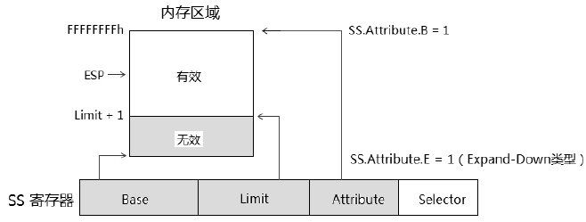

上图是当SS所使用的Data segment为**Expand\-Down类型**时（也适用于**其他的数据段**，如**DS段**）的内存结构示意图。它的有效区域依赖于**B和G两个标志位**。

当一个**Data segment descriptor**被加载到**SS寄存器**后，**SS属性域**里的**E标志**指示它属于**Expand\-up**还是**Expand\-down**类型。当E=1时，它是Expand\-down类型的。这时其**内存有效区域**与Expand\-up类型相比有很大的变化。对于一个**Expand\-down类型的段**来说，**最大offset（偏移量**）值是**固定**的；对于一个**Expand\-up类型**的段来说，**最小offset（偏移量**）值是**固定**的。

当它是一个**Expand\-down类型的数据段**时（以SS段为例）

① **B标志**决定段的**最大offset**值。当**B=1**时，**最大offset**值为**FFFFFFFFh（4G限**），当**B=0**值时，**最大的offset**值为**FFFFh（64K**限）。

② 段的**最小offset**值是**Limit+1**。

>**段的有效访问区域**是**最小offset值**到**最大offset**值之间（**基于段的base**值）。

#### 4.5.1.5. 段Limit值的计算

当在一个segment descriptor被加载到段寄存器时（包括Code和Data段寄存器），段描述符的limit会被加载到段寄存器的Limit域（隐藏的Cache部分），段寄存器内的Limit是32位宽，它由段描述符中20位的Limit域计算而来（依赖于描述符的G标志位）。

① 当G=1时，32位的limit=描述符内的limit×1000h+FFFh。假设描述符内的limit值是FFFFFh，那么段的最终limit是：FFFFFh×1000h+FFFh=FFFFFFFFh（4G限）。

② 当G=0时，32位的limit=描述符内的limit×1=limit（也就是等于描述符内的limit值），假设描述符内的limit值是F0000h，那么段的最终limit就是F0000h值。

可以看出段的limit值的计算是统一的，无论是Expand-up段还是Expand-down段，所不同的是它们的最大offset值和最小offset值。

#### 4.5.1.6. Expand-down段的有效范围

回到前面的Expand\-down类型的SS段，它基于段base的有效区间如下。

① B=1时，**SS.limit+1**到**FFFFFFFFh**。

② B=0时，SS.limit+1到FFFFFh。


在E=1，G=1，B=1的情况下，看看下面的几个例子。

例子1。假设段描述符内的limit=F0000h，那么这个Expand\-down的：

① 段的最小offset值是minimum\_offset=limit+1=F0000h×1000h+FFFh+1=F0001000h。

② 段的最大offset值是maximum\_offset=FFFFFFFFh。

因此，段内有效访问是minimum\_offset到maximum\_offset之间，即F0001000h到FFFFFFFFh之间是合法的段内地址区域。在下面的段内地址访问中

① F000FFFh：出错，超出最小访问值，产生#GP异常。

② 0F00FFFh：出错，超出最小访问值，产生#GP异常。

③ F0001000h：正确。

④ FFFFFFFFh：正确。

例子2。若段描符内的limit=0值，那么这个Expand\-down段的：

① minimum\_offset=limit+1=FFFh+1=1000h。
② maximum\_offset=FFFFFFFFh。

因此，在段内的有效访问是从1000h到FFFFFFFFFh之间的区域，在下面的地址访问中

① FFFh：出错，超出最小访问值，产生#GP异常。

② 1000h：正确

③ FFFFFFFFh：正确。

例子3。假设在B=0的前提下，G=1，E=1，limit=0值，那么：

① minimum\_offset=limit+1=FFFh+1=1000h。

② maximum\_offset=FFFFh。

因此它的段内有效区域是1000h到FFFFh之间，在下面的段内地址访问中

① FFFh：出错，超出最小范围值，产生#GP异常。

② 10000h：出错，超出最大范围值，产生#GP异常。

③ 1000h：正确。

④ FFFFh：正确。

有一种情况需要注意：跨边界产生的访问。以例子3为例：

```assembly
mov al，[FFFFh]                ； 正确，刚好在最大段限范围内
mov ax，[FFFFh]                ； 错误，读 WORD 边界，超出了段限范围
```
大多数OS几乎都使用更简单的Expand-up类型，在一些情况下处理器会强制使用Expand\-up段（例如在前面所述的sysenter与syscall指令调用中的SS段）。并且在64位模式下，Expand-down段是无效的。

### 4.5.2. 在64位模式下的Stack

在**64位模式**下，栈结构起了很大的变化。

① **栈指针**固定了**64位的RSP值**，不受任何影响。

② **Stack段**只能是**Expand\-up**类型，**Expand\-down类型是无效(！！！**)的。

③ 在**中断handler被调用**时，**RSP被调整为16字节边界对齐(！！！**)。


如上图所示，假设**中断发生前**的**RSP是13FF7H**，处理器在**中断handler调用时**，在**push数据之前**将**栈指针RSP从13FF7H调整到13FF0H（16字节边界上**）然后再**执行push操作**，压入**SS、RSP、RFLAGS、CS，以及RIP**值。

这个调整的操作是RSP&FFFFFFFF\_FFFFFFF0h，结果是16字节边界对齐。对于**一般的push和call调用**，处理器并**不进行对齐调整**。

### 4.5.3. Data segment descriptor

**Data段描述符**与**Code段描述符**具有通用性，结构基本是完全一致的，只是**描述符类型不同**，如下图所示：


图中描述符的各个域与Code段的意义一致，在类型域里，三个类型标志位对数据段的类型进行定义，下面是Data**数据段的类型组合**。


**只读类型的Data段不能作为Stack段**，如果**加载一个只读的Data段描述符**到**SS寄存器**，会**产生\#GP异常**。其中可写的代表具有Read/Write的权限，**已访问**的代表已经被加载到段寄存器中。

#### 4.5.3.1. D/B与G标志位

**D/B标志位**使用于**Stack段**时，被作为**B标志位**，如前面的Stack结构中所述。

当使用于其他的数据段时，D/B标志位也同样被用于Expand\-down类型的段才有意义，它与G标志位结合起来对Expand\-down段的limit值进行定义，如前面对Expand\-down类型的段所述。

### 4.5.4. long-mode下的Data segment descriptor

在compatibility模式下，Data segment descriptor的结构是与legacy模式一致的，在**64位模式**下起了很大的变化，Data segment descriptor的**绝大部分域都是无效的**。


在64位模式下的Data段描述符**S标志必须设为1**，Code/Data标志位必须设置为0，否则在加载时会产生\#GP异常。

#### 4.5.4.1. W标志位

这个标志位对于**DS、ES、FS和GS寄存器**来说并**无影响**，被忽略。当被加载到**SS寄存器**时，处理器会检查W标志位是否为1（可写的），否则会产生\#GP异常。可是在**64位模式**下的**非3级权限**下可以**加载Null selector到SS寄存器(！！！**)里，这时**所有的段描述符属性都被忽略**。

#### 4.5.4.2. DPL标志位

这是**Data段的DPL**值，在**加载Data段描述符**到**段寄存器**的时候处理器会检查该值。

>可是，在AMD64的Manual Volume2 System Programming里有这样的一段话：A data\-segment-descriptor DPL field is ignored in 64-bit mode，and segment\-privilege checks are not performed on data segments.

这段话的描述产生了隐晦点，实际上并不是这样简单。

① 在**64位模式**下，对于一个正常的selector来说，处理器在加载时也会**对Data segment描述符的DPL进行必要的检查**。

② 在64位模式下，当加载一个**Null selector**到**Data段寄存器**时，处理器不但会**忽略DPL**值，还会忽略所有的Data段描述符属性。

基于在加载时需要检查，笔者将DPL归纳为有效的域，这始终都是有益处的。

#### 4.5.4.3. Base域

在64位模式下，对于ES、SS、DS段来说Base是无效，被忽略的。然而对于FS和GS段是有效的，可是从data segment descriptor里只能加载到FS和GS段的低32位。

#### 4.5.4.4. FS段和GS段的基地址

**FS段**和**GS段**完整的64位Base地址需要在**相应的MSR里设置**，**FS**的基地址寄存器是**IA32\_FS\_BASE**，地址在C0000100H。GS的基地址寄存器是IA32\_GS\_BASE，地址在C0000101H上，这些值必须在**0级权限**下使用**wrmsr指令**进行设置。

### 4.5.5. Stack的使用

下面**两种数据的访问形式**是**隐式（默认）使用于SS段**的。

① 使用**sp/esp/rsp寄存器**的内存访问形式。如：mov eax，[esp]。

② 使用**bp/ebp/rbp寄存器**的内存访问形式。如：mov eax，[ebp]。

ebp是栈的frame base pointer，esp是栈的top pointer，使用它们将默认引用SS段。下面的指令将隐式使用于SS段，且不能更改。

① **栈操作指令**：push指令，pop指令，enter指令及leave指令。还包括它们的衍生形式，如：pushf/popf，push es/pop es等。

② 控制权转移指令：call指令，ret指令，int指令，以及iret指令。还包括它们的衍生形式，如：int3/into，retf指令等。

#### 4.5.5.1. 显式使用SS段

可以使用Segment prefix显式引用SS段。

```assembly
mov eax，ss：[eax]                ； SS prefix
```

上面这条指令中，[eax]内存访问默认是使用DS段的，可以使用SS段前缀进行显式地使用于SS段。

### 4.5.6. SS寄存器显式加载

可以使用**mov指令**、**lss指令**和**pop ss指令**显式地加载SS寄存器，**pop ss在64位模式下是无效的(！！！**)。

```assembly
mov ax，USER_SS
mov ss，ax                        ； load into SS
```

使用mov指令加载ss寄存器，如果发生中断/异常，处理器将保证mov ss，ax指令的下一条指令得到执行，完毕后才响应中断和异常。

```assembly
mov ss，ax                        ； 临时抑制中断/异常的发生
mov esp，XXX                     ； 下一条指令执行完毕后，才可响应
```

处理器假设在mov ss，ax指令后面是一条更新sp/esp/rsp寄存器的指令，确保Stack结构能够得到建立。

#### 4.5.6.1. 使用LSS指令加载

在这种情形下，使用**LSS指令**加载是更有效率的方式，提供一个far pointer。

```assembly
      lss esp，[STACK_POINTER]            ； far pointer
;far pointer定义：
STACK_POINTER dd 0x7fff                    ； ESP 值
              dw 0x20                      ； SS 值
```

在**64位模式**下，**LSS指令**依然可用，在**Intel64**中，far pointer可以是80位（16：64），在AMD64中far pointer最长只能是48位（16：32）。

```assembly
       lss rsp，[STACK_POINTER64]            ； far pointer
； far pointer定义（for Intel64）：
STACK_POINTER dq 0x7fff                   ； 64位RSP 值
              dw 0x20                     ； SS 值
```

#### 4.5.6.2. selector检查

处理器会检查selector是否为Null selector，在legacy模式和compatibility模式下不允许加载Null selector到SS寄存器，否则会产生#GP异常。

在64位模式下，在非3级权限（0、1和2级权限）里可以加载Null selector到SS寄存器里。

#### 4.5.6.3. 权限权查

SS寄存器的加载需要严格的权限限制，合法的权限如下。

① RPL == Data segment的DPL。

② CPL == Data segment的DPL。

每个Stack段对应一个权限级别，RPL、CPL与DPL三者必须是相等的，否则会产生#GP异常。

#### 4.5.6.4. limit检查

所使用的selector必须在GDT/LDT的limit内，否则产生#GP异常。

#### 4.5.6.5. Data段描述符类型的检查

在64位模式和legacy模式下都要经过下面的Data段描述符类型检查，能加载到SS寄存器的描述符类型必须在下列项中。

① S标志位为1值，表示为非system描述符。

② Code/Data标志位为0值，指示为Data段（1值为Code段）。

③ W标志位为1值，指示为Writable（可写的）段。

④ P=1，表示存在内存中。

当在64位模式的非3级权限下加载Null selector到SS寄存器，可以不受上面的类型限制。当上面的所有检查都通过后，如下图所示。

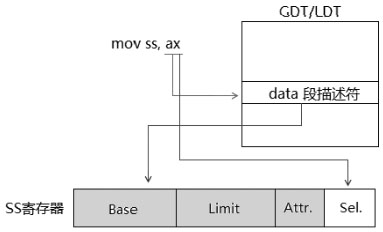

处理器将SS selector加载到SS寄存器的selector域中，同时从GDT/LDT中得到Data segment descriptor加载到SS寄存器的Cache部分。

（1）在**64位模式**下加载**Null selector**到**SS寄存器**

仅在**非3级权限**下，可以加载一个Null selector到SS寄存器里。

```assembly
mov ax，2                      ； null selector，RPL=2
mov ss，ax                     ； 在2级权限下加载 null selector到SS
```

上面是**显式地进行Null selector加载**，能加载到SS寄存器的有效Null selector是：0，1及2值，在RPL=3时不能被加载（3级权限），处理器在切往高权限时还会隐式地加载Null selector到SS寄存器。

（2）实现一个load\_ss\_reg()函数

根据SS段寄存器的加载限制，我们可以实现一个load\_ss\_reg（）函数，模拟处理器在加载SS寄存器时的检查，通过了就加载。

代码清单10-35（lib\conforming_lib32.asm）：

```assembly
；------------------------------------------------------------
； load_ss_reg（）：加载 SS 寄存器
； input：
；                esi：selector
；-----------------------------------------------------------
__load_ss_reg：
      jmp do_load_ss_reg
lsr_msg1        db 'load SS failure：Null-selector'，10，0
lsr_msg2        db 'load SS failure：selector.RPL ！= CPL'，10，0
lsr_msg3        db 'load SS failure：CPL ！= DPL'，10，0
lsr_msg4        db 'load SS failure：check limit'，10，0
lsr_msg5        db 'load SS failure：a system descriptor'，10，0
lsr_msg6        db 'load SS failure：non data segment'，10，0
lsr_msg7        db 'load SS failure：non writable segment'，10，0
lsr_msg8        db 'load SS failure：non present'，10，0
do_load_ss_reg：
      push ecx
      push edx
      mov ecx，esi
； 检查 selector
      call __check_null_selector
      test eax，eax
      jz check_privilege
      mov esi，lsr_msg1
      call puts
      jmp load_ss_reg_done
； 检查权限
check_privilege：
      call __get_cpl
      mov esi，ecx
      and esi，0x03
      cmp esi，eax                                ； RPL == CPL?
      jz check_privilege_next
      mov esi，lsr_msg2
      call puts
      jmp load_ss_reg_done
check_privilege_next：
      mov esi，ecx
      call __get_dpl
      mov esi，ecx
      and esi，0x03
      cmp esi，eax                                ； CPL == DPL ？
      jz check_limit
      mov esi，lsr_msg3
      call puts
      jmp load_ss_reg_done
； 检查 selector 是否超 GDT/LDT limits
check_limit：
      mov esi，ecx
      bt esi，2
      jc ldt_limit
      call __get_gdt_limit
      jmp check_limit_next
ldt_limit：
      call __get_ldt_limit
check_limit_next：
      and esi，0xFFF8
      add esi，8
      cmp esi，eax
      jbe check_descriptor
      mov esi，lsr_msg4
      call puts
      jmp load_ss_reg_done
； 检查 data segment descriptor 类型
check_descriptor：
      mov esi，ecx
      call __read_gdt_descriptor
      bt edx，12                                        ； S 标志
      jc check_cd
      mov esi，lsr_msg5
      call puts
      jmp load_ss_reg_done
check_cd：
      bt edx，11                                        ； Code/Data 标志
      jnc check_w
      mov esi，lsr_msg6
      call puts
      jmp load_ss_reg_done
check_w：
      bt edx，9                                        ； W 标志
      jc check_p
      mov esi，lsr_msg7
      call puts
      jmp load_ss_reg_done
check_p：
      bt edx，15                                        ； P 标志
      jc load_ss
      mov esi，lsr_msg8
      call puts
      jmp load_ss_reg_done
load_ss：
      mov ss，cx
load_ss_reg_done：
      pop edx
      pop ecx
      ret
```

这个\_\_load\_ss\_reg（）函数实现在conforming\_lib32.asm库里，最后被包括进lib32.asm库里，实现在legacy模式下对SS寄存器的加载功能，加载前进行必要的检查。这个检查就是基于前面所述的加载SS寄存器的检查。

```assembly
mov esi，03                      ； Null-selector
call load_ss_reg                ；
```

上述使用Null selector进行加载时，得出的结果如下。


提示加载SS失败，属于一个Null selector，conforming_lib32.asm库里的函数使用conforming段进行调用，conforming段的DPL为0值，使得它可以在任何权限执行，而不改变CPL值，这样就可以方便地进行CPL的获取和加载SS寄存器。

代码清单10-36（lib\conforming_lib32.asm）：

```assembly
；-----------------------------------------------
； conforming_lib32_service_enter（）：conforming代码库的 stub函数
； input：
；       esi：clib32 库函数服务例程号
； 描述：
；       conforming_lib32_service_enter（）的作用是切换到 conforming段里，
；       然后调用 conforming lib32 库里的服务例程，它相当于一个 gate 的作用。
； -----------------------------------------------
__clib32_service_enter：
__conforming_lib32_service_enter：
      jmp do_conforming_lib32_service
conforming_lib32_service_pointer        dd __conforming_lib32_service
dw conforming_sel
do_conforming_lib32_service：
      call DWORD far [conforming_lib32_service_pointer] ； 使用 conforming 段进行调用
      ret
；--------------------------------------------
； clib32_service（）
； input：
；       eax：clib32 库函数服务编号
；--------------------------------------------
__conforming_lib32_service：
      mov eax，[__clib32_service_table + eax * 4]
      call eax
      retf
… …
； conforming lib32 库服务例程表
__clib32_service_table：
      dd __get_cpl                            ； 0 号
      dd __get_dpl                            ； 1 号
      dd __get_gdt_limit                      ； 2 号
      dd __get_ldt_limit                      ； 3 号
      dd __check_null_selector                ； 4 号
      dd __load_ss_reg                        ； 5 号
```

上面实现了一个stub函数\_\_clib32\_service\_enter（），它是对外的接口，传递一个conforming lib32库的函数编号，load\_ss\_reg（）函数的编号是5，那么，可以这样调用load\_ss\_reg（）函数。

```assembly
mov eax，LOAD_SS_REG     ； 编号值
call __clib32_service_enter   ； 调用 conforming 库
```

### 4.5.7. TR的显式加载

在**Stack的切换**环节中，**TSS段**是很重要的数据结构，**没有TSS段完成不了Stack的切换**，因此，在系统**初始化阶段必须加载TR**，完成对TSS段环境的设置。在**TSS任务切换机制**里，处理器会**隐式地加载TR**。

```assembly
mov ax，TSS_sEL                        ； TSS selector
ltr ax
```

在这里，我们使用**ltr指令显式地加载TR**，处理器会对TSS selector和TSS描述符进行在10.5.4.4节4中所描述的常规检查。通过检查后，处理器将TSS selector加载到TRselector域，TSS描述符会加载到TR的Cache部分。

#### 4.5.7.1. 置Busy标志位

在**TSS描述符加载到TR**后，处理器会将**GDT(！！！TSS描述符只能存在于GDT！！！**)的**TSS描述符Busy标志位置位**，指示这个TSS描述符不可用。

#### 4.5.7.2. 使用Call-gate调用下的Stack切换

当使用gate（包括Call\-gate，Interrupt\-gate及Trap\-gate）从**低权限进入高权限**时，处理器从TSS段里取出**相应权限级别的ESP**值，装入**ESP寄存器**，然后执行压栈操作。


在上图里使用一个**Call\-gate**从**3级**权限切换到**0级**权限里，处理器从**当前的TSS段**里（由**TR的Base域获取了TSS段位置！！！**），读取属于**0级权限的SS和ESP值**（在**TSS段里的SS0和ESP0域**），分别**加载到SS寄存器和ESP寄存器**里，**SS和ESP的原值被临时保存(！！！**)起来。

现在处理器**加载新的SS和ESP值**后，**已经切换到0级的stack**里，在**当前的Stack（0级的Stack**）里依次**压入调用者(！！！原来的！！！)的SS、ESP、CS，以及EIP值**，然后转去**执行0级代码**。

#### 4.5.7.3. TSS段里的栈指针

在**TSS段**里存放了**3个级别**的栈指针**SS和ESP**值，如下所示。


在**TSS段**里存放有**0级、1级和2级的SS和ESP**，**不存在3级的SS和ESP栈指针**值。

>3级的栈指针（SS：ESP）存放在哪里？

**3级**的栈指针值（SS和ESP）放在**两个地方**：

- 要么存放在**当前的SS寄存器和ESP寄存器**里
- 要么在切换到**高权限的stack**时**被压入在高权限的stack**里。

当**从高权限的代码返回到低权限**时，**3级**的**栈指针（SS和ESP**）被**从栈里pop出恢复到SS寄存器和ESP寄存器**里，这时**3级的栈指针**是指向**当前active（活动）的栈**。

在将SS selector加载到SS寄存器之前，处理器会进行检查，这个检查和以前所述的CS和SS寄存器隐式加载的情形一样。

### 4.5.8. 在long-mode下使用Call-gate调用的Stack切换

在**long\-mode**使用**Call\-gate**进行调用从而进入到**64位模式的Call\-gate服务例程**。权限的切换将使处理器进入更高权限的64位模式，这时候使用64位的stack结构，这一点体现在从compatbility模式里使用Call\-gate进入更高权限代码时，处理器将切换到64位模式。

#### 4.5.8.1. long-mode下的TSS段里的栈指针

在**long\-mode**下，**TSS段**里并**不保存SS Selector值(！！！**)，3个级别的**栈指针扩展为64位**。


在**long\-mode**下进行**stack切换**时并**不需要SS slector值**，因此在long\-mode的**TSS段**里并**不存在SS selector**。

#### 4.5.8.2. 加载Null selector到SS寄存器

在**long\-mode**下，**切换到高权限代码**里，处理器将**自动加载一个Null selector到SS寄存器(！！！**)里，这是在**64位的TSS段里没有SS selector的原因(！！！**)。

这是在**long\-mode**下与**legacy模式**下的**Stack切换最大的不同之处(！！！**)。

（1）**compatibiltiy模式**调用**Call\-gate**进入**64位模式**的**Stack切换**在long\-mode的compatibility子模式里，使用下面的代码：

```assembly
call DWORD far [CALLGATE_POINTER32]    ;使用32位的 call-gate 指针
```

使用**32位的call\-gate指针（16：32形式**），从**3级的compatibility模式**进入到**0级的64位模式Call\-gate服务例程**。当前的stack将从compatibiltiy切换到64位模式，如**下图所示(！！！下图很重要！！！**)。


处理器**从64位的TSS段**里得到**RSP0值(因为是0级**)，加载到**RSP寄存器**里，处理器还会将**Null selector**加载到**SS寄存器**里。如果切换到**0级**，这个**Null selector值将会是0**；如果切换到**1级**，这个**Null selector将会是01H**；切换到**2级**，这个Null selector将会是**02H**。

处理器会在64位的栈里压入compatibiltiy模式的SS、ESP、CS和EIP值，32位的值会被0扩展到64位值压入栈中。

（2）**64位模式**调用**Call\-gate**的**Stack切换**

在64位模式下，使用下面的指令：

```assembly
call QDWORD far [CALLGATE_POINTER]    ； 使用64位的 call-gate 指针
```

这里使用的是**64位的call\-gate指针**（**16：64形式**）切换到**0级**代码，Stack的切换情形**与在compatibility模式下是一致**的。

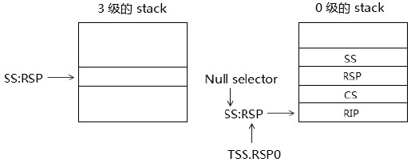

上面是简化的示意图，与**comaptibility模式**下的**调用不同**的是**从3级的64位Stack**切换到**0级的64位Stack**，其他处理是一致的。

### 4.5.9. 使用RETF指令返回时的Stack切换

使用**Call\-gate**进行调用是**从低权限切往高权限**（排除同级调用的情形），而使用**retf指令返回**是从**高权限的Call\-gate服务例程切往低权限的用户代码**（排除同级返回的情形）。因此，同样是发生了权限切换和进行Stack切换。


如果retf指令返回时检查到是切往低权限（假设从0级返回到3级时），将从**0级的stack**里**依次POP**出**EIP**、**CS**、**ESP**和**SS**值，这个**SS selector将会被加载到SS寄存器**里，**ESP值会被加载到ESP寄存器**里，那么现在的SS：ESP指针就指向当前的3级的Stack。

### 4.5.10. long-mode下使用RETF指令返回时的Stack切换

在**long\-mode**下，**Call\-gate服务例程**执行在**64位模式环境**中，与使用Call\-gate进行调用时情形相对应，从Call\-gate服务例程里使用RETF指令返回时也有：

① 返回到**compatibility模式**时的**Stack切换**。

② 返回到**64位模式**下的Stack切换。


#### 4.5.10.1. 返回到compatibility模式时

在上图的a）中，返回的目标代码段描述符L=0时，将返回到compatibility模式，目标的Stack是compatibility下的3级stack（假设从0级返回到3级的情况下），POP出来的SS和ESP值（栈内的RSP映像低32位）加载到SS寄存器和ESP寄存器里，当前的Stack已经切换到compatibility模式下。

#### 4.5.10.2. 返回到64位模式时

在上图的b）中，返回的**目标代码段描述符**的**L=1并且D=0**时，将**返回到64位模式**，表示**目标的Stack**也是属于**64位**的，在**栈里POP**出来的**SS和RSP**值将**加载到SS和RSP寄存器**里，**当前的Stack**已经**切换回3级的Stack**（假设从0级返回到3级的情况下）。

在返回到64位模式里时，如果**从0级权限返回到1级或者2级权限**（非3级权限），在栈中的**SS值允许为Null selector**，否则是不允许的。

#### 4.5.10.3. 从伪造的Call-gate服务例程RETF返回时

在前面的加载CS寄存器的情形中，以权限的切换为目的时，可以**伪造一个Call\-gate服务例程返回环境**（在前述的使用RETF指令加载CS寄存器的情形），这时可以从0级的compatibility模式返回到3级的64位模式里，也可以从compatibility模式返回到compatibility模式里。

### 4.5.11. 调用中断或中断/异常发生时的Stack切换

当**中断handler被调用（主动或被动**），**权限发生改变**时，同样会进行**Stack的切换**。在**legacy模式**下，与使用Call\-gate调用时的Stack切换的**不同之处**是：处理器会**额外压入EFLAGS**值，**有些异常**发生时还会压入**Error Code**值。


与Call\-gate调用时的**Stack切换一样**，处理器从**TSS段**里得到相应的**0级的SS和ESP**值（假设从3级切换到0级的情况下），分别**加载到SS和ESP寄存器**里。

那么SS：ESP就切换到0级的Stack，处理器依次压入**SS、ESP、EFLAGS、CS，以及EIP**值。**有时**还会压入**Error Code**值。

### 4.5.12. long-mode下的中断Stack切换

在long\-mode下的**中断栈**有**很大的变化**。

① 可以使用**额外的Stack指针**（中断handler专用的Stack指针）。

② 在执行中断handler前，处理器会将**RSP调整到16字节边界对齐(！！！**)，然后**再压入SS、RSP、RFLAGS、CS及RIP**值。

③ 处理器会**无条件压入SS和RSP值**，**即使不改变权限(！！！**)的情况下。


上图是前面已经介绍过的long\-mode下的Interrrupt/Trap\-gate描述符，在long\-mode下除了offset被扩展为64位外，还新增了一个**3位的IST域**，它是在**64位TSS中的IST指针的索引值**，范围值从1到7，每一个值对应一个IST（Interrupt Stack Table）指针。

#### 4.5.12.1. IST（Interrupt Stack Table）

在64位TSS里有7个IST指针值，提供可以给中断handler**额外使用的Stack区域**，如下图所示。


Interrupt/Trap\-gate描述符里的**IST**值用来**得到TSS段里对应的IST**值，从而使用这些IST指针**指定的Stack区域**。

假如中断**vector号为0x40**的**中断描述符**，它的**IST域为1**值，那么处理器将在**TSS的IST1里得到RSP值**，**加载到RSP寄存器**里，如下图所示。

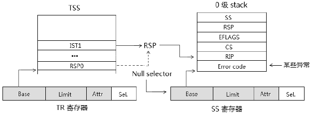

在**TSS段**里的**RSP0值（0级的栈指针**）将被**忽略不用**。可是如果中断描述符里的**IST被清0**，那么处理器仍然**从RSP0里取得RSP值加载到RSP寄存器**里（上图中的虚线）。

同样一个**Null selector**将**被加载到SS寄存器**里，处理器就**完成了中断栈的切换**，在经过调用到16字节边界对齐后，依次压入SS、RSP、EFALGS、CS，以及RIP值。

#### 4.5.12.2. 从compatibility模式进入64位模式

如上图所示，处理器从TSS段的RSP0或IST域（依赖于Interrupt/Trap-gate描述符的IST域）里得到0级（假设从3级切换到0级）64位的Stack指针加载到RSP寄存器中，Null selector被加载到SS寄存器后，那么Stack将从compatibility模式（假设为32位）的Stack切换到64位的Stack。RSP调整到16字节边界后依次压入SS、RSP、EFLAGS、CS，以及RIP值。

#### 4.5.12.3. 从64位模式进入64位模式

除了处理器将64位的Stack切换到同样是64位的Stack外，其余操作与从compatibility模式进入64位模式是完全一致的。

### 4.5.13. 使用IRET指令返回时的Stack切换

原理与使用RETF指令返回时是完全一致的，如下图所示。


IRET指令返回时，处理器从0级的Stack里POP出SS和ESP值加载到SS和ESP寄存器后，现在当前活动的Stack就是3级的Stack（假设从0级返回到3级时）。

#### 4.5.13.1. long-mode下的IRETQ返回Stack切换

在long\-mode下的中断handler（中断处理程序）是运行在64位模式下。从中断handler使用IRETQ指令返回时是从64位模式中返回，这时处理器**无条件POP出SS和RSP值（无论是否发生权限的改变**），与调用中断hanlder时无条件压入SS和RSP值相对应。

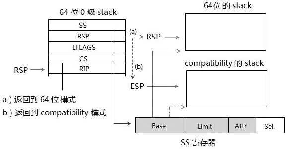

如同RETF指令一样，处理器从栈中的CS引用的Code segment descriptor判断返回到64位模式还是compatibility模式。

#### 4.5.13.2. 返回到compatibility模式时

POP出的RSP值低32位加载到ESP寄存器，SS值加载到SS寄存器，从而切换回原来的compatibility模式的Stack。

#### 4.5.13.3. 从伪造的中断handler环境中返回

以权限的切换为目的时，可以伪造一个中断handler环境从0级的compatibililty模式代码返回到同样是compatibility模式的代码里或者64位模式的3级权限代码。在非64位模式下使用IRET指令，处理器将依赖于权限的改变而POP出SS和ESP值。

## 4.6. Data段

一个**Data segment descriptor**可以加载到**SS、ES、DS、FS及GS寄存器**中的任何一个，但是**不能被加载到CS寄存器**里。

### 4.6.1. 段的访问类型限制

下面是一个段描述符能被加载到段寄存器的访问类型条件。

① 能被加载到**CS寄存器**的段**必须是可执行**的段，段**描述符**的**Code/Data标志为1**，表示为**Code段（可执行的段**）。

② 能被加载到**SS寄存器**的段**必须是可写**的段，段描述符的**W标志为1**，表示为Writable（可写的段）。

③ 能被加载到**ES、DS、FS及GS寄存器**的段必须是**可读**的段，段描述符的**R标志为1**，表示为Readable（可读的段）。

对于②，这个段描述符类型是Data segment descriptor，并且W标志为1。对于③，当加载一个Code segment descriptor到ES、DS、FS及GS寄存器时，这个Code segment descriptor的R标志必须为1，它是可读的Code段。任何一个Data段都是可读的。

因此，可读的Code段和任何的Data段都能被加载到ES、DS、FS及GS寄存器中。

### 4.6.2. 加载Data段寄存器

这里所说的**Data段寄存器**指**ES，DS，FS及GS寄存器**。**SS寄存器也属于Data段寄存器**，但**不在此类描述对象**中。Data段寄存器显式地进行加载。

```assembly
mov ax，data32_sel mov ds，ax
mov es，ax
mov fs，ax
mov gs，ax
```

上面的代码使用同一个selector分别加载Data段描述符到各个Data段寄存器里，在legacy模式下可以使用下面的指令加载far pointer。

① lds指令：加载一个far pointer到DS：reg中。

② les指令：加载一个far pointer到ES：reg中。

③ lfs指令：加载一个far pointer到FS：reg中。

④ lgs指令：加载一个far pointer到GS：reg中。

⑤ lss指令：加载一个far pointer到SS：reg中。

lds和les指令在64位模式下是无效的。lfs指令、lgs指令和lss指令在64位模式下是有效的。

值得注意的是，在64位的操作数size下，AMD64机器上far pointer是48位（16：32），在Intel64机器上far pointer是80位（16：64）。

因此，在64位模式下可以使用lfs和lgs指令加载FS、GS及SS寄存器。

#### 4.6.2.1. selector的检查

不同于CS和SS寄存器，一个Null selector可以被加载到ES、DS、FS和GS寄存器里，在加载到上面的Data段寄存器时，处理器不检查Null selector。

#### 4.6.2.2. 权限检查

能加载到Data段寄存器的Data段描述符，所需要的权限如下。

① RPL <= Data segment的DPL。

② CPL <= Data segment的DPL。

实际中可以直接使用RPL=0值的selector，只需检查CPL是否合法。

#### 4.6.2.3. limit的检查

处理器会检查selector是否超出GDT/LDT的limit表限。否则会产生#GP异常。

#### 4.6.2.4. Data段描述符的检查

能被加载到Data段寄存器（ES，DS，FS和GS）的Data段描述符类型必须是：

① S标志为1，表示属于非system描述符。

② P标志为1，表示在内存中，否则会产生#NP异常。

③ 当加载一个Code段到Data段寄存器时，Code段描述符的R标志位为1，表示Readable（可读的）。

上面这些检查在64位模式下也是必要的（除了加载Null selector外）。我们看到可以将Code段描述符加载到Data段寄存器里，但这个Code段必须是可读的。

### 4.6.3. 加载Code段描述符到Data寄存器

当加载一个Code段描述符到Data段寄存器时，与上面加载Data描述符的selector检查、limit检查和描述符类型的检查都是一致的。而处理器对权限的检查分为两种情况。

#### 4.6.3.1. 加载non-conforming段的权限检查

如果Code段属于non-conforming段，情形和上面加载一个Data段描述符到Data段寄存器是一致的。

#### 4.6.3.2. 加载conforming段的权限检查

加载一个conforming类型的Code段描述符到Data段寄存器，实际上无须进行权限检查，权限的检查总是获得通过。

### 4.6.4. long-mode下的Data段寄存器加载

在**long\-mode**下的Data段寄存器加载与legacy模式是一致的，只不过在64位模式下**可以加载Null selector**到Data段寄存器。

#### 4.6.4.1. 64位模式下加载Null selector

在64位模式下，可以在任何权限下加载一个Null selector到ES、DS、FS，以及GS寄存器里（加载Null selector到SS寄存器里只能在非3级权限下）。

那么，处理器不会读取GDT/LDT，Null selector加载到段寄存器的selector域，内部的Cache域直接被设置为0值（除了S标志为1外）。

```assembly
mov ax，0                     ； null selector
mov ds，ax                    ； 加载到DS
mov DWORD [eax]，0          ； 写访问
```

在上面这种情况下，对于加载Null selector的ES、DS、FS和GS寄存器，以及SS寄存器，处理器都会忽略段寄存器内的属性。

对加载到ES、DS、FS和GS寄存器的Null selector，它的RPL被忽略，在0级权限里，能加载一个3值的Null selector到这些段寄存器（RPL=3）。

### 4.6.5. Data段的访问控制

当成功加载段寄存器后，说明段描述符是合法的，但是使用它们进行访问内存时，处理器会做以下检查。

① 对一个不可读的段进行读访问，会产生#GP异常，这种情况只发生在使用CS段进行访问时。

```assembly
mov eax，[cs：ebx]  ; 假如CS段是execute-only的段，#GP异常产生
```

如果CS.R=0，CS段是execute-only不可读的段，使用它来访问内存会产生#GP异常。

② 对一个不可写的段进行写访问，会产生#GP异常。

```assembly
mov DWORD [eax]，0               ； 假如DS段是read-only的段，#GP异常产生
mov DWORD [cs：eax]，0           ； 错误，CS段是不可写的段，#GP异常产生
```

如果DS.W=0，DS段是read-only不可写的段，使用它来进行写操作会产生#GP异常。而使用CS段来访问时，同样会产生#GP异常。

③ 内存地址超出段limit的，会产生#GP异常。这个段limit的计算详情请看前面Expand-up和Expand-down类型段的描述。

```assembly
mov eax，[0xFFFF0000]             ； 假如DS段限是0xF0000000，#GP异常产生
```

上面的指令使用DS段内的0xFFFF0000地址进行访问，假如DS.limit=0xF0000000，将产生#GP异常。

### 4.6.6. 64位模式下Data段的访问控制

在64位模式下，对于Data段的访问，除了使用FS和GS寄存器访问外，其他段寄存器都是无效的。

```assembly
mov rax，[ss：rbx]              ； 这个访问中SS段前缀的作用被忽略
mov [cs：rbx]，rax              ； 这个访问中CS段前缀的作用被忽略
mov rax，[fs：rbx]              ； FS段前缀是有效的
```

在64位模式下，成功加载段寄存器后，所有Data段的访问都是基于一个Read/Write、Expand-up以及Accessed属性的段之上。除了FS和GS寄存器的base域可用外，所有段寄存器的base都为0，处理器也不进行limit的检查。

根据AMD64的手册说明，在AMD64机器上可以设置EFER.LMSLE=1时开启段limit的检查机制。

# 5. LDT描述符与LDT

Local Descriptor Table是其中的一个**描述符表**，LDT由LDTR的base域进行定位。

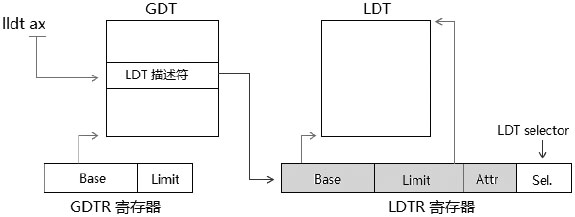

**LDTR**的结构**与段寄存器的结构是完全一致的(！！！**)，包括：base、limit、attribute域，以及selector域，base、limit和attribute组成LDTR的Cache部分，也是隐藏不可见的。像段寄存器一样，LDTR需要使用LDT描述符进行加载，LDT描述符只能存放在GDT中。32位的LDTR.base值能让LDT定位在4G的线性地址空间任何位置。在64位模式下，LDTR.base被扩展为64位。

## 5.1. LDT描述符

LDT描述符属于系统级的描述符，它的结构与TSS完全一致。

LDT描述符的类型是0x02，S标志位为0值，表示属于一个system描述符。

## 5.2. LDTR的加载

系统使用LLDT指令进行显式加载，或在进行任务切换时隐式地从TSS段里加载。

```assembly
mov ax，LDT_SEL            ； LDT selector
lldt ax
```

lldt指令执行在0级权限里。处理器会检查以下内容。

### 5.2.1. selector检查

对selector检查两个方面。

① 如果提供的selector是Null selector，则会产生#GP异常。

② 如果selector.TI=1，表示在LDT里，将产生#GP异常。

### 5.2.2. limit检查

selector是否超出GDT limit值。

### 5.2.3. LDT描述符类型检查

能被加载到LDTR里的描述符必须如下。

① S标志为0，属于system描述符。

② P标志为1，表示在内存中。

③ Type值为0x02，它是LDT描述符。

## 5.3. 64位模式下的LDT描述符

和TSS描述符一样，在64位模式下LDT也被扩展为16字节，如下图所示。


高8字节的S标志位和Type值必须为0（00000B）值，用来确保高8字节不被作为segment descriptor使用。64位的LDT基址加载到LDTR的base域。