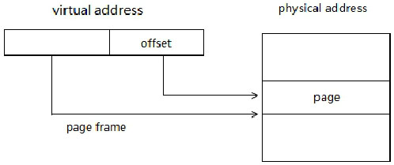

<!-- @import "[TOC]" {cmd="toc" depthFrom=1 depthTo=6 orderedList=false} -->

<!-- code_chunk_output -->

- [1 寄存器](#1-寄存器)
- [2 CPUID查询leaf](#2-cpuid查询leaf)
  - [2.1 CPUID.01H leaf功能](#21-cpuid01h-leaf功能)
  - [2.2 CPUID.07H leaf功能](#22-cpuid07h-leaf功能)
  - [2.3 CPUID.80000001H leaf功能](#23-cpuid80000001h-leaf功能)
- [3 寄存器的控制位](#3-寄存器的控制位)
- [4 页转换表资源](#4-页转换表资源)
  - [4.1 32位paging模式中](#41-32位paging模式中)
  - [4.2 PAE paging模式中](#42-pae-paging模式中)
  - [4.3 IA-32e paging模式中](#43-ia-32e-paging模式中)

<!-- /code_chunk_output -->

# 1 寄存器

下面的寄存器需要被使用。

① CR0、CR2、CR3和CR4。

② IA32\_EFER。

**CR0和CR4**用来**开启和控制paging机制及页转换表结构**，**CR2是保存发生\#PF异常的线性地址**，**CR3是整个页转换表结构的基地址**。

**IA32\_EFER**开启IA\-32e模式（long\-mode）。

# 2 CPUID查询leaf

在**paging机制**里某些功能需要**先查询处理器是否支持**，在支持的情况下才可以**enable**功能。

## 2.1 CPUID.01H leaf功能

在**01H叶**里**返回的ECX和EDX寄存器**包括了**大多数paging机制**的**support位**。

① ECX[17].PCID位：指示处理器**是否支持PCID功能**，支持的话可以**开启CR4.PCIDE控制位**。

② EDX[3].PSE位：指示**是否支持4M页面**，支持的话可以对**CR4.PSE控制位置位**。在**32位paging模式**下通过**PDE.PS=1**来使用**4M页面**。这个support位**与PSE\-36位是不同的意义**，但PSE\-36功能需要配合4M页面使用。

③ EDX[17].PSE\-36位：如果支持：指示在**32位paging模式**下，PDE能提供**最高40位的物理地址**。那么PDE[16：13]是36位物理地址的高4位，或者PDE[20：13]是40位物理地址的高8位。如果**不支持则这些位为保留位**。

④ EDX[6].PAE位：指示是否支持**PAE（Physical Address Extensions）模式**，是的话通过对CR4.PAE置位使用PAE paging模式，并可以使用**36位、40位或52位的最高物理地址**，依赖于**MAXPHYADDR值**。

⑤ EDX[16].PAT位：指示是否支持**PAT（Page Attribute Table）功能**。

⑥ EDX[13].PGE位：指示是否支持**PGE（Page Global Enable）功能**，支持的话可以置CR4.PGE=1支持Global page功能。

## 2.2 CPUID.07H leaf功能

在07H叶的0H子叶里（EAX=07H，ECX=0H）返回以下内容。

① EBX[7].SMEP位：指示是否支持SMEP（Supervisor-Mode Execution Prevention）功能，是的话可以对CR4.SMEP控制位进行置位。

② EBX[10].INVPCID位：指示是否支持INVPCID指令。

## 2.3 CPUID.80000001H leaf功能

在80000001H叶里主要是针对Intel64和AMD64机器，即支持long-mode的机器。

① EDX[29].LM位：指示是否支持Intel64或long-mode。

② EDX[20].XD位：在AMD64中是NX位，指示是否支持Execution Disable功能。是的话可以在PAE模式和IA-32e页转换模式里使用XD位。

③ EDX[26].1G-page位：指示处理器是否支持1G页面。CPUID.80000008H leaf功能
这个叶功能将返回MAXPHYADDR值和最高virtual address值。

① EAX[7：0]：返回MAXPHYADDR值。

② EAX[15：8]：返回最高virtual address值。

# 3 寄存器的控制位

CR0和CR4有许多控制位被使用在paging机制上。

① `CR0.PG`：在CR0.PE=1的基础上，置CR0.PG=1开启paging机制。

② `CR0.WP`：对CR0.WP置位可以启用Write Protect功能，使Supervisor用户也无权对Read-only（只读）页进行修改。

③ CR0.CD与CR0.NW：将影响到各级页转换表结构里的PCD和PWT标志，包括CR3。

④ CR4.PSE：置CR4.PSE=1时，配合PDE.PS标志位在32位paging模式里使用4M页面。

⑤ CR4.PAE：置CR4.PAE=1时，开启PAE paging模式。CR4.PAE控制位将忽略CR4.PSE的作用。

⑥ CR4.PGE：置CR4.PGE=1时，配合PDE.G和PTE.G标志位启用Global page功能，当更新CR3时，TLB里Global page不被刷新。

⑦ CR4.SMEP：置CR4.SMEP=1时，启用SMEP功能，防止Supervisor用户执行用户代码。

⑧ CR4.PCIDE：置CR4.PCIDE=1时，启用process\-context identifier功能。

⑨ IA32\_EFER.LME：置IA32\_EFER.LME=1时，开启long\-mode，但需要开启paging机制后才被激活。

⑩ IA32\_EFER.LMA：置CR4.PAE=1，且CR4.PG=1时，激活long\-mode。

⑪ IA32\_EFER.NXE：置IA32\_EFER.NXE=1时，在PAE paging模式和IA\-32e paging模式里启用Execution Disable功能。

# 4 页转换表资源

处理器paging机制里使用的**各级页转换表**，最终是为了查找线性地址映射到物理地址空间上相应的page frame，再由page frame基地址加上page offset值得出最终的物理地址。

在三种paging模式里，根据不同的页面尺寸使用**不同的页转换表结构**。

## 4.1 32位paging模式中

**线性地址是32位宽**, 采用一级或两级页转换表, 每个表项大小是4字节宽, CR3使用32位。

① 4K页面下：使用PDT（page directory table，页目录表）和PT（page table，页表）两级表格。

**4KB页面线性地址构成: 10(PDT索引, 1024个项) \+ 10(PT索引, 1024个项) \+ 12(Page offset, 4KB页**)

**一个PDT和一个PT大小都是4KB**. 

② 4M页面下：使用PDT（page directory table）一级表格。

**4MB页面线性地址构成: 10(PDT索引, 1024个项) \+ 22(Page offset, 4MB页**)

**一个PDT大小是4KB**

## 4.2 PAE paging模式中

**线性地址32位宽**, 使用两级或三级页转换表, **每个表项8字节宽**, CR3还是32位, 但只使用了27位, 拼凑了32位PDPT物理地址。

在PAE paging模式里使用两级或三级页转换表。

① 4K页面下：使用PDPT（page directory pointer table，页目录指针表），PDT和PT。

**4KB页面线性地址构成: 2(PDPT索引, 4个项) \+ 9(PDT索引, 512个项) \+ 9(PT索引, 512个项) \+ 12(Page offset, 4KB页**)

PDPT大小可以是4x8=32字节, PDT和PT仍然是4KB大小, 512x8.

② 2M页面下：使用PDPT和PDT。

**2MB页面线性地址构成: 2(PDPT索引, 4个项) \+ 9(PDT索引, 512个项) \+ 21(Page offset, 2MB页**)

PDPT大小可以是4x8=32字节, PDT是4KB

## 4.3 IA-32e paging模式中

线性地址48位宽, 使用两级到四级的页转换表, 每个表项都是8字节宽, CR3是64位宽, 针对是否支持PCIDE功能, CR3使用不一样。

① 4K页面下：使用PML4T（page map level-4 table，四层映射表），PDPT，PDT和PT。

**4KB页面线性地址构成: 9(PML4T索引, 512个项) \+ 9(PDPT索引, 512个项) \+ 9(PDT索引, 512个项) \+ 9(PT索引, 512个项) \+ 12(Page offset, 4KB页**)

每个table(PML4T, PDPT, PDT, PT)大小都是4KB = 512x8

② 2M页面下：使用PML4T，PDPT和PDT。

**2MB页面线性地址构成: 9(PML4T索引, 512个项) \+ 9(PDPT索引, 512个项) \+ 9(PDT索引, 512个项) \+ 21(Page offset, 2MB页**)

每个table(PML4T, PDPT, PDT)大小都是4KB = 512x8

③ 1G页面下：使用PML4T和PDPT。

**1GB页面线性地址构成: 9(PML4T索引, 512个项) \+ 9(PDPT索引, 512个项) \+ 30(Page offset, 1GB页**)

每个table(PML4T, PDPT, PDT)大小都是4KB = 512x8

每个table里的entry（表项）分别被称为PTE（Page Table Entry）、PDE（Page Directory Table Entry）、PDPE（Page Directory Pointer Table Entry）和PML4E（Page\-Map Leve\-4 Table Entry）。