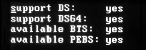
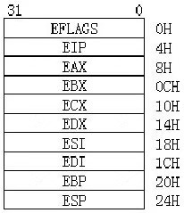
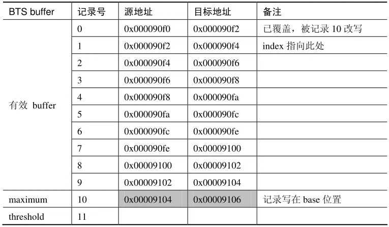
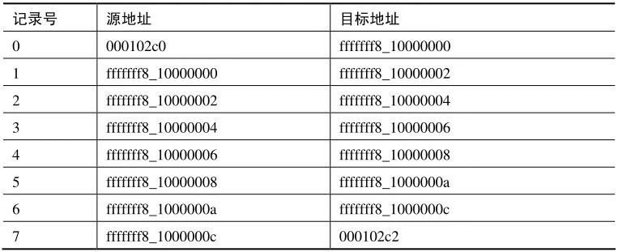
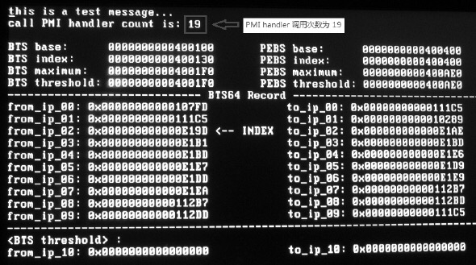

<!-- @import "[TOC]" {cmd="toc" depthFrom=1 depthTo=6 orderedList=false} -->

<!-- code_chunk_output -->

- [BTS机制](#bts机制)
- [1 检测DS（Debug Store）是否支持](#1-检测dsdebug-store是否支持)
- [2 Debug store 64位格式](#2-debug-store-64位格式)
  - [2.1 检测是否支持DS 64位格式](#21-检测是否支持ds-64位格式)
- [3 检测BTS（Branch Trace Store）机制是否可用](#3-检测btsbranch-trace-store机制是否可用)
- [4 检测PEBS（Precise Event Based Sampling）机制是否可用](#4-检测pebsprecise-event-based-sampling机制是否可用)
- [5 Debug Store存储区域](#5-debug-store存储区域)
  - [5.1 DS管理区域](#51-ds管理区域)
    - [5.1.1 BTS与PEBS buffer base](#511-bts与pebs-buffer-base)
    - [5.1.2 BTS与PEBS index](#512-bts与pebs-index)
    - [5.1.3 BTS与PEBS maximum](#513-bts与pebs-maximum)
    - [5.1.4 BTS与PEBS threshold](#514-bts与pebs-threshold)
    - [5.1.5 maximum值的设置](#515-maximum值的设置)
    - [5.1.6 threshold值的设置](#516-threshold值的设置)
    - [5.1.7 PEBS counter](#517-pebs-counter)
  - [5.2 BTS记录格式](#52-bts记录格式)
  - [5.3 PEBS记录格式](#53-pebs记录格式)
    - [5.3.1 检测PEBS记录的长度](#531-检测pebs记录的长度)
- [6 设置DS存储区域](#6-设置ds存储区域)
- [7 使用环形回路BTS buffer](#7-使用环形回路bts-buffer)
  - [7.1 BTS threshold值的设置](#71-bts-threshold值的设置)
  - [7.2 值得注意](#72-值得注意)
- [8 使BTS buffer产生DS中断](#8-使bts-buffer产生ds中断)
  - [8.1 判断中断触发的原因](#81-判断中断触发的原因)
    - [8.1.1 确定PMI触发](#811-确定pmi触发)
    - [8.1.2 确定BTS buffer满的DS中断触发](#812-确定bts-buffer满的ds中断触发)
    - [8.1.3 确定PEBS buffer满时DS中断触发](#813-确定pebs-buffer满时ds中断触发)
    - [8.1.4 确定PEBS中断触发](#814-确定pebs中断触发)
  - [8.2 编写DS中断handler](#82-编写ds中断handler)
    - [8.2.1 关闭功能](#821-关闭功能)
    - [8.2.2 PEBS buffer满时](#822-pebs-buffer满时)
    - [8.2.3 Counter溢出时](#823-counter溢出时)
    - [8.2.4 BTS buffer满时](#824-bts-buffer满时)
    - [8.2.5 PEBS中断](#825-pebs中断)
    - [8.2.6 恢复原有的功能设置](#826-恢复原有的功能设置)
    - [8.2.7 清LVT performance monitor寄存器mask位](#827-清lvt-performance-monitor寄存器mask位)
- [9 过滤BTS记录](#9-过滤bts记录)
  - [9.1 BTS\_OFF\_OS](#91-bts_off_os)
  - [9.2 BTS\_OFF\_USR](#92-bts_off_usr)
  - [9.3 注册中断服务例程](#93-注册中断服务例程)
  - [9.4 在用户代码里测试](#94-在用户代码里测试)
- [10 64位模式下的BTS机制](#10-64位模式下的bts机制)

<!-- /code_chunk_output -->

# BTS机制

BTS机制允许**BTM（Branch Trace Message**）存储在**内存DS（Debug Store）save区域**里。

我们从14.3.1节里的表14\-1知道：


当IA32\_DEBUGCTL寄存器的**TR=1**并且**BTS=1**时，**BTM**将存放在**DS save区域**内的**BTS buffer**里，并且由**BTINT位**可以配置为**环状的buffer**或者**buffer满时产生DS（debug store）interrupt**。

在**内存DS save区域**里包括**三部分**。

① **DS管理配置区域**：用来配置和管理**BTS buffer**和**PEBS buffer**区域。

② **BTS buffer**区域：这是**BTM记录**存放在内存中的buffer区域。

③ **PEBS buffer区域**：**PEBS（Precise Event Based Sampling！！！**）允许处理器在**某个事件（中断）发生**后**产生PEBS记录（记录处理器状态**），PEBS记录存放在内存中的buffer区域。

因此，**DS（debug store**）区域可以收集**两类信息**。

① **BTS信息**：在BTS buffer区域存储**branch记录信息**。

② **PEBS信息**：在PEBS buffer区域存储**处理器状态信息(！！！**)，PEBS机制是**Performace monitoring（性能监控）机制里的一部分(！！！**)。

**PEBS机制**允许当**某个事件监控中的counter（计数器）溢出**时，处理器在**debug store区域**的**PEBS buffer**保存处理器的**相关状态信息（典型地如寄存器的值**）。关于PEBS机制，我们会在第15章里详细探讨。

# 1 检测DS（Debug Store）是否支持

Debug Store存储区域是**BTS机制的基石**，因此在**软件使用前**，必须通过**CPUID.01：EDX[21]查询**处理器**是否支持Debug Store机制**。

代码清单14-14（lib\debug.asm）：

```assembly
；------------------------
；support_deubg_store（）：查询是否支持 DS 区域
； output：
；  1-support，0-no support
；------------------------
support_deubg_store：
      mov eax，1
      cpuid
      bt edx，21    ； DS 位
      setc al
      movzx eax，al
      ret
```

当**支持Debug Store区域**时，处理器可以使用下面的功能。

① 使用**IA32\_MISC\_ENABLE寄存器**来检测**当前BTS机制是否可用**。

② 使用**IA32\_DS\_AREA寄存器**来设置**debug store区域**。

值得注意的是，Intel特别注明，在**SMM模式下DS机制是不可用(！！！**)的。

# 2 Debug store 64位格式

Intel已经**增强了DS（debug store**）功能，使得**无论是否开启IA\-32e模式**（longmode）都支持**64位的debug store格式**，我们将在稍后了解64位的DS格式。

## 2.1 检测是否支持DS 64位格式

软件可以使用**CPUID.01：ECX\[2\].DTES64位**检测**是否支持DS64格式**，代码如下。

代码清单14-15（lib\debug.asm）：

```assembly
；------------------------------------
； support_ds64：查询是否支持 DS save 64 位格式
； output：
；  1-support，0-no support
；-----------------------------------
support_ds64：
      mov eax，1
      cpuid
      bt ecx，2    ； DEST64 位
      setc al
      movzx eax，al
      ret
```

当**DTES64位为1**时，表明处理器支持debug store 64位格式，而**不依赖于IA\-32e模式的开启(！！！**)，这一点非常重要，它决定了**debug store存储区域的格式**，包括：

① **64位**的**DS管理记录格式**。

② **64位**的**BTS记录格式**。

③ **64位**的**PEBS记录格式**。

# 3 检测BTS（Branch Trace Store）机制是否可用

**IA32\_MISC\_ENABLE寄存器**的bit 11位指示BTS是否可用，代码如下。

代码清单14-16（lib\debug.asm）：

```assembly
；---------------------------------
； available_branch_trace_store（）：
； output：
；  1-available，0-unavailable
；---------------------------------
available_branch_trace_store：
      mov eax，1
      cpuid
      bt edx，21
      setc al
      jnc available_branch_trace_store_done  ； no-support
      mov ecx，IA32_MISC_ENABLE
      rdmsr
      bt eax，11         ； BTS unavailable 位
      setnc al
available_branch_trace_store_done：
      movzx eax，al
      ret
```

这个函数先测试**是否支持DS功能**，然后通过**IA32\_MISC\_ENABL寄存器**来测试BTS功能软件是否可用。注意，当IA32\_MISC\_ENABLE[11]=1时，指示BTS机制是不可用的；为0时BTS可用。

# 4 检测PEBS（Precise Event Based Sampling）机制是否可用

IA32\_MISC\_ENABLE寄存器的bit 12位还指示**PEBS功能是否可用**，代码如下。

代码清单14-17（lib\debug.asm）：

```assembly
；---------------------------------
； avaiable_pebs（）：是否支持 PEBS 机制
； output：
；  1-available，0-unavailable
；--------------------------------------
available_pebs：
      mov eax，1
      cpuid
      bt edx，21
      setc al
      jnc available_pebs_done
      mov ecx，IA32_MISC_ENABLE
      rdmsr
      bt eax，12     ； PEBS unavailable 位
      setnc al
available_pebs_done：
      movzx eax，al
      ret
```

这个测试函数与上面的available\_branch\_trace\_store（）函数原理完全一样，只不过它是测试bit 12位的PEBS unavailable标志位。

上面的4个测试将**影响到整个DS机制**，我们可以写一个测试函数来检查处理器是否支持这些功能，在笔者的Westmere架构的Corei5处理器上测试的结果为。



在这个结果里，可以看到Westmere架构上支持DTES64功能，在Nehalem架构上也应该支持。而BTS与PEBS机制是可用的。这个功能是调用dump\_support\_ds（）来打印的，实现在lib\debug.asm文件里，调用了上面的4个测试函数来得到结果。

# 5 Debug Store存储区域

BTS记录存放在DS（debug store）区域的BTS buffer里。由**IA32\_DS\_AREA寄存器**设置**整个DS save area区域的base地址值**，如下面代码所示。

```assembly
mov ecx，IA32_DS_AREA
mov eax，DS_SAVE_BASE     ； DS区域基地址
mov edx，0
wrmsr         ； 写入DS地址
```

整个Debug Store区域分为三个部分。

① DS management area（**DS管理区域**）：它包含了BTS管理区与PEBS管理区，提供对BTS buffer与PEBS buffer的管理和设置。

② BTS buffer：这是**BTS记录**存放的区域。

③ PEBS buffer：这是**PEBS记录**存放的区域。

从前面我们知道**DS区域**可以分为**32位**与**64位**格式，我们在设置前必须**首先检查是否支持DTES64格式**（否则DS区域的设置将是错误的），处理器在下面的情况下使用DS64格式。


下图分别是32位与64位格式的DS区域。


在32位与64位中的DS区域结构是一致的，所不同的是**32位格式**的DS区域的**记录宽度是32位**的，而**64位的DS区域(！！！**)是**64位宽**。

在IA\-32e模式开启（无论是否支持DTES64功能）时或者在支持DTES64（64位的DS格式）功能的处理器上，使用的都是64位的DS区域。在不支持DTES64功能的处理器处于legacy模式时，使用的是32位的DS区域。

**DS区域基地址**

IA32\_DS\_AREA寄存器存放的值就是**DS区域地址**，因此IA32\_DS\_AREA寄存器将指向BTS管理区地址。如上所示，**BTS管理区的地址**就是**整个DS管理区域的基地址(相等**)。

在64位模式下IA32\_DS\_AREA寄存器可以设置64位**线性地址(！！！**)值，32位模式下设置32位的线性地址值，高32位被保留。

## 5.1 DS管理区域

**整个DS管理区域**包括了对**BTS buffer**与**PEBS buffer**的**管理和设置**，BTS buffer与PEBS buffer具有相同的设置值（除了**PEBS管理区多了4个counter reset值**）。

处理器会**自动动态地维护DS管理区域**中的**BTS buffer**与**PEBS buffer管理记录**。这些管理记录值都是**线性地址值(！！！**)。

### 5.1.1 BTS与PEBS buffer base

BTS buffer base提供**BTS buffer的线性基地址**，而PEBS buffer base提供**PEBS buffer线性基地址**。这些地址需要**在double word边界**上对齐。

### 5.1.2 BTS与PEBS index

**BTS与PEBS**的**index值**是指向**下一条BTS记录**与**PEBS记录存放的线性地址**。当处理器在index指向的位置写入BTS与PEBS记录后，**index的值**将更新为**下一条记录的地址**。处理器**自动维护这个index值(！！！**)。

BTS与PEBS的index值和LBR stack中的TOP指针是有区别的：**TOP指针**指向**当前已写记录的位置**，而**index值**指向**下一条记录将要写的位置**。

### 5.1.3 BTS与PEBS maximum

maximum值决定BTS buffer与PEBS buffer的**大小**，它指向BTS buffer与PEBS buffer**最后的记录（最大可容纳记录数**）下一个字节的线性地址值。

假设在**32位DS区域**下，BTS buffer与PEBS buffer最大可容纳10条记录，那么：

① **BTS** maximun值应为BTS buffer base\+ 10×12（注：**每条BTS记录是12个字节！！！**）

② **PEBS** maximum值应为PEBS buffer base\+ 10×40（注：**每条PEBS记录是40个字节！！！**）

假设在**64位DS区域**下，同样BTS与PEBS buffer最大容纳10条记录，那么：

① **BTS** maximum值应为BTS buffer base+10×24（注：**每条BTS记录是24个字节**）

② **PEBS** maximum值应为PEBS buffer base+10×144（注：**每条PEBS记录为144个字节**，在**增强PEBS记录下是176个字节**）。

对于BTS与PEBS记录，maximum是有一些区别的。

① 当**BTS buffer**配置为**环形的buffer（BTINT=0**）时，index达到maximum时重置为base值，这将会**回到base处重新继续写记录**。（前提是**threshold值大于maximum值**。）

② 当**PEBS index**达到PEBS maximum值时，**index不会被重置为base值**，需要软件进行重置。

我们将在后面了解到BTS与PEBS记录的结构与增强PEBS记录结构。

### 5.1.4 BTS与PEBS threshold

**Threshold值**是个**产生DS interrupt的临界值**，当BTS **index**或PEBS index的值达到BTS **threshold**值或PEBS threshold值时（等于或大于），将产生**DS interrupt（debug store中断！！！**）来提示跨越了buffer maximum边界（也就是buffer溢出了）。

threshold值必须是**记录字节的倍数**，例如：**threshold=buffer base\+11×24**（第11条记录是threshold值）。maximum与threshold值的设置很关键，将直接影响buffer区域的工作。

BTS threshold值的设置基于**两种BTS buffer的配置**而不同。

① 当**BTINT=0**时，BTS buffer配置为**环形回路buffer**，BTS buffer满时从头开始继续写。

② 当**BTINT=1**时，当**BTS buffer满**时**产生DS中断(！！！**)来提醒软件BTS buffer已满，软件需要进行相应的处理。

下图是一个BTS buffer区域设置的示例。


在这个示例里，BTS buffer可以容纳10条记录（编号从0到9），**每条记录**是**24个字节（18H宽**），那么**整个BTS buffer的大小**为10×24=240个字节，即**F0H（偏移量从0H到0EFH**）。

BTS maximum的值设置为base\+10×24（即F0H位置），BTS threshold的值必须大于BTS maximum值，示例里设置为BTS maximum记录的下一条记录起始处（即108H位置）。

### 5.1.5 maximum值的设置

在上面的示例里，由于buffer的大小是10条记录。那么记录10的起始边界F0H（记录9下一条记录的起始字节）就可以设为BTS maximum值。

在Intel64手册里，对maximum值的一段话如下：

BTS absolute maximum—Linear address of the next byte past the end of the BTS buffer. This address should be a multiple of the BTS record size （12 bytes） plus 1.

这段话的前一句比较容易理解，而后一句话似乎表明maximum的值为记录字节倍数加上1值，实际上在笔者的测试中并不需要加上1值（即下一条记录的起始字节就可以了）。

值得注意的是，**即使进入PMI handler**（如果**threshold小于maximum**，由于遇到threshold而**产生DS中断**），**BTS buffer仍然被写满**，直到BTS maximum值。

### 5.1.6 threshold值的设置

当BTS buffer配置为环形回路buffer时，BTS threshold的值必须大于BTS maximum，避免index达到threshold值而产生DS中断。如上图中的环形BTS buffer配置示例所示。

当BTS buffer配置为满产生DS中断时，BTS threshold的值应该等于BTS maximum值，确保index达到maximum（BTS buffer写满时）产生DS中断。


如上所示，这是一个**非环形BTS buffer**的配置示例，BTS threshold的值设置等于BTS maximum值。当index写满记录9，达到BTS maximum（BTS threshold）时产生DS中断。

BTS buffer无论配置为**circular（环形**）还是**non\-circular（threshold中断**），BTS threshold的值都**不应该小于BTS maximum值**。

因此，**正确的方案**是，BTS **threshold要么大于maximum（环形回路！！！**），要么**等于maximum值（threshold中断或者说BTS buffer溢出中断！！！**）。

当BTS threshold小于BTS maximum时，index达到threshold值时产生DS中断（此时buffer未满），而不依赖于是否配置为“满时产生中断”（即使环形的buffer也产生DS中断）。如果确实需要在buffer未满时就产生DS中断来提醒，那么在这种情况下可以设置BTS threshold值小于BTS maximum值。

### 5.1.7 PEBS counter

当**每个IA32\_PMC counter（通用计数器**）配置为，因**counter（计数器**）溢出产生**PEBS中断**而**不是PMI（performance monitoring interrupt）中断**（尽管都使用**同一个中断vector**）时。

当**产生PEBS中断**时，相应的**IA32\_PMC（通用计数器寄存器**）值可以**从PEBS管理区中的counter值(！！！**)来得到**重置**。

Nehalem微架构及后续架构支持4个IA32\_PMC0到IA32\_PMC3计数器**产生PEBS中断**，因此在PEBS管理区里需要设置**4个counter值**（对应于IA32\_PMC0到IA32\_PMC3）。

## 5.2 BTS记录格式

**每条BTS记录**分为**3个部分**。

① last branch from：记录分支的**源地址**。

② last branch to：记录分支的**目标地址**。

③ branch predicted：这部分的**bit 4位**指示分支是属于**predicted（预测的**），还是**non\-predicted（非预测的**）。

在**32位格式**里，**每部分为4字节**，**每条记录**为**12字节**。在64位格式里，每部分为8字节，每条记录共为**24个字节**。


与LBR stack中的from/to地址一样，这些BTS记录中的from和to地址都是**线性地址值**，当BTS buffer能容纳10条记录时，那么最多有10条这样的记录，**每条记录**按**先后顺序**存放在BTS buffer区域（**由低往高地址存放**）中。

## 5.3 PEBS记录格式

PEBS是指**Precise Event Based Sampling**（直译为**基于抽样的精确事件！！！**），PEBS记录实际上保存着**处理器的context（上下文）状态**，也就是包括：**EFLAGS寄存器**，**EIP值**，以及**GPR（通用寄存器**）值。



在**32位**格式里，PEBS记录的**每个部分**是**32位宽**，保存**32位的寄存器值**，于是将**保存8个通用寄存器**。**每条PEBS记录**共**40个字节**。


上面是**64位**的PEBS记录格式，PEBS记录**每个部分**是**8字节**宽。最初的Core架构64位PEBS记录是**144个字节**，保存**RFLAGS寄存器**、**RIP值**，以及**16**个**64位通用寄存器（从RAX到R15**）。

从Nehalem微架构开始，PEBS机制得到增强，**每条PEBS**记录扩展到**176个字节**，除了保存上述的寄存器外，新增了**4个部分**。这些增强的功能，我们将在15.4.1节与15.4.8节里进行探讨。

### 5.3.1 检测PEBS记录的长度

综合前面所述，最终确定PEBS记录的长度由下面两个因素决定。

① 检测是否支持DTES64格式（即64位DS区域）。

② 检测64位PEBS记录的格式是否属于增强格式。

在不支持DTES64格式的情况下，它属于32位的PEBS记录格式，PEBS记录为40个字节宽。否则，如果不支持增强记录格式，PEBS记录为144个字节（64位PEBS记录）。

而在增强PEBS记录格式下，每个PEBS记录变成了176个字节（增加了4个部分）。

在支持DTES64格式的情况下，软件需要从IA32\_PERF\_CAPABILITIES寄存器的[11：8]域来查询是否支持增强格式，如下面的support\_enhancement\_pebs（）检测函数所示。

代码清单14-18（lib\debug.asm）：

```assembly
；------------------------------------------------------------
； support_enhancement_pebs（）：检测是否支持增强的 PEBS 记录
； output：
； 1-support，0-no support
；-----------------------------------------------------------
support_enhancement_pebs：
      mov ecx，IA32_PERF_CAPABILITIES
      rdmsr
      shr eax，8
      and eax，0Fh    ； 得到 IA32_PREF_CAPABILITIES[11：8]
      cmp eax，0001B    ； 测试是否支持增强的 PEBS 格式
      sete al
      movzx eax，al
      ret
```

当IA32\_PERF\_CAPABILITIES[11：8]=0001B时，处理器将支持增强的PEBS记录格式。否则PEBS记录只保存RFLAGS寄存器、RIP寄存器，以及通用寄存器。

那么，在DS管理区设置时，必须检测PEBS记录长度，做出正确的设置。

# 6 设置DS存储区域

对于**DS存储区域的设置**，**Intel**有它推荐和建议，例如下面几条。

① 对于**OS**来讲，**DS区域**应分配在**non\-paged（不可换页）的区域**，系统**不应将它换出内存(！！！**)。并且系统应**保持DS区域属于dirty（脏）页(！！！**)，即已经被写的页。

② DS区域**可以大于4K页**，但**必须使用相临的页（即线性地址上必须是连续的！！！**）。**物理地址并没有要求**（但是出于性能的考虑，建议不使用跨页的物理地址）。

③ 出于性能的考虑，DS区域及管理区记录应该设置在**double word边界(！！！**)上。

④ **BTS buffer**和**PEBS buffer大小**应该使用**记录字节的倍数（例如10个记录**），并且应确保设置的PEBS记录宽度能够容纳下整条PEBS记录（例如前面所述的检测PEBS记录宽度）。

⑤ 在**MP系统**里，对于**所有的处理器**，系统应该将**DS区域**映射到**同一个物理地址区域(！！！**)上。保持**切换CR3寄存器时**，**DS区域地址不变**。

在设置DS存储区域后，还必须**确保local APIC是开启(！！！**)的，并且**对LVT performance monitor寄存器进行正确的设置(！！！**)，**编写相应的PMI（performance monitor interrupt）中断处理程序(！！！**)。

下面是笔者对DS存储区域的设置代码。

代码清单14-19（lib\debug.asm）：

```assembly
；----------------------------------------------------------------
； set_ds_management_record（） 设置管理区记录基于 DS_SAVE_BASE
； input：
；  esi - BTS buffer base
；  edi - PEBS buffer base
； description：
；  默认情况下，配置为环形回路 buffer 形式，
；  threshold 值大于 maximum，避免产生 DS buffer 溢出中断
；--------------------------------------------------------------------
set_ds_management_record：
      push ebp
      mov ebp，esp
      push ecx
      push edx
      push ebx
；； 测试是否支持 64位的 DS save 格式
      mov eax，1
      cpuid
      bt ecx，2         ； DEST64 位
      jc set_ds_management_record64
      mov DWORD [ds64_flag]，0     ； DS64 不支持，ds64_flags 标志清0
      mov DWORD [enhancement_pebs_flag]，0  ； 不支持，enhancement_pebs_flag
标志清 0
      ；； 设置 32位的 BTS 格式
      mov DWORD [DS_SAVE_BASE + BTS_BASE]，esi
      mov DWORD [DS_SAVE_BASE + BTS_INDEX]，esi
      lea eax，[esi + BTS_RECORD_MAXIMUM * 12]
      mov DWORD [DS_SAVE_BASE + BTS_MAXIMUM]，eax ； 最大记录数为
BTS_RECORD_MAXIMUM 值
      ； 设置为环形回路 BTS buffer
      lea eax，[esi + BTS_RECORD_CIRCULAR_THRESHOLD * 12]
      mov DWORD [DS_SAVE_BASE + BTS_THRESHOLD]，eax
      ；； 设置 32 位的 PEBS 格式
      mov DWORD [DS_SAVE_BASE + PEBS_BASE]，edi   ； pebs buffer base
      mov DWORD [DS_SAVE_BASE + PEBS_INDEX]，edi  ； pebs buffer index
      mov DWORD [pebs_buffer_index]，edi               ； 保存 index 值
      lea eax，[edi + PEBS_RECORD_MAXIMUM * 40]   ； base + m * 40
      mov DWORD [DS_SAVE_BASE + PEBS_MAXIMUM]，eax  ； pebs buffer maximum
      lea eax，[edi + PEBS_RECORD_THRESHOLD * 40]  ； base + t * 40
      mov DWORD [DS_SAVE_BASE + PEBS_THRESHOLD]，eax ； pebs buffer threshold
      mov DWORD [DS_SAVE_BASE + PEBS_COUNTER0]，0
      mov DWORD [DS_SAVE_BASE + PEBS_COUNTER1]，0
      mov DWORD [DS_SAVE_BASE + PEBS_COUNTER2]，0
      mov DWORD [DS_SAVE_BASE + PEBS_COUNTER3]，0
      ；； 下面存放 BTS 管理区的 pointer 值
      mov DWORD [bts_base_pointer]，DS_SAVE_BASE + BTS_BASE
      mov DWORD [bts_index_pointer]，DS_SAVE_BASE + BTS_INDEX
      mov DWORD [bts_maximum_pointer]，DS_SAVE_BASE + BTS_MAXIMUM
      mov DWORD [bts_threshold_pointer]，DS_SAVE_BASE + BTS_THRESHOLD
      ；； 下面存放 PEBS 管理区 pointer
      mov DWORD [pebs_base_pointer]，DS_SAVE_BASE + PEBS_BASE
      mov DWORD [pebs_index_pointer]，DS_SAVE_BASE + PEBS_INDEX
      mov DWORD [pebs_maximum_pointer]，DS_SAVE_BASE + PEBS_MAXIMUM
      mov DWORD [pebs_threshold_pointer]，DS_SAVE_BASE + PEBS_THRESHOLD
      mov DWORD [pebs_counter0_pointer]，DS_SAVE_BASE + PEBS_COUNTER0
      mov DWORD [pebs_counter1_pointer]，DS_SAVE_BASE + PEBS_COUNTER1
      mov DWORD [pebs_counter2_pointer]，DS_SAVE_BASE + PEBS_COUNTER2
      mov DWORD [pebs_counter3_pointer]，DS_SAVE_BASE + PEBS_COUNTER3
      jmp set_ds_management_record_done
set_ds_management_record64：
      mov DWORD [ds64_flag]，1     ； DS64 支持，ds64_flags 标志置 1
      ；； 设置 64 位 BTS 管理区
      mov DWORD [DS_SAVE_BASE + BTS64_BASE]，esi
      mov DWORD [DS_SAVE_BASE + BTS64_BASE + 4]，0
      mov DWORD [DS_SAVE_BASE + BTS64_INDEX]，esi
      mov DWORD [DS_SAVE_BASE + BTS64_INDEX + 4]，0
      lea eax，[esi + BTS_RECORD_MAXIMUM * 24]
      mov DWORD [DS_SAVE_BASE + BTS64_MAXIMUM]，eax
      mov DWORD [DS_SAVE_BASE + BTS64_MAXIMUM + 4]，0
      ；； 配置为环形回路 BTS buffer
      lea eax，[esi + BTS_RECORD_CIRCULAR_THRESHOLD * 24]
      mov DWORD [DS_SAVE_BASE + BTS64_THRESHOLD]，eax
      mov DWORD [DS_SAVE_BASE + BTS64_THRESHOLD + 4]，0
      ；； 下面存放 BTS 管理区的 pointer 值
      mov DWORD [bts_base_pointer]，DS_SAVE_BASE + BTS64_BASE
      mov DWORD [bts_index_pointer]，DS_SAVE_BASE + BTS64_INDEX
      mov DWORD [bts_maximum_pointer]，DS_SAVE_BASE + BTS64_MAXIMUM
      mov DWORD [bts_threshold_pointer]，DS_SAVE_BASE + BTS64_THRESHOLD
      ；； 设置 64 位 PEBS 管理区
      mov ecx，IA32_PERF_CAPABILITIES
      rdmsr
      shr eax，8
      and eax，0Fh        ； 得到
      IA32_PREF_CAPABILITIES[11：8]
      cmp eax，0001B        ； 测试是否支持增强的 PEBS 格式
      je enhancement_pebs64
      mov DWORD [enhancement_pebs_flag]，0  ； 不支持，enhancement_pebs_flag标志清 0
      mov DWORD [pebs_record_length]，144
      lea eax，[edi + PEBS_RECORD_MAXIMUM * 144]   ； maximum 值
      lea edx，[edi + PEBS_RECORD_THRESHOLD * 144]
      jmp set_pebs64
enhancement_pebs64：
      ；*
      ；* 增强的 PEBS 格式，每条记录共 176 个字节 *
      ；*
      mov DWORD [enhancement_pebs_flag]，1 ； 支持，enhancement_pebs_flag 标志置 1
      mov DWORD [pebs_record_length]，176
      lea eax，[edi + PEBS_RECORD_MAXIMUM * 176]  ； maximum 值
      lea edx，[edi + PEBS_RECORD_THRESHOLD * 176]   ； threshold 值
set_pebs64：
      mov DWORD [DS_SAVE_BASE + PEBS64_BASE]，edi   ； pebs buffer base
      mov DWORD [DS_SAVE_BASE + PEBS64_BASE + 4]，0
      mov DWORD [DS_SAVE_BASE + PEBS64_INDEX]，edi   ； pebs buffer index
      mov DWORD [DS_SAVE_BASE + PEBS64_INDEX + 4]，0
      mov DWORD [DS_SAVE_BASE + PEBS64_MAXIMUM]，eax  ； pebs buffer maximum
      mov DWORD [DS_SAVE_BASE + PEBS64_MAXIMUM + 4]，0
      mov DWORD [DS_SAVE_BASE + PEBS64_THRESHOLD]，edx  ； pebs buffer threshold
      mov DWORD [DS_SAVE_BASE + PEBS64_THRESHOLD + 4]，0
      ；*
      ；* 保存 pebs index 值
      ；* 作为判断 PEBS 中断条件
      ；*
      mov DWORD [pebs_buffer_index]，edi
      mov DWORD [pebs_buffer_index + 4]，0
      ；； 设置 counter reset
      mov DWORD [DS_SAVE_BASE + PEBS64_COUNTER0]，0
      mov DWORD [DS_SAVE_BASE + PEBS64_COUNTER0 + 4]，0
      mov DWORD [DS_SAVE_BASE + PEBS64_COUNTER1]，0
      mov DWORD [DS_SAVE_BASE + PEBS64_COUNTER1 + 4]，0
      mov DWORD [DS_SAVE_BASE + PEBS64_COUNTER2]，0
      mov DWORD [DS_SAVE_BASE + PEBS64_COUNTER2 + 4]，0
      mov DWORD [DS_SAVE_BASE + PEBS64_COUNTER3]，0
      mov DWORD [DS_SAVE_BASE + PEBS64_COUNTER3 + 4]，0
      ；； 下面存放 PEBS 管理区 pointer
      mov DWORD [pebs_base_pointer]，DS_SAVE_BASE + PEBS64_BASE
      mov DWORD [pebs_index_pointer]，DS_SAVE_BASE + PEBS64_INDEX
      mov DWORD [pebs_maximum_pointer]，DS_SAVE_BASE + PEBS64_MAXIMUM
      mov DWORD [pebs_threshold_pointer]，DS_SAVE_BASE + PEBS64_THRESHOLD
      mov DWORD [pebs_counter0_pointer]，DS_SAVE_BASE + PEBS64_COUNTER0
      mov DWORD [pebs_counter1_pointer]，DS_SAVE_BASE + PEBS64_COUNTER1
      mov DWORD [pebs_counter2_pointer]，DS_SAVE_BASE + PEBS64_COUNTER2
      mov DWORD [pebs_counter3_pointer]，DS_SAVE_BASE + PEBS64_COUNTER3
set_ds_management_record_done：
      ； 清 PEBS buffer 溢出指示位 OvfBuffer
      RESET_PEBS_BUFFER_OVERFLOW
      pop ebx
      pop edx
      pop ecx
      mov esp，ebp
      pop ebp
      ret
```

这个set\_ds\_management\_record（）函数用来设置DS管理区的BTS buffer与PEBS buffer，实现在lib\debug.asm文件里，稍有些长，但结构是清晰的。它的工作是先判断是否支持DTES64格式，根据检测的结果来选择设置32位与64位DS区域。

在设置PEBS buffer时，先检测是否支持扩展的格式（通过前面所述的IA32\_PERF\_CAPABILITIES寄存器来检测），根据测试的结果来设置PEBS maximum与threshold值。

函数需要提供两个输入参数：esi传递BTS buffer base值，edi传递PEBS buffer base值。

代码清单14-20（lib\debug.asm）：

```assembly
；-------------------------------------------
； set_debug_store_area（）：设置 DS 区域基地址
；-------------------------------------------
set_debug_store_area：
      mov esi，DS_SAVE_BASE
      call clear_4K_page   ； 先清空 debug store area
； 设置 IA32_DS_AERA 寄存器
      mov ecx，IA32_DS_AREA
      mov eax，DS_SAVE_BASE  ； DS 区域基地址
      mov edx，0
      wrmsr
      ret
```

这个set\_debug\_store\_area（）函数将设置DS存储区域的基地址，通过**写IA32\_DS\_AREA寄存器**，基地址固定为DS\_SAVE\_BASE值，这是个常量值，定义在inc\debug.inc文件里。这个文件也定义了BTS\_BUFFER\_BASE与PEBS\_BUFFER\_BASE常量值，对应于BTS的base与PEBS的base值。也定义了BTS\_RECORD\_MAXIMUM与BTS\_RECORD\_CIRCULAR\_THRESHOLD值，对应于环形BTS buffer的最大记录数与threshold值。定义了PEBS\_RECORD\_MAXIMUM与PEBS\_RECORD_THRESHOLD值，对应于PEBS的最大记录数与threshold值。

函数开头使用clear\_4K\_page（）函数来清空DS区域，这个函数实现在lib\page32.asm文件里。在inc\debug.inc文件里定义了一个宏，来设置完整的DS存储区域。

代码清单14-21（inc\debug.inc）：

```assembly
；---------------------------------------------------
； 宏 SET_DS_AREA（）
； 描述：
； 用来设置完整的 DS 区域（环形回路 buffer 类型）
；----------------------------------------------------
%macro SET_DS_AREA 0
      ；；； 设置 IA32_DS_AERA 寄存器
      call set_debug_store_area
      ；；； 设置 DS 管理区域
      SET_DS_MANAGEMENT
%endmacro
```

这个SET\_DS\_AREA宏只是依次调用set\_debug\_store\_area（）和set\_ds\_management\_record（）函数来设置环形的BTS buffer。

当BTS buffer配置为满产生DS中断时，需要做一些修改，代码如下所示。

代码清单14-22（inc\debug.inc）：

```assembly
；------------------------------------------------
； 宏 SET_INT_DS_AREA（）
； 描述：
； 用来设置当 buffer 满时产生 DS buffer 中断
；------------------------------------------------
%macro SET_INT_DS_AREA 0
      SET_DS_AREA        ； 先设置为环形回路 buffer 类型
      ； 接下来设置 threshold 值等于 maximum 值
      ； 来达到 buffer 满时产生 DS 中断
      mov esi，[bts_maximum_pointer]  ； 读 BTS maximum 地址
      mov esi，[esi]       ； 读 BTS maximum 值
      mov edi，[bts_threshold_pointer]  ； 读 BTS threshold 地址
      mov [edi]，esi       ； 设 BTS threshold 等于 BTS maximum 值
%endmacro
```

这个宏SET\_INT\_DS\_AREA调用前面的宏SET\_DS\_AREA来配置一个环形的BTS buffer，接着将BTS thershold值设置为BTS maximum值，来达到配置BTS buffer满时产生DS中断。

# 7 使用环形回路BTS buffer

使用下面的IA32_DEBUGCTL寄存器设置，将开启circular（状形）回路BTS buffer。


当IA32\_DEBUGCTL.TR=1，IA32\_DEBUGCTL.BTS=1，而BTINT值为0时，branch记录将写在内存的BTS buffer区域，这个BTS buffer是循环使用。当BTSbuffer的index到达maximum时，index将被重置为base值，继续从头开始记录。

这个工作原理和LBR stack是一样的，值得注意的是，index是指向下一条记录将要写的地址。在初始设置里，base是第1条记录的位置，而index一般设为与base值一样。

## 7.1 BTS threshold值的设置

如前面所述，对于**circular（环形）的BTS buffer**来说，**BTS threshold值必须大于BTS maximum值**。否则（小于或等于BTS maximum），当index遇到threshold值时会触发DS中断，在LVT performance monitor未屏蔽时会进入PMI handler。

并且在进入PMI handler，可能由于新的分支引起BTS buffer继续写满后，会重新从base位置开始进行新的记录。

显然这是个错误的行为。假设，BTS buffer最多能容纳10条记录，对环形BTS buffer的64位格式下，下面是对BTS maximum与BTS threshold的设置。

```assembly
mov DWORD [DS_AREA_BASE + BTS_MAXIMUM]，10 * 24 ； maximum 值为 10个BTS记录
mov DWORD [DS_AREA_BASE + BTS_THRESHOLD]，11 * 24； threshold 值为 11 个BTS记录
```

BTS threshold值应设置为大于BTS maximum值的BTS记录整数倍位置上，上面的代码设在记录11的位置（当然还可以设为更后的位置上）。

在正确设置BTS buffer的情况下，环形回路BTS buffer的使用不会因为BTS buffer溢出产生DS中断而调用PMI中断handler。但是在一个完整的OS环境里，必须把LVT performance monitor寄存器设置好，并组织好PMI handler及IDT。

>实验14\-9：测试环形回路BTS buffer的工作

按照惯例，我们将对BTS机制进行一些实验测试。在这里我们测试使用和观察环形回路的BTS buffer。下面是测试的主体代码。

代码清单14-23（topic14\ex14-9\protected.asm）：

```assembly
      call available_bts     ； 测试 bts 机制是否可用
      test eax，eax
      jz next        ； 不可用
； 设置 IA32_DS_AERA 寄存器
      call set_debug_store_area
； 设置 DS 管理区记录
      mov esi，BTS_BUFFER_BASE   ； BTS buffer 基址
      mov edi，PEBS_BUFFER_BASE   ； PEBS buffer 基址
      call set_ds_management_record
； 开启 BTS
      ENABLE_BTS       ； TR=1，BTS=1
；； 下面测试 11 条 branch
jmp l1
l1：jmp l2
l2：jmp l3
l3：jmp l4
l4：jmp l5
l5：jmp l6
l6：jmp l7
l7：jmp l8
l8：jmp l9
l9：jmp l10
l10：jmp l11
l11：
； 关闭 BTS
      DISABLE_BTS       ； TR=0，BTS=0
      DUMP_BTS       ； 打印 BTS buffer 信息
next：
      jmp $
```

实验代码里，先检则BTS机制是否可用，在可用的情况下继续下面的设置。代码先设置DS存储区域的基地址，再调用前面代码清单14-20中的set\_ds\_management\_record（）函数设置DS管理区的记录（BTS与PEBS buffer的相关设置）。

接着开启BTS机制，ENABLE\_BTS是宏，实现在inc\debug.inc文件里，对IA32\_DEBUGCTL寄存器进行设置（TR=1并且BTS=1）。

代码清单14-24（inc\debug.inc）：

```assembly
；-----------------------------------
； ENABLE_BTS（） 宏：开启 bts，环状回路
；-----------------------------------
%macro ENABLE_BTS 0
      mov ecx，IA32_DEBUGCTL
      mov edx，0
      mov eax，0C0h     ； TR=1，BTS=1
      wrmsr
%endmacro
```

在开启BTS后，后续代码连续使用11条jmp指令来产生分支记录。采用这种方式比较直观，容易观察BTS记录。最后使用宏DISABLE\_BTS关闭BTS机制，并使用DUMP\_BTS宏来打印BTS buffer的信息，这些宏都实现在inc\debug.inc文件里。

下面是在Westmere架构Core i5处理器笔记本式计算机上的运行结果。


在这个测试里，笔者特意产生了11条分支记录，在结果里我们看到：BTS buffer已经被写满，index指向记录1（下一条记录将要写的地方），下表是这11条分支记录的描述。



在BTS maximum的位置上不是有效的buffer区域，记录不能写在这个位置上。最后一条记录由于index回绕后写在base位置（记录0）上，接着index指向记录1的位置。

处理器动态地维护BTS index值，在BTS管理区里BTS index的值为00400118h（记录1地址），记录0已经被重写（被最后一条记录覆盖了）。当然，这个BTS buffer我们可以设得更大，但在笔者的测试实验里，BTS和PEBS buffer最多只能容纳10条记录。

## 7.2 值得注意

在实验代码里，笔者使用了宏DISABLE_BTS来关闭BTS机制，而不使用函数的调用。这是基于在未关闭BTS机制下，函数调用又会产生更多的分支记录。

代码清单14-25（inc\debug.inc）：

```assembly
；------------------------------------------------------------
； 宏 DUMP_BTS（） 用来打印 DS 管理区与 BTS buffer 记录
； 使用这个宏先关闭 BTS 避免记录函数分支
；------------------------------------------------------------
%macro DUMP_BTS 0
      mov ecx，IA32_DEBUGCTL
      rdmsr
      mov esi，0FF3Fh    ； BTS=0，TR=0
      mov edi，eax
      push eax
      bt eax，7      ； 测试 BTS 位，BTS 机制是否开启
      cmovc edi，esi     ； 如果开启就关闭它
      and eax，edi
      wrmsr
      call dump_ds_management  ； 打印 DS 管理区记录
      call dump_bts_record   ； 打印 BTS buffer 记录信息
      ； 恢复原设置
      pop eax
      mov edx，0
      mov ecx，IA32_DEBUGCTL
      wrmsr       ； 写回原设置
%endmacro
```

宏DUMP\_BTS的编写原理是，如果BTS是开启的，就先关闭BTS再打印，打印完毕后再恢复BTS的开启状态。打印功能最终是调用dump\_ds\_management（）和dump\_bts\_record（）函数来实现。这个宏的好处是在打印BTS buffer信息时，不会产生额外的分支记录。

# 8 使BTS buffer产生DS中断

在开启BTS机制的同时，设置IA32_DEBUGCTL.BTINT=1时，将使用非环状回路的BTS buffer，如下表的设置。


**BTS threshold值的设置**

为了达到BTS buffer写满时产生DS中断，如前面所述：此时**BTS threshold值**应该设置为**等于BTS maximum值**，如下是一个正确的设置示例。


对于BTS buffer满时产生DS中断这个需求来说，无论是threshold值小于maximum值（未满就产生中断），或者是threshold值大于maximum值都是不正确的。


在笔者的测试里，如上所示：配置为**非环形BTS buffer时**，当设置**threshold值大于maximum**时，在**写满BTS buffer**，**还有分支记录时**，将引发数次的**DS中断请求（连续调用PMI handler**）。

在**非环形BTS buffer（BTINT=1**）里，当BTS **threshold值大于maximum值二个BTS记录以上**时，写满Buffer后，DS中断将不会触发。

这是在笔者的测试里的另一类情况，threshold大于maximum并且相隔不止一个记录时，index将无法达到threshold值，DS中断也不可能会发生。

**DS中断与PMI中断**

产生DS（Debug Store）中断的根本原因是index达到了threshold值（无论是环形还是非环形BTS buffer）。BTS buffer写满时回绕或者是产生中断，这是软件的需求问题。系统根据需求而设置合理的threshold值。BTS index达到BTS threshold或者PEBS index达到PEBS threshold值都会产生DS中断。

而DS中断handler的vector就是LVT performance monitor寄存器里设置的vector值。因此，DS中断handler与PMI handler使用同一个中断服务程序。

可是，它们的触发原因不同。

① PMI（performance monitor interrupt）的触发，是由于在监控事件时counter（计数器）发生了溢出。

② DS（Debug Store）中断（或者称BTS/PEBS buffer溢出中断）的触发，是由于BTS或PEBS的index达到了各自的threshold值。

实际上，PEBS和PMI都使用perfmon中断handler进行处理（我们将在第15章里对PEBS机制进行详细的探讨）。perfmon中断handler需要接管这些中断处理。

## 8.1 判断中断触发的原因

由前面所述，DS中断和PMI都使用同一个中断服务程序，因此在DS和PMI handler里必须判断由哪种原因产生。在OS完善的perfmon handler里还需要判断PEBS中断触发的原因，如下表所示。


由上表可以看到，引发调用LVT performance monitor寄存器设置的中断handler，总共有4个触发原因。其中BTS buffer满和PEBS buffer满可以归纳为DS（debug store）中断。PEBS中断在PMI的基础上配置（IA32\_PEBS\_ENABLE寄存器设置PEBS中断）。

### 8.1.1 确定PMI触发

在PMI handler里，可以通过IA32\_PERF\_GLOBAL_STATUS寄存器来判断是否由于counter溢出而产生中断。


在上面的IA32\_PERF\_GLOBAL\_STATUS寄存器里，bit 0到bit 3置位时指示相应的IA32\_PMC计数器发生了溢出。bit 32到bit 35置位时指示相应的IA32\_FIXED\_CTR计数器发生了溢出。如下面的test\_counter\_overflow（）函数所示，实现在lib\perfmon.asm文件里。

代码清单14-26（lib\perfmon.asm）：

```assembly
；---------------------------------------------------
； test_counter_overflow（）：测试是否 counter 发生溢出
； output：
；  1-yes，0-no
；---------------------------------------------------
test_counter_overflow：
      mov ecx，IA32_PERF_GLOBAL_STATUS
      rdmsr
      test edx，7    ； 测试 IA32_FIXED_CTRx 寄存器
      setnz dl
      jnz test_counter_overflow_done
      test eax，0Fh   ； 测试 IA32_PMCx 寄存器
      setnz dl
test_counter_overflow_done：
      movzx eax，dl
      ret
```

在Nehalem与Westmere架构里支持4个IA32\_PMC寄存器，在Sandy Bridge架构里将支持更多的IA32\_PMC寄存器。

那么，perfmon中断handler可以通过读取IA32\_PERF\_GLOBAL\_STATUS寄存器溢出标志位来判断是由于counter溢出而产生中断。而在perfmon中断handler里需要对溢出标志位进行清位工作。

### 8.1.2 确定BTS buffer满的DS中断触发

那么，如何确定产生了DS中断呢？DS中断由于BTS Buffer满或者PEBS buffer满而产生，因此对BTS buffer可以通过index值判断。

当BTS index等于或大于thresould值时触发BTS buffer满时中断，因此我们可以使用下面的test\_bts\_buffer\_overflow（）函数进行判断。

代码清单14-27（lib\debug.asm）：

```assembly
；--------------------------------------------------------------
； test_bts_buffer_overflow（）：测试是否发生 BTS buffer 溢出中断
；--------------------------------------------------------------
test_bts_buffer_overflow：
      mov eax，[bts_index_pointer]
      mov eax，[eax]                          ； 读 BTS index 值
      mov esi，[bts_threshold_pointer]
      cmp eax，[esi]                          ； 比较 index >= threshold ？
      setae al
      movzx eax，al
      ret
```

在正确设置buffer的前提下，使用环状回路buffer时（BTINT=0），index指向maximum时会回绕到base（第1条记录）重新开始写记录而不会产生DS中断。而在BTS buffer满而产生中断时，perfmon中断handler里需要对index值重新设置为BTS base值，避免重复产生DS中断。后续的分支记录可以继续写入。

### 8.1.3 确定PEBS buffer满时DS中断触发

对于PEBS buffer满而引发的DS中断触发，中断handler可以通过一个简便的方式，而不需要通过index值。

在上面的IA32\_PERF\_GLOBAL\_STATUS寄存器中，bit 62位是OvfBuffer位，当置位时指示发生了PEBS buffer溢出。因此，可以通过OvfBuffer标志位来判断，代码如下所示。

代码清单14-28（lib\perfmon.asm）：

```assembly
；-------------------------------------------------------
； test_pebs_buffer_overflow（）：测试 PEBS buffer 是否溢出
； output：
； 1-yes，0-no
；-------------------------------------------------------
test_pebs_buffer_overflow：
      mov ecx，IA32_PERF_GLOBAL_STATUS
      rdmsr
      bt edx，30       ； 测试 OvfBuffer 位
      setc al
      movzx eax，al
      ret
```

同样，当判断为这个原因引起的DS中断，perfmon中断handler需要对OvfBuffer标志位进行清位工作，并且需要对PEBS index重新设置为PEBS base值，避免重复产生DS中断。

### 8.1.4 确定PEBS中断触发

在排除上面的三种触发原因后，就可以认为最后产生的是PEBS中断。基本上没有特别的方法去判断PEBS中断。因为counter（计数器）配置为溢出产生PEBS中断时，PEBS中断发生后并不会在IA32\_PERF\_GLOBAL\_STATUS寄存器里记录溢出的发生。

而PMI中断会在IA32\_PERF\_GLOBAL\_STATUS寄存器里记录发生溢出。软件可以通过PEBS index值来做判断，代码逻辑如下。

```c
if （new_pebs_index > old_pebs_index）
{
      /* 产生 PEBS 中断 */
}
```

软件需要记录旧的PEBS index值是多少，然后在中断handler判断新的PEBS index是否大于旧的PEBS index，如果大于则说明产生了PEBS中断。因为PEBS记录写在PEBS buffer时，PEBS index值会增加。（我们将在第15章里实现测试PEBS中断触发函数。）

## 8.2 编写DS中断handler

DS中断handler（即perfmon中断handler）的编写应该遵循下面几个原则。

① 先关闭相应的功能，例如：BTS机制，PEBS机制，performance counter。

② 判断中断引发的原因，做相应的处理。

③ 退出前恢复原来的设置。

④ 清LVT performance montior寄存器的mask位。

⑤ 发送EOI命令。

perfmon中断handler需使用Fixed delivery模式，Intel特别说明perfmon中断handler的vector在IDT里对应的描述符需要使用Interrupt-gate（中断门）描述符。

代码清单14-29（topic14\ex14-10\protected.asm）：

```assembly
；-------------------------------
； perfmon handler
；------------------------------
apic_perfmon_handler：
      jmp do_apic_perfmon_handler
ph_msg1 db '>>> now：enter PMI handler，occur at 0x'，0
ph_msg2 db 'exit the PMI handler <<<'，10，0
ph_msg3 db '****** DS interrupt occur with BTS buffer full！ *******'，10，0
ph_msg4 db '****** PMI interrupt occur *******'，10，0
ph_msg5 db '****** DS interrupt occur with PEBS buffer full！ *******'，10，0
ph_msg6 db '****** PEBS interrupt occur *******'，10，0
do_apic_perfmon_handler：
      ；； 保存处理器上下文
      STORE_CONTEXT
；*
；* 下面在 handler 里关闭功能
；*
      ；； 关闭 TR
      mov ecx，IA32_DEBUGCTL
      rdmsr
      mov [debugctl_value]，eax        ； 保存原 IA32_DEBUGCTL 寄存器值，以便恢复
      mov [debugctl_value + 4]，edx
      mov eax，0
      mov edx，0
      wrmsr
      ；； 关闭 pebs enable
      mov ecx，IA32_PEBS_ENABLE
      rdmsr
      mov [pebs_enable_value]，eax
      mov [pebs_enable_value + 4]，edx
      mov eax，0
      mov edx，0
      wrmsr
      ； 关闭 performance counter
      mov ecx，IA32_PERF_GLOBAL_CTRL
      rdmsr
      mov [perf_global_ctrl_value]，eax
      mov [perf_global_ctrl_value + 4]，edx
      mov eax，0
      mov edx，0
      wrmsr
      mov esi，ph_msg1
      call puts
      mov esi，[esp]
      call print_dword_value
      call println
；*
；* 接下来判断 PMI 引发原因
；*
check_pebs_interrupt：
      ； 是否 PEBS 中断
      call test_pebs_interrupt
      test eax，eax
      jz check_counter_overflow
      ； 打印信息
      mov esi，ph_msg6
      call puts
      call dump_ds_management
      call update_pebs_index_track   ； 更新 PEBS index 的轨迹，保持对 PEBS 中断的检测
check_counter_overflow：
      ； 检测是否发生 PMI
      call test_counter_overflow
      test eax，eax
      jz check_pebs_buffer_overflow
      ； 打印信息
      mov esi，ph_msg4
      call puts
      call dump_perf_global_status
      RESET_COUNTER_OVERFLOW                  ； 清溢出标志
check_pebs_buffer_overflow：
      ； 检测是否发生 PEBS buffer 溢出中断
      call test_pebs_buffer_overflow
      test eax，eax
      jz check_bts_buffer_overflow
      ； 打印信息
      mov esi，ph_msg5
      call puts
      call dump_perf_global_status
      RESET_PEBS_BUFFER_OVERFLOW             ； 清 OvfBuffer 溢出标志
      call reset_pebs_index                   ； 重置 PEBS 值
check_bts_buffer_overflow：
      ； 检则是否发生 BTS buffer 溢出中断
      call test_bts_buffer_overflow
      test eax，eax
      jz apic_perfmon_handler_done
      ； 打印信息
      mov esi，ph_msg3
      call puts
      call dump_ds_mangement
      call dump_bts_record
      call reset_bts_index                    ； 重置 BTS index 值
apic_perfmon_handler_done：
      mov esi，ph_msg2
      call puts
；*
；* 下面恢复功能原设置！
；*
      ； 恢复原 IA32_PERF_GLOBAL_CTRL 寄存器值
      mov ecx，IA32_PERF_GLOBAL_CTRL
      mov eax，[perf_global_ctrl_value]
      mov edx，[perf_global_ctrl_value + 4]
      wrmsr
      ； 恢复原 IA32_DEBUGCTL 设置
      mov ecx，IA32_DEBUGCTL
      mov eax，[debugctl_value]
      mov edx，[debugctl_value + 4]
      wrmsr
      ；； 恢复 IA32_PEBS_ENABLE 寄存器
      mov ecx，IA32_PEBS_ENABLE
      mov eax，[pebs_enable_value]
      mov edx，[pebs_enable_value + 4]
      wrmsr
      RESTORE_CONTEXT                                 ； 恢复 context
      btr DWORD [APIC_BASE + LVT_PERFMON]，16    ； 清 LVT_PERFMON 寄存器 mask 位
      mov DWORD [APIC_BASE + EOI]，0               ； 写 EOI 命令
      iret
```

上面的代码清单14-30是笔者为下面的实验14-10所编写的perfmon中断handler，这个中断handler所做的工作遵循了前面所讲的原则（我们将在15.4.6节以及15.4.7节里进行详细的探讨）。

开头的STORE\_CONTEXT与结尾的RESOTRE_CONTEXT宏用来保存和恢复处理器的上下文环境信息（8个通用寄存器的值）。它们实现在inc\lib.inc文件里。

### 8.2.1 关闭功能

在perfmon handler开头，关闭了BTS机制、PEBS机制，以及counter。在关闭功能之前，应先保存原有的设置，以便于中断返回前进行恢复工作。

关闭BTS机制，实际上只需要清IA32\_DEBUGCTL寄存器的TR标志位就可以了，这里统一将IA32\_DEBUG寄存器清0。IA32\_PEBS\_ENABLE寄存器清为0将关闭所有的IA32\_PMC计数器的PEBS功能。

而关闭性能监控中的counter，需要清IA32\_PERF\_GLOBAL\_CTRL寄存器的enable位（在这里将关闭所有的counter）。

注意：在下面的中断触发条件判断中每个条件使用了单独的if（）逻辑判断，避免使用if-else if（）逻辑进行判断。我们将在PEBS机制里对多个中断同时触发时进行详细的探讨。

### 8.2.2 PEBS buffer满时

代码接着判断是否由PEBS buffer满而产生DS中断，如下。

```assembly
check_pebs_buffer_overflow：
      ； 检测是否发生 PEBS buffer 溢出中断
      call test_pebs_buffer_overflow
      test eax，eax
      jz check_bts_buffer_overflow
      ； 打印信息
      mov esi，ph_msg5
      call puts
      call dump_perf_global_status
      RESET_PEBS_BUFFER_OVERFLOW             ； 清 OvfBuffer 溢出标志
      call reset_pebs_index                   ； 重置 PEBS 值
```

通过调用前面所述的test\_pebs\_buffer\_overflow（）函数来判断。如果是产生了PEBS buffer满时中断，则通过宏RESET\_PEBS\_BUFFER\_OVERFLOW来清OvfBuffer溢出标志。

这个宏实现在inc\perfmon.inc头文件里，它是通过向IA32\_PERF\_GLOBAL\_OVF\_CTRL寄存器的bit 62位写入1值来清OvfBuffer标志位。关于PEBS与性能监控方面的知识，请参考第15章。

代码清单14-30（lib\debug.asm）：

```assembly
；----------------------------------------------
； reset_pebs_index（）：重置 PEBS index 值为 base
；----------------------------------------------
reset_pebs_index：
      mov edi，[pebs_index_pointer]
      mov esi，[pebs_base_pointer]
      mov esi，[esi]                                  ； 读取 PEBS base 值
      mov [edi]，esi                                  ； PEBS index=PEBS base
      mov [pebs_buffer_index]，esi                 ； 更新保存的 PEBS index 值
      ret
```

除了清OvfBuffer标志位，还必须对PEBS index进行重置。上面的reset\_pebs\_index()函数实现将PEBS index重新置为PEBS base值，以便于PEBS记录从头开始继续写。

### 8.2.3 Counter溢出时

如果counter溢出，则表示产生了PMI，如下。

```assembly
check_counter_overflow：
      ； 检测是否发生 PMI
      call test_counter_overflow
      test eax，eax
      jz check_pebs_buffer_overflow
      ； 打印信息
      mov esi，ph_msg4
      call puts
      call dump_perf_global_status
      RESET_COUNTER_OVERFLOW                  ； 清溢出标志
```

通过调用前面介绍的test\_counter\_overflow（）函数来判断counter是否溢出。如果是，打印全局状态寄存器的值，接着使用宏RESET\_COUNTER\_OVERFLOW来清counter的溢出标志位。也是通过写IA32\_PERF\_GLOBAL\_OVF\_CTRL寄存器的相应位来清位。

### 8.2.4 BTS buffer满时

对BTS buffer满的判断，通过前面所说的test\_bts\_buffer\_overflow（）函数进行。

```assembly
check_bts_buffer_overflow：
      ； 检则是否发生 BTS buffer 溢出中断
      call test_bts_buffer_overflow
      test eax，eax
      jz apic_perfmon_handler_done
      ； 打印信息
      mov esi，ph_msg3
      call puts
      call dump_ds_management
      call dump_bts_record
      call reset_bts_index                    ； 重置 BTS index 值
```

当属于BTS buffer满时产生中断，handler必须要将index值重新设置，如下面代码所示。

代码清单14-31（lib\debug.asm）：

```assembly
；----------------------------------------------
； reset_bts_index（）：重置 BTS index 为 base 值
；----------------------------------------------
reset_bts_index：
      mov edi，[bts_index_pointer]
      mov esi，[bts_base_pointer]
      mov esi，[esi]                           ； 读取 BTS base 值
      mov [edi]，esi                           ； BTS index=BTS base
      ret
```

reset\_bts\_index（）函数将index重设为base值，让BTS记录从头开始继续写。

### 8.2.5 PEBS中断

在这个中断handler里，使用test\_pebs\_interrupt（）函数来判断PEBS中断的发生。

```assembly
check_pebs_interrupt：
      ； 是否 PEBS 中断
      call test_pebs_interrupt
      test eax，eax
      jz check_counter_overflow
      ； 打印信息
      mov esi，ph_msg6
      call puts
      call dump_ds_management
      call update_pebs_index_track   ； 更新 PEBS index 的轨迹，保持对PEBS中断的检测
```

test\_pebs\_interrupt（）函数（实现在lib\perfmon.asm）的原理是：设置一个值记录原PEBS index值，当检测到新的BTS index大于原PEBS index值，则表明产生了PEBS中断。

当发生PEBS中断时，perfmon handler里可以不必进行相应的处理。处理器会在PEBS buffer写入相应的PEBS记录。在这里需要做的是使用updata_pebs_index_track（）函数来更新原PEBS index值，保持对PEBS中断的监控。这个函数实现在lib\perfmon.asm文件里。

### 8.2.6 恢复原有的功能设置

由于在关闭前，我们已经保存了原有的设置，因此在恢复时逻辑就比较简单了：通过读取原有的值写回相应的寄存器即可。

### 8.2.7 清LVT performance monitor寄存器mask位

由于进入PMI handler时，处理器会对LVT performance monitor寄存器进行自动masked处理，并且不会自动恢复non-masked状态，因此在中断返回前需要清mask位，使PMI handler能够响应下次的调用。

```assembly
btr DWORD [APIC_BASE + LVT_PERFMON]，16  ； 清 LVT_PERFMON 寄存器 mask 位
mov DWORD [APIC_BASE + EOI]，0    ； 写 EOI 命令
```

除了清mask位，最后一项工作是向local APIC发送EOI命令，这是Fixed delivery（交付）模式local中断源所必须做的一项工作。

关于local APIC的知识，请参考第18章的相关探讨。

>实验14-10：测试BTS buffer满时的DS中断

经过前面的探讨，现在我们需要测试DS中断，这将会使用到前面提到过的函数代码，实验的目录是topic14\ex14-10，主体代码在protected.asm下。

代码清单14-32（topic14\ex14-10\protected.asm）：

```assembly
； ① 开启APIC
      call enable_xapic
； ② 设置 APIC performance monitor counter handler
      mov esi，APIC_PERFMON_VECTOR
      mov edi，apic_perfmon_handler
      call set_interrupt_handler
； 设置 LVT performance monitor counter
      mov DWORD [APIC_BASE + LVT_PERFMON]，FIXED_DELIVERY | APIC_PERFMON_VECTOR
      call available_bts      ； 测试 bts 是否可用
      test eax，eax
      jz next         ； 不可用
； 设置 IA32_PERF_GLOBAL_CTRL
      mov ecx，IA32_PERF_GLOBAL_CTRL
      rdmsr
      bts eax，0        ； PMC0 enable
      wrmsr
； 设置 counter 计数值
      mov eax，0xffffffff - 7
      mov edx，0        ；写入最大值-7
      mov ecx，IA32_PMC0
      wrmsr
； 设置完整的 DS 区域
      SET_INT_DS_AREA
； 开启 BTS 并使用 BTINT
      ENABLE_BTS_BTINT      ； TR=1，BTS=1，BTINT=1
； 设置 IA32_PERFEVTSEL0 寄存器，开启计数
      mov ecx，IA32_PERFEVTSEL0
      mov eax，5300c0H ； EN=1，INT=1，USR=OS=1，umask=0，event select=c0
      mov edx，0
      wrmsr
      jmp l1
l1：jmp l2
l2：jmp l3
l3：jmp l4
l4：jmp l5
l5：jmp l6
l6：jmp l7
l7：jmp l8
l8：jmp l9
l9：jmp l10
l10：jmp l11
l11：
； 关闭计数器
      mov ecx，IA32_PERFEVTSEL0
      rdmsr
      btr eax，22  ； EN=0
      wrmsr
； 关闭 BTS
      DISABLE_BTS_BTINT ； TR=0，BTS=0，BTINT=0
next：
      jmp $
```

在这个测试实验里开启了两个功能：BTS机制与性能监控。

① 使用ENABLE\_BTS\_BTINT宏开启BTS记录功能，BTS buffer满时产生DS中断。

② 使用IA32\_PMC0计数器对执行指令数进行监控，IA32\_PMC0的值已经置为

```assembly
； 设置 counter 计数值
      mov eax，0xffffffff - 7
      mov edx，0        ；写入最大值-7
      mov ecx，IA32_PMC0
      wrmsr
```

由于PMC0计数器的值为0FFFFFFFFh–7，那么IA32\_PMC0计数器中差7条指令就会产生counter溢出。

接着下面设置监控事件，开启计数器。这个监控事件是对执行的指令数进行统计。

```assembly
； 设置 IA32_PERFEVTSEL0 寄存器，开启计数
      mov ecx，IA32_PERFEVTSEL0
      mov eax，5300c0H ； EN=1，INT=1，USR=OS=1，umask=0，event select=c0
      mov edx，0
      wrmsr
```

实验里，同样是使用jmp指令产生了11条分支记录。这11条分支记录如下表所示。


由于这些分支指令的执行，在这个测试实验里，将会产生两次中断。

① 第1次中断由于IA32_PMC0溢出而产生PMI。

② 第2次中断由于BTS buffer满时产生DS中断。

下图是在笔者的Westmere架构Core i5处理器笔记本式计算机上的测试结果。


在结果里，我们看到：第1次产生PMI，发生在0x00009141位置上。由于IA32_PMC0计数器溢出而引发。第2次产生DS中断，也发生在0x00009141位置上，由于BTS buffer满时引发。

为什么两次中断在同一个位置上引发，下面我们来看看两个中断产生的示意图。


我们先看看PMI是怎样产生的：在执行到第8条jmp指令时，会使得IA32_PMC0计数器溢出（由最大值转变为0值）。

当设置PMC0计数器时（值为0FFFFFFFFh-7），IA32\_PMC0的初始值为0000FFFF\_FFFFFFF8h（32位值符号扩展为48位的值），再加上8条指令后

```assembly
IA32_PMC0=0000FFFF_FFFFFFF8h + 8=0    ； IA32_PMC0值变为0
```

当IA32\_PMC0的值由最大值转变为0值时，产生了溢出，于是产生了PMI，转而执行PMI handler。

我们再来看看DS中断为什么会在同一个位置上引发：这是由于发生PMI时，BTS buffer仍在继续记录分支情况。由于执行到第8条jmp指令产生了PMI，BTS记录的第8条记录将从0x00009141位置转到PMI handler的入口0x0000979c地址上，如上面的示意图所示。

那么第9条BTS记录是一条jmp指令，第10条BTS记录则是从PMI handler返回到引发PMI的地址。当PMI返回时，由于处理器检测到BTS buffer已满（index达到了threshold值）从而再次产生中断，进入PMI handler里。

在PMI handler里判断中断引发的原因是非常重要的。

由于软件在开启BTS、performon monitor，以及PEBS功能后，可能产生多个中断，或者同时产生多个中断。在这个测试实验里，可以看到判断中断引发的原因是多么重要。

在同时由不同的原因引发多个PMI的产生，这就产生了PMI中断优先级的问题，我们将在第15章里探讨PEBS机制后再进行阐述。

# 9 过滤BTS记录

在IA32\_DEBUGCTL寄存器里，为BTS机制提供了CPL-qualified branch record（受CPL限制的分支记录）功能，允许软件设置哪类分支可以被记录，由BTS\_OFF\_OS与BTS\_OFF\_USR标志位实现（标志位置位时，关闭记录）。如下表所示。


BTS\_OFF\_OS与BTS\_OFF\_USR同时置位，这是一个极端的应用，BTS buffer将不会记录任何的BTM（branch trace message）记录。

## 9.1 BTS\_OFF\_OS

当分支的目标地址属于kernel层（CPL=0）时，关闭BTS记录。典型地，当用户层里调用系统服务例程时，目标地址位于CPL=0运行权限。启用BTS_OFF_OS功能时，将忽略这条分支记录。

## 9.2 BTS\_OFF\_USR

当分支的目标地址属于user层（CPL！=0）时，关闭BTS记录。典型地，从系统服务例程返回到用户代码时，目标地址位于CPL！=0运行权限。启用BTS_OFF_USR功能，将忽略这条分支记录。

因此，在开启BTS记录机制时，合理地利用这两个功能，将有效地降低性能的损耗。

CPL\-qualified branch record功能只能用于BTS机制，对于LBR stack可以使用MSR\_LBR\_SELECT寄存器提供的过滤功能，参考前面的14.5.1节描述。

假设，一个debugger（调试软件）只需记录用户层（即CPL！=0）软件的分支情况，那么可以将BTS\_OFF\_OS置位来关闭OS kernel层的分支情况。

>实验14-11：测试BTS buffer的过滤功能

这个实验将在用户层里开启BTS机制，然后测试关闭所有kernel层的分支记录，为了在用户层（CPL=3权限）里能够开启BTS功能和关闭BTS功能，以及打印BTS buffer记录。下面实现了3个中断服务例程（在用户层里调用系统服务）。

代码清单14-33（topic14\ex14-11\protected.asm）：

```assembly
；； 3个用户自定义系统服务例程号
；； 分别对应于user_enable_bts（），user_disable_bts（），以及 user_dump_bts（） 函数
USER_ENABLE_BTS  equ USER_SYSTEM_SERVICE_0
USER_DISABLE_BTS  equ USER_SYSTEM_SERVICE_1
USER_DUMP_BTS   equ USER_SYSTEM_SERVICE_2
；------------------------
； 在用户层里开启 BTS 功能
；-------------------------
user_enable_bts：
      ；*
      ；* 关闭在 OS kernel 层的 BTS 记录
      ；* 使用环形 BTS buffer
      ；*
      mov ecx，IA32_DEBUGCTL
      mov edx，0
      mov eax，2C0h   ； TR=1，BTS=1，BTS_OFF_OS=1
      wrmsr
      ret
；--------------------------
； 在用户层里关闭 BTS 功能
；-------------------------
user_disable_bts：
      mov ecx，IA32_DEBUGCTL
      rdmsr
      btr eax，TR_BIT  ； TR=0
      wrmsr
      ret
；--------------------------
； 在用户层打印 BTS buffer
；--------------------------
user_dump_bts：
      call dump_ds_management
      call dump_bts_record
      ret
```

使用中断服务例程的方式调用这些函数，是因为wrmsr指令必须在0级权限下使用。中断服务例程（中断调用）使用在3级权限下也可以实现上面的函数功能。

## 9.3 注册中断服务例程

我们需要在kernel层里注册挂接上这3个用户自定义的中断服务例程，这些服务例程将使用中断0x40（符号定义SYSTEM\_SERVICE\_VECTOR）来调用。

代码清单14-34（topic14\ex14-11\protected.asm）：

```assembly
； * 注册用户中断服务例程
； * 挂接在 system_service_table 表上
      mov esi，USER_ENABLE_BTS   ； 功能号
      mov edi，user_enable_bts   ； 自定义例程
      call set_system_service_table
      mov esi，USER_DISABLE_BTS   ； 功能号
      mov edi，user_disable_bts   ； 自定义例程
      call set_system_service_table
      mov esi，USER_DUMP_BTS    ； 功能号
      mov edi，user_dump_bts    ； 自定义例程
      call set_system_service_table
```

set\_system\_service\_table（）和system\_service\_table表结构实现在lib\lib32.asm文件里。实际上，这里并没有做权限控制，在用户层里也可以调用set\_system\_service\_table（）函数来添加任意的自定义服务例程。从严格逻辑上来看，set\_system\_service\_table（）函数必须控制在0层里调用。这里只是作为演示目的，并没有进行控制。

## 9.4 在用户代码里测试

实验的目的是在用户层里测试过滤kernel层分支记录，因此需要从0层转到用户层里。

代码清单14-35（topic14\ex14-11\protected.asm）：

```assembly
； ** 进入 ring 3 代码 **
       push DWORD user_data32_sel | 0x3
       push DWORD USER_ESP
       push DWORD user_code32_sel | 0x3
       push DWORD user_entry
       retf
；； **********************************
；； 下面是用户代码（CPL=3）
；； **********************************
user_entry：
       mov ax，user_data32_sel
       mov ds，ax
       mov es，ax
user_start：
       ； 开启 BTS
       mov eax，USER_ENABLE_BTS   ； 功能号
       int SYSTEM_SERVICE_VECTOR   ； 中断调用
       ； 调用中断来打印测试信息 “hi，message from user..”
       mov esi，msg
       mov eax，SYS_PUTS
       int SYSTEM_SERVICE_VECTOR
       ； 关闭 BTS
       mov eax，USER_DISABLE_BTS
       int SYSTEM_SERVICE_VECTOR
       ； 打印 BTS
       mov eax，USER_DUMP_BTS
       int SYSTEM_SERVICE_VECTOR
next：
       jmp $
```

在用户代码里，使用中断来调用我们注册的自定义服务例程，开启BTS并且BTS_OFF_OS=1，然后通过中断调用来打印字符串信息。接着关闭BTS，最后打印BTS buffer信息。

下面是在Westmere架构Core i5处理器笔记本式计算机上运行的结果。


在这个运行结果里，由于关闭了kernel层的记录，只捕捉到两条分支记录，如下表所示。


这两条记录的源地址都是0000E883h，这是中断服务例程中IRET指令的地址，它返回的目标地址是用户代码地址。

我们可以看到，从中断返回到用户层可以被捕捉，而从用户经中断调用进入系统服务例程的所有分支都被忽略了（包括INT指令）。

# 10 64位模式下的BTS机制

前面关于BTS的探讨都是在legacy模式下进行的，实际上在64位模式下BTS的工作原理是完全一样的。只是需要注意的是，在64位模式下固定使用64位的DS格式，而不用检测是否支持DTES64（64位DS格式）功能。

前面legacy模式下的BTS测试实验，我们也可以编写一个64位的版本。下面我们同样来测试一下64位模式下的BTS机制。

>实验14-12：测试64位模式下的BTS机制

现在，我们的测试代码将来到long.asm模块里，下面是测试的主体代码。

代码清单14-36（topic14\ex14-12\long.asm）：

```assembly
； 复制测试函数到 0FFFFFFF8_10000000h 地址里
mov rsi，test_func
mov rdi，0FFFFFFF810000000h
mov rcx，test_func_end - test_func
rep movsb
SET_DS_AREA64       ； 设置 DS 存储区域
ENABLE_BTS        ； 开启 BTS，使用环形的 BTS buffer
；* 调用测试函数
；* 函数的地址在 0FFFFFFF8_10000000h 位置上
mov rax，0FFFFFFF810000000h
call rax
DISABLE_BTS        ； 关闭 BTS
DUMP_BTS64        ； 打印 BTS buffer 信息
jmp $
```

为了直观显示64位的地址值，笔者将测试函数复制到0FFFFFFF8\_10000000h位置上，然后调用测试函数。那么将会产生到地址0FFFFFFF8\_10000000h的分支记录。

使用SET\_DS\_AREA64宏和ENABLE\_BTS宏来设置DS区域和开启BTS功能，它们的原理与前面例子是一样的，实现在inc\debug.inc文件里。

代码清单14-37（topic14\ex14-12\long.asm）：

```assembly
；*
；** 下面是测试函数 test_func（）
；*
test_func：
      ； 产生 6 条分支记录
jmp l1
l1：jmp l2
l2：jmp l3
l3：jmp l4
l4：jmp l5
l5：jmp l6
l6：
      ret
test_func_end：
```

这个测试函数只是执行6条JMP指令来产生6条分支记录，然后返回调用者。那么现在我们可以推测共有8条记录被捕捉到BTS buffer里。下面是在Westmere架构处理器上的运行结果。


我们看到，捕捉到的8条分支记录如下。



第1条是从000102C0h地址跳转到FFFFFFF8\_10000000h，这是调用测试函数时产生的。最后一条从FFFFFFF8\_1000000Ch地址返回到000102C2h，这是测试函数返回产生的分支记录。

我们看到，BTS机制的工作原理在64位模式下是完全一样的。DUMP_BTS宏是调用dump\_ds\_management（）函数和dump\_bts\_record（）函数，这两个64位版本的打印函数实现在lib\debug64.asm文件里。

>实验14-13：在64位模式下统计PMI handler调用次数

现在，我们再来测试一下64位模式下的非环形回路BTS buffer，这个实验的原理和实验14-10是一致的。但是这个实验的目的是，打印一条测试信息，统计这个打印信息过程里发生过多少次DS中断（BTS buffer满时产生的DS中断）。

这个实验也是在64位模式下进行的，主体代码在topic14\ex14-13\long.asm文件里。

代码清单14-38（topic14\ex14-13\long.asm）：

```assembly
；
；* 实验 14-13：统计 64位 模式下 PMI handler 调用的次数
；*
      ； 设置 IDT
      mov rsi，APIC_PERFMON_VECTOR
      mov rdi，apic_perfmon_handler
      call set_interrupt_descriptor
； 设置 performance monitor 寄存器
      mov DWORD [APIC_BASE + LVT_PERFMON]，FIXED | APIC_PERFMON_VECTOR
      SET_INT_DS_AREA64      ； 设置 64位 模式下的 DS 存储区域
      ENABLE_BTS_BTINT      ； 开启 BTS，使用中断型 BTS buffer
；； 下面打印测试信息，统计这个打印产生了多少分支
      mov esi，test_msg
      LIB32_PUTS_CALL
； 关闭 BTS
      DISABLE_BTS
； 打印结果
      mov esi，pmi_msg
      LIB32_PUTS_CALL
      mov esi，[pmi_counter]     ； 读 PMI counter 结果值
      LIB32_PRINT_DWORD_DECIMAL_CALL
      LIB32_PRINTLN_CALL
      LIB32_PRINTLN_CALL
；； 打印 BTS buffer 信息
      DUMP_BTS64
      jmp $
test_msg  db 'this is a test message...'，10，0
pmi_msg  db 'call PMI handler count is：'，0
pmi_counter dq 0
```

在上面的代码里，通过宏LIB32\_PUTS\_CALL来打印一个字符串信息，LIB32\_PUTS\_CALL宏实现在inc\lib.inc文件里，这个文件定义了若干个调用32位lib32库的宏。

```assembly
； puts（） 函数
%macro LIB32_PUTS_CALL 0
      mov eax，LIB32_PUTS
      call lib32_service
%endmacro
```

LIB32\_PUTS\_CALL宏实际上就是调用lib32.asm模块里的puts（）函数来打印信息。pmi\_counter是一个变量，用来记录PMI handler被调用的次数。这个pmi_counter值将在PMI handler里每调用一次值递加一次。

代码清单14-39（topic14\ex14-13\long.asm）：

```assembly
；-------------------------------
； perfmon handler
；------------------------------
apic_perfmon_handler：
   jmp do_apic_perfmon_handler
ph_msg1 db '>>> now：enter PMI handler，occur at 0x'，0
ph_msg2 db 'exit the PMI handler <<<'，10，0
ph_msg3 db '****** DS interrupt occur with BTS buffer full！ *******'，10，0
ph_msg4 db '****** PMI interrupt occur *******'，10，0
ph_msg5 db '****** DS interrupt occur with PEBS buffer full！ *******'，10，0
ph_msg6 db '****** PEBS interrupt occur *******'，10，0
do_apic_perfmon_handler：
      ；； 保存处理器上下文
      STORE_CONTEXT64
；*
；* 下面在 handler 里关闭功能
；*
      ；； 关闭 TR
      mov ecx，IA32_DEBUGCTL
      rdmsr
      mov [debugctl_value]，eax   ； 保存原 IA32_DEBUGCTL 寄存器值，以便恢复
      mov [debugctl_value + 4]，edx
      btr eax，6       ； TR=0
      wrmsr
      ；； 关闭 pebs enable
      mov ecx，IA32_PEBS_ENABLE
      rdmsr
      mov [pebs_enable_value]，eax
      mov [pebs_enable_value + 4]，edx
      mov eax，0
      mov edx，0
      wrmsr
      ； 关闭 performance counter
      mov ecx，IA32_PERF_GLOBAL_CTRL
      rdmsr
      mov [perf_global_ctrl_value]，eax
      mov [perf_global_ctrl_value + 4]，edx
      mov eax，0
      mov edx，0
      wrmsr
；*
；* 接下来判断 PMI 引发原因
；*
check_pebs_buffer_overflow：
      ； 是否 PEBS buffer 满
      call test_pebs_buffer_overflow
      test eax，eax
      jz check_counter_overflow
      ； 清 OvfBuffer 位
      RESET_PEBS_BUFFER_OVERFLOW
      call reset_pebs_index
check_counter_overflow：
      ； 是否 counter 产生溢出
      call test_counter_overflow
      test eax，eax
      jz check_bts_buffer_overflow
      ；； 清 overflow 标志
      RESET_COUNTER_OVERFLOW
check_bts_buffer_overflow：
      call test_bts_buffer_overflow
      test eax，eax
      jz check_pebs_interrupt
      ；
      ； 增调用 PMI handler 的 count 值
      ；
      mov rax，pmi_counter
      inc QWORD [rax]
      ； 重设 index 值
      call reset_bts_index
check_pebs_interrupt：
      call test_pebs_interrupt
      test eax，eax
      jz apic_perfmon_handler_done
      call update_pebs_index_track
apic_perfmon_handler_done：
；*
；* 下面恢复功能原设置！
；*
      ； 恢复原 IA32_PERF_GLOBAL_CTRL 寄存器值
      mov ecx，IA32_PERF_GLOBAL_CTRL
      mov eax，[perf_global_ctrl_value]
      mov edx，[perf_global_ctrl_value + 4]
      wrmsr
      ； 恢复原 IA32_DEBUGCTL 设置
      mov ecx，IA32_DEBUGCTL
      mov eax，[debugctl_value]
      mov edx，[debugctl_value + 4]
      wrmsr
      ；； 恢复 IA32_PEBS_ENABLE 寄存器
      mov ecx，IA32_PEBS_ENABLE
      mov eax，[pebs_enable_value]
      mov edx，[pebs_enable_value + 4]
      wrmsr
      RESTORE_CONTEXT64        ； 恢复 context
      btr DWORD [APIC_BASE + LVT_PERFMON]，16  ； 清 LVT_PERFMON 寄存器 mask 位
      mov DWORD [APIC_BASE + EOI]，0    ； 写 EOI 命令
      iret64
```

上面的PMI handler实际上就是实验14\-10里的PMI handler代码的64位版本，结构和原理是完全一样的。除了是64位版本外，所不同的是：

① 将PMI handler里所有的打印信息都注释掉了，让这个PMI handler安静地运行，外部代码根本觉察不到它在BTS buffer满时触发了DS中断。

② 在PMI handler里对pmi\_counter值进行递增，每进入PMI handler一次都增加计数值。

下面是在Westmere架构Core i5处理器上的运行结果。



在这个运行结果里，打印一条测试信息“this is a test message…”，导致产生了19次DS中断，最后一条分支记录在记录1里。那么我们可以得出，一共捕捉了192条分支记录（包括中断调用和中断返回）。

图中的BTS buffer写满后从头开始重新记录，并不是因为我们使用了环形回路的BTS buffer，而是由于DS中断发生后，在PMI handler里对BTS index进行重新设置，使它从头开始记录。

图中的BTS buffer信息是在关闭BTS机制后打印出来的，由于中断handler的这些工作都是在默默地进行着，看起来并没有产生过任何中断。感觉和使用了环形回路的BTS buffer效果一样。