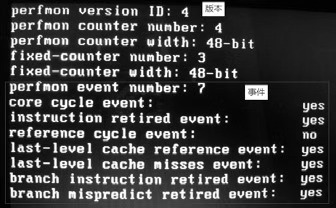

<!-- @import "[TOC]" {cmd="toc" depthFrom=1 depthTo=6 orderedList=false} -->

<!-- code_chunk_output -->

- [性能监控的多个版本](#性能监控的多个版本)
- [确定处理器所支持的功能: 0ah](#确定处理器所支持的功能-0ah)
  - [简单实验](#简单实验)
- [IA32_PMCx寄存器在各版本中的数量: general-purpose counter寄存器](#ia32_pmcx寄存器在各版本中的数量-general-purpose-counter寄存器)
- [IA32_PMCx寄存器的宽度](#ia32_pmcx寄存器的宽度)
  - [IA32_PMCx寄存器full-width值](#ia32_pmcx寄存器full-width值)
- [预定义的event](#预定义的event)

<!-- /code_chunk_output -->

# 性能监控的多个版本

在**architectural化**的**性能监控机制**中，由于后续的处理器得到增强。因此产生了**数个版本**的**performance monitoring机制**。

Intel64手册上介绍了**3个版本**。

① **版本1**：由**Core solo**和**Core duo**处理器开始。

② **版本2**：由基于**Core微架构**的**T7700处理器**开始。

③ **版本3**：似乎是由Atom处理器开始支持。

笔者并不肯定这三个版本是从何时开始引入，可以肯定的是版本一是由Core Sole和Core Duo处理器开始引入的。

# 确定处理器所支持的功能: 0ah

**CPUID指令**的**0AH leaf**可以查询处理器所支持的performance monitoring机制的总体功能，`CPUID.0AH`叶返回包括下面的细节。

```
# cpuid -l 0ah -1 -r
Disclaimer: cpuid may not support decoding of all cpuid registers.
CPU:
   0x00000000 0x00: eax=0x0000000f ebx=0x756e6547 ecx=0x6c65746e edx=0x49656e69
```

① `EAX[7：0]`：处理器所支持performance monitoring的**版本ID**。

② `EAX[15：8]`：**每个logical processor（逻辑处理器！！！**）包含**general\-purpose counter寄存器的数量**，也就是有多少个**IA32\_PMCx寄存器(！！！**)。

③ `EAX[23：16]`：**general\-purpose counter寄存器**的**有效宽度**。

④ `EAX[31：24]`：所支持的**预定义的event的数量！！！**（见后面的15.2.4节描述）。

⑤ `EDX[4：0]`：所支持的**fixed\-function counter寄存器**的**数量**。

⑥ `EDX[12：5]`：**fixed\-function counter寄存器**的**有效宽度**。

⑦ 在**EBX寄存器**中**指示预定义的event是否为效**。

其中`EAX[15：8]`得到`IA32_PMCx`寄存器的数量，也意味着**IA32\_PERFEVTSELx寄存器的数量**，它们是**配套出现**的。CPUID 0AH leaf的具体信息可以查看Intel64手册中关于CPUID指令的介绍。

## 简单实验

>实验15-1：枚举CPUID 0A leaf信息

在继续往下之前，我们先来确定处理器的以上信息，在这个实验里使用CPUID 0A leaf来输出上述的这些信息。

这里不再贴出代码，实验的代码在topic15\ex15-1\protected.asm里，代码里只是简单地调用dump\_CPUID\_leaf\_0a（）函数来打印信息，这个函数实现在lib\cpuid.asm文件里。

下面是在笔者的Westmere微架构Core i5处理器上所得到的信息。



版本ID为4（实际上属于**版本3**），支持4个IA32\_PMC和IA32\_PERFEVTSEL寄存器，分别为**IA32\_PMC0到IA32\_PMC3(！！！**)，IA32\_PERFEVTSEL0到IA32\_PERFEVTSEL3。

每个IA32\_PMC寄存器有效的宽度为48位，还有3个fixed\-function counter寄存器，它们的宽度也是48位的。

下面还打印出所支持的**7个event**数量，其中reference cycle event是不可用的，这些事件是**pre\-defined（预定义**）architectural化的event。

# IA32_PMCx寄存器在各版本中的数量: general-purpose counter寄存器

在Intel64手册的**MSR寄存器表**中列举了architectural化的数个IA32\_PMCx寄存器，它们所需要支持的条件如下。

>支持**编号x**的**PMC寄存器**必须`CPUID.0AH：EAX[7：0]`>x(！！！这是版本ID)。

举例来说，如果需要支持**编号为3的PMC寄存器**（即IA32\_PMC3寄存器），那么`EAX[7：0]`>3。因此我们看到**版本ID为4**，支持4个IA32\_PMC寄存器。

下面是IA32\_PMC寄存器在各版本中的数量。

① 在**Core Solo和Core Duo**处理器的**版本1**中，只有**1个IA32\_PMC寄存器**，即**IA32\_PMC0**。

② 在**T7700**处理器的**版本2**中有**2个**，即**IA32\_PMC0**和**IA32\_PMC1**。

③ 在**Atom处理器**的版本3中也只支持2个，即IA32\_PMC0和IA32\_PMC1。

④ 在**Core i7**处理器版本3中支持4个，即IA32\_PMC0到IA32\_PMC3。

`CPUID.0A：EAX[7：0]`的值决定支持**多少个IA32\_PMCx寄存器(！！！**)，`EAX[7：0]`>3表示**最少可支持4个**，因此实际上`EAX[7：0]`=4时（如上所示）并**不意味**着有版本4的出现，它只是表示**支持4个PMC寄存器**。

因此上面的Core i7处理器的版本3，它所返回的version ID值应该为4（支持4个PMC寄存器）。

# IA32_PMCx寄存器的宽度

在上面的结果里，显示`IA32_PMCx`寄存器的**宽度为48位**，可是这里却并**不意味着一定可以使用48位值**，有以下的情形。

① 当**读IA32\_PMCx寄存器**时（使用**RDMSR指令！！！**），读出来的值是full\-width，这里是48位值。

② 当**写IA32\_PMCx寄存器**时（使用**WRMSR指令！！！**），只能写入低32位值，高32位是符号扩展位。

这个full\-width就是从`CPUID.0AH：EAX[23：16]`里获得的值，在本例里是48位值。

## IA32_PMCx寄存器full-width值

虽然在`CPUID.0AH：EAX[23：16]`获得的值显示IA32\_PMC寄存器支持**48位**的宽度，然而Intel明确指出：

- 当`IA32_PERF_CAPABILITIES[13]`=1时，才可以写入full\-width宽度的值（如本例中的48位宽度）。

IA32\_PERF\_CAPABILITIES寄存器的bit 13位是FW\_WRITE（full\-width write）标志位。

由于IA32\_PREF\_CAPABILITIES寄存器是只读（only\-read）寄存器，因此最终可写入的宽度由这个FW\_WRITE位来决定。

在Sandy Bridge之前的微架构（包括Westmere架构）并不支持full\-width写入（即FW_WRITE位为0值）。

当`IA32_PERF_CAPABILITIES[13]`=1时（以full\-width是48为例）。

① `IA32_PMCx`寄存器的`[47：0]`可以写入48位的值。

② `IA32_PMCx`寄存器的`[63：48]`是0值。

当`IA32_PERF_CAPABILITIES[13]`=0时（以full\-width是48位为例）。

① `IA32_PMCx`寄存器的`[31：0]`可以写入32位值。

② `IA32_PMCx`寄存器的`[47：32]`位是符号扩展位，`[63：48]`位为0值。

当`IA32_PERF_CAPABILITIES[13]`=1时，软件也可以写入IA32\_PMCx寄存器的full\-width值的别名寄存器IA32\_A\_PMCx（地址从4C1H开始），关于IA32\_PERF\_CAPABILITIES寄存器的结构请看14.4.1节。

# 预定义的event

从`CPUID.0AH：EAX[31：24]`获得所支持的**pre\-defined(预定义**)的**architectural（架构化的）event数量**。**每个事件**对应于`EBX[6：0]`域的**每个位**，因此可以从EBX低7位查询到预定义的event对于处理器是否available（可用）。

在上面的运行结果中，可看到在笔者的Westmere微架构Core i5移动处理器**reference cycle event是无效**的。

在**性能监控**中，对**预定义的事件**进行**监控**需要在**相应的IA32\_PERFEVTSELx寄存器(！！！**)里做出设置，例如：需要在**IA32\_PMC1寄存器**中**监控core cycle事件**，那么我们需要在**IA32\_PERFEVTSEL1寄存器**中设置对core cycle事件的监控。


reference cycle事件用来测量bus clock cycle，据Intel64手册说，仅实现在Core 2家族及Core Solo和Core Duo处理器，因此在笔者的处理器上并不支持。

上表中的**umask**和**event select**是在**IA32\_PERFEVTSELx寄存器**中的设置。