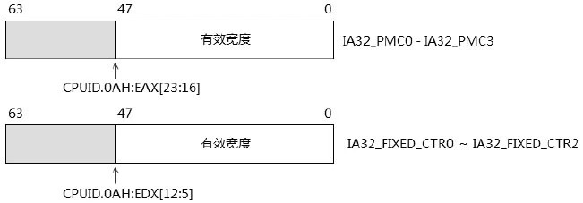
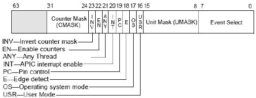
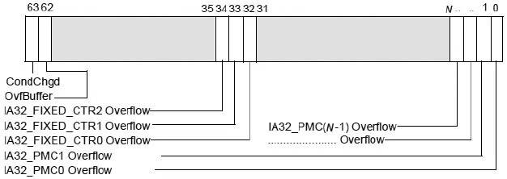
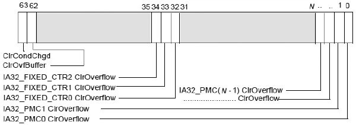
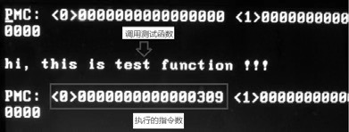
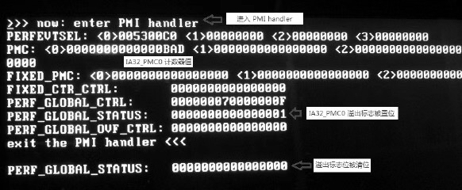
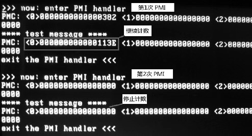

<!-- @import "[TOC]" {cmd="toc" depthFrom=1 depthTo=6 orderedList=false} -->

<!-- code_chunk_output -->

- [1. 概述](#1-概述)
- [2. 相关的物理寄存器](#2-相关的物理寄存器)
- [3. counter（计数器）](#3-counter计数器)
  - [3.1. IA32_PMCx与IA32_FIXED_CTRx寄存器](#31-ia32_pmcx与ia32_fixed_ctrx寄存器)
  - [3.2. 触发PMI: 通用和固定](#32-触发pmi-通用和固定)
  - [3.3. 触发PEBS中断: 通用计数器](#33-触发pebs中断-通用计数器)
- [4. 开启计数器](#4-开启计数器)
  - [4.1. 全局控制器](#41-全局控制器)
  - [4.2. 计数器对应的控制器](#42-计数器对应的控制器)
    - [4.2.1. 通用计数器控制器(其实是事件选择寄存器)](#421-通用计数器控制器其实是事件选择寄存器)
    - [4.2.2. 固定用途计数器控制器](#422-固定用途计数器控制器)
- [5. 全局控制器](#5-全局控制器)
- [6. 通用计数控制器(其实是事件选择寄存器)](#6-通用计数控制器其实是事件选择寄存器)
  - [6.1. Event Select（bit7～bit0）](#61-event-selectbit7~bit0)
  - [6.2. Unit mask（bit15～bit8）](#62-unit-maskbit15~bit8)
  - [6.3. USR（bit16）](#63-usrbit16)
  - [6.4. OS（bit17）](#64-osbit17)
  - [6.5. E（bit18）](#65-ebit18)
  - [6.6. PC（bit19）](#66-pcbit19)
  - [6.7. INT（bit20）](#67-intbit20)
  - [6.8. ANY（bit21）](#68-anybit21)
  - [6.9. EN（bit22）](#69-enbit22)
  - [6.10. INV（bit23）](#610-invbit23)
  - [6.11. Counter mask（bit31～bit24）](#611-counter-maskbit31~bit24)
  - [6.12. 启用通用计数器代码](#612-启用通用计数器代码)
- [7. 固定用途计数控制器](#7-固定用途计数控制器)
  - [7.1. EN域](#71-en域)
  - [7.2. ANY位](#72-any位)
  - [7.3. PMI位](#73-pmi位)
  - [7.4. 启用固定用途计数器代码](#74-启用固定用途计数器代码)
  - [7.5. 同时开启多个计数器](#75-同时开启多个计数器)
- [8. 全局状态寄存器](#8-全局状态寄存器)
  - [8.1. OvfBuffer位（bit62）](#81-ovfbuffer位bit62)
  - [8.2. CondChgd位（bit63）](#82-condchgd位bit63)
  - [8.3. 值得注意](#83-值得注意)
- [9. 全局溢出控制器](#9-全局溢出控制器)
- [10. 使用Performance monitoring的例子](#10-使用performance-monitoring的例子)
  - [10.1. 开启IA32_PMC0计数器](#101-开启ia32_pmc0计数器)
  - [10.2. 收集信息](#102-收集信息)
  - [10.3. 设置PMI handler](#103-设置pmi-handler)
  - [10.4. 编写PMI handler](#104-编写pmi-handler)
  - [10.5. 清counter溢出标志位](#105-清counter溢出标志位)
  - [10.6. 设置counter溢出条件: 计数器写入最大值](#106-设置counter溢出条件-计数器写入最大值)
  - [10.7. 设置的事件](#107-设置的事件)
- [11. 在PMI中冻结计数器](#11-在pmi中冻结计数器)
  - [11.1. IA32_DEUBGCTL寄存器](#111-ia32_deubgctl寄存器)
  - [11.2. 清LVT Performance monitoring寄存器mask](#112-清lvt-performance-monitoring寄存器mask)
  - [11.3. 设置IA32_DEBUGCTL寄存器](#113-设置ia32_debugctl寄存器)

<!-- /code_chunk_output -->

# 1. 概述

在这一节里，我们重点关注在**Nehalem架构**的**性能监控机制**，也适用于**后续的Westmere架构**及**SandyBridge架构**。而在**SandyBridge架构**和**IvyBridge架构**里，performance monitor机制进一步得到增强。

在**Nehalem架构**下，处理器支持**版本3**的**性能监控**，从`CPUID.0AH：EAX[7：0]`返回的**ID值是4**，表明支持**4个PMC寄存器**（即`general-purpose counter`）。

# 2. 相关的物理寄存器

在**版本3**下，支持下面的物理资源（需要从`CPUID 0A leaf`里确认）。

① **4个PMC通用！！！性能监控计数器寄存器**：从`IA32_PMC0`到`IA32_PMC3`。

② 4个**对应的PERFEVTSEL事件选择寄存器**：从`IA32_PERFEVTSEL0`到`IA32_PERFEVTSEL3`。

③ **3个Fixed\-function（固定用途！！！）计数器寄存器**：从`IA32_FIXED_CTR0`到`IA32_FIXED_CTR2`。

还有**4个相应的配置控制寄存器(！！！**)。

① **Fixed\-function计数器的控制器**：IA32\_FIXED\_CTR\_CTRL寄存器。

② 性能监控机制的**全局控制器**：IA32\_PERF\_GLOBAL\_CTRL寄存器。

③ 性能监控机制的**全局状态器**：IA32\_PERF\_GLOBAL\_STATUS寄存器。

④ 性能监控机制的**全局溢出控制器**：IA32\_PERF\_GLOBAL\_OVF\_CTRL寄存器。

在Nehalem架构下**每个PMC（通用性能监控计数器**）已经被扩展为48位（由`CPUID.0AH：EAX[23：16]`查询可得）。

**PMC寄存器**可以用于**architectural化**的**性能监控事件(！！！**)和**非architectural化的性能监控事件(！！！**)，而**Fixed\-function的counter**仅用于**architectural的性能监控事件(！！！**)。

# 3. counter（计数器）

在**版本3**的性能监控机制里支持**两种counter**。

① general\-purpose PMC（Performance Monitoring Counter）：**通用的性能监控计数器**

② Fixed\-function counter：**固定用途的性能监控计数器**。

## 3.1. IA32_PMCx与IA32_FIXED_CTRx寄存器



在Nehalem和Westmere架构中，IA32\_PMC和IA32\_FIXED\_CTR寄存器的宽度都是48位，分别由`CPUID.0AH：EAX[23：16]`和`CPUID.0AH：EDX[12：5]`中查询得到。

## 3.2. 触发PMI: 通用和固定

**48位宽**的**IA32\_PMC！！！**和**IA32\_FIXED\_CTR！！！**寄存器**最大计数值**是**0x0000FFFF\_FFFFFFFF**，当达到它们的**最大计数值**，并且从**最大值回绕到0值**时（即**counter产生溢出**），就会**引发PMI（Performance monitoring interrupt）中断**的产生。

注: 只有到达最大计数值溢出才产生中断.

**通用计数器**和**固定用途计数器**都支持PMI中断。

当**counter溢出**后, **CPU自动(！！！**)通过**Local APIC的LVT寄存器中的LVT Performance Counter寄存器**产生**本地中断(local interrupt**), 该寄存器提供中断相关信息, 包括中断向量等, 再通过中断向量查找IDT, 从而找到代码入口.

所以**软件**需要设置**LVT Performance Counter寄存器**以及**IDT中相应描述符**, **向量号是自己定义**的, 向量号定义不能使用Intel保留的, 给LVT设置时候会产生异常.

## 3.3. 触发PEBS中断: 通用计数器

在Nehalem和Westmere架构下的**4个通用计数器IA32\_PMC0到IA32\_PMC3**可以设置**当计数器溢出**时**触发PEBS中断**，由**IA32\_PEBS\_ENABLE寄存器设置(！！！**)，如下所示。


触发PEBS中断的计数器**只使用在通用计数器(！！！**)上，由**IA32\_PEBS\_ENABLE寄存器**的**bit3到bit0设置**，对应于**相应的IA32\_PMCx寄存器**。

注: 只有到达最大计数值溢出才产生中断.

**固定用途**的IA32\_FIXED\_CTR计数器**不支持PEBS中断**。

当**PEBS\_EN\_PMCx位置位(！！！**)时，IA32\_PMCx溢出时**产生PEBS中断而不是PMI(！！！**)。

# 4. 开启计数器

在**使用这些计数器之前**，需要通过**IA32\_PERF\_GLOBAL\_CTRL寄存器(！！！**)和**各自对应的控制器(！！！**)来设置开启，如下所示。


## 4.1. 全局控制器

**IA32\_PERF\_GLOBAL\_CTRL**寄存器是性能监控机制的**全局总控制器**。

## 4.2. 计数器对应的控制器

### 4.2.1. 通用计数器控制器(其实是事件选择寄存器)

**IA32\_PMC计数器**的开启需**IA32\_PERF\_GLOBAL\_CTRL**配合**IA32\_PERFEVTSELx寄存器(事件选择寄存器！！！**)的**EN位（bit 22**）同时置位。

### 4.2.2. 固定用途计数器控制器

同样，**IA32\_FIXED\_CTRx寄存器**的**开启**需要**IA32\_PERF\_GLOBAL\_CTRL寄存器**配合**IA32\_FIXED\_CTR\_CTRL寄存器的EN位**同时置位。

# 5. 全局控制器

在performance monitor机制里，全局控制器IA32\_PERF\_GLOBAL\_CTRL寄存器起了**总开关的作用**。

它控制着**IA32\_PMCx计数器**与**IA32\_FIXED\_CTRx计数器**的**开启**。

它的结构如下所示。


IA32\_PERF\_GLOBAL_CTRL寄存器中的**每一位都是enable位**。

① 寄存器的bit0到bit （N\-1）位对应于IA32\_PMC0至IA32\_PMC（N\-1）寄存器，这个N值是与架构相关的，需要通过CPUID 0A leaf来查询所支持的PMC寄存器数量。

② **bit 32到bit 34位**对应于**IA32\_FIXED\_CTR0到IA32\_FIXED\_CTR2寄存器**。

在Nehalem和Westmere架构上，这个N值是3（支持0到3号的PMC寄存器）。当这些位为0时，对应于counter（计数器）寄存器是disable（关闭）的。当这些位为1时，counter的开启**还依赖于各自的控制器**。

# 6. 通用计数控制器(其实是事件选择寄存器)

**每个IA32\_PMCx寄存器**都有**对应的一个IA32\_PERFEVTSELx寄存器**，这些寄存器控制着IA32\_PMCx寄存器**如何计数**。它的结构如下。



## 6.1. Event Select（bit7～bit0）

这个8位值设置**需要监控的事件号**，这个事件可以是前面表里所列举的**预定义architectural化事件**或者是**non\-architectural化的事件(与处理器Model有关, 不同处理器model可能会不一致！！！**)。

## 6.2. Unit mask（bit15～bit8）

这个域用来选择在**监控Event下的监控条件**，一个事件下会对应**多个监控条件（或子事件**），每个条件对应一个umask值。**Event select**配合**Umask域**确定**唯一的监控事件编号(！！！**)。

## 6.3. USR（bit16）

设置这个位使得处理器**仅运行在1、2或3级权限**下进行监控。

## 6.4. OS（bit17）

设置这个位使得处理器仅运行在**0级权限**下进行监控。

## 6.5. E（bit18）

当设置这个位时，允许处理器对**监控事件进行计数**基于**edge触发模式（从断开到接通**）。

## 6.6. PC（bit19）

置位时，当被监控的事件发生，处理器增加计数时进行toggle（拴紧）PMi pin的操作。为0时，在事件counter（计数器）发生溢出时进行拴紧PMi pin操作。

## 6.7. INT（bit20）

当**置位**时，发生**counter溢出**时产生**local APIC**的**Performance monitor counter中断(！！！**)。

## 6.8. ANY（bit21）

这个位的设置，允许**发生事件后**共享**一个processor core**的**所有logical processor进行计数**。为0时，仅在**相应的logical processor进行计数**（关于multi\-threading的内容，请参考18.4.2节）。

## 6.9. EN（bit22）

为1时，**开启事件监控的计数器**，为0时关闭计数器。

## 6.10. INV（bit23）

为1时，**使用相反的counter mask条件**。

## 6.11. Counter mask（bit31～bit24）

计数**条件域**，当这个域不为0时（设置一个条件值），当**事件发生的次数大于等于这个条件值**时，counter（计数器）加1，否则不增加。

## 6.12. 启用通用计数器代码

当我们需要开启IA32\_PMC0寄存器时，如下面的代码所示。

```assembly
； 设置 IA32_PERF_GLOBAL_CTRL
       mov ecx，IA32_PERF_GLOBAL_CTRL
       rdmsr
       bts eax，0       ； 开启 IA32_PMC0
       wrmsr
； 设置 IA32_PERFEVTSEL0 寄存器
       mov ecx，IA32_PERFEVTSEL0
       mov eax，5300c0H     ； EN=1，INT=1，USR=OS=1，umask=0，event select=c0
       mov edx，0
       wrmsr
```

代码里分别置**IA32\_PERF\_GLOBAL\_CTRL寄存器的bit 0位**，以及设置**IA32\_PERFEVTSEL0寄存器的EN位**。只有当这两个位**同时为1**时，**IA32\_PMC0计数器**才可以开启。

当然，如果先设置IA32\_PERFEVTSEL0寄存器，然后再设置IA32\_PERF\_GLOBAL\_CTRL寄存器，效果是完全一样的。并且这样做有更大的弹性（这是Intel推荐的步骤）。

这个**Event select值为C0H**，**umask为00H**，这是**指令执行完毕退出的事件**（也就是**监控执行了多少条指令**）。

# 7. 固定用途计数控制器

**3个fixed\-function计数器**IA32\_FIXED\_CTR0到IA32\_FIXED\_CTR2的开启还需要**各自对应的IA32\_FIXED\_CTR\_CTRL寄存器来控制**，如下所示。


在IA32\_FIXED\_CTR\_CTRL寄存器里分为**三个部分**，分别控制0、1及2号Fixedfunction计数器。

① **bit3到bit0**：控制IA32\_FIXED\_CTR0寄存器。

② bit7到bit4：控制IA32\_FIXED\_CTR1寄存器。

③ bit11到bit8：控制IA32\_FIXED\_CTR2寄存器。

## 7.1. EN域

**EN域为0**时，**关闭**Fixed\-function计数器。EN域为**1**时，当**监控事件**发生在**0级**权限时，**counter加1**。EN域为**2**时，当**监控事件**发生在**1、2及3权限**时，counter加1。EN域为**3**时，发生监控事件，counter加1（也就是**CPL被忽略**）。

## 7.2. ANY位

ANY置位时，当**发生符合的监控事件**时，共享**同一个processor core**的**所有logical processor**的**counter加1**。否则**只在一个logical processor**上的counter加1。

## 7.3. PMI位

PMI置位时，当发生**counter溢出**时，产生**PMI（Performance monitor interrupt**），这个中断由**local APIC**的**LVT Performance counter寄存器设置(！！！**)。

## 7.4. 启用固定用途计数器代码

当我们需要开启IA32\_FIXED\_CTR0寄存器时，如下面代码所示。

```assembly
； 设置 IA32_PERF_GLOBAL_CTRL
      mov ecx，IA32_PERF_GLOBAL_CTRL
       rdmsr
       bts edx，0        ； 开启 IA32_FIXED_CTR0
       wrmsr
； 设置 IA32_FIXED_CTR_CTRL寄存器
       mov ecx，IA32_FIXED_CTR_CTRL
       rdmsr
       or eax，0BH        ； EN=1，all level
       wrmsr
```

置IA32\_PERF\_GLOBAL\_CTRL寄存器的bit32位（`edx[0]`），以及IA32\_FIXED\_CTR\_CTRL寄存器的bit4位（IA32\_FIXED\_CTR0的enable位）。

## 7.5. 同时开启多个计数器

利用**IA32\_PERF\_GLOBAL\_CTRL寄存器的总开关**的特色，可以同时**开启多个计数器**，如下代码是**同时开启IA32\_PMC0**与**IA32\_FIXED\_CTR0**的示例。

```assembly
； 设置 IA32_PERFEVTSEL0 寄存器
      mov ecx，IA32_PERFEVTSEL0
      mov eax，5300c0H       ； EN =1
      mov edx，0
      wrmsr
； 设置 IA32_FIXED_CTR_CTRL寄存器
      mov ecx，IA32_FIXED_CTR_CTRL
      rdmsr
      or eax，0BH         ； EN=1，all level
      wrmsr
； 同时开启 IA32_PMC 与 IA32_FIXED_CTR 计数器
      mov ecx IA32_PERF_GLOBAL_CTRL
      rmdmsr
      bts eax，0         ； IA32_PMC0
      bts edx，0         ； IA32_FIXED_CTR0
      Wrmsr          ； 同时开启
```

这样做的前提条件是IA32\_PERF\_GLOBAL\_CTR寄存器在初始化时全被清0（关闭所有计数器）。否则在每个计数器控制器设置时已经开启计数了。

# 8. 全局状态寄存器

IA32\_PERF\_GLOBAL\_STATUS寄存器能反映**所有counter的状态（是否溢出**），如下所示。



IA32\_PERF\_GLOBAL\_STATUS寄存器的**每一位为1**时，指示对应的counter产生了溢出。这个寄存器还有两个额外的位。

## 8.1. OvfBuffer位（bit62）

当**开启PEBS（Precise Event Based Sampling**）机制时，由**counter溢出**而**触发PEBS中断**，处理器在**DS区域**的**PEBS buffer**写入**PEBS记录**。DS区域的PEBS buffer溢出时OvfBuffer标志位将会被置位（关于PEBS buffer另参考14.9节BTS机制的相关描述）。

例如：在IA32\_PEBS\_ENABLE[0]=1时，IA32\_PMC0发生溢出则会产生PEBS中断，如果PEBS buffer产生溢出会使OvfBuffer位被置位，而IA32\_PMC0 Overflow位则被清位。

## 8.2. CondChgd位（bit63）

这个位为1时，指示性能监控的状态已经被改变。

由于counter的溢出会产生PMI（Performance monitoring interrupt）或者PEBS中断（在开启的时候），PMI和PEBS中断使用同一个vector，因此在handler里需要判断是为PMI服务还是为PEBS服务。

根据IA32\_PERF\_GLOBAL\_STATUS的溢出标志位进行判断。

① 当IA32\_PMC或IA32\_FIXED\_CTR的Overflow标志置位，则产生PMI。

② 当OvfBuffer标志置位，则表示由于PEBS buffer溢出而产生DS中断。

## 8.3. 值得注意

IA32\_PERF\_GLOBAL\_STATUS是只读寄存器，处理器从不会清这些标志位，溢出标志的清位是软件的职责。

# 9. 全局溢出控制器

当发生**counter溢出**进入**PMI**后，软件可以使用**IA32\_PERF\_GLOBAL\_OVF\_CTRL（全局溢出控制器**）寄存器来**清理这些溢出标志**。



`IA32_PERF_GLOBAL_OVF_CTRL`寄存器的每一位对应于`IA32_PERF_GLOBAL_STATUS`寄存器的一个Overflow位。当向`IA32_PERF_GLOBAL_OVF_CTRL`寄存器的某位写入1时，处理器将清`IA32_PERF_GLOBAL_STATUS`寄存器的对应溢出位。

```assembly
mov ecx，IA32_PERF_GLOBAL_OVF_CTRL
rdmsr
bts eax，0     ； 置1，清 IA32_PMC0 溢出标志位
wrmsr
```

在上面这段代码里，向IA32\_PERF\_GLOBAL\_OVF\_CTRL寄存器的bit 0位写入1值，那么处理器将清对应的IA32\_PMC0溢出标志。

在Intel64手册里，推荐在下面的情况下**清溢出标志**。

① 选择**新的监控事件**。

② 重新设置counter值继续监控或抽样（PEBS）。

③ 关闭counter，停止监控或抽样（PEBS）。

# 10. 使用Performance monitoring的例子

我们已经对Intel的性能监控机制有了初步的认识，这里我们将有**两个实验**。

① 使用**counter**来统计函数**执行了多少条指令**。

② 测试**counter溢出**时调用**PMI（Performance monitoring interrupt）handler**。

我们使用这两个实验测试来了解性能监控是如何运作的。

>实验15\-2：测试IA32\_PMC0计数器

在这个实验里，我们使用IA32\_PMC0计数器统计一个函数执行了多少条指令，这个测试函数如下。

代码清单15-1（topic15\ex15-2\protected.asm）：

```assembly
；； 测试函数：
Foo：
      mov esi，msg
      call puts   ； 打印一条信息
      ret
```

这个测试函数只是用来简单地打印一条信息。

## 10.1. 开启IA32_PMC0计数器

我们需要对**IA32\_PERF\_GLOBAL\_CTRL**寄存器和**IA32\_PERFEVTSEL0**寄存器进行设置。

代码清单15-2（topic15\ex15-2\protected.asm）：

```assembly
; 设置 IA32_PERF_GLOBAL_CTRL寄存器
      mov ecx，IA32_PERF_GLOBAL_CTRL
      rdmsr
      bts eax，0     ; PMC0 enable, 开启PMC0
      wrmsr
      call dump_pmc    ; 打印 PMC 计数器
; 设置 IA32_PERFEVTSEL0 寄存器
      mov ecx，IA32_PERFEVTSEL0
      mov eax，5300c0H   ; EN=1，INT=1，USR=OS=1，umask=0，event select=c0H
      mov edx，0
      wrmsr
```

在**IA32\_PERFEVTSEL0寄存器**里设置的**监控事件是Event select为C0H（指令退出事件**）和**umask值为0**，**USR**和**OS标志**都为**1（监控所有的权限级别**），最重要的是**Enable位为1**。

当对IA32\_PERFEVTSEL0寄存器**执行完WRMSR指令**后，事件监控将**立即生效**。

## 10.2. 收集信息

接下来，我们就调用测试的函数。

代码清单15\-3（topic15\ex15\-2\protected.asm）：

```assembly
call foo      ； 调用测试函数
mov ecx，IA32_PERFEVTSEL0
rdmsr
btr eax，22     ； 关闭 counter
wrmsr
call dump_pmc     ； 打印 PMC 计数器
```

调用完测试函数后，将**IA32\_PMC0计数器关闭**，再**输出PMC计数器的值**。

下面是在笔者的Westmere架构Core i5处理器上的运行结果。



结果显示，**PMC0的值为0x309**，这个值就是**执行的指令数**，包括了代码清单15-3中的**关闭counter计数器的4条指令**，因此**foo（）函数正确的执行指令数应该是0x305（即773条指令**）。

我们可以使用**Bochs的调试功能**来**验证是否正确**，下面是Bochs里的调试输出。

```
（0） [0x000000000000910f] 0018：000000000000910f （unk. ctxt）：
wrmsr                     ； 0f30
<Bochs：27>
Next at t=156693000
（0） [0x0000000000009111] 0018：0000000000009111 （unk. ctxt）：call .+50
（0x00009148）    ； e832000000
<Bochs：28>
Next at t=156693773
（0） [0x0000000000009116] 0018：0000000000009116 （unk. ctxt）：mov ecx，
0x00000186       ； b986010000
<Bochs：29> ？156693773-156693000
0x305 773
<Bochs：30>
```

我们看到在Bochs里显示，执行完WRMSR指令后，指令数是156693000。当执行完foo（）函数后，指令数是156693773。它们的差刚好是0x305条。

没错！这个counter的值是正确的，同时我们也注意到，对于这个监控事件来说，在**开启和关闭之间**的**任何指令都被统计**了（我们将在后面进行更详细的事件探讨）。

>实验15-3：测试counter溢出时的PMI

下面，我们来进行另一个实验测试，我们需要人为地使counter产生溢出，从而调用PMI handler。

## 10.3. 设置PMI handler

我们需要对PMI的中断服务例程进行设置，如下。

代码清单15-4（topic15\ex15-3\protected.asm）：

```assembly
； 设置 APIC PMI handler
    ;这里定义的APIC_PERFMON_VECTOR是0x33, 在文件inc\protected.inc
    mov esi，APIC_PERFMON_VECTOR
    mov edi，perfmon_handler
    call set_interrupt_handler    ;设置中断服务例程的 vector
```

**与一般的中断服务例程设置是相同**的，使用**set\_interrupt\_handler()函数**在**IDT**里设置**相应的interrupt描述符！！！**（这个set\_interrupt\_handler()函数实现在**lib\lib32.asm库代码**里）。

## 10.4. 编写PMI handler

当然，我们需要编写对应的中断服务例程，下面是这个实验里使用的PMI handler代码。

代码清单15-5（topic15\ex15-3\protected.asm）：

```assembly
；-------------------------------
； perfmon handler
；------------------------------
perfmon_handler：
      jmp do_perfmon_handler
pfh_msg1 db '>>> now：enter PMI handler'，10，0
pfh_msg2 db 'exit the PMI handler <<<'，10，0
do_perfmon_handler：
      STORE_CONTEXT                                ； 保存 context
      mov esi，pfh_msg1
      call puts
      call dump_perfmon       ； 打印 perfmon 所有寄存器
      RESET_COUNTER_OVERFLOW      ； 清 overflow 标志位
      mov esi，pfh_msg2
      call puts
do_perfmon_handler_done：
      RESTORE_CONTEXT                               ； 恢复 context
      btr DWORD [APIC_BASE + LVT_PERFMON]，16  ； 清 mask 位
      mov DWORD [APIC_BASE + EOI]，0            ； 发送 EOI 命令
      iret
```

作为示例，这个PMI handler主要做下面几个工作。

① 打印信息：为了便于观察打印了一些辅助信息，也包括性能监控的寄存器。

② 清IA32\_PMC0溢出标志位：通过宏RESET\_COUNTER\_OVERFLOW来实现清溢出标志。

③ 在退出前清LVT performance monitor寄存器的mask位，允许下次PMI handler调用。

④ 发送**EOI命令**：通过**写local APIC的EOI寄存器**。

dump\_perfmon（）函数实现在lib\perfmon.asm文件里。关于local APIC的知识，请参考第18章。

## 10.5. 清counter溢出标志位

当发生counter溢出产生PMI时，在PMI handler里一项重要的工作是需要清计数器相对应的溢出标志位，在实验15\-3中的PMI handler使用宏RESET\_COUNTER\_OVERFLOW来清位。

代码清单15-6（inc\perfmon.inc）：

```assembly
；--------------------------------------------------------------
； 宏 RESET_COUNTER_OVERFLOW（）
； 描述：
；       清 IA32_PERF_GLOBAL_STATUS 寄存器所有 overflow 标志位
；-------------------------------------------------------------
%macro RESET_COUNTER_OVERFLOW 0
      mov ecx，IA32_PERF_GLOBAL_OVF_CTRL
      mov eax，0Fh      ； IA32_PMCx overflow
      mov edx，03h      ； IA32_FIXED_CTRx overflow
      wrmsr
%endmacro
```

这个宏定义在inc\perfmon.inc头文件里，将清IA32\_PERF\_GLOBAL\_STATUS寄存器的所有溢出标志位，通过向IA32\_PERF\_GLOBAL\_OVF\_CTRL寄存器的相应位写入1值来达到。

## 10.6. 设置counter溢出条件: 计数器写入最大值

在实验设置里，我们可以通过对**IA32\_PMC0计数器**写入**最大值**来达到****快速触发PMI****的目的，这个写入最大值通过调用write\_counter\_maximum（）函数来实现。

代码清单15-7（lib\perfmon.asm）：

```assembly
；----------------------------------------------
； write_counter_maximum（）：写入 counter 的最大值
； input：
；       esi-counter
；-----------------------------------------------
write_counter_maximum：
      call support_full_write         ； 是否支持写入最大值
      mov edi，0FFFFh
      mov edx，0
      test eax，eax
      cmovnz edx，edi
      mov eax，0FFFFFFFFh
      mov ecx，esi
      wrmsr
      ret
```

在Nehalem和Westmere架构上，我们使用CPUID.0AH：EAX[23：16]得到的PMC宽度为48位，因此counter可接受的最大值是0x0000FFFF\_FFFFFFFF（这个48位的最大值）。

然而，在不支持full\-write的情况下，我们没办法直接写入48位值。因此，这个函数先检测处理器是否支持full\-write功能，在不支持时只能写入32位值（最大值为0FFFFFFFFh）。

当然，我们可以在代码里直接写入32位值，代码如下所示。

```assembly
mov eax，0FFFFFFFFh    ； 32 位最大值
mov edx，0
mov ecx，IA32_PMC0
wrmsr
```

实际上IA32\_PMC0[47：32]是bit31位的符号扩展位，因此写入0FFFFFFFFh（32位值），结果同样是得到48位的最大值0000FFFF\_FFFFFFFFh。

当**写入这个最大值**后，后续的**任何一条指令执行完毕后都会产生counter的溢出**（当然需要在开启counter后）。

## 10.7. 设置的事件

在这个实验里，我们还是使用和实验15\-2相同的监控事件，同样使用IA32\_PMC0计数器。

下面是在Westmere架构Core i5处理器上得到的运行结果。



结果的输出信息来源于PMI handler里调用dump\_perfmon（）函数打印信息，在PMI handler退出后，打印IA32\_PERF\_GLOBAL\_STATUS寄存器的值。

我们看到（留意图中的几个标注）：

① 由于counter溢出，进入了PMI handler，这个counter重新回到0值开始计数。所显示的IA32\_PMC0的值是打印信息当前的计数值（除非使用PMI冻结计数功能）。

② 在IA32\_PERF\_GLOBAL\_STATUS寄存器里显示bit 0被置位，指示IA32\_PMC0产生了溢出。

③ 由于我们在PMI handler里对溢出标志进行了清位工作（见代码清单15-5），因此在退出打印时，IA32\_PERF\_GLOBAL\_STATUS寄存器已经被清位。现在，通过上面两个实验，我们基本了解了性能监控中的运作情况。

# 11. 在PMI中冻结计数器

在**正常情况**下，当**counter产生溢出**，在**开启PMI enable位**时处理器转去执行PMI中断handler，那么在**PMI handler里(！！！执行PMI handler过程中也是一直在计数！！！**)，counter会继续**不断地计数**，除非关闭counter。

Intel提供了一个在**PMI handler里冻结counter（即停止继续计数）的机制**，这个机制允许处理器在**进入PMI handler后**，**自动将IA32\_PERF\_GLOBAL\_CTRL寄存器值清0(！！！**)，关闭所有的IA32\_PMC和IA32\_FIXED\_CTR计数器。它的逻辑如下面代码所示。

```c
pmi_handler（）  /* 进入 PMI handler */
{
  if （IA32_DEBUGCTL[12] == 1）  /* FREEZE_PERFMON_ON_PMI 位为 1 */
  {
      IA32_PERF_GLOBAL_CTRL=0；  /* 处理器清所有的 counter enable 位*/
  }
  ... ...
  /* PMI执行完毕，软件设置IA32_PERF_GLOBAL_CTRL重新开启 counter */
}
```

当处理器检测到**IA32\_DEUBGCTL寄存器的bit 12置位**时，将清IA32\_PERF\_GLOBAL\_CTRL为0值（包括通用和固定用途的counter全部关闭）。

## 11.1. IA32_DEUBGCTL寄存器

在**IA32\_DEBUGCTL**寄存器提供了一个**控制位实现PMI handler冻结计数**，如下所示。


在上图中，我们看到IA32\_DEBUGCTL寄存器的bit 12是FREEZE\_PERFMON\_ON\_PMI，这个位的设置将开启在PMI中冻结counter计数的机制。

当PMI handler执行完毕退出后，处理器不会自动恢复计数功能。如果继续使用counter，那么软件必须重新设置IA32\_PERF\_GLOBAL\_CTRL寄存器相应位开启counter进行计数。

>实验15\-4：测试在PMI中冻结counter机制

这个实验接着前面的实验15\-3来进行，使用同样的监控事件和溢出条件。在这个实验里，我们将让代码产生两次PMI：第1次PMI没有使用冻结counter机制，而第2次PMI使用了冻结counter机制。通过对比，我们可以清楚地了解冻结counter机制。

代码清单15-8（topic15\ex15-4\protected.asm）：

```assembly
；-------------------------------
； perfmon handler
；------------------------------
perfmon_handler：
      jmp do_perfmon_handler
pfh_msg1 db '>>> now：enter PMI handler'，10，0
pfh_msg2 db 'exit the PMI handler <<<'，10，0
pfh_msg3 db '**** test message ****'，10，0
do_perfmon_handler：
      STORE_CONTEXT                                   ； 保存 context
      mov esi，pfh_msg1
      call puts
      ；* 第 1 次打印 PMC 值
      call dump_pmc
      ；* 执行一些指令，用于收集 PMC 计数
      mov esi，pfh_msg3
      call puts
      ；* 再次打印 PMC 值
      call dump_pmc
      RESET_COUNTER_OVERFLOW                          ； 清出标志
      mov esi，pfh_msg2
      call puts
do_perfmon_handler_done：
      RESTORE_CONTEXT                                   ； 恢复 context
      btr DWORD [APIC_BASE + LVT_PERFMON]，16      ； 清 mask 位
      mov DWORD [APIC_BASE + EOI]，0                 ； 发送 EOI 命令
      iret
```

为了更好地观察，在这个PMI handler里将做一些修改，分别打印两次PMC寄存器的值，中间还调用函数进行测试。

## 11.2. 清LVT Performance monitoring寄存器mask

当**产生PMI**时，处理器会**自动将 LVT Perfmon寄存器的mask置位**，从而**屏蔽PMI**产生。因此在**第1次PMI执行完**毕后，我们可以在**PMI handler退出前清LVT perfmon寄存器的mask位**，重新开启允许PMI handler被调用。

```assembly
btr DWORD [APIC_BASE + LVT_PERFMON]，16  ； 清 LVT perfmon寄存器mask位
```

local APIC的LVT perfmon寄存器bit 16位是mask位，通过清0，取消PMI handler的屏蔽。

## 11.3. 设置IA32_DEBUGCTL寄存器

接着，将IA32\_DEBUGCTL寄存器的bit 12位置位，开启PMI冻结counter机制。

代码清单15-9（topic15\ex15-4\protected.asm）：

```assembly
； 设置 FREEZE_PERFMON_ON_PMI 位
      mov ecx，IA32_DEBUGCTL
      rdmsr
      bts eax，12     ； FREEZE_PERFMON_ON_PMI=1
      wrmsr
```

在这个实验里产生了两次PMI，这两次PMI产生如下所示。


在第1次PMI执行完毕后，重新将IA32\_PMC0值设为最大值，又引发第2次PMI的产生。下图是在Core i5机器上运行的结果。



从这个结果可以清楚看到，在第1次未启用冻结counter机制时，在PMI handler里继续计数。而在第2次启用冻结counter机制后，在PMI handler里IA32\_PMC0的值为0（**没有进行计数**）。