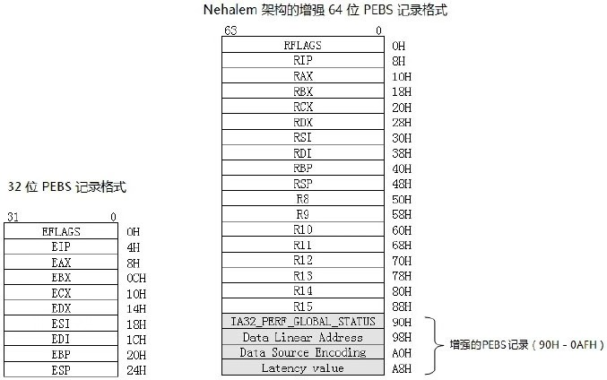
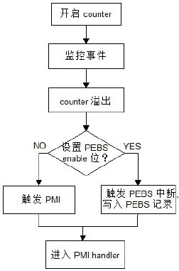
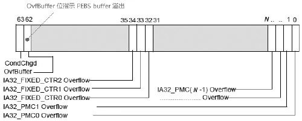
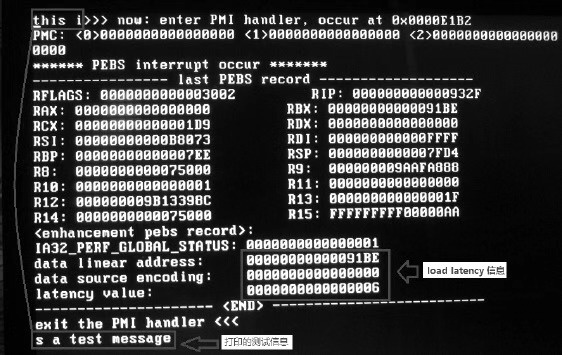

<!-- @import "[TOC]" {cmd="toc" depthFrom=1 depthTo=6 orderedList=false} -->

<!-- code_chunk_output -->

- [概述](#概述)
  - [检测PEBS机制是否可用](#检测pebs机制是否可用)
- [PEBS buffer](#pebs-buffer)
  - [64位的PEBS记录格式](#64位的pebs记录格式)
  - [增强的PEBS记录格式](#增强的pebs记录格式)
  - [IA32_PERF_CAPABILITIES寄存器](#ia32_perf_capabilities寄存器)
  - [PEBS buffer区域](#pebs-buffer区域)
  - [PEBS buffer的maximum与threshold值](#pebs-buffer的maximum与threshold值)
  - [PEBS reset counter值](#pebs-reset-counter值)
- [PEBS中断](#pebs中断)
  - [2.1 开启PEBS计数器](#21-开启pebs计数器)
  - [2.3 PEBS中断的overflow标志位](#23-pebs中断的overflow标志位)
  - [2.4 PEBS中断的抑制](#24-pebs中断的抑制)
  - [2.5 PEBS buffer的溢出](#25-pebs-buffer的溢出)
- [3 PEBS事件](#3-pebs事件)
- [4 PEBS的触发](#4-pebs的触发)
- [5 PEBS记录的报告](#5-pebs记录的报告)
  - [5.1 值得注意](#51-值得注意)
  - [5.2 64位的PEBS记录](#52-64位的pebs记录)
- [6 PEBS buffer满时中断](#6-pebs-buffer满时中断)
  - [6.1 检测中断触发条件](#61-检测中断触发条件)
    - [6.1.1 检测PEBS中断发生](#611-检测pebs中断发生)
    - [6.1.2 检测PEBS buffer满时中断发生](#612-检测pebs-buffer满时中断发生)
  - [6.2 PEBS buffer满时中断优先级](#62-pebs-buffer满时中断优先级)
- [7 多个PMI触发](#7-多个pmi触发)
  - [7.1 counter的优先级](#71-counter的优先级)
  - [7.2 PMI与PEBS中断](#72-pmi与pebs中断)
    - [7.2.1 perfmon中断handler的处理](#721-perfmon中断handler的处理)
  - [7.3 PEBS中断，PEBS buffer与BTS buffer溢出中断](#73-pebs中断pebs-buffer与bts-buffer溢出中断)
    - [7.3.1 检测触发条件的if（）-else if（）逻辑](#731-检测触发条件的if-else-if逻辑)
    - [7.3.2 推荐所有中断触发条件都检测处理](#732-推荐所有中断触发条件都检测处理)
- [8 Load latency监控机制](#8-load-latency监控机制)
  - [8.1 Load latency监控事件](#81-load-latency监控事件)
  - [8.2 Threshold值](#82-threshold值)
  - [8.3 开启load latency监控许可](#83-开启load-latency监控许可)
  - [8.4 Load latency的data source信息](#84-load-latency的data-source信息)

<!-- /code_chunk_output -->

# 概述

PEBS直译为**基于抽样的精确事件**。

开启PEBS机制允许**当发生PEBS中断时**在**内存DS存储区域**的**PEBS buffer**里**保存处理器的context环境**。

## 检测PEBS机制是否可用

由于**PEBS机制**是建立在DS（Debug Store）存储区域之上的.

1. **先检测处理器是否支持DS机制**, CPUID
2. 再检测**PEBS是否可用**时, RDMSR

在`lib\debug.asm`文件里实现了一个检测函数`available_pebs()`，如下。

代码清单15-10（lib\debug.asm）：

```assembly
；---------------------------------
； available_pebs（）：是否支持 PEBS 机制
； output：
；  1-available，0-unavailable
；--------------------------------------
available_pebs：
      mov eax，1
      cpuid
      bt edx，21     ； Debug Store支持位
      setc al
      jnc available_pebs_done
      mov ecx，IA32_MISC_ENABLE
      rdmsr
      bt eax，12     ； PEBS unavailable 位
      setnc al
available_pebs_done：
      movzx eax，al
      ret
```

代码先通过`CPUID.01：EDX[21]`位来检测**是否支持DS（Debug Store**）功能，**IA32\_MISC\_ENABLE寄存器**的**bit 12位是PEBS unavailable位**，置位时表示unavailable（不可用的），为0时表示available（可用的）。

# PEBS buffer

**PEBS buffer**与**BTS buffer**共同组成`DS（Debug Store）`存储区域里的**buffer记录**区，因此与BTS buffer一样，在设置PEBS buffer结构前需要检测PEBS记录的格式。

## 64位的PEBS记录格式

当软件检测到**CPUID.01：ECX[2].DTES64位为1**时，表示固定使用64位的PEBS记录格式，而无论是否开启64位模式。

代码清单15-11（lib\debug.asm）：

```assembly
；------------------------------------
； support_ds64：查询是否支持 DS save 64 位格式
； output：
；  1-support，0-no support
；-----------------------------------
support_ds64：
      mov eax，1
      cpuid
      bt ecx，2    ； DEST64 位
      setc al
      movzx eax，al
      ret
```

这个函数在14.9.2节我们已经见过。当支持DS64格式时，BTS记录与PEBS记录都使用64位格式。

## 增强的PEBS记录格式

从Nehalem架构开始，处理器支持增强的PEBS记录格式，因此我们可以认为这个是增强的64位记录格式，因为它已经支持DS64格式了。



上图已经归纳了三种PEBS记录格式：32位与64位的PEBS记录格式，以及增强的64位PEBS记录格式。增强的PEBS记录格式里额外增加了4个域。


这些域在普通的PEBS记录格式里是保留位。偏移量90H的IA32_PERF_GLOBAL_STATUS寄存器值是发生PMI前的值，其余3个值使用在增强功能里。

## IA32_PERF_CAPABILITIES寄存器

PEBS机制的一些**额外功能**可以从**IA32\_PERF\_CAPABILITIES寄存器**里获得，这个寄存器需要通过`CPUID.01：ECX[15].PDCM`位来获得支持，代码如下。

```assembly
      mov eax，1
      cupid
      bt ecx，15    ； PDCM 位
      jnc no_support
      …      ； 支持
no_support：
      … …      ； 不支持
```

**IA32\_PERF\_CAPABILITIES寄存器**中一些**标志位**指示了**LBR与PEBS的格式**，这个寄存器的结构如下所示。


IA32\_PERF\_CAPABILITES寄存器是**只读寄存器**，这表示寄存器读出来的值就固定了PEBS的某些功能不能更改。

这个寄存器的FW\_WRITE（bit13）位指示了IA32\_PMCx与IA32\_FIXED\_CTRx计数器是否可写入全部宽度，详情请参考前面的15.2.3节所述。在SandyBridge架构之前处理器不允许写入全部full\-width（例如：48位值）。

LBR_FMT域（bit5到bit0）指示了LBR stack中LBR记录的格式。详情请参考14.4节的相关描述。

**PEBS\_REC\_FMT（bit11到bit8**）指示了**PEBS记录的额外格式**，目前该域只有两个值供选择。

① 0000B：使用普通的格式，保存EFLAGS寄存器，EIP/RIP寄存器，以及8个通用寄存器或者16个通用寄存器（64位模式下）。

② 0001B：使用增强的PEBS记录格式，在原PEBS记录格式的基础上增加额外的4个域。

软件通过检测IA32\_PEF\_CAPABILITIES寄存器的PEBS\_REC\_FMT域来确定是否支持增强PEBS记录格式，如下面代码所示。

代码清单15-12（lib\debug.asm）：

```assembly
；------------------------------------------------------------
； support_enhancement_pebs（）：检测是否支持增强的 PEBS 记录
； output：
； 1-support，0-no support
；-----------------------------------------------------------
support_enhancement_pebs：
      mov ecx，IA32_PERF_CAPABILITIES
      rdmsr
      shr eax，8
      and eax，0Fh    ； 得到 IA32_PREF_CAPABILITIES[11：8]
      cmp eax，0001B    ； 测试是否支持增强的 PEBS 格式
      sete al
      movzx eax，al
      ret
```

确定PEBS记录格式是非常重要的，这将影响到PEBS buffer设置是否正确。否则会引起意想不到的错误。

## PEBS buffer区域

在DS的管理区里设置PEBS buffer区域的位置与大小，如下所示。


上图是64位的PEBS buffer格式，PEBS管理区紧接着BTS管理区，使用PEBS机制前，软件需要设置下面的域。


## PEBS buffer的maximum与threshold值

不像**BTS buffer**区域可以使用**环形回路**的工作方式，PEBS buffer的工作相对简单些：当**PEBS index**达到**threshold值**时就会引发**DS（Debug Store）中断**的产生，从而调用local APIC的perfmon中断handler。

因此，PEBS threshold的值应该设为等于PEBS maximum值。

## PEBS reset counter值

PEBS管理区包括**4个counter重置值**，当**由于counter溢出而产生PEBS中断**时，处理器将从这些域里**读取相应的值**，写入对应的**IA32\_PMCx寄存器**里。

**PEBS机制**只允许使用在**4个通用计数器(！！！**)上：`IA32_PMC0`到`IA32_PMC3`。即使处理器支持更多的通用计数器，也只能使用这4个计数器。`IA32_FIXED_CTRx`计数器不支持PEBS机制。

例如：当`IA32_PMC3`寄存器的**溢出**被作为**PEBS中断触发条件**时，发生PEBS中断后，**reset counter3值**将被读取写入到`IA32_PMC3`寄存器。

关于DS区域结构及DS区域设置更详细的描述，请参考14.9节所述。

# PEBS中断

当IA32\_PMCx寄存器被开启支持使用PEBS机制时，**IA32\_PMCx寄存器溢出**时将产生**PEBS中断**而**不是counter溢出中断**，即**PMI**（performance monitor interrupt），如下所示。



**IA32\_PEBS\_ENABLE寄存器**将**开启PEBS机制**，它的结构如15.3.2节所示，**允许设置4个IA32\_PMCx寄存器**作为监控PEBS事件的计数器。

触发**PMI和PEBS中断(！！！**)最后都使用**local APIC LVT performance monitor寄存器(！！！**)所**设置的vector指向的中断处理程序(！！！**)。

当触发PEBS中断时，处理器将在PEBS buffer里写入一条PEBS记录，这个PEBS记录按前面所述检测的PEBS格式进行写入。

## 2.1 开启PEBS计数器

在inc\perfmon.inc文件里，实现了4个宏，分别对应开启IA32\_PMC0到IA32\_PMC3寄存器的PEBS中断许可。

代码清单15-13（inc\perfmon.inc）：

```assembly
；-----------------------------------------------------
； 宏 ENABLE_PEBS_COUNTER：开启 counter PEBS 中断许可
； input：
；       %1 - 参数1：需要开启的 IA32_PMCx 计数器
；       %2 - 参数2：需要开启的 load latency 计数器许可
； 示例：
；       ENABLE_PEBS_COUNTER （PEBS_PMC0_EN），0
；-------------------------------------------------------
%macro ENABLE_PEBS_COUNTER 2
      mov ecx，IA32_PEBS_ENABLE
      rdmsr
      or eax，%1                      ； PEBS_PMCx_EN
      or edx，%2                      ； LL_PMCx_EN
      wrmsr
%endmacro
%macro ENABLE_PEBS_PMC0 0
      ENABLE_PEBS_COUNTER （PEBS_PMC0_EN），0
%endmacro
%macro ENABLE_PEBS_PMC1 0
      ENABLE_PEBS_COUNTER （PEBS_PMC1_EN），0
%endmacro
%macro ENABLE_PEBS_PMC2 0
      ENABLE_PEBS_COUNTER （PEBS_PMC2_EN），0
%endmacro
%macro ENABLE_PEBS_PMC3 0
      ENABLE_PEBS_COUNTER （PEBS_PMC3_EN），0
%endmacro
```

宏ENABLE\_PEBS\_COUNTER是一个功能设置开关，而4个计数器开启宏ENABLE\_PEBS\_PMC0到ENABLE\_PEBS\_PMC3将调用ENABLE\_PEBS\_COUNTER来进行设置。

## 2.3 PEBS中断的overflow标志位

当由于**counter溢出产生PMI**时，**IA32\_PERF\_GLOBAL\_STATUS寄存器**的**overflow标志位**将**记录着发生溢出的计数器**。然而，**触发PEBS中断时**，这些**overflow标志位将被清位**。

当PEBS中断被抑制时（PEBS中断未触发），IA32\_PERF\_GLOBAL_STATUS寄存器相应的overflow标志位将置位，指示counter产生溢出。

PEBS设备就绪（counter溢出）后检查到第1条PEBS事件的到来（counter从0递增到1值），这时候应该会触发PEBS中断，由于某些原因PEBS中断被抑制并没有触发。那么counter的overflow标志位仍然会被记录。


如上所示，在增强型的PEBS记录（见前面所述）里，位于PEBS记录的90H位置上的IA32\_PERF\_GLOBAL\_STATUS映像值记录着触发PEBS中断时由哪个IA32_PMC计数器产生溢出。软件可以利用这个值判断由哪个counter溢出而触发PEBS中断。

因此，在触发PEBS中断前，IA32_PERF_GLOBAL_STATUS寄存器是指示着哪个counter溢出的。在PEBS中断被触发的那一刻，处理器将overflow位进行清位。

## 2.4 PEBS中断的抑制

在PEBS中断触发条件满足时，可能会因为某些原因被抑制未能触发。典型地有下面的原因。

① 由于local APIC的PMI（perfmonance monitoring interrupt）被屏蔽，或者eflags的IF标志位为0（可屏蔽中断被屏蔽）。

② 当同时产生多个PMI时，处理器由于优先级别的原因而没有响应PEBS中断。

在第1种情形里，当进入PMI handler时，由于PMI handler使用Interrupt-gate（中断门）来进行调用处理程序。在PMI handler里IF标志会被清位，如果此时在PMI handler里达到了PEBS中断触发的条件。那么这个PEBS中断会被抑制。

在第2种情形里，如果PEBS中断使用的counter优先级别低于其他监控事件的counter，处理器会响应优先级别高的counter的监控事件，而这个PEBS中断也会被抑制。

## 2.5 PEBS buffer的溢出

当产生多次PEBS中断，以至于PEBS buffer写满而产生PEBS buffer溢出时，在这种情况下将触发另一个DS（Debug Store）中断。IA32_PERF_GLOBAL_STATUS寄存器的OvfBuffer标志位被置位，指示PEBS buffer溢出（如下所示）。



如同BTS buffer溢出一样，当发生PEBS buffer溢出时，local APIC perfmon中断handler通过判断发生PEBS buffer溢出，并需要重置PEBS index值，允许下一条PEBS记录被重新写入。

# 3 PEBS事件

在处理器所支持的performance monitor事件里，并**不是所有监控事件**都支持产生**PEBS中断**，并且这些事件都是属于**non\-architectural（非架构化）的PEBS事件**，在**其他架构上可能会有不同(！！！**)。

而Core微架构上是相同的，下表是在Nehalem与Westmere架构上支持PEBS的监控事件。


在SandyBridge及后续架构上将支持更多的PEBS事件，并且这些事件的Event Select码和UMask码可能会不同，我们以前所做的实验都是对INSTR\_RETIRED.ANY\_P事件进行监控。

在inc\perfmon.inc头文件里定义了这些PEBS事件，如下。

代码清单15-14（inc\perfmon.inc）：

```
；*
；* 定义 Westmere 架构上的 PEBS 事件
；*
%define PEBS_INST_COUNT_EVENT                     5300C0h
%define PEBS_X87_OPS_COUNT_EVENT                  53FEC1h
%define PEBS_BR_MISS_COUNT_EVENT                  5300C5h
%define PEBS_SIMD_INST_COUNT_EVENT                531FC7h
%define PEBS_MEM_LOAD_L1D_MISS_EVENT             5301CBh
%define EPBS_MEM_LOAD_L1D_LINE_MISS_EVENT       5302CBh
%define PEBS_MEM_LOAD_L2_MISS_EVENT              5304CBh
%define PEBS_MEM_LOAD_L2_LINE_MISS_EVENT        5308CBh
%define PEBS_MEM_LOAD_DTLB_MISS_EVENT            5310CBh
```

这些常量值对应上表中所列出的**PEBS事件**，使用这些常量值来设置监控事件，如下所示。

```
mov ecx，IA32_PERFEVTSEL0     ； IA32_PMC0 的控制器
mov eax，PEBS_MEM_LOAD_L2_MISS_EVENT  ； 统计 L2 cache load miss 事件
mov edx，0
wrmsr
```

Intel特别说明，对于**使用PEBS事件**，在IA32\_PERFEVTSELx寄存器的设置里，ANY位（bit 20）、INV位（bit 23）、CMASK域（bit31到bit24），以及Edge位（bit 18）都必须为0值，否则将是无效的事件。关于**IA32\_PERFEVTSELx寄存器的结构**，请参考15.3.5节。

当使用**不支持PEBS的事件**时，**counter溢出**产生的是**PMI**。

# 4 PEBS的触发

关于PEBS触发的描述，在Intel64手册里有这么一段话：

“Performance monitoring interrupts are triggered by a counter transitioning from maximum count to zero （assuming IA32_PerfEvtSelX.INT is set）. This same transition will cause PEBS hardware to arm，but not trigger. PEBS hardware triggers upon detection of the first PEBS event after the PEBS hardware has been armed（a 0 to 1 transition of the counter）.”

这里应当理解为：当counter溢出后（从最大值返回到0值），PEBS设备准备就绪，但PEBS assist（PEBS中断）不触发。直到PEBS设备检测到第1条PEBS事件的到来。

Intel明确说明了，在counter溢出后的第1个PEBS事件，也就是counter从0值转变到1值，PEBS中断被触发。

然而，这个“第1个PEBS事件”的到来，有时令笔者捉摸不透。

在“counter从0值转变到1值”的角度上看，在counter溢出（PEBS设备就绪）后，counter从0达到1值时说明第1个PEBS事件已经产生，从而触发PEBS中断。但是，对于不同的指令所触发的PEBS事件，它们的到达似乎有所不同，并且相同的指令在不同的情形下也有所不同。

笔者无法准确地测量出counter从0到1的转变（PEBS设备就绪后的第1个PEBS事件）发生在什么时候。在下面的情形里：

```
mov esi，IA32_PMC0       ； IA32_PMC0
call write_counter_maximum     ； 写入 counter 最大值
mov ecx，IA32_PERFEVTSEL0
mov eax，PEBS_INST_COUNT_EVNET   ； 统计指令数事件
mov edx，0
wrmsr          ； 设置 PEBS 事件
ENABLE_PEBS_PMC0       ； 开启 PMC0 PEBS机制
ENABLE_IA32_PMC0       ； 开启 IA32_PMC0开始计数
mov eax，1         ； counter 溢出，PEBS在此触发
mov eax，2         ； 此处被PEBS报告
mov eax，3
```

在上面的代码里，当开启IA32\_PMC0开始计数时，第1条mov指令位置被触发PEBS中断。然而此时counter应该为0值（并不是1值）。在PEBS记录里，EAX寄存器将是1值（第1条MOV指令产生）。

```
      mov ecx，IA32_PMC0       ； IA32_PMC0
      mov eax，0FFFFFFFFh – 2     ； 最大值减 2（0FFFFFFFDh）
      mov edx，0
      wrmsr          ； 设置初始 counter 值
      mov ecx，IA32_PERFEVTSEL0
      mov eax，PEBS_INST_COUNT_EVNET   ； 统计指令数
      mov edx，0
      wrmsr          ； 设置 PEBS 事件
      ENABLE_PEBS_PMC0       ； 开启 PMC0 PEBS机制
      ENABLE_IA32_PMC0       ； 开启 IA32_PMC0开始计数
      mov eax，1         ； IA32_PMC0=0FFFFFFFEh
      mov eax，2         ； IA32_PMC0=0FFFFFFFFh
      mov eax，3         ； counter=0 溢出，PEBS 没有触发
      mov eax，4         ； PEBS 没有触发
      mov eax，5         ； PEBS 没有触发
      mov eax，6
      mov eax，7
      mov eax，8
      mov eax，9
      mov eax，10
； 关闭计数器
      DISABLE_IA32_PMC0       ； PEBS 在此处触发，PEBS被报告
```

在上面的情形里，当counter的计数器设置为0FFFF_FFFFFFFDh（48位）值，当开启计数器时，在执行第3条mov指令counter溢出，然而PEBS没有触发。直到继续执行后面的7条mov指令后，PEBS才被触发。因此在这个情形下，笔者无法测量出第1个PEBS事件什么时候到来。

# 5 PEBS记录的报告

PEBS记录有两种报告形式：trap和fault。软件通过读取IA32\_PERF\_CAPABILITIES寄存器的PEBS\_TRAP（bit 6）标志位可以知道：

① PEBS\_TRAP为1时，使用trap类型，EIP指向触发PEBS中断指令的下一条指令地址

② PEBS\_TRAP为0时，使用fault类型，EIP指向触发PEBS中断指令的地址

IA32\_PERF\_CAPABILITIES寄存器是只读寄存器，软件无法决定PEBS使用哪种类型的报告形式。当使用trap类型时，PEBS记录中的处理器状态是执行完引发PEBS中断的指令后的处理器状态。如下面代码所示。

```
mov eax，1     ； 触发PEBS中断
mov eax，2     ； 被报告的位置
mov eax，3
```

当在第1条mov指令触发PEBS时，那么EAX寄存器的值是1，而EIP值将是第2条mov指令的地址值。而使用fault类型时，PEBS记录状态是触发PEBS中断指令前的处理器状态。

值得注意的是，若触发PEBS中断是分支指令（jmp/call/ret，int/iret等指令），PEBS记录可能会在PMI handler入口里被报告。

>实验 15-5：测试PEBS中断

现在，我们来测试PEBS中断，在实验15-3的基础上开启PEBS中断许可，代码的结构和实验15-3是一致的。

代码清单15-15（topic15\ex15-5\protected.asm）：

```
；*
；* 实验 ex15-5：测试 PEBS 中断
；*
      call available_pebs                           ； 测试 pebs 是否可用
      test eax，eax
      jz next                                         ； 不可用
      ；*
      ；* perfmon 初始设置
      ；* 关闭所有 counter 和 PEBS
      ；* 清 overflow 标志位
      ；*
      DISABLE_GLOBAL_COUNTER
      DISABLE_PEBS
      RESET_COUNTER_OVERFLOW
； 设置完整的 DS 区域
      SET_DS_AREA
；*
；* 开启 BTS，并使用在 PMI handler 里冻结 counter 功能
；*
      ENABLE_BTS_FREEZE_PERFMON_ON_PMI
； 设置 counter 计数值
      mov esi，IA32_PMC0
      call write_counter_maximum     ； 最大值
； 设置监控事件
      mov ecx，IA32_PERFEVTSEL0
      mov eax，PEBS_INST_COUNT_EVENT           ； 指令计数事件
      mov edx，0
      wrmsr
； 开启 PEBS
      ENABLE_PEBS_PMC0
； 开启 IA32_PMC0，开始计数
      ENABLE_IA32_PMC0
； 执行一些指令观察
      mov eax，1
      mov eax，2
      mov eax，3
      mov eax，4
      mov eax，5
      mov eax，6
      mov eax，7
      mov eax，8
      mov eax，9
      mov eax，10
； 关闭计数器
      DISABLE_IA32_PMC0
； 关闭 PEBS 机制
      DISABLE_PEBS_PMC0
； 关闭 BTS
      DISABLE_BTS                                    ； TR=0，BTS=0，BTINT=0
next：
      jmp $
```

在开启计数之前，代码需要做的设置工作如下。

① 设置完整可用的DS区域，这里的设置包括BTS与PEBS环境，并开启PMI冻结counter计数功能。

② 设置counter初始值为最大值。

③ 设置监控事件。

④ 开启PEBS。

⑤ 开启计数器，开始计数。

代码中所使用的几个宏都定义在inc\perfmon.inc头文件里。

① ENABLE_PEBS_PMC0与DISABLE_PEBS_PMC0宏用来开启和关闭IA32_PMC0的PEBS中断许可。

② ENABLE_IA32_PMC0与DISABLE_IA32_PMC0宏用来开启和关闭IA32_PMC0计数器。

这个实验使用PEBS_INST_COUNT_EVENT事件来监控执行指令数，这个事件常量值定义在inc\perfmon.inc头文件里。

```assembly
； 执行一些指令观察
      mov eax，1
      mov eax，2
      mov eax，3
```

在开始计数后，执行几条mov指令，对eax寄存器进行一些赋值操作，目的是观察PEBS中断在哪个位置触发。

在我们的PEBS中断里主要的逻辑是：关闭/开启功能，显示与PEBS相关的信息。

代码清单15-16（topic15\ex15-5\protected.asm）：

```assembly
；-------------------------------
； perfmon handler
；------------------------------
perfmon_handler：
      jmp do_perfmon_handler
pfh_msg1  db '>>> now：enter PMI handler，occur at 0x'，0
pfh_msg2 db 'exit the PMI handler <<<'，10，0
do_perfmon_handler：
      STORE_CONTEXT                       ； 保存 context
      ；； 关闭 BTS
      mov ecx，IA32_DEBUGCTL
      rdmsr
      mov [debugctl_value]，eax    ； 保存原 IA32_DEBUGCTL 寄存器值，以便恢复
      mov [debugctl_value + 4]，edx
      mov eax，0
      mov edx，0
      wrmsr
      ；； 关闭 pebs enable
      mov ecx，IA32_PEBS_ENABLE
      rdmsr
      mov [pebs_enable_value]，eax
      mov [pebs_enable_value + 4]，edx
      mov eax，0
      mov edx，0
      wrmsr
      mov esi，pfh_msg1
      call puts
      mov esi，[esp]
      call print_dword_value
      call println
      call dump_perf_global_status
      call dump_pmc
      call dump_ds_management
      call dump_pebs_record
      mov esi，pfh_msg2
      call puts
do_perfmon_handler_done：
      ； 恢复原 IA32_DEBUGCTL 设置
      mov ecx，IA32_DEBUGCTL
      mov eax，[debugctl_value]
      mov edx，[debugctl_value + 4]
      wrmsr
      ；； 恢复 IA32_PEBS_ENABLE 寄存器
      mov ecx，IA32_PEBS_ENABLE
      mov eax，[pebs_enable_value]
      mov edx，[pebs_enable_value + 4]
      wrmsr
      RESTORE_CONTEXT                                    ； 恢复 context
      btr DWORD [APIC_BASE + LVT_PERFMON]，16       ； 清 mask 位
      mov DWORD [APIC_BASE + EOI]，0                  ； 发送 EOI 命令
      iret
```

在这个PEBS中断handler里，除了关闭功能和恢复功能外，主要通过打印DS管理区，调用dump\_pebs\_record（）函数来打印最后一条PEBS记录，这个函数实现在lib\debug.asm文件里；以及通过打印IA32\_PERF\_GLOBAL_STAUS寄存器的值来观察PEBS中断。

由于使用了FREEZE\_PERFMON\_ON\_PMI功能（在PMI handler里冻结计数器），这个功能会让处理器自动关闭所有IA32\_PERF\_GLOBAL\_CTRL寄存器里的counter。因此，在这个PMI handler中并不需要编写代码关闭counter。在PMI handler里也没有主动去重新开启counter。

下面是在Westmere架构Core i5处理器平台上的运行结果。


我们看到PEBS index当前的值为004004B0H（下一条记录写入的地址），说明已经写了一条记录，记录长度为0B0H（176个字节）。同时，我们也可以看到BTS记录也被写入（BTS index值改变）。


在实验里我们对eax寄存器进行了一些赋值，从结果里我们看到：被报告的eax寄存器值为1，是第1条mov指令执行完后触发了PEBS中断。由于这个PEBS记录使用TRAP报告方式，EIP值是触发PEBS指令的下一条指令地址。

## 5.1 值得注意

触发PEBS中断后，IA32\_PERF\_GLOBAL\_STATUS寄存器的溢出标志位被清0。然而，在下面的增强PEBS记录区里，IA32\_PERF\_GLOBAL\_STATUS寄存器的IA32\_PMC0溢出标志位被置1，这指示在触发PEBS中断前，IA32\_PMC0计数器是溢出的。

## 5.2 64位的PEBS记录

在打印出来的64位PEBS记录里，我们看到在保护模式下也可以在PEBS记录里获取到扩展的64位寄存器值（寄存器R8～R15），并且我们看到这个PEBS使用增强的PEBS记录格式。

如前面所述，在legacy模式下也可以通过PEBS记录得到64位的寄存器值。在64位模式下，PEBS机制与legacy模式是一致，下面我们可以测试一下在64位模式的PEBS中断。

>实验15-6：测试64位模式下的PEBS中断

实验15-5的代码几乎不用怎么更改就可以复制到long.asm文件里进行重新编译，变成64位代码的一部分。

代码清单15-17（topic15\ex15-6\long.asm）：

```
； ① 开启APIC
      call enable_xapic
； ② 设置 APIC performance monitor counter handler
      mov esi，APIC_PERFMON_VECTOR
      mov edi，perfmon_handler
      call set_interrupt_handler
； 设置 LVT performance monitor counter
      mov DWORD [APIC_BASE + LVT_PERFMON]，FIXED_DELIVERY | APIC_PERFMON_VECTOR
；*
；* 实验 ex15-6：测试 64位 模式下的 PEBS 中断
；*
      ；*
      ；* perfmon 初始设置
      ；* 关闭所有 counter 和 PEBS
      ；* 清 overflow 标志位
      ；*
      DISABLE_GLOBAL_COUNTER
      DISABLE_PEBS
      RESET_COUNTER_OVERFLOW
； 设置完整的 DS 区域
      SET_DS_AREA64
；*
；* 开启 BTS，并使用在 PMI handler 里冻结 counter 功能
；*
      ENABLE_BTS_FREEZE_PERFMON_ON_PMI
； 设置 counter 计数值
      mov esi，IA32_PMC0
      call write_counter_maximum
； 设置 IA32_PERFEVTSEL0 寄存器，开启计数
      mov ecx，IA32_PERFEVTSEL0
      mov eax，PEBS_INST_COUNT_EVENT           ； 指令计数事件
      mov edx，0
      wrmsr
； 开启 PEBS
      ENABLE_PEBS_PMC0                            ； 开启 IA32_PMC0 PEBS中断允许
； 开启 counter，开始计数
      ENABLE_IA32_PMC0
； 执行一些指令观察
      mov eax，1
      mov eax，2
      mov eax，3
； 关闭计数器
      DISABLE_IA32_PMC0
； 关闭 PEBS 机制
      DISABLE_PEBS_PMC0
； 关闭 BTS，FREEZE_PERFMON_ON_PMI
      DISABLE_BTS_FREEZE_PERFMON_ON_PMI
```

对比一下前面的代码清单15-14，上面的代码虽然在long.asm模块里，几乎是完全一样的。这是因为这些代码都是读/写MSR寄存器，在32位和64位下都是一样的。


这个在64位模式下的运行结果与实验15-5是一样的，明显不同的是RSP值为64位。这时eax寄存器的值也是1，PEBS中断在第1条mov指令处触发。

# 6 PEBS buffer满时中断

当**PEBS index值**达到**PEBS threshold时（等于或大于**），意味着PEBS buffer写满将会**产生DS（Debug Store）中断**。对于PEBS buffer的设置，在正确的逻辑下，PEBS threshold应等于PEBS maximum值（保证只能存放最大数量为maximum）。PEBS buffer满时中断也是**使用local APIC performance monitor寄存器所设置的中断handler**。

## 6.1 检测中断触发条件

当因为PEBS buffer满时触发中断，往往会伴随着PEBS中断的同时触发，如下所示。


上图揭示了一个容纳10条PEBS记录的PEBS buffer，当PEBS index值指向记录9（最后一条可写记录）时，发生了PEBS中断，处理器在记录9的位置上写入PEBS记录。

然而，也由于PEBS index达到了PEBS threshold值，同时触发了PEBS buffer满时中断。那么处理器也将响应2个PMI，因此在PMI handler里必须检测中断产生的原因，做出相应的处理。

### 6.1.1 检测PEBS中断发生

可惜的是，并没有什么标志位可以用来判断PEBS中断的发生，软件可以通过逻辑设计达到检测PEBS中断的发生。如下面的逻辑所示。

```c
pmi_handler（）  /* 在 PMI handler 里 */
{ ... ...
  if （current_pebs_index > old_pebs_index）
  {
      /*** 发生 PEBS 中断 ****/
      old_pebs_index=current_pebs_index；  /* 更新 pebs index 轨迹 */
  }
  ... ...
}
```

在软件里，设置一个old\_pebs\_index值，用来保存上一个“当前”的PEBS index值，记录PEBS index的轨迹。当发生PEBS中断时，处理器自动增加PEBS index值指向下一个记录位置。

在PMI handler里通过比对old\_pebs\_index值与当前的PEBS index值来达到检测PEBS中断发生的目的，这里很重要的一步是需要更新old\_pebs\_index值，确保下次发生PEBS中断时仍能正常检测到。下面的test\_pebs\_interrupt（）函数用来完成这个任务，实现在lib\perfmon.asm文件里。

代码清单15-18（lib\perfmon.asm）：

```assembly
；-----------------------------------------------
； test_pebs_interrupt（）：测试是否产生 PEBS 中断
； output：
；       1-yes，0-no
；----------------------------------------------
test_pebs_interrupt：
      mov eax，[pebs_buffer_index]     ； 原 PEBS index 值
      mov esi，[pebs_index_pointer]
      mov esi，[esi]                    ； 读当前 PEBS index 值
      cmp esi，eax
      seta al        ； 当前 PEBS index 大于原值，就置 1
      movzx eax，al
      ret
```

代码里的pebs\_buffer\_index值在进行PEBS buffer设置的时候已经设置，初始值为PEBS base值，随着每次PEBS中断的发生而改变。

从pebs\_index\_pointer指针值读出来的是当前的PEBS index值，这个pebs\_index_pointer指向PEBS管理区记录中的PEBS index位置，这个指针值是不变的。

### 6.1.2 检测PEBS buffer满时中断发生

软件很容易通过IA32\_PERF\_GLOBAL\_STATUS寄存器的OvfBuffer标志位来检则PEBS buffer满时产生的PMI。如下面的逻辑所示。

```c
pmi_handler（）  /* 在 PMI handler 里 */
{
  ... ...
  if （current_pebs_index > old_pebs_index）
  {
      /*** 发生 PEBS 中断 ****/
      old_pebs_index=current_pebs_index；  /* 更新 pebs index 轨迹 */
  }
  else if （IA32_PERF_GLOBAL_STATUS.OvfBuffer=1）
  {
      /*** 发生 PEBS buffer 溢出中断 ****/
      IA32_PERF_GLOBAL_OVF_CTRL.OvfBuffer=1； /* 清 OvfBuffer 位 */
      current_pebs_index=pebs_base；   /* 重置 pebs index 值 */
      old_pebs_index=current_pebs_index；  /* 更新 pebs index 轨迹 */
  }
  ... ...
}
```

当OvfBuffer位置位时指示由PEBS buffer满时产生中断，这时IA32\_PERF\_GLOBAL\_STATUS寄存器的其他counter（包括IA32\_PMCx与IA32\_FIXED\_CTRx计数器）的溢出位被清位。

在PMI handler里，必须对OvfBuffer位进行清位，以及重置PEBS index处理。这上面的逻辑里还需要更新old\_pebs\_index值为current\_pebs\_index值，保持监控PEBS index的轨迹。

代码清单15-19（lib\perfmon.asm）：

```assembly
；-------------------------------------------------------
； test_pebs_buffer_overflow（）：测试 PEBS buffer 是否溢出
； output：
；        1-yes，0-no
；-------------------------------------------------------
test_pebs_buffer_overflow：
      mov ecx，IA32_PERF_GLOBAL_STATUS
      rdmsr
      bt edx，30                        ； 测试 OvfBuffer 位
      setc al
      movzx eax，al
      ret
```

这个test\_pebs_buffer_overflow（）函数用来检测PEBS buffer是否溢出，实现在lib\perfmon.asm文件里，检测IA32_PERF_GLOBAL_STATUS寄存器的bit 62位（edx寄存器的bit 30）。

## 6.2 PEBS buffer满时中断优先级

在同一个IA32_PMC计数器的溢出，当PEBS中断伴随着PEBS buffer满时中断同时产生时（如上所示），Intel明确指出：PEBS中断优先于PEBS buffer溢出中断。

只有当PEBS中断发生后，才可能产生PEBS buffer溢出中断。因为只有写完PEBS记录后PEBS index指向下一条记录位置才可能达到PEBS threshold值。

实际上对于PEBS中断，在perfmon中断handler里可以对这个触发条件忽略处理，处理器会自动处理PEBS中断（即写入PEBS记录）。如果在perfmon中断handler里需要自行处理PEBS中断，那么，需要在perfmon handler先判断是否发生PEBS中断，然后再判断是否产生PEBS buffer满时中断。如下面逻辑所示。

```c
pmi_handler（）  /* 在 PMI handler 里 */
{
       if （test_pebs_interrupt（））
       {
           /* 先判断 PEBS 中断 */
       }
       else if（test_pebs_buffer_overflow（））
       {
           /* 再判断 PEBS buffer满时中断 */
       }
}
```

在同时触发PEBS中断和PEBS buffer溢出中断时，第1次进入PMI handler时，OvfBuffer被置位并且已产生PEBS中断，说明这两个中断触发条件都满足。在这种情况下，对什么触发条件先进行判断就显得非常重要了。

>实验15-7：测试PEBS buffer满时中断

在这个实验里，我们还可以看到同时产生的PEBS中断，因此这个实验的PMI handler进行了修改，使之能够检测两个中断触发的条件。

下面是修改后的PMI handler代码。

代码清单15-20（topic15\ex15-7\protected.asm）：

```assembly
；-------------------------------
； perfmon handler
；------------------------------
perfmon_handler：
jmp do_perfmon_handler
pfh_msg1 db '>>> now：enter PMI handler，occur at 0x'，0
pfh_msg2 db 'exit the PMI handler <<<'，10，0
pfh_msg3 db '*** DS interrupt with PEBS buffer full！ ***'，10，0
pfh_msg4 db '*** PEBS interrupt ***'，10，0
do_perfmon_handler：
      STORE_CONTEXT                     ； 保存 context
      ；； 关闭 BTS
      mov ecx，IA32_DEBUGCTL
      rdmsr
      mov [debugctl_value]，eax        ； 保存原 IA32_DEBUGCTL 寄存器值，以便恢复
      mov [debugctl_value + 4]，edx
      mov eax，0
      mov edx，0
      wrmsr
      ；； 关闭 pebs enable
      mov ecx，IA32_PEBS_ENABLE
      rdmsr
      mov [pebs_enable_value]，eax
      mov [pebs_enable_value + 4]，edx
      mov eax，0
      mov edx，0
      wrmsr
      mov esi，pfh_msg1
      call puts
      mov esi，[esp]
      call print_dword_value
      call println
      ； 测试 PEBS 中断触发条件
check_pebs_interrupt：
      call test_pebs_interrupt
      test eax，eax
      jz check_pebs_buffer_overflow
      mov esi，pfh_msg4
      call puts
      call update_pebs_index_track   ； 更新 PEBS index 的轨迹，保持对 PEBS 中断的检测
      jmp do_perfmon_handler_done
check_pebs_buffer_overflow：
      ； 检查是否发生 PEBS buffer 溢出中断
      call test_pebs_buffer_overflow
      test eax，eax
      jz do_perfmon_handler_done
      mov esi，pfh_msg3
      call puts
      call dump_perf_global_status           ； 打印溢出状态
      call dump_ds_management                 ； 打印DS管理区信息
      RESET_PEBS_BUFFER_OVERFLOW             ； 清 OvfBuffer 溢出标志
      call reset_pebs_index                   ； 重置 PEBS
do_perfmon_handler_done：
      mov esi，pfh_msg2
      call puts
      ； 恢复原 IA32_DEBUGCTL 设置
      mov ecx，IA32_DEBUGCTL
      mov eax，[debugctl_value]
      mov edx，[debugctl_value + 4]
      wrmsr
      ；； 恢复 IA32_PEBS_ENABLE 寄存器
      mov ecx，IA32_PEBS_ENABLE
      mov eax，[pebs_enable_value]
      mov edx，[pebs_enable_value + 4]
      wrmsr
      RESTORE_CONTEXT                                    ； 恢复context
      btr DWORD [APIC_BASE + LVT_PERFMON]，16         ； 清 mask 位
      mov DWORD [APIC_BASE + EOI]，0                    ； 发送 EOI 命令
      iret
```

在PMI handler里调用前面所说的test\_pebs\_interrupt（）来检测是否发生PEBS中断，如果是则使用update\_pebs\_index\_track（）函数来更新pebs\_buffer\_index值，这个函数实现在lib\debug.asm文件里。接着使用test\_pebs\_buffer\_overflow（）来检测是否发生PEBS buffer满时中断。

如果是产生PEBS buffer满时中断，打印相关信息，并使用RESET\_PEBS\_BUFFER\_OVERFLOW宏来清OvfBuffer标志位，调用reset\_pebs\_index（）函数来重置PEBS index值。

代码清单15-21（topic15\ex15-7\protected.asm）：

```assembly
；*
；* 实验 ex15-7：测试 PEBS buffer 满时产生中断
；*
      call available_pebs                          ； 测试 pebs 是否可用
      test eax，eax
      jz next                                         ； 不可用
      ；*
      ；* perfmon 初始设置
      ；* 关闭所有 counter 和 PEBS
      ；* 清 overflow 标志位
      ；*
      DISABLE_GLOBAL_COUNTER
      DISABLE_PEBS
      RESET_COUNTER_OVERFLOW
； 设置完整的 DS 区域
      SET_DS_AREA
； 开启 BTS
      ENABLE_BTS_FREEZE_PERFMON_ON_PMI
； 设置 counter 计数值
      mov esi，IA32_PMC0
      call write_counter_maximum
； 重置 PEBS buffer size
      mov esi，1                                      ； 只容纳 1 条 PEBS 记录
      call set_pebs_buffer_size
； 设置 IA32_PERFEVTSEL0 寄存器，开启计数
      mov ecx，IA32_PERFEVTSEL0
      mov eax，PEBS_INST_COUNT_EVENT             ； 指令计数事件
      mov edx，0
      wrmsr
； 开启 PEBS 与计数器
      ENABLE_PEBS_PMC0                              ； 开启 IA32_PMC0 PEBS中断允许
      ENABLE_IA32_PMC0
； 执行一些指令观察
      mov eax，1
      mov eax，2
      mov eax，3
； 关闭计数器
      DISABLE_IA32_PMC0
； 关闭 PEBS 机制
      DISABLE_PEBS_PMC0
； 关闭 BTS
      DISABLE_BTS_FREEZE_PERFMON_ON_PMI
next：
      jmp $
上面是实验15-7的主体代码，为了便于测试PEBS buffer满时中断，代码里将PEBS buffer可容纳的记录数设为1。

； 重置 PEBS buffer size
      mov esi，1                                      ； 只容纳 1 条 PEBS 记录
      call set_pebs_buffer_size
```

set\_pebs\_buffer\_size（）实现在lib\debug.asm文件里。将PEBS记录数设为1值，只要产生1次PEBS中断就可以同时产生PEBS buffer满时中断了。


两个中断是在同一地方同时产生的。处理器响应第1次中断是PEBS中断，第2次中断是PEBS buffer满时中断。我们看到第2次响应的中断打印的信息，OvfBuffer位被置位（bit 62）。

PEBS index的值等于PEBS threshold和maximum值，表示PEBS buffer已经写满了。PEBS buffer里只有一个记录大小的空间（B0H也就是176个字节）。

# 7 多个PMI触发

**local APIC perfmon中断handler**需要负责管理**4类中断**的处理。

① **PMI（Performance monitoring interrupt**）：由于**counter溢出**而触发。

② **PEBS（Precise Event Based Sampling）中断**：由于监控**PEBS事件的counter溢出**而触发。

③ **PEBS buffer溢出**中断：由于PEBS buffer满而触发**DS（Debug Store）中断**。

④ **BTS buffer溢出**中断：由于BTS buffer满而触发另一个DS（Debug Store）中断。

在一个极端的情形下，可能会**同时触发上面4个中断条件**。

## 7.1 counter的优先级

在版本3的性能监控机制里，支持**4个通用counter（计数器**）和**3个固定用途的counter**，如果它们的**监控事件同时达到触发PMI条件**时，按下表的**优先级**响应。


4个通用counter优先于3个固定用途counter，并且它们的优先级以寄存器的序号排序。IA32\_PMC0优先于IA32\_PMC1，以此类推，那么**IA32\_PMC0**是**优先级最高的counter**，而优先级最低的是IA32\_FIXED\_CTR2计数器。

## 7.2 PMI与PEBS中断

**同一个counter不会**同时产生**PMI（指counter溢出而产生的中断）和PEBS中断(！！！**)，而是依赖于**IA32\_PEBS\_ENABLE寄存器**的设置开启或关闭PEBS机制。

在下面有两个测试，在触发的条件下：IA32\_PMC0与IA32\_PMC1分别使用PMI事件和PEBS事件进行监控。


当**两个事件的触发条件同时满足(！！！**)时，处理器按照**counter的优先级别响应其中一个中断**，而另一个中断则被抑制，没法触发。


当IA32\_PMC0使用PMI事件时，处理器会响应PMI。在上面的图里显示，此时IA32\_PMC0与IA32\_PMC1计数器都达到了溢出（IA32\_PERF\_GLOBAL\_STATUS的值为3），然而PEBS中断没办法触发（PEBS记录没有写入）。那是因为local APIC perfmon中断handler正在服务于PMI。
同样，当IA32\_PMC0使用PEBS事件时，处理器会响应PEBS中断（PEBS记录已经写入）。


在PEBS中断触发前（PEBS中断触发条件已满足，PEBS设备就绪），两个counter都是溢出的。直到第1个PEBS事件到来，由于counter优先级触发PEBS中断。IA32\_PMC0的溢出标志位被清位，此时IA32\_PERF\_GLOAL\_STATUS的值为2（IA32\_PMC1溢出标志）。

在上面两个触发条件满足时：当PMI服务完毕，而PEBS中断已经失去了触发的条件。或者当PEBS中断服务完毕，而PMI也已经失去了触发的可能。

这**两个中断不能同时触发**的原因，我想是由于**它们都使用local APIC的perfmon中断handler**进行处理，而**local APIC的IRR（interrupt request register，中断请求寄存器）对同一个vector的中断请求只能接受一次。！！！**以致于另一个中断请求在被触发的那一刻被忽略，而处理器在这种情况下不会对另一个中断请求重新提交请求，从而**失去了触发的机会**。

### 7.2.1 perfmon中断handler的处理

在这种情况下，**另一个中断无法得到响应**，而**它的counter溢出位已经被置位**，那么perfmon中断handler的处理逻辑应该如下。

```c
perfmon_handler（）
{
   if （test_pebs_interrupt（））
   {
       /* 如果是 PEBS 中断 */
   }
   if （test_counter_overflow（））
   {
       /* 如果是 PMI，通过判断 counter 是否溢出 */
   }
}
```

对两个条件同时判断，使用**独立的if（）结构**，而**不是使用if（）-else if（）结构**。如果使用if-else if（）的处理方式，在同时满足触发条件下，不能对另一个触发条件进行清理工作。

```
apic_perfmon_handler：      ； perfmon中断handler
      … …
check_pebs_interrupt：
      ； 是否 PEBS 中断
      call test_pebs_interrupt
      test eax，eax
      jz check_counter_overflow
      ； 打印信息
      mov esi，ph_msg6
      call puts
      call dump_pebs_record
      call update_pebs_index_track   ； 更新 PEBS index 的轨迹，保持对 PEBS 中断的检测
check_counter_overflow：
      ； 检测是否发生 PMI
      call test_counter_overflow
      test eax，eax
      jz check_pebs_buffer_overflow
      ； 打印信息
      mov esi，ph_msg4
      call puts
      call dump_perf_global_status
      call dump_pmc
      RESET_COUNTER_OVERFLOW                  ； 清溢出标志
check_pebs_buffer_overflow：
      ； 检测是否发生 PEBS buffer 溢出中断
      call test_pebs_buffer_overflow
      test eax，eax
      jz check_bts_buffer_overflow
      ……
```

这段代码先进行PEBS中断判断，再进行PMI判断，进行两次处理。当counter溢出时，使用RESET\_COUNTER\_OVERFLOW宏对所有的counter溢出标志进行清位。

代码清单15-22（inc\perfmon.inc）：

```assembly
；--------------------------------------------------------------
； 宏 RESET_COUNTER_OVERFLOW（）
； 描述：
；       清 IA32_PERF_GLOBAL_STATUS 寄存器所有 overflow 标志位
；-------------------------------------------------------------
%macro RESET_COUNTER_OVERFLOW 0
      mov ecx，IA32_PERF_GLOBAL_OVF_CTRL
      mov eax，0Fh                      ； IA32_PMCx overflow
      mov edx，07h                      ； IA32_FIXED_CTRx overflow
      wrmsr
%endmacro
```

这个宏实现在inc\perfmon.inc头文件里，使用这个宏对所有的counter溢出标志清位，无论是PEBS中断未触发还是PMI未触发，都统一进行清位（效果如上面测试2里的运行结果）。

>实验15-8：测试PMI与PEBS中断同时触发

这个实验是对上面的两个中断条件同时触发的测试。

代码清单15-23（topic15\ex15-8\protected.asm）：

```assembly
；*
；* 实验 ex15-8：测试PMI与PEBS中断同时触发
；*
        call available_pebs                          ； 测试 pebs 是否可用
        test eax，eax
        jz next                                         ； 不可用
        ；*
        ；* perfmon 初始设置
        ；* 关闭所有 counter 和 PEBS
        ；* 清 overflow 标志位
        ；*
        DISABLE_GLOBAL_COUNTER
        DISABLE_PEBS
        RESET_COUNTER_OVERFLOW
； 设置完整的 DS 区域，BTS buffer满时中断
      SET_DS_AREA
； 开启 BTS 并使用 PMI 冻结功能
      ENABLE_BTS_FREEZE_PERFMON_ON_PMI             ； TR=1，BTS=1，BTINT=1
； 设置两个 counter 计数值
        mov esi，IA32_PMC0                              ； 设置 IA32_PMC0
        call write_counter_maximum
        mov esi，IA32_PMC1                              ； 设置 IA32_PMC1
        call write_counter_maximum
； 设置两个 IA32_PERFEVTSEL0 寄存器，开启计数
        mov ecx，IA32_PERFEVTSEL0                       ； counter 0
        mov eax，INST_COUNT_EVENT
        mov edx，0
        wrmsr
        mov ecx，IA32_PERFEVTSEL1                       ； counter 1
        mov eax，PEBS_INST_COUNT_EVENT
        mov edx，0
        wrmsr
； 开启 PEBS
        ；*
        ；* 测试一：IA32_PMC0 使用 PMI 计数，IA32_PMC1 使用 PEBS 计数
        ；*
；        ENABLE_PEBS_PMC1
        ；*
        ；* 测试二：IA32_PMC0 使用 PEBS 计数，IA32_PMC1 使用 PMI 计数
        ；*
        ENABLE_PEBS_PMC0
； 同时开启两个计数器，开始计数
        ENABLE_COUNTER （IA32_PMC0_EN | IA32_PMC1_EN），0
        jmp l1
l1：    jmp l2
l2：    jmp l3
l3：    jmp l4
l4：    jmp l5
l5：    jmp l6
l6：    jmp l7
l7：    jmp l8
l8：    jmp l9
l9：    jmp l10
l10：   jmp l11
l11：
； 关闭两个计数器
        DISABLE_COUNTER （IA32_PMC0_EN | IA32_PMC1_EN），0
； 关闭 PEBS 机制
        DISABLE_PEBS_PMC1
； 关闭 BTS
        DISABLE_BTS_FREEZE_PERFMON_ON_PMI                ； TR=0，BTS=0
next：
        jmp $
```

IA32\_PMC0和IA32\_PMC1的初始值都设置为maximum（最大值），它们的监控事件都是一样的（执行指令数）。注意：对两个counter必须同时开启，如果有先后次序之分会造成counter不同步，达不到同时触发的要求。

ENABLE\_COUNTER宏实现在inc\perfmon.inc头文件里，要求输入两个参数，分别是IA32\_PMCx和IA32\_FIXED\_CTRx的开启位。在这里同时开启了IA32\_PMC0与IA32\_PMC1计数器。

实验的perfmon handler使用了common\handler32.asm文件里的apic_perfmon_handler例程进行处理，两个测试的运行结果就是上面两个图。

## 7.3 PEBS中断，PEBS buffer与BTS buffer溢出中断

从前面的15.4.6节我们了解到当PEBS中断伴随着PEBS buffer溢出中断同时触发时，处理器会响应两次perfmon中断处理。

在一种情形下，当触发最后一条PEBS记录是分支指令，如果恰好BTS buffer写满溢出时，那么此时会同时满足三种中断触发条件。

① PEBS中断触发。

② PEBS buffer溢出中断触发。

③ BTS buffer溢出中断触发。

我们知道，PEBS中断会优先于PEBS buffer溢出中断。那么BTS buffer中断会怎样呢？

在上面三个触发条件同时产生时，处理器只响应两次perfmon中断。

事实上，这两次perfmon中断响应是由PEBS中断和PEBS buffer溢出中断产生的。BTS buffer溢出中断并没有得到响应。

那么，BTS buffer溢出没有得到处理，怎么办？

因此，在perfmon中断handler里必须对所有中断触发条件进行分析判断，做出相应处理。或许我们可以选择下表的处理逻辑。


当PEBS设备就绪后，PEBS事件到来产生PEBS中断。处理器会在PEBS buffer写入抽样的处理器状态数据（PEBS记录）。软件有需求及时读取PEBS记录进行分析时，有必要在PEBS中断事件里进行处理。否则可以在事后对PEBS记录进行分析。

其他三种触发事件是必须及时处理的。否则可能会让perfmon机制处于不正确的运作中。

### 7.3.1 检测触发条件的if（）-else if（）逻辑

对于PMI，BTS buffer溢出中断，PEBS buffer溢出中断可以使用if（）-else if（）逻辑这种多选一的判断形式。

而对于PEBS溢出中断条件可以使用单独的if（）逻辑判断，这样PEBS中断可以额外判断得到处理。当同时触发多个条件时，必须确保能检测到BTS buffer的溢出。

下面是perfmon handler的处理逻辑。

```
apic_perfmon_handler（）
{
   if （test_pebs_interrupt（））
   {
       /* 属于 PEBS中断 */
       … …
   }
   if（test_counter_overflow（））
   {
       /* 属于 counter 溢出，产生 PMI */
       ... ...
   }
   else if （test_bts_buffer_overflow（））
   {
       /* 属于 BTS buffer 溢出，产生 DS 中断 */
       ... ...
   }
   else if （test_pebs_buffer_overflow（））
   {
       /* 属于 PEBS buffer 溢出，产生 DS 中断 */
       ... ...
   }
}
```

注意：检测PEBS中断并处理，与其他三个触发条件是独立的。使用两个if（）代码结构进行处理，PEBS中断得到额外处理，其他三个中断情形也得到处理。

### 7.3.2 推荐所有中断触发条件都检测处理

笔者认为**在perfmon handler**里**一次性对多个中断触发条件进行判断(！！！**)处理，这种处理方法是最稳妥的，避免有触发条件遗漏，如下面的代码所示。

```c
apic_perfmon_handler（）
{
   if （test_pebs_interrupt（））
   {
       /* 属于 PEBS中断 */
       … …
   }
   if（test_counter_overflow（））
   {
       /* 属于 counter 溢出，产生 PMI */
       ... ...
   }
   if （test_bts_buffer_overflow（））
   {
       /* 属于 BTS buffer 溢出，产生 DS 中断 */
       ... ...
   }
   if （test_pebs_buffer_overflow（））
   {
       /* 属于 PEBS buffer 溢出，产生 DS 中断 */
       … …
   }
}
```

注意：这里使用了4个独立的if（）结构，也就是在perfmon handler对4个触发条件都进行检测，分别做出处理。

对于BTS buffer溢出和PEBS buffer溢出，都可以选择让perfmon中断handler默默地处理，无须与外部交换数据（有需求除外），而PMI触发条件，可能会被外部性能分析软件读取数据，或给外部传递信息。

>实验15-9：多个PMI同时触发时的处理

在这个实验里，我们将产生前面所述的三个perfmon中断触发条件，prefmon_handler应该能正确判断所有触发条件并处理，我们将使用全部判断处理的逻辑。

在实验代码里使用了common\handler32.asm文件里的apic_perfmon_handler（）作为perfmon中断handler。

代码清单15-24（common\handler32.asm）：

```assembly
；-------------------------------
； perfmon handler
；------------------------------
apic_perfmon_handler：
       jmp do_apic_perfmon_handler
ph_msg1 db '>>> now：enter PMI handler，occur at 0x'，0
ph_msg2 db 'exit the PMI handler <<<'，10，0
ph_msg3 db '****** DS interrupt occur with BTS buffer full！ *******'，10，0
ph_msg4 db '****** PMI interrupt occur *******'，10，0
ph_msg5 db '****** DS interrupt occur with PEBS buffer full！ *******'，10，0
ph_msg6 db '****** PEBS interrupt occur *******'，10，0
do_apic_perfmon_handler：
      ；； 保存处理器上下文
      STORE_CONTEXT
；*
；* 下面在 handler 里关闭功能
      ；*
      ；； 当 TR 开启时，就关闭 TR
      mov ecx，IA32_DEBUGCTL
      rdmsr
      mov [debugctl_value]，eax        ； 保存原 IA32_DEBUGCTL 寄存器值，以便恢复
      mov [debugctl_value + 4]，edx
      mov eax，0
      mov edx，0
      wrmsr
      ；； 关闭 pebs enable
      mov ecx，IA32_PEBS_ENABLE
      rdmsr
      mov [pebs_enable_value]，eax
      mov [pebs_enable_value + 4]，edx
      mov eax，0
      mov edx，0
      wrmsr
      ； 关闭 performance counter
      mov ecx，IA32_PERF_GLOBAL_CTRL
      rdmsr
      mov [perf_global_ctrl_value]，eax
      mov [perf_global_ctrl_value + 4]，edx
      mov eax，0
      mov edx，0
      wrmsr
      mov esi，ph_msg1
      call puts
      mov esi，[esp]
      call print_dword_value
      call println
；*
；* 接下来 PMI 引发原因
；*
checK_pebs_interrupt：
      ； 是否 PEBS
      call test_pebs_interrupt
      test eax，eax
      jz check_counter_overflow
      ； 打印信息
      mov esi，ph_msg6
      call puts
      call dump_ds_management
      call update_pebs_index_track            ； 更新 PEBS index 的轨迹，保持对PEBS 中断的检测
check_counter_overflow：
      ； 检测是否发生 PMI
      call test_counter_overflow
      test eax，eax
      jz check_pebs_buffer_overflow
      ； 打印信息
      mov esi，ph_msg4
      call puts
      call dump_perf_global_status
      RESET_COUNTER_OVERFLOW                  ； 清溢出标志
check_pebs_buffer_overflow：
      ； 检测是否发生 PEBS buffer 溢出中断
      call test_pebs_buffer_overflow
      test eax，eax
      jz check_bts_buffer_overflow
      ； 打印信息
      mov esi，ph_msg5
      call puts
      call dump_perf_global_status
      RESET_PEBS_BUFFER_OVERFLOW             ； 清 OvfBuffer 溢出标志
      call reset_pebs_index                   ； 重置 PEBS 值
check_bts_buffer_overflow：
      ； 检则是否发生 BTS buffer 溢出中断
      call test_bts_buffer_overflow
      test eax，eax
      jz apic_perfmon_handler_done
      ； 打印信息
      mov esi，ph_msg3
      call puts
      call reset_bts_index                    ； 重置 BTS index 值
apic_perfmon_handler_done：
      mov esi，ph_msg2
      call puts
；*
；* 下面恢复功能原设置！
；*
      ； 恢复原 IA32_PERF_GLOBAL_CTRL 寄存器值
      mov ecx，IA32_PERF_GLOBAL_CTRL
      mov eax，[perf_global_ctrl_value]
      mov edx，[perf_global_ctrl_value + 4]
      wrmsr
      ； 恢复原 IA32_DEBUGCTL 设置
      mov ecx，IA32_DEBUGCTL
      mov eax，[debugctl_value]
      mov edx，[debugctl_value + 4]
      wrmsr
      ； 恢复 IA32_PEBS_ENABLE 寄存器
      mov ecx，IA32_PEBS_ENABLE
      mov eax，[pebs_enable_value]
      mov edx，[pebs_enable_value + 4]
      wrmsr
      RESTORE_CONTEXT                                    ； 恢复 context
      btr DWORD [APIC_BASE + LVT_PERFMON]，16       ； 清 LVT_PERFMON 寄存器
      mask 位
      mov DWORD [APIC_BASE + EOI]，0                  ； 写 EOI 命令
      iret
```

下面是实验的主体代码，在这段代码里设置同时满足三个中断的触发条件。

代码清单15-25（topic15\ex15-9.asm）：

```assembly
；*
；* 实验 ex15-9：多个PMI触发的处理
；*
        call available_pebs                          ； 测试 pebs 是否可用
        test eax，eax
        jz next                                         ； 不可用
        ；*
        ；* perfmon 初始设置
        ；* 关闭所有 counter 和 PEBS
        ；* 清 overflow 标志位
        ；*
        DISABLE_GLOBAL_COUNTER
        DISABLE_PEBS
        RESET_COUNTER_OVERFLOW
； 设置完整的 DS 区域，BTS buffer满时中断
        SET_INT_DS_AREA
；*
；* 重设 PEBS buffer
；* 只能容纳 1 条 PEBS 记录
；*
        mov esi，1
        call set_pebs_buffer_size
； 设置 counter 计数值
        mov ecx，IA32_PMC0
        mov eax，0FFFFFFFFh – 9       ； counter 初始值为：0FFFFFFF6h
        mov edx，0
        wrmsr
； 设置 IA32_PERFEVTSEL0 寄存器，开启计数
        mov ecx，IA32_PERFEVTSEL0
        mov eax，PEBS_INST_COUNT_EVENT                       ； 统计指令数
        mov edx，0
        wrmsr
；* 开启 BTS，PEBS 及 counter
        ENABLE_BTS_BTINT_FREEZE_PERFMON_ON_PMI   ； 开启 BTS
        ENABLE_PEBS_PMC0         ； 开启 PEBS
        ENABLE_IA32_PMC0         ； 开启 counter
        jmp l1
l1：    jmp l2
l2：    jmp l3
l3：    jmp l4
l4：    jmp l5
l5：    jmp l6
l6：    jmp l7
l7：    jmp l8
l8：    jmp l9
l9：    jmp l10
l10：   jmp l11
l11：
； 关闭 counter，PEBS 及 BTS
        DISABLE_IA32_PMC0
        DISABLE_PEBS_PMC0
        DISABLE_BTS_BTINT_FREEZE_PERFMON_ON_PMI
next：
        jmp $
```

PEBS buffer重新设置为只能容纳一条PEBS记录，以便于产生PEBS buffer溢出中断。Counter的初始值设置为0FFFF\_FFFFFFF6h（0FFFF\_FFFFFFFFh\–9），接着执行到第10条jmp指令时会产生PEBS中断，同时也使得BTS buffer产生溢出中断。

下面是在Westmere架构Core i5处理器平台上的运行结果。


我们可以看到，在三个条件同时触发时，处理器响应了两次perfmon中断，在第1次响应的perfmon中断里，已经可以检测到三个条件同时满足。

① PEBS中断条件：PEBS记录被写入，PEBS index此时的值为004004B0h（写入一条记录）。

② PEBS buffer溢出：PEBS index的值等于PEBS threshold值（由于只能容纳一条PEBS记录）。

③ BTS buffer溢出：PEBS index的值等于PEBS threshold值，BTS buffer已写满。

在第1次perfmon中断handler已经对这些触发情形进行处理，在第2次perfmon中断响应时，这些触发条件已经被清理。

# 8 Load latency监控机制

从Nehalem架构开始增强了PEBS机制，使用增强的PEBS记录，扩展了PEBS记录，增加了4个PEBS记录域。


后三个域记录了load latency监控机制产生PEBS中断时的load latency信息。
Load latency监控机制允许处理器：对内存进行load操作的指令产生的latency（潜伏时间，解为指令执行时钟周期数），当这个latency数超过某个值的时候进行统计。

```
if （get_latency（load_instruction） > threshold） /* 当指令的latency值大于thresold值时 */
{
        Counter++；         /* 计数器进行统计 */
}
```

当进行统计的计数器（IA32\_PMC0到IA32\_PMC3）发生溢出时产生PEBS中断，处理器将在PEBS记录里写入上表中的3个记录值。

## 8.1 Load latency监控事件

为了对load指令的latency数进行监控，应该使用对应的load latency事件，该类事件只有一个，如下表所示。


因此，在IA32\_PERFEVTSELx寄存器的\[15：0\]值设置为100BH，在inc\perfmon.inc头文件里定义了该值。

代码清单15\-26（inc\perfmon.inc）：

```
；* 定义 load latency 事件
%define PEBS_MEM_INST_COUNT_EVENT               53100BH
```

这个事件需要配合设置一个threshold值，当load指令的latency数大于这个threshold值时进行统计。threshold值的设置在MSR_PEBS_LD_LAT寄存器里。

## 8.2 Threshold值

MSR\_PEBS\_LD\_LAT寄存器是non-architectural寄存器，在Nehalem架构前不支持。结构如下。


MSR\_PEBS\_LD\_LAT寄存器的bit15到bit0域设置latency的threshold值，threshold值最小可以设置的值为3。使用3值意味着，当load指令的latency为4或大于4时，将被计数。

## 8.3 开启load latency监控许可

需要开启对load latency的监控，IA32\_PEBS\_ENABLE寄存器相应的LL\_EN\_PMCx（bit 35到bit 32）控制位也需要被打开。

代码清单15-27（inc\perfmon.inc）：

```
；-----------------------------------------------------
； 宏 ENABLE_PEBS_COUNTER：开启 counter PEBS 中断许可
； input：
；       %1 - 参数1：需要开启的 IA32_PMCx 计数器
；       %2 - 参数2：需要开启的 load latency 计数器许可
； 示例：
；       ENABLE_PEBS_COUNTER （PEBS_PMC0_EN），0
；-------------------------------------------------------
%macro ENABLE_PEBS_COUNTER 2
      mov ecx，IA32_PEBS_ENABLE
      rdmsr
      or eax，%1                      ； PEBS_PMCx_EN
      or edx，%2                      ； LL_PMCx_EN
      wrmsr
%endmacro
；*
；* 开启 PEBS 并使用 load latency 机制
；*
%macro ENABLE_PEBS_WITH_LL_PMC0 0
      ENABLE_PEBS_COUNTER （PEBS_PMC0_EN），（LL_PMC0_EN）
%endmacro
%macro ENABLE_PEBS_WITH_LL_PMC1 0
      ENABLE_PEBS_COUNTER （PEBS_PMC1_EN），（LL_PMC1_EN）
%endmacro
%macro ENABLE_PEBS_WITH_LL_PMC2 0
      ENABLE_PEBS_COUNTER （PEBS_PMC2_EN），（LL_PMC2_EN）
%endmacro
%macro ENABLE_PEBS_WITH_LL_PMC3 0
      ENABLE_PEBS_COUNTER （PEBS_PMC3_EN），（LL_PMC3_EN）
%endmacro
```

上面代码中的ENABLE\_PEBS\_WITH\_LL\_PMC0宏用来开启IA32\_PMC0计数器支持load latency事件的监控。当完成设置后IA32\_PEBS\_ENABLE寄存器的值将是00000001\_00000001H。

实验15-10：测试load latency监控事件

在这个实验里，我们将通过puts（）函数打印一些测试信息，来观察PEBS中断的load latency事件，下面是实验的主体代码。

代码清单15-28（topic15\ex15-10\protected.asm）：

```
；*
；* 实验 15-10：测试 load latency 机制
；*
        call available_pebs                          ； 测试 pebs 是否可用
        test eax，eax
        jz next                                         ； 不可用
        ；*
        ；* perfmon 初始设置
        ；* 关闭所有 counter 和 PEBS
        ；* 清 overflow 标志位
        ；*
        DISABLE_GLOBAL_COUNTER
        DISABLE_PEBS
        RESET_COUNTER_OVERFLOW
； 设置完整的 DS 区域
        SET_DS_AREA
        ENABLE_BTS                                     ； TR=1，BTS=1
； 设置 counter 计数值
        mov esi，IA32_PMC0
        call write_counter_maximum
； 写入 load latency 监控值
        mov ecx，MSR_PEBS_LD_LAT
        mov eax，03h                                   ； 监控值为 3
        mov edx，0
        wrmsr
； 设置监控事件，开启计数器
        mov ecx，IA32_PERFEVTSEL0
        mov eax，PEBS_MEM_INST_COUNT_EVENT         ； 使用 MEM load 事件
        mov edx，0
        wrmsr
； 开启 IA32_PMC0 计数器的 PEBS 机制，并使用 load latency 功能
        ENABLE_PEBS_WITH_LL_PMC0
        ENABLE_IA32_PMC0
； 测试函数
        call test_func
； 关闭 IA32_PMC0 计数器
        DISABLE_IA32_PMC0
        DISABLE_PEBS_PMC0
        DISABLE_BTS
next：
        jmp $
；***** 下面是测试函数 ******
test_func：
        jmp do_test_func
test_msg db 'this is a test message'，10，0
do_test_func：
        mov esi，test_msg
        call puts
        ret
```

在这里，我们使用了PEBS\_MEM\_INST\_COUNT\_EVENT事件（UMask码为10H，event select码为0BH），在为IA32\_PMC0计数器开启PEBS的同时，也开启load latency功能。

```
； 写入 load latency 监控值
        mov ecx，MSR_PEBS_LD_LAT
        mov eax，03h                                    ； 监控值为 3
        mov edx，0
        wrmsr
```

load latency事件监控threshold值为03H，这是最小的可写值，指令执行的latency值超过这个threshold值就会被计数器统计。

最后开启IA32\_PMC0计数器后，调用call\_func（）函数来打印一条测试信息“this is a test message”，目的是产生load latency事件。

下面是在Westmere架构处理器平台上的运行结果。



我们注意观察，当这条测试信息打印一部分时触发了PEBS中断而被打断。直到perfmon中断handler处理完毕返回后，余下的信息才得以继续打印。

在PEBS增强记录部分的load latency信息写入了有意义的值，对比前面的实验，load latency信息是0值或随机的值。

指令发生load latency值超过threshold值（03H）所读的线性地址（data linear address域所示）位置在000091BEH上。而这个latency值为6（latency value域所示）。


引发这次load latency事件的指令其实发生在puts（）函数的mov al，[ebx]指令上。mov指令读取由ebx寄存器所指向的内存线性地址。

因此，我们看到在运行结果图里，EBX寄存器的值等于PEBS记录data linear address域的值。

有趣的是，并不是每次打印测试信息都会产生load latency事件的PEBS中断。

这样似乎可以理解为，读内存操作时latency值似乎是可变的。

## 8.4 Load latency的data source信息

PEBS的增强记录部分中的data source encoding值定义了一些发生load latency事件的原因编码值，而实验中的0值，代表的意义是“unknown L3 cache miss”。在Intel手册里，描述Westmere架构里64位的data source域组成部分如下。


Source域提供4位的编码值，对于在lock域指示的locked transaction是什么，笔者并没有了解过。