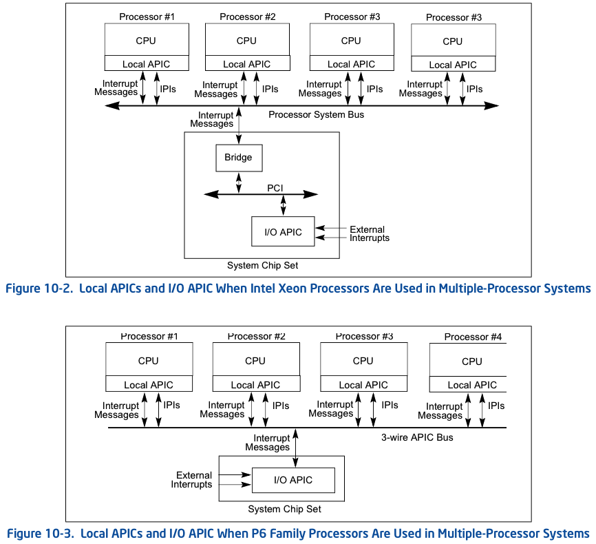
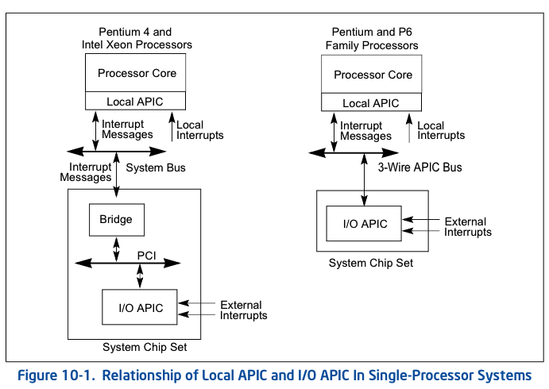
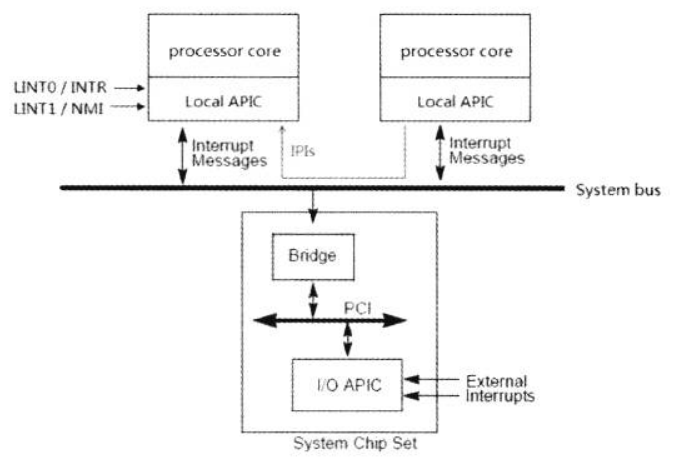

<!-- @import "[TOC]" {cmd="toc" depthFrom=1 depthTo=6 orderedList=false} -->

<!-- code_chunk_output -->

- [1. 中断源](#1-中断源)
- [2. 硬件中断(外部中断): External Interrupts](#2-硬件中断外部中断-external-interrupts)
  - [2.1. 引脚(pins)](#21-引脚pins)
  - [2.2. I/O APIC](#22-io-apic)
  - [2.3. 早期处理器](#23-早期处理器)
  - [2.4. 其他引脚](#24-其他引脚)
  - [2.5. 另外一种分类方法](#25-另外一种分类方法)
  - [2.6. Maskable interrupt: 可屏蔽中断](#26-maskable-interrupt-可屏蔽中断)
  - [2.7. Non-Maskable Interrupt: NMI, 不可屏蔽中断](#27-non-maskable-interrupt-nmi-不可屏蔽中断)
- [3. 软件中断](#3-软件中断)

<!-- /code_chunk_output -->

# 1. 中断源

可**产生中断**的**中断源**来自:

① External (hardware generated) interrupts: **硬件上产生**的中断, 也称为**外部中断！！！**

> 这里的外部指的代码之外

② Software-generated interrupts: **软件上**发起的中断

# 2. 硬件中断(外部中断): External Interrupts

**外部硬件中断**是通过**处理器**上的**引脚**(pins)或**local APIC**接收.

## 2.1. 引脚(pins)

Pentium 4，Intel Xeon，P6系列和Pentium处理器上的**主要中断引脚**是`LINT [1：0]`引脚，它们连接到**local APIC**。 

* **启用**local APIC后，可以通过APIC的**本地向量表**（LVT, local vector table）对`LINT [1：0]`引脚**进行编程**，使其与处理器的**任何异常或中断向量**相关联。

* 当**local APIC**被全局/硬件**禁用**，这些引脚分别被配置为**INTR**和**NMI引脚**。

  * 当**外部中断发生**, 会通过**INTR引脚**向处理器发出信号。处理器从**系统总线**上**读取**由**外部中断控制**器提供的**中断向量**，例如8259A。

  * NMI pin会有一个不可屏蔽的中断(NMI)信号，它被分配到**中断向量号2**。

## 2.2. I/O APIC

处理器的 local APIC通常连接到 I/O APIC. 此时，在I/O APIC引脚处接收到的外部中断可以通过**系统总线**或**APIC串行总线重定向**到 local APIC. **I/O APIC**会**决定**这个中断的**向量号**，并将该数字发送到 local APIC。当系统包含多个处理器时，处理器还可以通过**系统总线**或**APIC串行总线**。

## 2.3. 早期处理器

`LINT [1：0]`引脚在**不包含 on-chip local APIC**的**Intel486**处理器和**较早的Pentium处理器**上**不可用**。这些处理器具有**专用**的**NMI**和**INTR引脚**。对于这些处理器，外部中断通常由基于系统的中断控制器（8259A）生成，并通过**INTR引脚发出中断信号**。

## 2.4. 其他引脚

请注意，处理器上的**其他几个引脚**可能会导致**处理器中断**。但是，这些中断不会由本章介绍的中断和异常机制处理。这些引脚包括`RESET＃`，`FLUSH＃`，`STPCLK＃`，`SMI＃`，`R/S＃`和`INIT＃`引脚。它们是否包括在特定处理器中取决于实现。引脚功能在各个处理器的数据手册中进行了描述。第34章“系统管理模式”中介绍了`SMI＃`引脚。

## 2.5. 另外一种分类方法

**硬件中断**(外部中断)又可以分为**处理器外部**和**处理器内部**. 

* **处理器外部**硬件中断来自**各种pin信号接口**和**Local APIC**的**LINT0**和**LINT1引脚**, 以及由**外部I/O APIC发送过来的中断消息**.

> 在一个**支持APIC模块**的**处理器**上, 典型地,
> * **LINT0**被连接到**ISA bus的8259A PIC(Programming Interrupt Controller**, 可编程中断控制器)上;
> * **LINT1**会被连接到**NMI pin**上.

* **处理器内部**硬件中断来自一组 LVT(local vector table) 寄存器.

**外部硬件中断**是通过**处理器**上的**引脚**(pins)或**local APIC**接收. 接收来自处理器的INTR pin、NMI pin和I/O APIC的中断消息，我们看看下面关于APIC架构的图。我们看下面关于APIC架构的图.

图1, Xeon和P6系列的多处理器系统



单处理器系统



图2:



图2是一幅经典的APIC结构图, 上面介绍了处理器所接受的中断源,包括:

① 由**Local APIC！！！** 的**LINT0接口！！！** 连接到**8259A的INTR接口！！！** 上.

> 当**APIC被disable！！！** 的时候, **LINT0接口**被**直接作为外部中断控制器8259A的INTR接口**, 接受**来自8259A！！！的中断请求**

② **LINT1**接受来自**外部的NMI请求**

③ 处理器也接受来自**主板Chipset(芯片组**)上的**I/O APIC**模块发送的**Interrupt Message**

④ 在处理器**内部Local APIC**产生的中断事件, 例如: LVT timer事件或**performance monitoring事件**等

⑤ 在**MP环境**中, 处理器也响应**其他processor code发送过来的IPI(Interprocessor Interrupt)处理器间的中断**. 这些**IPI中断通过system bus**进行传递, 或许并不能称为硬件中断, 称为内部中断较为合适.

## 2.6. Maskable interrupt: 可屏蔽中断

可屏蔽的中断如下.

① 通过处理器的**INTR pin**接收到的中断请求, 典型地, INTR连接到**8259A中断控制器**上. 在**支持APIC的处理器**上, **LINT0 pin**被作为**INTR**使用连接**外部中断控制器**.

② 通过**Local APIC产生**的本地中断源

③ 来自芯片组上的**I/O APIC产生**的中断消息

## 2.7. Non-Maskable Interrupt: NMI, 不可屏蔽中断

通过**处理器NMI pin接收的中断请求**是不可屏蔽的, 在**支持APIC的处理器**上**LINT1 pin被作为NMI pin**使用, 接收来自**外部的NMI信号**.

# 3. 软件中断

在软件上可以使用**INT指令主动发起中断**, 进入中断处理程序, 如下.

```
int 0x40        ; 执行0x40号中断服务例程
```

这条指令将调用0x40号中断服务例程, **INT指令**可以使用**0 \~ 255(！！！**)中任何值作为中断向量进行调用, Intel特别提到: 当**使用2号(即NMI中断vector)调用中断**时, 由**硬件产生的NMI将不能被响应**.