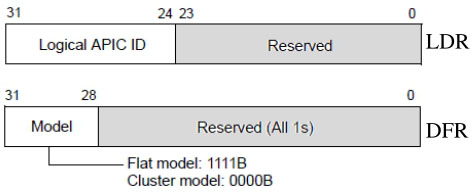
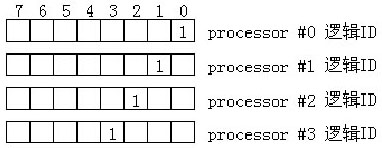
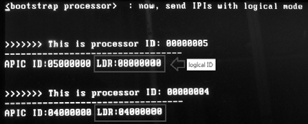
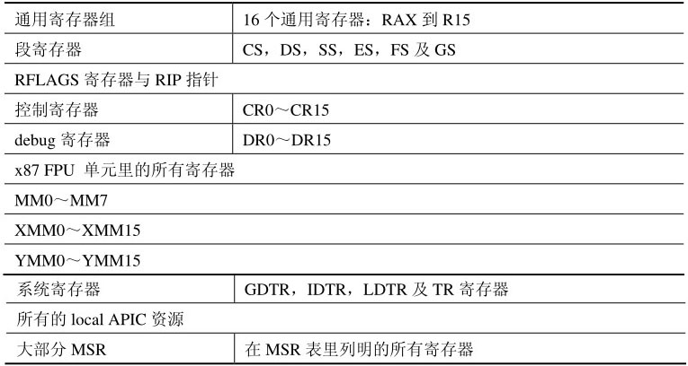

<!-- @import "[TOC]" {cmd="toc" depthFrom=1 depthTo=6 orderedList=false} -->

<!-- code_chunk_output -->

- [1. IPI消息目标地址](#1-ipi消息目标地址)
  - [1.1. 固定目标地址](#11-固定目标地址)
  - [1.2. No shorthand下的目标地址](#12-no-shorthand下的目标地址)
- [2. physical目标模式的目标地址](#2-physical目标模式的目标地址)
  - [2.1. 广播IPI消息](#21-广播ipi消息)
  - [2.2. 使用其他交付模式](#22-使用其他交付模式)
- [3. logical目标模式的目标地址](#3-logical目标模式的目标地址)
  - [3.1. LDR](#31-ldr)
  - [3.2. DFR](#32-dfr)
- [4. 多处理器的初始化与编程](#4-多处理器的初始化与编程)
  - [4.1. Logical processor的资源](#41-logical-processor的资源)
  - [4.2. Logical processor的初始化](#42-logical-processor的初始化)
  - [4.3. 实例目标](#43-实例目标)
  - [4.4. 处理器的运行模式](#44-处理器的运行模式)
  - [4.5. 共用流程](#45-共用流程)
  - [4.6. BSP的流程](#46-bsp的流程)
  - [4.7. Lock信号](#47-lock信号)
  - [4.8. Startup routine](#48-startup-routine)
  - [4.9. BSP广播INIT-SIPI-SIPI消息](#49-bsp广播init-sipi-sipi消息)
  - [4.10. BSP等待AP回复响应](#410-bsp等待ap回复响应)
  - [4.11. AP初始化工作](#411-ap初始化工作)

<!-- /code_chunk_output -->

前面介绍的**ICR（Interrupt Command Register**）用于产生**IPI（Inter-processor interrupt）消息**，当往ICR寄存器的**低32位**写入**IPI命令字**时，处理器就产生了**IPI消息**发送到**system bus**上。

```x86asm
mov DWORD [APIC_BASE + ICR0]，000C4620H   ； 写ICR低32位
```

这条指令往**64位ICR寄存器**的**低32位**写入**IPI命令字000C4620H**，这个命令会向**所有的处理器**（除了自已）发送**SIPI消息**。

值得注意的是，当需要写完整的**64位ICR命令字**时，应**先写高32位字**，再写低32位字。

# 1. IPI消息目标地址

**ICR**的**destination shorthand域**设置了总的**目标类型**，**只有No Shorthand目标类型**才需要**提供具体的IPI消息发送对象**。

## 1.1. 固定目标地址

在Self、All including self，以及All excluding self**目标类型**中使用**固定的目标对象**。

## 1.2. No shorthand下的目标地址

在No Shorthand目标类型里，最终的IPI消息目标依赖于下面几个设置。

① **Destination mode**（目标模式）：选择**physical还是logical模式**, 提供**查找目标processor的方式**。

② **Destination field**（目标域）：这个值对于physical还是logical模式有不同的解释, **提供目标processor地址**。

# 2. physical目标模式的目标地址

physical目标模式需要在**ICR寄存器的destination field域**（高32位）里直接给出**目标处理器的APIC ID值**，如下面的IPI命令字。

```x86asm
mov DWORD [APIC_BASE + ICR1]，01000000h  ； 目标处理器APIC ID为01
mov DWORD [APIC_BASE + ICR0]，00004030h  ； 发送 IPI 消息
```

上面的代码分别写入ICR的高32位和低32位。这个IPI消息使用了Fixed交付模式，提供的中断vector是30h，发送的目标处理器APIC ID是01。

由于使用Fixed交付模式，目标处理器（APIC ID为01）在通过中断请求的仲裁后，将执行30h号中断vector所对应的中断处理程序。我们将在后面了解local APIC的中断请求与响应处理器流程。

>实验18-7：给APIC ID为01的处理器发送IPI消息。

在这里作为实验我们将使用physical目标模式，在BSP处理器里发送一条IPI消息给APIC ID为01的处理器，让目标处理器处理30h中断向量的中断处理程序。

在system bus上的所有处理器能处理protected模式下的中断处理程序，前提是每个处理器已经得到初始化，并切换到protected模式。在前面的实验18-6代码的前提下（所有处理器已经初始化进入protected模式），完整的代码在topic18\ex18-7\protected.asm文件里，下面是发送IPI消息的代码节选。

代码清单18-20（topic18\ex18-7\protected.asm）：

```x86asm
；； 现在发 IPI 到目标 processor
       mov esi，bp_msg1      ； 打印信息
       call puts
       mov esi，01
       call print_dword_value
       call println
       ； 使用physical 目标模式，下面是发送 IPI
       mov DWORD [APIC_BASE + ICR1]，01000000h    ； APIC ID=01
       mov DWORD [APIC_BASE + ICR0]，PHYSICAL_ID | 30h  ； vector 为 30h
```

正如前面所说，IPI消息使用no shorthand目标类型，physical模式，Fixed交付模式，提供的中断vector为30h。在这里应该写入ICR寄存器的高32位，即先写入目标处理器的APIC ID值，再写入ICR寄存器低32位。注意：在AP处理器里需要开启中断许可（执行STI指令），如果执行CLI指令，那么这个IPI中断将会被屏蔽，AP处理器无法响应。

同时，在这个实验里，IPI中断处理程序可以在BSP处理器里设置，也可以在AP处理器里设置，因为所有处理器的IDT寄存器的设置是一样的，也就是所有处理器都使用同一个中断描述符表。

代码清单18-21（topic18\ex18-7\protected.asm）：
```x86asm
；---------------------------------------------
； ap_ipi_handler（）：这是 AP IPI handler
；---------------------------------------------
ap_ipi_handler：
       jmp do_ap_ipi_handler
at_msg2 db 10，10，'>>>>>>> This is processor ID：'，0
at_msg3 db '---------- extract APIC ID -----------'，10，0
do_ap_ipi_handler：
       mov esi，at_msg2
       call puts
       mov edx，[APIC_BASE + APIC_ID]  ； 读 APIC ID
       shr edx，24
       mov esi，edx
       call print_dword_value
       call println
       mov esi，at_msg3
       call puts
       mov esi，msg2       ； 打印 package ID
       call puts
       mov esi，[x2apic_package_id + edx * 4]
       call print_dword_value
       call printblank
       mov esi，msg3       ； 打印 core ID
       call puts
       mov esi，[x2apic_core_id + edx * 4]
       call print_dword_value
       call printblank
       mov esi，msg4       ； 打印 smt ID
       call puts
       mov esi，[x2apic_smt_id + edx * 4]
       call print_dword_value
       call println
       mov DWORD [APIC_BASE + EOI]，0
       iret
```

在这个目标处理器执行的中断处理程序里，只是简单打印出提取出来的Package/Core/SMT ID值。这些提取的ID值在处理器各自执行代码时，调用前面所说的extrac\_x2apic_id（）函数来提取。


从上面的运行结果来看，BSP处理器发送一条IPI消息到APIC ID为01的处理器上，目标处理器正确地执行了30h中断处理程序。

我们看到，使用physical模式是最为简单的一种给目标处理器发送IPI消息的形式。physical模式当然也可以给所有的处理器发送消息。

## 2.1. 广播IPI消息

在**physical模式**里，当**destination field（目标域**）提供一个**FFh值**时，IPI消息将发送到**所有的处理器（广播IPI消息到system bus上的所有处理器），也包括self（自己**）。

```x86asm
mov DWORD [APIC_BASE + ICR1]，0FF000000h   ； 发送IPI到所有处理器上
mov DWORD [APIC_BASE + ICR0]，00004030h   ； 所有处理器都执行vector 30h中断
```

上面的代码就是典型的使用physical模式广播IPI消息。所有处理器都执行vector为30h的中断处理程序。

值得注意的是，当广播IPI消息时，所有处理器随机地执行中断处理程序，此时应注意代码互斥问题，避免所有处理器同时运行同一段程序（特别在有变量值修改的情况下），这样会产生不可预测的问题。

因此，在广播IPI消息的执行代码里加上互斥代码执行机制（正如实验18-6里所示），典型地是加上lock信号，限制两个处理器同时执行同一代码。

>实验18-8：广播IPI消息到system bus上所有处理器

下面，我们来测试使用physical目标模式广播IPI消息，在IPI的中断处理程序里，打印出所有处理器的APIC ID提取出来的信息。

代码清单18-22（topic18\ex18-8\protected.asm）：

```x86asm
；---------------------------------------------
； ap_ipi_handler（）：这是 AP IPI handler
；---------------------------------------------
ap_ipi_handler：
   jmp do_ap_ipi_handler
at_msg2 db 10，10，'>>>>>>> This is processor ID：'，0
at_msg3 db '---------- extract APIC ID -----------'，10，0
do_ap_ipi_handler：
       ； 测试 lock
test_handler_lock：
       lock bts DWORD [vacant]，0
       jc get_handler_lock
       mov esi，at_msg2
       call puts
       mov edx，[APIC_BASE + APIC_ID]         ； 读 APIC ID
       shr edx，24
       mov esi，edx
       call print_dword_value
       call println
       mov esi，at_msg3
       call puts
       mov esi，msg2                          ； 打印 package ID
       call puts
       mov esi，[x2apic_package_id + edx * 4]
       call print_dword_value
       call printblank
       mov esi，msg3                          ； 打印 core ID
       call puts
       mov esi，[x2apic_core_id + edx * 4]
       call print_dword_value
       call printblank
       mov esi，msg4                          ； 打印 smt ID
       call puts
       mov esi，[x2apic_smt_id + edx * 4]
       call print_dword_value
       call println
       mov DWORD [APIC_BASE + EOI]，0
       ； 释放lock
       lock btr DWORD [vacant]，0
       iret
get_handler_lock：
       jmp test_handler_lock
       iret
```

由于这个实验里所有处理器都使用同一个IDT，所有处理器都同时执行同一个中断处理程序，因此在这个IPI中断处理程序里加入了互斥机制代码，每次进入IPI handler执行必须先获得lock，这样保证每个处理器都正确执行目标代码。

```x86asm
test_lock：
       lock bts DWORD [vacant]，0    ； 测试并上锁
       jc get_lock
       ；； 执行某些代码
       Lock btr DWORD [vacant]，0    ； 释放lock
       ；； 其余处理
get_lock：
       jmp test_lock       ； 继续测试lock
```

上面这段代码是简单的互斥执行机制示例。同一时间只允许一个处理器进入执行某些代码。

当然，你可以选择让所有处理器使用不同IDT（在处理器初始化时设置不同的IDT基地址），在这种情况下，你可以使用相同的vector值，而需要为每个处理器编写不同的中断处理程序。这样并不存在需要互斥执行。

下面是在笔者的Westmere架构Core i5处理器上的运行结果。


在上面的运行结果里，我们看到，所有的处理器都接收到IPI消息，也包括广播者自己。经过IPI中断处理程序的互斥操作，所有处理器都正确地执行了IPI中断处理程序。

并且有一个现象是，当广播消息包括自已在内，那么显然广播者会最先得到中断消息（可能system bus仲裁时占优）。

## 2.2. 使用其他交付模式

在上面的两个示例里，我们使用的都是Fixed交付模式，在**no shorthand目标类型**里，我们可以使用任何其他的交付模式：Fixed模式（000B），SMI模式（010B），NMI模式（100B），INIT模式（101B），以及Start\-up模式（110B）。

在**Fixed模式**里，需要提供**中断vector**；**Start\-up模式**里应**提供Start\-up代码地址**（如实验18-6所示）；**其他的模式应保持vector为0值**。在NMI模式里，处理器自动使用vector为2值（即调用\#NMI异常处理程序）。

其余的这些delivery mode具有很高的优先级别，它们不能被屏蔽，不受IRR、ISR，以及TPR这些寄存器的中断仲裁影响。我们将在后面进行探讨。

# 3. logical目标模式的目标地址

当使用logical目标模式时，情况变得稍为复杂，**ICR的destination field（目标域**）并不是直接提供目标处理器的APIC ID值，而是**一个mask值**。

当system bus上的处理器符合（匹配）这个mask值时，它们就是目标处理器，并且可以一次发送**多个目标处理器**。

这个目标处理器的匹配过程，受到**LDR**（logical destination register）和**DFR**（destination format register）的影响。实际上，它们定义了处理器的**logical ID值**，其结构如下。



## 3.1. LDR

**每个local APIC**可以**额外**自定义一个**逻辑ID值！！！**，在LDR（logical destination register）的bit 24～bit 31里提供。8位的local APIC ID值共可以为**8个local APIC**所使用（每个local APIC占用1位）。

假设当前的system bus上有4个处理器，那么每个处理器的local APIC里可以使用LDR定义一个逻辑ID值，如下所示。



在上图的设置里，4个处理器的逻辑ID如下。

① processor #0：逻辑ID为1。

② processor #1：逻辑ID为2。

③ processor #2：逻辑ID为4。

④ processor #3：逻辑ID为8。

逻辑ID使用**mask码方式设置**（即每个位可以被mask），**每个处理器**的**逻辑ID值**在**各自的初始化阶段**在LDR设置。

当使用logical目标模式发送IPI消息时，ICR的destination field（目标域）提供一个mask值，这个mask值用来匹配和选择目标处理器。

## 3.2. DFR

DFR（destination format register）设置两种匹配模式：**flat模式**（1111B）和**cluster模式**（000B）。

在flat模式里，当LDR的**逻辑ID**与IPI消息中的**destination field值**进行**按位AND**操作，结果为True时，属于目标处理器。

```x86asm
； 下面是发送 IPI
mov DWORD [APIC_BASE + ICR1]，0C000000h  ； logical ID 值
mov DWORD [APIC_BASE + ICR0]，4830h   ； 使用 logical 目标模式
```

在上面的代码里，使用logical目标模式发送IPI消息，ICR的destination field值为0C000000h，那么它将匹配两个处理器（前面所举例列了4个逻辑ID）。


如上所示，这个destination field值（0x0c）将找到两个符合的目标处理器（处理器2和处理器3），因此这个IPI消息将发送到两个处理器上。

>实验18-9：使用logical目标模式发送IPI消息

在使用logical目标时，需要先为每个处理器设置一个logical ID值，在这个实验里我们将使用logical目标模式来定位目标处理器。

代码清单18-23（topic18\ex18-9\protected.asm）：

```x86asm
       inc DWORD [processor_index]                             ； 增加 index 值
       inc DWORD [processor_count]                             ； 增加 logical
processor 数量
       mov ecx，[processor_index]                              ； 取 index 值
       mov edx，[APIC_BASE + APIC_ID]                         ； 读 APIC ID
       mov [apic_id + ecx * 4]，edx                            ； 保存 APIC ID
；*
；* 分配 stack 空间
；*
       mov eax，PROCESSOR_STACK_SIZE
       mul ecx
       mov esp，PROCESSOR_KERNEL_ESP + PROCESSOR_STACK_SIZE
       add esp，eax
； 设置 logical ID
       mov eax，01000000h          ； 模值
       shl eax，cl            ； ID=（1 << index）
       mov [APIC_BASE + LDR]，eax        ； 写入逻辑 ID
```

每个处理器的logical ID值为1\<\<\index，index值是处理器的编号（从0开始编号）。那么，index值为2时，第2号处理器的logical ID值是04H；index值为3时，第3号处理器的logical ID值是08H。

代码清单18-24（topic18\ex18-9\protected.asm）：

```x86asm
； 下面是发送 IPI
mov DWORD [APIC_BASE + ICR1]，0C000000h                 ； 发送目标为 0Ch
mov DWORD [APIC_BASE + ICR0]，LOGICAL_ID | 30h         ； 发送IPI
```

在上面的代码里，使用0C000000h作为目标发送IPI消息时，将匹配第2和第3号处理器。下面是在Westmere架构i5处理器的机器上的运行结果。



在上面的运行结果里，在LDR里显示：APIC ID编号为05000000H的处理器，它的逻辑ID值为08H；APIC ID编号为04000000H的处理器，它的逻辑ID为04H。使用0CH这个destination field值将使这两个处理器得到匹配。

# 4. 多处理器的初始化与编程

在MP系统平台上，system bus上有多个physical package，或者只有1个physical package，但包含了多个processor core和logical processor。这些processor需要经过初始化才能被使用。BIOS会进行一些初步初始化，在支持多处理器的OS上，OS有责任初始化和配置所有处理器。

在本节里，我们将探讨multi\-threading平台（包括Hyper-threading和multi-core技术）的初始化。

## 4.1. Logical processor的资源

在支持Hyper-threading技术的Intel处理器上，每个processor core有两个SMT（同步线程，也就是logical processor），以笔者的core i5处理器为例，其上有两个core，每个core上有两个执行单元，属于双核心4线程处理器（典型地i7处理器属于4核8线程处理器）。

这些logical processor的资源有三大类。

① 部分资源是每个logical processor私有。也就是说每个逻辑处理器都有独立的这些资源。

② 部分资源是core上的两个logical processor共享的。也就是说每个core有独立的这些资源，而对于两个SMT来说是共享的。一个SMT修改这些资源将影响另一个SMT。

③ 部分资源依赖于处理器的实现，这部分没有做明确的说明。

我们可以从Intel手册里得到关于logical processor资源的说明，每个logical processor上独立的资源如下表所示。



还有一些未在上表里列出的寄存器。而在Intel手册里描述SMT共享的资源只有下面一条。

- MTRR（memory type rang register）。

这个MTRR寄存器属于core内的两个logical processor共享（关于MTRR详情请参考7.2节所述）。

下面的寄存器依赖于处理器实现，也就是可能属于SMT独有，也可能是SMT共享，根据不同的处理器架构实现。

① IA32\_MISC\_ENABLE寄存器。

② 与Machine check机制有关的MSR。

③ 与performance monitoring机制有关的MSR，包括control寄存器与counter寄存器。

关于哪些MSR属于SMT独有，哪些属于SMT共享，最好参考Intel手册的MSR列表，得到更准确详细的信息。

实际上，可能在Intel手册里某些寄存器资源并没有明确标明，也有部分信息是隐晦不清的，或许还有部分是描述有误的。

## 4.2. Logical processor的初始化

当MP系统power\-up（加电）或者RESET（复位）后，每个processor会同时执行处理器内部的BIST代码。基于system bus硬件会赋予其上的每个logical processor唯一的APIC ID值，这个APIC ID值就是前面18.4.2.1节所描述的initial APIC ID（即最初的APIC ID值）。

如前面18.4.2.1节所述，当处理器支持CPUID.0B功能叶时，这个initial APIC ID是32位的（尽管在不支持x2APIC模式下也是），否则initial APIC ID是8位的。

这个initial APIC ID值会被写入到local APIC的APIC ID寄存器里作为每个处理器的ID值，并且硬件会选择一个处理器作为BSP（bootstrap processor），BSP的APIC ID值通常为0H。在这个BSP的IA32\_APIC\_BASE寄存器的bit 8位（BSP标志位）会置位，指示属于BSP。

而其余处理器的IA32\_APIC\_BASE寄存器BSP标志位会被清位，指示属于AP（application processor）。

在确定BSP后，BSP从0FFFFFFF0H地址（BIOS代码）处执行第1条CPU指令。我们知道，BSP接着执行BIOS的自举代码，完成BIOS设置。

在Intel手册的指引里，当BSP完成BIOS的boot strap代码初始化工作后，应向system bus广播INIT-SIPI-SIPI消息序列（除了自己），唤醒其他AP处理器。BSP提供BIOS的bootstrap routine地址给所有AP处理器接收，引导AP处理器完成初始化设置。

> 实验18-10：system bus上处理器初始化及相互通信

接下来，笔者将以实际例子来阐述system bus上所有处理器的初始化，当然这个实验例子是很简单的，并没有完全做到Intel推荐的详细步骤，但绝对是具有代表性和可操作性的。

## 4.3. 实例目标

我们的最终目标是什么？为了更具代表性，在笔者的Westmere架构移动Core i5处理器平台上（属于双核4线程处理器），让所有的logical processor进入到64位模式，并且3个AP运行在3级权限下，而BSP运行在0级权限下，如下表所示。


显然，每个处理器必须走完从实模式到64位模式的切换流程，第1个完成这个流程的必定是BSP，在实验里设它的index值为0（处理器编号）。注意：这个index值不是APIC ID号，也不是logical ID号，是为了便于管理而编的号。

## 4.4. 处理器的运行模式

第一个执行初始化工作的必定是BSP，BSP初始化完成后再通知其余的处理器进行初始化工作。

实际上，在OS里处理器执行初始化流程完全依赖于OS的设计和实现。典型地，OS可以为每个处理器使用独立的运行环境，也可以所有的处理器共有一个大环境，如下表所示。


在共享环境里，4个主要的系统执行环境如下。

① GDT共享意味着所有处理器的GDTR是一致的，需要加载同一个GDT pointer值。

② IDT共享意味着所有处理器的IDTR是一致的，需要加载同一个IDT pointer值。

③ LDT可以选择使用独立，为每个处理器加载不同的LDTR值。

④ Paging机制的页转换表结构尤其重要，当共享页转换表时意味着所有处理器的CR3寄存器值是一致的，需要加载同一个页表转换表基址。

因此，并不需要所有处理器都在整个初始化流程执行一遍。BSP将要做更多的工作。系统中的GDT、IDT及页转换表结构，由BSP负责完成初始化设置，其他的AP加载使用。很多情况下，AP只需完成自己份内的工作就可以了。

在独立的环境里，每个处理器都有自己的一份运行环境，每个处理器需要负责对自己的环境进行初始化和设置。

值得注意的是，这些划分并不是绝对的，可以做到既有共享的环境也有独立的环境。在笔者的实验实例里是使用处理器共享环境的模式。

## 4.5. 共用流程

在这个实验里有很大一部分代码是所有处理器都需要共同执行一次的，下面的代码是在long.asm模块里刚进入64位模式下的初始化阶段，由所有处理器执行。

代码清单18-25（topic18\ex18-10\long.asm）：

```x86asm
entry64：
       mov ax，KERNEL_SS
       mov ds，ax
       mov es，ax
       mov ss，ax
； 设置 long-mode 的系统数据结构
       call bsp_init_system_struct
；； 下面重新加载 64位 环境下的 GDT 和 IDT
       mov rax，SYSTEM_DATA64_BASE + （__gdt_pointer - __system_data64_entry）
       lgdt [rax]
       mov rax，SYSTEM_DATA64_BASE + （__idt_pointer - __system_data64_entry）
       lidt [rax]
；*
；* 设置多处理器环境
；*
       inc DWORD [processor_index]             ； 增加处理器 index
       inc DWORD [processor_count]           ； 增加处理器计数
       mov eax，[APIC_BASE + APIC_ID]        ； 读 APIC ID
       mov ecx，[processor_index]
       mov [apic_id + rcx * 4]，eax           ； 保存 APIC ID
       mov eax，01000000h
       shl eax，cl
       mov [APIC_BASE + LDR]，eax              ； logical ID
；*
；* 为每个处理器设置 kernel stack pointer
；*
       ； 计数 stack size
       mov eax，PROCESSOR_STACK_SIZE   ； 每个处理器的 stack 空间大小
       mul ecx                                     ； stack_offset=STACK_SIZE * index
       ； 计算 stack pointer
       mov rsp，PROCESSOR_KERNEL_RSP
       add rsp，rax       ； 得到 RSP
       mov r8，PROCESSOR_IDT_RSP
       add r8，rax                               ； 得到 TSS RSP0
       mov r9，PROCESSOR_IST1_RSP           ； 得到 TSS IDT1
       add r9，rax
；*
；* 为每个处理器设置 TSS 结构
；*
； 计算 TSS 基址
       mov eax，104                                   ； TSS size
       mul ecx                                     ； index * 104
       mov rbx，__processor_task_status_segment-
__system_data64_entry+SYSTEM_DATA64_BASE
       add rbx，rax
       ； 设置 TSS 块
       mov [rbx + 4]，r8                       ； 设置 RSP0
       mov [rbx + 36]，r9                     ； 设置 IST1
       ； 计算 TSS selector 值
       mov edx，processor_tss_sel
       shl ecx，4                                 ； 16 * index
       add edx，ecx                            ； TSS selector
       ； 设置 TSS 描述符
       mov esi，edx                              ； TSS selector
       mov edi，67h                              ； TSS size
       mov r8，rbx                                  ； TSS base address
       mov r9，TSS64                                  ； TSS type
       call set_system_descriptor
；*
；* 下面加载TSS 和 LDT
；*
       ltr dx
       mov ax，ldt_sel
       lldt ax
；； 设置 sysenter/sysexit，syscall/sysret 使用环境
       call set_sysenter
       call set_syscall
； 设 FS.base=0xfffffff800000000
       mov ecx，IA32_FS_BASE
       mov eax，0x0
       mov edx，0xfffffff8
       wrmsr
； 提取 x2APIC ID
       call extrac_x2apic_id
```

这个流程里的主要工作是：加载GDTR与IDTR；增加处理器index与count计数，保存各自的APIC ID值；为每个处理器分配各自的RSP值；为每个处理器设置独立的TSS段；加载TR与LDTR；最后初始化sysenter与syscall指令使用环境。

## 4.6. BSP的流程

在实例里，BSP初始化的流程和以前的实验测试是一样的，只是调整了一些初始化代码的次序，以及额外增加了判断是否为BSP的流程。

代码清单18-26（topic18\ex18-10\long.asm）：

```x86asm
； 检测是否为 bootstrap processor
       mov ecx，IA32_APIC_BASE
       rdmsr
       bt eax，8
       jnc application_processor_long_enter
；-------------------------------------
； 下面是 BSP 代码
；-------------------------------------
bsp_processsor_enter：
；； 设置 call gate descriptor
       mov rsi，call_gate_sel
       mov rdi，__lib32_service   ； call-gate 设在 __lib32_srvice（） 函数上
       mov r8，3                              ； call-gate 的 DPL=3
       mov r9，KERNEL_CS                    ； code selector=KERNEL_CS
       call set_call_gate
       mov rsi，conforming_callgate_sel
       mov rdi，__lib32_service            ； call-gate 设在 __lib32_srvice（） 函数上
       mov r8，3                              ； call-gate 的 DPL=0
       mov r9，conforming_code_sel        ； code selector=conforming_code_sel
       call set_call_gate
；； 设置 conforming code segment descriptor
       MAKE_SEGMENT_ATTRIBUTE 13，0，1，0  ； type=conforming code，DPL=0，G=1，D/B=0
       mov r9，rax                 ； attribute
       mov rsi，conforming_code_sel       ； selector
       mov rdi，0xFFFFF                      ； limit
       mov r8，0                              ； base
       call set_segment_descriptor
； 设置 #GP handler
       mov rsi，GP_HANDLER_VECTOR
       mov rdi，GP_handler
       call set_interrupt_handler
； 设置 #PF handler
       mov rsi，PF_HANDLER_VECTOR
       mov rdi，PF_handler
       call set_interrupt_handler
； 设置 #DB handler
       mov rsi，DB_HANDLER_VECTOR
       mov rdi，DB_handler
       call set_interrupt_handler
；； 设置 int 40h 使用环境
       mov rsi，40h
       mov rdi，user_system_service_call
       call set_user_interrupt_handler
； 开启中断许可
       NMI_ENABLE
       sti
       mov DWORD [20100h]，0            ； lock 信号有效
```

通过IA32\_APIC\_BASE寄存器bit 8（BSP标志位）来判断当前执行代码处理器是否属于BSP。如果是AP则跳转到application\_processor\_long\_enter执行AP剩余的longmode初始化流程。

在BSP流程里，主要工作是设置GDT和IDT内的描述符数据，最后开放lock信号。

## 4.7. Lock信号

这个Lock信号是为了避免所有AP同时执行startup routine代码，必须设置一个互斥执行的锁机制。当lock信号为0时，第1个读取并上锁（lock信号置为1）的AP获得执行权。等待完成后重新开放lock信号有效。

在广播INIT\-SIPI\-SIPI消息前，增加processor的计数，清lock信号置为有效。在实验里，在Lock信号的值保存在硬编码地址值[20100h]位置上。

使用硬编码地址是为了代码的共用，能在protected.asm模块和long.asm模块里对同一个值进行设置。笔者暂时没有其他比较好的方式。

由于protected.asm模块执行在起始地址9000h的区域，而long.asm模块执行在起始地址10000h的区域，如果在protected.asm和long.asm模块块里同时定义一个lock信号vacant值，那么在startup routine里会造成地址位置不一致，使用startup routine代码不能做到通用性（在这么一种情况下，例如：当AP只需进入protected模式，而不需进入long-mode时）。

## 4.8. Startup routine

在BSP广播SIPI（startup IPI）消息时，需为接收SIPI消息的处理器提供startup routine代码的入口地址，这个startup routine代码必须提供在4K边界上，1M地址以内的real\-mode地址（也就是startup routine提供的是1M以内的物理地址）。


以上面的广播SIPI消息代码为例，它提供的vector值为20h，那么startup routine入口地址在20000h地址里。

代码清单18-27（common\application_processor.asm）：

```x86asm
；*------------------------------------------------------
；* 下面是 startup routine 代码
；* 引导 AP 执行 setup模块，执行 protected 模块
；* 使所有 AP 进入protected模式
；*------------------------------------------------------
startup_routine：
       ；*
       ；* 当前处理器处理 16 位实模式
       ；*
       bits 16
       mov ax，0
       mov ds，ax
       mov es，ax
       mov ss，ax
；*
；* 测试 lock，只允许 1 个 local processor 访问
；*
test_ap_lock：
       ；*
       ；* 测试 lock，lock 信号在 20100h 位置上
       ；* 以 CS + offset 的形式使用 lock 值
       ；*
       lock bts DWORD [cs：100h]，0
       jc get_ap_lock
；*
；* 获得 lock 后，转入执行 setup --> protected --> long 序列
；*
       jmp WORD 0：SETUP_SEG
get_ap_lock：
       pause
       jmp test_ap_lock
       bits 32
startup_routine_end：
```

这是完整的startup routine代码。注意：它实现在common\application_processor.asm文件里。笔者它提取出来放在共用的文件目录（common目录完整路径为x86\source\common\），这样的好处是，可以放在protected.asm模块和long.asm模块里共用。

这个startup routine代码几乎没做什么工作，最重要的是使用spin lock形式来获取lock，让同一时刻只有一个AP进入setup.asm→protected.asm→long.asm执行序列来初始化。

这个lock信号值，如前面所述使用了硬编码CS：offset形式，当有下面示例时：

```x86asm
mov DWORD [APIC_BASE + ICR0]，00c4620H  ； startup routine 在 20000h
mov DWORD [APIC_BASE + ICR0]，00C4630H  ； startup routine 在 30000h
```

当发送不同地址的startup routine时，例如：一个在20000h，一个在30000h。使用[CS：100h]形式能保证让BSP知道目标的lock信号位于固定的100h偏移位置上，BSP可以维护这个[20100h]和[30100h]地址的lock信号。

值得注意的是，处理器在接收INIT消息后，处于INIT状态，此时处理器工作模式是实模式，因此这个startup routine代码必须以16位实模式代码的角度来设计。

## 4.9. BSP广播INIT-SIPI-SIPI消息

BSP在执行完long\-mode的一些初始化工作后，最后**广播INIT\-SIPI\-SIPI消息**序列到system bus上，唤醒所有其余的处理器并执行startup routine代码。

代码清单18-28（topic18\ex18-10\long.asm）：

```x86asm
       ；*
       ；* 下面发送 IPI，使用 INIT-SIPI-SIPI 序列
       ；* 发送 SIPI 时，发送 startup routine 地址位于 200000h
       ；*
       mov DWORD [APIC_BASE + ICR0]，000c4500h   ； 发送 INIT IPI，使所有 processor
执行 INIT
       DELAY
       DELAY
       mov DWORD [APIC_BASE + ICR0]，000C4620H ； 发送 Start-up IPI
       DELAY
       mov DWORD [APIC_BASE + ICR0]，000C4620H ； 再次发送 Start-up IPI
       ；*
       ；* 等待 AP 完成初始化
       ；*
wait_for_done：
       cmp DWORD [ap_done]，1
       je next
       nop
       pause
       jmp wait_for_done
next：  ； 触发 apic timer 中断
       mov DWORD [APIC_BASE + TIMER_ICR]，10
       DELAY
```

Intel推荐发送两次SIPI消息，这是因为，当system bus上某个处理器没收到SIPI消息，SIPI消息不会自动重发，主动发送两次SIPI消息将避免这种情况的发生。

注意：发送两次SIPI消息，并不会使某些处理器收到两条SIPI消息。这或许是Intel保证的，或许是基于system bus上的消息仲裁手段。

在每次广播IPI消息时应插入一些延时代码，Intel推荐的是发送INIT消息后延时10ms，每发送一次SIPI消息延时200??s，这个时间延迟比较难控制。因此，具体时间根据情况所定。

## 4.10. BSP等待AP回复响应

代码清单18-29（topic18\ex18-10\long.asm）：

```x86asm
       ；*
       ；* 等待 AP 完成初始化
       ；*
wait_for_done：
       cmp DWORD [ap_done]，1    ； 假如所有处理器完成后，触发 apic timer 中断
       je next
       nop
       pause
       jmp wait_for_done
next：  ； 触发 apic timer 中断
       mov DWORD [APIC_BASE + TIMER_ICR]，10
       DELAY
```

当发送完INIT\-SIPI\-SIPI消息序列后，BSP等待AP完成。在这个实例里，笔者使用一种回复响应机制：也就是所有AP完成后发送IPI消息回复BSP，报告已完成所有的初始化工作。

这种机制可以去掉BSP使用延时进行等待的方法，非常灵活实用。并且可以让AP处理器主动与BSP进行通信。

## 4.11. AP初始化工作

在代码清单18-25里，当判断处理器不是属于BSP时，转入application\_processor\_long\_enter执行每个AP剩余的工作，如下面的代码所示。

代码清单18-30（common\application_processor.asm）：

```x86asm
；-------------------------------------------------
； 下面是 application processor 转入到 long-mode
；-------------------------------------------------
application_processor_long_enter：
       bits 64
； 设置 LVT error
       mov DWORD [APIC_BASE + LVT_ERROR]，APIC_ERROR_VECTOR
；*
；* 注释掉 kernel代码，转入到 user 代码
；*
       ；释放 lock，允许其他 AP 进入
    ；   lock btr DWORD [20100h]，0
；============== Ap long-mode 初始化完成 ======================
       ；*
       ；* 向 BSP 回复 IPI 消息
       ；*
；        mov DWORD [APIC_BASE + ICR1]，0h
；        mov DWORD [APIC_BASE + ICR0]，PHYSICAL_ID | BP_IPI_VECTOR
； 设置用户有权执行0级的例程
       mov rsi，SYSTEM_SERVICE_USER8
       mov rdi，user_hlt_routine
       call set_user_system_service
       mov rsi，SYSTEM_SERVICE_USER9
       mov rdi，user_send_ipi_routine
       call set_user_system_service
； 计算 user stack pointer
       mov ecx，[processor_index]
       mov eax，PROCESSOR_STACK_SIZE
       mul ecx
       mov rcx，PROCESSOR_USER_RSP
       add rax，rcx
；； 切换到用户代码
       push USER_SS | 3
       push rax
       push USER_CS | 3
       push application_processor_user_enter
       retf64
       sti
       hlt
       jmp $
application_processor_user_enter：
       mov esi，ap_msg
       mov rax，LIB32_PUTS
       call sys_service_enter
       ； 发送消息给 BSP，回复完成初始化
       mov esi，PHYSICAL_ID | BP_IPI_VECTOR
       mov edi，0
       mov eax，SYSTEM_SERVICE_USER9
       int 40h
       ；释放 lock，允许其他 AP 进入
       lock btr DWORD [20100h]，0
       mov eax，SYSTEM_SERVICE_USER8
       int 40h
       jmp $
```

在AP初始化流程里几乎没做什么工作，long-mode环境的设置大部分工作已经在前面的共同流程里完成，并且由BSP完成对GDT与IDT的设置。

内存中的系统数据表，如：paging结构表，GDT，IDT，LDT及TSS，还有中断vector的设置都由BSP设置，AP无须重复设置。

在实例里，AP接着的工作如下。

① 为3级权限的用户代码提供一些中断服务例程。

② 切换到3级权限。

③ 开放lock信号。

④ 发送IPI消息给BSP，回复已完成工作。

⑤ 进入hlt状态，等待IPI消息。

由于发送IPI消息（APIC\_BASE映射为用户不可访问）和开启中断执行HLT指令需要0级的权限，因此在0级权限里，设置了两个用户中断服务例程，使得在用户层里也可以发送IPI和执行HLT指令。

```x86asm
代码清单18-31（common\application_processor.asm）：

；---------------------------------
； user_send_ipi_routine（）
； input：
；       rsi - ICR0，rdi - ICR1
；---------------------------------
user_send_ipi_routine：
       mov DWORD [APIC_BASE + ICR1]，edi
       mov DWORD [APIC_BASE + ICR0]，esi
       ret
；---------------------------------
； 在用户级代码里开启中断和停机
；---------------------------------
user_hlt_routine：
       sti
       hlt
       ret
```


这个实验共有3个IPI消息发送阶段，从上面的运行结果图可以看到：

① BSP初始化完成后广播INIT-SIPI-SIPI序列。

② 3个AP初始化完成分别发送IPI给BSP，回复响应，确认完成。

③ 最后BSP广播IPI到3个AP，让它们计算一个函数打印信息函数，计算AP的CPI（clocks per instruction）值。

这时候，BSP处于64位模式的0级权限代码，而AP处于64位模式的3级用户权限下。System bus上的所有处理器都可以互相通信交流。

BSP发送IPI消息，AP响应执行时需要建立互斥执行机制（除非每个处理器paging映射基地址不同或者每个处理器使用独立的IDT）。

而AP发送IPI给BSP响应执行时，由于system bus上只有一个BSP不必建立互斥机制。BSP只能一次接收一条IPI消息。