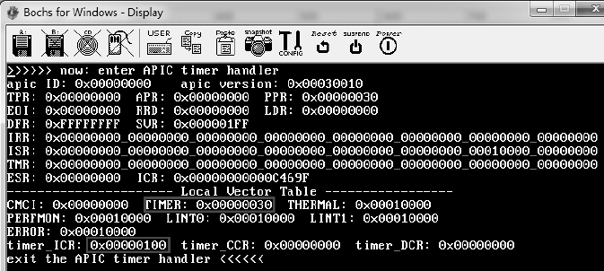

<!-- @import "[TOC]" {cmd="toc" depthFrom=1 depthTo=6 orderedList=false} -->

<!-- code_chunk_output -->

- [1. APIC timer组成](#1-apic-timer组成)
- [2. LVT timer寄存器](#2-lvt-timer寄存器)
- [3. 计数模式](#3-计数模式)
    - [3.1. one-shot计数模式(一次性)](#31-one-shot计数模式一次性)
    - [3.2. Periodic计数模式(定期)](#32-periodic计数模式定期)
    - [3.3. TSC-deadline计数模式(到达TSC值)](#33-tsc-deadline计数模式到达tsc值)

<!-- /code_chunk_output -->

# 1. APIC timer组成

local APIC的**timer**是非常简单易用的。它由以下**4个部分组成**。

① **LVT timer**寄存器。

② Initial\-count（**初始计数器**）寄存器。

③ Current\-count（**当前计数器**）寄存器, 只读寄存器。

④ Divide configuration（**clock频率配置**）寄存器。

Divide configuration寄存器用来**配置timer计数的时钟频率**，和time\-stamp counter一样，local APIC timer的计数器使用**固定的clock频率**，但是它可以通过Divide configuration寄存器进行具体频率的配置，如下所示。


**Timer的计数频率**使用**system bus频率除以上图所列出来的值**，当配置使用除1时，将使用与**TSC（time\-stamp counter**）及**IA32\_FIXED\_CTR2计数器相同的计数频率**。这个寄存器的初始值为0，即使用system bus频率除以2的计数频率。

initial\-count与current\-count寄存器是32位寄存器，在**开始计数时**，**软件**需要在**Initial\-count（初始计数）寄存器**提供一个**非0值**的初始计数值。一旦设置初始计数值，local APIC会将**初始计数值**复制到**只读**的**current\-count（当前计数）寄存器**里。

current\-count寄存器的值开始**减1，直至为0值**。current\-count减为0时产生**timer中断**。

APIC timer支持**三种计数模式**，在LVT timer寄存器里设置。

# 2. LVT timer寄存器

LVT timer寄存器属于7个local vector table寄存器之一。

使用timer前，软件对APIC timer进行相关的编程设置，如下所示。


LVT timer**只能使用Fixed delivery模式和edge触发**，并且**必须提供一个vector值**。

# 3. 计数模式

LVT timer提供了三种计数模式。

① One\-shot（一次性）计数模式。

② Periodic（定期）计数模式。

③ TSC\-deadline（达到TSC值）计数模式。

### 3.1. one-shot计数模式(一次性)

在one\-shot模式里，当current\-count的值减为0时，产生**timer中断**，**current\-count的值维持在0不变**，除非**写入新的initial\-count值**。

```assembly
； 设置 LVT timer
       mov DWORD [APIC_BASE + LVT_TIMER]，TIMER_ONE_SHOT | APIC_TIMER_VECTOR
； 写入 initial-count 值
       mov DWORD [APIC_BASE + TIMER_ICR]，256
```

上面的代码向**LVT timer寄存器**写入设置的值使用了one\-shot模式。

**initial\-count寄存器**被写入256值。一旦写入initial\-count值，APIC timer就开始计数。

### 3.2. Periodic计数模式(定期)

使用**periodic**计数模式，当**current\-count**减为**0**时，产生**timer中断**。

local APIC将在**current\-count寄存器**里装入**initial\-count**值**重新开始计数！！！**，从而**周期性**地产生timer中断，除非**写入0值**到initial\-count寄存器里。

```x86asm
； 设置 LVT timer
       mov DWORD [APIC_BASE + LVT_TIMER]，0x00020030  ； 使用periodic 模式
； 写入 initial-count 值
       mov DWORD [APIC_BASE + TIMER_ICR]，0xff
```

当写入新的initial\-count值时，local APIC将重新装入新的initial\-count值进行计数。

### 3.3. TSC-deadline计数模式(到达TSC值)

当`CPUID.01：ECX[24]`为**1**时，APIC timer允许使用TSC\-deadline计数模式。

在**TSC\-deadline计数模式**里，**initial\-count**寄存器**被忽略**，current\-count寄存器**读出来为0**。

`IA32_TSC_DEADLINE`寄存器设置一个**目标的TSC（time\-stamp counter）值**。

软件向64位的`IA32_TSC_DEADLINE`寄存器写入**非0**值时，**APIC timer**开始计数。

当**TSC（Time Stamp Counter**）值**大于或等于**IA32\_TSC\_DEADLINE寄存器的值时，将产生timer中断。

TSC见`15.6`.

```assembly
； 测试是否支持APIC timer TSC-deadline模式
       mov eax，1
       cupid
       bt ecx，24       ； TSC-deadline 位
       jnc no_support
； 设置 TSC-deadline 模式
       mov DWORD [APIC_BASE + LVT_TIMER]，0x00040030
； 写入目标TSC值
       rdtsc        ； 读当前 TSC 值
       mov ecx，IA32_TSC_DEADLINE
       add eax，256      ； current_TSC + 256
       wrmsr        ； 写入目标TSC值
       ；；
no_support：
       ； … …
```
上面代码显示，当处理器支持TSC\-deadline计数模式时，将LVT timer寄存器设置为TSC-deadline模式，软件通过读取当前的TSC值，将目标TSC值设置为当前的TSC值加上256。

当往IA32\_TSC\_DEADLINE寄存器写入0时，将停止APIC timer的运作。

>实验18-11：测试APIC timer的one-shot模式

在这个实验里，简单地使用APIC timer中断，在APIC timer中断处理程序里打印出所有local APIC寄存器的信息。实验的源码在topic18\ex18-11\protected.asm文件里，请读者自行阅读。



上面是在Bochs里的运行结果，产生timer中断时在处理程序里打印出local APIC寄存器的相关信息：APIC timer使用30h中断向量号，initial\-count寄存器被设置为0x00000100值。