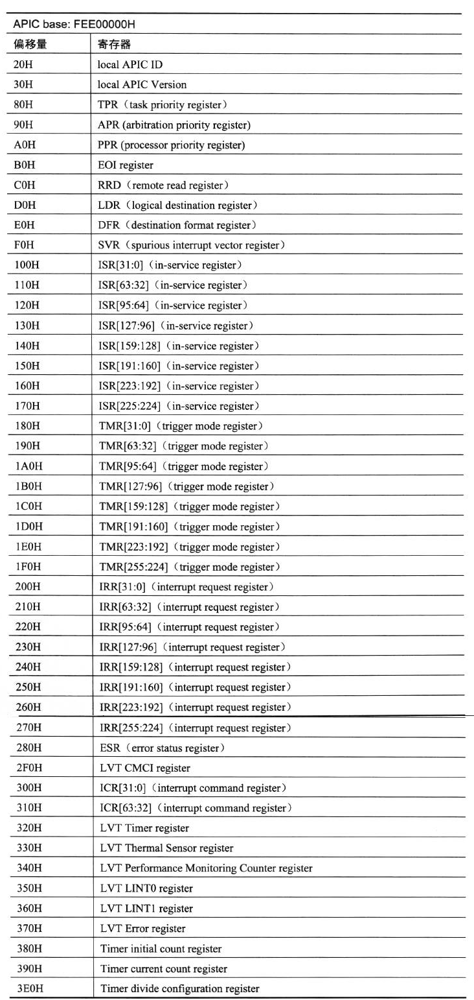
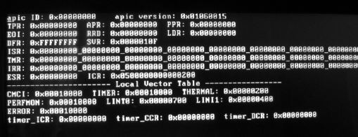

<!-- @import "[TOC]" {cmd="toc" depthFrom=1 depthTo=6 orderedList=false} -->

<!-- code_chunk_output -->

- [1. 两种寄存器映射方式](#1-两种寄存器映射方式)
- [2. local APIC寄存器地址](#2-local-apic寄存器地址)
  - [2.1. local APIC寄存器基地址](#21-local-apic寄存器基地址)
    - [2.1.1. local APIC寄存器重定位](#211-local-apic寄存器重定位)
- [3. local APIC寄存器列表](#3-local-apic寄存器列表)

<!-- /code_chunk_output -->

# 1. 两种寄存器映射方式

**APIC**和**xAPIC版本**中，local APIC寄存器映射到**物理地址**中。

而**x2APIC模式**中local APIC寄存器映射到**MSR寄存器组**。

# 2. local APIC寄存器地址

local APIC**寄存器的地址**是以**APIC\_BASE(在IA32\_APIC\_BASE寄存器中)作为基地址**，**每个local APIC寄存器**都有**自己对应的偏移量**，以**local APIC ID寄存器**的地址为例：它的**偏移量是20H**，那么**local APIC ID寄存器的地址就是APIC\_BASE+20H**。

## 2.1. local APIC寄存器基地址

local APIC寄存器的**基地址值**来自`IA32_APIC_BASE`寄存器。

当**处理器power\-up**或**reset**时**APIC base值为FEE00000h**。APIC base值的**宽度依赖于MAXPHYADDR值**（**36位，40位或52位**），**低12位为0**值，因此APIC base地址将在**4K页边界**上。

在**分页机制**下，由于**APIC base是物理地址(！！！**)，而**软件代码**里使用的是**virtual address**，因此系统必须负责**某个区域的virtual address映射到APIC base的物理地址(！！！**)上，以便于**在软件里使用MOV指令访问local APIC寄存器**。

代码清单18-6（lib\page32.asm）：

```asm
； 0x800000 映射到 0xFEE00000（Local APIC 区域）
      mov DWORD [PDT_BASE + 4 * 8]，0xFEE00000 | PS | PCD | PWT | RW | P
； PCD=1，PWT=1
      mov eax，[xd_bit]
      mov DWORD [PDT_BASE + 4 * 8 + 4]，eax          ； XD位
```

上面这段代码将**virtual address 0x800000**映射到**物理地址0xFEE00000**上，如果我们定义一个常量符号APIC\_BASE为0x800000值，那么：

```asm
mov eax，[APIC_BASE + SVR]   ;访问 local APIC 的 SVR
```

上面的代码就是**基于APIC\_BASE地址加上local APIC寄存器的偏移量来访问local APIC寄存器（！！！**)，其中APIC\_BASE的值就是0x800000。当然，如果愿意也可以使用一对一的映射形式（virtual address和physical address相等，也就是virtual address 0xFEE00000映射到物理地址0xFEE00000），我想没有OS会使用这样的映射方式。

值得注意的是，由于APIC base物理地址是提交到local APIC硬件上，因此APIC base的物理地址必须以stong uncacheable（不可cache）的内存类型映射。我们在映射的时候使用PCD=1，并且PWT=1的PAT属性来指定page的内存类型（关于PAT属性详情，请参考11.7节描述）。这段区域也可以指定为XD（Execute disable）类型

### 2.1.1. local APIC寄存器重定位

xAPIC版本的local APIC寄存器的地址允许被重定位，使用IA32\_APIC\_BASE寄存器提供一个新值。在开启分页机制的环境下，我们还必须考虑到上面所说的映射page的内存类型。

代码清单18-7（lib\apic.asm）：

```x86asm
；------------------------------------
； set_apic_base（）：设置 APIC base地址
； input：
；  esi：低 32 位，edi：高半部分
；------------------------------------
set_apic_base：
      call get_MAXPHYADDR    ； 得到MAXPHYADDR 值
      mov ecx，64
      sub ecx，eax
      shl edi，cl
      shr edi，cl       ； 去掉 MAXPHYADDR 以上的位
      mov ecx，IA32_APIC_BASE
      rdmsr
      mov edx，edi
      and esi，0xfffff000
      and eax，0x00000fff    ；保持原来的 IA32_APIC_BASE 寄存器低 12 位
      or eax，esi
      wrmsr
      ret
```

为了做得更好一些，这个set\_apic\_base（）函数通过得到MAXPHYADDR值来设置APIC base地址的宽度，这样的话，即使输入地址0xFFFFFFFF\_FFFFFFFFF也只能写入0x0000000F\_FFFFF000（在MAXPHYADRR为36的情况下）。

实验18-2：测试APIC base的重定位

在这个实验里，我们将APIC base默认的0xFEE00000地址，重定位在0xFEF00000位置上并进行对local APIC寄存器的读取。

代码清单18-8（topic18\ex18-2\protected.asm）：

```x86asm
mov esi，0xFEF00000    ； 重定位在 0xFEF00000 上
mov edi，0
call set_apic_base
```

这段代码输入0xfef00000地址给set\_apic\_base（）函数设置新的APIC base地址值，然后使用

```x86asm
mov esi，[APIC_BASE + 0xfef00000 - 0xfee00000 + SVR]
```
这条指令在新的APIC base地址上读取 SVR的值，这里需要计算新APIC base对应的virtual address值。


我们可以看到，这个结果中使用基于新APIC base地址的SVR值和原SVR的值是相同的，表明APIC base地址已经成功设置为新的地址。

# 3. local APIC寄存器列表

下面是local APIC寄存器的完整列表，**APIC寄存器的基地址是FEE00000H**。



这些local APIC寄存器共**占据了4K的页空间**，每个local APIC寄存器地址都是**16字节边界对齐**的，寄存器宽度分别为**32位、64位，以及256位**。

下面的**寄存器是256位**的。

① ISR（In-Service Register）。

② TMR（Trigger Mode Register）。

③ IRR（Interrupt Request Register）。

这些寄存器的**每一位**对应**一个中断vector（共256个interrupt vector**），而**64位寄存器**只有一个**ICR（Interrupt Command Register**），其余寄存器都是32位的。

因此，**访问一个完整的64位寄存器**需要进行**2次DWORD访问**，256位的寄存器需进行8次DWORD访问。

>实验18-3：打印local APIC寄存器列表

在这个实验里，笔者使用`dump_apic()`函数打印local APIC寄存器的信息，这个dump\_apic（）函数实现在lib\apic.asm文件里，函数比较长，为节省篇幅这里不列出来，读者可自行查阅。



这个图是运行在Westmere微架构移动Core i5处理器上的结果，这些local APIC寄存器的值经过了BIOS的初始化设置。除了LINT0、LINT1及Thermal寄存器外，其他的LVT寄存器都被mask（屏蔽）。