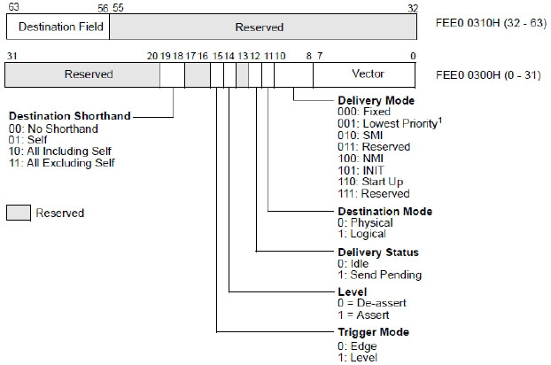

<!-- @import "[TOC]" {cmd="toc" depthFrom=1 depthTo=6 orderedList=false} -->

<!-- code_chunk_output -->

- [1. ICR寄存器](#1-icr寄存器)
- [2. Destination Shorthand域](#2-destination-shorthand域)
- [3. Destination Mode域](#3-destination-mode域)
- [4. Destination Field域](#4-destination-field域)
- [5. Lowest Priority模式](#5-lowest-priority模式)
- [6. Start Up模式](#6-start-up模式)

<!-- /code_chunk_output -->

# 1. ICR寄存器

**logical processor**可以使用**ICR（interrupt command register**）向**一个**或**一组logical processor**发送**inter-processor interrupt（IPI）进行通信**，如实验18-6所示。

上图是在**xAPIC模式**下，**64位**的ICR分为**两部分映射在物理地址**上，**高32位地址偏移量是310H，低32位地址偏移量是300H**

在**x2APIC模式**下使用**RDMSR和WRMSR指令**访问**64位的MSR地址是830H**。

**ICR与LVT寄存器部分域作用是相同的**，此外还新增了几个域。

# 2. Destination Shorthand域

这个域设置发送IPI消息的**目标类型**。

① 00（No Shorthand）：这个模式**用户可以提供发送的指定目标**。

② 01（Self）：logical processor给**自己发送IPI命令**。

③ 10（All including self）：给**所有logical processor发送IPI命令**，包括自己。

④ 11（All excluding self）：给所有logical processor发送IPI命令，但**不包括自己**。

# 3. Destination Mode域

这个域使用在**No Shorthand模式**中，提供**查找目标processor的方式**。

- 0为**physical方式**，
- 1为**logical方式**。

它们的使用依赖于**LDR（Logical Destination Register**）和**DFR（Destination Format Register**）。我们将在后面进行探讨。

# 4. Destination Field域

这个域提供**目标processor地址**。我们将在后面的发送IPI消息部分进行探讨。

在ICR的**delivery mode**里增加了**2个交付模式**：**Lowest Priority模式**和**Start Up模式**，**去掉了ExtINT模式**。

# 5. Lowest Priority模式

使用lowest priority交付模式匹配的**目标logical prcessor**或**一组logical processor**运行在**低优先级**下。

# 6. Start Up模式

logical processor可以发送**SIPI（Start\-Up IPI**）消息给**目标logical prcessor**或**一组logical processor**。

在MP系统里所有的AP（Application Processor，应用处理器）在完成自己的初始化后，进入`wait-for-SIPI`状态。

等待从**BSP（Bootstrap Processor，自举处理器）发送过来的SIPI消息**，然后每个AP处理器**执行自己的配置程序**。