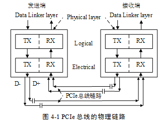
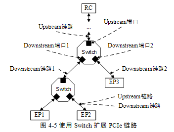

与PCI总线不同，PCIe总线使用端到端的连接方式，在一条PCIe链路的两端只能各连接一个设备，这两个设备**互为**是**数据发送端和数据接收端**。PCIe总线除了总线链路外，还具有多个层次，发送端发送数据时将通过这些层次，而接收端接收数据时也使用这些层次。**PCIe总线使用的层次结构与网络协议栈较为类似**。

## 1. 端到端的数据传递

PCIe链路使用“端到端的数据传送方式”，发送端和接收端中都含有TX(发送逻辑)和RX(接收逻辑)，其结构如图4‑1所示。

由上图所示，**在PCIe总线的物理链路的一个数据通路(Lane)中，由两组差分信号，共4根信号线组成**。其中发送端的TX部件与接收端的RX部件使用一组差分信号连接，该链路也被称为发送端的发送链路，也是接收端的接收链路；而发送端的RX部件与接收端的TX部件使用另一组差分信号连接，该链路也被称为发送端的接收链路，也是接收端的发送链路。一个PCIe链路可以由多个Lane组成。

## 3. PCIe总线的层次结构

PCIe总线采用了**串行连接方式**，并**使用数据包(Packet)进行数据传输**，采用这种结构有效**去除了在PCI总线中存在的一些边带信号**，如INTx和PME#等信号。在PCIe总线中，数据报文在接收和发送过程中，需要通过多个层次，包括事务层、数据链路层和物理层。PCIe总线的层次结构如图4‑4所示。

PCIe总线的层次组成结构与网络中的层次结构有类似之处，但是**PCIe总线的各个层次都是使用硬件逻辑实现**的。在PCIe体系结构中，数据报文首先在设备的核心层(Device Core)中产生，然后再经过该设备的事务层(Transaction Layer)、数据链路层(Data Link Layer)和物理层(Physical Layer)，最终发送出去。而接收端的数据也需要通过物理层、数据链路和事务层，并最终到达Device Core。

### 3.1 事务层

事务层定义了PCIe总线使用总线事务，其中**多数总线事务与PCI总线兼容**。这些总线事务可以**通过Switch等设备传送到其他PCIe设备或者RC**。RC也可以使用这些总线事务访问PCIe设备。

事务层接收来自PCIe设备核心层的数据，并将其封装为TLP(Transaction Layer Packet)后，发向数据链路层。此外事务层还可以从数据链路层中接收数据报文，然后转发至PCIe设备的核心层。

事务层的一个重要工作是处理PCIe总线的“序”。在PCIe总线中，“序”的概念非常重要，也较难理解。在PCIe总线中，事务层传递报文时可以乱序，这为PCIe设备的设计制造了不小的麻烦。事务层还使用流量控制机制保证PCIe链路的使用效率。有关事务层的详细说明见第6章。

### 3.2 数据链路层

数据链路层保证来自发送端事务层的报文可以可靠、完整地发送到接收端的数据链路层。来自事务层的报文在通过数据链路层时，将被**添加Sequence Number前缀和CRC后缀**。数据链路层使用ACK/NAK协议保证报文的可靠传递。

PCIe总线的数据链路层还定义了多种DLLP(Data Link Layer Packet)，DLLP产生于数据链路层，终止于数据链路层。值得注意的是，TLP与DLLP并不相同，**DLLP并不是由TLP加上Sequence Number前缀和CRC后缀组成的**。

### 3.3 物理层

**物理层是PCIe总线的最底层，将PCIe设备连接在一起**。PCIe总线的物理电气特性决定了PCIe链路只能使用端到端的连接方式。**PCIe总线的物理层为PCIe设备间的数据通信提供传送介质**，为数据传送提供可靠的物理环境。

物理层是PCIe体系结构最重要，也是最难以实现的组成部分。PCIe总线的物理层定义了LTSSM(Link Training and Status State Machine)状态机，PCIe链路使用该状态机管理链路状态，并进行链路训练、链路恢复和电源管理。

PCIe总线的物理层还定义了一些专门的“序列”，有的书籍将物理层这些“序列”称为PLP(Phsical Layer Packer)，这些序列用于同步PCIe链路，并进行链路管理。值得注意的是PCIe设备发送PLP与发送TLP的过程有所不同。对于系统软件而言，物理层几乎不可见，但是系统程序员仍有必要较为深入地理解物理层的工作原理。

## 4. PCIe链路的扩展

PCIe链路使用端到端的数据传送方式。在一条PCIe链路中，这两个端口是完全对等的，分别连接发送与接收设备，而且一个PCIe链路的一端只能连接一个发送设备或者接收设备。因此**PCIe链路必须使用Switch扩展PCIe链路后，才能连接多个设备**。使用Switch进行链路扩展的实例如图4‑5所示。

在PCIe总线中，Switch（这里的Switch指传统Switch，在MR-IOV中的不同）是一个特殊的设备，该设备由1个上游端口和2~n个下游端口组成。PCIe总线规定，**在一个Switch中可以与RC直接或者间接相连（也就是指通过其他Switch再与RC相连）的端口为上游端口**，在PCIe总线中，RC的位置一般在上方，这也是上游端口这个称呼的由来。在Switch中除了上游端口外，其他所有端口都被称为下游端口。下游端口一般与EP相连，或者连接下一级Switch继续扩展PCIe链路。其中与上游端口相连的PCIe链路被称为上游链路，与下游端口相连的PCIe链路被称为下游链路。

上游链路和下游链路是一个相对的概念。如上图所示，**Switch与EP2连接的PCIe链路，对于EP2而言是上游链路，而对Switch而言是下游链路**。

在上图所示的Switch中含有3个端口，其中一个是上游端口(Upstream Port)，而其他两个为下游端口(Downstream Port)。其中上游端口与RC或者其他Switch的下游端口相连，而下游端口与EP或者其他Switch的上游端口相连。

在Switch中，还有两个与端口相关的概念，分别是Egress端口和Ingress端口。这两个端口与通过Switch的数据流向有关。其中**Egress端口指发送端口，即数据离开Switch使用的端口；Ingress端口指接收端口即数据进入Switch使用的端口**。

Egress端口和Ingress端口与上下游端口没有对应关系。在Switch中，上下游端口可以作为Egress端口，也可以作为Ingress端口。如图4‑5所示，RC对EP3的内部寄存器进行写操作时，Switch的上游端口为Ingress端口，而下游端口为Egress端口；当EP3对主存储器进行DMA写操作时，该Switch的上游端口为Egress端口，而下游端口为Ingress端口。

PCIe总线还规定了一种特殊的Switch连接方式，即Crosslink连接模式。支持这种模式的Switch，其上游端口可以与其他Switch的上游端口连接，其下游端口可以与其他Switch的下游端口连接。

PCIe总线提供CrossLink连接模式的主要目的是为了解决不同处理器系统之间的互连，如图4‑6所示。使用CrossLink连接模式时，虽然从物理结构上看，一个Switch的上/下游端口与另一个Switch的上/下游端口直接相连，但是这个PCIe链路经过训练后，仍然是一个端口作为上游端口，而另一个作为下游端口。

处理器系统1与处理器系统2间的数据交换可以通过Crosslink进行。当处理器系统1(2)访问的PCI总线域的地址空间或者Requester ID不在处理器系统1(2)内时，这些数据将被Crosslink端口接收，并传递到对端处理器系统中。Crosslink对端接口的P2P桥将接收来自另一个处理器域的数据请求，并将其转换为本处理器域的数据请求。

使用Crosslink方式连接两个拓扑结构完全相同的处理器系统时，仍然有不足之处。假设图4‑6中的处理器系统1和2的RC使用的ID号都为0，而主存储器都是从0x0000-0000开始编址时。当处理器1读取EP2的某段PCI总线空间时，EP2将使用ID路由方式，将完成报文传送给ID号为0的PCI设备，此时是处理器2的RC而不是处理器1的RC收到EP2的数据。因为处理器1和2的RC使用的ID号都为0，EP2不能区分这两个RC。

由上所述，使用Crosslink方式并不能完全解决两个处理器系统的互连问题，因此在有些Switch中支持非透明桥结构。这种结构与PCI总线非透明桥的实现机制类似，本章对此不做进一步说明。

使用非透明桥仅解决了两个处理器间数据通路问题，但是不便于NUMA结构对外部设备的统一管理。PCIe总线对此问题的最终解决方法是使用MR-IOV技术，该技术要求Switch具有多个上游端口分别与不同的RC互连。目前PLX公司已经可以提供具有多个上游端口的Switch，但是尚未实现MR-IOV技术涉及的一些与虚拟化相关的技术。

即便MR-IOV技术可以合理解决多个处理器间的数据访问和对PCIe设备的配置管理，使用PCIe总线进行两个或者多个处理器系统间的数据传递仍然是一个不小问题。因为PCIe总线的传送延时仍然是制约其在大规模处理器系统互连中应用的重要因素。