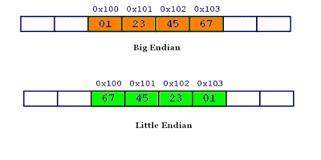

<!-- @import "[TOC]" {cmd="toc" depthFrom=1 depthTo=6 orderedList=false} -->

<!-- code_chunk_output -->

- [1. 数字](#1-数字)
  - [1.1. 二进制数字](#11-二进制数字)
  - [1.2. 八进制数字](#12-八进制数字)
  - [1.3. 十进制数字](#13-十进制数字)
  - [1.4. 十六进制数字](#14-十六进制数字)
  - [1.5. base值](#15-base值)
- [2. 二进制数](#2-二进制数)
- [3. 二进制数的排列](#3-二进制数的排列)
  - [3.1. 什么是MSB？什么是LSB？](#31-什么是msb什么是lsb)
  - [3.2. 小端序与大端序: 以字节为单位的排序方式](#32-小端序与大端序-以字节为单位的排序方式)

<!-- /code_chunk_output -->

# 1. 数字

>各个进制数的数字

## 1.1. 二进制数字

包括0和1

## 1.2. 八进制数字

包括0，1，2，3，4，5，6，7。

## 1.3. 十进制数字

包括0，1，2，3，4，5，6，7，8，9。

## 1.4. 十六进制数字

包括0，1，2，3，4，5，6，7，8，9及字母A，B，C，D，E，F。

## 1.5. base值

**各个进制**以相应的数字表达的计数范围作为base值，如：二进制的base值是2，八进制的base值是8，十进制的base值是10，十六进制的base值是16。

# 2. 二进制数

二进制数是**计算机运算的基础**，无论**何种制式的数**，在计算机中都是以**二进制形式存放**的。

由**二进制数字**组成的**数字序列**是**二进制数**，如下所示。



二进制数组合里，每个数位被称为bit（位），能表达值0和1。二进制数的base值是2，那么在n个二进制数字的序列中，其值为


这是一个数学上的算式。这个值是十进制值。

# 3. 二进制数的排列

在**日常的书写或表达**上，**最左边**的位是**最高位**。数的位排列从左到右，对应的值从高到低。

可是在**机器的数字电路**上，数的**高低位**可以**从左到右**进行排列，也可以**从右到左**进行排列。这样就产生了**MSB**和**LSB**的概念。

## 3.1. 什么是MSB？什么是LSB？

以一个自然的二进制表达序列上**32位**的二进制数为例，**最右边**是`bit 0`，**最左边**是`bit 31`。那么

* `bit 0`就用**LSB（Least Significant Bit，最低有效位**）来表示，
* `bit 31`就用**MSB（Most Significant Bit，最高有效位**）来表示。

MSB也用做符号位（1为负，0为正），但若在**无符号数**上，则MSB就是**数的最高位**，LSB是数的最低位。

无论一个数在机器上是从左到右排列，还是从右到左排列，使用MSB和LSB的概念都很容易对其二进制形式进行描述说明。

## 3.2. 小端序与大端序: 以字节为单位的排序方式

**二进制数**在计算机的**组织存放**中，**地址**由**低位**到**高位**对应着两种排列。

① **低位字节**在前，**高位字节**在后，这就是**小端字节序**（little-endian）排法。

② **高位字节**在前，**低位字节**在后，这就是**大端字节序**（big-endian）排法，这是人类读写数值的方法。

举例来说, `0x1234567`的**大端字节序**和**小端字节序**的写法如下图。



注: 计算机中的**地址**都是以**字节(8bit)为单位**进行**编址**的, 也就是说**一个地址**(比如0x100)存放的是**一个字节的数字**(共8 bit). 而这里的大小端都是**一个字节一个字节排序**, **字节**本身**内部的排序**这里先不涉及.

在**x86/x64**体系中使用的是**小端序存储格式**，也就是：**MSB**对应着**存储器地址的高位**，**LSB**对应着**存储器地址的低位**。

在有些RISC（精简指令集计算机）体系里，典型的如Power/PowerPC系列，使用大端序排法。即在由低到高的地址位里，依次存放MSB到LSB。亦即：MSB存放在存储器地址的低位，LSB存放在高位。

代码清单1-1：

```
mov dword [Foo]，1
test byte [Foo]，1                                ； 测试 LSB 是否存放在低端上
jnz IS_little_endian                              ； 是小端序
```

上面的代码将**1**存放在**32位**的**内存**里，通过**读取内存的低字节**来判断1到底存放在**低字节**还是**高字节**，从而区分是小端序还是大端序。

某些RISC机器上是可以在大端序与小端序存储序列之间做选择的。大端序格式看上去更符合人类表达习惯，而小端序看上去不那么直观，不过这对于计算机的处理逻辑并无影响。

>实验1-1：测试字节内的位排列

**字节内的位**是否有**大端序**和**小端序之分**？这似乎没有定论，我们不是硬件设计人员，很难做出判断。笔者倾向于认为位的排列是区分的。

从代码清单1-1我们可以测试机器是属于小端序还是大端序，原理是根据**字节**在**内存**中的**存储序列**进行判断。对代码稍做修改，即可用来测试位的排列，如代码清单1-2所示。

代码清单1-2（topic01\ex1-1\boot.asm）：