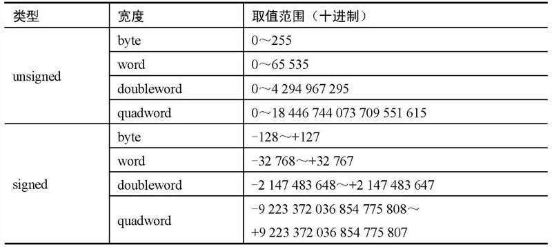

# 指令处理的数据类型

在x86/x64体系中, **指令处理的数据**分为`fundamental`（基础）和`numeric`（数值）两大类。

## fundamental基础类型

- **基础类型**包括：`byte`（8位），`word`（16位），`doubleword`（32位），以及`quadword`（64位），它们代表指令能一次性处理的**数据宽度**。

## numeric数值类型

- **numeric数据类型**使用在**运算类指令**上，总结来说x86/x64体系的**运算类指令**能处理下面**四大类数据**。

    ① `integer（整型数）`：包括**unsigned类型**和**singed类型**。

    ② `floating-point（浮点数）`：包括`single-precision floating-point`（单精度浮点数），`double-precision floating-point`（双精度浮点数），以及`double extended-precision floatingpoint`（扩展双精度浮点数）。

    ③ `BCD（binary-code decmial integer）`：包括`non-packed BCD码`和`packed-BCD码`。

    ④ `SIMD（single instruction，multiple data）`：这是属于`packed类型`的数据。

SIMD数据是在一个operand（操作数）里集成了多个integer、floating-point或者BCD数据。SIMD指令可以一性次同时处理这些数据。

# integer数

在计算机处理中，**整数**会区分**signed**（`有符号数`）和**unsigned**（`无符号数`）两种情况，数值的**MSB值**被作为**符号位**。每个数值类型有自己的取值范围，如下所示。



可是在计算机中根本无法判断一个整数是signed数还是unsigned数。例如0ABh这个整数就无法知道它是signed数还是unsigned数。

计算机能做到的是：在整数的使用中，在应该使用signed数的场合下认为它是signed数，而在使用unsigned数的场合下认为它是unsigned数。

在这种假定下，即使不是signed数也会被当做signed数进行处理。既然这样，在计算机运算中就无须判断是signed数还是unsigned数，只需假定它是signed数或是unsigned数。

而在浮点数上，每个浮点数都有符号位，因此浮点数能够清楚地识别它就是signed数。所以浮点数不存在unsigned数的情况。

在x86机器上，对整数的加减法运算过程中不会识别signed数与unsigned数，而根据signed与unsigned两种运算结果进行相应的eflags标志位设置。

代码清单1-3：

```asm
mov eax，0x70000000
mov ebx，0x80000000
sub eax，ebx
```

上面的代码中，0x70000000和0x80000000是signed数还是unsigned数呢？

二进制运算结果值是0xF0000000，指令会同时对结果进行两种分析设置。

## 为signed时

假定运算双方是signed数时，这个结果是错误的，它产生了溢出。它会置eflags寄存器的OF（Overflow Flag）标志为1，以及SF（Sign Flag）标志为1，表示结果为负数。

## 为unsigned时

假定双方是unsigned数时，它会置CF（Carry Flag）标志为1，表示产生了借位。

因此：这条指令会同时对OF、SF及CF标志置位。而对这个结果如何运用那是程序员的职责。

另外，RISC体系的机器普遍会在指令层上做假定运算，如在MIPS机器上add是进行signed数相加，addu是进行unsigned数相加，对指令进行了区分，明确了使用场合。

x86的乘法和除法指令也进行了区分，mul是无符号数乘法，imul是符号数乘法，div是无符号除法，idiv是符号数除法。另外，所有的条件转移、条件传送、条件设置指令会对指令运算的结果进行signed与unsigned的区分。

## 整数运算规则

当假定它是signed数时，这个数需要使用另一种形式去解析，这就产生了signed数的表示方法。signed的表示法是以MSB（Most Significant Bit）作为符号位，MSB为1时是负数，MSB为0时为正数。



以32位的数为例：0是正数的最小值，0x7FFFFFFF是正数的最大值，0x80000000是负数的最小值，0xFFFFFFFF是负数的最大值，超过这个表达范围就产生了溢出情况。

>