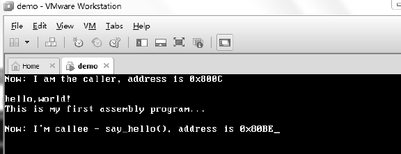

按照惯例, 先看看"Hello, World"的汇编版.

>实验2-1：hello world程序

下面的代码相当于C语言`main()`里的代码。

代码清单2-1（topic02\ex2-1\setup.asm）：

```assembly
main：                                                                     ;这是模块代码的入口点。
      mov si，caller_message
      call puts                                                          ； 打印信息
      mov si，current_eip
      mov di，caller_address
current_eip：
      call get_hex_string          ； 转换为 hex
      mov si，caller_address
      call puts
      mov si，13                                                          ； 打印回车
      call putc
      mov si，10                                                          ； 打印换行
      call putc
      call say_hello           ； 打印信息
      jmp $
caller_message        db 'Now：I am the caller，address is 0x'
caller_address        dq 0
hello_message         db 13，10，'hello，world！'，13，10 db 'This is my first assembly program...'，13，10，13，10，0
callee_message        db "Now：I'm callee - say_hello（），address is 0x"
callee_address        dq 0
```

实际上这段汇编语言相当于下面的几条C语言语句。

```cpp
int main（）
{
      printf（"Now：I am the caller，address is 0x%x"，get_hex_string（current_eip））；
      printf（"
      "）；
      say_hell0（）；                /* 调用 say_hello（） */
}
```

相比而言，汇编语言的代码量就大得多了。下面是say\_hello（）的汇编代码。

代码清单2-2（topic02\ex2-1\setup.asm）：

```
；-------------------------------------------； say_hello（）
；-------------------------------------------
say_hello：
      mov si，hello_message
      call puts
      mov si，callee_message
      call puts
      mov si，say_hello
      mov di，callee_address
      call get_hex_string
      mov si，callee_address
      call puts
      ret
```

这个say_hello（）也仅相当于以下几条C语句。

```cpp
void say_hello()
{
    printf（"hello，world, This is my first assembly program..."）；
    printf（"Now：I'm callee - say_hello（），address is 0x%x"，get_hex_string（say_hello））；
}
```

代码清单2-1和2-2就组成了我们这个**16位实模式**下的汇编语言版本的hello world程序，它在VMware上的运行结果如下所示。



当然仅这两段汇编代码还远远不能达到上面的运行结果，这个例子中背后还有boot.asm和lib16.asm的支持，boot.asm用来启动机器的MBR模块，lib16.asm则是16位实模式下的库（在lib\目录下），提供类似于C库的功能。

main（）的代码被加载到内存0x8000中，lib16.asm的代码被加载到0x8a00中，作为一个共享库的形式存在。这个例子里的全部代码都在topic02\ex2-1\目录下，包括boot.asm源文件和setup.asm源文件，而lib16.asm则在x86\source\lib\目录下。main（）所在的模块是setup.asm。

>16位？32位？还是64位？

在机器启动时处理器工作于16位实模式。这个hello world程序工作于16位实模式下，在编写代码时，需要给nasm指示为16位的代码编译，在代码的开头使用bits 16指示字声明。

>bits 32指示编译为32位代码，bits 64指示编译为64位代码。