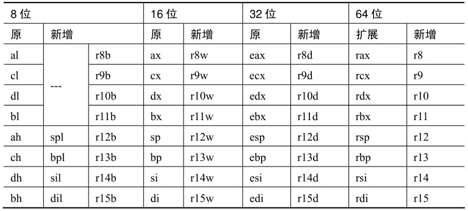

在nasm中可以在同一个源代码文件里同时指出16位代码、32位代码，以及64位代码。

```
bits 16
… …                               ; 以下是 16位代码
bits 32
… …                               ; 以下是 32位代码
bits 64
… …                               ; 以下是 64位代码
```

不用担心这里会有什么问题，编译器会为每部分生成正确的机器指令。关于16位机器码、32位机器码以及64位机器码，详见笔者个人网站里的《x86/x64指令系统》篇章，地址为 http：//www.mouseos.com/x64/default.html 。

>16位编程、32位编程，以及64位编程有什么不同之处？

这确实需要简单了解一下。

#通用寄存器

在16位和32位编程里，可以使用的通用寄存器是一样的，如下所示。



在16位编程里可以使用32位的寄存器，在32位编程里也可以使用16位的寄存器，编译器会生成正确的机器码。

```
bits 16      ； 为16 位代码而编译
mov eax，1                   ； 机器码是：66 b8 01 00 00 00
```

上面这段代码为16位代码编译，使用了32位的寄存器，编译器会自动加上default operand-size override prefix（66H字节），这个66H字节用来调整为正确的操作数。

```
bits 32      ； 为32位代码而编译
mov eax，1                   ； 机器码是：b8 01 00 00 00
```

这段代码的汇编语句是完全一样的，只不过是为32位代码而编译，它们的机器码就是不一样的。

在x64体系里，在原来的8个通用寄存器的基础上新增了8个寄存器，并且原来的寄存器也得到了扩展。在64位编程里可以使用的通用寄存器如下表所示。



在64位编程里可以使用20个8位寄存器，和16个16位、32位及64位寄存器，寄存器体系得到了完整的补充。

所有的16个寄存器都可以分割出相应的8位、16位或32位寄存器。在16位编程和32位编程里，sp、bp、si及di不能使用低8位。在64位编程里，可以使用分割出的spl、bpl、sil及dil低8位寄存器。

64位的r8～r15寄存器分割出相对应的8位、16位及32位寄存器形式为：r8b～r15b、r8w～r15w，以及r8d～r15d。

```

bits 64      ； 为64位代码编译
mov r8b，1
mov spl，r8b
```

比如上面这两条指令必须在64位下使用，r8b和spl寄存器在16位和32位下是无效的。

2.4.2 操作数大小

在16位编程和32位编程下，寄存器没有使用上的不便，32位的操作数依旧可以在16位编程里使用，而16位的操作数也可以在32位编程下使用。


bits 16
push word 1                         ； 16位操作数
push dword 1                        ； 32位操作数
call ax       ； 16 位操作数
call eax       ； 32 位操作数
bits 32
push word 1                         ； 16位操作数
push dword 1                        ； 32位操作数
call ax       ； 16 位操作数
call eax       ； 32 位操作数

上面的代码完全可以用在16编程和32位编程