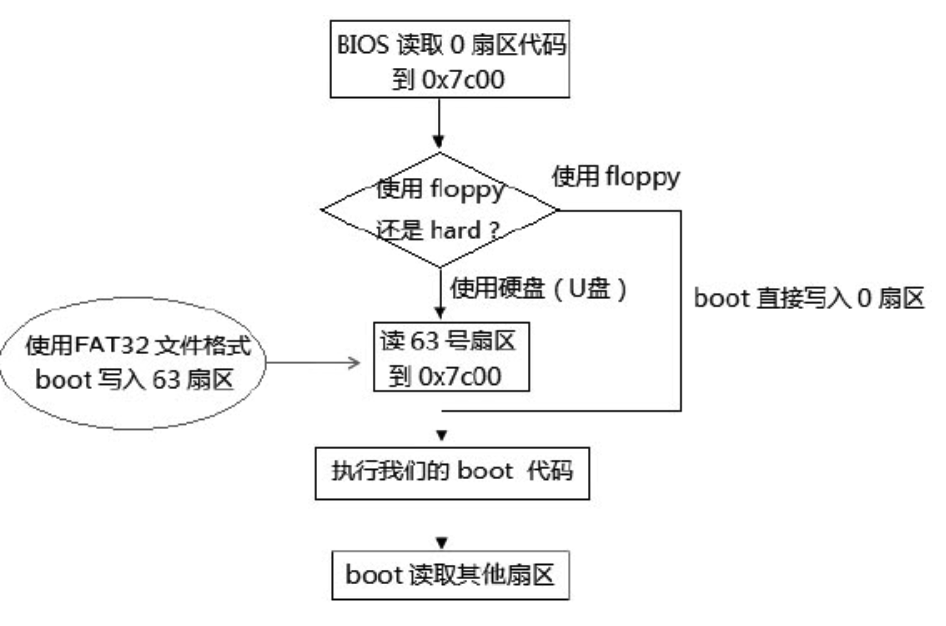

本书的实验例子可运行在三种环境中.

⓵ **Bochs模拟器**: 任何支持x64的版本都可以

⓶ **VMware虚拟机**

⓷ **真实机器**上

本书很多实验**只能在真实机器**上运行, Bochs和VMware并不能支持那些功能.

>问题1: 使用软盘还是U盘? 甚至是硬盘?

在Bochs中可以使用软盘或硬盘的映像(image)文件, 在真实机器上我们可以使用U盘作为介质启动计算机运行实验程序. 本书例子运行使用以下三种介质.

⓵ 软盘映像: 统一使用文件名为**demo.img**, 可以在**bochs**或**vmware**里运行.

⓶ 硬盘映像: 统一使用文件名为**c.img**, 可以在**bochs**里运行

⓷ U盘: 将生成的硬盘映像直接写入U盘, 在**真实机器**上运行.

因此, 本书例子最终生成**两个映像文件**: demo.img用于bochs或vmware里运行; c.img用于在bochs或真实机器上运行.

# 使用FAT32文件格式

在使用软盘启动时，我们直接将boot代码写在MBR里。而当使用U盘启动时会遇到一些麻烦，我们的代码写在MBR里, 某些机器将启动不了.

因此, 当使用U盘在真实机器上测试时, 将使用FAT32文件格式, 也就是硬盘映像c.img使用FAT32文件格式.

如下,对于软盘映像(demo.img)和硬盘映像(c.img), 两种文件组织形式

⓵ 软盘映像文件(demo.img): 将boot模块直接写入软盘的0扇区, 那么boot代码就是我们的MBR程序, **BIOS**将读软盘的0扇区(boot代码)到内存的7c00h位置.

⓶ 硬盘映像文件(c.img)和U盘: 将boot模块写入映像文件和U盘的63号扇区, BIOS读取硬盘或U盘的0扇区(这是FAT32文件格式启动盘生成的MBR代码)代码到内存7c00h, 然后再由这个MBR代码来从63号扇区读取我们的boot程序.

无论如何, boot程序最终是运行在7c00h区域里, boot程序的职责是负责加载后续的模式(包括lib16、lib32、lib64、protected和long模式)。

