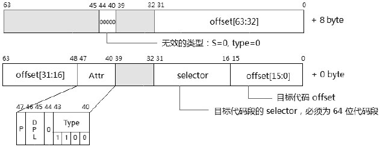

<!-- @import "[TOC]" {cmd="toc" depthFrom=1 depthTo=6 orderedList=false} -->

<!-- code_chunk_output -->

- [1. 概述](#1-概述)
- [2. 处理器模式的判断](#2-处理器模式的判断)
- [3. 64位模式下的代码段和数据段描述符](#3-64位模式下的代码段和数据段描述符)
- [4. Long-mode的gate描述符](#4-long-mode的gate描述符)
- [5. Long-mode的描述符表结构](#5-long-mode的描述符表结构)
- [6. Long-mode模式的段寄存器](#6-long-mode模式的段寄存器)
  - [6.1. 设置FS和GS的base值](#61-设置fs和gs的base值)
  - [6.2. 交换GS.base值](#62-交换gsbase值)
- [7. Long-mode的paging机制](#7-long-mode的paging机制)

<!-- /code_chunk_output -->

# 1. 概述

long\-mode存在两个子模式：**64位模式**和**compatibility模式**。因此在long\-mode可能存在两个不同的执行环境：64位模式的执行环境和compatibility模式执行环境。

在compatibility模式下，处理器的行为与legacy模式一般无异。在64位模式下，处理器可使用的物理资源得到扩展。

# 2. 处理器模式的判断

当Code segment descriptor被加载到CS寄存器时，CS内部cache内的属性得到更新，我们使用下面的逻辑来判断处理器处于什么模式。

```c
if （IA32_EFER.LMA == 1）  /* long-mode */
{
      if （CS.L == 0）
      {
                           /* 处于 compatibility 模式 */
      }
      else if （CS.L == 1 && CS.D == 0）
      {
                           /* 处于 64位模式 */
      }
}
else
{
                           /* legacy 模式 */
}
```

IA32\_EFER寄存器的LMA位用来判断处理器是否处于long\-mode，CS.L标志位用来判断是否处于64位模式。
在long\-mode下，有效的64位模式标志是：CS.L=1并且CS.D=0。而CS.L=1并且CS.D=1这个组合是无效的。在加载CS寄存器时，处理器判断到CS.L=1并且CS.D=1会产生\#GP异常。（从这个角度看，实际只需要判断CS.L是否为1就足够了。）

# 3. 64位模式下的代码段和数据段描述符

和legacy模式一样，在**64位模式**下，**代码段和数据段描述符(！！！**)仍然是**8字节宽(！！！**)，然而大部分域和属性都是无效的。


在上面的代码段描述符里，S标志（bit 44）和C/D标志（bit 43）固定为1值。实际上，在属性域里仅有C、DPL、P、L，以及D标志位是有效的。

**L和D标志位**控制处理器在long\-mode**子模式的选择**及其**default operand size（默认操作数大小**）。


在**数据段描述符**里，S标志（bit 44）为1，C/D标志（bit 43）为0。W标志（bit 41）仅用于作为Stack段描述符时，处理器在加载时会检查stack段必须为Writable（可写的）段。而DPL和P标志在加载时会使用，当加载成功后，这些属性都被忽略。

# 4. Long-mode的gate描述符

在**long\-mode**下，所有的**gate描述符**的类型都是**64位的（描述符的宽度为16字节！！！**），包括：

① 64位**Call\-gate**。

② 64位**Interrupt\-gate**。

③ 64位**Trap\-gate**。

值得注意的是，在compatibility模式下**这些gate描述符类型也是64位**的，这根本决定了运行在compatibility模式下的代码当进入0级权限后（通过调用call gate，或者通过中断调用方式），必须从compatibiltiy模式切换到64位模式。


在long\-mode下，gate描述符的类型除上表所列的值外，其他值都是无效的。



Call\-gate描述符type值为1100B。由于call\-gate放在GDT或LDT表里，因此在高8字节的S标志为0，type值为0，这是一个无效的描述符类型，用来防止对它的错误引用（即高8字节被错误当做段描述符来使用）。


Interrupt\-gate和Trap\-gate描述符的结构是完全相同的，当type值为1110B时为Interrupt\-gate，当type值为1111B时Trap\-gate。

**在Interrupt/Trap\-gate描述符里增加了一个IST域**，可以为interrupt handler提供**额外的stack指针**，当**IST值为非0**时，IST值用来在**当前TSS块**里查找**相应的stack指针值**。

值得注意的是，在long\-mode下并**不存在Task\-gate描述符**，基于**TSS的任务切换机制将不再支持**。

**中断门和陷阱门描述符都只允许存放在IDT内（！！！**），**任务门可以位于GDT、LDT和IDT中（！！！**）

# 5. Long-mode的描述符表结构

在long\-mode下，除了IDT内的**描述符固定为16字节**外。GDT和LDT与legacy模式下一般无异（call gate是16字节外）。


在这个GDT里可能会存在**call\-gate描述符**，它在long\-mode下是**16字节**，它的高8位S与type值为0，可以有效地区别于其他的描述符。


如上所示，在long\-mode模式下**GDTR和IDTR寄存器**的**base值被扩展为64位**，而limit值仍然是16位不变。**即使在compatibility模式**下，GDTR.base与IDTR.base都是**64位**。

然而，在compatibiltiy模式下，所有段寄存器的base值只能使用低32位。例如：FS.base在64位模式使用64位基地址，而在compatibility模式下只能使用低32位。

**GDT内的TSS与LDT描述符**在**compatibility模式**下是32位类型的，这与legacy模式下是一样的。在compatiblity模式下加载TSS或LDT描述符，处理器会以legacy模式的行为进行加载。


在compatibility模式下，**LDT描述符**与legacy模式是一致的（32位TSS类型**8字节宽**），而在**64位模式**下**LDT描述符**也被扩展为**64位LDT 16字节宽**。

与call\-gate描述符同样的处理手法，高8字节的S和type值为0。


在64位模式下，LDTR寄存器与TR寄存器的base值扩展为64位，而在compatibility模式下与legacy模式下是一致的（base值仍然使用32位）。

对于**TSS段**的结构在64位模式和compatibility模式下也会不同，如上所示，**在64位模式下使用16字节宽**, 在compatibility模式还是使用32位格式的TSS段。

**LDT和TSS**在系统中可能有**很多个**, 所以需要在**GDT**中添加**每个LDT**和**每个TSS的描述符**, 用来查找. 而**IDT是没有描述符**的, 因为**IDT在系统中就只有一个**, **IDTR指向**就可以, 永远不变,  **不需要在GDT中存在一个IDT的描述符**.

当要使用这些**LDT**时，可以用它们的**选择子(32位下TSS中有一个IDT段选择符！！！**)来访问GDT，将**LDT描述符**加载到LDTR寄存器。

# 6. Long-mode模式的段寄存器


**段寄存器的base域**在**64位模式**下被扩展为**64位**，对于**CS、ES、SS和DS(！！！**)寄存器来说这个**64位的基值没什么意义**。在64位模式下，这些**段的基值都被强制为0值(！！！**)。

**64位的段基值**对于**FS和GS寄存器**来说才有意义，**FS和GS寄存器(！！！**)可以由**软件设置非0的64位值**。

## 6.1. 设置FS和GS的base值

使用**代码段或数据段描述符(！！！**)的**加载方法**，只能加载一个**32位的base值**，在**x64体系**中，新增了两个MSR寄存器：**IA32\_FS\_BASE**和**IA32\_GS\_BASE**。它们分别映射到**FS.base和GS.base**。

```assembly
;;设置 FS.base
      mov ecx，IA32_FS_BASE
      mov eax，fs_base_low32  ； 低 32 位
      mov edx，fs_base_hi32  ； 高 32 位
      wrmsr
;;设置 GS.base
      mov ecx，IA32_GS_BASE
      mov eax，gs_base_low32  ； 低 32 位
      mov edx，gs_base_hi32  ； 高 32 位
      wrmsr
```

如上所示，对这两个寄存器进行写可以设置相应的64位base值。

## 6.2. 交换GS.base值

**SYSCALL指令**使用一个特殊的方式来达到**设置RSP寄存器的目的**，x64体系提供了另一个寄存器：**IA32\_KERNEL\_GS\_BASE**。

**IA32\_KERNEL\_GS_BASE寄存器**用来保存**OS的kernel数据结构**。

```assembly
      mov rax，kernel_data_table
      mov rdx，rax
      Shr rdx，32
      mov ecx，IA32_KERNEL_GS_BASE
      wrmsr
;;kernel数据结构示例
Kernel_data_table：
      Kernel_stack_pointer dq 0xfffff80000fffff0  ； RSP 值
      ... ...
```

在**syscall指令**进入的**系统服务例程**里，使用**SWAPGS指令**来**交换GS.base**与**IA32\_KERNEL\_GS\_BASE寄存器的值(下面操作很重要！！！**)。

```assembly
syscall_service：
      swapgs            ;交换GS.base与IA32_KERNEL_GS_BASE 值
      mov rsp，gs：[0]  ;获得 kernel 的 stack 指针
      push rbp          ;在 kernel stack 上保存数据
      ... ...
      pop rbp
      swapgs            ;退出前交换回原来的 GS.base 值
      db 0x48
      sysret
```

当然，IA32\_KERNEL\_GS\_BASE寄存器并不只是使用在获取RSP值上，完全可以作为他用。

# 7. Long-mode的paging机制

在long\-mode下只能使用一种分页模式（long\-mode分页模式，或者说IA\-32e paging模式），在IA\-32e paging模式下，使用4级的页转换表结构。在x64体系中，在64位模式里实现的最高线性地址为48位。这48位的线性地址在4K页面映射下被分割成5个部分：

① PML4TE index（bit 47～bit 39）。

② PDPTE index（bit 38～bit 30）。

③ PDE index（bit 29～bit 21）。

④ PTE index（bit 20～bit 12）。

⑤ page offset（bit 11～bit 0）。

IA\-32e paging能使用的页面大小为：4K页，2M页，以及1G页。关于IA-32e paging分页模式，详情请参考11.5节。