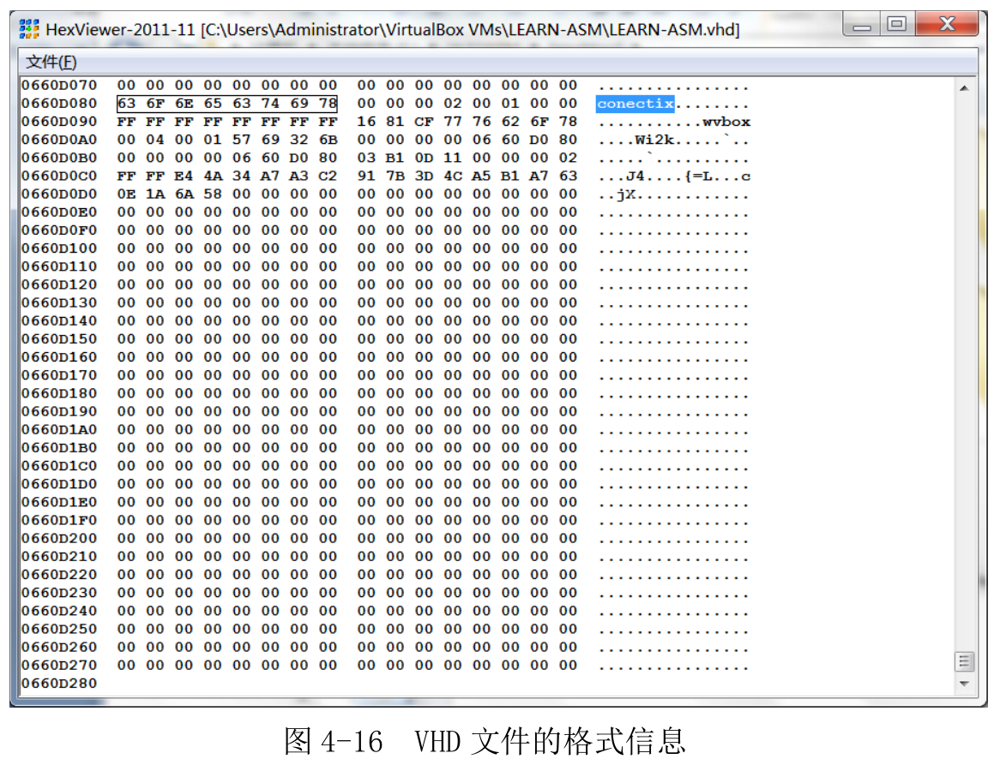

# 虚拟机是软件

# 下载安装Oracle VM VirtualBox

使用Oracle VM VirtualBox，虚拟硬盘使用固定尺寸的 VHD。

VHD 规范最早起源于Connectix 公司的虚拟机软件 Connectix Virtual PC，2003 年，微软公司收购了它并改名为 Microsoft Virtual PC。2006 年，微软公司正式发布了 VHD 虚拟硬盘格式规范。

VDI是VirtualBox自己的虚拟硬盘规范, VMDK是VMware的虚拟硬盘规范. 本书例子使用"VHD(Virtual Hard Disk)".

VHD也分为两种类型: 固定尺寸和动态分配的. 本书使用固定尺寸的VHD.

## 虚拟硬盘简介

采用**固定尺寸的VHD虚拟硬盘**，因为其**简单性**。它**仅包含两部分**，前面是**数据区**，用来**模拟实际的硬盘空间**，后面跟一个**512字节的结尾**。（2004年前规范是511字节）

要**访问硬盘**，运行中的程序必须至少向**硬盘控制器**提供**4个参数**，分别是**磁头号**、**磁道号**、**扇区号**，以及**访问意图（读还是写**）。

磁盘读写以**扇区**为**最小单位**。所以读写数据，**至少是1个扇区**。

再VHD规范中，**每个扇区**是**512字节**。

**VHD文件**一开始的**512字节**，就对应着**物理硬盘**的**0面0道1扇区**。然后，VHD文件的第二个512字节，对应着0面0道2扇区，后面的依次类推，一直对应到 **0 面 0 道 n 扇区**。这里，n 等于每磁道的扇区数。

再往后，因为**硬盘的访问**是按**柱面进行！！！** 的，所以，在VHD文件中，紧接着前面的数据块，**下一个数据块**对应的是**1面0道1扇区**，就这样一直往后排列，当把**第一个柱面全部对应完**后，再从**第二个柱面**开始对应。

注: 看硬盘原理

如图 4\-16 所示，为了**标志**一个文件是**VHD格式**的**虚拟硬盘**，并为使用它的虚拟机提供该硬盘的参数，在 VHD 文件的**结尾**，包含了**512字节的格式信息**。Windows下查看可以使用HexView。

如图 4-16 所示，文件尾信息是以一个字符串“conectix”开始的。这个标志用来告诉试图打开它的虚拟机，这的确是一个合法的VHD文件。该标志称为VHD创建者标识，就是说，该公司（conectix）创建了 VHD 文件格式的最初标准。

从这个标志开始，后面的数据包含了诸如文件的创建日期、VHD的版本、创建该文件的应用程序名称和版本、创建该文件的应用程序所属的操作系统、该虚拟硬盘的参数（磁头数、每面磁道数、每磁道扇区数）、VHD类型（固定尺寸还是动态增长）、虚拟硬盘容量等。