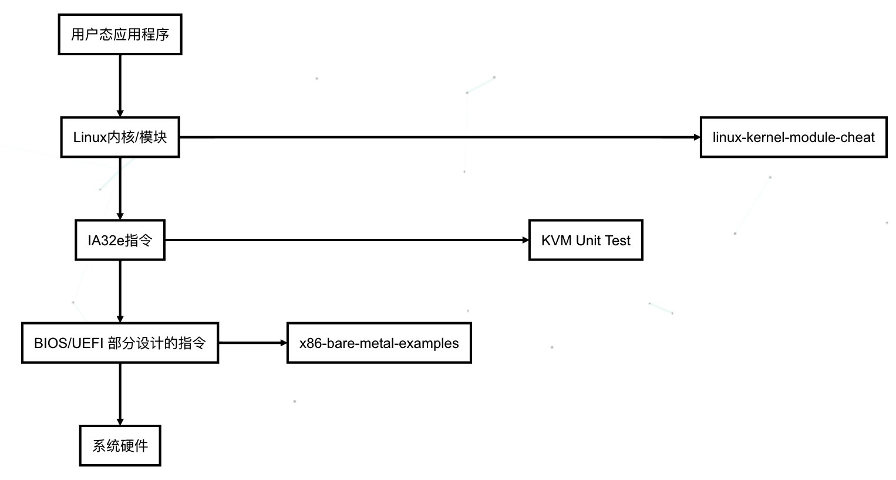

<!-- @import "[TOC]" {cmd="toc" depthFrom=1 depthTo=6 orderedList=false} -->

<!-- code_chunk_output -->

- [1. 学习内容](#1-学习内容)
  - [1.1. BIOS/UEFI 部分设计的指令](#11-biosuefi-部分设计的指令)
  - [1.2. IA32e指令](#12-ia32e指令)
  - [1.3. Linux内核/模块](#13-linux内核模块)
- [2. 如何利用QEMU学习](#2-如何利用qemu学习)
  - [编译](#编译)
  - [在虚拟机中作为内核直接运行(-kernel)](#在虚拟机中作为内核直接运行-kernel)
- [3. 参考](#3-参考)

<!-- /code_chunk_output -->

# 1. 学习内容



上图用户层应用程序以及硬件部分暂不是本文考虑范围，中间的三个软件部分“**Linux内核/模块**”、“**IA32e指令**”以及“**BIOS/UEFI部分指令**”都可以通过**本文的方法学习**。

需要说明的是，虽然这里划分了三个部分，并不是操作系统上的划分，只是一个**建议的学习的阶段划分**。

## 1.1. BIOS/UEFI 部分设计的指令

是指**硬件上电后CPU执行的最早期的指令**。

通常包括BIOS、boot loader等。

这部分可以通过[x86-bare-metal-examples](https://github.com/cirosantilli/x86-bare-metal-examples)来学习

## 1.2. IA32e指令

是指操作系统已经经过一些**初始化操作**，例如开启页表、开启32bit或者32e模式、段寄存器初始化、开启中断（APIC/X2APIC)、开启SMP支持等。

在这样的环境中，我们可以更专注于X86指令集的研究。上述**初始化过程**可以等日后展开讲述。

## 1.3. Linux内核/模块

基本上Linux 内核开发涵盖之前两个方面，只是上来就学习Linux内核有点复杂，代码量太大。

并且，本系教程的重点在于**学习X86指令**，并不在Linux中复杂的功能实现。

# 2. 如何利用QEMU学习

首先确保系统里安装了qemu，步骤略。大概有两种形式使用QEMU

## 编译

随便举个例子，来自kvm-unit-test:

```
gcc -m64 -g -Wall -fno-pic -no-pie -std=gnu99 -ffreestanding \
	-I /home/works/kvm-unit-tests/lib -I /home/works/kvm-unit-tests/lib/x86 -I ./lib \
	-c -o x86/tsc.o x86/tsc.c

gcc -I /home/works/kvm-unit-tests/lib -I /home/works/kvm-unit-tests/lib/x86 \
	-I lib -T /home/works/kvm-unit-tests/x86/flat.lds  -fno-pic -no-pie -nostdlib \
	x86/tsc.c x86/cstart64.o lib/libcflat.a /usr/lib/gcc/x86_64-linux-gnu/5/libgcc.a \
	-o x86/tsc.elf 

objcopy -O elf32-i386 x86/tsc.elf x86/tsc.flat  ##&& ./x86-run x86/tsc.flat
```

编译一个test case，代码如下：

```cpp
int main(void)
{
        u64 t1, t2;
        asm volatile ("rdtsc" : "=a"(a), "=d"(d));
        t1 = a | ((long long)d << 32);

        asm volatile ("rdtsc" : "=a"(a), "=d"(d));
        t2 = a | ((long long)d << 32);

        printf("rdtsc latency %u\n", (unsigned)(t2 - t1));

        return 0;
}
```

这样得到一个测试两次rdtsc指令执行的时间差的测试tsc.flat。当然上面辣么麻烦的编译啊、链接啊都是为了得到最终的测试的binary，或者叫可执行文件？！我们后面有很多种方法以及机会得到这样的测试代码，如果读者一时没有成功，不要终止于此，不要气馁。

## 在虚拟机中作为内核直接运行(-kernel)

```
qemu-system-x86_64 -vnc none -serial stdio -machine accel=kvm -kernel x86/tsc.flat
```

这样运行的虚拟机，看上去并不真的像是一个“虚拟机”，因为没有窗口，仅仅是console端文字输出。但这样足够我们验证和尝试CPU 指令，而且非常的轻量。个人比较喜欢这样的运行方式。


# 3. 参考

http://ysun.coding.me/2019/07/12/study-x86-using-qemu/