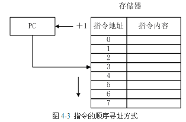
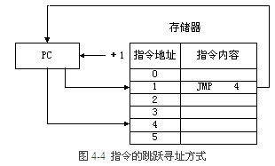
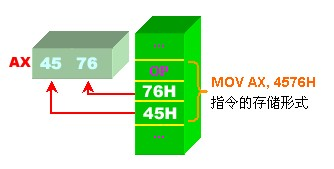
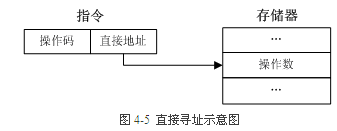
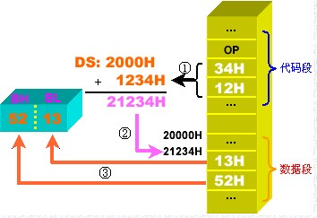
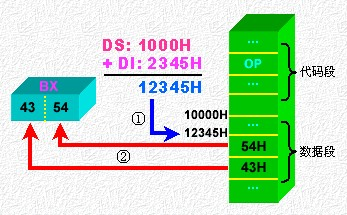
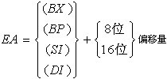
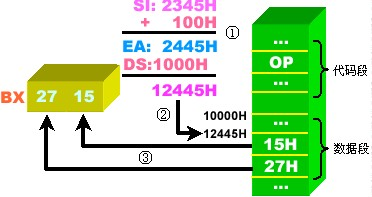
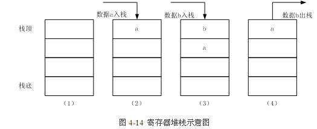
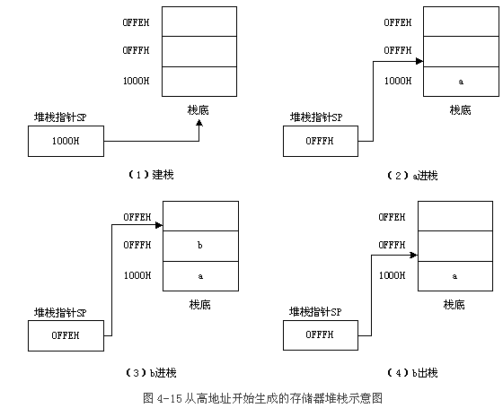

```
寻址方式参考：http://www.cnblogs.com/lilongjiang/category/304646.html
寻址方式：http://share.onlinesjtu.com/mod/tab/view.php?id=216
```

存储器既可用来存放指令，又可用来存放数据。在程序运行过程中，形成指令或操作数地址的方式，称为寻址方式。

寻址方式可以分为两类：指令寻址方式和数据寻址方式，前者较为简单，后者较为复杂。

**1. 指令寻址方式**

指令的寻址方式有两种，一种是**顺序寻址**方式，另一种是**跳跃寻址**方式。

1. 顺序寻址方式

由于指令地址在主存中顺序排列，当执行一段程序时，通常是一条指令接着一条指令地顺序执行。从存储器取出第一条指令，然后执行这条指令；接着从存储器取出第二条指令，再执行第二条指令；……，以此类推。这种程序顺序执行的过程称为指令的顺序寻址方式。指令顺序寻址方式的执行示意如图所示。为此，必须使用程序计数器PC来计数指令的顺序号，该顺序号就是指令在主存中的地址。指令逐条顺序执行，由PC+1→PC控制。



2. 跳跃寻址方式

所谓指令的跳跃寻址，是指下一条指令的地址码不是由程序计数器给出，而是由本条指令直接给出。程序跳跃后，按新的指令地址开始顺序执行。因此，指令计数器的内容也必须相应改变，以便及时跟踪新的指令地址。指令跳跃寻址方式的执行示意如图所示。采用指令跳跃寻址方式，可以实现程序转移或构成循环程序，从而缩短程序长度，或将某些程序作为公共程序调用。指令系统中的各种条件转移或无条件转移指令，就是为了实现指令的跳跃寻址而设置的。



**2. 操作数寻址方式**

指令中形成操作数或操作数地址的方式称为操作数的寻址方式。一般把指令中直接给出的地址称为形式地址，从形式地址生成有效地址的各种方式称为各种不同的存储器寻址方式，每种寻址方式都有一种对形式地址进行变换处理的运算规则。

常用的操作数寻址方式有以下几种：

1．立即寻址方式

指令的地址码字段指出的不是地址，而是操作数本身，这种寻址方式称为立即寻址方式。立即寻址由于在取出指令的同时也取出了操作数，所以指令的执行速度很快。但由于操作数是指令的一部分，不便于修改，降低了程序的通用性和灵活性。因此，立即寻址方式只适合于操作数固定的场合，通常用于为主存单元和寄存器提供常数。

立即数可以是8位、16位或32位。如果立即数为16位或32位，那么，它将按“高高低低”的原则进行存储。例如：

```
MOV AH, 80H　　　
ADD AX, 1234H　　　
MOV ECX, 123456H
MOV B1, 12H　　　
MOV W1, 3456H　　 
ADD D1, 32123456H
```

其中：B1、W1和D1分别是字节、字和双字单元。

以上指令中的第二操作数都是立即数，在汇编语言中，规定：立即数不能作为指令中的第二操作数。该规定与高级语言中“赋值语句的左边不能是常量”的规定相一致。

立即数寻址方式通常用于对通用寄存器或内存单元赋初值。图是指令“`MOV AX, 4576H`”存储形式和执行示意图。



2．直接寻址方式

直接寻址就是在指令的**地址字段**中直接指出**操作数**在**主存中的地址**，即形式地址等于有效地址，如图所示。这种寻址方式简单、直观，是一种最基本的寻址方式。



在通常情况下，操作数存放在数据段DS中，所以，其物理地址将由数据段寄存器DS和指令中给出的有效地址直接形成，但如果使用段超越前缀，那么，操作数可存放在其它段。

例：假设有指令：`MOV BX, [1234H]`，在执行时，(DS)=2000H，内存单元21234H的值为5213H。问该指令执行后，BX的值是什么？

解：根据直接寻址方式的寻址规则，把该指令的具体执行过程用下图来表示。

从图中，可看出执行该指令要分三部分：



- 由于1234H是一个直接地址，它紧跟在指令的操作码之后，随取指令而被读出；

- 访问数据段的段寄存器是DS，所以，用DS的值(*16)和偏移量1234H相加，得存储单元的物理地址：21234H；

- 取单元21234H的值5213H，并按“高高低低”的原则存入寄存器BX中。

所以，在执行该指令后，BX的值就为5213H。

由于数据段的段寄存器默认为DS，如果要指定访问其它段内的数据，可在指令中用段前缀的方式显式地书写出来。

下面指令的目标操作数就是带有段前缀的直接寻址方式。

```
MOV　ES:[1000H], AX
```

直接寻址方式常用于处理内存单元的数据，其操作数是内存变量的值，该寻址方式可在64K字节的段内进行寻址。

注意：立即寻址方式和直接寻址方式的书写格式的不同，直接寻址的地址要写在括号“[”，“]”内。在程序中，直接地址通常用内存变量名来表示，如：MOV BX, VARW，其中，VARW是内存字变量。

试比较下列指令中源操作数的寻址方式(VARW是内存字变量)：
```
MOV　AX, 1234H //立即寻址

MOV　AX, [1234H] //直接寻址

MOV　AX, VARW //直接寻址

MOV　AX, [VARW] //与上面等效，直接寻址
```

3．间接寻址方式

与直接寻址方式相比，间接寻址中指令**地址码字段**所指向的**存储单元**中**存储**的**不是操作数**本身，而是**操作数的地址**，如图所示。因此，间接寻址方式需要多次访问主存储器，既增加了指令的执行时间，又要占用主存储器单元。但是，这种寻址方式也为编程人员带来了较大的灵活性，实现起来也很简便，而且，间接寻址指令可以访问较大的存储空间，从而扩大指令的寻址能力。由于地址码位数的限制，如果采用直接寻址方式，能够访问的存储空间十分有限，而间接寻址的地址码所指向的存储单元则有足够的位数，因此可以访问全部存储空间。


操作数在存储器中，操作数的有效地址用SI、DI、BX和BP等四个寄存器之一来指定，称这种寻址方式为寄存器间接寻址方式。该寻址方式物理地址的计算方法如下：


在不使用段超越前缀的情况下，有下列规定：

- 若有效地址用SI、DI和BX等之一来指定，则其缺省的段寄存器为DS；
- 若有效地址用BP来指定，则其缺省的段寄存器为SS(即：堆栈段)。

例:假设有指令：MOV BX,[DI]，在执行时，(DS)=1000H，(DI)=2345H，存储单元12345H的内容是4354H。问执行指令后，BX的值是什么？

解：根据寄存器间接寻址方式的规则，在执行本例指令时，寄存器DI的值不是操作数，而是操作数的地址。该操作数的物理地址应由DS和DI的值形成，即： 

```
PA=(DS)*16+DI=1000H*16+2345H=12345H。
```

所以，该指令的执行效果是：把从物理地址为12345H开始的一个字的值传送给BX。

其执行过程如图所示。



4．寄存器寻址方式

寄存器寻址方式就是指令中的**地址码**是**寄存器的编号**，而不是操作数地址或操作数本身。寄存器的寻址方式也可以分为直接寻址和间接寻址，两者的区别在于：前者的指令地址码给出寄存器编号，寄存器的内容就是操作数本身；而后者的指令地址码给出寄存器编号，寄存器的内容是操作数的地址，根据该地址访问主存后才能得到真正的操作数。寄存器寻址方式的优点是用寄存器来暂存操作数或其地址，无需访问主存，速度快。通常情况下，我们提倡在编写汇编语言程序时，应尽可能地使用寄存器寻址方式，但也不要把它绝对化。

对于8位操作数，寄存器可以是AL 、AH、BL、BH、CL、CH、DL、DH。

对于16位操作数，寄存器可以是:AX、BX、CX、DX、SI、DI、SP、BP和段寄存器等。

32位寄存器有：EAX、EBX、ECX、EDX、ESI、EDI、ESP和EBP等。
寄存器寻址方式是一种简单快捷的寻址方式，源和目的操作数都可以是寄存器。

- 源操作数是寄存器寻址方式
　
```　
ADD VARD, EAX　　
ADD VARW, AX　　
MOV VARB, BH等。
```

其中：VARD、VARW和VARB是双字，字和字节类型的内存变量。

- 目的操作数是寄存器寻址方式

```
ADD BH, 78h　　　　
ADD AX, 1234h　　　
MOV EBX, 12345678H等。
```

- 源和目的操作数都是寄存器寻址方式

```
MOV EAX, EBX　　　
MOV AX, BX　　　　 
MOV DH, BL等。
```

5．基址寻址方式

基址寻址是将基址寄存器的内容加上指令中的形式地址而形成操作数的有效地址，其优点是可以扩大寻址能力。相对于形式地址，基址寄存器的位数可以设置得很长，从而可以在较大的存储空间中进行寻址。

6．变址寻址方式

变址寻址方式计算有效地址的方法与基址寻址方式很相似，它是将变址寄存器的内容加上指令中的形式地址而形成操作数的有效地址。使用变址寻址方式的目的不在于扩大寻址空间，而在于实现程序块的规律性变化。例如，有一个字符串存储在以AC1H为首址的连续主存单元中，只需要将首地址AC1H作为指令中的形式地址，而在变址寄存器中指出字符的序号，便可访问字符串中的任一字符。
变址寻址和基址寻址方法十分类似，但用途不同。变址寻址主要用于数组的访问，基址寻址则用于扩大寻址范围，从而在较大的存储空间中进行寻址。

7．相对寻址方式

相对寻址，是相对于当前的指令地址而言的寻址方式。相对寻址是把程序计数器PC的内容加上指令中的形式地址而形成操作数的有效地址，而程序计数器的内容就是当前指令的地址，所以相对寻址是相对于当前的指令地址而言的。此时的形式地址通常称为位移量，也就是操作数位置与当前指令位置之间的相对距离，其值可正可负，相对于当前指令地址而浮动。在相对寻址方式中，由于指令的地址和它所涉及的操作数位置相对固定，因此，操作数与指令可以放在主存的任何地方，但仍能保证程序的正确执行。

操作数在存储器中，其有效地址是一个基址寄存器(BX、BP)或变址寄存器(SI、DI)的内容和指令中的8位/16位偏移量之和。这种事寄存器相对寻址。其有效地址的计算公式如公式所示。



在不使用段超越前缀的情况下，有下列规定：

- 若有效地址用SI、DI和BX等之一来指定，则其缺省的段寄存器为DS；
- 若有效地址用BP来指定，则其缺省的段寄存器为SS。

指令中给出的8位/16位偏移量用补码表示。在计算有效地址时，如果偏移量是8位，则进行符号扩展成16位。当所得的有效地址超过0FFFFH，则取其64K的模。

例:假设指令：MOV BX, [SI+100H]，在执行它时，(DS)=1000H，(SI)=2345H，内存单元12445H的内容为2715H，问该指令执行后，BX的值是什么？

解：根据寄存器相对寻址方式的规则，在执行本例指令时，源操作数的有效地址EA为：

```
EA=(SI)+100H=2345H+100H=2445H
```

该操作数的物理地址应由DS和EA的值形成，即：

```
PA=(DS)*16+EA=1000H*16+2445H=12445H。
```

所以，该指令的执行效果是：把从物理地址为12445H开始的一个字的值传送给BX。

其执行过程如图所示。



**3. 堆栈寻址方式**

计算机中的堆栈（Stack）是一组能存储和取出数据的**暂时存储单元**，所有信息的存入和取出均按照后进先出（LIFO）或先进后出（FILO）的原则进行。
堆栈存取方式决定了其“一端存取”的特点，数据按顺序存入堆栈称为进栈或压栈（Push），堆栈中一个单元的数据称为栈项，栈项按与进栈相反的顺序从堆栈中取出称为出栈或弹出（Pop），最后进栈的数据或最先出栈的数据称为栈顶元素。

1．寄存器堆栈

寄存器堆栈又称串联堆栈、硬堆栈。某些计算机在CPU中设置了一组专门用于堆栈的寄存器，每个寄存器可保存一个字的数据。因为这些寄存器直接设置于CPU中，所以它们是极好的暂存单元。CPU通过进栈指令（PUSH）把数据存入堆栈，通过出栈指令（POP）把数据从堆栈中取出。

寄存器堆栈如图所示：

⑴空栈表示栈顶无数据，即位于栈顶的寄存器中无可用的数据；

⑵存入数据a，即把数据a存入栈顶，数据a可以来自主存、程序计数器PC等部件；

⑶再存入数据b，数据b位于栈顶，先进入的数据a则移至下一个寄存器；

⑷执行出栈操作，位于栈顶的数据b被取出，与此同时数据a移至栈顶。



从寄存器堆栈的数据进栈操作结果可见，最后进栈的数据位于栈顶，位于栈顶的数据出栈时最先被取出。在寄存器堆栈中，还必须有“栈空”和“栈满”的指示，以防在栈空时企图执行出栈、在栈满时企图执行进栈的误操作。这可以通过另外设置一个计数器来实现：每次进栈，计数器加1，计数值等于堆栈中寄存器个数时表示栈满；每次出栈，计数器减1，该计数值等于0时表示栈空。

寄存器堆栈的特点是仅有一个出入口，后进先出，且堆栈的容量固定，不需要占用主存。

2．存储器堆栈

当前计算机普遍采用的一种堆栈结构是存储器堆栈，也就是从主存中划出一块区域来作堆栈，又称软堆栈。**这种堆栈的大小可变，栈底固定，栈顶浮动**。由于主存的容量越来越大，存储器堆栈能够满足程序员对堆栈容量的要求，而且在需要时可建立多个存储器堆栈。

这种堆栈有三个主要优点：

（1） 堆栈能够具有程序员要求的任意长度；

（2）只要程序员喜欢，愿意建立多少堆栈，就能建立多少堆栈；
 
（3）可以用对存储器寻址的任何一条指令来对堆栈中的数据进行寻址。

构成存储器堆栈的硬件有两部分，一是在主存中开辟用于堆栈的存储区，二是在CPU中设置一个专用的寄存器——堆栈指针SP（Stack Pointer）来保存栈顶地址。除了硬件之外，还必须有实现进栈、出栈操作的指令。

作为堆栈的存储区，其两端的存储单元有高、低地址之分，因此，存储器堆栈又可分为两种：从高地址开始生成堆栈和从低地址开始生成堆栈。

**1）从高地址开始生成堆栈（自底向上生成堆栈）**

从高地址开始生成堆栈是一种较常用的方式，这种堆栈的栈底地址大于栈顶地址，在建栈时，SP指向堆栈中地址最大的单元（栈底），每次进栈时，首先把要进栈的数据存入SP所指向的存储单元，然后把指针SP-1；出栈时，先把指针SP+1，然后从SP所指向的存储单元取出数据，如图所示：



进栈操作：首先数据→Msp，然后指针(SP)-1→SP，Msp表示SP所指定的存储单元；
出栈操作：首先(SP)+1→SP，然后(Msp)读出，(Msp)表示SP所指定的存储单元的内容。

**2）从低地址开始生成堆栈（自顶向下生成堆栈）**

这种堆栈与从高地址开始生成堆栈正好相反，它的栈底地址小于栈顶地址，建栈时SP指向堆栈中地址最小的单元（栈底）。具体操作如下：

进栈操作：首先数据→Msp，然后指针(SP)+1→SP；

出栈操作：首先(SP)-1→SP，然后(Msp)读出。

存储器堆栈的操作方式与寄存器堆栈不同，它移动的是栈顶，而在寄存器堆栈中移动的是数据。

堆栈中对数据的操作具有后进先出的特点，因此，凡是以后进先出方式进行的信息传送都可以用堆栈很方便地实现。例如，在子程序的调用中，用堆栈存放主程序的返回地址，实现子程序的嵌套和递归调用；在程序中断处理中，用堆栈存放多级中断的相关信息，实现多级中断的嵌套。