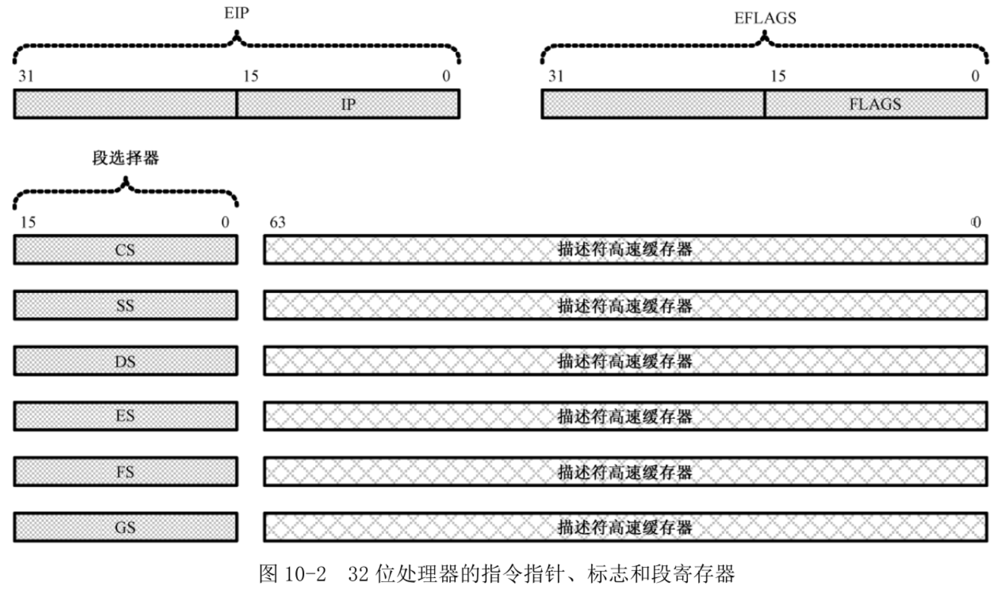

Intel 32 位处理器架构简称 IA-32（Intel Architecture，32-bit），是以1978年的8086处理器为基础发展起来的。

8086 有 20 根地址线，可以寻址1MB内存。但是，它内部的寄存器是16 位的，无法在程序中访问整个1MB内存。所以，它也是第一款支持内存分段模型的处理器。还有，8086处理器只有一种工作模式，即实模式。当然，在那时，还没有实模式这一说。

尽管 8086 是 16 位的处理器，但它也是32位架构内的一部分。原因在于，32 位的处理器架构是从 8086 那里发展来的，是基于 8086 的，具有延续性和兼容性。

32 位的处理器有 32 根地址线，数据线的数量是 32 根或者 64 根。特别是最近最新的处理器，都是 64 根。因此，它可以访问 2 32 ，即 4GB 的内存，而且每次可以读写连续的 4 字节或者 8 字节，这称为双字（Double Word）或者 4 字（Quad Word）访问。当然，如果你要按字节或者字来访问内存，也是允许的。

要想把 32 位处理器的所有功能都解释清楚，不是一件简单的事情。它不单单是地址线和数据线的扩展，实际上还有更多的部分，包括高速缓存、流水线、浮点处理部件、多处理器（核）管理、多媒体扩展、乱序执行、分支预测、虚拟化、温度和电源管理等。

## 1. 寄存器的扩展

如图 10-1 所示，32 位处理器在 16 位处理器的基础上，扩展了这 8 个通用寄存器的长度。


可以在程序中使用这些寄存器，即使是在实模式下：

```
mov eax,0xf0000005
mov ecx,eax
add edx,ecx
```

但是，指令的源操作数和目的操作数必须具有相同的长度，个别特殊用途的指令除外。因此，下面搭配是不允许的，在程序编译时，编译器会报告错误：

```
mov eax,cx ;错误的汇编语言指令
```

如果目的操作数是32位寄存器，源操作数是立即数，那么，立即数被视为 32 位的：

```
mov eax,0xf5 ;EAX←0x000000f5
```

**32 位通用寄存器的高 16 位是不可独立使用的，但低16位保持同 16 位处理器的兼容性**。因此，在任何时候它们都可以照往常一样使用：

```
mov ah,0x02
mov al,0x03
add ax,si
```

可以在 32 位处理器上运行 16 位处理器上的软件。

但是，32位处理器并不是 16 位处理器的简单增强。有自己的 32 位工作模式，在本书中，32位模式特指32位保护模式。在这种模式下，可以完全、充分地发挥处理器的性能。同时，在这种模式下，处理器可以使用它全部的 32根地址线，能够访问 4GB 内存。

如图 10-2 所示，在 32 位模式下，为了生成32位物理地址，处理器需要使用**32位的指令指针寄存器**。为此，32 位处理器扩展了 IP，使之达到 32 位，即 EIP。当它工作在 16 位模式下时，依然使用 16 位的 IP；工作在 32 位模式下时，使用的是全部的32位EIP。和往常一样，即使是在 32位模式下，**EIP寄存器也只由处理器内部使用，程序中是无法直接访问的**。

**对IP和EIP的修改通常是用某些指令隐式进行的**，这此指令包括 JMP、CALL、RET 和 IRET 等等。



在 16 位处理器中，标志寄存器 FLAGS 是 16 位的，在 32 位处理器中，扩展到了 32 位，低 16 位和原先保持一致。

