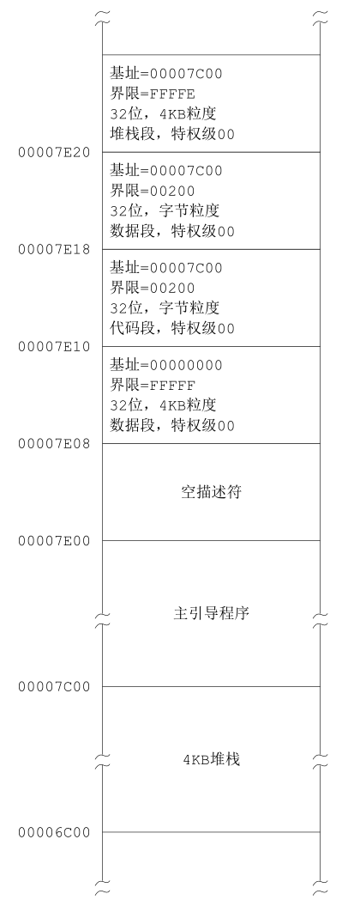

## 1. 话说 mov ds,ax 和 mov ds,eax

**段寄存器**（选择器）的值只能用**内存单元或者通用寄存器**来传送，一般的指令格式为

```
mov sreg,r/m16
```

这里有一个常见的例子：

```
mov ds,ax
```

在 16 位模式下，传送到DS中的值是逻辑段地址；在32位保护模式下，传送的是段描述符的选择子。

在16位模式和32位模式下，一些老式的编译器会生成不同的机器代码。下面是一个例证：

```
[bits 16]
mov ds,ax ;8E D8

[bits 32]
mov ds,ax ;66 8E D8
```

在 16 位模式下，默认的操作数大小是字（2字节），故生成8E D8也不难理解。在32位模式下，默认的操作数大小是双字（4 字节）。由于指令中的源操作数是 16 位的 AX，故编译后的机器码前面应当添加前缀 0x66 以反转默认的操作数大小，即 66 8E D8。

有前缀的和没有前缀的相比，处理器在执行时会多花一个额外的时钟周期。问题在于，这样的指令用得很频繁，而且牵扯到内存段的访问，自然也很重要。因此，**它们在16位模式和32位模式下的机器指令被设计为相同(处理器行为)**。即都是8E D8，不需要指令前缀。

这可难倒了很多编译器，它们固执地认为，在32位模式下，源操作数是16位的寄存器AX时，应当添加指令前缀。好吧，为了照顾它们，很多程序员习惯使用这种看起来有点别扭的形式：

```
mov ds,eax
```

这个有效，果然生成的是不加前缀的 8E D8。

NASM编译器不会有这样的问题。因此，不管处理器模式如何变化，也不管指令形式如何变化，以下代码编译后的结果都一模一样：

```
root@Gerry:/home/project/nasm# cat mode_test.asm 
[bits 16]
mov ds,ax ;8E D8
mov ds,eax ;8E D8
inc eax ;66 40

[bits 32]
mov ds,ax ;8E D8
mov ds,eax ;8E D8

root@Gerry:/home/project/nasm# nasm mode_test.asm

root@Gerry:/home/project/nasm# hexdump -C mode_test
00000000  8e d8 8e d8 66 40 8e d8  8e d8                    |....f@....|
0000000a
```

和这个示例一样，其他从通用寄存器到段寄存器的传送也符合这样的编译规则。因此，第7、8行，用于通过寄存器EAX来初始化堆栈段寄存器SS。

## 2. 创建 GDT 并安装段描述符

21、22 行，安装空描述符。该描述符的槽位号是0，处理器不允许访问这个描述符，任何时候，使用**索引字段为0的选择子来访问该描述符，都会被处理器阻止，并引发异常中断**。很多人喜欢用这个槽位来记载一些私人信息，做一些特殊的用途，认为反正处理器也不用它。但是，这样做可能是不安全的，还没有证据表明Intel公司保证决不会使用这个槽位。

GDT 和 GDT 内的描述符，以及本章程序，它们在内存中的映象如下图所示。


