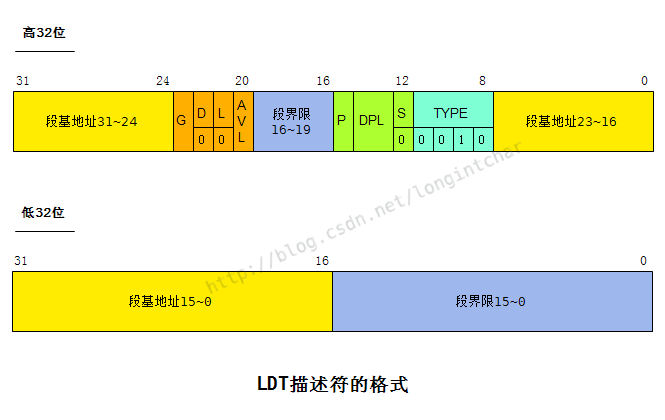
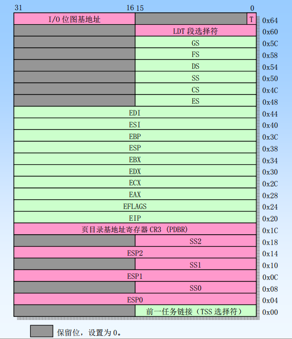
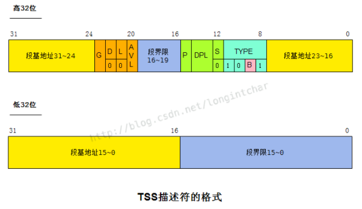

## 1. 任务控制块和TCB链

把控制权从较低的特权级转移到较高的特权级，通过调用门可以，但是直接控制转移是不允许的。

内核初始化完成后，接下来加载和重定位用户程序（应用程序），并移交控制权。按处理器的要求，要使一个程序成为“任务”，并且能够参与任务切换和调度，必须要有LDT和TSS。

加载程序并创建一个任务，需要用到很多数据，比如程序的大小、加载的位置等等。当任务执行结束，还要依据这些信息回收所占用的内存空间。还有，多任务系统是多个任务同时运行的，特别是在一个单处理器（核）的系统中，**为了任务切换和轮转**，必须能追踪到**所有正在运行的任务**，记录它们的状态，或根据它们的当前状态来采取合适操作（16章学习任务切换和轮转）。

为满足以上要求，内核应该为每一个任务创建一个内存区域，来记录任务的信息和状态，称为任务控制块（Task Control Block，TCB）。**TCB不是处理器要求**，是我们自己为方便发明的。

为追踪到所有任务，应当把每个人物控制块TCB串起来，形成一个链表。

## 3. 加载用户程序

当用户程序被读入内存，并处于运行或等待运行的状态时，就视为一个任务。每个任务允许有自己的LDT，而且可以定义在任何内存位置。所以，我们需要做三件事：

- 分配一块内存，作为LDT使用，为创建用户程序各个段的描述符准备；
- 将LDT的大小和起始线性地址登记在任务控制块TCB中；
- 分配内存并加载用户称故乡，并将它的大小和起始线性地址登记到TCB中。

## 7. 安装LDT描述符到GDT中

**LDT和GDT都用来存放各种描述符，因为它们用于系统管理，所以称为系统的段或系统段**。《ComputerArchitecture/x86/CPU/实模式和保护模式区别及寻址方式》可以查看所有系统段。

GDT是唯一的，所以**只需要用GDTR寄存器存放其线性地址和段界限即可（不需要设置GDT描述符<指向GDT的描述符>）**；但LDT不同，每个任务一个，所以为了追踪它们，处理器要求**在GDT中安装每个LDT的描述符**。当要使用这些LDT时，可以**用它们的选择子来访问GDT**，**将LDT描述符加载到LDTR寄存器**。其实主要用来做寄存器和特权级的保护工作。

下图是**LDT描述符**（意思是在**GDT中的指向相应LDT的描述符**）的格式。

LDT本身时一种特殊的段，最大尺寸是64KB。段基地址指示LDT在内存的起始地址，段界限指示LDT的范围；描述符的G是颗粒度，适用于LDT，**即使4KB的颗粒度，也不能超过64KB的大小**。

D位（或叫B位）和L位对LDT描述符来说没有意义，固定为0。

AVL和P位含义和存储器的段描述符相同。

LDT描述符中的S位固定为0，表示系统的段描述符或门描述符，以相对于存储器的段描述符（S=1），因为LDT描述符属于系统的段描述符。

在描述符为系统的段描述符时，即，S=0的前提下，TYPE字段为0010（二进制）表明这是一个LDT描述符。

## 8. 任务状态段TSS的格式

TSS内偏移0处是前一个任务的TSS描述符选择子。当系统多个任务同时存在，可以从一个任务切换到另一个任务执行，此时称任务是嵌套的。被嵌套的任务用这个指针指向前一个任务，控制返回时，处理器需要这个指针。当Call指令、中断或者异常造成任务切换，处理器会把旧任务的TSS选择子复制到新任务的TSS的Back Link字段中，并且设置**新任务的NT**（EFLAGS的bit14）为1，以表明新任务嵌套于旧任务中。关于这点我们会在第15章学习。在创建一个任务的时候，这个字段可以填写0.

SS0、SS1和SS2分别是0、1和2特权级的**栈段选择子**，ESP0、ESP1和ESP2分别是0、1和2特权级栈的栈顶指针。这些内容由当前任务的创建者填写，且填写后一般不变的静态部分，当通过门进行特权级之间的控制转移时，处理器使用这些信息来切换栈。

CR3和分页有关，16章讲述。此处一般由任务的创建者填写。

偏移32~92区域是处理器各个寄存器的快照部分，用于在进行任务切换时，保存处理器的状态以便恢复现场。在一个多任务环境中，每次创建一个任务，操作系统至少要填写EIP、EFLAGS、ESP、CS、DS、SS、ES、FS和GS，当任务第一次执行，处理器从这里加载初始执行环境，并从CS:EIP处开始执行任务的第一条指令。此后运行期间，该区域内容由处理器固件进行更改。

LDT选择子是当前任务的LDT描述符选择子。由内核填写，指向当前任务的LDT。该信息由处理器在任务切换时使用，在任务运行期间保持不变。

T位用于软件调试。多任务环境中，T=1，每次切换到该任务时，将**引发一个调试异常中断**。调试程序可以接管该中断并显示任务的状态。

I/O映射基地址用于决定当前任务是否可以访问特定的硬件端口。

#### I/O许可位图（I/O Permission Bit Map）

EFLAGS寄存器的IOPL位决定了当前任务的I/O特权级别。如果在数值上CPL<=IOPL，那么所有的I/O操作都是允许的，针对任何硬件端口的访问都可以通过；如果在数值上CPL>IOPL，也并不是说就不能访问硬件端口。事实上，处理器的意思是总体上不允许，但个别端口除外。至于个别端口是哪些端口，要找到当前任务的TSS，并检索I/O许可位图。

I/O许可位图（I/O Permission Bit Map）是一个比特序列，因为处理器最多可以访问65536个端口，所以这个比特序列最多允许65536比特（即8KB）。

如下图中的绿色部分，第一个字节代表端口0~7，第二个字节代表端口8~15，以此类推。每个比特的值决定了相应的端口是否允许访问。为1时禁止访问，为0时允许访问。

在TSS内偏移为102字节的那个字单元，是I/O位图基地址字段，它指明了I/O许可位图相对于TSS起始处的偏移，例如下图中这个字段的值是144.

有几点需要说明： 

1. 如果I/O位图基地址的值>=TSS的段界限（就是TSS描述符中的段界限），就表示没有I/O许可位图。 
2. 处理器要求I/O位图的末尾必须附加一个全1的字节，即0xFF. 
3. 处理器不要求为每一个I/O端口都提供位映射，对于那些没有在位图中映射的位，处理器假定它对应的比特是1（禁止访问）。 
4. TSS描述符中的界限值包括I/O许可位图在内，也包括最后附加的0xFF. 以下图为例，TSS的界限值是149（总大小150减去1）。
 

## 9. 创建任务状态TSS

TSS的界限值必须至少103，小于改值的TSS，执行任务切换时，会引发处理器异常中断。

## 10. 安装TSS描述符到GDT中（TSS描述符）

和LDT一样，**必须在全局描述符表（GDT）中创建每一个TSS的描述符（还是在GDT中！！！）**。一方面为了对TSS进行段和特权级的检查；另一方面，也是执行任务切换的需要。**当call far和jmp far指令的操作数是TSS描述符选择子时，处理器执行任务切换操作（第三种方式）**。

TSS描述符格式和LDT描述符差不多（也是系统段），除了TYPE位。

B位是“忙”位（Busy）。在任务刚刚创建的时候，它应该为0，表明任务不忙。当任务开始执行时，或者处于挂起状态（临时被中断执行）时，由处理器固件把B位置1.

任务是不可重入的。就是说在多任务环境中，如果一个任务是当前任务，那么它可以切换到其他任务，但是不能从自己切换到自己。在TSS描述符中设置B位，并由处理器固件进行管理，可以防止这种情况的发生。