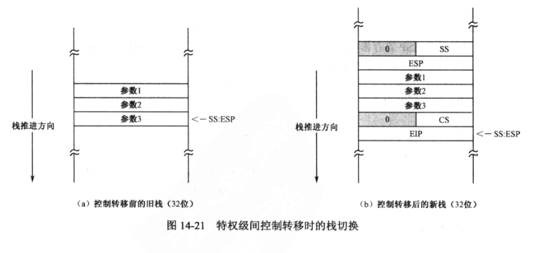
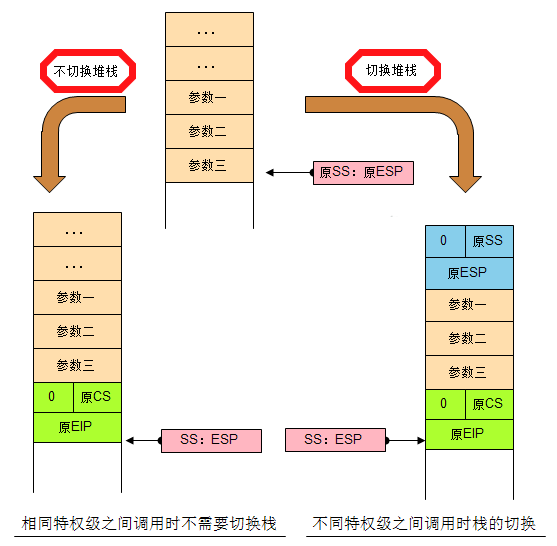
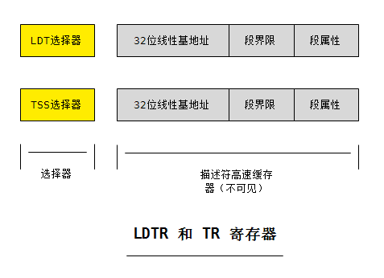

## 1. 通过调用门转移控制的完整过程

先看完整的调用门控制转移和返回过程。

### 转移的过程

首先，通过调用门实施控制转移，可以使用jmp far和call far指令。指令执行时，描述符选择子必须指向调用门，32位偏移量被忽略。使用下表的特权检查机制。注意，表比较关系是数值上的。


当使用jmp far指令通过调用门控制转移时，要求当前特权级和目标代码段的特权级相同。原因是用**jmp far指令通过调用门控制转移时，不改变CPL**。

相反，使用**call far指令通过调用门控制转移**时，如果改变了当前特权级，则必须切换栈。即，从当前任务的固有栈切换到与目标代码段特权级相同的栈上。栈的切换由处理器自动进行。

当前栈是由SS和ESP的当前内容所指示的。要切换到的新栈的相关信息位于当前任务的TSS中，处理器知道如何找到它。**栈切换**过程如下：

1. 根据目标代码段的DPL（也就是新的CPL）到当前任务的TSS中读取新栈的选择子和栈指针。在读取栈选择子、栈指针或者栈段描述符的过程中，任何违反段界限的错误都将导致产生一个无效TSS异常。 
2. 检查栈段描述符的特权级和类型是否有效，若无效同样产生一个无效TSS异常。 
3. 临时保存SS和ESP的当前值，把新栈的选择子和栈指针加载到SS和ESP中。然后把临时保存的SS和ESP的内容压入新栈中。
4. 根据调用门描述符中“参数个数”字段，把旧栈中的所有参数复制到新栈中。如果参数个数为0，则不复制参数。 


 
5. 将当前CS和EIP的内容压入新栈。通过调用门实施的控制转移一定是远转移，所以要压入CS和EIP。 
6. 从调用门描述符中把目标代码段的选择子和段内偏移值传送到CS和EIP中，开始执行被调用过程。

相反，如果没有改变特权级别，则不切换栈，继续使用调用者当前的栈，只是在原来的基础上压入当前CS和EIP的内容。



另外，如果通过调用门的控制转移是jmp far指令发起的，结果就是“肉包子打狗——有去无回”，且没有特权级变化，也不需要切换栈。相反，如果是call far指令发起的，则可以使用远返回指令retf把控制返回到调用者。

### 返回的过程

对于相同特权级的返回，CPU从堆栈中弹出EIP和CS；**会发生特权级改变的远返回仅允许返回到低特权级程序中**，即返回到的代码段的DPL在数值上要大于CPL。返回的全部过程如下：

1. 检测被调用者栈中CS寄存器的RPL字段值，以确定在返回时特权级是否发生改变。
2. 弹出并使用被调用过程栈上的值加载EIP和CS寄存器。在此过程中会对代码段描述符和代码段选择子的RPL进行特权级与类型检查。
3. 如果远返回指令是带参数的，则将参数和ESP寄存器的当前值相加，以跳过被调用者栈中的参数部分，最后的结果是ESP寄存器指向调用者SS和ESP的压栈值。注意，retf指令的参数必须等于调用门中所有参数的总字节数之和。
4. 如果返回时需要改变特权级，则从栈中将ESP和SS弹出，并把值代入寄存器ESP和SS，切换到调用者的栈。
5. 如果远返回指令是带参数的，则将参数和ESP寄存器的当前值相加，以跳过调用者栈中的参数部分，最后的结果是调用者的栈恢复平衡。
6. 如果返回时需要改变特权级，则检查DS,ES,FS和GS的内容，如果段选择子指向数据段或者非一致代码段且段描述符的DPL在数值上小于返回后的新CPL，那么就把数值0传送到该段寄存器。

## 2. 如何转到用户程序的执行

任务寄存器TR总是指向当前任务的TSS，而LDTR寄存器也总是指向当前任务的LDT。TSS是任务的主要标志，因此要使TR寄存器指向当前任务；而使用LDTR的原因是可以在任务执行期间加速对段的访问。

在多任务环境中，从旧任务切换的新任务的时候，TR和LDTR寄存器的值都会更新，以指向新任务。但是，目前我们只有一个任务，而且是特权级为3的任务，我们遇到的问题可以表述为：如何从任务的全局空间（处于特权级0）转移到它自己的局部空间（处于特权级3）？

答案是分为两步： 
1. 确立身份，使TR和LDTR寄存器指向这个任务； 
2. 假装从调用门返回；

### TR和LDTR寄存器

TR和LDTR寄存器都包括16位的选择器部分和描述符高速缓存器部分（如下图所示）。选择器部分的内容是TSS和LDT描述符的选择子；描述符高速缓存器部分的内容则指向当前任务的TSS和LDT，以加速这两个段（表）的访问。



### ltr和lldt指令

加载任务寄存器TR的指令是ltr，其格式为

```
ltr r/m16
```

1. 这条指令的操作数是通用寄存器或者16位的内存单元，里面的内容是16位的TSS选择子。
2. 执行这条指令后，**处理器用选择子访问GDT，找到TSS描述符，将基地址、段界限、段属性加载到描述符高速缓存器中，同时将该描述符中的B位置1，但并不执行任务切换**。
3. 该指令属于特权指令，只能在0特权级下执行。
4. 该指令不影响EFLAGS的任何标志位。

加载局部描述符表寄存器LDTR的指令是lldt，其格式为

```
lldt r/m16
```

ltr和lldt指令执行时，**处理器首先要检查描述符的有效性，包括审查它是不是TSS或LDT描述符。在将LDT选择子加载到LDTR后，处理器用该选择子访问GDT中对应的LDT描述符，将段界限和段基地址加载到LDTR的描述符高速缓存器部分**。CS、SS、DS、ES、FS和GS寄存器当前内容不受该指令影响，包括TSS中的LDT选择子字段。

如图，任务全景图。


注意，现在，局部描述符表（LDT）已经生效，可以通过它访问用户程序的私有内存段了。

### 假装从调用门返回

从用户程序头部取出栈选择子和栈指针，以及代码选择子和入口点，并将它们顺序压入当前的0特权级栈中。

```
 ;以下假装是从调用门返回。摹仿处理器压入返回参数 
push dword [0x08]                  ;调用前的堆栈段选择子
push dword 0                       ;调用前的esp

push dword [0x14]                  ;调用前的代码段选择子 
push dword [0x10]                  ;调用前的eip

retf
```

这段代码要结合用户程序头部的格式和调用门的返回过程来分析。

用户程序头部的格式如下图


参照上面从调用门的返回过程是：

1. 检测被调用者栈中CS寄存器的RPL字段值，以确定在返回时特权级是否发生改变。
2. 弹出并使用被调用过程栈上的值加载EIP和CS寄存器。在此过程中会对代码段描述符和代码段选择子的RPL进行特权级与类型检查。
3. 如果远返回指令是带参数的，则将参数和ESP寄存器的当前值相加，以跳过被调用者栈中的参数部分，最后的结果是ESP寄存器指向调用者SS和ESP的压栈值。注意，retf指令的参数必须等于调用门中所有参数的总字节数之和。
4. 如果返回时需要改变特权级，则从栈中将ESP和SS弹出，并把值代入寄存器ESP和SS，切换到调用者的栈。
5. 如果远返回指令是带参数的，则将参数和ESP寄存器的当前值相加，以跳过调用者栈中的参数部分，最后的结果是调用者的栈恢复平衡。
6. 如果返回时需要改变特权级，则检查DS,ES,FS和GS的内容，如果段选择子指向数据段或者非一致代码段且段描述符的DPL在数值上小于返回后的新CPL，那么就把数值0传送到该段寄存器。

上面代码执行完后，栈的布局如下（这其实是内核的栈，并不是用户的0特权级栈）：

我们对着上面的返回步骤，一步一步来看。 
1. 因为用户程序的CS寄存器中的RPL=3，所以在返回的时候特权级要发生改变。 
2. 弹出用户程序的EIP和CS（绿色部分）加载EIP和CS寄存器。 
3. 第864行的retf指令不带参数，所以这步跳过。 
4. 从栈中将用户程序的ESP和SS（蓝色部分）弹出，并把值代入寄存器ESP和SS，切换到调用者的栈（实际是用户程序的3特权级栈）。 
5. 第864行的retf指令不带参数，所以这步跳过。 
6. 因为DS中的内容是用户程序头部段的选择子，其DPL=3，所以不会把数值0传到DS；至于ES、FS和GS，它们一般会指向内核数据段，其DPL=0，所以这些寄存器很可能被数值0加载，所以用户程序中应该对它们先初始化再引用。

执行远返回指令retf，假装从调用门返回。