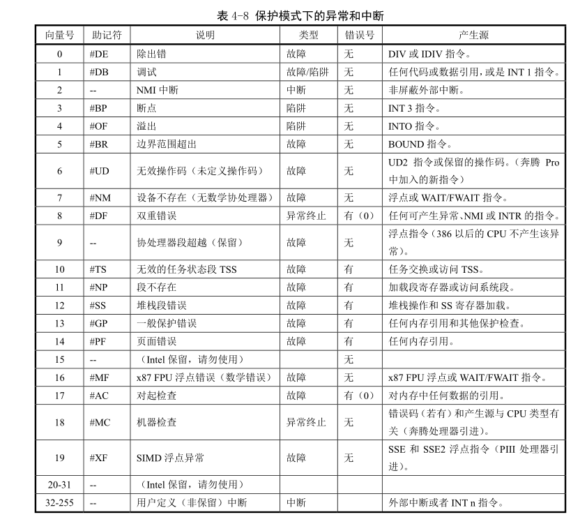
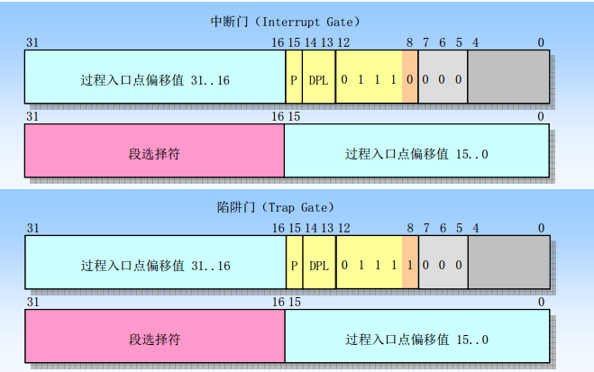
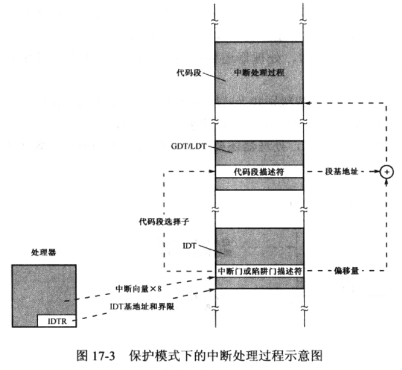

## 1. 中断和异常概述

当中断和异常发生时，典型结果是迫使处理器将控制从当前正在执行的程序或任务转移到另一个例程或任务中。该例程叫中断处理程序，或者异常处理程序。如果是一个任务，则发生任务切换。

### 中断（Interrupt）

中断包括硬件中断和软中断。

硬件中断由外围设备发出的中断信号引发。当I/O接口发出中断请求，会被像8259A和I/O APIC这样的中断控制器收集，并发送到处理器。硬件中断随机发生，与处理器的执行并不同步。当中断发生，处理器要先执行完**当前指令**，然后对中断进行处理。

软中断是由int n指令引发的中断处理，n是中断号或类型码。

### 异常（Exception）

异常就是之前介绍16位汇编时所说的内部中断。**它们是处理器内部产生的中断，表示指令执行过程中遇到错误**。所以内部中断又叫异常或异常中断。比如，除法指令div/idiv遇到被0除，会产生中断0；使用jmp任务切换，指令操作数不是一个有效TSS描述符选择子。

异常分为三种。

第一种是程序错误异常，指处理器在执行指令中，检测到程序中的错误；

第二种是软件引起的异常。这类异常由into、int3和bound指令主动发起。这些指令允许在指令流的当前点上检查实施异常处理的条件是否满足。比如，into指令在执行时，将检查EFLAGS的寄存器的OF标志，如果满足为“1”，则引发异常。

第三种是机器检查异常。这种异常时处理器型号相关的，也就是说，每种处理器都不太一样。处理器提供了一种对硬件芯片内部和总线处理进行检查的机制，当检测到有错误时，将引发此类异常。

根据异常情况的性质和严重性，异常又分为三种，并实施不同的处理。

- Fault（故障）是一种通常可以被纠正的异常，并且一旦被纠正程序就可以继续运行。当出现一个Fault，处理器会把机器状态恢复到产生Fault的指令之前的状态。此时异常处理程序的返回地址会指向产生Fault的指令，而不是其后面一条指令。因此在返回后产生Fault的指令将被重新执行。

- Trap（陷阱）是一个引起陷阱的指令被执行后立刻会报告的异常。Trap也能让程序或任务连贯地执行。Trap处理程序的返回地址指向**引起陷阱指令的随后一条指令**，因此在返回后会执行下一条指令。

- Abort（中止）是一种不会总是报告导致异常的指令的精确位置的异常，并且不允许导致异常的程序重新继续执行。Abort用于报告严重错误，例如硬件错误以及系统表中存在不一致性或非法值。

中断和异常发生时，处理器将挂起当前正在执行的过程或任务，然后执行中断和异常处理过程。返回时，处理器恢复程序或任务的执行。除非遇到一个Abort类型的异常。对于某些异常，处理器在转入异常处理程序之前，会在当前栈中压入一个称为错误码的数值，帮程序进一步诊断异常产生的位置和原因。

下表列出Intel处理器在保护模式下的中断和异常。

很重要！！！当中断和异常发生时，**NMI和异常的向量**是由**处理器自动给出的**；**硬件中断的向量**是由**I/O中断控制器芯片送给处理器的**；**软中断的向量**由**指令中的操作数给出的**。

## 2. 中断描述符表、中断门和陷阱门

实模式下，内存最低端1KB内存中，是中断向量表（IVT）。定义了256种中断的入口地址，包括16位段地址和16位段内偏移量。当中断发生，处理要么自发产生一个中断向量（NMI和异常向量，要么从外部中断控制器接受一个中断向量，要么从int n指令中得到中断向量。然后，将该向量作为索引访问中断向量表。具体的做法是，将中断向量乘以4，作为表内偏移量访问中断向量表，从中获得中断处理过程的段地址和偏移地址，并转到执行。

保护模式下，处理器对中断管理类似，不过使用中断描述符表（Interrupt Descriptor Table，IDT）存放中断处理过程有关的描述符，包括中断门、陷阱门和任务门。

任务门之前讲过。中断门和陷阱门格式如图。

事实上，调用门、任务门、中断门和陷阱门描述符很类似，从大的方面来说，因为都用于实施控制转移，故都包括16位的目标代码段选择子，以及32位段内偏移量。由图中可知道，中断门和陷阱门仅仅有一比特的差别。**中断门和陷阱门描述符都只允许存放在IDT内，任务门可以位于GDT、LDT和IDT中**。

与实模式下的中断向量表（IVT）不同，保护模式下的IDT不要求必须位于内存的最低端。事实上，在处理器内部，有一个48位的中断描述符表寄存器（Interrupt Descriptor Table Register，IDTR），保存着中断描述符表在内存中的线性基地址和界限。如下图，与GDT一样，因为整个系统中只需要一个IDT就够了，所以，GDTR和IDTR不像LDTR和TR，没有也不需要选择器部分。

这就意味着，IDT可以位于内存任何地方，只要IDTR指向它，整个中断系统就可以正常工作。为了利用高速缓存使处理器的工作性能最大化，建议IDT基地址8字节对齐。处理器复位时，IDTR的基地址部分为0，界限部分为0xFFFF。16位表界限意味表大小可以64KB，但是，事实上，因为处理器只能识别256中中断，所以只使用2KB，其他空余槽位应将描述符P位清零。最后，与GDT不同，IDT第一个描述符也是有效的。

如图，保护模式下，当中断或异常发生时，处理器用中断向量乘以8的结果去访问IDT，从中获取对应的描述符。IDT在内存中是由IDTR指示的。

注意，图中没有考虑分页，也没有考虑门描述符是任务门。中断门和陷阱门中有目标代码段描述符的选择子，以及段内偏移量。取决于选择子的TI位，处理器访问LDT或GDT，取出目标代码段的描述符。接着，从目标代码段描述符中取出目标代码段所在的基地址，再同门描述符中的偏移量相加，就得到中断处理程序的32位线性地址。如果没有开启分页，该线性地址就是物理地址；否则，送页部件转换成物理地址。

注意，当处理器用中断向量访问IDT时，要访问的位置超出了IDT的界限，则产生常规保护异常（#GP）。

## 3. 中断和异常处理程序的保护

## 4. 中断任务

## 5. 错误代码

