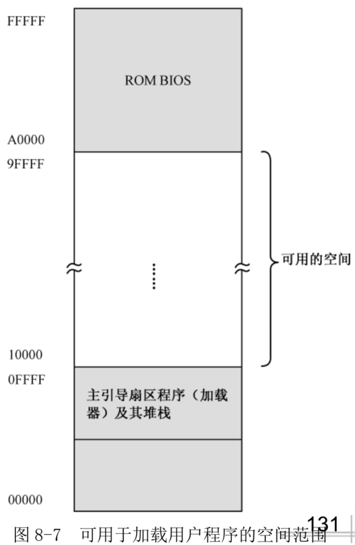
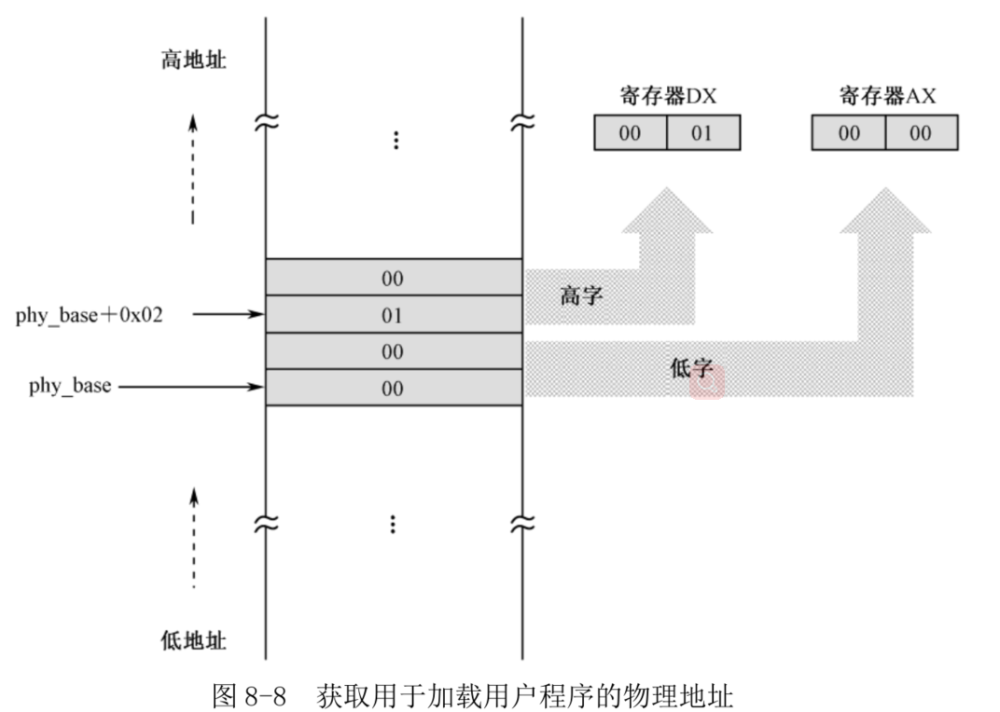
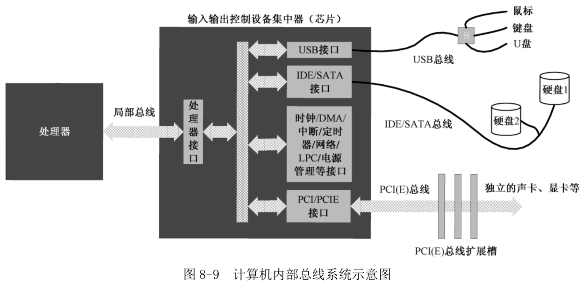

## 1. 初始化和决定加载位置

加载器要加载一个应用程序，需要决定两件事情。第一，内存中什么位置是空闲的，即从哪个物理内存地址开始加载用户程序；第二，用户程序位于硬盘上的什么位置，它的起始逻辑扇区号是多少。

代码清单 8-1，来看看加载器都做了哪些工作。

第 6 行，加载器程序的一开始声明了一个常数（const）：

```
app_lba_start equ 100
```

常数是用伪指令 equ 声明的，它的意思是“等于”。当我们要用到 100 的时候，可以这样写：

```
mov al,app_lba_star
```

和其他伪指令db、dw、dd不同，用equ声明的数值**不占用任何汇编地址**，也**不在运行时占用任何内存**位置。它仅仅代表一个数值，就这么简单。

```
root@Gerry:/home/project/nasm/booktool/c08# cat equ_q.asm 
 SECTION mbr align=16 vstart=0x7c00
 
 app_lba_start equ 100
 
 mov al,app_lba_start
 
root@Gerry:/home/project/nasm/booktool/c08# nasm equ_q.asm 

root@Gerry:/home/project/nasm/booktool/c08# hexdump -C equ_q
00000000  b0 64                                             |.d|
00000002
```

注：不受vstart影响（类似于C中的宏定义），64即十进制100。

加载用户程序需要确定一个**内存物理地址（不是偏移地址）**，第151行用伪指令dd声明的，并初始化为0x10000的(自己定义的)。和前面一样，是用32位的单元来容纳一个20位的地址。

可以将这个数值改成 0x12340，唯一的要求是该地址的最低 4 位必须是 0，换句话说，加载的起始地址必须是 16 字节对齐的。



如图8-7所示，物理地址0x0FFFF以下，是加载器及其堆栈的范围；**物理地址A0000以上，是BIOS和外围设备的范围**，有很多传统的老式设备将自己的存储器和只读存储器映射到这个空间。

## 2. 准备加载用户程序

将主引导扇区程序定义成一个段。

```
SECTION mbr align=16 vstart=0x7c00
```

即使你不定义这个段，编译器也会自动把整个程序看成一个段。因为该定义中有“vstart=0x7c00”子句，所以，它就不那么多余了。

第12～14行，用于初始化堆栈段寄存器SS和堆栈指针SP。之后，堆栈的段地址是0x0000，段的长度是64KB，堆栈指针将在段内0xFFFF和0x0000之间变化。

第16、17行，用于取得一个地址，用户程序将要从这个地址处开始加载。

该地址实际上是保存在标号phy\_base处的一个双字单元里。如图8-8所示，32位数内存中的存放是按低端序列的，高16位处在phy\_base＋0x02 处，可以放在寄存器DX中；低16位处在phy\_base处，可以用寄存器AX存放。



因为段寄存器 CS的内容是0x0000，而且主引导扇区是位于0x0000:0x7c00 处的，所以，理论上指令中的偏移地址应当是0x7c00＋phy\_base。不过，因为我们定义段mbr的时候，使用了“vstart=0x7c00”子句，故段内所有汇编地址都是在0x7c00的基础上增加的，就不用再加上这个 0x7c00 了，直接是

```
mov ax,[cs:phy_base]
mov dx,[cs:phy_base+0x02]
```

第 18～21 行，用于将该物理地址变成16位的段地址，并传送到DS和ES 寄存器。**因为该物理地址是16字节对齐的，直接右移4位即可**。实际上，右移4位相当于除以16（0x10），所以程序中的做法将这个32位物理地址（DX:AX）除以16（在寄存器BX中），寄存器AX中的商就是得到的段地址（在本程序中是0x1000）。

## 3. 外围设备及其接口

一般来说，我们把外围设备（Peripheral Equipment）分成两种，一种是输入设备，比如键盘、鼠标、麦克风、摄像头等；另一种是输出设备，比如显示器、打印机、扬声器等。输入设备和输出设备统称输入输出（Input/Output，I/O）设备。

每种设备都有自己的工作方式。比如，扬声器需要的是模拟信号，每个扬声器需要两根线，用的插头也是无线电行业里的标准，话筒也是如此；老式键盘只用一根线向主机传送按键的ASCII码，而且一直采用PS/2标准；新式的USB键盘尽管也使用串行方式工作，但信号却和老式键盘完全不同。至于网络设施，现在流行的是里面有8根线芯的五类双绞线，里面的信号也有专门的标准。

这里需要一些信号转换器和变速齿轮，这就是**I/O接口**。举几个例子，麦克风和扬声器需要一个I/O接口，即**声卡**，才能与处理器沟通；显示器也需要一个I/O接口，即**显卡**，才能与处理器沟通；USB I/O接口，即USB接口，才能与处理器沟通。很显然，不同的外围设备，都有各自不同的I/O接口。

**I/O接口**可以是一个电路板，也可能是一块小芯片，这取决于它有多复杂。在一边，它按处理器的信号规程工作，负责把处理器的信号转换成外围设备能接受的另一种信号；在另一边，它也做同样的工作，把外围设备的信号变换成处理器可以接受的形式。

后面还有两个麻烦的问题。

① 不可能将所有的I/O接口直接和处理器相连，将来还有更多设备。

② 每个设备的 I/O 接口都抢着和处理器通信，不发生冲突都难。

第1个问题的解答是采用总线技术。总线可以认为是一排电线，所有的外围设备，包括处理器，都连接到这排电线上。但是，每个连接到这排电线上的器件都必须有拥有电子开关，以使它们随时能够同这排电线连接，或者从这排电线上断开（脱离）。这就好比是公共车道，当路面上有车时，你就必须退避一下，不能硬冲上去。因此，这排公共电线就称为总线（Bus）。

第2个问题的解答是使用输入输出控制设备集中器（I/O Controller Hub，ICH）芯片，该芯片的作用是连接不同的总线，并协调各个I/O接口对处理器的访问。在个人计算机上，这块芯片就是所谓的南桥。

如图 8-9 所示，处理器通过局部总线连接到ICH内部的处理接口电路。然后，在 ICH 内部，又通过总线与各个 I/O 接口相连。



在 ICH 内部，集成了一些常规的外围设备接口，如USB、PATA（IDE）、SATA、老式总线接口（LPC）、时钟等，这些东西对计算机来说必不可少，故直接集成在ICH内，我们后面还会详细介绍它们的功能。

不管是什么设备，都必须通过它自己的I/O接口电路同ICH相连。为了方便，最好是在主板上做一些插槽，同时，每个设备的 I/O 接口电路都设计成插卡。这样，想接上该设备时，就把它的 I/O 接口卡插上，不需要时，随时拔下。

为了支持更多的设备，ICH 还提供了对 PCI 或者 PCI Express 总线的支持，该总线向外延伸，连接着主板上的若干个扩展槽，就是刚才说的插槽。举个实例，如果你想连接显示器，那么就要先插入显卡，然后再把显示器接到显卡上。

除了局部总线和PCI Express总线，每个I/O接口卡可能连接不止一个设备。比如USB 接口，就有可能连接一大堆东西：键盘、鼠标、U盘等。因为同类型的设备较多，也涉及线路复用和仲裁的问题，故**它们也有自己的总线体系，称为通信总线或者设备总线**。比如图8-9所示的USB总线和SATA总线。

当处理器想同某个设备说话时，ICH会接到通知。然后，它负责提供相应的传输通道和其他辅助支持，并命令所有其他无关设备闭嘴。同样，当某个设备要跟处理器说话，情况也是一样。

## 4. I/O端口和端口访问

具体地说，**处理器是通过端口（Port）来和外围设备打交道的**。本质上，**端口就是一些寄存器**，类似于处理器内部的寄存器。不同之处仅仅在于，这些叫做端口的寄存器位于I/O接口电路中。

**端口是处理器和外围设备通过I/O接口交流的窗口，每一个I/O接口都可能拥有好几个端口，分别用于不同的目的**。比如，连接硬盘的PATA/SATA接口就有几个端口，分别是命令端口（当向该端口写入0x20 时，表明是从硬盘读数据；写入0x30时，表明是向硬盘写数据）、状态端口（处理器根据这个端口的数据来判断硬盘工作是否正常，操作是否成功，发生了哪种错误）、参数端口（处理器通过这些端口告诉硬盘读写的扇区数量，以及起始的逻辑扇区号）和数据端口（通过这个端口连续地取得要读出的数据，或者通过这个端口连续地发送要写入硬盘的数据）。

端口只不过是位于I/O接口上的寄存器，所以，每个端口有自己的数据宽度。在早期的系统中，端口可以是8位的，也可以是16位的，现在有些端口会是32位的。到底是8位还是16位，这是设备和I/O接口制造者的自由。比如，PATA/STAT接口中的数据端口就是16位的，这有助于加快数据传输速率，提高传输效率。

端口在不同的计算机系统中有着不同的实现方式。在一些计算机系统中，端口号是映射到内存地址空间的。比如，0x00000～0xE0000 是真实的物理内存地址，而0xE0001～0xFFFFF是从很多I/O接口那里映射过来的，当访问这部分地址时，实际上是在访问I/O接口。

而在另一些计算机系统中，端口是独立编址的，不和内存发生关系。如图 8-10 所示，在这种计算机中，处理器的地址线既连接内存，也连接每一个 I/O 接口。但是，处理器还有一个特殊的引脚 M/IO#，在这里，“#”表示低电平有效。也就是说，当处理器访问内存时，它会让 M/IO#引脚呈高电平，这里，和内存相关的电路就会打开；相反，如果处理器访问I/O端口，那么M/IO#引脚呈低平，内存电路被禁止。与此同时，处理器发出的地址和M/IO#信号一起用于打个某个 I/O 接口，如果该I/O接口分配的端口号与处理器地址相吻合的话。

Intel 处理器，早期是独立编址的，现在既有内存映射的，也有独立编址的。在本章中，我们只讲独立编址的端口。

所有端口都是统一编号的，比如0x0001、0x0002、0x0003、…。每个 I/O 接口电路都分配了若干个端口，比如，I/O接口A有3个端口，端口号分别是 0x0021～0x0023；I/O接口B需要5个端口，端口号分别是0x0303～0x0307。一个现实的例子是个人计算机中的PATA/SATA接口（图8-9），每个PATA和SATA接口分配了8个端口。但是，ICH 芯片内部通常集成了两个PATA/SATA接口，分别是主硬盘接口和副硬盘接口。这样一来，主硬盘接口分配的端口号是0x1f0～0x1f7，副硬盘接口分配的端口号是0x170～0x177。


在 Intel 的系统中，只允许65536（十进制数）个端口存在，端口号从 0 到 65535（0x0000～0xffff）。因为是独立编址，所以，端口的访问不能使用类似于 mov 这样的指令，取而代之的是 in 和 out 指令。

in 指令是从端口读，它的一般形式是

```
in al,dx
```

或者
```
in ax,dx
```

这就是说，in 指令的目的操作数必须是寄存器AL或者AX，当访问8位的端口时，使用寄存器AL；访问16位的端口时，使用AX。in指令的源操作数应当是寄存器 DX。

in al,dx 的机器指令码是 0xEC，in ax,dx的机器指令码是0xED，都是一字节的。之所以如此简短，是因为in指令不允许使用别的通用寄存器，也不允许使用内存单元作为操作数。

in 指令还有两字节的形式。此时，前一字节是操作码 0xE4 或者 0xE5，分别用于指示8位或者16位端口访问；后一字节是立即数，指示端口号。

因此，机器指令 E4 F0 就相当于汇编语言指令
```
in al,0xf0
```
而机器指令 E5 03 就相当于汇编语言指令
```
in ax,0x03
```
很显然，因为这种指令形式的操作数部分只允许一字节，故只能访问 0～255（0x00～0xff）号端口，不允许访问大于255的端口号。所以，下面的汇编语言指令就是非法的：

```
in ax,0x5f
```

in 指令不影响任何标志位。

相应地，如果要通过端口向外围设备发送数据，则必须通过 out 指令。

out 指令正好和 in 指令相反，目的操作数可以是 8 位立即数或者寄存器 DX，源操作数必须是寄存器 AL 或者 AX。下面是一些例子：

```
out 0x37,al ;写 0x37 号端口（这是一个 8 位端口）
out 0xf5,ax ;写 0xf5 号端口（这是一个 16 位端口）
out dx,al ;这是一个 8 位端口，端口号在寄存器 DX 中
out dx,ax ;这是一个 16 位端口，端口号在寄存器 DX 中
```

out 指令不影响任何标志位。