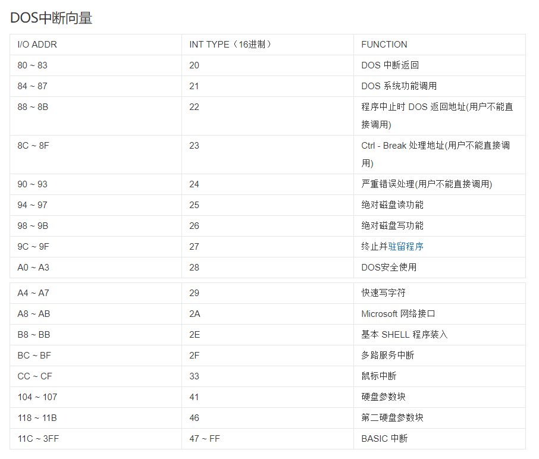

参考：

- Operating System/Linux/Linux内核完全剖析—基于0.12内核/4. 80x86保护模式及其编程/6. 中断和异常处理

- Operating System/Linux/Linux内核完全剖析—基于0.12内核/5. Linux内核体系结构/4. 中断机制

- Assembly/x86/x86汇编语言_从实模式到保护模式/第三部分 32位保护模式/17. 中断和异常的处理与抢占式多任务/1. 中断和异常

- Assembly/x86/x86汇编语言_从实模式到保护模式/第二部分 16位处理器下的实模式/9. 中断和动态时钟显示/

中断源的识别标志，可用来形成相应的中断服务程序的入口地址或存放中断服务程序的首地址称为中断向量。

在Pc/AT中由硬件产生的中断标识码被称为中断类型号（当然，中断类型号还有其他的产生方法，如指令中直接给出、CPU自动形成等），即在中断响应期间8259A产生的是当前请求中断的最高优先级的中断源的中断类型号。

中断类型号和中断向量之间有下面的关系： 

中断类型号×4=存放中断向量的首地址

有了存放中断向量的首地址，从该地址开始的4个存储单元中取出的就是中断服务程序的入口。

## 中断向量

是指中断服务程序入口地址的偏移量与段基值，一个中断向量占据4字节空间。中断向量表是8088系统内存中最低端1K字节空间，它的作用就是按照中断类型号从小到大的顺序存储对应的中断向量，总共存储256个中断向量。在中断响应过程中，CPU通过从**接口电路**获取的中断类型号（中断向量号）计算对应中断向量在表中的位置，并从中断向量表中获取中断向量，将程序流程转向中断服务程序的入口地址。

## 中断向量表

80x86系统是把所有的中断向量集中起来，按中断类型号从小到大的顺序存放到存储器的某一区域内，这个存放中断向量的存储区叫做中断向量表，即中断服务程序入口地址表。

由于中断向量表可以在操作系统层面灵活修改，因此，不同的系统的中断向量表可能是不同的。此外，intel在CPU的保护模式下，占用了0x00 ~ 0x1F共32个中断号，在Linux下，是从0x20开始用于系统自身的中断的，包括8259芯片的中断重置。

BIOS（实模式）的中断向量表如下：

在DOS系统（实模式）下，从0x20开始，用于操作系统本身。

### 保护模式下的中断向量表

在Linux下（保护模式），没有使用BIOS设置的中断向量表，0x00 ~ 0x1F是CPU保护模式下的默认中断向量，而0x20开始，都是被Linux系统重新设置的。

X86占用的中断向量表如下：

Linux设置的中断是内核初始化的。