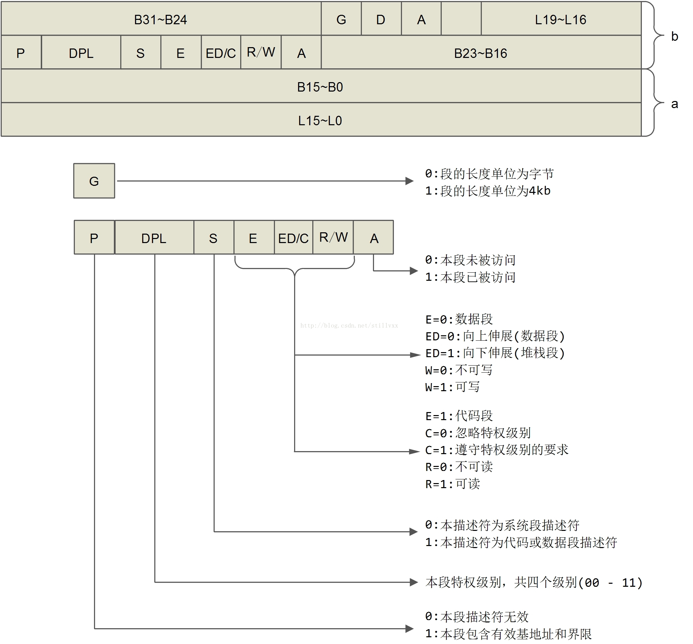

参考：  
http://blog.csdn.net/stillvxx/article/details/40707437

我们说一个CPU是16位的或32位的或64位的，指定是CPU中的ALU单元（算术逻辑单元）的宽度，通常也就是**数据总线**的宽度。那么地址总线呢？自然的，从程序设计的角度我们希望其与数据总线的宽度一致，这样一个地址也就是一个指针，其与整数同宽，在进行指针运算时，直接拿整数运算指令就可了，不需要专门的“指针运算指令”。

在8086时代，当时数据总线的宽度是16位的，不出意外的话，**地址总线也是16位的**，也就是可以访问64k的内存空间。但在当时intel的设计师预计到了内存需求的变化，决定将内存空间扩大。扩大到多少呢？决定扩大到1M。1M的内存空间需要20bit来表示，于是**地址总线扩展到20位**。可是我们的ALU仍然是16位的，也就是说可以直接拿来运算的指针的长度也是16位的，超过16位就溢出了（我们可以想象下，当时的整型是16位，20位的数是无法表示和计算的），那怎么填补这个空白？方法有很多种，比如增设20位的指令专用于地址运算与操作，但那样又会造成CPU内部结构体的不均匀性。intel设计师采用一种巧妙的办法，即分段的方法。

8086中设置四个段寄存器：CS/DS/SS/ES，分别表示代码段、数据段、堆栈段和其他段。**每个段都是16位的，用作地址总线的高16位**。每条访存指令中的“**内部地址**”都是16位的，再将内部地址送到地址总线之前，要与对应的段寄存器进行拼接形成20位的地址，然后再送到地址总线上去寻址。地址拼接的操作为：送往地址总线上的地址 = 段基址 << 4 + 内部地址。

这种寻址方式给坏分子可乘之机。首先，**修改段寄存器内容的指令不是特权指令，这样谁都可以更改段基址**；其次，**段基址一旦确定，一个进程就能所以访问从此开始的64k（2^16）内存**。这样一来，谁都可以访问内存空间中的任何一个内存单元，这是很危险的。8086这种寻址方式缺乏对内存空间的保护，为了区别于后来的“保护模式”，就称为“实地址模式”。

显然，在“实地址模式”是无法构筑现代的操作系统的。

到了386时代，数据总线和地址总线都扩展到32位了，可以寻址4GB的内存空间了。按照我们的想法，intel该重新来过，可以摒弃段式内存管理了。但是为了兼容，依然采用段式内存管理。并且需要在段式内存管理的基础实现保护模式，即对内存空间的保护。为了对内存空间进行保护，这样几项工作必须要做：

1、由段寄存器“确定”的基址不要透漏给用户，即用户无从读取段基址

2、修改段基址的指令必须是特权指令

3、每个段上必须加权限控制，权限不够，不许对内存进行访问

有了这3个要求，286时代的“根据段寄存器确定段基址”方法已经行不通了，我们需要的不仅仅是基址，还需要访问权限等额外的信息，而且我们不想把具体的基址暴露给用户。

为了解决这些问题，intel引入一个中间结构体，段描述符。并增设了两个寄存器：GDTR(global descriptor talbe register)指向全局段描述符数组（表）；LDTR(localdescriptor table register)执行局部段描述符数组（表）。而6个段寄存器，CS/DS/SS/ES包括后来的FS/GS，其内容不在用作基址，而是用作索引去段描述符数组中查找对应的段描述符。

段描述符占8个字节，其定义以及其中各个标志位的定义如下：

通过段描述符，我们能够得到如下信息：

①段的基址，由B31-B24/B23-B16/B15-B0构成，一共32位，**基址可以是4GB空间中任意地址**；

②段的长度，由L19-L16/L15-L0构成，一共20位。如果G位为0，表示段的长度单位为字节，则段的最大长度是1M，如果G位为1，表示段的长度单位为4kb，则段的最大长度为1M*4K=4G。假定我们把段的基地址设置为0，而将段的长度设置为4G，这样便构成了一个从0地址开始，覆盖整个4G空间的段。访存指令中给出的“逻辑地址”，就是放到地址总线上的“物理地址”，intel称其为flat地址即平面地址，linux内核采用的就是平面地址。

③段的类型，代码段还是数据段，可读还是可写

**描述符表**存储在由操作系统维护着的特殊数据结构中，并且由处理器的内存管理硬件来引用。这些特殊结构应该保存在仅由操作系统软件访问的**受保护的内存区域**中，以防止应用程序修改其中的地址转换信息。同时，为了避免每次访问内存时都通过段寄存器去查表、去读和解码一个段描述符，每次更改段寄存器的内容时，CPU将段寄存器指向的段描述符中的段基址、长度以及访问控制信息等加载到**CPU**中的“**影子结构**”中缓存起来。后续对该段的访问控制都通过“影子结构体”来进行。

但是如果可以修改GDTR和LDTR的内容呢？我们不就可以随便指定GDTR到我们自己伪造的段描述数组从而掌控程序吗？为了解决这个问题，intel将访问这两个寄存器的专门指令设为**特权指令**（LGDT/LLDT,SGDT/SLDT），这些指令只有当CPU处于系统状态（即在操作系统内核中）才能使用，**用户空间**无法访问寄存器的内容。

这样一来，工作1-2就完成了。

16位段寄存器中的内容，称之为段选择符，除了高13位用作段描述符数组的索引外（因此理论上段描述符数组最多可以8192个元素），低3位有其他的用途，如下所示：

由于有两个描述符数组，所以TI（Table Index）位用来确定从哪个数组中索引。

在前面的段描述符结构中，我们看到了**特权级别字段**（DPL，段描述符中），为什么还需要在这里设置一个特权字段(RPL，段选择符中)呢？

intel的CPU有四种特权级别，0级最高，3级最低。**每条指令都有其适用级别**，如前述的LGDT指令要求0级特权，通常用户的应用程序都是3级。linux中对CPU特权进行了简化，只区分用户级别和系统级别，分别对应3级和0级，这是后话。一般**应用程序的当前级别**由其代码段的**局部段描述符**（即段寄存器CS索引LDTR指向的局部描述符项）**中的dpl**(descriptor privilege level)决定，当然，**每个段描述符的dpl都是在0级状态下由内核设定的**。**而全局段描述符中的dpl有所不同，它表示所需的级别**。段选择符中的rpl也表示请求级别。这样，当我们需要改变某个段寄存器（比如数据段DS）中的内容（段选择符）来访问一款新段空间时，CPU要做权限检查：

①当前程序有权访问新的段吗？比较当前程序的当前级别与新段描述符中的dpl

②新的段选择符有权访索引新的段吗？比较新的段选择符中的rpl与新段描述符的dpl。

当然，具体的权限检查比这要复杂，设计到段描述符中C位的取值，详情情况请参考其他资料。

至此，工作1-3都完成了，保护模式已经建立了，我们来看看当访存指令给出“逻辑地址”时，CPU如何将其转换为“物理地址”送往地址总线：

①根据指令性质确定该使用哪个段寄存器，如跳转指令则目标地址在代码段CS，取数据的指令目标地址在数据段；

②根据段寄存器的内容找到对应的段描述符。其实这一步不用找，前面介绍过了，段寄存器对应的段描述符已经在CPU的“影子结构”中了。

③从段描述符中获得基址

④将指令中的“逻辑地址”与段的长度比较，确定是否越界

⑤根据指令的性质和段描述符中的访问权限确定是否越权

⑥将指令中的“逻辑地址”作为位移，与基地址相加得到实际的“物理地址”