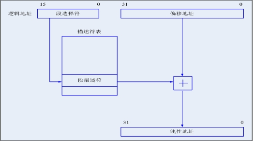
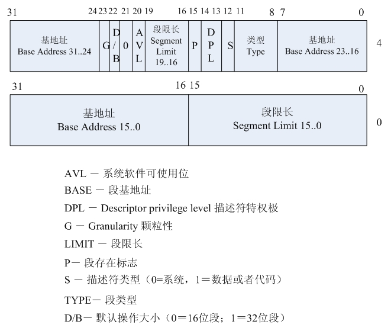
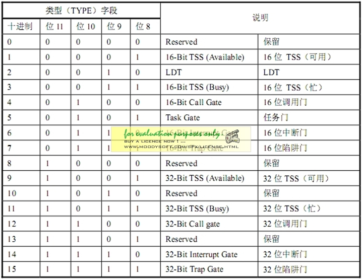
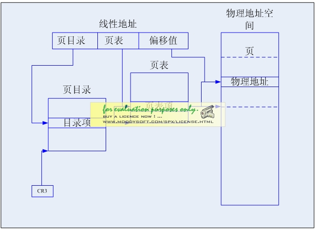
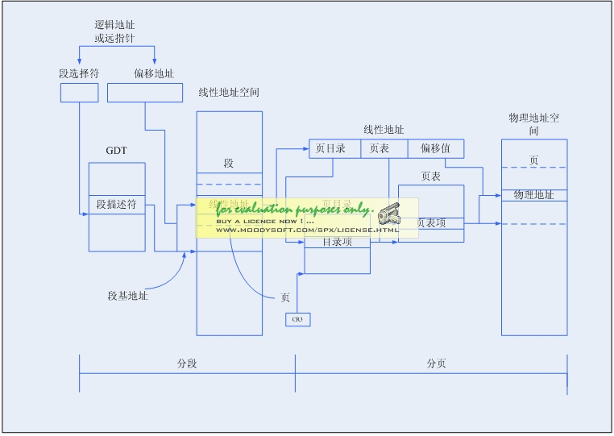
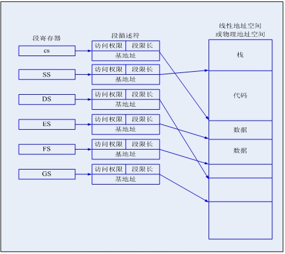

```
转载请注明出处：http://blog.csdn.net/rosetta
```

### 64KB－4GB－64TB？

为什么实模式下最大寻址空间为1MB？

段的最大长度不超过64KB？

而保护模式下为啥最大寻址能力就变成了64TB？每个段最大也达4GB？

分段和分页?

**寻址能力都达64TB**了，为啥我的电脑内存只有2GB呢？这64TB就是所谓的**虚拟地址空间**，也叫**逻辑地址空间**，它能够寻址这么多，只是它有这个能力，并不代表你的内存就要装这么大，你内存比它小再多也不会影响你工作，反过来，要是它的寻址能力只有1MB，而你有2GB的内存，那么那1.999GB就没有实际用处了，这就太浪费资源了。

而实际上这个64TB也没有什么实际意义，因为**32位的地址总线**能寻址的**线性地址空间和物理地址空间**都是2\^32（其实指的是2\^32个地址）=4GB（根据单位为字节算出来的）。这个64TB是怎么出来的，稍后揭晓。

### 实模式与保护模式的来历

最早期的8086 CPU只有一种工作方式，那就是**实模式**，而且**数据总线为 16位**，**地址总线为20位**，实模式下**所有寄存器都是16位**。

而从80286开始就有了保护模式，从80386开始CPU**数据总线和地址总线均为32位**，而且**寄存器都是32位**。

但80386以及现在的奔腾、酷睿等等CPU为了向前兼容都保留了实模式，现代操作系统在刚加电时首先运行在实模式下，然后再切换到保护模式下运行。

### 三种地址

逻辑地址：即逻辑上的地址，**实模式**下由“段基地址+段内偏移”组成；**保护模式**下由“段选择符+段内偏移”组成。

线性地址：逻辑地址经分段机制后就成线性地址，它是平坦的；如果不启用分页，那么此线性地址即物理地址。

物理地址：线性地址经分页转换后就成了物理地址。

### 实模式寻址方式

刚才说了8086 CPU**数据总线**为16位，也就是一次最多能取**2\^16（数值范围是0x0000 ~ 0xFFFF）＝64KB数据**，这个数据也解释了实模式下为什么**每个段最大只有64KB**。但刚才还说了其地址总线为20位，这样它能寻址的能力其实是2^20=1MB，这也就是实模式下CPU的最大寻址能力。既然它有1MB寻址能力，那怎么用16位的段寄存器表示呢？

这就引出了分段的概念，8086 CPU将1MB存储空间分成许多逻辑段，每个段最大限长为64KB（但不一定就是64KB）。这样每个存储单元就可以用“段基地址+段内偏移地址”表示。段基地址由**16位段寄存器值**左移4位表达，段内偏移表示相对于某个段起始位置的偏移量。

比如：

```
SEG=0x07c0
jmpi offset, #SEG
offset: mov ax,cs 
```

### 保护模式寻址方式
    
在定义“逻辑地址”时看到保护模式和实模式的区别在于它是**用段选择符而非段基地址**，这也许就是保护模式的真谛所在，从段选择符入手，全面理解保护模式编程基本概念和寻址方式。

### 分段机制

下面来看下保护模式是怎样通过“段选择符+段内偏移”寻址最终的线性地址或物理地址的。

图1 逻辑地址到线性地址转换，这里的逻辑地址即指保护模式下的“段选择符+段内偏移地址”，如果不启用分页管理的情况下，那么此线性地址即最终的物理地址。



在理解此图时必须要明白段选择符结构、描述符表概念等，下面就一一介绍。
如图2段选择符结构，段选择符为16位，它不直接指向段，而是通过指向的段描述符，段描述符（一会介绍）再定义段的信息。


其中TI用来指明全局描述符表GDT还是局部描述符表LDT，RPL表示请求特权级，索引值为13位，所以从这里看出，在保护模式下最多可以表示2^13=8192个段描述符，而TI又分GDT和LDT（如图3所示），所以一共可以表示8192*2=16384个段描述符，每个段描述符可以指定一个具体的段信息，所以一共可以表示16384个段。而图1看出，段内偏移地址为32位值，所以一个段最大可达4GB，这样16384*4GB＝64TB，这就是所谓的64TB最大寻址能力，也即逻辑地址/虚拟地址。

在保护模式实际编程中，如下一条语句：jmpi 0, 8。其中的8即段选择符，8的二进制表示为：0000 0000 0000 1000b，所以这条语句的意思是跳转到GDT表（TI＝0）中的第2个（段描述符表从０开始编号，所以这里的1指表中的第2个）段描述符定义的段中，其段内偏移为0。


下面再来看段描述符结构，段描述符表中的每一项为一个段描述符，每一项为8字节，其结构如图4所示。



从图中可知，段选择符指向的段描述符里有三个部分基地址信息，这三部分组成一个32位地址就决定了段基地址位置，此地址再加上段内偏移最终确定线性地址位置。

段描述符中的S位和TYPE字段（四位）的不同又分为数据段描述符、代码段描述符（S=1）和系统段描述符(S=1)。数据段和代码段描述符类型如图5所示。


系统段描述符如图6所示。



### 分页机制

到目前为止我们知道了保护模式下是怎样通过段选择符指向一个段描述符，最终由段描述符+段内偏移定位线性地址，在不启用分页情况下，此线性地址就是物理地址，那么在启用分页情况下，又是怎样实现内存的映射转换的呢？这就是伟大的分页机制。

分页机制如下图所示，它把物理内存分成相同固定大小的页面，2^12=4KB。每个页面的0~4KB范围由线性地址的低12位表示，线性地址空间的高10位用来指定页目录中的位置，可以选择2^10=1024个目录项，每个目录项为四字节，所以页目录为1024\*4B=4KB。每个目录项中的高20位用以查找页表在物理内存中的页面，每个页表含1024个页表项，每个页表项也是四字节，这样一页表也是1024\*4B=4KB。所以一个页目录可以查找1024个页表，每个页表为4KB，所以总共可以查找的页表大小为1024\*4KB＝4MB大。最后每个页表项的高20位用以定位物理地址空间中的某个页基地址，此地址再加上线性地址空间的偏移值就是最后物理内存空间单元。目录项和页表项结构如图8所示。




从一个逻辑地址经过分段和分页寻址物理地址的整个过程就如图9所示。总的来说整个过就是逻辑地址经分段机制变成线性地址，如果不启用分页的情况下，此线性地址就是物理地址；如果启用分页，那么线性地址经分页机制变成物理地址。



### 分段和分页的意义

说了半天分段和分页的原理，它们到底有何用？这里以保护模式下分段和分页讲解。
 


如图10所示。一个多段模型充分发挥了段机制的对代码、数据结构和程序提供硬件保护的能力。每个程序都有自己的段描述符表和自己的段。段可以完全属于程序私有也可以和其它程序之间共享。
访问权限的检查不仅仅用来保护地址越界，也可以保护某一特定段不允许操作。例如代码段是只读段，硬件可以阻击向代码段进行写操作。
分页为需求页、虚拟内存提供实现机制。具体的实现机制可以再深入学习。

### 文献资料

- 《深入理解Linux内核》
- 《Linux内核完全剖析》赵炯
- 《Linux内核设计与实现》
- 《Linux内核修炼之道》
- 《新版汇编语言程序设计》钱晓捷著
- 《windows环境下32位汇编语言程序设计》罗云彬著