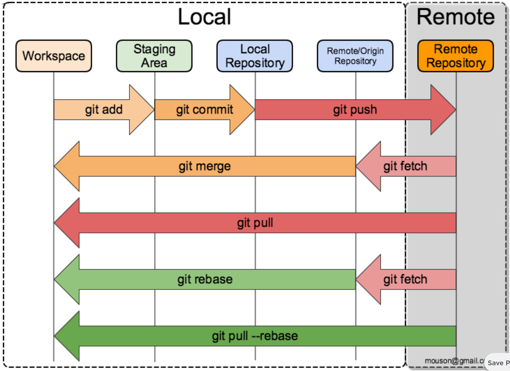

来源：张京  

www.fengerzh.com/git-reset/



## 1. 基本概念

### 3个步骤


正常情况下，我们的工作流就是3个步骤，对应上图中的3个箭头线：

```
git add .
git commit -m "comment"
git push
```

- git add .把所有文件放入暂存区；
- git commit把所有文件从暂存区提交进本地仓库；
- git push把所有文件从本地仓库推送进远程仓库。
 
#### 4个区

- 工作区(Working Area)
- 暂存区(Stage)
- 本地仓库(Local Repository)
- 远程仓库(Remote Repository)

## 2. 检查修改

### 已修改，未暂存

```
git diff
```

### 已暂存，未提交

```
git diff --cached
```

git diff这个命令只检查我们的工作区和暂存区之间的差异，如果我们想看到暂存区和本地仓库之间的差异，就需要加一个参数git diff --cached。

### 已提交，未推送

```
git diff master origin/master
```

在这里，master就是你的本地仓库，而origin/master就是你的远程仓库，master是主分支的意思，因为我们都在主分支上工作，所以这里两边都是master，而origin是远程。

## 3. 撤销修改

### 已修改，未暂存

```
git checkout .
```

或者

```
git reset --hard
```

一对反义词 git add .的反义词是git checkout .。做完修改之后，如果你想向前走一步，让修改进入暂存区，就执行git add .，如果你想向后退一步，撤销刚才的修改，就执行git checkout .。

### 已暂存，未提交

```
git reset
git checkout .
```

或者

```
git reset --hard
```

git reset只是把修改退回到了git add .之前的状态，也就是说文件本身还处于**已修改未暂存**状态，你如果想退回未修改状态，还需要执行git checkout .。

### 已提交，未推送

```
git reset --hard origin/master
```

### 已推送

先恢复本地仓库，再强制push到远程仓库。

```
git reset --hard HEAD^
git push -f
```

## 4. 总结

以上4种状态的撤销我们都用到了同一个命令git reset --hard，前2种状态的用法甚至完全一样，所以只要掌握了git reset --hard这个命令的用法，从此你再也不用担心提交错误了。