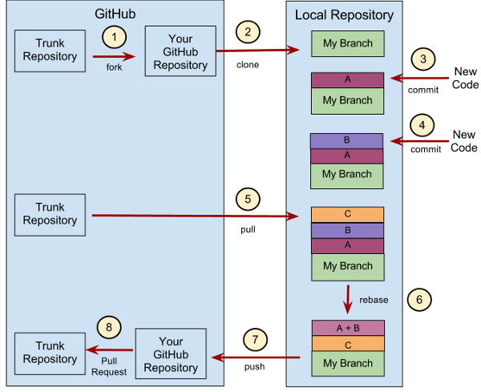

# 背景

下面是 ThoughtBot 的Git使用规范流程。我从中学到了很多，推荐你也这样使用Git。

ThoughtBot: https://github.com/thoughtbot/guides/tree/master/protocol/git



# 第一步: 新建分支

首先，每次开发新功能，都应该新建一个单独的分支

```
# 获取主干最新代码
$ git checkout master
$ git pull

# 新建一个开发分支myfeature
$ git checkout -b myfeature
```

# 第二步：提交分支commit

分支修改后，就可以提交commit了。

```
$ git add --all
$ git status
$ git commit --verbose
```

git add 命令的all参数，表示保存所有变化（包括新建、修改和删除）。从Git 2.0开始，all是 git add 的默认参数，所以也可以用 git add . 代替。

git status 命令，用来查看发生变动的文件。

git commit 命令的verbose参数，会列出 diff 的结果。

# 第三步：撰写提交信息

提交commit时，必须给出完整扼要的提交信息，下面是一个范本。

```
Present-tense summary under 50 characters

* More information about commit (under 72 characters).
* More information about commit (under 72 characters).

http://project.management-system.com/ticket/123
```

第一行是不超过50个字的提要，然后空一行，罗列出改动原因、主要变动、以及需要注意的问题。最后，提供对应的网址（比如Bug ticket）。

# 第四步：与主干同步

分支的开发过程中，要经常与主干保持同步。

```
$ git fetch origin
$ git rebase origin/master
```

# 第五步：合并commit

分支开发完成后，很可能有一堆commit，但是合并到主干的时候，往往希望只有一个（或最多两三个）commit，这样不仅清晰，也容易管理。

那么，怎样才能将多个commit合并呢？这就要用到 git rebase 命令。

# 参考

http://www.ruanyifeng.com/blog/2015/08/git-use-process.html