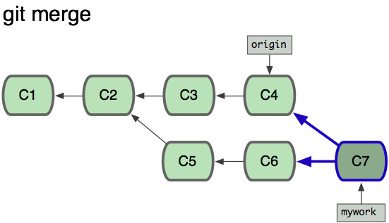

> https://blog.csdn.net/wh_19910525/article/details/7554489

git merge是用来合并两个分支的。


```
# 将b分支合并到当前分支
git merge b
```

同样 git rebase b，也是把 b分支合并到当前分支

他们的 原理 如下：

假设你现在基于远程分支"origin"，创建一个叫"mywork"的分支。

```
$ git checkout -b mywork origin
```

假设远程分支"origin"已经有了2个提交，如图


现在我们在这个分支做一些修改，然后生成两个提交(commit).

```
$ vi file.txt
$ git commit
$ vi otherfile.txt
$ git commit
...
```

但是与此同时，有些人也在"origin"分支上做了一些修改并且做了提交了. 这就意味着"origin"和"mywork"这两个分支各自"前进"了，它们之间"分叉"了。


在这里，你可以用"pull"命令把"origin"分支上的修改拉下来并且和你的修改合并； 结果看起来就像一个新的"合并的提交"(merge commit):



但是，如果你想让"mywork"分支历史看起来像没有经过任何合并一样，你也许可以用 git rebase:

```
$ git checkout mywork
$ git rebase origin
```

这些命令会把你的"mywork"分支里的每个提交(commit)取消掉，并且把它们临时 保存为补丁(patch)(这些补丁放到".git/rebase"目录中),然后把"mywork"分支更新 为最新的"origin"分支，最后把保存的这些补丁应用到"mywork"分支上。


当'mywork'分支更新之后，它会指向这些新创建的提交(commit),而那些老的提交会被丢弃。 如果运行垃圾收集命令(pruning garbage collection), 这些被丢弃的提交就会删除. （请查看 git gc)


## 二、解决冲突

在rebase的过程中，也许会出现冲突(conflict). 在这种情况，Git会停止rebase并会让你去解决 冲突；在解决完冲突后，用"git-add"命令去更新这些内容的索引(index), 然后，你无需执行 git-commit,只要执行:

```
$ git rebase --continue
```

这样git会继续应用(apply)余下的补丁。
在任何时候，你可以用--abort参数来终止rebase的行动，并且"mywork" 分支会回到rebase开始前的状态。

```
$ git rebase --abort
```

## 三、git rebase和git merge的区别

现在我们可以看一下用合并(merge)和用rebase所产生的历史的区别：


当我们使用Git log来参看commit时，其commit的顺序也有所不同。

假设C3提交于9:00AM,C5提交于10:00AM,C4提交于11:00AM，C6提交于12:00AM,

对于使用git merge来合并所看到的commit的顺序（从新到旧）是：C7 ,C6,C4,C5,C3,C2,C1

对于使用git rebase来合并所看到的commit的顺序（从新到旧）是：C7 ,C6‘,C5',C4,C3,C2,C1

因为C6'提交只是C6提交的克隆，C5'提交只是C5提交的克隆，从用户的角度看使用git rebase来合并后所看到的commit的顺序（从新到旧）是：C7 ,C6,C5,C4,C3,C2,C1