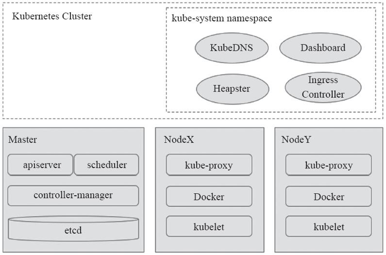
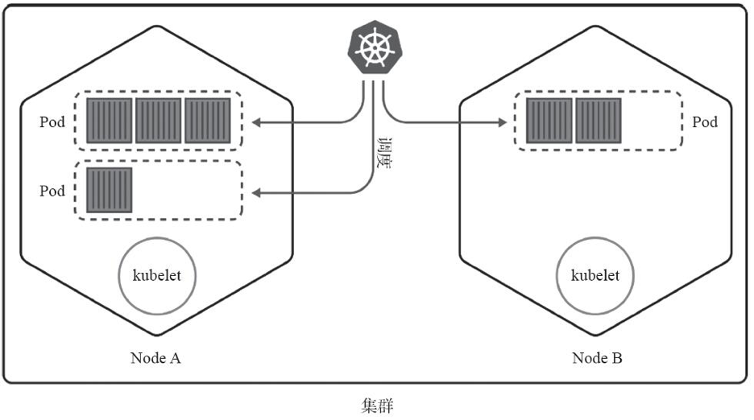

<!-- @import "[TOC]" {cmd="toc" depthFrom=1 depthTo=6 orderedList=false} -->

<!-- code_chunk_output -->

- [1. Kubernetes集群组成](#1-kubernetes集群组成)
- [2. Master组件](#2-master组件)
  - [2.1. API Server](#21-api-server)
  - [2.2. 集群状态存储（Cluster State Store）](#22-集群状态存储cluster-state-store)
  - [2.3. 控制器管理器（Controller Manager）](#23-控制器管理器controller-manager)
  - [2.4. 调度器（Scheduler）](#24-调度器scheduler)
- [3. Node组件](#3-node组件)
  - [3.1. Node的核心代理程序kubelet](#31-node的核心代理程序kubelet)
  - [3.2. 容器运行时环境](#32-容器运行时环境)
  - [3.3. kube-proxy](#33-kube-proxy)
- [4. 核心附件](#4-核心附件)
  - [4.1. KubeDNS](#41-kubedns)
  - [4.2. Kubernetes Dashboard](#42-kubernetes-dashboard)
  - [4.3. Heapster](#43-heapster)
  - [4.4. Ingress Controller](#44-ingress-controller)

<!-- /code_chunk_output -->

# 1. Kubernetes集群组成

一个典型的Kubernetes集群由**多个工作节点（worker node**）和**一个集群控制平面（control plane，即Master**），以及**一个集群状态存储系统！！！（etcd**）组成。

其中**Master节点**负责**整个集群的管理工作**，为集群**提供管理接口**，并**监控和编排集群中的各个工作节点**。

**各节点**负责**以Pod的形式运行容器**，因此，各节点需要事先配置好**容器运行依赖到的所有服务和资源**，如**容器运行时环境！！！** 等。Kubernetes的系统架构如图1-11所示。

图1-11　Kubernetes系统组件:

**Master节点**主要由**apiserver**、**controller\-manager**和**scheduler**三个组件，以及一个用于**集群状态存储的etcd存储服务**组成，而**每个Node节点**则主要包含**kubelet**、**kube\-proxy**及**容器引擎**（Docker是最为常用的实现）等组件。

此外，**完整的集群服务**还依赖于一些**附加组件**，如**KubeDNS**等。

# 2. Master组件

Kubernetes的**集群控制平面**由**多个组件组成**，这些组件可统一运行于**单一Master节点**，也可以以**多副本的方式**同时运行于**多个节点**，以为Master提供高可用功能，甚至还可以运行于Kubernetes集群自身之上。

Master主要包含以下几个组件。

## 2.1. API Server

API Server负责输出**RESTful风格**的Kubernetes API，它是发往集群的**所有REST操作命令**的**接入点**，并负责**接收**、**校验**并**响应所有的REST请求**，**结果状态被持久存储于etcd**中。

因此，API Server是**整个集群的网关**。

## 2.2. 集群状态存储（Cluster State Store）

Kubernetes集群的**所有状态信息都需要！！！持久存储于存储系统etcd**中，不过，**etcd**是由CoreOS基于Raft协议开发的**分布式键值存储**，可用于**服务发现**、**共享配置**以及**一致性保障**（如数据库主节点选择、分布式锁等）。因此，etcd是**独立的服务组件**，并**不隶属于Kubernetes集群自身**。生产环境中应该以**etcd集群的方式**运行以确保其服务**可用性**。

**etcd**不仅能够提供**键值数据存储**，而且还为其提供了**监听（watch）机制！！！**，用于**监听！！！** 和**推送！！！变更**。

Kubernetes集群系统中，etcd中的**键值发生变化**时会**通知到API Server！！！**，并由其**通过watch API！！！向客户端输出**。基于**watch机制**，Kubernetes集群的**各组件实现了高效协同**。

## 2.3. 控制器管理器（Controller Manager）

Kubernetes中，**集群级别**的**大多数功能**都是由几个被称为**控制器！！！的进程执行实现**的，**这几个进程！！！被集成于kube\-controller\-manager守护进程！！！** 中。

由**控制器完成的功能**主要包括**生命周期功能**和**API业务逻辑**，具体如下。

* **生命周期功能**：包括**Namespace创建**和**生命周期**、**Event垃圾回收**、**Pod终止相关的垃圾回收**、**级联垃圾回收**及**Node垃圾回收**等。
* **API业务逻辑**：例如，由**ReplicaSet！！！** 执行的**Pod扩展**等。

## 2.4. 调度器（Scheduler）

Kubernetes是用于**部署和管理大规模容器**应用的平台，根据**集群规模的不同**，其托管运行的容器很可能会数以千计甚至更多。

**API Server**确认Pod对象的**创建请求**之后，便需要**由Scheduler**根据集群内**各节点的可用资源状态**，以及要运行的容器的**资源需求**做出调度决策，其工作逻辑如图1-12所示。

另外，Kubernetes还支持用户**自定义调度器**。

图1-12　Kubernetes调度器:

# 3. Node组件

Node负责提供运行容器的各种依赖环境，并接受Master的管理。每个Node主要由以下几个组件构成。

## 3.1. Node的核心代理程序kubelet

（1）Node的核心代理程序kubelet

kubelet是运行于工作节点之上的**守护进程**，它**从API Server接收关于Pod对象的配置信息**并**确保它们处于期望的状态**（desired state，后文不加区别地称之为“目标状态”）。

kubelet会在**API Server**上**注册当前工作节点**，**定期向Master汇报节点资源使用情况**，并通过**cAdvisor！！！监控容器和节点的资源占用状况**。

## 3.2. 容器运行时环境

（2）容器运行时环境

**每个Node**都要提供一个**容器运行时（Container Runtime）环境**，它负责**下载镜像**并**运行容器**。

kubelet并未固定链接至某容器运行时环境，而是以**插件的方式载入配置的容器环境**。这种方式清晰地定义了各组件的边界。目前，Kubernetes支持的容器运行环境至少包括**Docker**、**RKT**、**cri\-o**和**Fraki**等。

## 3.3. kube-proxy

（3）kube-proxy

每个工作节点都需要运行一个**kube-proxy守护进程**，它能够按需**为Service资源对象！！！生成iptables或ipvs规则**，从而捕获访问当前Service的ClusterIP的流量并将其转发至正确的后端Pod对象。

# 4. 核心附件

Kubernetes集群还依赖于一组称为“**附件”（add\-ons**）的组件以提供完整的功能，它们通常是由第三方提供的特定应用程序，且托管运行于Kubernetes集群之上，如图1-11所示。

下面列出的几个附件各自为集群从不同角度引用了所需的核心功能。

## 4.1. KubeDNS

* KubeDNS：在Kubernetes集群中调度运行提供DNS服务的Pod，同一集群中的其他Pod可使用此DNS服务**解决主机名**。

Kubernetes自**1.11版本**开始默认使用**CoreDNS项目**为集群提供**服务注册**和**服务发现**的**动态名称解析服务**，之前的版本中用到的是kube\-dns项目，而SkyDNS则是更早一代的项目。

## 4.2. Kubernetes Dashboard

* Kubernetes Dashboard：Kubernetes集群的全部功能都要基于Web的UI，来管理集群中的应用甚至是集群自身。

## 4.3. Heapster

* Heapster：**容器**和**节点**的**性能监控**与**分析系统**，它**收集并解析多种指标数据**，如**资源利用率**、**生命周期事件**等。

新版本的Kubernetes中，其功能会逐渐由**Prometheus结合其他组件所取代**。

## 4.4. Ingress Controller

* Ingress Controller：**Service**是一种工作于**传统层的负载均衡器**，而**Ingress**是在**应用层实现的HTTP（s）负载均衡机制**。

不过，Ingress资源自身并不能进行“流量穿透”，它仅是**一组路由规则的集合**，这些规则需要通过**Ingress控制器**（Ingress Controller）发挥作用。目前，此类的可用项目有Nginx、Traefik、Envoy及HAProxy等。

