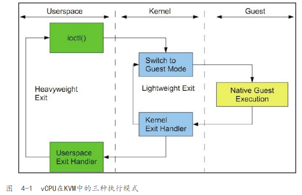
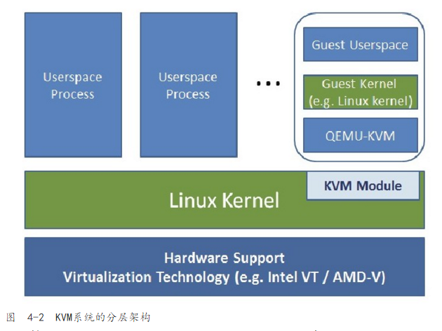
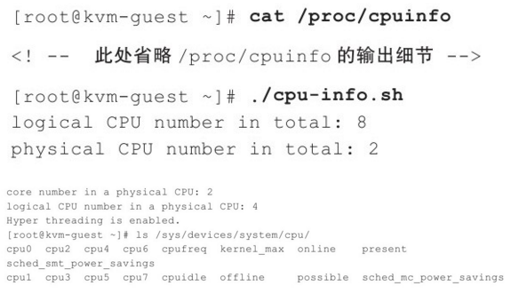
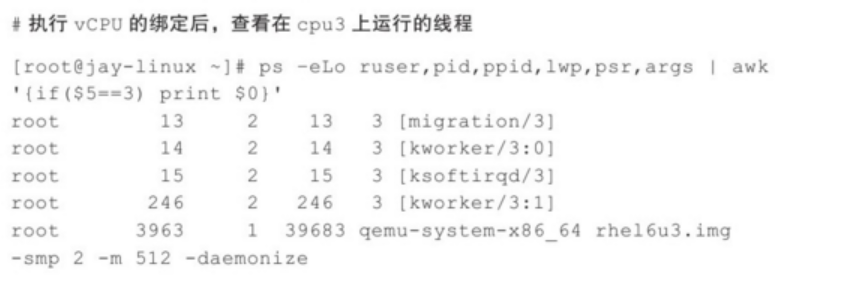
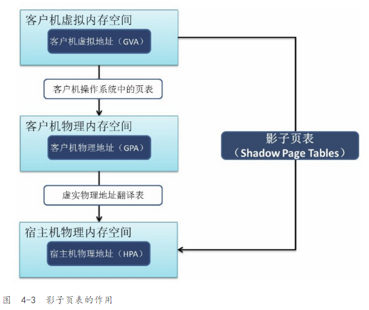
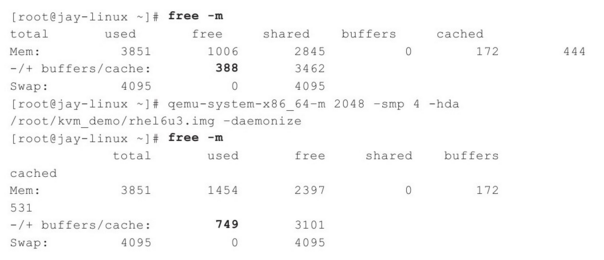
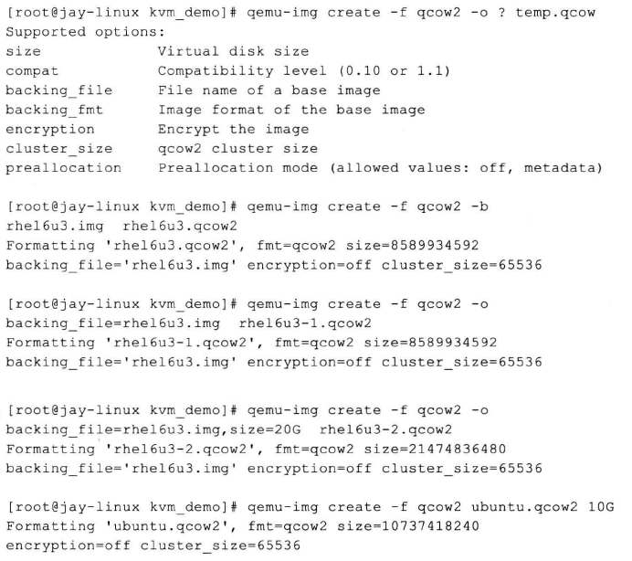
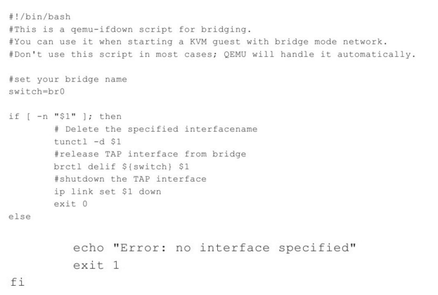

```
第4章　KVM核心基础功能
4.1　硬件平台和软件版本说明
4.2　CPU配置
4.2.1　vCPU的概念，KVM的三种模式相互切换，切换图
4.2.2　SMP的支持，参考cpu-info.sh,/proc/cpuinfo文件查看系统cpu，多核心，超线程等情况
     qemu-system-x86_64 -smp(或不加） 8  其他参数   /*.img
4.2.3　CPU过载使用
         利用客户机使用物理CPU时间差异，保证物理CPU一直处在最大状态，如果8核物理机，开3个客户机都是8核的，但3个客户机运行的时间不一样，一个早上，一个下午，一个晚上。
4.2.4　CPU模型
      qemu64,kvm64,等
      好处：便于迁移，兼容等问题
4.2.5　进程的处理器亲和性和vCPU的绑定（**）
      一个进程在前一个时间片是在CPUM上，但是在后一个时间片是在CPUN上，
      亲和性是指：将进程绑定到指定的一个或多个CPU上，而不允许将进程调度到其他进程上。
      每个vCPU是宿主机上的一个普通的Qemu进程，使用taskset工具，设置处理器的亲和性，将某个vCPU绑定到某个或几个固定的cpu上去调度。
      测试步骤：
        1）启动宿主机时，在linux内核上加上“isolcpus="参数，实现cpu的隔离，从宿主机中隔离出几个cpu供客户机使用；
        2）启动2个客户机，并实现vcpu和物理cpu的绑定。

4.3　内存配置
4.3.1　内存设置基本参数
    1)qemu-system-x86_64 rhe16u3.img
    2)客户机中，free -m  ,查看内核使用的情况
                         dmesg

4.3.2　EPT和VPID简介
    客户机虚拟地址GVA——>客户机物理地址GPA转换，通过客户机操作系统实现
    客户机物理地址GPA——>宿主机物理地址HPA转换，通过Hypervisor实现
   
    影子页表，软件实现GVA——>HPA的转换过程，后来引入EPT，硬件实现GVA——GPA——HPA的转换。
    VPID，虚拟处理器标识，在硬件上为每个TLB项增加一个标识，用于区分不同的虚拟处理器的地址空间。
4.3.3　大页（Huge Page）
    4KB的内存页——>2MB的内存页，减少了内存页的数量，提高了缓存命中率，这是一种提高性能的技术手段。
4.3.4　内存过载使用
    内存不足，解决方案
    1）内存交换，和交换分区来交换，openstack目测使用的就是这种方式。
            性能较差，要求（物理内存空间+交换空间大小总和）>所有客户机的内存总和。
            举例：64个内存1G的客户机，32G内存的物理机，如何分区，其中宿主机维持自身进程占用资源4G。
                   客户机要求的交换分区总和   64x1G+4G-32G=36G.
                   安装redhat建议，32G的物理内存，建议使用8G的交换分区。
                   故而，在宿主机中使用 44GB(36GB+8GB)的交换分区来满足安全使用内存过载问题。
    2）气球（ballooning技术），通过virio_balloon驱动来实现宿主机和客户机之间的协作。网易的openstack实践中好像就是用这种。
    3）页共享（page sharing），通过KSM合并多个客户机进程使用相同的内存页。
4.4　存储配置
4.4.1　存储配置和启动顺序
         1）qumu-kvm参数      -hda file    /  -hdb file  / ... /  -fdb  file  ； -driver参数
         2）客户机的启动顺序：即类似Bios中系统引导顺序
         3）举例
4.4.2　qemu-img命令
        1）qemu-img check rhe16.img 检查镜像文件；
        2）qemu-img create -f qcow2 -o ? temp.cow
        3)  qemu-img convertmy -o qcow2 rhe16.img rhe16-1.gcow2
        4)  qemu-img info rhe16.img
        5)  snapshot  /rebase /resize  
4.4.3　QEMU支持的镜像文件格式
        1)raw——原始格式，一次性占用磁盘空间。
        2）qcow2——支持稀疏文件和加密、压缩。qcow——老版本，支持后端镜像和加密
        3）sheepdog——为KVM虚拟化提供块存储，单点无故障，淘宝贡献较多。
        4）clinder——openstack镜像块存储。
4.4.4　客户机存储方式
        1）物理磁盘或磁盘分区；
        2）LVM
        3）分布式文件系统，NFS，iSCSI，GFS2

4.5　网络配置
        1）QEMU支持的网络模式——virtio类型
        A.使用网桥模式，通过linux-bridge来实现。此部分可以实际参考。
        B.使用NAT模式——此部分可以参考，讲的不错。
                dnsmasq，宿主机中运行的DHCP工具，给宿主机分配NAT内网的IP地址。基本架构图。
                bridge-util 管理linux-brige的工具
                iptables 对内核中IPv4包过滤工具和NAT管理工具。
        C.QEMU内部的用户模式网络
                Qeum自身实现的网络管理，性能差，不常用。
        D.其他网络选项

4.6　图形显示
4.6.1　SDL的使用
4.6.2　VNC的使用
4.6.3　VNC显示中的鼠标偏移
4.6.4　非图形模式
4.6.5　显示相关的其他选项
```

KVM采用的完全虚拟化（Full Virtualizaiton）技术,客户机（Guest）操作系统是未经过修改的普通操作系统。在硬件虚拟化技术的支持下，内核的KVM模块与QEMU的设备模拟协同工作，就构成了一整套与物理计算机系统完全一致的虚拟化的计算机软硬件系统。


一个完整的计算机系统，必不可少的子系统包括：处理器（CPU）、内存（Memory）、存储（Storage）、网络（Network）、显示（Display）等。本章将会介绍KVM环境中这些基本子系统的基本概念、原理、配置和实践。

1. 硬件平台和软件版本说明

本章以及第5章中，默认硬件平台（CPU）是Intel(R)Xeon(R)CPU E5-4600（Romley-EP 4S），软件系统中宿主机和客户机都是RHEL6.3系统，而宿主机内核是KVM内核3.5版本，用户态的QEMU是qemu-kvm 1.1.0版本，并且各个实验中在使用qemu-kvm时都开启了KVM加速的功能。

（1）硬件平台

一般使用支持硬件辅助虚拟化（如Intel的VT-x）的硬件平台即可。

（2）KVM内核

选取一个较新的又较稳定的正式发布版本。可以通过如下链接下载Linux 3.5版本：

http://www.kernel.org/pub/linux/kernel/v3.x/linux-3.5.tar.gz.

如果是在linux.git的源代码仓库中，可以查询到v3.5这个发布标签。如下：


如果使用的是kvm.git，由于没有Linux的v3.5版本标签，不能直接执行“git checkout v3.5"，因此需要在“git log”中查询到Linux发布3.5版本的信息，然后切换到对应的commit，如下：


切换到合适的源码版本就可以进行配置、编译、安装等操作。参考第三章内容。

（3）qemu-kvm

qemu-kvm使用2012年7月初发布的qemu-kvm-1.1.0版本，下载：

http://sourceforge.net/projects/kvm/files/qemu-kvm/1.1.0/qemu-kvm-1.1.0.tar.gz.

在qemu-kvm.git的GIT代码仓库中，可以先通过"git tag"命令查看有哪些标签，然后找到"qemu-kvm-1.1.0"标签，用"git checkout qemu-kvm-1.1.0"（或"git reset--hard qemu-kvm-1.1.0"）命令切换到1.1.0的qemu-kvm版本。

（4）QEMU命令行开启KVM加速功能

如果使用的是qemu-kvm命令行，默认开启了对KVM的支持的，可以通过在QEMU monitor中的"info kvm"命令来看是否显示"kvm support:enabled"。如果使用的不是qemu-kvm而是普通QEMU，可能KVM没有被打开，需要在QEMU启动命令行加上“-enable-kvm”参数。

2. CPU配置

在QEMU/KVM中，QEMU提供对CPU的模拟；在KVM打开的情况下，客户机中CPU指令的执行由硬件处理器的虚拟化功能（如Intel VT-x和AMD AMD-V）来辅助执行，效率很高。

2.1 vCPU的概念

QEMU/KVM为客户机提供一套完整的硬件系统环境，在客户机看来所拥有的CPU即vCPU(virtual cpu)。在KVM环境中，每个客户机都是一个标准的Linux进程（QEMU进程），而每个vCPU在宿主机中是QEMU进程派生的一个普通线程。

普通Linux中，进程一般有两种执行模式：内核模式和用户模式。而在KVM环境中，增加了第三种模式：客户模式。vCPU在三种执行模式下的分工如下：

(1) 用户模式（User Mode）

主要处理I/O的模拟和管理，由QEMU的代码实现。

(2) 内核模式（Kernel Mode）

主要处理特别需要高性能和安全相关的指令，如处理客户模式到内核模式的转换，处理客户模式下的I/O指令或其他特权指令引起的退出（VM-Exit），处理影子内存管理（shadow MMU）。

(3) 客户模式（Guest Mode）

主要执行Guest中的大部分指令，I/O和一些特权指令除外（它们会引起VM-Exit，被hypervisor截获并模拟）。

vCPU在KVM中的三种执行模式下的转换如下图。



在KVM环境中，整个系统基本架构如下。



KVM的内核部分是作为可动态加载内核模块运行在宿主机中的，其中一个模块是和硬件平台无关的实现虚拟化核心基础架构的kvm模块，另一个是硬件平台相关的kvm_intel（或kvm_amd）模块。而KVM中的一个客户机是作为一个用户空间进程（qemu-kvm）运行的，它和其他普通的用户空间进程（如gnome、kde、firefox、chrome等）一样由内核来调度使其运行在物理CPU上，不过它由KVM模块的控制，可以在前面介绍的三种执行模式下运行。多个客户机就是宿主机中的多个QEMU进程，而一个客户机的多个vCPU就是一个QEMU进程中的多个线程。

2.2 SMP的支持

SMP(Symmetric Multi-Processor,对称多处理器)。在SMP系统中，多个程序（进程）可以做到真正并行执行，而单个进程的多个线程也能并行执行。

在硬件方面，早期更多的是在一个主板上拥有多个物理的CPU插槽来实现SMP系统，后来随着多核技术、超线程（Hyper-Threading）技术的出现，SMP系统就会使用多处理器、多核、超线程等技术中的一个或多个。

在操作系统软件方面，多数的现代操作系统都提供了对SMP系统的支持。

在Linux中，下面的脚本（cpu-info.sh）可以根据/proc/cpuinfo文件来检查当前系统中CPU数量、多核及超线程的使用情况。


QEMU在给客户机模拟CPU时，也可以提供对SMP（Symmetric Multi-processing，对称多处理）架构的模拟，让客户机运行在SMP系统中，充分利用物理硬件的SMP并行处理优势。每个vCPU在宿主机中都是一个线程，并且宿主机Linux系统是支持多任务处理的，因此可以通过两种操作来实现客户机的SMP，一是将不同的vCPU的进程交换执行（分时调度，即使物理硬件非SMP，也可以为客户机模拟出SMP系统环境），二是将在物理SMP硬件系统上同时执行多个vCPU的进程。

在qemu-kvm命令行中，"-smp"参数即是为了配置客户机的SMP系统，其具体参数如下：

```
-smp n[,maxcpus=XX][,cores=XX][,threads=XX][,sockets=XX]
```

其中：

- n用于设置客户机中使用的逻辑CPU数量（默认值是1）。
- maxcpus用于设置客户机中最大可能被使用的CPU数量，包括启动时处于下线（offline）状态的CPU数量（可用于热插拔hot-plug加入CPU，但不能超过maxcpus这个上限）。
- cores用于设置每个CPU socket上的core数量（默认值是1）。
- threads用于设置每个CPU core上的线程数（默认值是1）。
- sockets用于设置客户机中看到的总的CPU socket数量。

示例：

```
qemu-system-x86_64 -smp 8,sockets=2,cores=2,threads=2 /root/kvm_demo/rhel6u3.img
```

客户机中的CPU信息如下：



客户机中共有8个逻辑CPU（cpu0～cpu7），2个CPU socket，每个socket有2个核，每个核有2个线程（超线程处于打开状态）。

2.3 CPU过载使用

KVM允许客户机过载使用（over-commit）物理资源。

CPU的过载使用，是让一个或多个客户机使用vCPU的总数量超过实际拥有的物理CPU数量。QEMU会启动更多的线程来为客户机提供服务，这些线程也是被Linux内核调度运行在物理CPU硬件上。

关于CPU的过载使用，推荐的做法是对多个单CPU的客户机使用over-commit，比如，在拥有4个逻辑CPU的宿主机中，同时运行多于4个（如8个、16个）客户机，其中每个客户机都分配一个vCPU。这时，如果每个宿主机的负载不是很大，宿主机Linux对每个客户机的调度是非常有效的，这样的过载使用并不会带来客户机的性能损失。

最不推荐的做法是让某一个客户机的vCPU数量超过物理系统上存在的CPU数量。比如，在拥有4个逻辑CPU的宿主机中，同时运行一个或多个客户机，其中每个客户机的vCPU数量多于4个（如16个）。这样的使用方法会带来比较明显的性能下降，其性能反而不如为客户机分配2个（或4个）vCPU的情况，而且如果客户机中负载过重，可能会让整个系统运行不稳定。不过，在并非100%满负载的情况下，一个（或多个）有4个vCPU的客户机运行在拥有4个逻辑CPU的宿主机中并不会带来明显的性能损失。

2.4 CPU模型

每一种虚拟机管理程序（Virtual Machine Monitor，简称VMM或Hypervisor）都会定义自己的策略，让客户机看起来有一个默认的CPU类型。有的Hypervisor会简单地将宿主机中CPU的类型和特性直接传递给客户机使用，而QEMU/KVM在默认情况下会向客户机提供一个名为qemu64或qemu32的基本CPU模型。QEMU/KVM的这种策略会带来一些好处，如可以对CPU特性提供一些高级的过滤功能，还可以将物理平台根据提供的基本CPU模型进行分组（如几台IvyBridge和Sandybridge硬件平台分为一组，都提供相互兼容的SandyBridge或qemu64的CPU模型），从而让客户机在同一组硬件平台上的动态迁移更加平滑和安全。

如下命令行可以查看当前的QEMU支持的所有CPU模型

```
qemu-system-x86_64 -cpu ?
```

输出如下：


其中，加了方括号的"qemu64"、"kvm64"、"kvm32"等CPU模型死QEMU命令中原生自带（build-in）的，未加方括号的"SandyBridge"、"Westmere"、"Nehalem"等CPU模型是在配置文件中配置的。原生自带的CPU模型是在源代码qemu-kvm.git/target-i386/cpu.c中的结构体数组builtin_x86_defs[]中定义的，而用于自定义配置CPU模型的文件在源代码仓库中为qemu-kvm.git/sysconfigs/target/cpus-x86_64.conf（安装后的路径一般为/usr/local/share/qemu/cpus-x86_64.conf）。不过，在qemu-kvm-1.3.0版本中，QEMU开发者删除了cpus-x86_64.conf这个文件，而将所有CPU模型的定义都放在了target-i386/cpu.c文件中。

在x86-64平台上编译和运行的QEMU，在不加“-cpu”参数启动时，采用“qemu64”作为默认的CPU模型。可以用"-cpu cpu_model"来指定在客户机中的CPU模型。CPU的vendor_id、cpu family、flags、cpuid level等都是在cpus-x86_64.conf文件中配置好的。

2.5 进程的处理器亲和性和vCPU的绑定

通常在SMP系统中，Linux内核的进程调度器根据自有的调度策略将系统中的一个进程调度到某个CPU上执行。一个进程在前一个执行时间是在cpuM（M为系统中的某CPU的ID）上运行，而在后一个执行时间是在cpuN（N为系统中另一CPU的ID）上运行。因为Linux对进程执行的调度采用时间片法则（即用完自己的时间片立即暂停执行），而在默认情况下，一个普通进程或线程的处理器亲和性体现在所有可用的CPU上，进程或线程有可能在这些CPU之中的任何一个（包括超线程）上执行。

进程的处理器亲和性（Processor Affinity），即CPU的绑定设置，是指将进程绑定到特定的一个或多个CPU上去执行，而不允许将进程调度到其他的CPU上。Linux内核对进程的调度算法也是遵守进程的处理器亲和性设置的。设置进程的处理器亲和性带来的好处是可以减少进程在多个CPU之间交换运行带来的缓存命中失效（cache missing），从该进程运行的角度来看，可能带来一定程度上的性能提升。换个角度来看，对进程亲和性的设置也可能带来一定的问题，如破坏了原有SMP系统中各个CPU的负载均衡（load balance），这可能会导致整个系统的进程调度变得低效。特别是在多处理器、多核、多线程技术使用的情况下，在NUMA（Non-Uniform Memory Access）结构的系统中，如果不能基于对系统的CPU、内存等有深入的了解，对进程的处理器亲和性进行设置可能导致系统的整体性能的下降而非提升。

每个vCPU都是宿主机中的一个普通的QEMU线程，可以使用taskset工具对其设置处理器亲和性，使其绑定到某一个或几个固定的CPU上去调度。尽管Linux内核的进程调度算法已经非常高效了，在多数情况下不需要对进程的调度进行干预，不过，在虚拟化环境中有时有必要将客户机的QEMU进程或线程绑定到固定的逻辑CPU上。

提供一个有两个逻辑CPU计算能力的一个客户机。要求CPU资源独立被占用，不受宿主机中其他客户机的负载水平的影响。为了满足这个需求，可以分如下两个步骤来实现。

第一步，启动宿主机时隔离出两个逻辑CPU专门供一个客户机使用。在Linux内核启动的命令行加上"isolcpus="参数，可以实现CPU的隔离。例如，隔离了cpu2和cpu3的grub的配置文件如下：


在系统启动后，在宿主机中检查是否隔离成功，命令行如下：


由上面的命令行输出信息可知，cpu0和cpu1上分别有106和107个线程在运行，而cpu2和cpu3上分别只有4个线程在运行。而且，根据输出信息中cpu2和cpu3上运行的线程信息（也包括进程在内），分别有migration进程（用于进程在不同CPU间迁移）、两个kworker进程（用于处理workqueues）、ksoftirqd进程（用于调度CPU软中断的进程），这些进程都是内核对各个CPU的一些守护进程。没有其他的普通进程在cup2和cpu3上运行，说明对它们的隔离是生效的。

ps命令显示当前系统的进程信息的状态，它的"-e"参数用于显示所有的进程，"-L"参数用于将线程（LWP，light-weight process）也显示出来，"-o"参数表示以用户自定义的格式输出（其中"psr"这列表示当前分配给进程运行的处理器编号，"lwp"列表示线程的ID，"ruser"表示运行进程的用户，"pid"表示进程的ID，"ppid"表示父进程的ID，"args"表示运行的命令及其参数）。结合ps和awk工具的使用，是为了分别将在处理器cpu2和cpu3上运行的进程打印出来。

第二步，启动一个拥有两个vCPU的客户机并将其vCPU绑定到宿主机中两个CPU上。此操作过程的命令行如下：




对于taskset命令，此处用法是：taskset -p [mask] pid。其中，mask是一个代表了处理器亲和性的掩码数字，转化为二进制表示后，其值从最低位到最高位分别代表了第一个逻辑CPU到最后一个逻辑CPU，进程调度器可能将该进程调度到所有标志为“1”的位代表的逻辑CPU上去运行。根据上面的输出，在运行taskset命令之前，QEMU线程的处理器亲和性mask值是0x3（其二进制值为0011），可知其可能会被调度到cpu0和cpu1上运行；而在运行"taskset -p 0x4 3967"命令后，提示新的mask值被设为0x4（其二进制值为0100），所以该进程就只能被调度到cpu2上去运行，即通过taskset工具实现了将vCPU进程绑定到特定的CPU上。

在上面命令行中，根据ps命令可以看到QEMU的线程和进程的关系，但如何查看vCPU与QEMU线程之间的关系呢？可以切换（使用"Ctrl+Alt+2"快捷键）到QEMU monitor中进行查看，运行"info cpus"命令即可（还记得3.6节中运行过的"info kvm"命令吧），其输出结果如下：


客户机中的cpu0对应的线程ID为3967，cpu1对应的线程ID为3968。另外，"CPU#0"前面有一个星号（*），是标识cpu0是BSP（Boot Strap Processor，系统最初启动时在SMP生效前使用的CPU）。

3. 内存配置

作用是暂时存放CPU中将要执行的指令和数据，所有程序的运行都必须先载入到内存中才能够执行。本节主要介绍KVM中内存的配置。

3.1 内存设置基本参数

通过QEMU命令行启动客户机时设置内存大小的参数如下：

-m megs　#设置客户机的内存为megs MB大小

默认的单位为MB，也支持加上"M"或"G"作为后缀来显式指定使用MB或GB作为内存分配的单位。如果不设置-m参数，QEMU对客户机分配的内存大小默认值为128MB。

free命令用于查看内存的使用情况，"-m"参数是内存大小以MB为单位来显示，以上信息中显示总的内存为112MB，这个值与128MB有一定差距，其原因是free命令显示的总内存是除去了内核执行文件占用内存和一些系统保留的内存之后能使用的内存。而通过dmesg命令显示的内核打印的信息可以看出，内核检测到总的内存为131064 KB，几乎是完完整整的128MB内存了（128*1024=131072，与131064非常接近）。

通过/proc/meminfo看到的"MemTotal"的大小为1048568kB，比1024MB稍小，其原因与前面free命令输出的总内存是一样的。

3.2 EPT和VPID简介

EPT（Extended Page Tables，扩展页表），属于Intel的第二代硬件虚拟化技术，它是针对内存管理单元（MMU）的虚拟化扩展。EPT降低了内存虚拟化的难度（与影子页表相比），也提升了内存虚拟化的性能。是CPU硬件的一个特性。

和运行在真实物理硬件上的操作系统一样，在客户机操作系统看来，客户机可用的内存空间也是一个从零地址开始的连续的物理内存空间。为了达到这个目的，Hypervisor（即KVM）引入了一层新的地址空间，即客户机物理地址空间，这个地址空间不是真正的硬件上的地址空间，它们之间还有一层映射。所以，在虚拟化环境下，内存使用就需要两层的地址转换，即客户机应用程序可见的客户机虚拟地址（Guest Virtual Address,GVA）到客户机物理地址（Guest Physical Address，GPA）的转换，再从客户机物理地址（GPA）到宿主机物理地址（Host Physical Address，HPA）的转换。其中，前一个转换由客户机操作系统来完成，而后一个转换由Hypervisor来负责。

在硬件EPT特性加入之前，影子页表（Shadow Page Tables）是从软件上维护了从客户机虚拟地址（GVA）到宿主机物理地址（HPA）之间的映射，每一份客户机操作系统的页表也对应一份影子页表。有了影子页表，在普通的内存访问时都可实现从GVA到HPA的直接转换，从而避免了上面前面提到的两次地址转换。Hypervisor将影子页表载入到物理上的内存管理单元（Memory Management Unit，MMU）中进行地址翻译。下图展示了GVA、GPA、HPA之间的转换以及影子页表的作用。



尽管影子页表提供了在物理MMU硬件中能使用的页表，但缺点明显。首先影子页表实现非常复杂，导致其开发、调试和维护都比较困难。其次，影子页表的内存开销也比较大，因为需要为每个客户机进程对应的页表的都维护一个影子页表。

Intel的CPU提供了EPT技术（AMD提供的类似技术叫做NPT，即Nested Page Tables），直接在硬件上支持GVA--＞GPA--＞HPA的两次地址转换，从而降低内存虚拟化实现的复杂度，也进一步提升了内存虚拟化的性能。图4-4展示了Intel EPT技术的基本原理。


CR3（控制寄存器3）将客户机程序所见的客户机虚拟地址（GVA）转化为客户机物理地址（GPA），然后在通过EPT将客户机物理地址（GPA）转化为宿主机物理地址（HPA）。这两次转换地址转换都是由CPU硬件来自动完成的，其转换效率非常高。在使用EPT的情况下，客户机内部的Page Fault、INVLPG（使TLB项目失效）指令、CR3寄存器的访问等都不会引起VM-Exit，因此大大减少了VM-Exit的数量，从而提高了性能。另外，EPT只需要维护一张EPT页表，而不需要像“影子页表”那样为每个客户机进程的页表维护一张影子页表，从而也减少了内存的开销。

VPID（VirtualProcessor Identifiers，虚拟处理器标识），是在硬件上对TLB资源管理的优化，通过在硬件上为每个TLB项增加一个标识，用于不同的虚拟处理器的地址空间，从而能够区分开Hypervisor和不同处理器的TLB。硬件区分了不同的TLB项分别属于不同虚拟处理器，因此可以避免每次进行VM-Entry和VM-Exit时都让TLB全部失效，提高了VM切换的效率。由于有了这些在VM切换后仍然继续存在的TLB项，硬件减少了一些不必要的页表访问，减少了内存访问次数，从而提高了Hypervisor和客户机的运行速度。VPID也会对客户机的实时迁移（Live Migration）有很好的效率提升，会节省实时迁移的开销，会提升实时迁移的速度，降低迁移的延迟（Latency）。

VPID与EPT是一起加入到CPU中的特性，也是Intel公司在2009年推出Nehalem系列处理器上新增的与虚拟化相关的重要功能。

在Linux操作系统中，可以通过如下命令查看/proc/cpuinfo中的CPU标志来确定当前系统是否支持EPT和VPID功能。

grep ept /proc/cpuinfo

grep pvpid /proc/cpuinfo

在宿主机中，可以根据sysfs文件系统中kvm_intel模块的当前参数值来确定KVM是否打开EPT和VPID特性。在默认情况下，如果硬件支持了EPT、VPID，则kvm_intel模块加载时默认开启EPT和VPID特性，这样KVM会默认使用它们。


在加载kvm_intel模块时，可以通过设置ept和vpid参数的值来打开或关闭EPT和VPID。当然，如果kvm_intel模块已经处于加载状态，则需要先卸载这个模块，在重新加载之时加入所需的参数设置。当然，一般不要手动关闭EPT和VPID功能，否则会导致客户机中内存访问的性能下降。


3.3 大页（Huge Page）

x86（包括x86-32和x86-64）架构的CPU默认使用4KB大小的内存页面，但是它们也支持较大的内存页，如x86-64系统就支持2MB大小的大页（huge page）。

Linux2.6及以上的内核都支持huge page。如果在系统中使用了huge page，则内存页的数量会减少，从而需要更少的页表（page table），节约了页表所占用的内存数量，并且所需的地址转换也减少了，TLB缓存失效的次数就减少了，从而提高了内存访问的性能。另外，由于地址转换所需的信息一般保存在CPU的缓存中，huge page的使用让地址转换信息减少，从而减少了CPU缓存的使用，减轻了CPU缓存的压力，让CPU缓存能更多地用于应用程序的数据缓存，也能够在整体上提升系统的性能。

在KVM中，也可以将huge page的特性应用到客户机中，qemu-kvm就提供了"-mem-path FILE"参数选项用于使用huge page。另外，还有一个参数"-mem-prealloc"可以让宿主机在启动客户机时就全部分配好客户机的内存，而不是在客户机实际用到更多内存时才按需分配。-mem-prealloc必须在有"-mem-path"参数时才能使用。提前分配好内存的好处是客户机的内存访问速度更快，缺点是客户机启动时就得到了所有的内存，从而让宿主机的内存很快减少了（而不是根据客户机的需求而动态调整内存分配）。

可以通过在宿主机中的如下几个操作让客户机使用huge page。

（1） 检查宿主机目前状态，检查默认内存大小和内存使用情况


（2） 挂载hugetlbfs文件系统，命令为 “mount -t hugetlbfs hugetlbfs /dev/hugepages”


（3） 设置hugepage的数量，命令为"sysctl vm.nr_hugepages=num"


（4） 启动客户机让其使用hugepage的内存，使用"-mem-path"参数


（5） 查看宿主机中huge page的使用情况，可以看到"HugePages_Free"数量减少，因为客户机使用了一定数量的hugepage。在如下的输出中，"HugePages_Free"数量的减少没有512（512*2MB=1024MB）那么多，这是因为启动客户机时并没有实际分配1024MB内存，qemu-kvm命令行中加上前面提到的"-mem-prealloc"参数就会让meminfo文件中"HugePages_Free"的数量减少和分配给客户机的一致。


对于内存访问密集型的应用，在KVM客户机中使用huge page是可以较明显地提高客户机性能的，不过，它也有一个缺点，使用huge page的内存不能被换出（swap out），也不能使用ballooning方式自动增长。

3.4 内存过载使用

一般来说，有如下三种方式来实现内存的过载使用。

1）内存交换（swapping）：用交换空间（swap space）来弥补内存的不足。

2）气球（ballooning）：通过virio_balloon驱动来实现宿主机Hypervisor和客户机之间的协作。

3）页共享（page sharing）：通过KSM（Kernel Samepage Merging）合并多个客户机进程使用的相同内存页。

其中，第一种内存交换的方式是最成熟的（Linux中很早就开始应用），也是目前广泛使用的，不过，相比KSM和ballooning的方式效率较低一些。ballooning和KSM将在第5章中详细介绍，本章主要介绍利用swapping这种方式实现内存过载使用。

KVM中客户机是一个QEMU进程，宿主机系统没有特殊对待它而分配特定的内存给QEMU，只是把它当做一个普通Linux进程。Linux内核在进程请求更多内存时才分配给它们更多的内存，所以也是在客户机操作系统请求更多内存时，KVM才向其分配更多的内存。用swapping方式来让内存过载使用，要求有足够的交换空间（swap space）来满足所有的客户机进程和宿主机中其他进程所需内存。可用的物理内存空间和交换空间的大小之和应该等于或大于配置给所有客户机的内存总和，否则，在各个客户机内存使用同时达到较高比率时可能会有客户机（因内存不足）被强制关闭。

下面通过一个实际的例子来说明如何计算应该分配的交换空间大小以满足内存的过载使用。

某个服务器有32GB的物理内存，想在其上运行64个内存配置为1GB的客户机。在宿主机中，大约需要4GB大小的内存来满足系统进程、驱动、磁盘缓存及其他应用程序所需内存（不包括客户机进程所需内存）。计算过程如下：
客户机所需交换分区为：64 x 1GB+4GB-32GB=36GB。
根据Redhat的建议，对于32GB物理内存的RHEL系统，推荐使用8GB的交换分区。

所以，在宿主机中总共需要建立44GB（36GB+8GB）的交换分区来满足安全实现客户机内存的过载使用。

下面是在一台Ivy Bridge桌面级的硬件平台上进行的简单实验，可以看出客户机并非一开始就在宿主机中占用其启动时配置的内存。
在宿主机中，在启动客户机之前和之后查看到的系统内存情况如下：



在客户机中，查看内存使用情况如下：


一般不建议过多地过载使用内存。一方面，交换空间通常是由磁盘分区来实现的，其读写速度比物理内存读写速度慢得多，性能并不好；另一方面，过多的内存过载使用也可能导致系统稳定性降低。

4. 存储配置

本节主要以磁盘、光盘等为例介绍KVM中的存储配置。

4.1　存储配置和启动顺序

QEMU提供了对多种块存储设备的模拟，包括IDE设备、SCSI设备、软盘、U盘、virtio磁盘等，而且对设备的启动顺序提供了灵活的配置。

1.存储的基本配置选项

在qemu-kvm命令行工具中，主要有如下的参数来配置客户机的存储。

（1）-hda file

将file镜像文件作为客户机中的第一个IDE设备（序号0），在客户机中表现为/dev/hda设备（若客户机中使用PIIX_IDE驱动）或/dev/sda设备（若客户机中使用ata_piix驱动）。如果不指定-hda或-hdb等参数，那么在前面一些例子中提到的"qemu-system-x86_64/root/kvm_demo/rhel6u3.img"就与加上-hda参数来指定镜像文件的效果一样的。另外，也可以将宿主机中的一个硬盘（如/dev/sdb）作为-hda的file参数来使用，从而让整个硬盘模拟为客户机的第一个IDE设备。如果file文件的文件名中包含有英文逗号（“,”），则在书写file时应该使用两个逗号（因为逗号是qemu-kvm命令行中的特殊间隔符，例如用于"-cpu qemu64,+vmx"这样的选项），如使用"-hda my,,file"将my,file这个文件作为客户机的第一个IDE设备。

（2）-hdb file

将file作为客户机中的第二个IDE设备（序号1），在客户机中表现为/dev/hdb或/dev/sdb设备。

（3）-hdc file

将file作为客户机中的第三个IDE设备（序号2），在客户机中表现为/dev/hdc或/dev/sdc设备。

（4）-hdd file

将file作为客户机中的第四个IDE设备（序号3），在客户机中表现为/dev/hdd或/dev/sdd设备。

（5）-fda file

将file作为客户机中的第一个软盘设备（序号0），在客户机中表现为/dev/fd0设备。也可以将宿主机中的软驱（/dev/fd0）作为-fda的file来使用。

（6）-fdb file

将file作为客户机中的第二个软盘设备（序号1），在客户机中表现为/dev/fd1设备。

（7）-cdrom file

将file作为客户机中的光盘CD-ROM，在客户机中通常表现为/dev/cdrom设备。也可以将宿主机中的光驱（/dev/cdrom）作为-cdrom的file来使用。注意，-cdrom参数不能和-hdc参数同时使用，因为"-cdrom"就是客户机中的第三个IDE设备。在通过物理光驱中的光盘或磁盘中ISO镜像文件安装客户机操作系统时（参见3.5节安装客户机），一般会使用-cdrom参数。

（8）-mtdblock file

使用file文件作为客户机自带的一个Flash存储器（通常说的闪存）。

（9）-sd file

使用file文件作为客户机中的SD卡（Secure Digital Card）。

（10）-pflash file

使用file文件作为客户机的并行Flash存储器（Parallel Flash Memory）。

2. 详细配置存储驱动器的-driver参数

qemu-kvm还提供了"-driver"参数来详细定义一个存储驱动器，该参数的具体形式如下：

-driver option[, option[,option[, ...]]]

3. 配置客户机启动顺序的参数

-boot [order=drivers][,once=drivers][,menu=on|off][,splash=splashfile][,splash-time=sp-time]

在QEMU模拟的X86 PC平台上，用"a"、"b"分别表示第一和第二个软驱，用"c"表示第一个硬盘，用"d"表示CD-ROM光驱，用"n"表示从网络启动。其中，默认从硬盘启动，要从光盘启动可以设置"-boot order=d"。"once"表示设置第一次启动的启动顺序，在系统重启（reboot）后该设置即无效，如"-boot once=d"设置表示本次从光盘启动，但系统重启后从默认的硬盘启动。"memu=on|off"用于设置交互式的启动菜单选项（前提是使用的客户机BIOS支持），它的默认值是"menu=off"，表示不开启交互式的启动菜单选择。"splash=splashfile"和"splash-time=sp-time"选项都是在"menu=on"时才有效，将名为splashfile的图片作为logo传递给BIOS来显示，而sp-time是BIOS显示splash图片的时间，其单位是毫秒（ms）。下图展示了在使用"-boot order=dc,menu=on"设置后，在客户机启动窗口中按F12进入的启动菜单。


4. 存储配置示例

通过如下的3个等价命令之一启动一个客户机。

1）qemu-system-x86_64 -m 1024 -smp 2 rhel6u3.img

2）qemu-system-x86_64 -m 1024 -smp 2 -hda rhel6u3.img

3）qemu-system-x86_64 -m 1024 -smp 2 -drive file=rhel6u3.img,if=ide,cache=writethrough

在客户机中查看磁盘情况，如下：

  
  

由于这个客户机使用的是piix_ide驱动，因此看到的是/dev/hda这样的磁盘，而对于同样一个磁盘，如果客户机操作系统使用的是ata_piix驱动（此时无piix_ide驱动），则看到的是/dev/sda这样的磁盘，效果如下：

  

4.2 qemu-img命令

qemu-img是QEMU的磁盘管理工具，在完成qemu-kvm源码编译后就会默认编译好qemu-img这个二进制文件。qemu-img也是QEMU/KVM使用过程中一个比较重要的工具，本节对其用法进行介绍。

基本用法如下：

qemu-img command [command options]

它支持的命令分为如下几种。

（1）check [-f fmt]filename

对磁盘镜像文件进行一致性检查，查找镜像文件中的错误，目前仅支持对"qcow2"、"qed"、"vdi"格式文件的检查。

其中，qcow2是QEMU 0.8.3版本引入的镜像文件格式，也是目前使用最广泛的格式。qed（QEMU enhanced disk）是从QEMU 0.14版开始加入的增强磁盘文件格式，避免了qcow2格式的一些缺点，也提高了性能，不过目前还不够成熟。而vdi（Virtual Disk Image）是Oracle的VirtualBox虚拟机中的存储格式。参数-f fmt是指定文件的格式，如果不指定格式，qemu-img会自动检测。filename是磁盘镜像文件的名称（包括路径）。

（2）create [-f fmt] [-o options] filename [size]

创建一个格式为fmt，大小为size，文件名为filename的镜像文件。根据文件格式fmt的不同，还可以添加一个或多个选项（options）来附加对该文件的各种功能设置，可以使用"-o ?"来查询某种格式文件支持哪些选项，在"-o"选项中各个选项用逗号来分隔。

如果在"-o"选项中使用了backing_file这个选项来指定其后端镜像文件，那么这个创建的镜像文件仅记录与后端镜像文件的差异部分。后端镜像文件不会被修改，除非在QEMU monitor中使用"commit"命令或使用"qemu-img commit"命令去手动提交这些改动。在这种情况下，size参数不是必须需的，其值默认为后端镜像文件的大小。另外，直接使用"-b backfile"参数也与"-o backing_file=backfile"效果相同。

size选项用于指定镜像文件的大小，其默认单位是字节（bytes），也可以支持k（即K）、M、G、T来分别表示KB、MB、GB、TB大小。另外，镜像文件的大小（size）也并非必须写在命令的最后，也可以写在"-o"选项中作为其中一个选项。

对create命令的演示如下所示，其中包括查询qcow2格式支持的选项、创建有backing_file的qcow2格式的镜像文件、创建没有backing_file的10GB大小的qcow2格式的镜像文件。

  

（3）commit [-f fmt] filename

提交filename文件中的更改到后端支持镜像文件（创建时通过backing_file指定的）中。

（4）convert [-c] [-f fmt] [-O output_fmt] [-o options] flename [flename2[...]] output_flename

将fmt格式的filename镜像文件根据options选项转换为格式为output_fmt的名为output_filename的镜像文件。这个命令支持不同格式的镜像文件之间的转换，比如可以用VMware使用的vmdk格式文件转换为qcow2文件，这对从其他虚拟化方案转移到KVM上的用户非常有用。一般来说，输入文件格式fmt由qemu-img工具自动检测到，而输出文件格式output_fmt根据自己需要来指定，默认会被转换为raw文件格式（且默认使用稀疏文件的方式存储以节省存储空间）。

其中，"-c"参数表示对输出的镜像文件进行压缩，不过只有qcow2和qcow格式的镜像文件才支持压缩，并且这种压缩是只读的，如果压缩的扇区被重写，则会被重写为未压缩的数据。同样可以使用"-o options"来指定各种选项，如后端镜像、文件大小、是否加密，等等。使用backing_file选项来指定后端镜像，使生成的文件成为copy-on-write的增量文件，这时必须让在转换命令中指定的后端镜像与输入文件的后端镜像的内容相同，尽管它们各自后端镜像的目录和格式可能不同。

如果使用qcow2、qcow、cow等作为输出文件格式来转换raw格式的镜像文件（非稀疏文件格式），镜像转换还可以起到将镜像文件转化为更小的镜像，因为它可以将空的扇区删除使之在生成的输出文件中不存在。

（5）info [-f fmt] filename

展示filename镜像文件的信息。如果文件使用的是稀疏文件的存储方式，也会显示出它本来分配的大小及实际已占用的磁盘空间大小。如果文件中存放有客户机快照，快照的信息也会被显示出来。

（6）snapshot [-l| -a snapshot|-c snapshot|-d snapshot]filename

"-l"选项表示查询并列出镜像文件中的所有快照，"-a snapshot"表示让镜像文件使用某个快照，"-c snapshot"表示创建一个快照，"-d"表示删除一个快照。

（7）rebase [-f fmt] [-t cache] [-p] [-u] -b backing_file [-F backing_fmt] filename

改变镜像文件的后端镜像文件，只有qcow2和qed格式支持rebase命令。使用"-b backing_file"中指定的文件作为后端镜像，后端镜像也被转化为"-F backing_fmt"中指定的后端镜像格式。

这个命令可以工作于两种模式之下，一种是安全模式（Safe Mode），这是默认的模式，qemu-img会根据比较原来的后端镜像与现在的后端镜像的不同进行合理的处理；另一种是非安全模式（Unsafe Mode），是通过"-u"参数来指定的，这种模式主要用于将后端镜像重命名或移动位置后对前端镜像文件的修复处理，由用户去保证后端镜像的一致性。

（8）resize filename[+|-]size

改变镜像文件的大小，使其不同于创建之时的大小。“+”和“-”分别表示增加和减少镜像文件的大小，size也支持K、M、G、T等单位的使用。缩小镜像的大小之前，需要在客户机中保证其中的文件系统有空余空间，否则会数据丢失，另外，qcow2格式文件不支持缩小镜像的操作。在增加了镜像文件大小后，也需启动客户机在其中应用"fdisk"、"parted"等分区工具进行相应的操作才能真正让客户机使用到增加后的镜像空间。不过使用resize命令时需要小心（做好备份），如果失败，可能会导致镜像文件无法正常使用而造成数据丢失。

4.3 QEMU支持的镜像文件格式

qemu-img支持非常多种的文件格式，可以通过"qemu-img -h"查看其命令帮助得到，它支持二十多种格式：blkdebug、blkverify、bochs、cloop、cow、tftp、ftps、ftp、https、http、dmg、nbd、parallels、qcow、qcow2、qed、host_cdrom、host_floppy、host_device、file、raw、sheepdog、vdi、vmdk、vpc、vvfat。

下面对其中的几种文件格式做简单的介绍。

（1）raw

原始的磁盘镜像格式，也是qemu-img命令默认的文件格式。优势在于它非常简单且非常容易移植到其他模拟器（emulator，QEMU也是一个emulator）上去使用。如果客户机文件系统（如Linux上的ext2/ext3/ext4、Windows的NTFS）支持“空洞”（hole），那么镜像文件只有在被写有数据的扇区才会真正占用磁盘空间，从而起到节省磁盘空间的作用，就如前面用"qemu-img info"命令查看镜像文件信息中看到的那样。qemu-img默认的raw格式的文件其实是稀疏文件（sparse file），而3.5节“安装客户机”中使用"dd"命令创建的镜像也是raw格式，不过那是一开始就让镜像实际占用了分配的空间，而没有使用稀疏文件的方式对待空洞来节省磁盘空间。尽管一开始就实际占用磁盘空间的方式没有节省磁盘的效果，不过这种方式在写入新的数据时不需要宿主机从现有磁盘空间中分配，因此在第一次写入数据时，这种方式的性能会比稀疏文件的方式更好一点。

（2）host_device

在需要将镜像转化到不支持空洞的磁盘设备时需要用这种格式来代替raw格式。

（3）qcow2

qcow2是QEMU目前推荐的镜像格式，它是功能最多的格式。它支持稀疏文件（即支持空洞）以节省存储空间，它支持可选的AES加密以提高镜像文件安全性，支持基于zlib的压缩，支持在一个镜像文件中有多个虚拟机快照。

在qemu-img命令中qcow2支持如下几个选项：

- backing_file，用于指定后端镜像文件。

- backing_fmt，设置后端镜像的镜像格式。

- cluster_size，设置镜像中簇的大小，取值在512B到2MB之间，默认值为64KB。较小的簇可以节省镜像文件的空间，而较大的簇可以带来更好的性能，需要根据实际情况来平衡，一般采用默认值即可。

- preallocation，设置镜像文件空间的预分配模式，其值可为"off"、"metadata"之一。"off"模式是默认值，设置了不为镜像文件预分配磁盘空间。而"metadata"模式用于设置为镜像文件预分配metadata的磁盘空间，所以这种方式生成的镜像文件稍大一点，不过在其真正分配空间写入数据时效率更高。另外，一些版本的qemu-img（如RHEL6.3自带的）还支持"full"模式的预分配，它表示在物理上预分配全部的磁盘空间，它将整个镜像的空间都填充零以占用空间，当然它所花费的时间较长，不过使用时性能更好。

- encryption用于设置加密，当它等于"on"时，镜像被加密。它使用128位密钥的ASE加密算法，故其密码长度可达16个字符（每个字符8位），可以保证加密的安全性较高。在将"qemu-img convert"命令转化为qcow2格式时，加上"-o encryption"即可对镜像文件设置密码，而在使用镜像启动客户机时需要在QEMU monitor中输入"cont"或"c"（是continue的意思）命令来唤醒客户机输入密码后继续执行（否则客户机将不会真正启动），命令行演示如下：

   

（4）qcow

较旧的QEMU镜像格式，现在已经很少使用了，一般用于兼容比较老版本的QEMU。它支持backing_file（后端镜像）和encryption（加密）两个选项。

（5）cow

用户模式Linux（User-Mode Linux）的Copy-On-Write的镜像文件格式。

（6）vdi

兼容Oracle（Sun）VirtualBox1.1的镜像文件格式（Virtual Disk Image）。

（7）vmdk

兼容VMware 4版本以上的镜像文件格式（Virtual Machine Disk Format）。

（8）vpc

兼容Microsoft的Virtual PC的镜像文件格式（Virtual Hard Disk format）。

（9）sheepdog

Sheepdog项目是由日本NTT实验室发起的，为QEMU/KVM做的一个开源的分布式存储系统，为KVM虚拟化提供块存储。它无单点故障（无类似于元数据服务器的中央节点），方便扩展（已经支持上千的节点数量），其配置简单、运维成本较低，总的来说，具有高可用性、易扩展性、易管理性等优势。

sheepdog项目的官方网站为：http://www.osrg.net/sheepdog/。

目前，国内的淘宝公司对该项目也有较大的贡献，详情可见淘宝sheepdog项目的网站：http://sheepdog.taobao.org/

4.4 客户机存储方式

在QEMU/KVM中，客户机镜像文件可以由很多种方式来构建，其中几种如下：

1）本地存储的客户机镜像文件。

2）物理磁盘或磁盘分区。

3）LVM（Logical Volume Management），逻辑分区。

4）NFS（Network File System），网络文件系统。

5）iSCSI（Internet Small Computer System Interface），基于Internet的小型计算机系统接口。

6）本地或光纤通道连接的LUN（Logical Unit Number）。

7）GFS2（Global File System 2）.

不仅一个文件可以分配给客户机作为镜像文件系统，而且一个完整的磁盘或LVM分区也可以作为镜像分配给客户机使用。不过，磁盘分区、LVM分区由于没有磁盘的MBR引导记录，不能作为客户机的启动镜像，只能作为客户机附属的非启动块设备。一般来说，磁盘或LVM分区会有较好的性能，读写的延迟较低、吞吐量较高。

而NFS作为使用非常广泛的分布式文件系统，可以使客户端挂载远程NFS服务器中的共享目录，然后像使用本地文件系统一样使用NFS远程文件系统。如果NFS服务器端向客户端开放了读写的权限，那么可以直接挂载NFS，然后使用其中的镜像文件作为客户启动磁盘。如果没有向客户端开放写权限，也可以在NFS客户端系统将远程NFS系统上的镜像文件作为后端镜像（backing file），以建立qcow2格式Copy-On-Write的本地镜像文件供客户机使用，这样做还有一个好处是保持NFS服务器上的镜像一致性、完整性，从而可以供给多个客户端同时使用。

在宿主机中，挂载NFS文件系统、建立qcow2镜像，然后启动客户机，如下所示：

  

在客户机中，查看磁盘文件系统，如下：

  

iSCSI是一套基于IP协议的网络存储标准，真正的物理存储放在初始端（initiator），而使用iSCSI磁盘的是目标端（target），它们之间实现了SCSI标准的命令，让目标端使用起来就和使用本地的SCSI硬盘一样，只是数据是在网络上进行读写操作的。光纤通道（Fibre Channel）也可以实现与iSCSI类似的存储区域网络（storage area network，SAN），不过它需要光纤作为特殊的网络媒介。而GFS2是由Redhat公司主导开发的主要给Linux计算机集群使用的共享磁盘文件系统，一般在Redhat的RHEL系列系统中有较多使用，它也可被用做QEMU/KVM的磁盘存储系统。

另外，如果需要获得更高性能的磁盘IO，可以使用半虚拟化的virtio作为磁盘驱动程序，第5章中将会详细介绍virtio的相关内容。

5. 网络配置

5.1　QEMU支持的网络模式

qemu-kvm主要向客户机提供了如下4种不同模式的网络。

1）基于网桥（bridge）的虚拟网卡。

2）基于NAT（Network Addresss Translation）的虚拟网络。 

3）QEMU内置的用户模式网络（user mode networking）。

4）直接分配网络设备的网络（包括VT-d和SR-IOV）。

这里主要讲述前三种模式，第4种网络设备的直接分配将在第5章中详细讲述。

除了特别的需要iptables配置端口映射、数据包转发规则的情况，一般默认将防火墙所有规则都关闭，以避免妨碍客户机中的网络畅通，在实际生产环境中，可根据实际系统的特点进行配置。

在QEMU命令行中，对客户机网络的配置（除了网络设备直接分配之外）都是用"-net"参数进行配置的，如果没有设置任何的"-net"参数，则默认使用"-net nic-net user"参数，进而使用完全基于QEMU内部实现的用户模式下的网络协议栈。

qemu-kvm提供了对一系列主流和兼容性良好的网卡的模拟，通过"-net nic,model=?"参数可以查询到当前的qemu-kvm工具实现了哪些网卡的模拟。如下命令行显示了qemu-kvm-1.1.0中能模拟的网卡种类。

qemu-system-x86_64 -net nic,model=?

  

"rtl8139"这个网卡模式是qemu-kvm默认的模拟网卡类型。RTL8139是Realtek半导体公司的一个10/100M网卡系列，是曾经非常流行（当然现在看来有点古老）且兼容性好的网卡。几乎所有的现代操作系统都对RTL8139网卡驱动提供支持。"e1000"是提供Intel e1000系列的网卡模拟，纯的QEMU（非qemu-kvm）默认就是提供Intel e1000系列的虚拟网卡。而virtio类型是qemu-kvm对半虚拟化IO（virtio）驱动的支持（将会在第5章中详细介绍virtio的基本原理、配置和使用）。

qemu-kvm命令行在不加任何网络相关的参数启动客户机后，在客户机中可以看到它有一个默认的RTL8139系列的网卡（如下）。

  

如下的命令行会模拟一个Intel e1000系列的网卡供客户机使用。

qmu-system-x86_64 rhel6u3.img -net nic,model=e1000

在客户机中看到的e1000系列网卡如下，默认是Intel 82540EM系列的网卡。

  

qemu-kvm命令行中基本的“-net”参数细节如下：

-net nic[,vlan=n][,macaddr=mac][,model=type][,name=name][,addr=addr][,vectors=v]

执行这个命令会让QEMU建立一个新的网卡并将其连接到n号VLAN上。

其中：

"-net nic"是必需的参数，表明这是一个网卡的配置。

vlan=n，表示将网卡放入到编号为n的VLAN，默认为0。

macaddr=mac，设置网卡的MAC地址，默认会根据宿主机中网卡的地址来分配。若局域网中客户机太多，建议自己设置MAC地址，以防止MAC地址冲突。

model=type，设置模拟的网卡的类型，在qemu-kvm中默认为rtl8139。

name=name，为网卡设置一个易读的名称，该名称仅在QEMU monitor中可能用到。

addr=addr，设置网卡在客户机中的PCI设备地址为addr。

vectors=v，设置该网卡设备的MSI-X向量的数量为n，该选项仅对使用virtio驱动的网卡有效。设置为"vectors=0"是关闭virtio网卡的MSI-X中断方式。

如果需要向一个客户机提供多个网卡，可以多次使用"-net"参数。

在宿主机中用如下的命令行启动一个客户机，并使用上面的一些网络参数。

  

在客户机中用一些工具查看网卡相关的信息如下（这里使用了用户模式的网络栈，其详细介绍可参考5.4节），由此可知上面的网络设置都已生效。

  

在QEMU Monitor中查看网卡信息，如下：

  

接下来介绍各个网络工作模式的原理和配置方法。

5.2 网桥模式

在QEMU/KVM的网络使用中，网桥（bridge）模式可以让客户机和宿主机共享一个物理网络设备连接网络，客户机有自己的独立IP地址，可以直接连接与宿主机一模一样的网络，客户机可以访问外部网络，外部网络也可以直接访问客户机（就像访问普通物理主机一样）。即使宿主机只有一个网卡设备，使用bridge模式也可知让多个客户机与宿主机共享网络设备，bridge模式使用非常方便，应用也非常广泛。

在qemu-kvm的命令行中，关于bridge模式的网络参数如下：

-nettap[,vlan=n][,name=str][,fd=h][,ifname=name][,script=file][,downscript=dfile][,helper=helper][,sndbuf=nbytes][,vnet_hdr=on|off][,vhost=on|off][,vhostfd=h][,vhostforce=on|off]

该配置表示连接宿主机的TAP网络接口到n号VLAN中，并且使用file和dfile两个脚本在启动客户机时配置网络和在关闭客户机时取消网络配置。

tap参数，表明使用TAP设备。TAP是虚拟网络设备，它仿真了一个数据链路层设备（ISO七层网络结构的第二层），它像以太网的数据帧一样处理第二层数据报。而TUN与TAP类似，也是一种虚拟网络设备，它是对网络层设备的仿真。TAP用于创建一个网络桥，而TUN与路由相关。

vlan=n，设置该设备VLAN编号，默认值为0。

name=name，设置名称，在QEMU monior中可能用到，一般由系统自动分配即可。

fd=h，连接到现在已经打开着的TAP接口的文件描述符，一般不要设置该选项，而是让QEMU自动创建一个TAP接口。在使用了fd=h的选项后，ifname、script、downscript、helper、vnet_hdr等选项都不可使用了（不能与fd选项同时出现在命令行中）。

ifname=name，设置在宿主机中添加的TAP虚拟设备的名称（如tap1、tap5等），当不设置这个参数时，QEMU会根据系统中目前的情况，产生一个TAP接口的名称。

script=file，设置宿主机在启动客户机时自动执行的网络配置脚本。如果不指定，其默认值为"/etc/qemu-ifup"这个脚本，可指定自己的脚本路径以取代默认值；如果不需要执行脚本，则设置为"script=no"。

downscript=dfile，设置宿主机在客户机关闭时自动执行的网络配置脚本。如果不设置，其默认值为"/etc/qemu-ifdown"；若客户机关闭时宿主机不需要执行脚本，则设置为"downscript=no"。

helper=helper，设置启动客户机时在宿主机中运行的辅助程序，包括建立一个TAP虚拟设备，默认值为/usr/local/libexec/qemu-bridge-helper。一般不用自定义，采用默认值即可。

sndbuf=nbytes，限制TAP设备的发送缓冲区大小为n字节，当需要流量进行流量控制时可以设置该选项。其默认值为"sndbuf=0"，即不限制发送缓冲区的大小。

其余几个选项都是与virtio相关的。

上面介绍了使用TAP设备的一些选项，接下来通过在宿主机中执行如下步骤来实现网桥方式的网络配置。

1）要采用bridge模式的网络配置，首先需要安装两个RPM包，即bridge-utils和tunctl，它们提供所需的brctl和tunctl命令行工具。可以用yum工具安装这两个RPM包

yum install bridge-utils tunctl

2）查看tun模块是否加载

lsmod | grep tun

如果tun模块没有加载，则运行"modprobe tun"命令来加载。当然，如果已经将tun编译到内核（可查看内核config文件中是否有"CONFIG_TUN=y"选项），则不需要加载了。如果内核完全没有配置TUN模块，则需要重新编译内核才行。

3）检查/dev/net/tun的权限，需要让当前用户拥有可读写的权限。

ll /dev/net/tun

4）建立一个bridge，并将其绑定到一个可以正常工作的网络接口上，同时让bridge成为连接本机与外部网络的接口。主要的配置命令如下：

  

建立bridge后的状态是让网络接口eth0进入混杂模式（promiscuous mode，接收网络中所有数据包），网桥br0进入转发状态（forwarding state），并且与eth0有相同的MAC地址，一般也会得到和eth0相同的IP。"brctl stp br0 on"是打开br0的STP协议，STP是生成树协议（Spanning Tree Protocol），在这里使用STP主要是为了避免在建有bridge的以太网LAN中出现环路。如果不打开STP，则可能出现数据链路层的环路，从而导致建有bridge的主机网络不畅通。

这里默认通过DHCP方式动态获得IP。在绑定了bridge之后，也可以使用"ifconfig"和"route"等命令设置br0的IP、网关、默认路由等，需要将bridge设置为与其绑定的物理网络接口一样的IP和MAC地址，并且让默认路由使用bridge（而不是ethX）来连通。这个步骤可能导致宿主机的网络断掉，之后重新通过bridge建立网络连接，因此建立bridge这一步骤最好不要通过SSH连接远程配置。另外，在RHEL系列系统中最好将NetworkManager这个程序结束掉，因为它并不能管理bridge的网络配置，相反，它在后台运行则可能对网络设置有些干扰。

5）准备qemu-ifup和qemu-ifdown脚本。

在客户机启动网络前会执行的脚本是由"script"选项配置的（默认为/etc/qemuif-up）。一般在该脚本中创建一个TAP设备并将其与bridge绑定起来。如下是qemu-ifup脚本的示例，其中“$1”是qemu-kvm命令工具传递给脚本的参数，它是客户机使用的TAP设备名称（如tap0、tap1等，或者是前面提及的ifname选项的值）。另外，其中的"tunctl"命令这一行是不需要的，因为qemu-bridge-helper程序已经会创建好TAP设备，这里列出来只是因为在一些版本较旧的qemu-kvm中可能没有自动创建TAP设备。

  

由于qemu-kvm工具在客户机关闭时会解除TAP设备的bridge绑定，也会自动删除已不再使用的TAP设备，所以qemu-ifdown这个脚本不是必需的，最好设置为"downscript=no"。如下列出一个qemu-ifdown脚本的示例，是为了说明清理bridge模式网络环境的步骤，在qemu-kvm没有自动处理时可以使用。

  

6）用qemu-kvm命令启动bridge模式的网络。

在宿主机中，用命令行启动客户机并检查bridge的状态，如下：

  

由上面信息可知，在创建客户机后，添加了一个名为tap1的TAP虚拟网络设备，将其绑定在br0这个bridge上。查看到的3个虚拟网络设备依次为：网络回路设备lo（就是一般IP为127.0.0.1的设备）、前面建立好的bridge设备br0、为客户机提供网络的TAP设备tap1。

在客户机中，如下的几个命令用于检查网络是否配置好。

  

然而，在将客户机关机后，在宿主机中再次查看bridge状态和虚拟网络设备的状态，如下：

  

上面信息可以看到，qemu-kvm工具已经将tap1设备删掉了。

5.3 使用NAT模式

