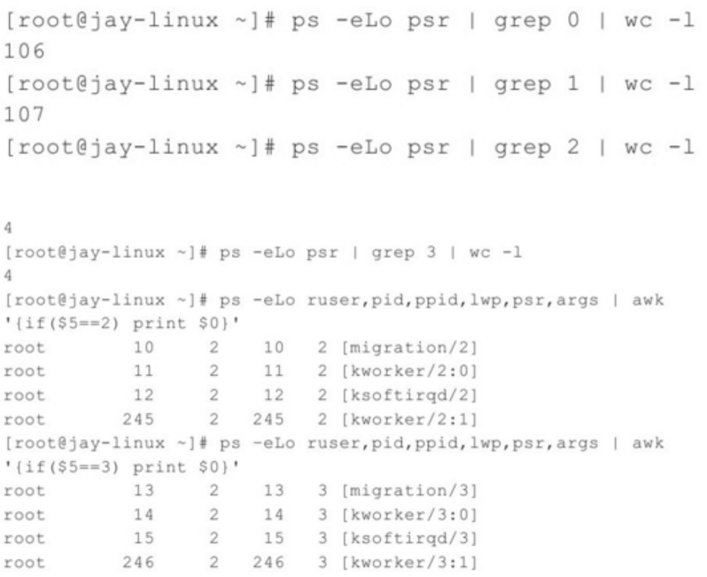
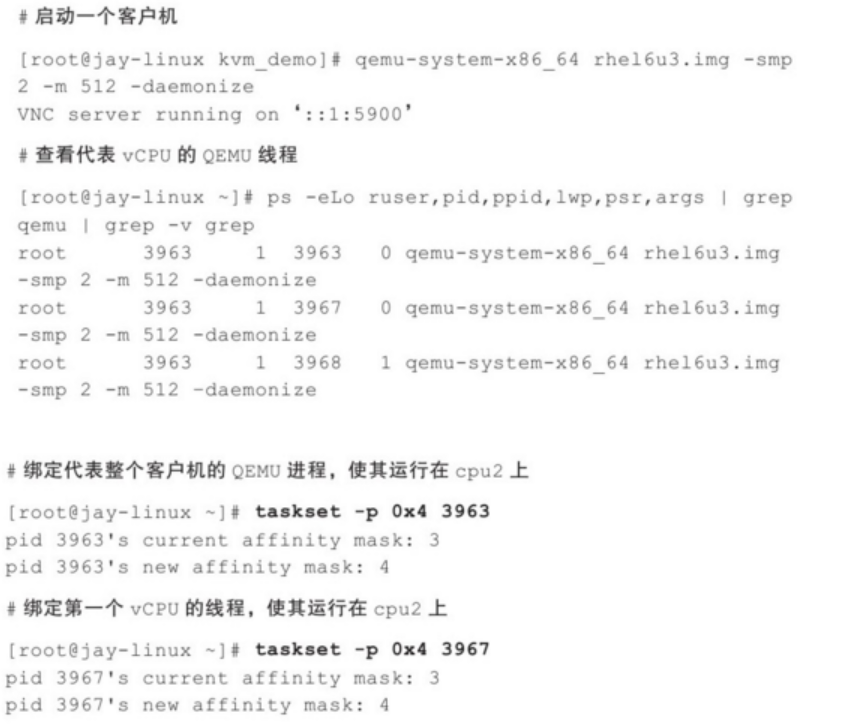

KVM采用的完全虚拟化（Full Virtualizaiton）技术,客户机（Guest）操作系统是未经过修改的普通操作系统。在硬件虚拟化技术的支持下，内核的KVM模块与QEMU的设备模拟协同工作，就构成了一整套与物理计算机系统完全一致的虚拟化的计算机软硬件系统。


一个完整的计算机系统，必不可少的子系统包括：处理器（CPU）、内存（Memory）、存储（Storage）、网络（Network）、显示（Display）等。本章将会介绍KVM环境中这些基本子系统的基本概念、原理、配置和实践。

1. 硬件平台和软件版本说明

本章以及第5章中，默认硬件平台（CPU）是Intel(R)Xeon(R)CPU E5-4600（Romley-EP 4S），软件系统中宿主机和客户机都是RHEL6.3系统，而宿主机内核是KVM内核3.5版本，用户态的QEMU是qemu-kvm 1.1.0版本，并且各个实验中在使用qemu-kvm时都开启了KVM加速的功能。

（1）硬件平台

一般使用支持硬件辅助虚拟化（如Intel的VT-x）的硬件平台即可。

（2）KVM内核

选取一个较新的又较稳定的正式发布版本。可以通过如下链接下载Linux 3.5版本：

http://www.kernel.org/pub/linux/kernel/v3.x/linux-3.5.tar.gz.

如果是在linux.git的源代码仓库中，可以查询到v3.5这个发布标签。如下：


如果使用的是kvm.git，由于没有Linux的v3.5版本标签，不能直接执行“git checkout v3.5"，因此需要在“git log”中查询到Linux发布3.5版本的信息，然后切换到对应的commit，如下：


切换到合适的源码版本就可以进行配置、编译、安装等操作。参考第三章内容。

（3）qemu-kvm

qemu-kvm使用2012年7月初发布的qemu-kvm-1.1.0版本，下载：

http://sourceforge.net/projects/kvm/files/qemu-kvm/1.1.0/qemu-kvm-1.1.0.tar.gz.

在qemu-kvm.git的GIT代码仓库中，可以先通过"git tag"命令查看有哪些标签，然后找到"qemu-kvm-1.1.0"标签，用"git checkout qemu-kvm-1.1.0"（或"git reset--hard qemu-kvm-1.1.0"）命令切换到1.1.0的qemu-kvm版本。

（4）QEMU命令行开启KVM加速功能

如果使用的是qemu-kvm命令行，默认开启了对KVM的支持的，可以通过在QEMU monitor中的"info kvm"命令来看是否显示"kvm support:enabled"。如果使用的不是qemu-kvm而是普通QEMU，可能KVM没有被打开，需要在QEMU启动命令行加上“-enable-kvm”参数。

2. CPU配置

在QEMU/KVM中，QEMU提供对CPU的模拟；在KVM打开的情况下，客户机中CPU指令的执行由已经处理器的虚拟化功能（如Intel VT-x和AMD AMD-V）来辅助执行，效率很高。

2.1 vCPU的概念

QEMU/KVM为客户机提供一套完整的硬件系统环境，在客户机看来所拥有的CPU即vCPU(virtual cpu)。在KVM环境中，每个客户机都是一个标准的Linux进程（QEMU进程），而每个vCPU在宿主机中是QEMU进程派生的一个普通线程。

普通Linux中，进程一般有两种执行模式：内核模式和用户模式。而在KVM环境中，增加了第三种模式：客户模式。vCPU在三种执行模式下的分工如下：

(1) 用户模式（User Mode）

主要处理I/O的模拟和管理，由QEMU的代码实现。

(2) 内核模式（Kernel Mode）

主要处理特别需要高性能和安全相关的指令，如处理客户模式到内核模式的转换，处理客户模式下的I/O指令或其他特权指令引起的退出（VM-Exit），处理影子内存管理（shadow MMU）。

(3) 客户模式（Guest Mode）

主要执行Guest中的大部分指令，I/O和一些特权指令除外（它们会引起VM-Exit，被hypervisor截获并模拟）。

vCPU在KVM中的三种执行模式下的转换如下图。


在KVM环境中，整个系统基本架构如下。


KVM的内核部分是作为可动态加载内核模块运行在宿主机中的，其中一个模块是和硬件平台无关的实现虚拟化核心基础架构的kvm模块，另一个是硬件平台相关的kvm_intel（或kvm_amd）模块。而KVM中的一个客户机是作为一个用户空间进程（qemu-kvm）运行的，它和其他普通的用户空间进程（如gnome、kde、firefox、chrome等）一样由内核来调度使其运行在物理CPU上，不过它由KVM模块的控制，可以在前面介绍的三种执行模式下运行。多个客户机就是宿主机中的多个QEMU进程，而一个客户机的多个vCPU就是一个QEMU进程中的多个线程。

2.2 SMP的支持

SMP(Symmetric Multi-Processor,对称多处理器)。在SMP系统中，多个程序（进程）可以做到真正并行执行，而单个进程的多个线程也能并行执行。

在硬件方面，早期更多的是在一个主板上拥有多个物理的CPU插槽来实现SMP系统，后来随着多核技术、超线程（Hyper-Threading）技术的出现，SMP系统就会使用多处理器、多核、超线程等技术中的一个或多个。

在操作系统软件方面，多数的现代操作系统都提供了对SMP系统的支持。

在Linux中，下面的脚本（cpu-info.sh）可以根据/proc/cpuinfo文件来检查当前系统中CPU数量、多核及超线程的使用情况。


QEMU在给客户机模拟CPU时，也可以提供对SMP（Symmetric Multi-processing，对称多处理）架构的模拟，让客户机运行在SMP系统中，充分利用物理硬件的SMP并行处理优势。每个vCPU在宿主机中都是一个线程，并且宿主机Linux系统是支持多任务处理的，因此可以通过两种操作来实现客户机的SMP，一是将不同的vCPU的进程交换执行（分时调度，即使物理硬件非SMP，也可以为客户机模拟出SMP系统环境），二是将在物理SMP硬件系统上同时执行多个vCPU的进程。

在qemu-kvm命令行中，"-smp"参数即是为了配置客户机的SMP系统，其具体参数如下：

```
-smp n[,maxcpus=XX][,cores=XX][,threads=XX][,sockets=XX]
```

其中：

- n用于设置客户机中使用的逻辑CPU数量（默认值是1）。
- maxcpus用于设置客户机中最大可能被使用的CPU数量，包括启动时处于下线（offline）状态的CPU数量（可用于热插拔hot-plug加入CPU，但不能超过maxcpus这个上限）。
- cores用于设置每个CPU socket上的core数量（默认值是1）。
- threads用于设置每个CPU core上的线程数（默认值是1）。
- sockets用于设置客户机中看到的总的CPU socket数量。

示例：

```
qemu-system-x86_64 -smp 8,sockets=2,cores=2,threads=2 /root/kvm_demo/rhel6u3.img
```

客户机中的CPU信息如下：


客户机中共有8个逻辑CPU（cpu0～cpu7），2个CPU socket，每个socket有2个核，每个核有2个线程（超线程处于打开状态）。

2.3 CPU过载使用

KVM允许客户机过载使用（over-commit）物理资源。

CPU的过载使用，是让一个或多个客户机使用vCPU的总数量超过实际拥有的物理CPU数量。QEMU会启动更多的线程来为客户机提供服务，这些线程也是被Linux内核调度运行在物理CPU硬件上。

关于CPU的过载使用，推荐的做法是对多个单CPU的客户机使用over-commit，比如，在拥有4个逻辑CPU的宿主机中，同时运行多于4个（如8个、16个）客户机，其中每个客户机都分配一个vCPU。这时，如果每个宿主机的负载不是很大，宿主机Linux对每个客户机的调度是非常有效的，这样的过载使用并不会带来客户机的性能损失。

最不推荐的做法是让某一个客户机的vCPU数量超过物理系统上存在的CPU数量。比如，在拥有4个逻辑CPU的宿主机中，同时运行一个或多个客户机，其中每个客户机的vCPU数量多于4个（如16个）。这样的使用方法会带来比较明显的性能下降，其性能反而不如为客户机分配2个（或4个）vCPU的情况，而且如果客户机中负载过重，可能会让整个系统运行不稳定。不过，在并非100%满负载的情况下，一个（或多个）有4个vCPU的客户机运行在拥有4个逻辑CPU的宿主机中并不会带来明显的性能损失。

2.4 CPU模型

每一种虚拟机管理程序（Virtual Machine Monitor，简称VMM或Hypervisor）都会定义自己的策略，让客户机看起来有一个默认的CPU类型。有的Hypervisor会简单地将宿主机中CPU的类型和特性直接传递给客户机使用，而QEMU/KVM在默认情况下会向客户机提供一个名为qemu64或qemu32的基本CPU模型。QEMU/KVM的这种策略会带来一些好处，如可以对CPU特性提供一些高级的过滤功能，还可以将物理平台根据提供的基本CPU模型进行分组（如几台IvyBridge和Sandybridge硬件平台分为一组，都提供相互兼容的SandyBridge或qemu64的CPU模型），从而让客户机在同一组硬件平台上的动态迁移更加平滑和安全。

如下命令行可以查看当前的QEMU支持的所有CPU模型

```
qemu-system-x86_64 -cpu ?
```

输出如下：


其中，加了方括号的"qemu64"、"kvm64"、"kvm32"等CPU模型死QEMU命令中原生自带（build-in）的，未加方括号的"SandyBridge"、"Westmere"、"Nehalem"等CPU模型是在配置文件中配置的。原生自带的CPU模型是在源代码qemu-kvm.git/target-i386/cpu.c中的结构体数组builtin_x86_defs[]中定义的，而用于自定义配置CPU模型的文件在源代码仓库中为qemu-kvm.git/sysconfigs/target/cpus-x86_64.conf（安装后的路径一般为/usr/local/share/qemu/cpus-x86_64.conf）。不过，在qemu-kvm-1.3.0版本中，QEMU开发者删除了cpus-x86_64.conf这个文件，而将所有CPU模型的定义都放在了target-i386/cpu.c文件中。

在x86-64平台上编译和运行的QEMU，在不加“-cpu”参数启动时，采用“qemu64”作为默认的CPU模型。可以用"-cpu cpu_model"来指定在客户机中的CPU模型。CPU的vendor_id、cpu family、flags、cpuid level等都是在cpus-x86_64.conf文件中配置好的。

2.5 进程的处理器亲和性和vCPU的绑定

通常在SMP系统中，Linux内核的进程调度器根据自有的调度策略将系统中的一个进程调度到某个CPU上执行。一个进程在前一个执行时间是在cpuM（M为系统中的某CPU的ID）上运行，而在后一个执行时间是在cpuN（N为系统中另一CPU的ID）上运行。因为Linux对进程执行的调度采用时间片法则（即用完自己的时间片立即暂停执行），而在默认情况下，一个普通进程或线程的处理器亲和性体现在所有可用的CPU上，进程或线程有可能在这些CPU之中的任何一个（包括超线程）上执行。

进程的处理器亲和性（Processor Affinity），即CPU的绑定设置，是指将进程绑定到特定的一个或多个CPU上去执行，而不允许将进程调度到其他的CPU上。Linux内核对进程的调度算法也是遵守进程的处理器亲和性设置的。设置进程的处理器亲和性带来的好处是可以减少进程在多个CPU之间交换运行带来的缓存命中失效（cache missing），从该进程运行的角度来看，可能带来一定程度上的性能提升。换个角度来看，对进程亲和性的设置也可能带来一定的问题，如破坏了原有SMP系统中各个CPU的负载均衡（load balance），这可能会导致整个系统的进程调度变得低效。特别是在多处理器、多核、多线程技术使用的情况下，在NUMA（Non-Uniform Memory Access）结构的系统中，如果不能基于对系统的CPU、内存等有深入的了解，对进程的处理器亲和性进行设置可能导致系统的整体性能的下降而非提升。

每个vCPU都是宿主机中的一个普通的QEMU线程，可以使用taskset工具对其设置处理器亲和性，使其绑定到某一个或几个固定的CPU上去调度。尽管Linux内核的进程调度算法已经非常高效了，在多数情况下不需要对进程的调度进行干预，不过，在虚拟化环境中有时有必要将客户机的QEMU进程或线程绑定到固定的逻辑CPU上。

提供一个有两个逻辑CPU计算能力的一个客户机。要求CPU资源独立被占用，不受宿主机中其他客户机的负载水平的影响。为了满足这个需求，可以分如下两个步骤来实现。

第一步，启动宿主机时隔离出两个逻辑CPU专门供一个客户机使用。在Linux内核启动的命令行加上"isolcpus="参数，可以实现CPU的隔离。例如，隔离了cpu2和cpu3的grub的配置文件如下：


在系统启动后，在宿主机中检查是否隔离成功，命令行如下：



由上面的命令行输出信息可知，cpu0和cpu1上分别有106和107个线程在运行，而cpu2和cpu3上分别只有4个线程在运行。而且，根据输出信息中cpu2和cpu3上运行的线程信息（也包括进程在内），分别有migration进程（用于进程在不同CPU间迁移）、两个kworker进程（用于处理workqueues）、ksoftirqd进程（用于调度CPU软中断的进程），这些进程都是内核对各个CPU的一些守护进程。没有其他的普通进程在cup2和cpu3上运行，说明对它们的隔离是生效的。

ps命令显示当前系统的进程信息的状态，它的"-e"参数用于显示所有的进程，"-L"参数用于将线程（LWP，light-weight process）也显示出来，"-o"参数表示以用户自定义的格式输出（其中"psr"这列表示当前分配给进程运行的处理器编号，"lwp"列表示线程的ID，"ruser"表示运行进程的用户，"pid"表示进程的ID，"ppid"表示父进程的ID，"args"表示运行的命令及其参数）。结合ps和awk工具的使用，是为了分别将在处理器cpu2和cpu3上运行的进程打印出来。

第二步，启动一个拥有两个vCPU的客户机并将其vCPU绑定到宿主机中两个CPU上。此操作过程的命令行如下：




对于taskset命令，此处用法是：taskset -p [mask] pid。其中，mask是一个代表了处理器亲和性的掩码数字，转化为二进制表示后，其值从最低位到最高位分别代表了第一个逻辑CPU到最后一个逻辑CPU，进程调度器可能将该进程调度到所有标志为“1”的位代表的逻辑CPU上去运行。根据上面的输出，在运行taskset命令之前，QEMU线程的处理器亲和性mask值是0x3（其二进制值为0011），可知其可能会被调度到cpu0和cpu1上运行；而在运行"taskset -p 0x4 3967"命令后，提示新的mask值被设为0x4（其二进制值为0100），所以该进程就只能被调度到cpu2上去运行，即通过taskset工具实现了将vCPU进程绑定到特定的CPU上。

在上面命令行中，根据ps命令可以看到QEMU的线程和进程的关系，但如何查看vCPU与QEMU线程之间的关系呢？可以切换（使用"Ctrl+Alt+2"快捷键）到QEMU monitor中进行查看，运行"info cpus"命令即可（还记得3.6节中运行过的"info kvm"命令吧），其输出结果如下：


客户机中的cpu0对应的线程ID为3967，cpu1对应的线程ID为3968。另外，"CPU#0"前面有一个星号（*），是标识cpu0是BSP（Boot Strap Processor，系统最初启动时在SMP生效前使用的CPU）。

3. 内存配置

作用是暂时存放CPU中将要执行的指令和数据，所有程序的运行都必须先载入到内存中才能够执行。本节主要介绍KVM中内存的配置。

3.1 内存设置基本参数

通过QEMU命令行启动客户机时设置内存大小的参数如下：

-m megs　#设置客户机的内存为megs MB大小

默认的单位为MB，也支持加上"M"或"G"作为后缀来显式指定使用MB或GB作为内存分配的单位。如果不设置-m参数，QEMU对客户机分配的内存大小默认值为128MB。

free命令用于查看内存的使用情况，"-m"参数是内存大小以MB为单位来显示，以上信息中显示总的内存为112MB，这个值与128MB有一定差距，其原因是free命令显示的总内存是除去了内核执行文件占用内存和一些系统保留的内存之后能使用的内存。而通过dmesg命令显示的内核打印的信息可以看出，内核检测到总的内存为131064 KB，几乎是完完整整的128MB内存了（128*1024=131072，与131064非常接近）。

通过/proc/meminfo看到的"MemTotal"的大小为1048568kB，比1024MB稍小，其原因与前面free命令输出的总内存是一样的。

3.2 EPT和VPID简介

EPT（Extended Page Tables，扩展页表），属于Intel的第二代硬件虚拟化技术，它是针对内存管理单元（MMU）的虚拟化扩展。EPT降低了内存虚拟化的难度（与影子页表相比），也提升了内存虚拟化的性能。是CPU硬件的一个特性。

和运行在真实物理硬件上的操作系统一样，在客户机操作系统看来，客户机可用的内存空间也是一个从零地址开始的连续的物理内存空间。为了达到这个目的，Hypervisor（即KVM）引入了一层新的地址空间，即客户机物理地址空间，这个地址空间不是真正的硬件上的地址空间，它们之间还有一层映射。所以，在虚拟化环境下，内存使用就需要两层的地址转换，即客户机应用程序可见的客户机虚拟地址（Guest Virtual Address,GVA）到客户机物理地址（Guest Physical Address，GPA）的转换，再从客户机物理地址（GPA）到宿主机物理地址（Host Physical Address，HPA）的转换。其中，前一个转换由客户机操作系统来完成，而后一个转换由Hypervisor来负责。

在硬件EPT特性加入之前，影子页表（Shadow Page Tables）是从软件上维护了从客户机虚拟地址（GVA）到宿主机物理地址（HPA）之间的映射，每一份客户机操作系统的页表也对应一份影子页表。有了影子页表，在普通的内存访问时都可实现从GVA到HPA的直接转换，从而避免了上面前面提到的两次地址转换。Hypervisor将影子页表载入到物理上的内存管理单元（Memory Management Unit，MMU）中进行地址翻译。下图展示了GVA、GPA、HPA之间的转换以及影子页表的作用。


尽管影子页表提供了在物理MMU硬件中能使用的页表，但缺点明显。首先影子页表实现非常复杂，导致其开发、调试和维护都比较困难。其次，影子页表的内存开销也比较大，因为需要为每个客户机进程对应的页表的都维护一个影子页表。

Intel的CPU提供了EPT技术（AMD提供的类似技术叫做NPT，即Nested Page Tables），直接在硬件上支持GVA--＞GPA--＞HPA的两次地址转换，从而降低内存虚拟化实现的复杂度，也进一步提升了内存虚拟化的性能。图4-4展示了Intel EPT技术的基本原理。


CR3（控制寄存器3）将客户机程序所见的客户机虚拟地址（GVA）转化为客户机物理地址（GPA），然后在通过EPT将客户机物理地址（GPA）转化为宿主机物理地址（HPA）。这两次转换地址转换都是由CPU硬件来自动完成的，其转换效率非常高。在使用EPT的情况下，客户机内部的Page Fault、INVLPG（使TLB项目失效）指令、CR3寄存器的访问等都不会引起VM-Exit，因此大大减少了VM-Exit的数量，从而提高了性能。另外，EPT只需要维护一张EPT页表，而不需要像“影子页表”那样为每个客户机进程的页表维护一张影子页表，从而也减少了内存的开销。VPID（VirtualProcessor Identifiers，虚拟处理器标识），是在硬件上对TLB资源管理的优化，通过在硬件上为每个TLB项增加一个标识，用于不同的虚拟处理器的地址空间，从而能够区分开Hypervisor和不同处理器的TLB。


