2. KVM设备直接分配（VT-D）

2.1 VT-d概述

在QEMU/KVM中，客户机能使用的设备，大致可分为如下三种类型:

1. Emulated device：QEMU纯软件模拟的设备。

2. Virtio device： 实现VIRTIO API的半虚拟化驱动的设备。

3. PCI device assignment： PCI设备直接分配。

第1、2两种类型都在5.1.1节“virtio概述”中已经进行了比较详细的介绍.

模拟I/O设备方式的优点是对硬件平台依赖性较低、可以方便模拟一些流行的和较老久的设备、不需要宿主机和客户机的额外支持，故兼容性高；而其缺点是I/O路径较长、VM-Exit次数很多，故性能较差。一般适用于对I/O性能要求不高的场景，或者模拟一些老旧遗留（legacy）设备（如RTL8139的网卡）。

Virtio半虚拟化设备方式的优点是实现了VIRTIO API，减少了VM-Exit次数，提高了客户机I/O执行效率，比普通模拟I/O的效率高很多；而其缺点是需要客户机中virtio相关驱动的支持（较老的系统默认没有自带这些驱动，Windows系统中需要额外安装virtio驱动），故兼容性较差，而且I/O频繁时的CPU使用率较高。

PCI设备直接分配（Device Assignment，或者PCI pass-through），它允许将宿主机中的物理PCI（或PCI-E）设备直接分配给客户机完全使用。较新的x86架构的主要硬件平台（包括服务器级、桌面级）都已经支持设备直接分配，其中Intel定义的I/O虚拟化技术规范为“Intel(R) Virtualization Technology for Directed I/O”（VT-d），而AMD的为“AMD-V”（也叫做IOMMU）。本节以KVM中使用Intel VT-d技术为例来进行介绍（当然AMD IOMMU也是类似的）。

KVM虚拟机支持将宿主机中的PCI、PCI-E设备附加到虚拟化的客户机中，从而让客户机以独占方式访问这个PCI（或PCI-E）设备。通过硬件支持的VT-d技术将设备分配给客户机后，在客户机看来，设备是物理上连接在其PCI（或PCI-E）总线上的，客户机对该设备的I/O交互操作和实际的物理设备操作完全一样，这不需要（或者很少需要）Hypervisor（即KVM）的参与。

KVM中通过VT-d技术使用一个PCI-E网卡的系统架构示例如图。


为了设备分配的安全性，QEMU/KVM还需要中断重映射（interrupt remapping）的支持，尽管QEMU命令行进行设备分配时并不直接检查中断重映射功能是否开启，但是在通过一些工具使用KVM时（如RHEL6.3中的libvirt）默认需要有中断重映射的功能支持，才能使用VT-d分配设备给客户机使用。

设备直接分配让客户机完全占有PCI设备，在执行I/O操作时大量地减少了（甚至避免）了VM-Exit陷入到Hypervisor中，极大地提高了I/O性能，可以达到和Native系统中几乎一样的性能。

尽管Virtio的性能也不错，但VT-d克服了其兼容性不够好和CPU使用率较高的问题。不过，VT-d也有自己的缺点，允许添加的PCI和PCI-E设备是有限的；增加了硬件投资成本。

为了避免这两个缺点，可以考虑采用如下两个方案。一是，在一个物理宿主机上，仅给少数的对I/O（如网络）性能要求较高的客户机使用VT-d直接分配设备（如网卡），而其余的客户机使用纯模拟（emulated）或使用Virtio以达到多个客户机共享同一个设备的目的。二是，对于网络I/O的解决方法，可以选择SR-IOV让一个网卡产生多个独立的虚拟网卡，将每个虚拟网卡分别分配给一个客户机使用，这也正是后面“SR-IOV技术”这一小节要介绍的内容。另外，它还有一个缺点是，对于使用VT-d直接分配了设备的客户机，其动态迁移功能将会受限，不过也可以在用bonding驱动等方式来缓解这个问题，将在“动态迁移”小节较为详细介绍此方法。

2.2 VT-d环境配置 

在KVM中使用VT-d技术进行设备直接分配，需要以下几方面环境配置。

**1. 硬件支持和BIOS设备**

硬件平台和在BIOS中开启VT-d。3.2已经说明过BIOS中的VT-d。

**2. 宿主机内核的配置**

Linux内核应配置如下几个VT-d相关的配置选项。

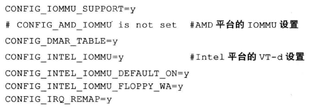

另外，为了配置下一步设置（用于隐藏设备），还需要配置pci-stub这个内核模块，相关的内核配置选项如下。在RHEL 6.3的默认内核中，都将PCI_STUB配置为y（直接编译进内核），不作为模块来加载。

```
CONFIG_PCI_STUB=m  # 如果配置为y（编译进内核），则不需要作为模块来加载
```

在宿主机系统中，可以通过内核的打印信息来检查VT-d是否处于打开可用状态，如下：

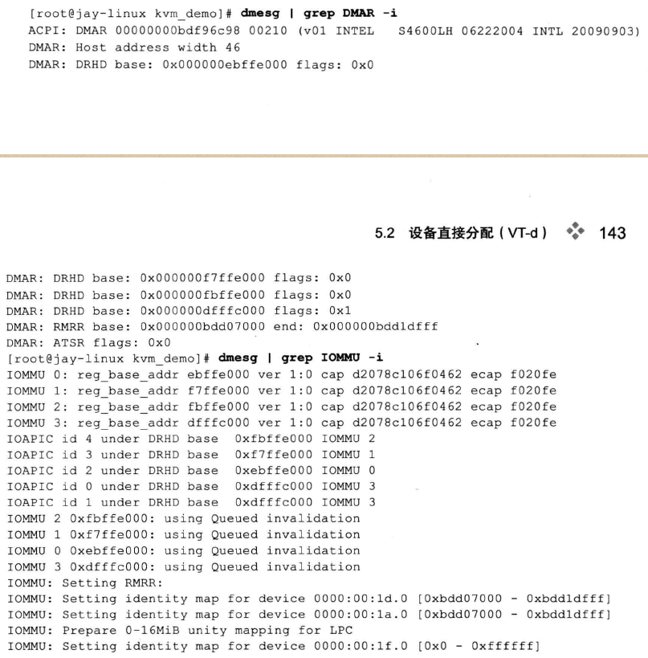

如果内核的IOMMU默认没有打开，也可在grub的kernel行中加入“intel_iommu=on”这个内核启动选项。

**3. 在宿主机中隐藏设备**

使用pci_stub这个内核模块来对需要分配给客户机的设备进行隐藏，从而让宿主机和未分配该设备的客户机都无法使用该设备，达到隔离和安全使用的目的，需要下面三步来隐藏一个设备。

1） 加载pci_stub驱动（上面配置 “CONFIG_PCI_STUB=m” 作为内核编译的配置选项），如下：


如果pci_stub已经被编译到内核而不是作为module，则仅需要最后一个命令来检查/sys/bus/pci/drivers/pci-stub/目录即可。

2） 查看设备的vendor ID和device ID，如下（假设此设备的BDF为08:00.0）


-D表示在输出信息中显示设备的domain，-n表示数字方式显示设备的vendor ID和device ID，-s选项表示仅显示后面指定的一个设备的信息。输出信息中，“0000:08:00.0”表示设备在PCI/PCI-E总线中的具体位置，依次是设备的domain（0000）、bus（08）、slot（00）、function（0），其中domain一般是0（当机器有多个host bridge时，取值范围是0~0xffff），bus取值范围是0~0xff，slot取值范围是0~0x1f，function取值范围是0~0x7，其中后面三个值用BDF（即bus:device:function）简称。输出信息中，设备的vendor ID是“8086”（“8086” ID代表Intel Corporation），device ID是“10b9”（代表82572网卡）。

3） 绑定设备到pci_stub驱动，命令行操作如下：


绑定前，用lspci命令查看BDF为08:00.0的设备使用的驱动是Intel的e1000e驱动，而绑定到pci_stub后，通过如下命令可以查看到目前使用的驱动是pci_stub而不是e1000e了，其中，lspci的-k选项表明输出信息中显示正在使用的驱动和内核中可以支持该设备的模块。


而在客户机不需要使用该设备后，让宿主机使用该设备，则需将其恢复到使用原本的驱动。

shell脚本可以实现上面的功能，见原书。

**4. 通过QEMU命令行分配设备给客户机**

-device driver[.prop=[value][,...]]

dirver是设备使用的驱动，有很多种类，如pci-assign表示PCI设备直接分配、virtio-balloon-pci（又virtio-balloon）表示ballooning设备（与4章里面的“-balloon virtio”相同）。prop是设置驱动的各个属性值。

“-device ?”可查看所有可用驱动，“-device driver,?”可查看某个驱动的各个属性值。如下：

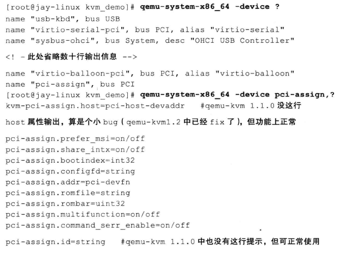

在-device pci-assign的属性中，host指定分配的PCI设备在宿主机中的地址（BDF号），addr属性表示设备在客户机中的PCI的slot编号（即BDF中的D-device值），id属性表示该设备的唯一标识（可在QEMU monitor中用“info pci”命令查看）。

qemu-kvm命令行工具在启动时分配一个设备给客户机，如下：


多分配几个设备，重复多次“-device pci-assign,host=$BDF”即可。设备直接分配时客户机独占该设备，因此一旦将设备分配给客户机使用，就不能再将其分配给另外的客户机使用。

QEMU/KVM还支持设备的热插拔（hot-plug）。

2.3 VT-d操作示例

**1. 网卡直接分配**

1） 选择网卡


2） 隐藏该网卡（使用前面的脚本）


3） 启动客户机时分配网卡


命令行中的“-net none”表示不适用其他网卡设备，否则在客户机中会出现一个直接分配的网卡和另外一个emulated的网卡。

在QEMU中，可以通过“info pci”命令查看分配给客户机的PCI设备的情况。


4） 在客户机中查看网卡的工作情况

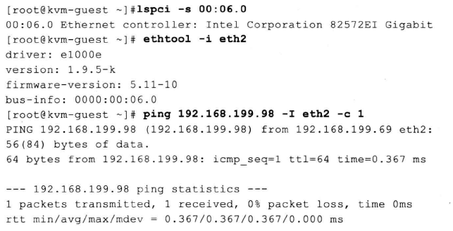

可以看到，客户机中网卡是使用e1000e驱动的Intel 82572（和在宿主机隐藏它之前一样），eth2就是改网卡的网络接口，通过ping查看网络畅通。

5） 关闭客户机后，在宿主机恢复被隐藏的网卡

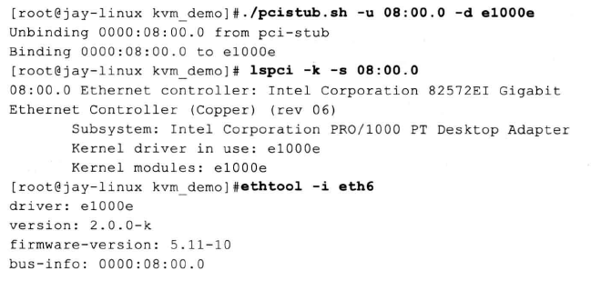

**硬盘直接分配**

一般SATA或SAS等类型硬盘的控制器（Controller）都是接入到PCI（或PCIe）总线上，所以也可将硬盘作为普通PCI设备直接分配给客户机使用。不过当SATA或SAS设备作为PCI设备直接分配时，实际上将其控制器作为一个整体分配到客户机中，如果宿主机使用的硬盘也连接到同一个SATA或SAS控制器上，则不能将该控制器直接分配给客户机，而是需要硬件平台中至少有两个或以上的SATA或SAS控制器。下面以SATA为例介绍对硬盘的直接分配过程。

1） 先在宿主机查看硬盘设备，然后隐藏。

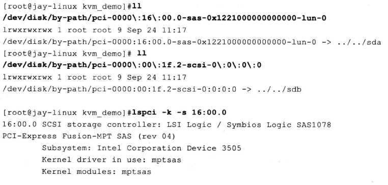

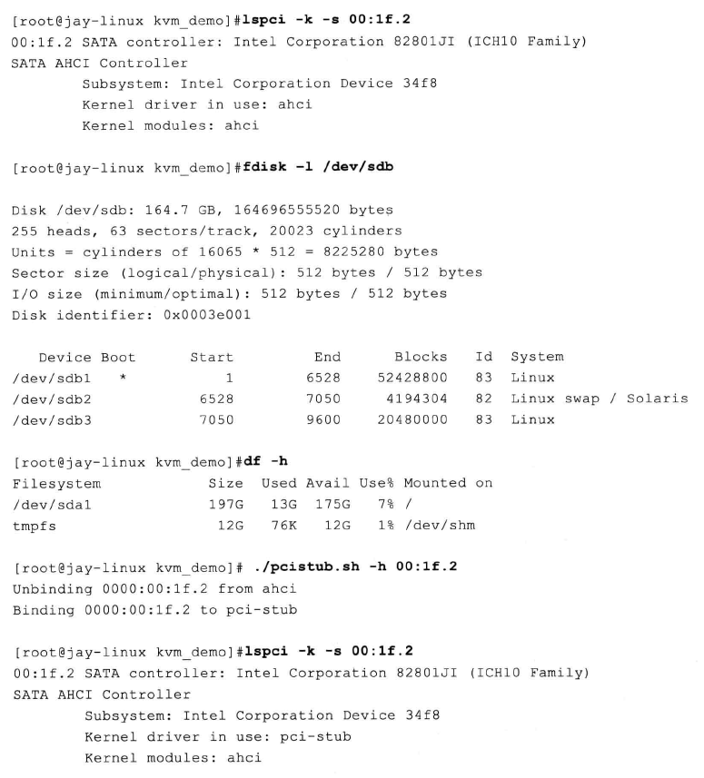

在宿主机中有两块硬盘sda和sdb，分别对应一个SAS Controller（16:00.0）和一个SATA COntroller（00:1f.2），其中sdb大小为160GB，而宿主机系统安装在sda的第一个分区（sda1）上。在隐藏之前，使用的驱动是ahci驱动，之后，将其绑定到pci-stub驱动，为设备直接分配做准备。

2） 将SATA硬盘分配（实际是分配SATA Controller）给客户机使用。


3） 客户机启动后，在客户机查看分配到的SATA硬盘，如下。

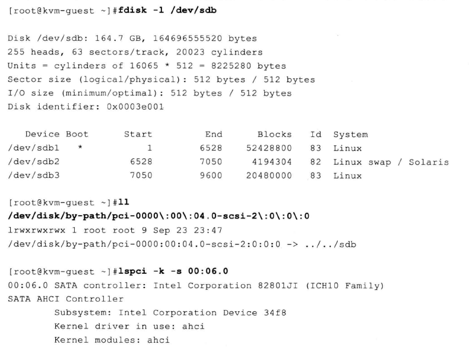

sdb硬盘（BDF是00:06.0）就是设备直接分配的那个160GB的SATA硬盘。

**3. USB直接分配**

USB主机控制器（USB Host Controller）也是接入到PCI总线中去的，所以也可以对USB设备做设备直接分配。同样，指的是对整个USB Host Controller的直接分配，而并不一定仅分配一个USB设备。常见USB设备，如U盘、键盘、鼠标等都可以。以U盘为例介绍。

1） 宿主机查看U盘设备，并隐藏

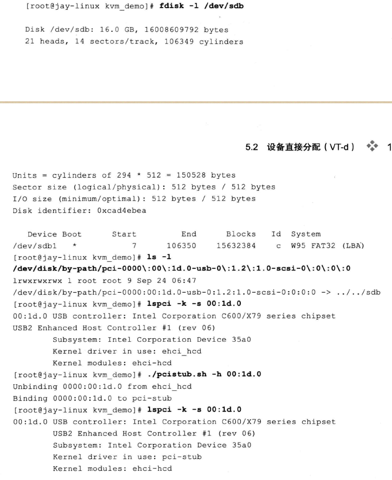

2） 将U盘分配给客户机使用


3） 客户机查看U盘情况

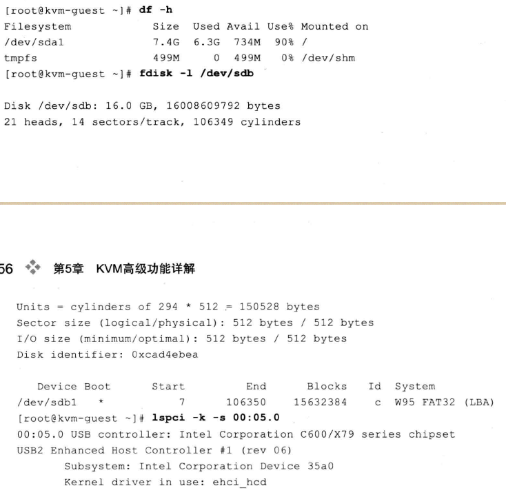

对于USB2.0设备，也有其他命令行参数（-usbdevice）支持USB设备的分配。不同于对USB Host Controller的直接分配，-usbdevice参数用于分配单个USB设备。在宿主机不要隐藏USB Host Controller，用“lsusb”命令查看需要分配的USB设备信息，然后在启动命令使用“-usbdevice host:xx”，如下。


**4. VGA显卡直接分配**

显卡也是作为一个PCI或PCIe设备接入到系统总线之中。在KVM虚拟化环境中，如果有在客户机中看高清视频或玩高清游戏需求，可以完全分配显卡给某个客户机。目前，除了独立显卡，Intel等在较新的CPU中集成了GPU模块（具有3D显示功能）。显卡也分多种接口类型，如VGA（Video Graphics Array）、DVI（Digital Virtual Interface）、HDMI（High-Definition Multimedia Interface）等多种标准接口。下面以VGA显卡为例，中间也将USB鼠标和键盘一起分配给客户机了。

1） 查看USB键盘和鼠标的PCI的BDF，查看VGA显卡的BDF，如下


USB鼠标和键盘USB控制器的PCI设备BDF为00:1a.0（这里用了一个USB转接器，上面接了一个键盘和一个鼠标，所以只看到一个USB设备），宿主机VGA显卡是Matrox公司的G200e型号显卡，其中BDF为09:00.0。

2） 分别隐藏


3） 启动客户机，将USB鼠标键盘和VGA显卡都分配


4） 客户机中查看

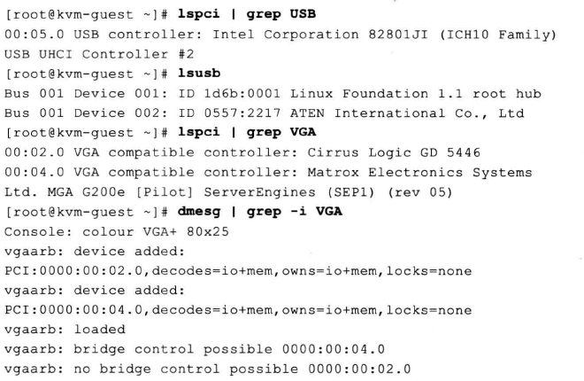

客户机中这个USB设备与宿主机中是一样的，客户机有两个VGA显卡，其中BDF 00:02.0是4.6节提到的QEMU纯软件模拟的Cirrus显卡，而另外的BDF 00:04.0 就是设备直接分配的GMA G200e显卡，它的信息和在宿主机中看到的是一样的。从dmesg可以看到系统启动后，00:04.0显卡才是最后真正使用的显卡，而00:02.0是不可用的（处于“no bridge control possible”状态）。另外，本例在客户机中也启动了图形界面，对使用的显卡进行检查还可以在客户机中查看Xorg的日志文件：/var/log/Xorg.0.log，其中部分内容如下：


由上面日志可知，X 窗口程序检测到两个VGA显卡，最后使用的是BDF为 00:04.0 的显卡，使用了VESA程序来驱动该显卡。在客户机内核的配置中，对VESA的配置已经变异到内核中去了。因此可以直接使用。

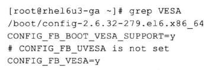

2.4 SR-IOV技术

**1. SR-IOV概述**

VT-d技术，一个物理设备只能分配给一个客户机使用。为实现多个虚拟机可以共享同一个物理设备的资源，并且达到设备直接分配的性能，PCI-SIG组织发布了SR-IOV（Single Root I/O Virtualization and Sharing，单根I/O虚拟化）规范，该规范定义了一个标准化的机制用以原生地支持实现多个共享的设备（不一定是网卡）。目前应用最广的是以太网卡设备的虚拟化方面。

SR-IOV中引入的两个新的功能（function）类型。

1） Physical Function（PF，物理功能）：拥有包含SR-IOV扩展功能在内的所有完整的PCI-e功能，其中SR-IOV能力使PF可以配置和管理SR-IOV功能。简言之，PF就是一个普通的PCI-e设备（带有SR-IOV功能），可以放在宿主机中配置和管理其他VF，它本身也可以作为一个完整独立的功能使用。

2） Virtual Function（VF，虚拟功能）：由PF衍生而来的“轻量级”的PCI-e功能，包含数据传送必须的资源，但是仅谨慎地拥有最小化的配置资源。简言之，VF通过PF的配置之后，可以分配到客户集中作为独立功能使用。

SR-IOV为客户机中使用的VF提供了独立的内存空间、中断、DMA流，从而不需要Hypervisor介入数据的传送过程。SR-IOV架构设计的目的是允许一个设备支持多个VF，同时尽量减少每个VF的硬件成本。下图显示了Intel以太网卡中的SR-IOV的总体结构。

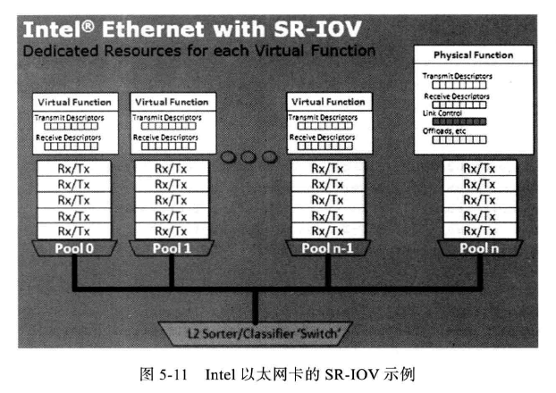

一个有SR-IOV功能的设备能被配置为在PCI配置空间（configuration space）中呈现出多个Function（包含一个PF和多个VF），每个VF都有自己独立的配置空间和完整的BAR（Base Address Register，基址寄存器）。Hypervisor通过将VF实际的配置空间映射到客户机看到的配置空间的方式实现将一个或多个VF分配给一个客户机。通过Intel VT-x和VT-d等硬件辅助虚拟化技术提供的内存转换技术，允许直接的DMA传输去往或来自一个客户机，从而绕过了Hypervisor中的软件交换机（software switch）。每个VF同一时刻只能被分配给一个客户机，因为VF需要真正的硬件资源（不同于emulated类型的设备）。在客户机中的VF，表现给客户机是一个完整的普通设备。

在KVM中，可以将一个或多个VF分配给一个客户机，客户机通过自身的VF驱动程序直接操作设备的VF而不需要Hypervisor，总体架构如下。

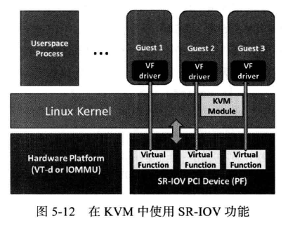

