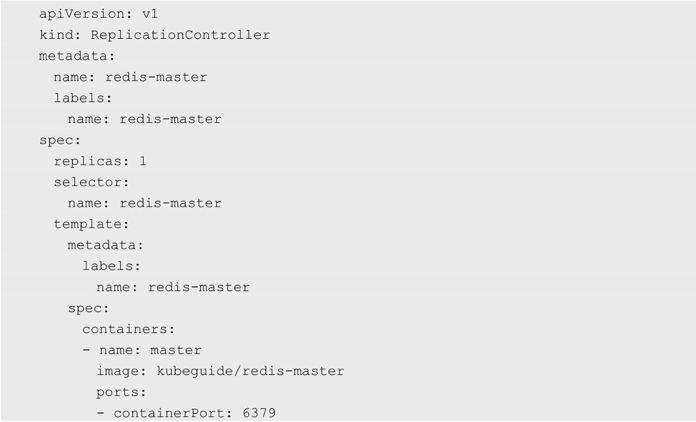
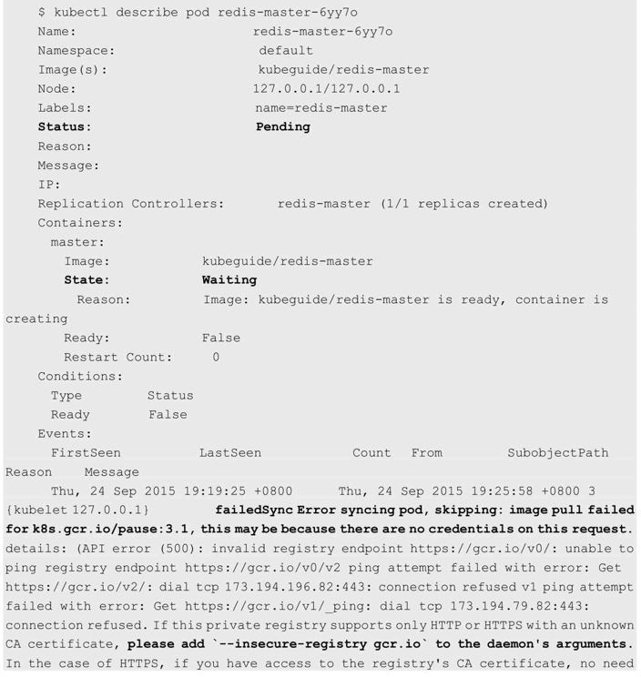
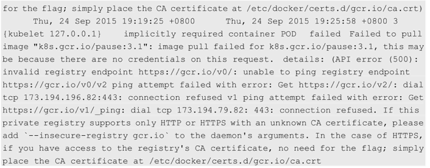

<!-- @import "[TOC]" {cmd="toc" depthFrom=1 depthTo=6 orderedList=false} -->

<!-- code_chunk_output -->

- [由于无法下载pause镜像导致Pod一直处于Pending状态](#由于无法下载pause镜像导致pod一直处于pending状态)

<!-- /code_chunk_output -->

# 由于无法下载pause镜像导致Pod一直处于Pending状态

以redis\-master为例，使用如下配置文件redis-master-controller.yaml创建RC和Pod：

执行`kubectl create -f redis-master-controller.yaml`成功，但在查看Pod时，发现其总是**无法处于Running状态**。

通过`kubectl get pods`命令可以看到：

进一步使用`kubectl describe pod redis-master-6yy7o`命令查看该Pod的详细信息：

可以看到，该**Pod为Pending状态**。从Message部分显示的信息可以看出，其原因是image pull failed for k8s.gcr.io/pause:3.1，说明系统在创建Pod时**无法从gcr.io下载pause镜像**，所以导致创建Pod失败。

解决方法如下。

（1）如果服务器可以访问Internet，并且不希望使用HTTPS的安全机制来访问gcr.io，则可以在Docker Daemon的启动参数中加上--insecure-registry gcr.io，来表示可以匿名下载。
（2）如果Kubernetes集群在内网环境中无法访问gcr.io网站，则可以先通过一台能够访问gcr.io的机器下载pause镜像，将pause镜像导出后，再导入内网的Docker私有镜像库，并在kubelet的启动参数中加上--pod_infra_container_image，配置为：
