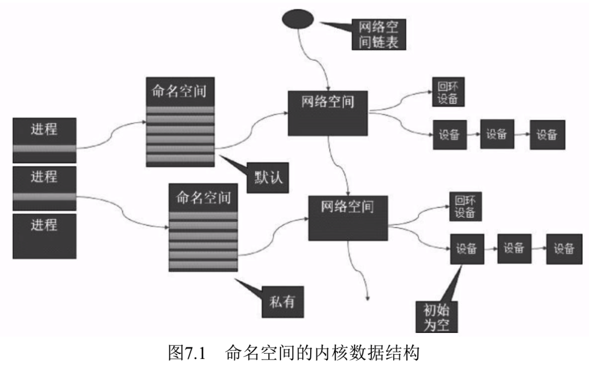
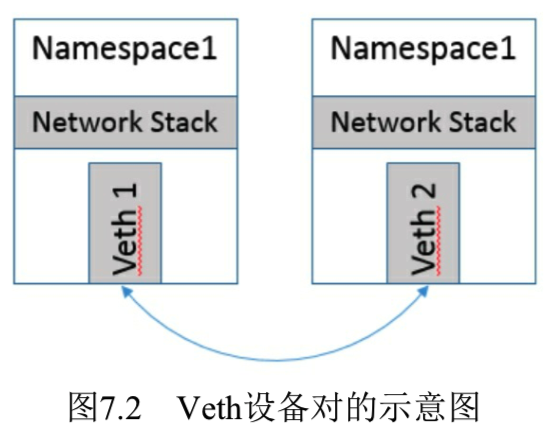
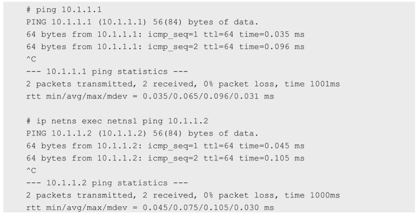

<!-- @import "[TOC]" {cmd="toc" depthFrom=1 depthTo=6 orderedList=false} -->

<!-- code_chunk_output -->

- [1. 网络命令空间](#1-网络命令空间)
  - [1.1. 网络命名空间的实现](#11-网络命名空间的实现)
  - [1.2. 网络命名空间的操作](#12-网络命名空间的操作)
  - [1.3. 网络命名空间的使用技巧](#13-网络命名空间的使用技巧)
- [2. Veth设备对](#2-veth设备对)
  - [2.1. Veth设备对的操作命令](#21-veth设备对的操作命令)
  - [2.2. Veth设备对如何查看对端](#22-veth设备对如何查看对端)
- [3. 网桥](#3-网桥)
  - [3.1. Linux网桥的实现](#31-linux网桥的实现)

<!-- /code_chunk_output -->

Docker本身的技术依赖于近年来**Linux内核虚拟化技术**的发展，所以Docker对**Linux内核的特性**有很强的依赖。

这里将Docker使用到的与Linux网络有关的主要技术进行简要介绍，这些技术有：**网络命名空间（Network Namespace**）、**Veth设备对**、**网桥**、**ipatables**和**路由**。

# 1. 网络命令空间

为了支持**网络协议栈的多个实例**，Linux在网络栈中引入了**网络命名空间**，这些**独立的协议栈！！！** 被隔离到**不同的命名空间！！！** 中。处于**不同命名空间中的网络栈**是**完全隔离**的，**彼此之间无法通信**，就好像两个“平行宇宙”。通过**对网络资源的隔离**，就能在**一个宿主机**上**虚拟多个不同的网络环境**。Docker正是利用了网络的命名空间特性，实现了**不同容器之间**的**网络隔离**。

在Linux的**网络命名空间**中可以有自己**独立的路由表**及**独立的iptables设置**来提供**包转发**、**NAT**及**IP包过滤**等功能。

为了隔离出**独立的协议栈**，需要**纳入命名空间**的元素有**进程**、**套接字**、**网络设备**等。**进程创建的套接字**必须属于**某个命名空间**，**套接字的操作**也必须在**命名空间**中进行。同样，**网络设备**也必须属于**某个命名空间**。因为**网络设备**属于**公共资源**，所以可以通过修改属性实现**在命名空间之间移动**。当然，是否允许移动与设备的特征有关。

让我们稍微深入Linux操作系统内部，看它是如何实现网络命名空间的，这也会对理解后面的概念有帮助。

## 1.1. 网络命名空间的实现

Linux的网络协议栈是十分复杂的，为了支持**独立的协议栈**，相关的这些**全局变量**都必须被**修改**为**协议栈私有**。最好的办法就是让**这些全局变量**成为一个**Net Namespace变量**的**成员**，然后为**协议栈的函数调用**加入一个**Namespace参数**。这就是Linux**实现网络命名空间的核心**。

同时，为了保证对**已经开发的应用程序**及**内核代码的兼容性**，内核代码**隐式**地使用了**命名空间中的变量**。程序如果**没有对命名空间有特殊需求**，就不需要编写额外的代码，网络命名空间对应用程序而言是透明的。

在**建立了新的网络命名空间**，并将**某个进程关联到这个网络命名空间！！！**后，就出现了类似于如图7.1所示的内核数据结构，**所有网络栈变量**都被放入了**网络命名空间的数据结构**中。

这个**网络命名空间！！！** 是其**进程组私有的！！！**，和其他进程组不冲突。



在**新生成的私有命名空间**中**只有回环设备**（名为“**lo”且是停止状态**），其他设备默认都不存在，如果我们需要，则要一一手工建立。**Docker容器**中的**各类网络栈设备**都是Docker Daemon在启动时**自动创建和配置**的。

**所有的网络设备**（**物理的**或**虚拟接口**、**桥**等在**内核**里都叫作**Net Device**）都**只能属于一个命名空间**。当然，**物理设备**（连接实际硬件的设备）**通常只能关联到root这个命名空间**中。虚拟的网络设备（虚拟的以太网接口或者虚拟网口对）则可以被创建并关联到一个给定的命名空间中，而且可以**在这些命名空间之间移动**。

前面提到，由于**网络命名空间**代表的是一个**独立的协议栈**，所以它们**之间是相互隔离的**，彼此**无法通信**，在协议栈内部都看不到对方。那么有没有办法打破这种限制，让处于**不同命名空间！！！的网络相互通信**，甚至**和外部的网络进行通信**呢？答案就是“有，**应用Veth设备对**即可”。

**Veth设备对**的一个重要作用就是**打通互相看不到的协议栈之间的壁垒**，它就像一条管子，一端连着**这个网络命名空间的协议栈**，一端连着**另一个网络命名空间的协议栈**。所以如果想在**两个命名空间之间通信**，就必须有一个**Veth设备对**。

后面会介绍如何操作Veth设备对来打通不同命名空间之间的网络。

## 1.2. 网络命名空间的操作

下面列举网络命名空间的一些操作。

我们可以使用**Linux iproute2**系列配置工具中的IP命令来操作网络命名空间。

注意，这个命令需要由root用户运行。

创建一个命令空间:

```
ip netns add <name>
```

在命名空间中执行命令：

```
ip netns exec <name> <command>
```

也可以先通过bash命令进入内部的shell界面，然后执行各种命令：

```
ip netns exec <name> bash
```

退出到外面的命名空间时，请输入“exit”。

## 1.3. 网络命名空间的使用技巧

我们可以在**不同的网络命名空间之间转移设备！！！**，例如下面会提到的**Veth设备对的转移**。因为**一个设备只能属于一个命名空间**，所以转移后在这个命名空间中就看不到这个设备了。

具体**哪些设备能被转移到不同的命名空间**呢？

在**设备**里面有一个重要的**属性**：`NETIF_F_ETNS_LOCAL`，如果这个**属性为on**，就**不能被转移到其他命名空间**中。

**Veth设备**属于**可以转移的设备**，而很多其他设备如**lo设备**、**vxlan设备**、**ppp设备**、**bridge设备**等都是**不可以转移的**。

将无法转移的设备移动到别的命名空间时，会得到无效参数的错误提示。

```
# ip link set br0 netns ns1
RTNETLINK answers: Invalid argument
```

如何知道这些设备是否可以转移呢？可以使用ethtool工具查看：

```
# ethtool -k br0
```

netns\-local的值是on，说明不可以转移，否则可以转移。

# 2. Veth设备对

引入**Veth设备对**是为了在**不同的网络命名空间之间通信**，利用它可以直接**将两个网络命名空间连接起来**。

由于要**连接两个网络命名空间**，所以**Veth设备都是成对出现**的，很像**一对以太网卡**，并且中间有一根直连的网线。既然是一对网卡，那么我们将**其中一端称为另一端的peer**。在Veth设备的一端发送数据时，它会将数据直接发送到另一端，并**触发另一端的接收操作**。

**整个Veth的实现**非常简单，有兴趣的读者可以参考源代码“**drivers/net/veth.c**”的实现。如图7.2所示是Veth设备对的示意图。



## 2.1. Veth设备对的操作命令

接下来看看如何创建Veth设备对，如何连接到不同的命名空间，并设置它们的地址，让它们通信。

创建Veth设备对:

```
ip link add veth0 type veth peer name veth1
```

创建后，可以查看Veth设备对的信息。

使用`ip link show`命令**查看所有网络接口**：


有两个设备生成了，一个是veth0，它的peer是veth1。

现在这**两个设备**都在**自己的命名空间**中，那怎么能行呢？好了，如果将Veth看作有两个头的网线，那么我们将另一个头甩给另一个命名空间：

只剩一个veth0设备了，已经看不到另一个设备了，另一个设备已经被转移到另一个网络命名空间中了。

在netns1网络命名空间中可以看到veth1设备了，符合预期：

```
ip link set veth1 netns netns1
```

(`ip netns exec netns1 ip link show`)


现在看到的结果是，**两个不同的命名空间**各自有一个**Veth的“网线头**”，**各显示为一个Device**（在Docker的实现里面，它除了**将Veth放入容器内**，还将它的**名字改成了eth0**，简直以假乱真，你以为它是一个本地网卡吗）。

现在可以通信了吗？不行，因为它们还没有任何地址，我们现在给它们分配IP地址：

```
# ip netns exec netns1 ip addr add 10.1.1.1/24 dev veth1
# ip addr add 10.1.1.1/24 dev veth1
```

再启动它们: 

```
# ip netns exec netns1 ip link set dev veth1 up
# ip link set dev veth0 up
```

现在两个网络命名空间可以互相通信了：



至此，我们就能够理解Veth设备对的原理和用法了。

在Docker内部，Veth设备对也是连通容器与宿主机的主要网络设备，离开它是不行的。

## 2.2. Veth设备对如何查看对端

我们在操作Veth设备对时有一些实用技巧，如下所示。

一旦将**Veth设备对**的**对端**放入**另一个命名空间**，在**本命名空间中就看不到它**了。那么我们**怎么知道这个Veth设备的对端在哪里**呢，也就是说它到底连接到哪个命名空间呢？可以使用**ethtool工具**来查看（当网络命名空间特别多时，这可不是一件很容易的事情）。

首先，在**命名空间netns1**中查询**Veth设备对端接口**在**设备列表**中的**序列号**：

```
# ip netns exec netns1 ethtool -S veth1
NIC statistics:
    peer_ifindex: 5
```

得知**另一端的接口设备的序列号是5**，我们再到**命名空间netns2**中查看序列号5代表什么设备：

```
# ip netns exec netns2 ip link | grep 5
veth0
```

现在就找到序列号为5的设备了，它是veth0，它的另一端自然就是命名空间netns1中的veth1了，因为它们互为peer。

# 3. 网桥

Linux可以支持**多个不同的网络**，它们之间能够相互通信，如何将**这些网络连接起来**并**实现各网络中主机的相互通信**呢？可以用**网桥**。

网桥是一个**二层的虚拟网络设备(在数据链路层实现**)，把**若干个网络接口！！！“连接”起来**，以使得**网络接口之间**的**报文**能够**互相转发**。**网桥**能够**解析收发的报文**，**读取目标MAC地址的信息**，和**自己记录的MAC表**结合，来决策**报文的转发目标网络接口**。

为了实现这些功能，网桥会学习**源MAC地址**（**二层网桥转发的依据就是MAC地址！！！**）。

在**转发报文**时，**网桥**只需要向**特定的网口**进行**转发**，来避免不必要的网络交互。如果它遇到一个自己**从未学习到的地址**，就**无法**知道这个报文应该**向哪个网络接口转发**，就将报文**广播给所有的网络接口**（报文来源的网络接口除外）。

在实际的网络中，网络拓扑不可能永久不变。设备如果被移动到另一个端口上，却没有发送任何数据，**网桥设备**就**无法感知到这个变化**，网桥还是向**原来的端口转发数据包**，在这种情况下**数据就会丢失**。所以网桥还要对学习到的**MAC地址表加上超时时间（默认为5min**）。如果网桥收到了对应端口MAC地址回发的包，则重置超时时间，否则过了超时时间后，就认为设备已经不在那个端口上了，它就会**重新广播发送**。

在Linux的**内部网络栈**里实现的**网桥设备**，作用和上面的描述相同。过去Linux主机一般都只有一个网卡，现在多网卡的机器越来越多，而且有很多虚拟的设备存在，所以Linux的网桥提供了在这些设备之间互相转发数据的二层设备。

**Linux内核**支持**网口的桥接**（目前**只支持以太网接口！！！**）。但是**与单纯的交换机不同**，交换机只是一个**二层设备**，对于接收到的**报文**，要么**转发**，要么**丢弃**。运行着Linux内核的机器本身就是一台主机，有可能是**网络报文的目的地**，其收到的报文除了转发和丢弃，还可能被送到**网络协议栈的上层（网络层**），从而被自己（这台主机本身的协议栈）消化，所以我们既可以把**网桥**看作一个**二层设备**，也可以把它看作一个**三层设备**。

## 3.1. Linux网桥的实现

**Linux内核**是通过一个**虚拟的网桥设备（Net Device**）来**实现桥接**的。

**这个虚拟设备**可以**绑定若干个以太网接口设备**，从而将它们**桥接起来**。如图7.3所示，这种**Net Device网桥**和普通的设备不同，最明显的一个特性是它**还可以有一个IP地址**。


如图7.3所示，**网桥设备br0**绑定了**eth0**和**eth1**。对于**网络协议栈的上层**来说，**只看得到br0**就行。因为**桥接**是在**数据链路层**实现的，**上层不需要关心桥接的细节**，所以**协议栈上层**需要发送的**报文被送到br0**，**网桥设备的处理代码**判断报文该被转发到**eth0还是eth1**，或者两者皆转发；反过来，从eth0或从eth1接收到的报文被提交给网桥的处理代码，在这里会判断报文应该被转发、丢弃还是被提交到协议栈上层。

而有时eth0、eth1也可能会作为报文的源地址或目的地址，直接参与报文的发送与接收，从而绕过网桥。
