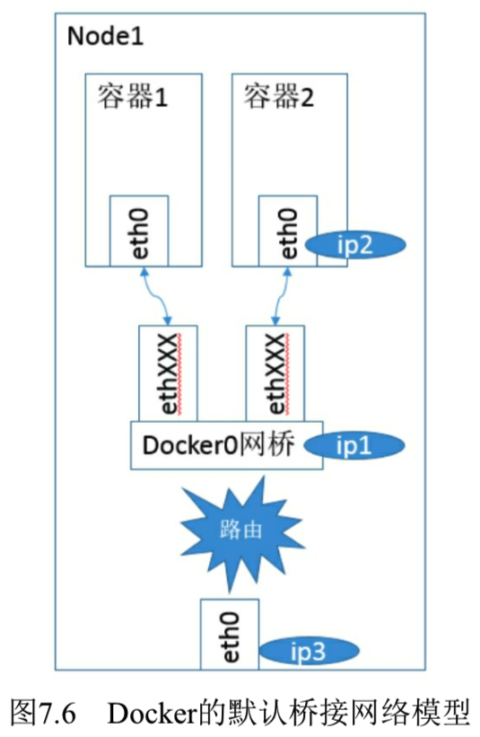
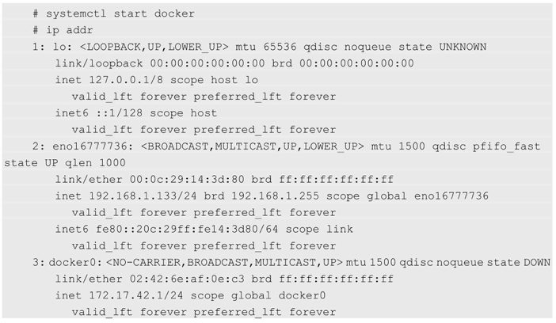
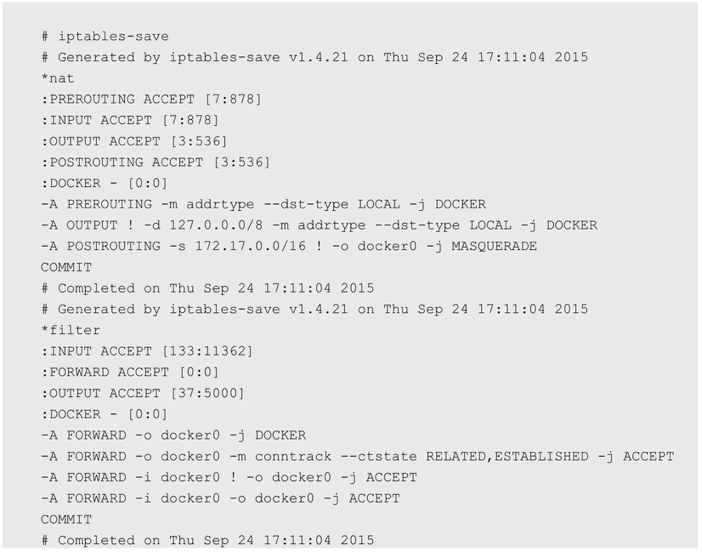
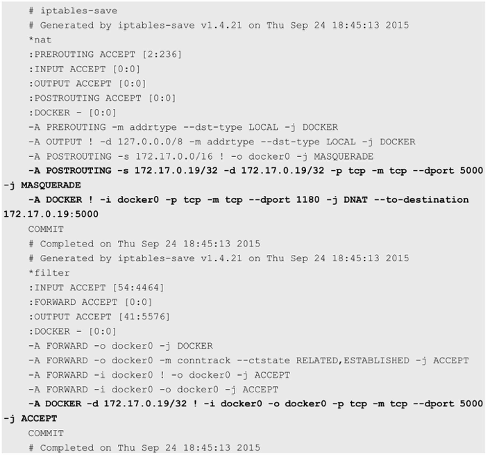
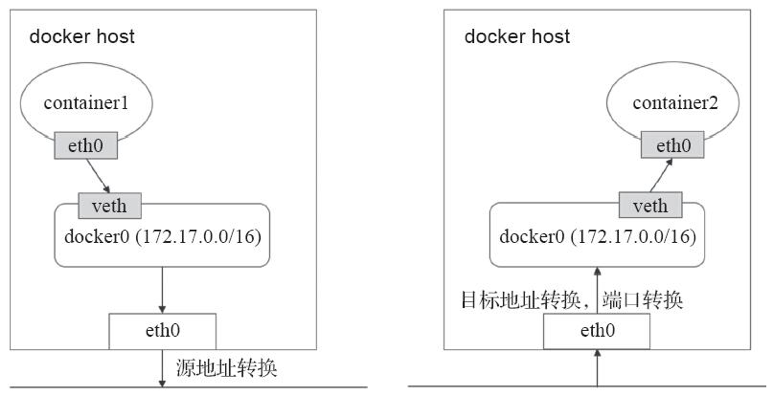
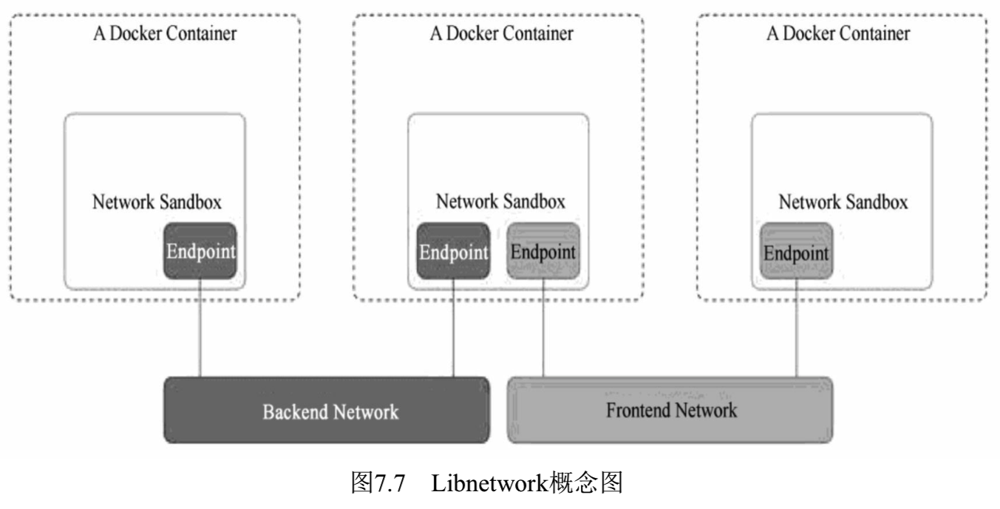

<!-- @import "[TOC]" {cmd="toc" depthFrom=1 depthTo=6 orderedList=false} -->

<!-- code_chunk_output -->

- [1. Docker支持的4类网络模式](#1-docker支持的4类网络模式)
  - [1.1. Docker守护进程](#11-docker守护进程)
  - [1.2. Docker容器创建的网络](#12-docker容器创建的网络)
- [2. Bridge模式](#2-bridge模式)
  - [2.1. 虚拟网桥docker0](#21-虚拟网桥docker0)
  - [2.2. 容器的veth设备对](#22-容器的veth设备对)
  - [2.3. docker的默认桥接网络模型](#23-docker的默认桥接网络模型)
  - [2.4. 容器跨节点通信](#24-容器跨节点通信)
- [3. 查看Docker启动后的系统情况(未启动容器)](#3-查看docker启动后的系统情况未启动容器)
- [4. 查看容器启动后的情况(容器无端口映射)](#4-查看容器启动后的情况容器无端口映射)
- [5. 查看容器启动后的情况（容器有端口映射）](#5-查看容器启动后的情况容器有端口映射)
- [6. Docker的网络局限](#6-docker的网络局限)
  - [6.1. 跨主机容器通信](#61-跨主机容器通信)
  - [6.2. Docker虚拟化网络解决方案: Libnetwork](#62-docker虚拟化网络解决方案-libnetwork)

<!-- /code_chunk_output -->

# 1. Docker支持的4类网络模式

标准的Docker支持以下4类网络模式。

* host模式：使用\-\-net=host指定。
* container模式：使用\-\-net=container:NAME\_or\_ID指定。
* none模式：使用\-\-net=none指定。
* bridge模式：使用\-\-net=bridge指定，为**默认设置**。

**Bridge模型**借助于**虚拟网桥设备**为容器建立网络连接，

**Host模型**则设定容器**直接共享使用节点主机的网络名称空间**，

而**Container模型**则是指**多个容器共享同一个网络名称空间**，从而彼此之间能够以本地通信的方式建立连接。

四种网络模型可以使用在很多地方, 比如Docker守护进程启动后的初始化配置、Docker容器启动的网络配置.

## 1.1. Docker守护进程

Docker守护进程首次启动时，它会在当前节点上创建一个名为**docker0**的**桥设备**，并默认配置其使用172.17.0.0/16网络，该网络是**Bridge模型**的**一种实现**，也是创建Docker容器时默认使用的网络模型。

## 1.2. Docker容器创建的网络

图11-1　Docker容器网络:


如图11-1所示，创建Docker容器时，默认有四种网络可供选择使用，从而表现出了四种不同类型的容器，具体如下。

* **Closed container（封闭式容器**）：此类容器使用“None”网络，它们没有对外通信的网络接口，而是仅具有I/O接口，通常仅用于**不需要网络**的**后端作业处理场景**。

* **Bridged container（桥接式容器**）：此类容器使用“Bridge”模型的网络，对于每个网络接口，容器引擎都会为每个容器创建**一对（两个）虚拟以太网设备**，一个配置为容器的接口设备，另一个则在节点主机上接入指定的虚拟网桥设备（默认为docker0）。

* Joined container（联盟式容器）：此类容器**共享**使用**某个已存在的容器的网络名称空间**，即共享并使用**指定的容器的网络及其接口**。

* Open container（开放式容器）：此类容器使用“**Host**”模型的网络，它们**共享使用Docker主机的网络及其接口**。

# 2. Bridge模式

在**Kubernetes管理模式**下通常**只会使用bridge模式**，所以本节只介绍在bridge模式下Docker是如何支持网络的。

## 2.1. 虚拟网桥docker0

在**bridge模式**下，Docker Daemon**第1次启动**时会**创建一个虚拟的网桥！！！**，**默认的名称**是**docker0**，然后按照**RPC1918的模型**在**私有网络空间！！！** 中给**这个网桥**分配一个**子网**。

## 2.2. 容器的veth设备对

针对由**Docker**创建的**每一个容器**，都会创建一个**虚拟的以太网设备（Veth设备对**），其中**一端关联到网桥**上，另一端使用**Linux的网络命名空间技术！！！**，映射到**容器内的eth0设备**，然后从**网桥的地址段！！！** 内给eth0接口分配一个IP地址。

## 2.3. docker的默认桥接网络模型

如图7.6所示就是Docker的**默认桥接网络模型**。



其中

* **ip1**是**网桥的IP地址**，Docker Daemon会在**几个备选地址段**里给它选一个地址，通常是以**172开头**的一个地址。这个地址和主机的IP地址是**不重叠**的。

* **ip2**是Docker在**启动容器**时，在这个地址段选择的一个没有使用的IP地址分配给容器。相应的**MAC地址**也**根据这个IP地址**，在**02:42:ac:11:00:00**和**02:42:ac:11:ff:ff**的范围内生成，这样做可以确保**不会有ARP冲突**。启动后，Docker还将**Veth对**的名称映射到**eth0网络接口**。

* **ip3**就是**主机的网卡地址**。

在一般情况下，ip1、ip2和ip3是**不同的IP段**，所以在默认不做任何特殊配置的情况下，在**外部是看不到ip1和ip2的！！！**。

这样做的结果就是，在**同一台机器内**的**容器之间**可以**相互通信**，**不同主机**上的**容器不能相互通信**，实际上它们甚至有可能在相同的网络地址范围内（不同主机上的docker0的地址段可能是一样的）。

## 2.4. 容器跨节点通信

为了让它们**跨节点互相通信**，就必须在**主机的地址**上**分配端口**，然后通过这个**端口路由**或**代理到容器**上。这种做法显然意味着一定要在**容器之间**小心谨慎地协调好**端口的分配**，或者使用**动态端口的分配技术**。

在不同应用之间协调好端口分配是十分困难的事情，特别是集群水平扩展时。

而**动态的端口分配**也会带来高度复杂性，例如：每个应用程序都**只能将端口看作一个符号**（因为是动态分配的，所以**无法提前设置**）。

而且API Server要在分配完后，将动态端口插入配置的合适位置，服务也必须能互相找到对方等。这些都是Docker的网络模型在跨主机访问时面临的问题。

# 3. 查看Docker启动后的系统情况(未启动容器)

**Docker网络**在**bridge模式**下Docker Daemon启动时**创建docker0网桥**，并在网桥使用的网段为容器分配IP。让我们看看实际的操作。

在**刚刚启动Docker Daemon**并且**还没有启动任何容器**时，网络协议栈的配置情况如下：






```
# ip addr
1: lo: <LOOPBACK,UP,LOWER_UP> mtu 65536 qdisc noqueue state UNKNOWN group default qlen 1000
    link/loopback 00:00:00:00:00:00 brd 00:00:00:00:00:00
    inet 127.0.0.1/8 scope host lo
       valid_lft forever preferred_lft forever
    inet6 ::1/128 scope host
       valid_lft forever preferred_lft forever
2: ens33: <BROADCAST,MULTICAST,UP,LOWER_UP> mtu 1500 qdisc pfifo_fast state UP group default qlen 1000
    link/ether 00:0c:29:8f:1a:ff brd ff:ff:ff:ff:ff:ff
    inet 172.16.100.131/24 brd 172.16.100.255 scope global noprefixroute dynamic ens33
       valid_lft 1709sec preferred_lft 1709sec
    inet6 fe80::f703:e13b:90af:920c/64 scope link noprefixroute
       valid_lft forever preferred_lft forever
3: docker0: <NO-CARRIER,BROADCAST,MULTICAST,UP> mtu 1500 qdisc noqueue state DOWN group default
    link/ether 02:42:6f:3b:76:00 brd ff:ff:ff:ff:ff:ff
    inet 172.17.0.1/16 brd 172.17.255.255 scope global docker0
       valid_lft forever preferred_lft forever
4: virbr0: <NO-CARRIER,BROADCAST,MULTICAST,UP> mtu 1500 qdisc noqueue state DOWN group default qlen 1000
    link/ether 52:54:00:d6:fe:bb brd ff:ff:ff:ff:ff:ff
    inet 192.168.122.1/24 brd 192.168.122.255 scope global virbr0
       valid_lft forever preferred_lft forever
5: virbr0-nic: <BROADCAST,MULTICAST> mtu 1500 qdisc pfifo_fast master virbr0 state DOWN group default qlen 1000
    link/ether 52:54:00:d6:fe:bb brd ff:ff:ff:ff:ff:ff

# iptables-save
# Generated by iptables-save v1.4.21 on Mon Oct 21 15:08:49 2019
*mangle
:PREROUTING ACCEPT [429:91362]
:INPUT ACCEPT [428:91034]
:FORWARD ACCEPT [0:0]
:OUTPUT ACCEPT [223:35456]
:POSTROUTING ACCEPT [277:42201]
-A POSTROUTING -o virbr0 -p udp -m udp --dport 68 -j CHECKSUM --checksum-fill
COMMIT
# Completed on Mon Oct 21 15:08:49 2019
# Generated by iptables-save v1.4.21 on Mon Oct 21 15:08:49 2019
*nat
:PREROUTING ACCEPT [13:3798]
:INPUT ACCEPT [12:3470]
:OUTPUT ACCEPT [70:5363]
:POSTROUTING ACCEPT [69:5323]
:DOCKER - [0:0]
-A PREROUTING -m addrtype --dst-type LOCAL -j DOCKER
-A OUTPUT ! -d 127.0.0.0/8 -m addrtype --dst-type LOCAL -j DOCKER
-A POSTROUTING -s 192.168.122.0/24 -d 224.0.0.0/24 -j RETURN
-A POSTROUTING -s 192.168.122.0/24 -d 255.255.255.255/32 -j RETURN
-A POSTROUTING -s 192.168.122.0/24 ! -d 192.168.122.0/24 -p tcp -j MASQUERADE --to-ports 1024-65535
-A POSTROUTING -s 192.168.122.0/24 ! -d 192.168.122.0/24 -p udp -j MASQUERADE --to-ports 1024-65535
-A POSTROUTING -s 192.168.122.0/24 ! -d 192.168.122.0/24 -j MASQUERADE
-A POSTROUTING -s 172.17.0.0/16 ! -o docker0 -j MASQUERADE
-A DOCKER -i docker0 -j RETURN
COMMIT
# Completed on Mon Oct 21 15:08:49 2019
# Generated by iptables-save v1.4.21 on Mon Oct 21 15:08:49 2019
*filter
:INPUT ACCEPT [428:91034]
:FORWARD ACCEPT [0:0]
:OUTPUT ACCEPT [223:35456]
:DOCKER - [0:0]
:DOCKER-ISOLATION-STAGE-1 - [0:0]
:DOCKER-ISOLATION-STAGE-2 - [0:0]
:DOCKER-USER - [0:0]
-A INPUT -i virbr0 -p udp -m udp --dport 53 -j ACCEPT
-A INPUT -i virbr0 -p tcp -m tcp --dport 53 -j ACCEPT
-A INPUT -i virbr0 -p udp -m udp --dport 67 -j ACCEPT
-A INPUT -i virbr0 -p tcp -m tcp --dport 67 -j ACCEPT
-A FORWARD -d 192.168.122.0/24 -o virbr0 -m conntrack --ctstate RELATED,ESTABLISHED -j ACCEPT
-A FORWARD -s 192.168.122.0/24 -i virbr0 -j ACCEPT
-A FORWARD -i virbr0 -o virbr0 -j ACCEPT
-A FORWARD -o virbr0 -j REJECT --reject-with icmp-port-unreachable
-A FORWARD -i virbr0 -j REJECT --reject-with icmp-port-unreachable
-A FORWARD -j DOCKER-USER
-A FORWARD -j DOCKER-ISOLATION-STAGE-1
-A FORWARD -o docker0 -m conntrack --ctstate RELATED,ESTABLISHED -j ACCEPT
-A FORWARD -o docker0 -j DOCKER
-A FORWARD -i docker0 ! -o docker0 -j ACCEPT
-A FORWARD -i docker0 -o docker0 -j ACCEPT
-A OUTPUT -o virbr0 -p udp -m udp --dport 68 -j ACCEPT
-A DOCKER-ISOLATION-STAGE-1 -i docker0 ! -o docker0 -j DOCKER-ISOLATION-STAGE-2
-A DOCKER-ISOLATION-STAGE-1 -j RETURN
-A DOCKER-ISOLATION-STAGE-2 -o docker0 -j DROP
-A DOCKER-ISOLATION-STAGE-2 -j RETURN
-A DOCKER-USER -j RETURN
COMMIT
# Completed on Mon Oct 21 15:08:49 2019
```

可以看到，Docker创建了**docker0网桥**，并添加了**iptables规则**。

**docker0网桥**和**iptables规则**都处于**root命名空间**中。

通过解读这些规则，我们发现，在还**没有启动任何容器**时，如果**启动了D1ocker Daemon**，那么它已经做好了**通信准备**。对这些规则的说明如下。

（1）在**NAT表**中有**3条记录**，**前两条匹配生效**后，都会继续执行**DOCKER链**，而此时DOCKER链为空，所以前两条只是做了一个框架，并没有实际效果。

（2）**NAT表**第3条的含义是，若**本地发出的数据包不是发往docker0**的，即是发往**主机之外的设备**的，则都需要进行**动态地址修改（MASQUERADE！！！**），将**源地址**从**容器的地址（172段**）修改为**宿主机网卡的IP地址**，之后就可以发送给外面的网络了。

（3）在**FILTER表**中，第1条也是一个框架，因为后继的DOCKER链是空的。

（4）在FILTER表中，第3条是说，docker0发出的包，如果需要Forward到非docker0的本地IP地址的设备，则是允许的。这样，docker0设备的包就可以根据路由规则中转到宿主机的网卡设备，从而访问外面的网络。

（5）FILTER表中，第4条是说，docker0的包还可以被中转给docker0本身，即连接在docker0网桥上的不同容器之间的通信也是允许的。

（6）FILTER表中，第2条是说，如果接收到的数据包属于以前已经建立好的连接，那么允许直接通过。这样接收到的数据包自然又走回docker0，并中转到相应的容器。

除了这些Netfilter的设置，Linux的ip\_forward功能也被Docker Daemon打开了：

```
# cat /proc/sys/net/ipv4/ip_forward
1
```

另外，我们可以看到刚刚启动Docker后的Route表，**和启动前没有什么不同**：


# 4. 查看容器启动后的情况(容器无端口映射)

刚才查看了Docker服务启动后的网络情况。现在**启动一个Registry容器**（不使用任何端口镜像参数），看一下网络堆栈部分相关的变化：


可以看到如下情况。

（1）宿主机器上的**Netfilter**和**路由表**都**没有变化**，说明在**不进行端口映射**时，**Docker的默认网络**是没有特殊处理的。相关的**NAT**和**FILTER**这两个Netfilter链还是空的。

（2）宿主机上的Veth对已经建立，并连接到容器内。

我们再次进入刚刚启动的容器内，看看网络栈是什么情况。容器内部的IP地址和路由如下：


可以看到，默认停止的回环设备lo已经被启动，外面宿主机连接进来的Veth设备也被命名成了eth0，并且已经配置了地址172.17.0.10。

路由信息表包含一条到**docker0的子网路由**和一条**到docker0的默认路由**。

# 5. 查看容器启动后的情况（容器有端口映射）

下面用带端口映射的命令启动registry：

```
docker run --name register -d -p 1180:5000 registry
```

在启动后查看iptables的变化：



从**新增的规则**可以看出，**Docker服务**在**NAT**和**FILTER两个表**内添加的**两个DOCKER子链**都是给**端口映射**用的。

在本例中我们需要把**外面宿主机**的**1180端口**映射到**容器**的**5000端口**。通过前面的分析我们知道，无论是**宿主机接收到**的还是**宿主机本地协议栈发出**的，**目标地址**是**本地IP地址**的包都会经过**NAT表中的DOCKER子链**。Docker为**每一个端口映射**都在**这个链**上增加了到**实际容器目标地址和目标端口的转换**。

经过这个DNAT的规则修改后的IP包，会重新经过路由模块的判断进行转发。由于目标地址和端口已经是容器的地址和端口，所以数据自然就被转发到docker0上，从而被转发到对应的容器内部。

当然在Forward时，也需要在DOCKER子链中添加一条规则，如果目标端口和地址是指定容器的数据，则允许通过。

在Docker按照端口映射的方式启动容器时，**主要的不同**就是上述**iptables部分**。而**容器内部**的**路由和网络设备**，都和不做端口映射时一样，没有任何变化。

# 6. Docker的网络局限

## 6.1. 跨主机容器通信

根据\<Docker容器创建的网络>内容以及对bridge详解, 四种网络模型实现的容器间通信仅描述了**同一节点**上的**容器间通信**的可用方案，这应该也是**Docker设计者**早期最为关注的容器通信目标。

然而，在**生产环境中使用容器技术**时，**跨节点的容器间通信**反倒更为常见，可根据**网络类型**将其实现方式简单划分为如下几种。

* 为**各Docker节点**创建**物理！！！网络桥接接口**，设定**各节点上的容器**使用此桥设备从而**直接暴露于物理网络**中。
* 配置**各节点上的容器**直接**共享**使用**其节点！！！的网络名称空间**。
* 将容器接入**指定的桥设备**，如docker0，并设置其**借助NAT机制**进行通信。

第三种方案是较为流行且默认的解决方案。不过，此种方案的**IPAM（IP Address Management**）是基于**容器主机本地！！！范围进行**的，**每个节点上的容器**都将从**同一个网络172.17.0.0/16(docker0的**)中获取**IP地址**，这就意味着**不同Docker主机**上的容器可能会**使用相同的地址**，因此它们也就**无法直接通信**。

解决此问题的通行方式是为NAT。**所有接入到此桥设备**上的**容器**均会**被NAT隐藏**，它们**发往Docker主机外部**的所有流量都会在执行过**源地址转换**后发出，并且**默认**是**无法直接接收节点之外的其他主机**发来的请求的。若要接入**Docker主机外部的流量**，则需要事先通过**目标地址转换**甚至**额外的端口转换**将其暴露于外部网络中，如图11-2所示。

图11-2　跨节点容器间的通信示例图:



故此，**传统的解决方案**中，**多节点**上的**Docker容器间通信**依赖于**NAT机制转发实现**。这种解决方案在**网络规模庞大**时将变得极为复杂、对系统资源的消耗较大且转发效率低下。此外，**docker host的端口**也是一种稀缺资源，静态分配和映射极易导致冲突，而动态分配又很容易导致模型的进一步复杂化。

事实上，Docker网络也可借助于**第三方解决方案**来规避NAT通信模型导致的复杂化问题，后来还发布了**CNM（Container Network Model）规范**，现在已经被Cisco Contiv、Kuryr、Open Virtual Networking（OVN）、Project Calico、VMware或Weave这些公司和项目所采纳。不过，这种模型被采用时，也就属于了**容器编排的范畴**。

## 6.2. Docker虚拟化网络解决方案: Libnetwork

我们从Docker对Linux网络协议栈的操作可以看到，**Docker**一开始**没有考虑**到**多主机互联**的网络解决方案。

Docker一直以来的理念都是“简单为美”，几乎所有尝试Docker的人都被它“用法简单，功能强大”的特性所吸引，这也是Docker迅速走红的一个原因。

我们都知道，**虚拟化技术**中最为复杂的部分就是**虚拟化网络技术**，即使是单纯的物理网络部分，也是一个门槛很高的技能领域，通常只被少数网络工程师所掌握，所以我们可以理解结合了物理网络的虚拟网络技术有多难。在**Docker之前**，所有接触过OpenStack的人都对其网络问题讳莫如深，Docker明智地避开这个“雷区”，让其他专业人员去用现有的虚拟化网络技术解决Docker主机的互联问题，以免让用户觉得Docker太难，从而放弃学习和使用Docker。

Docker成名以后，重新开始重视网络解决方案，收购了一家Docker网络解决方案公司—**Socketplane**，原因在于这家公司的产品广受好评，但有趣的是Socketplane的方案就是以**Open vSwitch为核心**的，其还为Open vSwitch提供了Docker镜像，以方便部署程序。

之后，Docker开启了一个宏伟的**虚拟化网络解决方案**—**Libnetwork**，如图7.7所示是其概念图。



这个概念图没有了IP，也没有了路由，已经颠覆了我们的网络常识，对于不怎么懂网络的大多数人来说，它的确很有诱惑力，未来是否会对虚拟化网络的模型产生深远冲击，我们还不得而知，但它仅仅是Docker官方当前的一次“尝试”。

针对目前Docker的网络实现，Docker使用的**Libnetwork**组件**只是**将**Docker平台中的网络子系统模块化**为一个**独立库**的简单尝试，离成熟和完善还有一段距离。