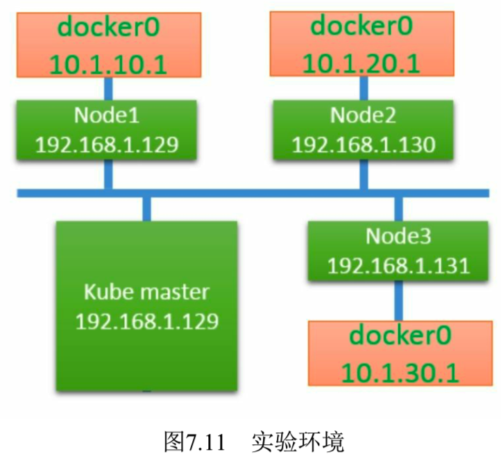
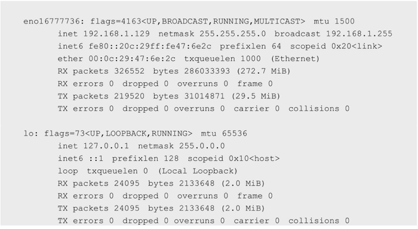
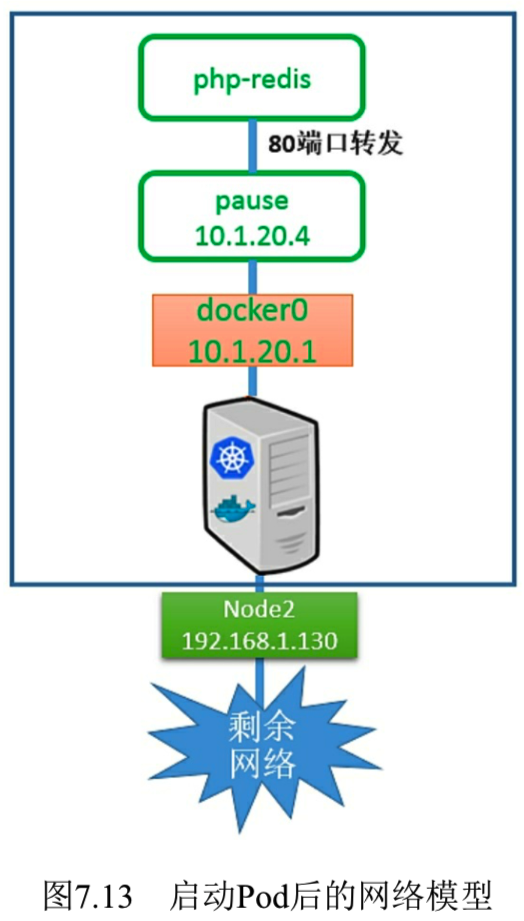
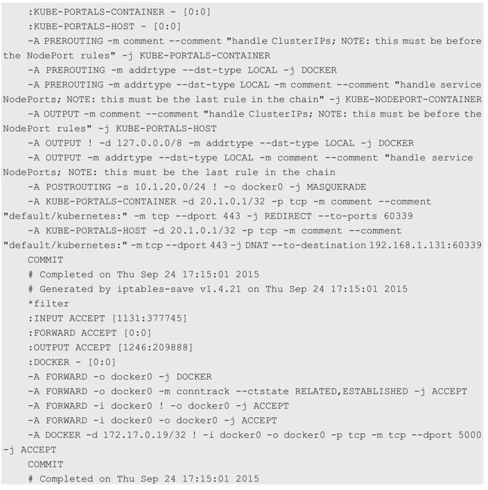

<!-- @import "[TOC]" {cmd="toc" depthFrom=1 depthTo=6 orderedList=false} -->

<!-- code_chunk_output -->

- [第1步：部署一个RC/Pod](#第1步部署一个rcpod)
- [第2步: 发布一个服务](#第2步-发布一个服务)

<!-- /code_chunk_output -->

**Docker**给我们带来了**不同的网络模式**，Kubernetes也以一种**不同的方式！！！** 来解决这些网络模式的挑战，但其方式有些难以理解，特别是对于刚开始接触Kubernetes的网络的开发者来说。我们在前面学习了Kubernetes、Docker的理论，本节将通过一个完整的实验，从部署一个Pod开始，一步一步地部署那些Kubernetes的组件，来剖析**Kubernetes在网络层是如何实现及工作**的。

这里使用虚拟机来完成实验。如果要部署在物理机器上或者云服务商的环境中，则涉及的**网络模型**很可能稍微有所不同。不过，从网络角度来看，Kubernetes的机制是类似且一致的。

好了，来看看我们的实验环境，如图7.11所示。



Kubernetes的网络模型要求每个Node上的容器都可以相互访问。

**默认的Docker网络模型**提供了一个**IP地址段**是**172.17.0.0/16**的**docker0网桥**。**每个容器**都会在**这个子网**内获得**IP地址**，并且将**docker0网桥的IP地址**（**172.17.42.1**）作为其**默认网关**。需要注意的是，Docker宿主机外面的网络不需要知道任何关于这个172.17.0.0/16的信息或者知道如何连接到其内部，因为**Docker的宿主机**针对**容器发出的数据**，在**物理网卡地址**后面都做了**IP伪装MASQUERADE（隐含NAT**）。也就是说，在网络上看到的**任何容器数据流**都来源于那台Docker节点的**物理IP地址**。这里所说的网络都指连接这些主机的物理网络。

这个模型**便于使用**，但是并**不完美**，需要依赖**端口映射的机制**。

在**Kubernetes的网络模型**中，**每台主机**上的**docker0网桥**都是**可以被路由到**的。也就是说，在**部署了一个Pod**时，在**同一个集群内**，**各主机**都可以访问**其他主机**上的**Pod IP**，并**不需要！！！在主机上做端口映射！！！**。

综上所述，我们可以在**网络层**将**Kubernetes的节点**看作一个**路由器！！！**。如果将实验环境改画成一个网络图，那么它看起来如图7.12所示。


为了支持Kubernetes网络模型，我们采取了**直接路由！！！** 的方式来实现，在**每个Node**上都**配置相应的静态路由项**，例如在192.168.1.129这个Node上配置了两个路由项：

```
# route add -net 10.1.20.0 netmask 255.255.255.0 gw 192.168.130
# route add -net 10.1.30.0 netmask 255.255.255.0 gw 192.168.131
```

这意味着，**每一个新部署的容器**都将使用这个**Node（docker0的网桥IP**）作为它的**默认网关**。而这些Node（类似路由器）都有其他docker0的路由信息，这样它们就能够相互连通了。

接下来通过一些实际的案例，来看看Kubernetes在不同的场景下其网络部分到底做了什么。

# 第1步：部署一个RC/Pod

部署的RC/Pod描述文件如下（frontend-controller.yaml）：

```yaml
---
apiVersion: v1
kind: ReplicationController
metadata:
  name: frontend
  labels:
    name: frontend
spec:
  replicas: 1
  selector:
    name: frontend
  template:
    metadata:
      labels:
        name: frontend
    spec:
      containers:
      - name: php-redis
        image: kubeguide/guestbook-php-frontend
        env:
        - name: GET_HOSTS_FROM
          value: env
        ports:
        - containerPort: 80
          hostPort: 80
```

为了便于观察，我们假定在一个空的Kubernetes集群上运行，提前清理了所有Replication Controller、Pod和其他Service：

```
# kubectl get rc
CONTROLLER  CONTAINER(S)    IMAGE(S)    SELECTOR    REPLICAS

# kubectl get services
NAME        LABELS                                  SELECTOR    IP(S)   PORT(S)
kubernetes  component=apiserver,provider=kubernetes <none>      20.1.0.1    443/TCP

# kubectl get pods
NAME    READY   STATUS  RESTARTS    AGE
```

让我们检查一下此时**某个Node**上的**网络接口**都有哪些。Node1的状态是：




可以看出，有一个**docker0网桥**和一个**本地地址的网络端口**。

现在部署一下我们在前面准备的RC/Pod配置文件，看看发生了什么：

```
# kubectl create -f frontend-controller.yaml
replication controllers frontend

# kubectl get pods
NAME            READY   STATUS      RESTARTS    AGE     NODE
frontend-4o11g  1/1     Running     0           11s     192.168.1.130
```

可以看到一些有趣的事情。Kubernetes为**这个Pod**找了一个主机**192.168.1.130（Node2**）来运行它。另外，**这个Pod**获得了一个在**Node2的docker0网桥**上的**IP地址**。

我们**登录Node2**查看正在运行的容器：


在Node2上现在运行了**两个容器**，在我们的RC/Pod定义文件中仅仅包含了一个，那么这第2个是从哪里来的呢？**第2个**看起来运行的是一个叫作`google_containers/pause:latest`的镜像，而且**这个容器已经有端口映射！！！到它上面** 了，为什么是这样呢？让我们深入容器内部去看一下具体原因。

使用Docker的inspect命令来查看容器的详细信息，特别要关注**容器的网络模型**：


有趣的结果是，在**查看完每个容器的网络模型**后，我们可以看到这样的配置：

* 我们检查的**第1个容器**是运行了“**google\_containers/pause:latest**”镜像的容器，它使用了**Docker默认的网络模型 bridge**；

* 而我们检查的**第2个容器**，也就是在RC/Pod中定义运行的**php\-redis容器**，使用了**非默认！！！的网络配置和映射容器的模型**，指定了**映射目标容器！！！** 为“google\_containers/ pause:latest”。

一起来仔细思考这个过程，为什么Kubernetes要这么做呢？

首先，**一个Pod！！！内的所有容器！！！** 都需要**共用！！！同一个IP地址！！！**，这就意味着**一定要使用网络的容器映射模式！！！**。

然而，为什么不能**只启动1个容器**，而将**第2个容器**关联到**第1个容器**呢？我们认为Kubernetes是从两方面来考虑这个问题的：

* 首先，如果在**Pod内有多个容器**的话，则可能**很难连接这些容器**；
* 其次，**后面的容器**还要**依赖第1个被关联的容器**，如果第2个容器关联到第1个容器，且第1个容器死掉的话，第2个容器也将死掉。

启动一个**基础容器**，然后将**Pod内的所有容器**都**连接到它上面**会更容易一些。因为我们**只需要**为基础的这个google\_containers/pause容器**执行端口映射规则**，这也**简化了端口映射的过程**。

所以我们**启动Pod后**的**网络模型**类似于图7.13。



在这种情况下，**实际Pod**的**IP数据流**的**网络目标**都是这个**google\_containers/pause容器**。图7.13有点儿取巧地显示了是google_containers/pause容器将端口80的流量转发给了相关的容器。而pause容器只是看起来**转发了网络流量**，但它并**没有真的这么做**。实际上，**应用容器！！！直接监听！！！了这些端口！！！**，和google_containers/pause容器**共享了同一个网络堆栈！！！**。

这就是为什么在**Pod内部实际容器的端口映射**都显示到google\_containers/**pause容器**上了。我们可以通过docker port命令来检验一下：


综上所述，google\_containers/pause容器实际上**只是负责接管这个Pod的Endpoint！！！**，并没有做更多的事情。

那么**Node**呢？它需要将数据流传给google\_containers/pause容器吗？我们来检查一下iptables的规则，看看有什么发现：




上面的这些规则并没有被应用到我们刚刚定义的Pod上。当然，Kubernetes会给每一个Kubernetes节点都提供一些默认的服务，上面的规则就是Kubernetes的默认服务所需要的。关键是，我们**没有看到任何IP伪装**的规则，并且**没有任何指向Pod 10.1.20.4内部的端口映射**。

# 第2步: 发布一个服务

我们已经了解了Kubernetes如何处理最基本的元素即Pod的连接问题，接下来看一下它是如何处理Service的。

**Service**允许我们在**多个Pod**之间**抽象一些服务**，而且**服务**可以通过提供在**同一个Service**的**多个Pod之间**的**负载均衡机制**来支持水平扩展。

我们再次将环境初始化，删除刚刚创建的RC或Pod来确保集群是空的：

```
# kubectl stop rc frontend
replication controllers frontend

# kubectl get rc
CONTROLLER  CONTAINER(S)    IMAGE(S)    SELECTOR    REPLICAS

# kubectl get services
NAME        LABELS                                  SELECTOR    IP(S)   PORT(S)
kubernetes  component=apiserver,provider=kubernetes <none>      20.1.0.1    443/TCP

# kubectl get pods
NAME    READY   STATUS  RESTARTS    AGE
```

然后准备一个名为frontend的Service配置文件：

```yaml
---
apiVersion: v1
kind: Service
metadata:
  name: frontend
  labels:
    name: frontend
spec:
  ports:
  - port: 80
  selector:
    name: frontend
```

在Kubernetes集群中定义这个服务：

```
# kubectl create -f frontend-service.yaml
services/frontend

# kubectl get services
NAME        LABELS                                  SELECTOR        IP(S)         PORT(S)
frontend    name=frontend                           name=frontend   20.1.244.75   80/TCP
kubernetes  component=apiserver,provider=kubernetes <none>          20.1.0.1      443/TCP
```

在**服务正确创建**后，可以看到Kubernetes集群已经为**这个服务**分配了一个**虚拟IP地址20.1.244.75**，这个IP地址是在**Kubernetes**的**Portal Network！！！** 中分配的。而这个Portal Network的地址范围是我们在Kubmaster上**启动API服务进程**时，使用\-\-service\-cluster\-ip\-range=xx命令行参数指定的：


这个IP段可以是**任何段**，只要**不和docker0**或者**物理网络的子网冲突**就可以。选择**任意其他网段**的原因是**这个网段**将**不会！！！在物理网络**和**docker0网络上进行路由！！！**。

这个**Portal Network**针对**每一个Node！！！** 都有**局部的特殊性！！！**，实际上它存在的意义是让**容器的流量！！！** 都指向**默认网关！！！（也就是docker0网桥！！！**）。

在继续实验前，先登录到Node1上看一下在我们定义服务后发生了什么变化。

首先检查一下**iptables**或**Netfilter**的规则：

```
# iptables-save
......
-A KUBE-PORTALS-CONTAINER -d 20.1.244.75
......
```

第1行是挂在**PREROUTING链**上的**端口重定向规则**，**所有进入的流量**如果满足20.1.244.75: 80，则都会被重定向到端口33761。

第2行是挂在**OUTPUT链**上的**目标地址NAT**，做了和上述第1行规则类似的工作，但针对的是**当前主机生成的外出流量**。**所有主机生成的流量！！！** 都需要使用这个**DNAT规则**来处理。简而言之，这两个规则使用了不同的方式做了类似的事情，就是将所有从节点生成的发送给20.1.244.75:80的流量重定向到本地的33761端口。

至此，目标为Service IP地址和端口的任何流量都将被重定向到本地的33761端口。这个端口连到哪里去了呢？这就到了kube-proxy发挥作用的地方了。这个kube-proxy服务给每一个新创建的服务都关联了一个随机的端口号，并且监听那个特定的端口，为服务创建相关的负载均衡对象。在我们的实验中，随机生成的端口刚好是33761。通过监控Node1上的Kubernetes-Service的日志，在创建服务时可以看到下面的记录：
