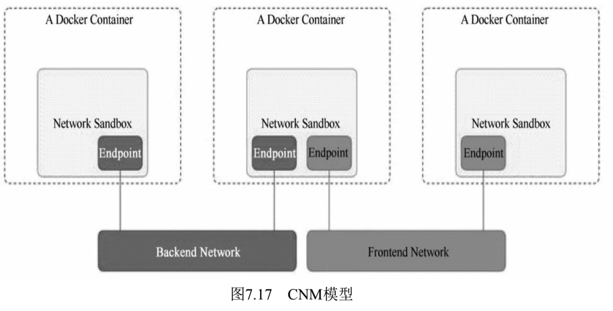

<!-- @import "[TOC]" {cmd="toc" depthFrom=1 depthTo=6 orderedList=false} -->

<!-- code_chunk_output -->

- [CNM模型](#cnm模型)
- [CNI模型](#cni模型)
  - [CNI规范概述](#cni规范概述)
  - [CNI Plugin插件详解](#cni-plugin插件详解)
  - [IPAM Plugin插件详解](#ipam-plugin插件详解)
  - [多网络插件](#多网络插件)

<!-- /code_chunk_output -->

随着容器技术在企业生产系统中的逐步落地，用户对容器云的网络特性要求也越来越高。

**跨主机！！！容器间！！！的网络互通**已经成为基本要求，更高的要求包括**容器固定IP地址**、**一个容器多个IP地址**、**多个子网隔离**、**ACL控制策略**、**与SDN集成**等。

目前主流的**容器网络模型**主要有**Docker公司**提出的**Container Network Model（CNM）模型**和**CoreOS**公司提出的**Container Network Interface（CNI）模型**。

# CNM模型

CNM模型是由Docker公司提出的容器网络模型，现在已经被Cisco Contiv、Kuryr、Open Virtual Networking（OVN）、Project Calico、VMware、Weave和Plumgrid等项目所采纳。

另外，Weave、Project Calico、Kuryr和Plumgrid等项目也为CNM提供了**网络插件的具体实现**。

CNM模型主要通过**Network Sandbox**、**Endpoint**和**Network**这3个组件进行实现，如图7.17所示。



# CNI模型

CNI是由CoreOS公司提出的另一种容器网络规范，现在已经被Kubernetes、rkt、Apache Mesos、Cloud Foundry和Kurma等项目采纳。

另外，Contiv Networking, Project Calico、Weave、SR-IOV、Cilium、Infoblox、Multus、Romana、Plumgrid和Midokura等项目也为CNI提供网络插件的具体实现。

图7.18描述了**容器运行环境**与**各种网络插件**通过CNI进行连接的模型。


**CNI**定义的是**容器运行环境**与**网络插件**之间的**简单接口规范**，通过一个**JSON Schema**定义**CNI插件**提供的**输入**和**输出参数**。**一个容器**可以通过**绑定多个网络插件**加入**多个网络**中。

本节将对Kubernetes如何实现CNI模型进行详细说明。

## CNI规范概述

CNI提供了一种**应用容器的插件化网络**解决方案，定义对容器网络进行操作和配置的规范，通过**插件的形式！！！** 对**CNI接口**进行**实现**。

CNI是由**rkt Networking Proposal**发展而来的，试图提供一种普适的容器网络解决方案。

CNI**仅关注**在**创建容器**时**分配网络资源**，和在**销毁容器**时**删除网络资源**，这使得CNI规范非常轻巧、易于实现，得到了广泛的支持。

在CNI模型中**只涉及两个概念**：**容器**和**网络**。

* 容器（Container）：是拥有**独立Linux网络命名空间**的环境，例如使用Docker或rkt创建的容器。关键之处是**容器需要拥有自己的Linux网络命名空间**，这是加入网络的必要条件。
* 网络（Network）：表示**可以互连的一组实体**，这些实体拥有**各自独立**、**唯一的IP地址**，可以是**容器**、**物理机**或者**其他网络设备（比如路由器**）等。

对**容器网络**的**设置和操作**都通过**插件（Plugin**）进行具体实现，CNI插件包括**两种类型**：**CNI Plugin**和**IPAM（IP Address Management）Plugin**。CNI Plugin负责**为容器配置网络资源**，IPAM Plugin负责**对容器的IP地址进行分配和管理**。IPAM Plugin作为CNI Plugin的一部分，与CNI Plugin一起工作。

## CNI Plugin插件详解

CNI Plugin包括3个基本接口的定义：添加（ADD）、删除（DELETE）、检查（CHECK）和版本查询（VERSION）。这些接口的具体实现要求插件提供一个可执行的程序，在容器网络添加或删除时进行调用，以完成具体的操作。

（1）添加：将容器添加到某个网络。主要过程为在Container Runtime创建容器时，先创建好容器内的网络命名空间（Network Namespace），然后调用CNI插件为该netns进行网络配置，最后启动容器内的进程。

添加接口的参数如下。

* Version：CNI版本号。
* Container ID：容器ID。
* Network namespace path：容器的网络命名空间路径，例如/proc/[pid]/ns/net。
* Network configuration：网络配置JSON文档，用于描述容器待加入的网络。
* Extra arguments：其他参数，提供基于容器的CNI插件简单配置机制。
* Name of the interface inside the container：容器内的网卡名。

返回的信息如下。

* Interfaces list：网卡列表，根据Plugin的实现，可能包括Sandbox Interface名称、主机Interface名称、每个Interface的地址等信息。
* IPs assigned to the interface：IPv4或者IPv6地址、网关地址、路由信息等。
* DNS information：DNS相关的信息。

（2）删除：容器销毁时将容器从某个网络中删除。

删除接口的参数如下。

* Version：CNI版本号。
* Container ID：容器ID。
* Network namespace path：容器的网络命名空间路径，例如/proc/[pid]/ns/net。
* Network configuration：网络配置JSON文档，用于描述容器待加入的网络。
* Extra arguments：其他参数，提供基于容器的CNI插件简单配置机制。
* Name of the interface inside the container：容器内的网卡名。

（3）检查：检查容器网络是否正确设置。

检查接口的参数如下。

* Container ID：容器ID。
* Network namespace path：容器的网络命名空间路径，例如/proc/[pid]/ns/net。
* Network configuration：网络配置JSON文档，用于描述容器待加入的网络。
* Extra arguments：其他参数，提供基于容器的CNI插件简单配置机制。
* Name of the interface inside the container：容器内的网卡名。

（4）版本查询：查询网络插件支持的CNI规范版本号。

无参数，返回值为网络插件支持的CNI规范版本号，例如：


CNI插件应能够支持通过环境变量和标准输入传入参数。可执行文件通过网络配置参数中的type字段标识的文件名在环境变量CNI_PATH设定的路径下进行查找。一旦找到，容器运行时将调用该可执行程序，并传入以下环境变量和网络配置参数，供该插件完成容器网络资源和参数的设置。

环境变量参数如下。

◎　CNI_COMMAND：接口方法，包括ADD、DEL和VERSION。
◎　CNI_CONTAINERID：容器ID。
◎　CNI_NETNS：容器的网络命名空间路径，例如/proc/[pid]/ns/net。
◎　CNI_IFNAME：待设置的网络接口名称。
◎　CNI_ARGS：其他参数，为key=value格式，多个参数之间用分号分隔，例如"FOO=BAR; ABC=123"。
◎　CNI_PATH：可执行文件的查找路径，可以设置多个。

网络配置参数则由一个JSON报文组成，以标准输入（stdin）的方式传递给可执行程序。

网络配置参数如下。

◎　cniVersion（string）：CNI版本号。
◎　name（string）：网络名称，应在一个管理域内唯一。
◎　type（string）：CNI插件的可执行文件的名称。
◎　args（dictionary）：其他参数。
◎　ipMasq（boolean）：是否设置IP Masquerade（需插件支持），适用于主机可作为网关的环境中。
◎　ipam：IP地址管理的相关配置。
- type（string）：IPAM可执行的文件名。
◎　dns：DNS服务的相关配置。
- nameservers（list of strings）：名字服务器列表，可以使用IPv4或IPv6地址。
- domain（string）：本地域名，用于短主机名查询。
- search（list of strings）：按优先级排序的域名查询列表。
- options（list of strings）：传递给resolver的选项列表。

下面的例子定义了一个名为dbnet的网络配置参数，IPAM使用host-local进行设置：

```json
{
  "cniVersion": "0.4.0",
  "name": "dbnet",
  "type": "bridge",
  "bridge": "cni0",
  "ipam": {
    "type": "host-local",
    "subnet": "10.1.0.0/16",
    "gateway": "10.1.0.1"
  },
  "dns": {
    "nameservers": [ "10.1.0.1" ]
  }
}
```

## IPAM Plugin插件详解

为了减轻CNI Plugin对IP地址管理的负担，在CNI规范中设置了一个新的插件专门用于管理容器的IP地址（还包括网关、路由等信息），被称为IPAM Plugin。通常由CNI Plugin在运行时自动调用IPAM Plugin完成容器IP地址的分配。

IPAM Plugin负责为容器分配IP地址、网关、路由和DNS，典型的实现包括host-local和dhcp。与CNI Plugin类似，IPAM插件也通过可执行程序完成IP地址分配的具体操作。IPAM可执行程序也处理传递给CNI插件的环境变量和通过标准输入（stdin）传入的网络配置参数。

如果成功完成了容器IP地址的分配，则IPAM插件应该通过标准输出（stdout）返回以下JSON报文：

```json
{
  "cniVersion": "0.4.0",
  "ips": [
      {
          "version": "<4-or-6>",
          "address": "<ip-and-prefix-in-CIDR>",
          "gateway": "<ip-address-of-the-gateway>"  (optional)
      },
      ......
  ],
  "routes": [                                       (optional)
      {
          "dst": "<ip-and-prefix-in-cidr>",
          "gw": "<ip-of-next-hop>"                  (optional)
      },
      ......
  ]
  "dns": {
    "nameservers": <list-of-nameservers>            (optional)
    "domain": <name-of-local-domain>                (optional)
    "search": <list-of-search-domains>              (optional)
    "options": <list-of-options>                    (optional)
  }
}
```

其中包括ips、routes和dns三段内容。

◎　ips段：分配给容器的IP地址（也可能包括网关）。
◎　routes段：路由规则记录。
◎　dns段：DNS相关的信息。

## 多网络插件

在很多情况下，一个容器需要连接多个网络，CNI规范支持为一个容器运行多个CNI Plugin来实现这个目标。多个网络插件将按照网络配置列表中的顺序执行，并将前一个网络配置的执行结果传递给后面的网络配置。多网络配置用JSON报文进行配置，包括如下信息。

◎　cniVersion（string）：CNI版本号。
◎　name（string）：网络名称，应在一个管理域内唯一，将用于下面的所有Plugin。
◎　plugins（list）：网络配置列表。

下面的例子定义了两个网络配置参数，分别作用于两个插件，第1个为bridge，第2个为tuning。CNI将首先执行第1个bridge插件设置容器的网络，然后执行第2个tuning插件：

```json
{
  "cniVersion": "0.4.0",
  "name": "dbnet",
  "plugins": [
    {
      "type": "bridge",
      // type (plugin) specific
      "bridge": "cni0",
      // args may be ignored by plugins
      "args": {
        "labels" : {
            "appVersion" : "1.0"
        }
      },
      "ipam": {
        "type": "host-local",
        // ipam specific
        "subnet": "10.1.0.0/16",
        "gateway": "10.1.0.1"
      },
      "dns": {
        "nameservers": [ "10.1.0.1" ]
      }
    },
    {
      "type": "tuning",
      "sysctl": {
        "net.core.somaxconn": "500"
      }
    }
  ]
}
```

在容器运行且执行第1个bridge插件时，网络配置参数将被设置为：

```json
{
  "cniVersion": "0.4.0",
  "name": "dbnet",
  "type": "bridge",
  "bridge": "cni0",
  "args": {
        "labels" : {
            "appVersion" : "1.0"
        }
      },
      "ipam": {
        "type": "host-local",
        // ipam specific
        "subnet": "10.1.0.0/16",
        "gateway": "10.1.0.1"
      },
      "dns": {
        "nameservers": [ "10.1.0.1" ]
      }
}
```

接下来执行第2个tuning插件，网络配置参数将被设置为：

```json
{
  "cniVersion": "0.4.0",
  "name": "dbnet",
  "type": "tuning",
  "bridge": "cni0",
  "sysctl": {
      "net.core.somaxconn": "500"
  },
  "plugins": [
    {
      "type": "bridge",
      // type (plugin) specific
      "bridge": "cni0",
      // args may be ignored by plugins
      "args": {
        "labels" : {
            "appVersion" : "1.0"
        }
      },
      "ipam": {
        "type": "host-local",
        // ipam specific
        "subnet": "10.1.0.0/16",
        "gateway": "10.1.0.1"
      },
      "dns": {
        "nameservers": [ "10.1.0.1" ]
      }
    },
    {
      "type": "tuning",
      "sysctl": {
        "net.core.somaxconn": "500"
      }
    }
  ]
}
```

