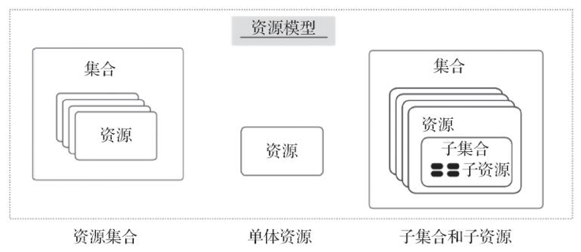

<!-- @import "[TOC]" {cmd="toc" depthFrom=1 depthTo=6 orderedList=false} -->

<!-- code_chunk_output -->

- [1. 架构风格, 而非标准](#1-架构风格-而非标准)
- [2. 架构和规范](#2-架构和规范)
- [3. B/S架构和规范](#3-bs架构和规范)
  - [3.1. 客户端-服务端规范](#31-客户端-服务端规范)
  - [3.2. 无状态性](#32-无状态性)
  - [3.3. 客户端缓存](#33-客户端缓存)
- [4. REST架构和规范](#4-rest架构和规范)
  - [4.1. 统一接口](#41-统一接口)
  - [4.2. 分层系统](#42-分层系统)
  - [4.3. 按需代码](#43-按需代码)
- [5. REST的设计准则](#5-rest的设计准则)
  - [5.1. 资源](#51-资源)
  - [5.2. 资源标识符](#52-资源标识符)
  - [5.3. HTTP规范和RESTful的URI](#53-http规范和restful的uri)
  - [5.4. 无状态](#54-无状态)

<!-- /code_chunk_output -->

# 1. 架构风格, 而非标准

**REST**（**Representational State Transfer**，**表述性！！！状态传递**）是由Roy Thomas Fielding博士在他的论文**Architectural Styles and the Design of Network-based Software Architectures**中提出的一个术语。

**REST**本身只是为**分布式超媒体系统**设计的一种**架构风格**，而**不是标准！！！**。

REST的基本元素为**资源（resource**）、**表征（representation**）和**行为（action**）。

**资源即对象**，**一个资源**通常意味着**一个附带类型**和**关联数据**、**支持的操作方法**以及**与其他对象的关系**的对象，它们是**持有状态的事物**，即**REST中的S（State**）。

REST组件通过使用“**表征**”来捕获**资源的当前或预期状态**并在组件之间**传输该表征**从而**对资源执行操作**。表征是一个**字节序列**，由**数据**、**描述数据的元数据**以及**偶尔描述元数据的元数据**组成（通常用于**验证消息的完整性**），表征还有一些其他常用但不太精确的名称，如**文档**、**文件**和**HTTP消息实体**等。表征的**数据格式**称为**媒体类型（media type**），常用的有JSON或XML。

API客户端**不能直接访问资源**，它们需要执行“**动作**”（action）来改变**资源的状态**，于是资源的状态从一种形式“转移”（Transfer）为另一种形式。

**资源**可以分组为**集合（collection**），每个集合只包含**单一类型的资源**，并且各资源间是无序的。当然，资源也可以不属于任何集合，它们称为**单体资源**。事实上，**集合本身也是资源**，它可以部署于全局级别，位于API的顶层，也可以包含于某个资源中，表现为“子集合”。集合、资源、子集合及子资源间的关系如图3-1所示。

图3-1　集合、资源和子资源:

Kubernetes系统将一切事物都抽象为API资源，其遵循REST架构风格组织并管理这些资源及其对象，同时还支持通过标准的HTTP方法（POST、PUT、PATCH、DELETE和GET）对资源进行增、删、改、查等管理操作。不过，在Kubernetes系统的语境中，“资源”用于表示“对象”的集合，例如，Pod资源可用于描述所有Pod类型的对象，但本书将不加区别地使用资源、对象和资源对象，并将它们统统理解为资源类型生成的实例—对象。

# 2. 架构和规范

**基于Web的架构！！！** 实际上就是**各种规范！！！的集合！！！**，比如**HTTP是一种规范**，**客户端服务器模式！！！** 是**另一种规范**。

每当我们在**原有规范**的基础上增加**新的规范**时，就会形成**新的架构**。而REST正是这样一种架构，它**结合了一系列规范**，形成了一种新的**基于Web**的**架构风格**。

# 3. B/S架构和规范

**传统的Web应用**大多是**B/S架构**，**涉及如下规范**。

## 3.1. 客户端-服务端规范

（1）**客户端-服务器**：这种规范的提出，改善了用户接口跨多个平台的可移植性，并且通过简化服务器组件，改善了系统的可伸缩性。最为关键的是通过**分离用户接口和数据存储**，使得不同的用户终端共享相同的数据成为可能。

## 3.2. 无状态性

（2）**无状态性**：无状态性是在客户端-服务器规范的基础上添加的又一层规范，它要求**通信必须在本质上是无状态的！！！**，即从**客户端到服务器**的**每个request！！！** 都必须包含**理解该request必需的所有信息**。这个规范改善了系统的可见性（**无状态性**使得**客户端和服务器端不必保存！！！对方的详细信息**，服务器**只需要处理当前的request**，而不必了解所有request的历史）、可靠性（无状态性减少了服务器从局部错误中恢复的任务量）、可伸缩性（无状态性使得服务器端可以很容易释放资源，因为服务器端不必在多个request中保存状态）。同时，这种规范的缺点也是显而易见的，**不能将状态数据保存在服务器**上，导致增加了在一系列request中发送重复数据的开销，**严重降低了效率！！！**。

## 3.3. 客户端缓存

（3）**缓存**：为了改善**无状态性**带来的网络的低效性，**客户端！！！缓存规范！！！** 出现。缓存规范允许**隐式或显式！！！** 地**标记一个response中的数据！！！**，赋予了**客户端缓存response数据的功能**，这样就可以为**以后的request共用缓存的数据消除部分或全部交互**，提高了网络效率。但是**客户端缓存了信息**，所以**客户端数据**与**服务器数据不一致**的可能性增加，从而**降低了可靠性！！！**。

**B/S架构**的优点是**部署非常方便**，在**用户体验方面却不很理想**。为了改善这种状况，**REST规范**出现。

# 4. REST架构和规范

**REST规范**在原有B/S架构的基础上**增加！！！了三个新规范**：**统一接口**、**分层系统**和**按需代码**。

## 4.1. 统一接口

（1）**统一接口**：REST架构风格的**核心特征**就是强调**组件之间有一个统一的接口**，表现为在**REST世界**里，网络上的**所有事物**都**被抽象为资源！！！**，REST通过**通用！！！的链接器接口！！！** 对资源进行操作。

这样设计的好处是**保证系统提供的服务都是解耦的！！！**，可极大简化系统，改善系统的交互性和可重用性。

## 4.2. 分层系统

（2）**分层系统**：分层系统规则的加入提高了**各种层次之间的独立性**，为整个系统的复杂性设置了边界，通过封装遗留的服务，使新的服务器免受遗留客户端的影响，也提高了**系统的可伸缩性**。

## 4.3. 按需代码

（3）**按需代码**：REST允许**对客户端的功能进行扩展**。比如，通过下载并执行applet或脚本形式的代码来扩展客户端的功能。但这在改善系统可扩展性的同时降低了可见性，所以它只是REST的一个可选约束。

# 5. REST的设计准则

REST架构是针对**Web应用！！！**而设计的，其目的是为了**降低开发的复杂性**，提高系统的可伸缩性。REST提出了如下设计准则。

（1）网络上的**所有事物**都被抽象为**资源（Resource**）。

（2）**每个资源**都对应**唯一的资源标识符（Resource Identifier**）。

（3）通过**通用的连接器接口**（**Generic Connector Interface**）对**资源进行操作**。

（4）对**资源的各种操作**都**不会改变资源标识符**。

（5）**所有操作**都是**无状态的（Stateless**）。

## 5.1. 资源

REST中的**资源**指的**不是数据**，而是**数据！！！和表现形式！！！** 的组合，比如“**最新访问的10位会员**”和“**最活跃的10位会员**”在**数据**上可能有**重叠或者完全相同**，而它们由于**表现形式不同**，被归为**不同的资源**，这也就是为什么**REST的全名**是**Representational State Transfer**。

## 5.2. 资源标识符

**资源标识符**就是**URI（Uniform Resource Identifier**），不管是图片、Word还是视频文件，甚至只是一种**虚拟的服务**，也不管是XML、TXT还是其他文件格式，全部通过**URI对资源进行唯一标识**。

## 5.3. HTTP规范和RESTful的URI

REST是**基于HTTP！！！** 的，任何**对资源的操作行为**都通过**HTTP**来实现。以往的**Web开发**大多数用的是**HTTP**中的**GET和POST方法**，很少使用其他方法，这实际上是对HTTP的片面理解造成的。

**HTTP**不仅仅是一个简单的**运载数据的协议**，还是一个具有丰富内涵的**网络软件的协议**，它不仅能对**互联网资源进行唯一定位**，还能告诉我们**如何对该资源进行操作**。HTTP把**对一个资源的操作**限制在**4种方法**（**GET**、**POST**、**PUT**和**DELETE**）中，这正是**对资源CRUD操作**的实现。

由于**资源和URI是一一对应**的，在**执行这些操作**时**URI没有变化**，和以往的Web开发有很大的区别，所以极大地**简化了Web开发**，也使得**URI！！！** 可以被设计成能**更直观地反映资源的结构！！！**。**这种URI的设计**被称作**RESTful的URI**，为开发人员引入了一种新的思维方式：**通过URL来设计系统结构**。

当然，这种设计方式对于一些特定情况也是不适用的，也就是说**不是所有URI都适用于RESTful**。

## 5.4. 无状态

REST之所以可以**提高系统的可伸缩性**，就是因为它要求**所有操作**都是**无状态**的。**没有了上下文（Context）的约束**，做**分布式**和**集群**时就更为简单，也可以让**系统**更为有效地**利用缓冲池（Pool**），并且由于服务器端不需要记录客户端的一系列访问，也就减少了服务器端的**性能损耗**。

Kubernetes API也符合RESTful规范，下面对其进行介绍。
