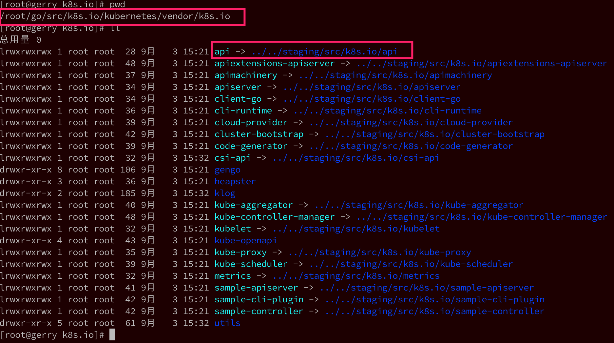

<!-- @import "[TOC]" {cmd="toc" depthFrom=1 depthTo=6 orderedList=false} -->

<!-- code_chunk_output -->

- [1. 环境准备](#1-环境准备)
  - [1.1. golang安装与配置](#11-golang安装与配置)
- [2. 源码下载](#2-源码下载)
- [3. 源码编译](#3-源码编译)

<!-- /code_chunk_output -->

# 1. 环境准备

操作系统：Linux作为k8s源码分析和调试环境, 这里使用CentOS；

## 1.1. golang安装与配置

见官网

```
# tar -C /usr/local -xzf go1.10.3.linux-amd64.tar.gz
```

golang相关：

- GOROOT=/usr/local/go, 指向golang的安装路径
- GOPATH=/root/go, 指向golang的工作空间
- Go version go1.10.3 linux/amd64

环境变量配置

```
# vim $HOME/.profile
export GOROOT=/usr/local/go
export PATH=$PATH:$GOROOT/bin
export GOPATH=/root/go
```

# 2. 源码下载

```
# mkdir -p /root/go/src/k8s.io
# cd /root/go/src/k8s.io
# git clone https://github.com/kubernetes/kubernetes.git
# git checkout -b release-1.13 origin/release-1.13
```

下载后本地目录

```
[root@gerry kubernetes]# ls
api                cmd                 LICENSE                   pkg                test
build              code-of-conduct.md  logo                      plugin             third_party
BUILD.bazel        CONTRIBUTING.md     Makefile                  README.md          translations
CHANGELOG-1.13.md  docs                Makefile.generated_files  SECURITY_CONTACTS  vendor
CHANGELOG.md       Godeps              OWNERS                    staging            WORKSPACE
cluster            hack                OWNERS_ALIASES            SUPPORT.md
```

# 3. 源码编译

我们先看一下几个主要的目录：

目录名 | 用途
----|---
cmd | 每个组件代码入口（main函数）
pkg | 各个组件的具体功能实现
staging | 已经分库的项目
vendor | 依赖

考虑到国内网络环境等因素，我们不使用容器化方式构建。我们尝试在kubernetes项目**cmd目录**下**构建一个组件**（执行路径：/root/go/src/k8s.io/kubernetes/cmd/kube\-scheduler）：

```
# cd /root/go/src/k8s.io/kubernetes/cmd/kube-scheduler
# ls
app  BUILD  OWNERS  scheduler.go
# go build .
# ls
app  BUILD  kube-scheduler  OWNERS  scheduler.go
# ll
总用量 51832
drwxr-xr-x 5 root root       80 9月   3 15:32 app
-rw-r--r-- 1 root root     1142 9月   3 15:32 BUILD
-rwxr-xr-x 1 root root 53062730 9月   3 15:45 kube-scheduler
-rw-r--r-- 1 root root       94 9月   3 15:32 OWNERS
-rw-r--r-- 1 root root     1505 9月   3 15:32 scheduler.go
```

这里需要注意一下，如果报**依赖错误**，找不到k8s.io下的某些项目，就到vendor下看一下**软链接是不是都还在**，如下：



注意到k8s是使用这种方式解决k8s.io下的依赖问题的，如果我们在windows下下载的代码，然后copy到linux下，就很容易遇到这些软链接丢失的情况，导致go找不到依赖，编译失败。

