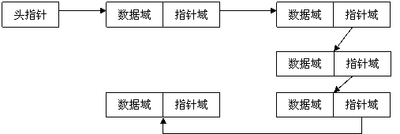
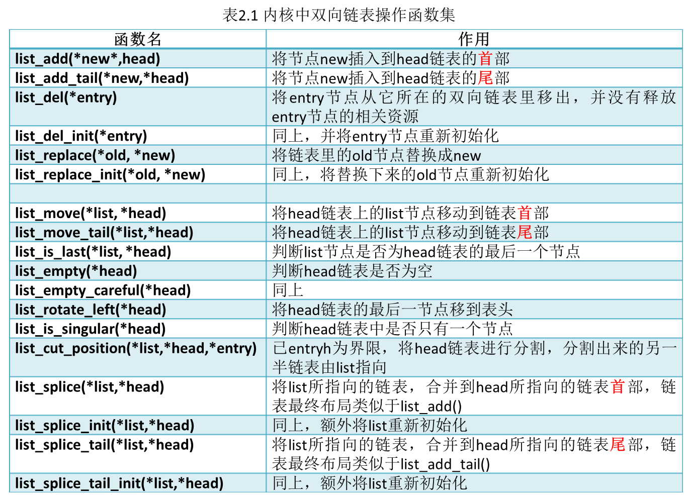
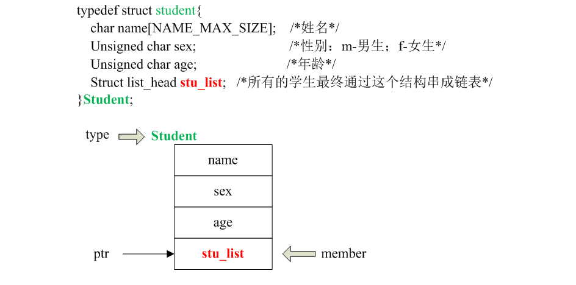
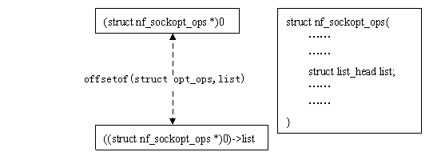
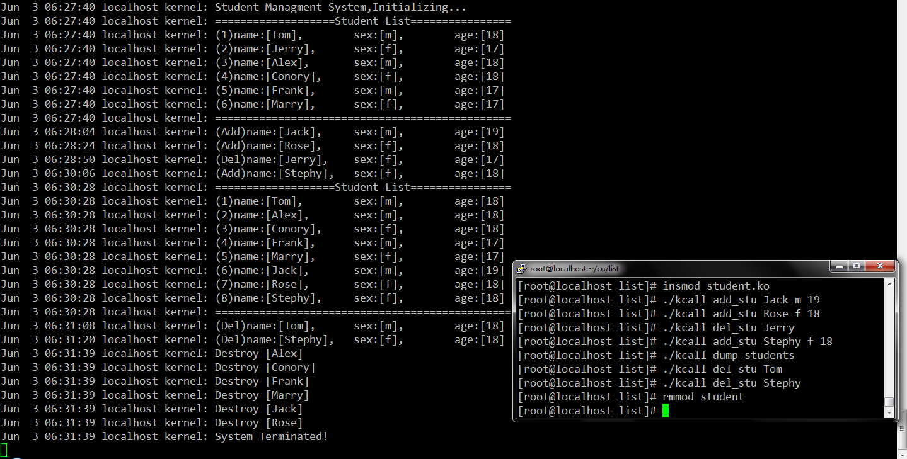
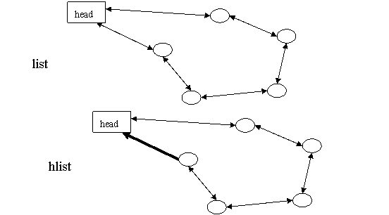

参考：  
https://www.ibm.com/developerworks/cn/linux/kernel/l-chain/index.html

http://blog.chinaunix.net/uid-23069658-id-4576255.html

https://www.linuxidc.com/Linux/2016-12/137929.htm

## 一、链表数据结构简介

链表具有更好的动态性，建立链表时无需预先知道数据总量，可以随机分配空间，可以高效地在链表中的任意位置实时插入或删除数据。链表的开销主要是访问的顺序性和组织链的空间损失。

链表分单向链表、双向链表，根据是否循环分为单向链表和循环链表。

链表中包含数据域和指针域。链表通常包含一个头结点，不存放数据，方便链表操作。

### 1. 单链表



```
typedef struct node
{
     ElemType data;      //数据域
     struct node *next;  //指针域
}node, *list;
```

单链表是最简单的一类链表，它的特点是仅有一个指针域指向后继节点（next），因此，对单链表的遍历只能从头至尾（通常是NULL空指针）顺序进行。

### 2. 双链表


通过设计前驱和后继两个指针域，双链表可以从两个方向遍历，这是它区别于单链表的地方。如果打乱前驱、后继的依赖关系，就可以构成"二叉树"；如果再让首节点的前驱指向链表尾节点、尾节点的后继指向首节点（如图2中虚线部分），就构成了循环链表；如果设计更多的指针域，就可以构成各种复杂的树状数据结构。

### 3. 循环链表

循环链表的特点是尾节点的后继指向首节点。前面已经给出了双循环链表的示意图，它的特点是从任意一个节点出发，沿两个方向的任何一个，都能找到链表中的任意一个数据。如果去掉前驱指针，就是单循环链表。

单向循环链表：


双向循环链表：


## 二、Linux内核链表数据结构的实现

Linux采用了一种更通用的设计，将链表以及其相关操作函数从数据本身进行剥离，这样使用链表的时候就不用自己去实现诸如节点的插入、删除、遍历等操作了。本文主要介绍基本链表结构，然后再简要介绍一下rcu和hlist。


### 1. 链表结构定义

链表结构定义如下所示：

```
struct list_head {
    struct list_head *next, *prev;
};
```

结构如下：


在2.6.21里这个数据结构定义在include/linux/list.h头文件里，但是后面内核里，以及后面要介绍的哈希链表的定义都放在include/linux/types.h头文件里。对链表来说内核的版本号几乎没什么影响。

list\_head结构包含两个指向list\_head结构的指针prev和next，由此可见，**内核的链表具备双向循环链表功能**，实际上，通常它都组织成双向循环链表。

和第一节介绍的双链表结构模型不同，这里的list\_head没有数据域。在Linux内核链表中，不是在链表结构中包含数据，而是在数据结构中包含链表节点。

在数据结构课本中，链表的经典定义方式通常是这样的（以单链表为例）：

```
struct list_node {
    struct list_node *next;
    ElemType    data;
};
```
需要用链表结构时，只需要在结构体中定义一个链表类型的数据即可。例如定义一个student链表，

```
#define NAME_MAX_SIZE 32

typedef struct student{
    char name[NAME_MAX_SIZE];    /*姓名*/
    unsigned char sex;              /*性别：m-男生；f-女生*/
    unsigned char age;              /*年龄*/
    struct list_head stu_list;  /*所有的学生最终通过这个结构串成链表*/
}Student;
```

### 2. 初始化链表

```
#define LIST_HEAD_INIT(name) { &(name), &(name) }

#define LIST_HEAD(name) \
    struct list_head name = LIST_HEAD_INIT(name)

static inline void INIT_LIST_HEAD(struct list_head *list)
{
    list->next = list;
    list->prev = list;
}
```

static 加在函数前，表示这个函数是静态函数，其实际上是对作用域的限制，指该函数作用域仅局限于本文件。所以说，static 具有信息隐蔽的作用。而函数前加inline关键字的函数，叫内联函数，表示编译程序在调用这个函数时，立即将该函数展开。

LIST\_HEAD宏创建一个链表头结点，并用LIST\_HEAD\_INIT宏对头结点进行赋值，使得头结点的前驱和后继指向自己。这样，我们就有了一个空链表，因为Linux用头指针的next是否指向自己来判断链表是否为空(下面代码)。

INIT\_LIST\_HEAD函数对链表进行初始化，使得前驱和后继指针指针指向头结点。

如果我们要**定义一个名为student\_list的链表**，直接LIST\_HEAD(student\_list)就可以了，展开后等价于下面的代码：

```
struct list_head student_list= { &(student_list), &(student_list) };
```

跟内核通知链类似，如果我们已经有了一个链表对象student\_list，INIT\_LIST\_HEAD()接口可以对它初始化。

所以，LIST\_HEAD(student\_list)代码和下面的代码是等价的：

```
struct list_head student_list；
INIT_LIST_HEAD (&student_list);
```

那么在写代码时，如果是通过kmalloc之类的函数动态创建节点，我们就可以用下面代码对链表节点进行初始化：

```
Student *stu1;
stu1 = kmalloc(sizeof(*stu1), GFP_KERNEL);
strcpy(stu1->name,”xiaoming”);
stu1->sex = ‘m’;
stu1->age = 18;
INIT_LIST_HEAD(&stu1-> stu_list); /*和下面的用法注意区别*/
```

如果是静态定义结构体变量的话就更简单了：

```
Student stu2={
    .name={“xiaohong”},
    .sex=’f’,
    .age=18,
    .stu_list = LIST_HEAD_INIT(stu2.stu_list); /*和上面的用法注意区别*/
};
```

有了数据节点，接下来就要对其进行操作了，内核提供了一组常用接口用于对双向链表操作，如下。




需要注意的是，上述所有链表操作函数的入参都是struct list\_head{}的指针类型，这一点需要时刻牢记在心。

还有关于链表的分割list\_cut\_position(\*list,\*head,\*entry)以及合并list\_splice(\*list,\*head)、list\_splice\_init (\*list,\*head)、list\_splice\_tail (\*list,\*head)、list\_splice\_tail\_init (\*list,\*head)这几个API。

通过上面的图我们可以看出来，在内核中当我们提及链表头的时候其实并没有牵扯到我们自己的结构体数据本身，**链表头的next所指向的节点才是真正意义上的“链表头节点”，prev所指向的节点叫做“链表尾节点”**。注意，不要把链表头和链表的头节点混为一谈。有了这个认识之后，我们就知道如果链表头的next和prev都指向链表头本身的话，那么这个链表其实就是空的，例如list\_empty()或者list\_empty\_careful()所做的事情就是给定一个链表头，判断其是否为空，即是否包含任何有效的数据节点。同样地，如何判断链表是否只有一个节点呢？看看list\_is\_singular()的实现。

### 3. 插入结点

对链表的插入操作有两种：在表头插入和在表尾插入。Linux为此提供了两个接口：

```
static inline void list_add(struct list_head *new, struct list_head *head);
static inline void list_add_tail(struct list_head *new, struct list_head *head);

static inline void __list_add(struct list_head *new,
                  struct list_head *prev,
                  struct list_head *next)
{    
    next->prev = new;
    new->next = next;
    new->prev = prev;
    prev->next = new;
}    

static inline void list_add(struct list_head *new, struct list_head *head)
{    
    __list_add(new, head, head->next);                                                          
}    
    
static inline void list_add_tail(struct list_head *new, struct list_head *head)
{    
    __list_add(new, head->prev, head);
}    

```

在表头插入是插入在head->next指向的结点，而在表尾插入是插入在head->prev指向的尾部结点。

### 4. 删除结点

```
static inline void __list_del(struct list_head * prev, struct list_head * next)
{    
    next->prev = prev;
    prev->next = next;
}    

static inline void __list_del_entry(struct list_head *entry)
{    
    __list_del(entry->prev, entry->next);
}    
     
static inline void list_del(struct list_head *entry)
{    
    __list_del(entry->prev, entry->next);
    entry->next = LIST_POISON1;
    entry->prev = LIST_POISON2;
}    

#define LIST_POISON1  ((void *) 0x100 + POISON_POINTER_DELTA)                               
#define LIST_POISON2  ((void *) 0x200 + POISON_POINTER_DELTA)
```

从链表中删除一个节点，需要改变该节点前驱节点的后继结点和后继结点的前驱节点。最后设置该节点的前驱节点和后继结点指向LIST\_POSITION1和LIST\_POSITION2两个特殊值，这样设置是为了保证不在链表中的节点项不可访问，对LIST\_POSITION1和LIST\_POSITION2的访问都将引起页故障。与之相对应，list\_del\_init()函数将节点从链表中解下来之后，调用LIST\_INIT\_HEAD()将节点置为空链状态。

### 5. 移动结点

Linux提供了将原本属于一个链表的节点移动到另一个链表的操作，并根据插入到新链表的位置分为两类：

```
static inline void list_move(struct list_head *list, struct list_head *head)
{  
    __list_del_entry(list);
    list_add(list, head);
}  

static inline void list_move_tail(struct list_head *list,
                  struct list_head *head)
{  
    __list_del_entry(list);
    list_add_tail(list, head);
}
```

move将一个节点移动到头部或者尾部。

例如list\_move(&new\_sockopt.list,&nf\_sockopts)会把new\_sockopt从它所在的链表上删除，并将其再链入nf\_sockopts的表头。

### 6. 判断链表

```
static inline int list_is_last(const struct list_head *list,
                const struct list_head *head)
{  
    return list->next == head;
}  

static inline int list_empty(const struct list_head *head)
{  
    return head->next == head;
}
```

list\_is\_last函数判断节点是否为末尾节点，list\_empty判断链表是否为空。

### 7. 合并链表

Linux链表还提供了整个链表的插入功能：

```
static inline void list_splice(struct list_head *list, struct list_head *head);

static inline void __list_splice(const struct list_head *list,
                 struct list_head *prev,
                 struct list_head *next)
{   
    struct list_head *first = list->next;
    struct list_head *last = list->prev;
    
    first->prev = prev;
    prev->next = first;
    
    last->next = next;
    next->prev = last;
}   
    
static inline void list_splice(const struct list_head *list,
                struct list_head *head)
{   
    if (!list_empty(list))
        __list_splice(list, head, head->next);
}   

```

假设当前有两个链表，表头分别是list1和list2（都是struct list\_head变量），当调用list\_splice(&list1,&list2)时，只要list1非空，list1链表的内容将被挂接在list2链表上，位于list2和list2.next（原list2表的第一个节点）之间。新list2链表将以原list1表的第一个节点为首节点，而尾节点不变。如图（虚箭头为next指针）：

链表合并list\_splice(&list1,&list2)

当list1被挂接到list2之后，作为原表头指针的list1的next、prev仍然指向原来的节点，为了避免引起混乱，Linux提供了一个list\_splice\_init()函数：

```
static inline void list_splice_init(struct list_head *list, struct list_head *head);
```

该函数在将list合并到head链表的基础上，调用INIT\_LIST\_HEAD(list)将list设置为空链。

### 8. 遍历

前面的操作入参全是struct list\_head类型。链表的遍历是链表最经常的操作之一，为了方便核心应用遍历链表，Linux链表将遍历操作抽象成几个宏。在介绍遍历宏之前，我们先看看如何从链表中访问到我们真正需要的数据项。

#### a)	由链表节点到数据项变量

Linux链表中仅保存了数据项结构中list\_head成员变量的地址，那么我们如何通过这个list\_head成员访问到作为它的所有者的**节点数据**呢？Linux为此提供了一个list\_entry(ptr,type,member)宏，其中ptr是指向该数据中list\_head成员的指针，也就是存储在链表中的地址值，type是数据项的类型，member则是数据项类型定义中list\_head成员的变量名，它完全是container\_of(ptr, type, member)的一个别名而已。container\_of()就是根据type类型结构体中的member成员的指针ptr，反身找到该member所在结构体对象的type首地址。如图：



此时的用法就变成下面这样子：


list\_entry的实现如下：

```
#define list_entry(ptr, type, member) container_of(ptr, type, member)

container_of宏定义在[include/linux/kernel.h]中：
#define container_of(ptr, type, member) ({          \
        const typeof( ((type *)0)->member ) *__mptr = (ptr); \
        (type *)( (char *)__mptr - offsetof(type,member) );})
        
offsetof宏定义在[include/linux/stddef.h]中：
#define offsetof(TYPE, MEMBER) ((size_t) &((TYPE *)0)->MEMBER)
```

size\_t最终定义为unsigned int（i386）。

这里使用的是一个利用编译器技术的小技巧，即先求得结构成员在与结构中的偏移量，然后根据成员变量的地址反过来得出属主结构变量的地址。

container\_of()和offsetof()并不仅用于链表操作，这里最有趣的地方是((type *)0)->member，它将0地址强制"转换"为type结构的指针，再访问到type结构中的member成员。在container_of宏中，它用来给typeof()提供参数（typeof()是gcc的扩展，和sizeof()类似），以获得member成员的数据类型；在offsetof()中，这个member成员的地址实际上就是type数据结构中member成员相对于结构变量的偏移量。

offsetof()宏的原理:



对于给定一个结构，offsetof(type,member)是一个常量，list\_entry()正是利用这个不变的偏移量来求得链表数据项的变量地址。

#### b)	遍历宏

上面使用了list\_for\_each，宏定义如下，使用方式如上。

```
#include/linux/list.h

#define list_for_each(pos, head) \
    for (pos = (head)->next; pos != (head); pos = pos->next)
```

它实际上是一个for循环，利用传入的pos作为循环变量，从表头head开始，逐项向后（next方向）移动pos，直至又回到head。

如果每次要遍历链表时既要定义临时的struct list\_head{}指针变量，又要定义目标结构体对象指针变量，总感觉些许不爽。于是：

```
list_for_each_entry(pos, head, member)

#define list_for_each_entry(pos, head, member)  \
    for (pos = list_entry((head)->next, typeof(*pos), member);  \
         &pos->member != (head);    \
         pos = list_entry(pos->member.next, typeof(*pos), member))
```

参数pos和member意义没有变，而head则指向我们要遍历的链表首地址，这样一来开发者不用再自己定义struct list\_head{}类型临时指针变量，只要需要自己定义一个的目标数据结构的临时指针变量就可以了：

```
LIST_HEAD(student_list);
struct student *st;
list_for_each_entry(st, &student_list, stu_list){
    //Todo here … …
}
```

此时指针变量st，就相当于for循环的游标变量i了。

当然，内核能感知的远不止于此，还有一个名为list\_for\_each\_entry\_reverse(pos, head, member)的宏，用于对双向链表的逆向遍历，参数的意义和list\_for\_each\_entry()完全一样，区别在它是对链表从尾部到首部进行依次遍历。该接口主要是为了提高链表的访问速度，考虑两种情况：

- 第一，如果你明确知道你要访问的节点会出现在链表靠后的位置；

- 第二，如果你需要用双向链表实现一个类似于“栈”的数据结构；

针对以上两种需求，相比于list\_for\_each\_entry()，list\_for\_each\_entry\_reverse()的速度和效率明显优于前者。

与list\_for\_each()对应的反向遍历函数是list\_for\_each\_prev()。

如果遍历不是从链表头开始，而是从已知的某个节点pos开始，则可以使用list\_for\_each\_entry\_continue(pos,head,member)。有时还会出现这种需求，即经过一系列计算后，如果pos有值，则从pos开始遍历，如果没有，则从链表头开始，为此，Linux专门提供了一个list\_prepare\_entry(pos,head,member)宏，将它的返回值作为list\_for\_each\_entry\_continue()的pos参数，就可以满足这一要求。

如果要在遍历过程中删除：

```
#define list_for_each_entry_safe(pos, n, head, member)          \  
    for (pos = list_entry((head)->next, typeof(*pos), member),  \
        n = list_entry(pos->member.next, typeof(*pos), member); \
         &pos->member != (head);                    \
         pos = n, n = list_entry(n->member.next, typeof(*n), member))
```

n很明显应该是pos指针所指元素的下一个节点的地址，注意，pos和n都是目标结构体的类型，而非struct list_head{}类型，本例中它们都是struct student{}类型的指针。

```
LIST_HEAD(student_list);
struct student *st,*next;
list_for_each_entry_safe (st, next, &student_list, stu_list){
    //在这里可以对st所指向的节点做包括删除在内的任意操作
    //但千万别操作next，它是由list_for_each_entry_safe()进行维护的
}
```

不用多想，肯定也存在一个名为list\_for\_each\_entry\_safe\_reverse(pos, n, head, member)的宏。简单小节一下：
   
- 1)、list\_for\_each\_entry()和list\_for\_each\_entry\_reverse()，如果只需要对链表进行遍历，这两个接口效率要高一些；

- 2)、list\_for\_each\_entry\_safe()和list\_for\_each\_entry\_safe\_reverse()，如果遍历过程中有可能要对链表进行删除操作，用这两个；

其他的list.h源码里面无论是注释还是实现都相当明确。


## 三、实践

说了老半天，还是操练几把感受感受，模拟训练之“内核级精简版学生管理系统”：

头文件student.h长相如下：

```
/*student.h*/
#ifndef __STUDENT_H_
#define __STUDENT_H_

#include <linux/list.h>
#define MAX_STRING_LEN 32
typedef struct student
{
        char m_name[MAX_STRING_LEN];
        char m_sex;
        int m_age;
        struct list_head m_list;  /*把我们的学生对象组织成双向链表，就靠该节点了*/
}Student;
#endif
```

源文件student.c长相：

```
#include <linux/module.h>
#include <linux/kernel.h>
#include <linux/init.h>

#include "student.h"

MODULE_LICENSE("Dual BSD/GPL");
MODULE_AUTHOR("Koorey Wung");

static int dbg_flg = 0;

LIST_HEAD(g_student_list);

static int add_stu(char* name,char sex,int age)
{
        Student *stu,*cur_stu;

        list_for_each_entry(cur_stu,&g_student_list,m_list){ //仅遍历是否有同名学生，所以用该接口
                if(0 == strcmp(cur_stu->m_name,name))
                {
                        printk("Error:the name confict!\n");
                        return -1;
                }
        }

        stu = kmalloc(sizeof(Student), GFP_KERNEL);
        if(!stu)
        {
                printk("kmalloc mem error!\n");
                return -1;
        }

        memset(stu,0,sizeof(Student));
        strncpy(stu->m_name,name,strlen(name));
        stu->m_sex = sex;
        stu->m_age = age;
        INIT_LIST_HEAD(&stu->m_list);

        if(dbg_flg)
                printk("(Add)name:[%s],\tsex:[%c],\tage:[%d]\n",stu->m_name,stu->m_sex,stu->m_age);

        list_add_tail(&stu->m_list,&g_student_list); //将新学生插入到链表尾部，很简单吧

        return 0;
}
EXPORT_SYMBOL(add_stu);    //导出该函数，后面我们要在其他模块里调用，为了便于测试，下面其他借个接口类似

static int del_stu(char *name)
{
        Student *cur,*next;
        int ret = -1;
        list_for_each_entry_safe(cur,next,&g_student_list,m_list){  //因为要删除链表的节点，所以必须有带有“safe”的宏接口
                if(0 == strcmp(name,cur->m_name))
                {
                        list_del(&cur->m_list);
                                printk("(Del)name:[%s],\tsex:[%c],\tage:[%d]\n",cur->m_name,\
                                        cur->m_sex,cur->m_age);
                        kfree(cur);
                        cur = NULL;
                        ret = 0;
                        break;
                }
        }
        return ret;
}
EXPORT_SYMBOL(del_stu);

static void dump_students(void)
{
        Student *stu;
        int i = 1;
        printk("===================Student List================\n");
        list_for_each_entry(stu,&g_student_list,m_list){  //同样，也仅遍历链表而已
                printk("(%d)name:[%s],\tsex:[%c],\tage:[%d]\n",i++,stu->m_name,\
                        stu->m_sex,stu->m_age);
        }
        printk("===============================================\n");
}
EXPORT_SYMBOL(dump_students);

static void init_system(void)
{
        /*初始化时，向链表g_student_list里添加6个节点*/
        add_stu("Tom",'m',18);
        add_stu("Jerry",'f',17);
        add_stu("Alex",'m',18);
        add_stu("Conory",'f',18);
        add_stu("Frank",'m',17);
        add_stu("Marry",'f',17);
}

/*因为没有数据库，所以当我们的模块退出时，需要释放内存*/
static void clean_up(void)
{
        Student *stu,*next;
        list_for_each_entry_safe(stu,next,&g_student_list,m_list){
                list_del(&stu->m_list);
                printk("Destroy [%s]\n",stu->m_name);
                kfree(stu);
        }
}

/*模块初始化接口*/
static int student_mgt_init(void)
{
        printk("Student Managment System,Initializing...\n");

        init_system();
        dbg_flg = 1;   //从此以后，再调用add_stu()时，都会有有内核打印信息，详见实例训练
        dump_students();

        return 0;
}

static void student_mgt_exit(void)
{
        clean_up();
        printk("System Terminated!\n");
}

module_init(student_mgt_init);
module_exit(student_mgt_exit);
```

Makefile：

```
obj-m += student.o tools.o
CURRENT_PATH:=$(shell pwd)
LINUX_KERNEL:=$(shell uname -r)
LINUX_KERNEL_PATH:=/usr/src/kernels/$(LINUX_KERNEL)
all:
        make -I. -C $(LINUX_KERNEL_PATH) M=$(CURRENT_PATH) modules
clean:
        make -I. -C $(LINUX_KERNEL_PATH) M=$(CURRENT_PATH) clean
```

其中tools.c是一个辅助模块，用于实现从用户空间直接调用调用内核空间EXPORT\_SYMBOL出来的任意一个API接口，比如add\_stu()、del\_stu()或者dump\_students()等等。OK，万事俱备，只欠东风，一条make命令下去，然后好戏正式开始：



总的来说，Linux内核链表的使用还算比较简单基础，是内核学习的入门必修课。当然实际项目中，对链表进行插入或者删除时如果有同步或者互斥需求，则需要采用诸如互斥锁之类的内核保护手段，防止对链表操作时出现竞争冒险现象。

## 四、扩展

### 1. hlist



双头（next、prev）的双链表对于HASH表来说"过于浪费"，因而另行设计了一套用于HASH表应用的hlist数据结构--单指针表头双循环链表，从上图可以看出，hlist的表头仅有一个指向首节点的指针，而没有指向尾节点的指针，这样在可能是海量的HASH表中存储的表头就能减少一半的空间消耗。

因为表头和节点的数据结构不同，插入操作如果发生在表头和首节点之间，以往的方法就行不通了：表头的first指针必须修改指向新插入的节点，却不能使用类似list\_add()这样统一的描述。为此，hlist节点的prev不再是指向前一个节点的指针，而是指向前一个节点（可能是表头）中的next（对于表头则是first）指针（struct list_head \*\*pprev），从而在表头插入的操作可以通过一致的"\*(node->pprev)"访问和修改前驱节点的next（或first）指针。

### 2. read-copy update

RCU（Read-Copy Update）是2.5/2.6内核中引入的新技术，它通过延迟写操作来提高同步性能。在内核中以“\_rcu”结尾的宏多为功能接口。

RCU技术的核心是写操作分为写-更新两步，允许读操作在任何时候无阻访问，当系统有写操作时，更新动作一直延迟到对该数据的所有读操作完成为止。Linux链表中的RCU功能只是Linux RCU的很小一部分，对于RCU的实现分析参照其他内容。

## 五、总结

链表 <linux/list.h>

- Linux内核的标准链表就是采用“环形、双向”链表形式实现
- 沿着链表移动智能是线性移动
- 需要随机访问的数据，一般不使用链表
- 链表存放数据的理想情况是：需要遍历所有数据、或者需要动态加入/删除数据
- 有时首元素会用一个特殊的指针表示，称为“头指针”，可以方便的找到链表的“起始端”
- Linux内核实现特殊性：不是将数据结构塞入链表，而是将链表结点塞入数据结构
- Linux内核链表操作函数的复杂度都是O（1），而不管链表中元素数目的多少
    - list_add\__list_add
    - list_add_tail\__list_add_tail
    - list_del\__list_del
    - list_del_init\__list_del_init
    - list_move\__list_move
    - list_move_tail\__list_move_tail
    - list_empty\__list_empty
    - list_entry\__list_entry
    - list_splice\__list_splice
    - list_splice_init\__list_splice_init

- Linux内核遍历链表的复杂度是O（n），n是链表元素数目
    - list_for_each
    - list_for_each_entry
    - list_for_each_entry_reverse 反向遍历链表，有二原因：①当反向遍历性能好时；②当遍历顺序很重要时；
    - list_for_each_entry_safe 该函数允许在遍历链表循环体中删除元素，普通遍历函数不允许这样做
    - list_for_each_entry_safe_reverse
- 链表操作函数分为外部函数、内部函数，函数同名，只差双下划线__，内部函数用prev、next参数

