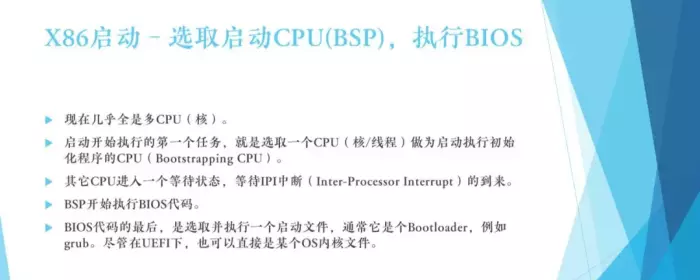
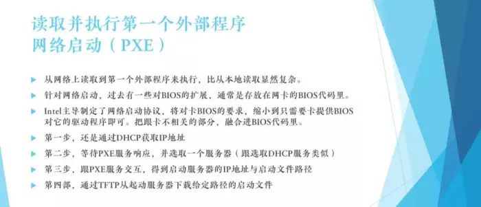
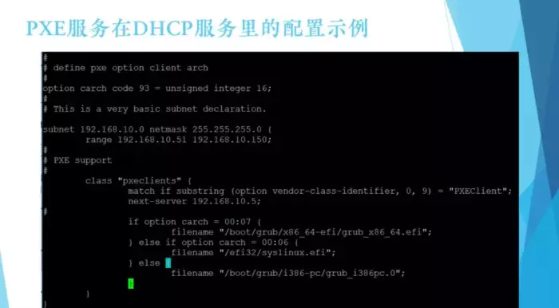

一个计算机的启动，最主要就是CPU的启动。CPU启动就是把这个CPU的里边的各个寄存器设置到一个已知的、固定的状态，并且从这里开始执行。

01 指针启动

如下图的右边这有几个就是 X86 的话的一些比较清晰可见的寄存器，其中最重要的是 EIP，即指令指针。

指令指针就表示它要执行的下一个指令，当我们 CPU 一发生 Reset 以后，这个EIP作为一个固定的值，就会从这里开始执行，这里通常是 BIOS 的程序。

X86 的 CPU 有三种启动方式：

第一种是加电启动

第二种是 Reset

第三个是 INIT

加电启动和 Reset 非常类似，不但把右边的这些值都设到一个固定的状态，我们还把CPU其它的很多寄存器都设置到一个已知的固定的状态。

那么INIT不同呢？它仅仅是把右边的这些设置到一个固定的已知的状态，其它的寄存器它基本上保持不动。目的就是为了你启动完之后还能读原来寄存器里的东西。这些寄存器主要是记录了一些上一次启动的CPU错误状态，这样我们可以以此来做诊断。

现在说Power On 通常叫做冷启动，Reset 我们通常叫做热启动，它俩是基本一致，但是 INIT 就很不同，但是总体上来说，它还是从CPU一个固定的状态开始执行程序，X86 Reset之后，它就处于一个 Real Address 模式。

这个讲起来话长，因为 X86 的历史比较悠久，从80、86、80、88 ，它现在有Real Address模式有protect模式，还有现在X86 64模式，Reset 之后它一定是处于 Real Address 模式，每个CPU被Reset之后，它从一个固定的地方开始执行。

第一个通常是它要执行一个协议，选取一个CPU来执行，其他CPU都等待，我们要选取一个所谓主CPU（其实它的标准术语叫Bootstrapping CPU），就是说选完了之后，只有主CPU继续执行，其它都进入一个等待状态，就是等待所有的其它CPU都等待这个BSP给它发指令，它再开始继续执行。

BSP选出来之后，它就开始执行BIOS代码，这个BIOS代码通常我们又叫它POST过程，它相当于机器一个自检，当机器自检完了 ，BIOS走完了之后，它要做的一件事情就是要找到一个文件，并且把它读到内存里，然后开始执行它。

这个时候我们认为post自检完了，要开始读取并执行第一个外部程序，一般叫它Boot Load，那么它这个如何找到并读取并执行它呢？

第一个问题主要是找到并读取它，这里又分几种，比如

从光盘启动

从网络启动

Legacy BIOS模式启动

UEFI模式启动

Legacy BIOS 启动

Legacy BIOS一般都从某个硬盘上启动，通常在过去这个叫C盘，因为过去只有一个盘叫C盘，现在当然磁盘很多了，你还是要指定一个启动盘，从哪个卡上的哪个盘来启动。

如果是指定了，它就读你指定的盘，这个硬盘的同一个扇区，512字节。读进来之后，首先检查扇区的标记，标记这块盘是不是可以启动的，如果标记它不是可以启动的，那么它会报告一个错误，大概就是找不到启动盘之类。

如果标记的它是可以启动的一个硬盘，那么它就会开始执行，当然了这时候这个扇区的内容已经在内存里了，它就开始执行从0开始一个446字节长度的这个小程序，当然了我们看这个程序很小，所以它其实它还要想办法，读到另外一个更大的程序，才能够把我们说的Boot Load，比如说Grub完完全全加载起来，光446字节肯定是不行的。

UEFI BIOS 启动

UEFI BIOS会好一点，它主板上记录的是一个启动文件路径，这个启动文件路径就是某个盘某个分区里面的某个文件，这个分区是什么文件系统呢？通常它是FAT32文件系统，又叫ESP文件系统。

如果UEFI想启动，一定存在这么一个分区，它有这么一个FAT文件系统，然后在里面有某一个程序，都是写在NVRAM里头，我们叫做启动项，它把那个程序读进来，执行它。

这样看UEFI肯定比Legacy要好多了。Legacy第一步你必须是446字节的那个，UEFI一下子可以把整个文件读进来，不需要分几步来做。

光盘启动

从光盘启动是怎么启动呢？光盘在Legacy模式下，它有一个读一个特殊的记录，这个记录标注它是启动记录，这个启动记录可以任意的，没有过去光盘446字节的限制了。

所以说其实尽管在Legacy模式下，从CD上启动它也要容易一些，因为它就是读固定的记录，记录一个任意大的文件，读进来直接执行。

如果在UEFI下它也是一个启动记录，但是这个记录本身，并不是一个文件，它是一个文件系统的镜像。这个文件系统有啥东西呢？可能主要有启动文件。

为什么UEFI跟Legacy启动模式的不一样呢，在理论上来说它需要区分，你是Legacy BIOS，你就读那一个记录，那个记录就是个文件，直接读取来执行它。那如果你是UEFI，那你就找到FAT32的镜像，这里面有文件，然后你把它读进来执行。

不管是Legacy还是UEFI BIOS，如果都不行，还可以从网络启动，从网络启动也是要首先要找到并且把一个启动文件读进来，那么这里它就稍微费劲一点。

网络启动

网络启动最早功能全部写在网卡里，也就是说每个网卡厂商都自己写了一段从网络的启动的程序，然后把它烧在网卡里，后来有UEFI之后，Intel就主导制定了一个PXE协议，这个PXE其实就是把这些网络启动要用的公共的东西，纳入到了BIOS功能里。

比如说TCP-IP、TFTP、DHCP，这些东西跟网卡没有关系，网卡要做的就是收发报而已。

PXE协议分四步：

第一步，必须有DHCP，先发DHCP包，我要取得IP地址，才能做后面的事情，如果你是想启动的话，在DHCP包里面还附加了很多东西，附加了一些标记。

第二步，在包发出去之后，看到这个标记的人，如果他能提供PXE服务，也会响应关于PXE的东西。

PXE响应它什么呢？有几个IP地址，这几个地址是可以提供启动服务的，而且每个IP地址它什么文件，都可以告诉你。

最后一步，有了启动服务器的地址和我要启动的文件，那么我就通过TFTP从这个服务器下载这个文件就可以了。

下面这是一档例子，在标准的DHCP服务里，附带提供PXE支持，它支持在哪呢：首先它检视DHCP包里面是不是包含这个字段，如果包含这个字段，就告诉你启动服务器是谁，你去跟他找启动文件。

光告诉你启动服务器是谁还不行，还必须告诉你启动文件是啥，启动文件根据机型不同它是有区别的，比如你是启动Power PC，还要启动mips，还要启动SUN的SPARC。

02 启动Linux需要什么

光是X86就有三种架构，一种是64位的UEFI，一种是32位的UEFI，另外一种就是老的i386的PC模式，叫做Legacy BIOS模式。

所以根据包里面告诉我的架构不同，就反馈你文件名，不同的文件名给你，等于交互完之后就得到两个：一个是不同IP地址，一个是文件名。通过TFTP给它下载下来开始执行就好了。后面的就跟从硬盘上是一样的了。

如果是启动Linux呢？Linux现在需要什么东西？

Linux 只需要两个东西（当然了其实它是需要三个东西），但文件只需要两个：一个是内核文件，一个叫做INITRAMFS文件。

我们都知道内核文件肯定需要，任何一个操作系统起来都必须先把内核设置好，启动好。

INITRAMFS是一个给Linux用作根的一个文件，大家知道Unix启动一定需要有一个根文件系统，这个Unix才能够运行。如果在内核启动的时候，到最后找不到这个根文件系统就会启动失败。

有了INITRAMFS文件之后，Linux内核的启动过程中会展开INITRAMFS文件。这个文件其实就是一个CPIO包，它把这个包展开到它的内存里，在展开的内存里会看到目录架构，会有文件，它就到这一块区域当作它的根。

也就是说无论如何，内核文件+INITRAMFS文件一定能够启动一个小Linux。

什么叫小Linux，因为INITRAMFS不可能很大，一般几十兆，所以它启动起来之后，它就是一个完完全全放在内存里的Linux，它小是因为这个文件大小受到了限制，那么内核文件加上INITRAMFS展开后，把它作为一个根文件系统，这就是一个小的全部在内存里的Linux。

麻雀虽小，五脏俱全，有内存和输入输出，就可以做任何事情，所以它适合做一些工具类的东西，安装肯定是也通过它就可以继续安装，比如往硬盘上装东西或者做外设的配置更改、FW升级等，它非常适合做一次性的工作。

我们通常用一个Live Image来启动这样一个Linux，当然它稍微比这个还复杂一点，但是基本上还是一个完完全全在内存里的小Linux，启动完后把U盘拿走也没有任何问题。

当然我们大部分的情况下启动可能不仅仅是想启动一个内核里的小Linux。

比如当前我有一个硬盘，硬盘上放了一个很大的Linux，几十个G，想启动这个系统就根据启动Grub的参数，叫root=什么什么，这时候这个小Linux就会找这个root，root找到了之后（通常它是一个硬盘上的一个分区的一个文件系统），我们给mount到一个目录下面，因为当前已有根，只不过这个根完完全全是个内存文件系统，我们可能会创建一个目录叫newroot，然后把你制定的这个根mount到这个newroot下面。

mount好后把其它的进程都终止掉，然后把当前这个根里面的基本上所有其它文件都删掉释放内存。但newroot必须保留，因为Newroot挂载的新的根文件系统，到最后就执行一个操作叫switch_root，把这个newroot变为根再执行根里面的INIT，就完成拉起来了一个新的Linux，即硬盘上的Linux。

在这里内核启动的时候已经固定了，也就是说我们拉起来的这个硬盘上的Linux，一定要跟我当前的内核是兼容的，那么安装完系统以后，刚开始启动的内核到最后切换到根上，拉起来的这个大的Linux一定是相同内核的，否则就会有兼容性的问题。

这就是如何启动一个硬盘上的大Linux或在网络上的一个大Linux，或者是任何其它的比如U盘上的Linux环境你也可以给它拉起来。

当然如果在U盘上的Linux我建议你直接用全部在内存里的Linux，没必要再拉一次在网络上的或者是在硬盘上的。INITRAMFS不可能放得下所有东西。

一般还有一个二次的，就是拉起来Linux在中间的过程，可以说基本上除了内核没变，其它的环境都变掉了，这就是启动一个完整的Linux。

03 另类的启动：KEXEC

下面我们介绍一下另类的启动。

Linux还有一种启动方式叫做KEXEC，KEXEC本来是一个Linux的内核的这个开发者，因为他们经常修改内核，修改完了之后要重启看看，每一次重启都要经过一个CPU的Reset的冷启动也好，热启动也好，那是很痛苦的事情。

因为Reset这个CPU之后一定先走BIOS，BIOS走完了最后走Grub，最后有个Boot Load，Grub走完了才启动Linux，因为嫌这个很烦，他们就开发了一个东西，就是在当前的Linux下，我突发奇想，想换一个新内核，他就用这个KEXEC先把一个内核加进来然后跳转到新内核里，相当于执行了一次Linux重启，但是注意跳过了前面的POST和Grub。

这就是那位开发人员懒就开发了一个这个功能，这个功能确实能省很多时间。

如果你要想让内核能够这么加载的话就有一个要求，要求Position Independent Code这段代码可以再任意加载到任意地址，如果不能加载到任意地址的话，就要求固定地址。

那在当前内核如何加载另外一个内核？跟冷启动一样其实有三样东西，一个是内核文件，先把它加进来，然后INITRAMFS文件也加进来，然后启动参数主要是指根，总的来说这个KEXEC是一个非常奇妙的启动Linux方式。大家可以试一下在自己Linux上用它来试一下。

04 Linux kdump模式

最后我们要讲一下Linux kdump模式，紧密依赖KEXEC的模式的dump非常重要。

dump是什么？

就是应用CRASH掉的时候，应用当时占的内存的所有的内容，然后分析应用在哪里CRASH掉了。系统也一样，当Linux系统出了某种错误，哪怕是硬件出了某种错误进行不下去的时候怎么诊断它，我们需要把它当前的内存的内容全拷贝下来。

如何拷贝呢？

在CRASH的时候，如果没有kdump来支持，CRASH就hung在那了，如果启动了kdump，在启动内核，生产系统内核的时候，有一个参数叫 Crashkernel，Crashkernel等于多少多少，就是预留一块内存给这个kdump的kernel dump内核转储用。预留完后，当生产系统起来，它的一个服务就是把kdump所用的内核加载到这块预留的区域里。

为什么要这样做呢？

因为系统CRASH的时候再加载内核好像有问题，其实CRASH这些问题啥都做不了，内核已经没法加载了，动都动不了了，就一定要在生产系统刚起的时候预留一块区域，这块区域谁都不能使用，然后把一个内核加在里面，INITRAMFS加在里面，那些参数也加在里面，这样当这个生产内核跑着跑着要CRASH了，如果这个区域都设置好了它就会直接跳转到这个区域里新的内核里，开始新的内核新的一个Linux环境的启动。

这个Linux环境会限制在预留的区域里，在预留的区域里启动完之后，它要做的事情就是第一，把前一个环境的比如说100个G也好200个G也好的内容拷贝出来，拷贝到指定的某一个磁盘的目录下，这就是kdump。

Kdump确实是非常好的想法，它依赖于KEXEC，KEXEC是一个快速的Linux启动，很多程序员不耐烦那个POST的过程太长，Kdump很好的解决了这个问题。

参考

https://mparticle.uc.cn/article.html?uc_param_str=frdnsnpfvecpntnwprdssskt&btifl=100&app=uc-iflow&title_type=1&wm_id=3dfaa1bc8e644810bd6347e56039d01c&wm_cid=307737783892445184&pagetype=share&client=&uc_share_depth=1